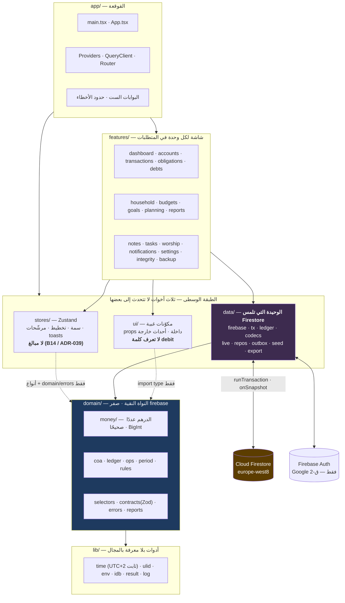
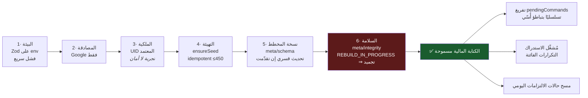
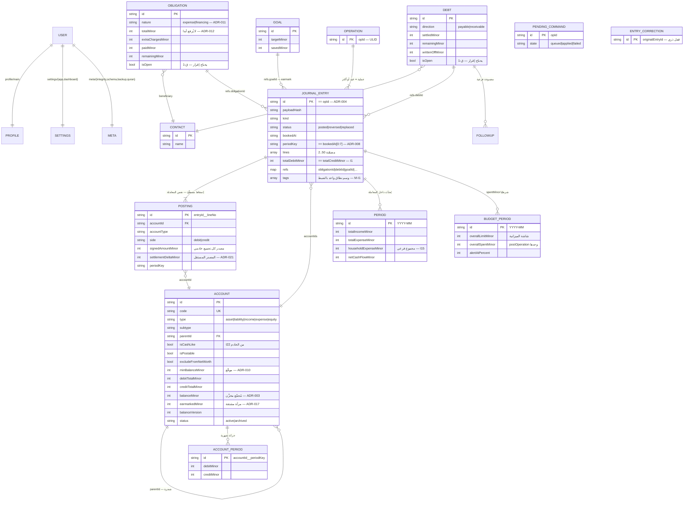
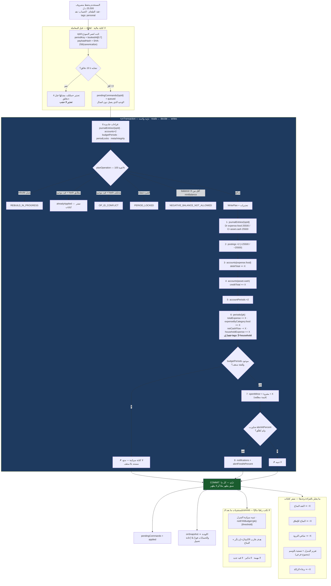
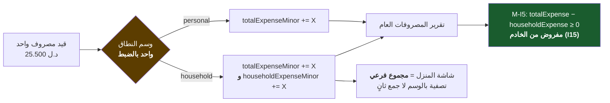
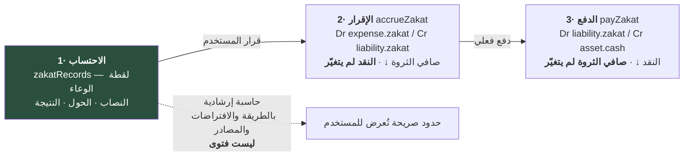

<div dir="rtl">

# الوثيقة المعمارية الجامعة — رصيد | RASEED

> **هذه أول وثيقة يقرؤها المالك.** مكتفية بذاتها: تعطيك الصورة الكاملة والقرارات والأرقام،
> وتُحيل إلى التفاصيل بدل تكرارها. كل رقم فيها **مقيس من الكود أو الملفات**، لا مُقدَّر.
>
> | | |
> |---|---|
> | **المالك** | محمد إبراهيم البرشي — `albarshi.96@gmail.com` |
> | **تاريخ التحرير** | 2026-10-10 |
> | **المرحلة** | نهاية المرحلة 1 (التحليل والتأسيس) من 8 مراحل — المتطلبات §24 |
> | **الحالة العامة** | **التأسيس مكتمل · التصميم مكتمل · لا شاشة مالية واحدة منفَّذة · لا نشر** |
> | **الحاجب الأول** | `firestore.rules` في الجذر **يُوقف النظام لو نُشر** — §9/ق-11 |
>
> **أسبقية المراجع عند التعارض:**
> قرارات المالك (`01-OWNER-DECISIONS.md`) > المتطلبات (`00-REQUIREMENTS.md`) >
> عقد النواة (`design/01-financial-core.md`) > تصميم الوحدة > هذه الوثيقة.
> **هذه الوثيقة لا تُنشئ قرارًا جديدًا؛** تلخّص وتُحيل وتكشف ما بقي دون حسم.

---

## خريطة الوثائق — أين تقرأ ماذا

| # | الملف | ماذا يحسم | الحجم |
|---|---|---|---|
| 00 | `docs/00-REQUIREMENTS.md` | المتطلبات الرسمية — **المرجع الأعلى** | 24 KB |
| 01 | `docs/01-OWNER-DECISIONS.md` | ق-1 Spark · ق-2 Google فقط · ق-3 أرقام لاتينية | 6 KB |
| — | `docs/design/01-financial-core.md` | **عقد النواة المحاسبية.** أسماء الحقول فيه نهائية | 311 KB |
| — | `docs/design/01-core-part1..5.md` | أجزاء النواة التفصيلية (نموذج · كتابات · قواعد · خوارزميات · تشغيل) | 614 KB |
| 02 | `docs/design/02-architecture.md` | الطبقات · شجرة الملفات · الحالة · الأخطاء · PWA · الإقلاع | 229 KB |
| 03 | `docs/design/03-data-model.md` | مخطط Firestore · العلاقات · **الفهارس (المصدر الوحيد للنشر)** | 271 KB |
| 04 | `docs/design/04-security.md` | القواعد — **§6 هو ملف القواعد الوحيد القابل للنشر** | 228 KB |
| 05 | `docs/design/05-design-system.md` | نظام التصميم · RTL · المخططات · الخطوط | 137 KB |
| 06 | `docs/design/06-module-map.md` | **الترابط بين الوحدات** · صافي الثروة · الازدواج · الزكاة | 273 KB |
| 07 | `docs/design/07-recurrence-notifications.md` | التكرار · الاستدراك · التنبيهات · `PushPort` | 202 KB |
| 08 | `docs/design/08-reports.md` | 17 تقريرًا بمصادر أرقامها والتصدير | 178 KB |
| 09 | `docs/design/09-personal-worship.md` | المفكرة · المهام · العبادات · الزكاة الشخصية | 221 KB |
| 10 | **`docs/10-MASTER-ARCHITECTURE.md`** | **هذه الوثيقة** | — |

> **تحذير:** `docs/adr/` **فارغ**. الأربعون ADR موجودة **داخل** وثائق التصميم كجداول (النواة §1.4
> و02 §16.1) ولم تُستخرج إلى ملفات مستقلة كما تنصّ الوثيقتان. انظر §9/ق-19.

---

## 1. تقييم الحالة الحالية

### 1.1 ما وُجد عند البدء مقابل ما هو قائم الآن

| البند | عند البدء | **الآن (مقيس 2026-10-10)** |
|---|---|---|
| المستودع | مجلد فارغ · 0 commits | **9 commits** · آخرها `2447c66` |
| المشروع | لا `package.json` | Vite 8 · React 19 · TS 6 · Tailwind 4 · PWA — **يبني بنجاح** |
| سكربتات `npm` | لا شيء | **18 سكربتًا** (`verify` بوابة واحدة) |
| منطق المال | لا شيء | `src/domain/money/**` — **9 ملفات كاملة ومختبَرة** |
| عقد الأنواع | لا شيء | `src/domain/types/**` — **11 ملفًا يُترجَم نظيفًا** |
| الوقت والمعرّفات | لا شيء | `src/lib/time.ts` (UTC+2 ثابت) · `src/lib/ulid.ts` · `src/lib/env.ts` |
| Firebase في الكود | لا شيء | `src/data/firebase/{app,auth}.ts` — تهيئة + Google Sign-In |
| نظام التصميم | لا شيء | `src/ui/styles/{tokens,index}.css` |
| الشاشات | لا شيء | **شاشة واحدة**: `src/features/auth/SignInScreen.tsx` |
| الاختبارات | لا شيء | **144 اختبارًا أخضر** · تغطية **96.7%** · `npm audit` **صفر ثغرات** |
| القواعد | لا شيء | `firestore.rules` **396 سطرًا · 24 مجموعة · لم يُنشر · لا يصلح للنشر** |
| الفهارس | لا شيء | `firestore.indexes.json` **96 فهرسًا مركَّبًا + 55 استثناء · لم يُنشر** |
| اختبارات القواعد | لا شيء | `tests/rules/firestore.rules.test.ts` — **35 حالة · لم تُشغَّل** |
| مشروع Firebase | بلا تطبيق ولا قاعدة | تطبيق ويب مسجَّل · Firestore في `europe-west8` (ميلانو) |
| مزوّد Google | — | **غير مُفعَّل في الكونسول** ⇒ `signInWithGoogle` يُعيد `PROVIDER_DISABLED` |
| الوثائق | متطلبات فقط | **13 وثيقة تصميم · ~2.9 ميغابايت** |

### 1.2 الحقيقة غير المريحة — ثلاث جُمل

1. **التأسيس والتصميم مكتملان بجودة عالية.** وحدة المال مُثبتة بالاختبار، وعقد الأنواع مترجَم،
   والقرارات المعمارية موثَّقة بأربعين ADR.
2. **ولا نظام يعمل بعد.** الذي يعمل اليوم: شاشة تسجيل دخول واحدة — **ولا تعمل** لأن مزوّد Google
   غير مُفعَّل. لا حساب واحد، لا مصروف واحد، لا تقرير واحد.
3. **والنشر محجوب بحاجبين قاتلين** (§9/ق-11 و§9/ق-12): القواعد المكتوبة في الجذر **تُوقف النظام**
   لو نُشرت، **ولم تُختبر قاعدة واحدة** منها.

### 1.3 الحاجب المقيس — ليس استنتاجًا هذه المرة

`firebase.json` ينصّ: `"firestore": { "rules": "firestore.rules" }` ⇒ **الملف الذي سيُنشر هو
ملف الجذر المعيب**، لا `04-security.md` §6.

والمحاكي **شُغِّل فعلًا** مرة واحدة (2026-10-09 23:53) وتركت كتابته آثارها في `firestore-debug.log`
(83 كيلوبايت). ومن السجل حرفيًا:

```
evaluation error at L133:26 for 'update' @ L133
false for 'create' @ L117, false for 'create' @ L393
```

- **`L117`** = `allow create` على `journalEntries` ⇒ **أول قيد مالي مرفوض** في تلك الجلسة.
- **`L393`** = `match /{document=**} { allow read, write: if false; }` ⇒ الحارسة الختامية، متوقَّعة.
- **`evaluation error at L133:26`** = قراءة `resource` على مستند غير موجود — **خطأ تقييم فعلي
  مقيس في المحاكي**، لا تحليل نظري.

وقد تحقّقت من نمط العيب بقراءة الملف مباشرة، وهو مؤكَّد في ثلاثة مواضع:

| السطر | المجموعة | النمط | الأثر الفعلي |
|---|---|---|---|
| 227 | `accountPeriods` | `allow create, update` ثم `resource.data.debitMinor` بعد `\|\|` لا تُقصَر | أول حركة لحساب في شهر جديد **تُرفَض** |
| 264 | `obligations` | `allow create, update` ثم `resource.data.keys()` (L277) | **إنشاء أي التزام يُرفَض** |
| 242 | `periods` | يفرض حضور `householdExpenseMinor` في `create` | **أول مصروف غير منزلي في كل شهر يُرفَض** (ق-2 / ADR-034) |

> **حالة Java الآن:** مجلد `C:\Program Files\Eclipse Adoptium\jdk-21.0.12.101-hotspot` **موجود
> وفارغ** — تثبيت ناقص أو فاشل، و`java.exe` غير موجود فيه ولا على `PATH`.
> ⇒ **`npm run test:rules` لا يعمل الآن**، وحالات القواعد الـ35 لم تُشغَّل.
> والمحاكي عمل سابقًا بـ JDK لم يبقَ. **إصلاح هذا شرط نشر** (المتطلبات §25 بند 10).

### 1.4 أصول ناقصة تُسقط البناء المنشور

| الأصل | الحالة | الأثر |
|---|---|---|
| `public/` | **`favicon.svg` وحده** | `vite.config.ts` يُدرج في الـ manifest و`includeAssets`: `apple-touch-icon.png`, `pwa-192.png`, `pwa-512.png`, `pwa-512-maskable.png` ⇒ **أربعة أصول PWA مفقودة** ⇒ التثبيت على الهاتف بأيقونة مكسورة |
| ملفات الخطوط | **غائبة** | ADR-035 يُلزم خطًا عربيًا مستضافًا محليًا بأرقام جدولية (لا Google Fonts) |
| `--font-numeric` | **غير معرَّف** في `tokens.css` | محاذاة الخانات المالية (`tabular-nums`، ق-3) غير مضمونة |
| `dateKeyToUtcNoon` · `startOfWeek` | **ناقصتان** من `src/lib/time.ts` | ثلاث وثائق تستهلكهما بالاسم؛ `bookedAtTs` (عقد النواة §4.3) بلا مُولِّد |

---

## 2. التصور المعماري الشامل

### 2.1 مخطط الطبقات



**القانون الحاكم** (عقد النواة §21.1 + 02 §4، مفروض بـ16 قاعدة ESLint `B1…B16`):

| القاعدة | المعنى |
|---|---|
| **اتجاه واحد** | `app → features → {stores, data, ui} → domain → lib`. أي سهم عكسي = **خطأ بناء** |
| **`domain` نقية 100%** | صفر استيراد من `firebase` ومن `data`. المكان **الوحيد** الذي يبني `lines` و`side` |
| **`data` وحدها تلمس Firestore** | أي `import` من `firebase/*` خارجها = خطأ بناء |
| **`ui` لا تعرف المجال** | `import type` من `domain/types` فقط · لا `stores` · لا `debit/credit` |
| **`lib` لا تستورد `domain`** | يمنع تسلّل منطق مالي إلى أدوات عامة |
| **نقطة كتابة مالية واحدة** | `data/ledger/postOperation.ts` حصرًا — ولا أحد غيرها يكتب في `journalEntries` |

> **انحراف مُقَرّ:** التكليف الأصلي اقترح `ui → features → domain → data`. **غير قابل للتنفيذ**:
> `domain` نقية ولا تعرف Firestore، فلا تصلح وسيطًا للبيانات. الاتجاه المعتمد:
> `features → data` للقراءة والكتابة، و`data → domain` للتخطيط والتحقق،
> **والمنطق المحاسبي يبقى حصرًا في `domain`** — وهو جوهر الشرط لا شكل السهم (02 §4.2).

### 2.2 التقنيات المختارة — وسبب كل اختيار

| الطبقة | المختار (المثبَّت فعلًا) | السبب |
|---|---|---|
| البناء | **Vite 8** | SPA ملفات ساكنة؛ لا خادم يُشغَّل على Spark (ق-1) |
| الواجهة | **React 19** + TypeScript 6 | صرامة كاملة: `noUncheckedIndexedAccess` · `exactOptionalPropertyTypes` · `verbatimModuleSyntax` |
| التنسيق | **Tailwind 4** + CVA + `tailwind-merge` | RTL بنيوي بخصائص منطقية (`inline-start`) لا بقلب |
| حالة الخادم | **TanStack Query 5** | الذاكرة الوحيدة لحالة الخادم؛ `setQueryData` من سجل اشتراكات واحد (ADR-026/027) |
| الحالة المحلية | **Zustand 5** | سمة وتخطيط ومرشّحات فقط — **ولا مبلغ** (ADR-039، مفروض بـ B14) |
| التحقق | **Zod 4** | حدّان بالضبط: الإدخال والقراءة؛ مخطط مشترك بين النموذج والمستودع (ADR-029) |
| الخلفية | **Firebase 13** — Firestore + Auth + Hosting | ق-1 يحصرنا في Spark؛ وهذه الثلاثة تعمل كاملة |
| التوجيه | **react-router 8** | موجِّه متصفح بـ `lazy`، **بلا `loader` يجلب بيانات** (ADR-040) |
| الاختبار | **Vitest 5** + `@firebase/rules-unit-testing` + fast-check | أربعة مشاريع Vitest + المحاكي حصرًا للقواعد (ADR-036) |
| الأيقونات | **lucide-react** | طقم موحَّد واحد (المتطلبات §3) |
| المخططات | **SVG داخلي بلا مكتبة** | ثمانية أشكال فقط؛ مكتبة رسوم = +200KB لما يُرسم بـ`path` (02 §13.3 · 05 §11.1) |
| التاريخ | `date-fns` + **`src/lib/time.ts` هو الحَكَم** | توقيت ليبيا UTC+2 **ثابت بلا توقيت صيفي** (ADR-033) |

### 2.3 ما رُفض — وسبب الرفض

| المرفوض | سبب الرفض بالنصّ |
|---|---|
| **Next.js** (ADR-023) | كل البيانات خاصة وخلف المصادقة ⇒ **لا قيمة لـ SSR**؛ ولا خادم على Spark. والبديل `output: 'export'` = Vite بعقوبة تعقيد |
| **Remix / TanStack Start** | نفس السبب + سطح تعلّم بلا مقابل |
| **Cloud Functions** | ق-1: غير متاح على Spark. كل المنطق على العميل داخل `runTransaction` بقواعد صارمة |
| **Firebase Storage** | ق-1: غير متاح. **المرفقات مؤجَّلة** — الحقل في المخطط، الواجهة معطَّلة بوسم «يتطلب ترقية» |
| **Base64 في Firestore** للمرفقات | سقف المستند 1MB؛ صورة إيصال تستهلكه، والقراءة تُحمّل الصورة مع كل استعلام |
| **Redux / XState عامة** | متجر حالة ضخم لحالة محلية بسيطة؛ وحالة الخادم عند Query أصلًا |
| **مجموعات جذرية + `ownerId`** | يُجبر تكرار شرط الأمان **36 مرة**، و**نسيان واحد = تسريب مجموعة كاملة**؛ ويربط صحة الأمان بـ**شكل كل استعلام** |
| **وثيقة عظمى واحدة لكل مستخدم** | سقف 1MB يُستهلك بعد ~800 قيد؛ وسقف الكتابة ~1/ث يصير سقفًا على النظام |
| **تقسيم المجموعات بالسنة** (`journalEntries_2026`) | يُفسد `collectionGroup`، ويُضاعف الفهارس، وأي استعلام يعبر رأس السنة يصير استعلامين. والفائدة صفر: تكلفة Firestore بعدد المستندات المُعادة لا بحجم المجموعة |
| **مجموعة `transactions` أحادية الجانب** (ADR-002) | تكسر القيد المزدوج؛ والبديل: `journalEntries` بسطور مضمَّنة + `postings` مسطَّحة في **نفس المعاملة** |
| **`debtPayments` / `obligationPayments`** (ADR-005) | مجموعة موازية تنحرف عن الدفتر بلا ثابت يربطها. سجل الدفعات = استعلام على الدفتر |
| **`allowNegative` بوليانيًا** (ADR-010) | حُذف نهائيًا لصالح `minBalanceMinor` موقَّع (افتراضي 0) |
| **تسجيل القرض «دخلًا» بوسم استبعاد** | أول استعلام طبيعي `where type=='income'` **يضخّم الدخل بأصل كل قرض** — عين ما تحرّمه القاعدة §19.11 |
| **`eslint-plugin-boundaries`** (ADR-025) | **ثغرات أمنية في اعتمادياتها.** البديل المنفَّذ: `no-restricted-imports` الأصلية + `verify-layers.mjs`. **يُثبِّت انحرافًا عن نص ADR-018** |
| **عامل خدمة يخزّن بيانات Firestore** (ADR-031) | `runtimeCaching: []`. قوقعة التطبيق فقط — وإلا عُرض رقم مالي قديم من طبقتين كاش |
| **تحديث متفائل لأي رقم مالي** | الرقم الصحيح يأتي من الخادم أو لا يأتي |
| **مفتاح تبديل الأرقام العربية/اللاتينية** | ق-3: قرار عرض مُثبَّت لتقليل سطح الاختبار |
| **خادم / BFF / GraphQL / monorepo** | كل واحد حُسم بسبب مذكور لا بتفضيل (02 §1) |

### 2.4 القرارات العشرة التي تُحدِّد شكل الكود كله

1. SPA بـ Vite + React 19 + TS، ينشر ملفات ساكنة على Firebase Hosting.
2. سبع طبقات باتجاه واحد مفروض **بأداة البناء** لا بمراجعة الكود.
3. TanStack Query للخادم · Zustand للمحلي · **ولا مبلغ في متجر محلي**.
4. **اشتراك `onSnapshot` واحد لكل مفتاح** بعدّاد مراجع ومهلة سماح 30ث — يقتل الازدواج والتسريب و`StrictMode`.
5. **`AppError` مغلّف واحد** بحقل `messageAr` جاهز، ولكل صنف خطأ **قناة عرض واحدة**.
6. **Zod على حدّين بالضبط**؛ وفشل فكّ ترميز إسقاط مالي = **خطأ سلامة حاجب**، لا صفّ مكسور.
7. **`persistentLocalCache` مُفعَّل بأمان** — لأن `runTransaction` **لا يقرأ الكاش أبدًا**؛ والخطر الوحيد (عرض رقم قديم) يُعالَج **بوسم نضارة على كل رقم مالي**.
8. **لا تحديث متفائل لرقم مالي**، ولا تخزين بيانات Firestore في عامل الخدمة.
9. **التاريخ المحاسبي بتوقيت طرابلس الثابت** — وإلا تغيّر `periodKey` بتغيّر منطقة الجهاز.
10. **بوابات إقلاع ست بترتيب مُلزِم** قبل أي كتابة مالية، ثم تفريغ الطوابير وتشغيل الاستدراك.

### 2.5 بوابات الإقلاع الست (ADR-038)



**الأمان على Spark — الاعتراف الصريح (ADR-020):** بلا Cloud Functions لا يوجد فرض خادمي كامل
للمقدار والإشارة. الضمان القائم أربع طبقات: **مسار كتابة وحيد** (`postOperation`) +
**قواعد تفرض الشكل والثوابت I1/I3/I5/I15/I17/I22/I24** + **اختبار جدولي** + **فاحص دوري**.
والفرض الخادمي الحقيقي **يبدأ عند Blaze** — ومعيار الترقية في §9/ق-20.

---

## 3. هيكل الملفات والمجلدات

**المفتاح:** ★ **مبنيّ فعلًا ومُختبَر** · ◐ **مبنيّ ولم يُختبر/لم يُنشر** · ☐ **مصمَّم ولم يُبنَ**

### 3.1 الجذر

```
RASEED/
├─ ★ package.json              18 سكربتًا · Vite 8 · React 19 · TS 6 · 12 اعتمادية + 24 تطوير
├─ ★ tsconfig.json             صرامة كاملة · verbatimModuleSyntax · erasableSyntaxOnly
├─ ★ vite.config.ts            PWA · registerType:'prompt' · runtimeCaching:[] (ADR-031)
├─ ★ eslint.config.js          حدود الطبقات B1…B16 بقواعد ESLint الأصلية (ADR-025)
├─ ★ vitest.config.ts          ◐ vitest.rules.config.ts
├─ ★ .env.example / .env.local / .firebaserc      (default: raseed-2fac1)
├─ ★ firebase.json             Hosting + ترويسات أمنية + منافذ المحاكي
├─ ◐ firestore.rules           396 سطرًا · 24 مجموعة · ⛔ لا يُنشر — انظر §9/ق-11
├─ ◐ firestore.indexes.json    96 فهرسًا + 55 استثناء · لم يُنشر
├─ ★ CLAUDE.md                 دستور المشروع — يُحمَّل في كل جلسة
├─ ★ docs/                     13 وثيقة · ~2.9 MB      ☐ docs/adr/ — **فارغ**
├─ ◐ public/                   favicon.svg وحده — ☐ 4 أصول PWA + الخطوط مفقودة
├─    src/                     انظر 3.2
├─    tests/                   ★ unit/ (4 ملفات · 144 اختبارًا) · ◐ rules/ (35 حالة · لم تُشغَّل)
└─ ☐ scripts/ · .husky/ · .github/workflows/ · playwright.config.ts
```

### 3.2 `src/` — ما بُني وما لم يُبنَ

```
src/
├─ ★ main.tsx · ★ app/App.tsx
│
├─ domain/                      ← النواة النقية · صفر firebase · صفر data
│  ├─ ★ money/                  9 ملفات · كاملة ومختبَرة
│  │     types.ts        Minor · Bps · LYD_EXPONENT=3 · MAX_ABS_MINOR · MoneyInvariantError
│  │     arithmetic.ts   addMinor · subMinor · sumMinor · compareMinor · assertInRange
│  │     rate.ts         mulRate (BigInt إلزامًا) · percentOf · ratioBps
│  │     allocate.ts     splitEven · allocateByWeights (أكبر باقٍ — المجموع = الكل دائمًا)
│  │     parse.ts        parseAmountToMinor — رفض لا تقريب صامت
│  │     format.ts       formatLYD — **الدالة الوحيدة للتنسيق** (ق-3)
│  │     installments.ts buildInstallmentPlan
│  ├─ ★ types/                  11 ملفًا · عقد الأنواع يُترجَم نظيفًا
│  │     account · journal · posting · aggregates · operations · plan
│  │     satellites · correction · pending · errors · primitives
│  └─ ☐ coa/ · ledger/ · ops/ · period/ · rules/ · recurrence/
│     ☐ selectors/ · contracts/ (Zod) · errors/ · reports/ · worship/ · integrity/
│
├─ data/                        ← الطبقة الوحيدة التي تلمس Firestore
│  ├─ ◐ firebase/app.ts         initializeApp + persistentLocalCache + connectEmulatorsOnce
│  ├─ ◐ firebase/auth.ts        observeSession · signInWithGoogle · signOut · SIGN_IN_ERROR_AR
│  └─ ☐ firebase/{paths,errors,freshness}.ts
│     ☐ tx/ (runPlan · retry) — TxPlan<TState,TWrites>
│     ☐ ledger/ — **postOperation.ts = نقطة الكتابة المالية الوحيدة** · writers/ · readers
│     ☐           reconcile.ts · rebuild.ts (الاستثناء الوحيد لـ B7)
│     ☐ codecs/ (decode · encode + 20 مُرمِّزًا) · live/ (queryKeys · liveRegistry · subscriptions)
│     ☐ repos/ (18 مستودعًا) · outbox/ (queue · flush · mirror) · seed/ · export/
│     ☐ scheduler/clock.ts (استثناء B11 الوحيد) · push/ (PushPort) · storage/ (StoragePort)
│
├─ ★ lib/time.ts               LIBYA_UTC_OFFSET_MINUTES · today · periodKeyOf · toLibyaISODate
│  │                           nowISO · setClock/resetClock · 26 تصديرًا
│  │                           ☐ ناقص: dateKeyToUtcNoon · startOfWeek
│  ★ lib/ulid.ts · ★ lib/env.ts        ☐ lib/{idb,result,log}.ts
│
├─ ui/
│  └─ ★ styles/{tokens,index}.css      ☐ primitives/ · patterns/ · charts/ · layout/
│
├─ features/
│  └─ ★ auth/SignInScreen.tsx          ← **الشاشة الوحيدة المنفَّذة**
│     ☐ dashboard · accounts · transactions · categories · contacts · obligations
│     ☐ debts · household · budgets · goals · planning · notes · tasks · worship
│     ☐ reports · notifications · settings · integrity · backup      (18 ميزة)
│
└─ ☐ stores/                   theme · layout · filters · toasts · freshness · gates
```

**الخلاصة الكمّية:** 29 ملف `src` مكتوب. المصمَّم في 02 §5 أكبر من ذلك بكثير:
**18 مجلد ميزة** و**9 مجلدات `data`** و**13 مجلد `domain`** لم تُبنَ. الموجود هو **الأساس
الذي تقوم عليه بقية الطبقات**: المال والوقت والأنواع والتهيئة — أي أصعب ما يُصلَح لاحقًا.

---

## 4. مخطط قاعدة البيانات

### 4.1 القرار الحاكم

**مجموعات فرعية تحت `users/{uid}/…` مع `ownerUid` مُكرَّرًا في كل مستند.**
السبب الحاسم: `match /users/{uid}` ثم `isOwner(uid)` يعزل كل شيء **بشرط واحد في الجذر**،
وأي مجموعة جديدة **ترث العزل** لأن المسار نفسه يحمل الهوية.
و`ownerUid` المُكرَّر يحفظ القدرة على `collectionGroup` **بلا ثمن** (غير مستخدمة في الإصدار الأول).

> **`users/{uid}` نفسه يبقى مستندًا غير موجود عن قصد** — القواعد تمنع الكتابة فيه، والمعلومة
> موزَّعة على `profile/main` و`settings/*` و`meta/*`. (03 §2.4)

### 4.2 جرد المجموعات — 36 مسارًا

| الطبقة | المسارات | الخصائص الحاكمة |
|---|---|---|
| **الدفتر** (د) | `journalEntries/{entryId}` · `postings/{entryId}__{lineNo}` | **لا حذف ولا تعديل محاسبي أبدًا.** `entryId === opId` ⇒ منع الازدواج **خصيصةٌ في مفتاح المستند** (ADR-004) |
| **الشجرة** | `accounts/{accountId}` | شجرة خمسية `asset\|liability\|income\|expense\|equity`. **تضمّ** مصادر الأموال والفئات ومصادر الدخل والديون في شجرة واحدة |
| **المُجمَّعات** (م) | `accountPeriods/{accountId}__{periodKey}` · `periods/{periodKey}` · `budgetPeriods/{periodKey}` · `periodLocks/{periodKey}` | تُكتب **داخل نفس المعاملة** (ADR-003). `accountPeriods` تحفظ **الحركة فقط**؛ الأرصدة مشتقّة تراكميًا (ADR-009) |
| **الأقمار المالية** | `obligations` · `debts` (+`/followUps`) · `financialGoals` · `recurrences` · `incomeSchedules` · `budgetTemplates` · `scenarios` | `debts` بالاتجاهين في مجموعة واحدة بحقل `direction` — الحوارس والحالات مشتركة |
| **التشغيل** (ت) | `categories` · `contacts` · `profile/main` · `settings/{app,dashboard}` · `importBatches` · `attachments` ⛔ · `fiscalPeriods` ⛔ | `categories` 1:1 مع حساب `expense.{code}`. `attachments` **معطَّلة** (ق-1) · `fiscalPeriods` **محجوزة** (ADR-008) |
| **الشخصية** (ش) | `notes` (+`/content`) · `notebooks` · `tasks` · `taskLists` · `reminders` · `notifications/{dedupeKey}` | `notifications` بمعرّف حتمي ⇒ **منع التكرار بنيوي**. `reminders` **قاعدة** و`notifications` **حدث** — دمجهما يعني أن حذف إشعار يحذف القاعدة |
| **العبادات** | `worshipDays/{dateKey}` ⚠ · `quranSessions/{id}` ⚠ · `habits/{id}` ⚠ · `zakatRecords` · `meta/quran` | ⚠ **الأسماء محلّ تعارض ثلاثي غير محسوم** — §9/ق-15 |
| **الحكومة** | `operations/{opId}` · `entryCorrections/{originalEntryId}` · `pendingCommands/{opId}` · `auditLogs` · `meta/{integrity,schema,backup}` | `entryCorrections` = **قفل تصحيح ذرّي** (ADR-014). `pendingCommands` = طابور دون اتصال **مستبعد من كل رصيد وتقرير** (ADR-007) |

**الانحرافات الموثَّقة عن المتطلب §18** (كلها بسبب مكتوب في 03 §3):

| اسم في المتطلب | المعتمد | ADR |
|---|---|---|
| `profiles` | `profile/main` (مستند واحد) | — |
| `transactions` | `journalEntries` + `postings` | ADR-002 |
| `debtPayments` | **لا مجموعة** — استعلام على الدفتر | ADR-005 |
| `budgets` | `budgetPeriods/{YYYY-MM}` + `budgetTemplates` | — |
| `settings` | `settings/app` + `settings/dashboard` | — |
| `worshipRecords` / `quranProgress` | `worshipDays` / `quranSessions` ⚠ | ADR-PW-* |

### 4.3 مخطط الكيانات



> التفصيل الحقلي الكامل (كل حقل بنوعه وقيوده) في **`03-data-model.md` §4–§7**،
> والعلاقات وقرارات التكرار في **§8**، والفهارس في **§10 — وهو المصدر الوحيد للنشر**.

### 4.4 الفهارس — 96 + 55

| البند | القيمة | ملاحظة |
|---|---|---|
| فهارس مركَّبة | **96** | مطابقة حرفيًا لكتلة 03 §10.2 (تحقّق آلي: `IDENTICAL: True`) |
| استثناءات فهرسة | **55** | **قاعدة مُلزِمة: لا يُلغى فهرسة أي حقل تُجمِّعه `sum()`** |
| استعلامات مغطّاة | 100 | Q1…Q100 في 03 §9 |
| فهارس تجميع | 11 (`PG1…PG12`) | كل واحد ينتهي بالحقل المُجمَّع — شرط `getAggregateFromServer(sum())` |
| **الحالة** | **لم تُنشر ولم تُختبر** | صحتها **مُستنتجة من العقود لا مُقاسة**؛ أول تشغيل حقيقي هو ما يُثبتها |

**ثلاث مسائل مفتوحة في الفهارس** (تفصيلها في §9):
- فهارس المجموعات الشخصية والتنبيهات **بأسماء حقول خاطئة** ⇒ فهارس ميتة (ق-14).
- `postings.bookedAt` و`bookedAtTs` **يُفهرسان بالتبادل** لنفس الغرض ⇒ 15 فهرسًا نصفها بلا مقابل (ق-22).
- فهرس `dailyRollups` **غير منشور** حتى إقرار ADR-023 (ق-5).

---

## 5. العلاقات بين الوحدات المالية والشخصية

### 5.1 الوحدات العشرون — ومن يكتب ماذا

| # | الوحدة | مالية؟ | تكتب (تملكه أو تطلبه) | يتأثر بكتابتها |
|---|---|---|---|---|
| 1 | الحسابات | نعم (افتتاحي + تسوية) | `accounts` وصفيًا + `auditLogs`؛ **الأرصدة لا تُكتب يدويًا أبدًا** | كل شيء مالي |
| 2 | **المصروفات** | **نعم** | `recordExpense` ⇒ قيد + `postings` + `accounts×2` + `accountPeriods×2` + `periods` + `budgetPeriods`(شرطي) + `notifications`(شرطي) | الحسابات · الميزانيات · المنزل · التقارير · التنبيهات · اللوحة · الزكاة |
| 3 | الدخل | **نعم** | `recordIncome` ⇒ قيد + مُجمَّعات + `incomeSchedules.occurrences[key]` | الحسابات · التقارير · اللوحة · الأهداف · الزكاة |
| 4 | التحويلات | **نعم** | `transfer` ⇒ قيد بسطرين أو ثلاثة + `periods.transferVolumeMinor` | الحسابات · التقارير **كحجم محيَّد** — ولا الدخل ولا المصروف |
| 5 | الفئات | لا | `categories` + **إنشاء حساب `expense.{code}` مقابل 1:1**. **لا حذف — أرشفة** | المصروفات · الميزانيات · التقارير · المنزل |
| 6 | الالتزامات | **نعم** (الدفع فقط) | `createObligation` **بلا قيد (R4)** · `payObligation` ⇒ قيد + تحديث المشتقات | الحسابات · الميزانيات (`nature=expense` فقط) · التنبيهات · المهام · الديون |
| 7 | الديون عليّ | **نعم** | `createDebt` ⇒ قيد R6(أ/ب/ج) + إنشاء `liability.payable.{contactId}` · `payDebt` | صافي الثروة · الزكاة (خصم الحالّ) — **ولا الدخل ولا الميزانية** |
| 8 | الديون لي | **نعم** | `createDebt(lend)` · `collectDebt` · `writeOffDebt` ⇒ `expense.baddebt` + `followUps` | النقد عند التحصيل · صافي الثروة · الزكاة — **ولا الدخل** |
| 9 | جهات الاتصال | لا | `contacts`. **إنشاء جهة لا يُنشئ حسابًا** — الحساب عند أول دين فعلي | الديون · الالتزامات · التقارير حسب الجهة |
| 10 | **مصاريف المنزل** | **لا** | **لا تكتب رقمًا ماليًا إطلاقًا.** فقط `householdBudgets/{pk}.limitMinor` | لا شيء ماليًا — **شاشة عرض متخصصة لا مصدر بيانات** |
| 11 | الميزانيات | لا (سقوف) | `limitMinor` · `overallLimitMinor` · `alertAtPercent` فقط. **`spentMinor` تكتبه العمليات المالية وحدها** | اللوحة · التنبيهات · التقارير |
| 12 | الأهداف | **نعم** (التخصيص) | `earmarkToGoal` ⇒ `Dr equity.unallocated / Cr equity.earmark.goal.{id}` | `earmarkedMinor` ⇒ «المتاح للإنفاق» — **ولا النقد المتاح ولا صافي الثروة** |
| 13 | المفكرة | لا | `notes` · `notebooks` | لا شيء ماليًا |
| 14 | المهام | لا | `tasks` + المولَّدة بمعرّف حتمي `task:obl:{obligationId}` | التنبيهات · اللوحة · التقارير |
| 15 | التذكيرات | لا | `reminders` (قاعدة توقيت) + `lastFiredKey` | **التنبيهات فقط** |
| 16 | التنبيهات | لا | `notifications` بمعرّف حتمي. **المجموعة الوحيدة غير المحاسبية القابلة للحذف** مع `pendingCommands` | عدّاد اللوحة |
| 17 | العبادات | لا | `worshipDays` · `quranSessions` · `habits` | التنبيهات · التقارير. **لا أثر مالي إطلاقًا** |
| 18 | الزكاة | **نعم** | `zakatRecords` (لقطة) · `accrueZakat` ⇒ قيد · `payZakat` ⇒ إطفاء الخصم | صافي الثروة (الخصم ↑ عند الاحتساب) · الحسابات (عند الدفع) |
| 19 | التقارير | لا | **تكتب لا شيء** عدا `auditLogs{action:'dataExported'}` | — |
| 20 | الإعدادات | غير مباشر | `settings/*` + أدوات السلامة + `periodLocks` | **كل الوحدات**؛ و`rebuildProjections` **يُجمّد كل الوحدات المالية** |

### 5.2 تدفق الأثر — مصروف واحد



### 5.3 الجدول الحاسم — «ليس دخلًا / ليس مصروفًا»

> **قراءة هذا الجدول شرط قبول أي مطوّر في المشروع.** كل خانة «✗» و«0» فيه **نفي مُختبَر** في
> مجموعة `T-PLAN` (اختبار جدولي لكل صف)، لا سلوك ضمني. هو تطبيق المتطلب §19.11 حرفيًا.

| العملية | النقد | الدخل | المصروف | صافي الثروة | صافي التدفق | الميزانية |
|---|---|---|---|---|---|---|
| **اقتراض نقدي** (`borrow` أ) | `+X` | ✗ | ✗ | **0** | ✗ | ✗ |
| **شراء بالأجل** (`borrow` ب) | ✗ | ✗ | **`+X`** | `−X` | ✗ | **`+X`** |
| دين افتتاحي (`opening`) | ✗ | ✗ | ✗ | `−X` | ✗ | ✗ |
| سداد دين | `−X` | ✗ | ✗ | **0** | `−X` | ✗ |
| سداد بفوائد `i` | `−(X+i)` | ✗ | **`+i` فقط** | `−i` | `−(X+i)` | `+i` على `expense.finance` |
| **إقراض** (`lend`) | `−X` | ✗ | ✗ | **0** | ✗ | ✗ |
| تحصيل دين | `+X` | ✗ | ✗ | **0** | ✗ | ✗ |
| شطب مستحق | ✗ | ✗ | **`+X`** | `−X` | ✗ | `+X` إن للفئة سقف |
| **تحويل بلا عمولة** | **0** | ✗ | ✗ | **0** | ✗ | ✗ |
| تحويل بعمولة `f` | `−f` | ✗ | **`+f`** | `−f` | `−f` | `+f` |
| دفع التزام `nature='expense'` | `−X` | ✗ | **`+X`** | `−X` | `−X` | **`+X`** |
| **دفع التزام `nature='financing'`** | `−X` | ✗ | **✗** | **0** | `−X` | **✗** |
| تخصيص لهدف (`earmark`) | **0** | ✗ | ✗ | **0** | ✗ | ✗ |
| احتساب زكاة | ✗ | ✗ | ✗ | **`−X`** | ✗ | ✗ |
| تحويل التزام إلى دين | **0** | ✗ | `+X` إن `expense` | `−X` إن `expense` · **0** إن `financing` | ✗ | `+X` إن `expense` |

**صدق العرض:** شاشة الاقتراض **لا تسمّي نفسها «دخل»**، وتعرض بعد التسجيل ثلاثة أسطر صريحة:
«✔ ارتفع نقدك 1,000.000 د.ل · ✔ ونشأ دين عليك لأحمد بقيمة 1,000.000 د.ل ·
ℹ هذه العملية **ليست دخلًا**: صافي ثروتك لم يتغيّر، ولن تظهر في تقرير الدخل.»

### 5.4 حلّ الازدواج — مصاريف المنزل

**المشكلة (المتطلب §11):** مصاريف المنزل قسم متخصص، و**تظهر في التقارير العامة دون تكرار قيمتها**.

**الحل:** المنزل **بُعد تجزيء لا كيان** — وسم `household` على نفس القيد، لا قيد ثانٍ ولا مجموعة ثانية.



**القاعدة الحاسمة:** `householdExpenseMinor` **مجموع فرعي من** `totalExpenseMinor` لا إضافة إليه.
والقواعد تفرض `householdExpenseMinor <= totalExpenseMinor` (I15) **من الخادم** — فلا يستطيع
خطأ برمجي أن يُنتج ازدواجًا.
**بديل مرفوض:** مجموعة `householdExpenses` موازية — تنحرف عن الدفتر ويتضخّم كل تقرير عام.

### 5.5 صافي الثروة مقابل النقد المتاح — ستة أرقام لا تُجمع

```
النقد المتاح    = Σ أرصدة { isCashLike && isPostable && !excludeFromNetWorth
                            && (status=='active' || balanceMinor != 0) }
                = النقد + المصارف + المحافظ الإلكترونية
                  ✗ لا يشمل المستحق لي (I22 من الخادم)
                  ✗ ولا يُطرح منه المحجوز للأهداف
                  ✓ ولا يُستبعد منه حساب مؤرشف رصيده ≠ 0 (مال موجود فعلًا)

المتاح للإنفاق  = النقد المتاح − Σ earmarkedMinor

صافي الثروة     = (النقد + المصارف + المحافظ + المستحق لي)
                − (الديون عليّ + الالتزامات التمويلية + الزكاة المُقرّة)
                  ✗ لا تُطرح الالتزامات المستقبلية غير المستحقة
                  ✗ ولا المتأخرة غير المحوَّلة إلى ديون
                  ✗ ولا الأهداف ولا الحجوزات
```

> **صافي الثروة رقم دفتري بحت.** والالتزام غير المدفوع **ليس خصمًا محاسبيًا** — هو وعد مستقبلي
> (المتطلب §19.4). طرحه يخلط «ما أملكه» بـ«ما سأدفعه»، ويجعل الرقم يتغيّر بإدخال التزام **بلا أي قيد**.
> والبطاقات **ستة أرقام منفصلة** تُعرض ولا تُجمع — 06 §8.3.

### 5.6 الزكاة — الفصل التام (المتطلب §15.4)



**القاعدة:** **لا يُخصم مبلغ دون دفع فعلي.** الاحتساب لا يلمس النقد، والإقرار يُنشئ خصمًا لا
يُنقص نقدًا، والدفع يُطفئ الخصم. و**M-I12** يمنع الخلط: سجل `accrued` ⇒ كل دفعاته
`Dr liability.zakat`؛ و`calculated` ⇒ كل دفعاته `Dr expense.charity`.

### 5.7 مهمة · تذكير · تنبيه — ثلاثة أشياء مختلفة

| | **المهمة** `tasks` | **التذكير** `reminders` | **التنبيه** `notifications` |
|---|---|---|---|
| ماهيتها | عمل يُنجزه المستخدم | **قاعدة** توقيت يضعها المستخدم | **حدث** يولّده النظام |
| من يُنشئها | المستخدم أو مولِّد من التزام | المستخدم | النظام |
| يُغلقها | **إكمال صريح من المستخدم** (المتطلب §14) | لا تُغلق — قاعدة دائمة | تعليم مقروء |
| منع التكرار | `task:obl:{obligationId}` — **واحدة بالضبط** (M-I17) | `lastFiredKey` | `dedupeKey` **معرّف المستند** (M-I16) |
| الحذف | انظر §9/ق-18 | — | **مسموح** |

**لماذا لا تُدمج `reminders` في `notifications`؟** لأن حذف إشعار سيحذف القاعدة التي ولّدته.

---

## 6. قواعد الأعمال المالية (المتطلب §19)

### 6.1 القواعد الإحدى عشرة وأثر كل واحدة

| # | القاعدة | القيد المحاسبي | الأثر وأين يُفرض |
|---|---|---|---|
| 1 | المصروف المدفوع **يخفض** الرصيد | `Dr expense.{cat} / Cr asset.{acc}` | `balanceMinor` داخل نفس المعاملة (ADR-003) + `periods.totalExpenseMinor` |
| 2 | الدخل المستلم **يرفع** الرصيد | `Dr asset.{acc} / Cr income.{src}` | **المتوقع لا يُضاف** حتى الاستلام (المتطلب §7) — `incomeSchedules` كيان منفصل |
| 3 | التحويل **لا يغيّر** إجمالي الأموال | `Dr asset.{to} / Cr asset.{from}` | `periods.transferVolumeMinor` **محيَّد**؛ لا دخل ولا مصروف. العمولة وحدها مصروف |
| 4 | التزام غير مدفوع **لا يخفض** النقد | **لا قيد إطلاقًا (R4)** | `createObligation` **أقوى ضمان في النظام**: لا قيد = لا أثر |
| 5 | دفع التزام يخفض الرصيد ويسجّل الدفعة | `Dr {expense\|liability} / Cr asset` | `nature='expense'` ⇒ مصروف · `financing'` ⇒ **إطفاء دين لا مصروف** (ADR-011) |
| 6 | تسجيل دين **لا يعني** حركة نقدية | ثلاث صور R6/أ،ب،ج | **أ** نقدي: نقد↑ ودين↑ · **ب** بالأجل: مصروف↑ ودين↑ **بلا نقد** · **ج** افتتاحي: دين↑ فقط |
| 7 | تحصيل دين **يرفع** الرصيد | `Dr asset.{acc} / Cr asset.receivable.{c}` | **صافي الثروة = 0 تغيير** (تبديل أصل بأصل)، **وليس دخلًا** |
| 8 | سداد دين **يخفض** الرصيد | `Dr liability.payable.{c} / Cr asset.{acc}` | **صافي الثروة = 0**، وليس مصروفًا. الفوائد وحدها مصروف |
| 9 | المستحق للتحصيل **لا يُعرض ضمن النقد المتاح** | — | `isCashLike=false` لـ`receivable` — **مفروض من الخادم بـ I22** لا بمرشّح واجهة |
| 10 | التعديل/الإلغاء **يحفظ الأثر التاريخي** | **عكس + بديل في معاملة واحدة بدلتا صافية** (ADR-006) | **لا حذف مالي أبدًا**؛ قفل `entryCorrections/{originalEntryId}` ذرّي (ADR-014) |
| 11 | **التمييز** بين التحويل والاقتراض والسداد والدخل والمصروف الحقيقي | نوع الحساب هو الحَكَم | **التقرير دالّة في `accountType` لا في حقل وصفي.** جدول الحقيقة الكامل في §5.3 |

### 6.2 الحوارس — ما يُرفض وبأي رسالة

| الحارس | يمنع | الرسالة للمستخدم |
|---|---|---|
| `NEGATIVE_BALANCE_NOT_ALLOWED` | `balance − X < minBalanceMinor` | «الرصيد لا يسمح — المتاح 40.000 د.ل» |
| `OVERPAY_NOT_ALLOWED` | `paidMinor > totalMinor + extraCharges` (I5) | «المبلغ أكبر من المتبقي — سجّل رسمًا إضافيًا أولًا» |
| `OP_ID_CONFLICT` | نفس `opId` بحمولة مختلفة | «سُجِّلت هذه العملية بمحتوى مختلف» |
| `alreadyApplied` | نفس `opId` ونفس `payloadHash` | **صفر كتابات، بلا خطأ** — منع الازدواج الصامت |
| `ALREADY_CORRECTED` | تصحيحان متزامنان | «صُحِّح هذا القيد من جهاز آخر — اعرض النسخة الحديثة» |
| `PERIOD_LOCKED` | كتابة في فترة مُقفلة (I17) | «الفترة 2026-09 مُقفلة» — مع مسار «تصحيح فترة سابقة» |
| `REBUILD_IN_PROGRESS` | أي كتابة أثناء إعادة البناء (I24) | «جارٍ إعادة بناء الأرقام — انتظر» |
| `ACCOUNT_NOT_EMPTY` ⚠ | أرشفة حساب رصيده ≠ 0 | «حوّل الرصيد أولًا» — **حارس مقترح، يحتاج إقرار** (§9/ق-8) |

### 6.3 الثوابت المالية — الطبقة التي تمنع الكذب

| المجموعة | المدى | أمثلة |
|---|---|---|
| **عقد النواة** | `I1…I24` | **I1** `Σdebit === Σcredit` لكل قيد (مفروض من الخادم) · **I3** الرصيد = `debitTotal−creditTotal` بالإشارة · **I5** منع السداد الزائد · **I15** `household ≤ total` · **I17** إقفال الفترة · **I22** `isCashLike` خادمي · **I24** بوابة إعادة البناء |
| **التكامل** | `M-I1…M-I18` | **M-I1** وسم نطاق **واحد بالضبط** · **M-I6** `householdExpenseMinor === sum(postings)` · **M-I9** معادلة صافي الثروة بنفس المرشّح في الطرفين · **M-I16** صيغة `notif:*` · **M-I18** كل `periods/{pk}` يحمل كل الحقول العددية ولو بصفر |
| **المال** | قواعد ESLint | كل مبلغ **عدد صحيح بالدرهم** (`1 LYD = 1000`) · **ممنوع** `Math.round/toFixed/toLocaleString/parseFloat` على مبلغ خارج `domain/money` · الضرب بنسبة بـ**BigInt** إلزامًا · القسمة بـ`splitEven`/`allocateByWeights` فقط · **يُحرَّم جمع قيم منسَّقة** |

---

## 7. ما يعمل على Spark وما يحتاج Blaze

### 7.1 يعمل كاملًا على Spark اليوم

| الوظيفة | ملاحظة |
|---|---|
| **النظام المالي بالكامل** | Firestore قراءة/كتابة/`runTransaction`/فهارس — **لا تنازل محاسبي واحد** |
| المصادقة بـ Google | ق-2 — بعد تفعيل المزوّد في الكونسول |
| قواعد الأمان | تُفرض خادميًا بكل ثوابتها الشكلية |
| التجميع الخادمي | `getAggregateFromServer(sum/count)` ⇒ **تقرير بقراءتين** لا بآلاف |
| Hosting + PWA | تثبيت على الهاتف وعمل القراءة دون اتصال |
| **التصدير اليدوي JSON** | ق-1 — **ميزة أساسية في المرحلة الأولى**، لأنها **النسخة الاحتياطية الوحيدة** |

### 7.2 لا يعمل — بلا مجاملة

| الميزة | الحالة | **البديل المعتمد الآن** | الثمن الحقيقي | المنفذ المجرَّد |
|---|---|---|---|---|
| **Cloud Storage** | ❌ غير متاح | **المرفقات مؤجَّلة.** الحقل في المخطط، الواجهة معطَّلة بوسم «يتطلب ترقية» | **لا إثبات سداد مرفق بدفعة دين** — والمتطلب §9 يطلبه نصًّا. ولا صورة إيصال | `StoragePort` |
| **Cloud Functions** | ❌ غير متاح | كل المنطق على العميل داخل `runTransaction` | **لا فرض خادمي للمقدار والإشارة** (ADR-020) | — |
| **الجدولة الخادمية** | ❌ غير متاح | **المادّية عند فتح التطبيق** بمفتاح idempotency حتمي `rec:{id}:{occurrenceKey}` | غياب شهر ⇒ تُولَّد الدورات الفائتة **عند الفتح**. ولو فُتح التطبيق أقل من مرة شهريًا فـ«الالتزامات القادمة» **تفقد معناها** | `SchedulerPort` |
| **FCM Push** | ❌ الإرسال يحتاج خادمًا | إشعار داخل التطبيق (دائمًا) + Web Notifications عند الإذن **والتطبيق مفتوح** | **لا إشعار يصلك والتطبيق مغلق.** تنبيه «بعد التأخر» يعمل دائمًا؛ «قبل الاستحقاق» و«في يومه» **يعتمدان على الفتح** | `PushPort` |
| **النسخ المجدول** | ❌ غير متاح | تصدير JSON يدوي + **تذكير دوري داخل التطبيق** | نسيان التصدير = فقدان البيانات عند فقدان حساب Google | — |
| التسوية وميزان المراجعة وإعادة البناء | ❌ دون اتصال | تتطلب تجميعًا خادميًا وكتابات ذرّية | — | — |
| **تسجيل عملية مالية دون اتصال** | ❌ لا تُرحَّل | تدخل `pendingCommands` بوسم «بانتظار المزامنة» و**تُستبعد من كل رصيد وتقرير** (ADR-007) | المستخدم يرى وسمًا صريحًا — **لا وعد كاذب** | — |

> **ثلاثة تطبيقات لكل منفذ:** `InAppPushPort` (دائمًا) · `WebNotificationPushPort` (عند الإذن) ·
> `FcmPushPort` (**غير منفَّذ** — يرمي `UpgradeRequiredError` ولا يُسجَّل على Spark).
> **شرط التصميم (ق-1):** الترحيل إلى Blaze **تفعيل ميزة لا إعادة بناء** — إضافة `FcmPushPort`
> لا تمسّ طبقة النطاق ولا الواجهة.

### 7.3 جدول الصدق — دون اتصال

| الوظيفة | دون اتصال |
|---|---|
| فتح التطبيق والتنقل | **✓ كاملًا** (قوقعة مُخزَّنة) |
| قراءة الأرصدة والتقارير الشهرية | **✓ من الكاش — بوسم «بيانات غير محدَّثة»** |
| الملاحظات والمهام والعبادات (قراءة) | ✓ بنفس الوسم |
| إكمال مهمة · قراءة إشعار · تثبيت ملاحظة | **✓ تُطابَر وتُرسَل تلقائيًا** |
| **تسجيل عملية مالية** | **✗** ⇒ طابور، ومستبعدة من كل رقم |
| التقارير التجميعية (`sum`/`count`) | **✗** «يتطلب اتصالًا» |
| إشعار والتطبيق مغلق | **✗ ولا نَعِد به** |

---

## 8. سجل القرارات المعمارية

> **40 ADR لا 30.** `ADR-001…022` في عقد النواة §1.4 · `ADR-023…040` في 02 §16.1.
> **كلها داخل الوثائق ولم تُستخرج إلى `docs/adr/` الفارغ** (§9/ق-19).
> ⚠ = مقترح أو يحتاج قرار المالك.

### 8.1 النواة المحاسبية — ADR-001…022

| # | القرار | الحالة |
|---|---|---|
| 001 | **الدرهم الليبي** وحدة التخزين (`1 LYD = 1000`)، أُسّ 3، عدد صحيح في Firestore | معتمد |
| 002 | **قيد مزدوج** بسطور مضمَّنة + `postings` مسطَّحة في **نفس المعاملة** | معتمد |
| 003 | الرصيد **مُجمَّع مخزَّن** يُحدَّث داخل المعاملة، لا محسوب عند القراءة | معتمد |
| 004 | **`entryId === opId`** — منع الازدواج **خصيصةٌ في مفتاح المستند** + `payloadHash` | معتمد |
| 005 | **لا `debtPayments` ولا `obligationPayments`** — سجل الدفعات استعلام على الدفتر | معتمد |
| 006 | التعديل = **عكس + بديل في معاملة واحدة بدلتا صافية**؛ **لا حذف مالي أبدًا** | معتمد |
| 007 | العمليات المالية تتطلب اتصالًا ⇒ **`pendingCommands` + مرآة محلية**، والمعلّقة **مستبعدة من كل رصيد وتقرير** | معتمد |
| 008 | **`periodKey ≡ bookedAt[0:7]` دائمًا**؛ «بداية الشهر المالي» **نافذة عرض** لا تمسّ القيود | معتمد — يحسم تناقضًا قاتلًا |
| 009 | `accountPeriods` تحفظ **الحركة فقط**؛ أرصدة البداية/النهاية **مشتقّة تراكميًا** | معتمد — يحسم عيبًا قاتلًا |
| 010 | حدّ الرصيد = **`minBalanceMinor` موقَّع**؛ حُذف `allowNegative` نهائيًا | معتمد |
| 011 | **`ObligationNature = 'expense' \| 'financing'`** — قسط القرض **ليس مصروفًا** | معتمد |
| 012 | `extraChargesMinor` حقل منفصل؛ **`totalMinor` لا يُرفع أبدًا** | معتمد |
| 013 | توليد دورات التكرار **من القالب عبر مُشغِّل الاستدراك**، لا من معاملة الدفع | معتمد — يحسم عيبين |
| 014 | قفل التصحيح مستند مستقل `entryCorrections/{originalEntryId}` | معتمد |
| 015 | إعادة بناء الإسقاطات **إجراء كامل** ببوابة ومؤشر استئناف وقيم مطلقة | معتمد |
| 016 | بصمة الدفتر بـ`getAggregateFromServer(sum)` عند الطلب — **لا مستند عدّاد ساخن** | معتمد |
| 017 | `earmarkedMinor` مرآة مشتقة؛ تجاوز الحجز **تحذير**، تجاوز الرصيد **منع** | معتمد |
| 018 | فرض حدود الطبقات **بأداة البناء** لا بمراجعة الكود | معتمد — **نُقِض جزئيًا بـADR-025** |
| 019 | الأحداث/القيود **لا تُرحَّل أبدًا**؛ الترحيل بطيء للمشتقات فقط | معتمد |
| 020 | ضمان Spark = مسار كتابة وحيد + اختبار جدولي + فاحص دوري. **الفرض الخادمي يبدأ عند Blaze** | معتمد **مع إعلان مخاطرة** |
| 021 | `Σ settlementDeltaMinor` على `postings` = **المصدر المستقل** للتحقق من `paidMinor`/`settledMinor` | معتمد |
| 022 | ⚠ قاعدة `getAfter()` تربط تغيّر الرصيد بقيد مصاحب | **مقترح — لا يُعتمد قبل إثباته في المحاكي** |

### 8.2 المعمارية — ADR-023…040

| # | القرار | الحالة |
|---|---|---|
| 023 | **Vite 8 + React 19 + TS 6 كـSPA**؛ رفض Next.js (SSR و`export`) وRemix وTanStack Start | معتمد |
| 024 | **سبع طبقات** `app → features → {stores,data,ui} → domain → lib` بمصفوفة استيراد صريحة | معتمد |
| 025 | الفرض بقواعد ESLint الأصلية + `verify-layers.mjs`؛ **رفض `eslint-plugin-boundaries`** لثغرات اعتمادياتها | معتمد — **يُثبِّت انحراف ADR-018** |
| 026 | TanStack Query للخادم + Zustand للمحلي؛ رفض Redux وXState | معتمد |
| 027 | **سجل اشتراكات بعدّاد مراجع** ومهلة سماح 30ث، يكتب بـ`setQueryData` | معتمد |
| 028 | `AppError` مغلّف واحد بـ`messageAr`، والتحويل **نقي في `domain/errors`** | معتمد |
| 029 | **Zod على حدّين**؛ المخططات في `domain/contracts` مشتركة؛ قراءة متسامحة + كتابة صارمة | معتمد |
| 030 | **`persistentLocalCache` + `persistentMultipleTabManager` + سقف 40MB**؛ والكتابة **لا تقرأ الكاش أبدًا** | معتمد |
| 031 | عامل خدمة للقوقعة فقط، **`runtimeCaching: []`**، وتحديث قسري عند `schemaAhead` | معتمد |
| 032 | `apiKey` **ليس سرًّا ويجب تقييده**؛ التحقق من البيئة بـZod وفشل سريع؛ **UID في القواعد لا في البيئة** | معتمد |
| 033 | ⚠ **`Africa/Tripoli` ثابتًا** لـ`DateKey`/`periodKey` — تضييق لنص النواة §4.3 | معتمد **مع رفع للمالك** (§9/ق-16) |
| 034 | **`periods` و`accountPeriods` تُكتبان بمجموعة الحقول العددية كاملة** (`increment(0)` لغير المتأثر) | معتمد — **غير منفَّذ** (§9/ق-12) |
| 035 | خط عربي **مستضاف محليًا** بأرقام جدولية؛ لا Google Fonts | معتمد — **الأصول مفقودة** |
| 036 | طوبولوجيا اختبار بأربعة مشاريع Vitest + Playwright **على المحاكي حصرًا** | معتمد |
| 037 | بوابة `verify` واحدة محليًا وCI؛ **النشر يدوي ببيئة محمية**؛ القواعد تُنشر وحدها | معتمد |
| 038 | **تسلسل الإقلاع والبوابات الست** بترتيب مُلزِم، ثم مهام ما بعد الإقلاع | معتمد |
| 039 | **لا مبالغ في المتاجر المحلية** (B14) | معتمد |
| 040 | `react-router` موجِّه متصفح بـ`lazy`، **بلا `loader` يجلب بيانات** | معتمد |

> **تضارب ترقيم يجب حسمه:** الرمز **`ADR-023`** مستعمل **لقرارين مختلفين**:
> «Vite SPA» في 02 §3، و«`dailyRollups`» في 08 §15/٣. ⇒ يُعاد ترقيم الثاني إلى **ADR-041**
> عند استخراج الملفات. (§9/ق-19)

---

## 9. الأسئلة المفتوحة التي تحتاج قرار المالك

**22 قرارًا، كل واحد بتوصية جاهزة للموافقة.**
الأولوية: 🔴 **حاجب** (لا كود ولا نشر قبله) · 🟠 **مؤثِّر** (يُغيّر عقدًا أو مخططًا) · 🟡 **تحسين**.

### المجموعة أ — حاجبات النشر 🔴 (ستة)

| # | السؤال | الأثر لو بقي بلا حسم | **التوصية** |
|---|---|---|---|
| **ق-11** | **استبدال `firestore.rules` في الجذر بمحتوى `04-security.md` §6.** الملف الحالي (396 سطرًا) مسوّدة النواة §14.3 حرفيًا، **يحمل ع-أمن-1 القاتل** (مقيس في `firestore-debug.log`: `evaluation error at L133:26`)، وتنقصه **18 `match`** | لو نُشر: **أول مصروف في أي شهر جديد يُرفَض**، و**إنشاء أي التزام يُرفَض**، و**14 مسارًا بلا قاعدة** ⇒ `permission-denied` عند أول كتابة للمفكرة والمهام والعبادات والزكاة | ✅ **وافق على الاستبدال.** هذا ليس خيارًا تقنيًا بل **تصحيح عيب مقيس**. والملف الحالي لا يصلح للنشر بأي حال |
| **ق-12** | **تثبيت UID المالك** مكان `REPLACE_WITH_OWNER_UID` بالإجراء غير القابل للتبديل في 04 §3.3 | بلا UID: إمّا نظام مفتوح لأي حساب Google، أو مغلق على لا أحد. **ق-2 ينصّ: الإغلاق في القواعد لا في الواجهة، وبالـUID لا بالبريد** | ✅ **سجّل الدخول مرة واحدة، التقط UID، ثبّته في القواعد.** البريد `albarshi.96@gmail.com` **لا يُستخدم في القواعد مطلقًا** — البريد يتغيّر والـUID ثابت |
| **ق-13** | **إكمال تثبيت Java وتشغيل 35 حالة قواعد خضراء.** المجلد `Eclipse Adoptium\jdk-21.0.12.101-hotspot` **موجود وفارغ** — تثبيت فاشل | **لا قاعدة واحدة من 35 مُختبَرة**، ومنها كل إصلاحات ع-أمن-10…15. والمتطلبات §25/10 تُلزم: «القواعد ليست جاهزة لمجرد كتابتها» | ✅ **أعد تثبيت JDK 21 وأضفه إلى `PATH`**، ثم `npm run test:rules` حتى **35/35 أخضر**. وقِس معه **ميزانية `get`/`exists` في `payObligation`** (تقدير 17–21 مقابل حدّ **20** ⇒ خطر رفض معاملة كاملة) |
| **ق-14** | **من يملك فهارس المجموعات الشخصية والتنبيهات؟** الملف يحمل `tasks: status+dueDate` و`notes: status+updatedAt` و`zakatRecords: status+hawlEndDate` و`reminders: target.kind+status+nextFireAt` و`notifications: type+createdAt` **بأسماء 03 §9.8 لا بأسماء 09 §12.1 و07** | **فهارس ميتة** (الحقل الغائب لا يُفهرس) **وفهارس 09/07 المطلوبة غير منشورة** ⇒ شاشات المهام والمفكرة والزكاة تفشل بـ`failed-precondition` | ✅ **`09` و`07` هما المرجع لمجموعاتهما**، وتُستبدل صفوف 03 §9.8/§10 بفهارسهما. **تعديل على 03 لا على عقد النواة** |
| **ق-15** | **أسماء مجموعات العبادات وشكلها — تعارض ثلاثي.** 03 §7.1/§7.2 تقول `worshipRecords/{YYYY-MM}` و`quranProgress/{YYYY-MM}` **شهريين**؛ و09 §5.2 **يرفض الشهرية بالأرقام** ويطلب `worshipDays/{dateKey}` و`quranSessions`؛ و07 يطلب شكلًا ثالثًا | **القاعدة الأمنية تفرض شكل المفاتيح** ⇒ بلا حسم لا تُكتب قاعدة واحدة. وقواعد 04 §6 اعتمدت أسماء 09 بالفعل | ✅ **اعتمد 09:** `worshipDays/{dateKey}` + `quranSessions/{id}` + `habits/{id}`. و**`prayers.state: 'unset'\|'onTime'\|'qada'` + `jamaah: boolean`** — لأن `'missed'` في مخطط 07 **حكم على المستخدم يخرق المتطلب §15 نصًّا** («متابعة شخصية دون أحكام»)، و`'congregation'` مع `'onTime'` في اتحاد واحد تجعل «في وقتها وفي جماعة» **غير قابلة للتمثيل** |
| **ق-16** | **التاريخ المحاسبي بتوقيت طرابلس الثابت** (ADR-033) بدل توقيت الجهاز | البديل (توقيت الجهاز) يُنتج **ملخّصين شهريين مختلفين لنفس العملية بين جهازين**. و`bookedAt`/`periodKey` على قيود **غير قابلة للتغيير** ⇒ **القرار قبل أول قيد لا بعده** | ✅ **أقِرّه — وهو منفَّذ فعلًا** في `src/lib/time.ts`. المطلوب **علمك وإقرارك لا تنفيذه**. سجّلت عملية من خارج ليبيا ⇒ التاريخ المحاسبي يبقى بتوقيت ليبيا |

### المجموعة ب — انحرافات عن عقد النواة تحتاج ADR 🟠 (سبعة)

| # | السؤال | الأثر | **التوصية** |
|---|---|---|---|
| **ق-1** | **حقل `isOpen` على `obligations` و`debts`** — غير موجود في عقد النواة §4.5/§4.6 | عليه تقوم **8 فهارس منشورة** (`OB1,OB3,OB4,OB8,DE1,DE4,DE5`) و**10 استعلامات** (Q7–Q11, Q41, Q42, Q46, Q51, Q52) وكل بطاقات «الالتزامات القادمة/المتأخرة» و«الديون». والبديل (`remainingMinor > 0` + فرز بـ`dueDate`) **ترفضه Firestore** بنيويًا | ✅ **أقِرّه بـADR على §4.5/§4.6** بالصيغة: `obligations.isOpen == (remainingMinor > 0 && status != 'cancelled')` و`debts.isOpen == (remainingMinor > 0 && !(status in ['cancelled','writtenOff']))` — تُكتب في نفس عبارة `remainingMinor` **وتُفرَض في القواعد** |
| **ق-2** | **ثلاثة حقول معلَّمة ➕ وغير موجودة في §4:** `debts.nextFollowUpDate` · `debts.lastFollowUpAt` · `financialGoals.priority` | عليها فهارس منشورة (`DE4,DE5,FG2`) واستعلامات (Q51,Q52,Q100). بلا إقرار: شاشة «مواعيد المتابعة» وترتيب بطاقات الأهداف **فارغان بلا رسالة خطأ** — الحقل الغائب لا يُفهرس، فالاستعلام يُعيد صفرًا بصمت | ✅ **ADR يضيفها إلى §4.** حذفها يُسقط ميزة طلبها المتطلب §10 صريحًا («تحديد موعد للتواصل»). والفشل الصامت أسوأ من الخطأ |
| **ق-3** | **`totalPayablesMinor`: هل يضمّ `zakatDue`؟** العقد §5.3/§R9 يحصره في `subtype ∈ {payable, financing}`؛ و06 §8.1 يضمّ كل `type === 'liability'` | استبعاد الزكاة المُقرّة يجعل بطاقة «الديون عليّ» **≠ مكوّن الخصوم في صافي الثروة في شاشة واحدة** ⇒ رقمان يتناقضان أمام المستخدم | ✅ **أقِرّ الضمّ بـADR** (انحراف مُعلَن عن العقد). وحتى الإقرار **تُعرض الزكاة في سطر فرعي داخل البطاقة** لا مدموجة بلا بيان |
| **ق-4** | **إسقاط المرشّح `status === 'active'`** من أرقام الثروة والحركة، **وحارس `ACCOUNT_NOT_EMPTY`** | **سيناريو بالأرقام:** حساب برصيد 50.000 د.ل يُؤرشف ⇒ **صفر قيود** ⇒ ومع المرشّح **صافي الثروة ينقص 50.000 من عملية عرضية بحتة**، و**M-I9 ينكسر فورًا** والنظام سليم ⇒ الفاحص يُبلّغ انحرافًا كاذبًا | ✅ **المرشّح الوحيد في أي رقم ثروة هو `excludeFromNetWorth`** (الحقل المصمَّم لذلك). **والأرشفة قرار عرض لا قرار محاسبي.** وأقِرّ حارس `ACCOUNT_NOT_EMPTY`. يلزم **ADR يُعدِّل نص §R9/§5.3** وإلا بقي العقد يقول شيئًا والتنفيذ شيئًا آخر |
| **ق-5** | **ADR-023/`dailyRollups`** — قبول أو رفض | **القبول:** يرفع كتابات المصروف من **9 إلى 10** (انحراف عن النواة §15.1)، ويُضيف بندًا إلى `RebuildPlan.projections` وفهرسًا جديدًا، **ويُفعِّل** `R-I3`/`R-I4`/`R-I6` والتقرير اليومي/الأسبوعي ومخطط السنة باليوم. **الرفض:** يُثبّت الخطة البديلة (08 §4.4) **ويُسقط حبّة اليوم في مخطط السنة** | ✅ **ارفضه في الإصدار الأول.** الخطة البديلة تعمل، والخاسر الوحيد زخرفة بصرية. وكتابة عاشرة في كل مصروف ثمن دائم لميزة تجميلية. **أعِد النظر عند أول طلب فعلي لتقرير يومي** |
| **ق-6** | **ق-5 في 02 §14.2 — `balanceVersion` على التحديث الوصفي.** مسار تحديث واحد لـ`accounts` يشترط `balanceVersion > resource.data.balanceVersion` ويفرض I3 | **تعديل وصفي** (اسم، ترتيب، أيقونة) **يُلوِّث عدّادًا دلالته «تغيّر الرصيد»** فيفقد وظيفته الوحيدة: كشف التحديثات المفقودة | ✅ **افصل مسارين في القواعد:** وصفي بـ`touchedOnly([...])` **بلا شرط `balanceVersion`**، ومالي بالشروط الكاملة. يمسّ فرض I3 ⇒ **يستحق ADR ومراجعة مالك النواة** |
| **ق-7** | **توحيد تسمية النوع:** الكود يستخدم `ISODate` الموسوم، و07 و09 تستخدمان `DateKey` | بلا توحيد **قبل أول استيراد متقاطع** ينشأ **نوعان موسومان لنفس الشيء لا يتبادلان بلا `as`** — وكل `as` في نظام مالي خطر | ✅ **`ISODate` هو الاسم** (الكود القائم)، و**`type DateKey = ISODate`** اسمًا بديلًا مؤقتًا. التوصية نفسها في 02 §11.5 |

### المجموعة ج — الأمان والخصوصية 🟠 (أربعة)

| # | السؤال | الأثر | **التوصية** |
|---|---|---|---|
| **ق-8** | **UID احتياطي؟** (04 سؤال 1، T5) | **فقدان حساب Google = فقدان كل البيانات** (ق-2 يعترف بالخطر). لكن إضافة UID ثانٍ تعني **صلاحية كاملة** لا قراءة فقط — إلا بتغيير بنيوي يفكّ ارتباط «مالك المسار» عن «المستخدم الحالي»، وهو **نفس التغيير الذي يفتح باب تعدد المستخدمين** | ⚠️ **لا توصية — قرارك وحدك.** الخيار الأقل كلفة: **لا UID احتياطي**، والتخفيف بـ(1) تفعيل 2FA على حساب Google، (2) **تصدير JSON شهري إلزامي** بتذكير داخل التطبيق، (3) توثيق إجراء إضافة UID **لحظة الحاجة** لا قبلها. ولا تُخترع له إجابة |
| **ق-9** | **`profile/main` أم `settings/profile`؟** المساران **مفتوحان الآن** في 04 §6 للتوافق | مساران لنفس المعلومة ⇒ **خطر «ملفان شخصيان»** يتناقضان | ✅ **احذف `settings/profile`.** `profile/main` هو الرسمي في 03 §5.1 وفي خريطة المسارات |
| **ق-10** | **تشديد نافذة الجلسة** — `sessionNotStale()` بـ12 ساعة على الكتابة المالية (غير مُفعَّل افتراضيًا) | **الثمن:** إعادة تسجيل دخول كل 12 ساعة على كل جهاز. **المكسب:** تقليص نافذة الخطر إلى ساعة واحدة عند ضياع جهاز | ✅ **لا تُفعِّله في الإصدار الأول.** جهاز شخصي + 2FA على Google + نظام مغلق على UID واحد ⇒ المكسب الأمني ضعيف والثمن اليومي ثقيل. **أعِد النظر لو استُخدم التطبيق على جهاز مشترك** |
| **ق-18** | **حذف الملاحظات والمهام** — كل المجموعات المالية `delete: if false`. هل يُسمح بالحذف الفعلي للملاحظات والمهام، أم الأرشفة فقط؟ | يمسّ القواعد وواجهتَي §13 و§14 | ✅ **أرشفة فقط** (`trashed: true`) اتساقًا مع بقية النظام، **مع سلّة محذوفات تُفرَّغ يدويًا** من الإعدادات. الحذف الفعلي الوحيد يبقى لـ`notifications` و`pendingCommands` |

### المجموعة د — عتبات وأرقام تحتاج قيمة 🟡 (أربعة)

| # | السؤال | الأثر | **التوصية** |
|---|---|---|---|
| **ق-17** | **سقف الاستدراك `maxBackfillDays`** — كم يومًا يُولَّد تلقائيًا عند الفتح؟ | بلا سقف: غياب 6 أشهر ⇒ **مئات القيود تُولَّد في معاملة واحدة عند الفتح** ⇒ فيضان وربما فشل. ومع سقف صغير: دورات فائتة تُنسى بصمت | ✅ **`maxBackfillDays = 62`** (شهران). وما قبله **لا يُولَّد تلقائيًا** بل يُعرض **قائمة اختيار صريحة**: «3 التزامات فائتة من 2026-07 — [سجّل] [تجاهل]». فلا فيضان ولا نسيان صامت |
| **ق-21** | **عتبة تنبيه الميزانية `alertAtPercent`** | المتطلب §12 يطلب «تنبيهًا عند الاقتراب من تجاوز الميزانية» ولا يسمّي رقمًا. و`alertFiredAtPercent` يمنع التكرار | ✅ **80% افتراضيًا، قابلة للتعديل لكل شهر** في شاشة الميزانية. وتنبيه ثانٍ **إلزامي غير قابل للإيقاف عند 100%** — تجاوز السقف حدث لا تحذير |
| **ق-20** | **معيار الترقية إلى Blaze** — ما الحدث الذي يُطلقها؟ | بلا معيار مكتوب، الترقية تتأجّل إلى أول ضرر فعلي | ✅ **ثلاثة مُطلِقات، أي واحد يكفي:** (1) **خلاف فعلي على سداد دين يحتاج إثباتًا مرفقًا** ⇒ `StoragePort` + Storage. (2) **تفويت التزام فعلي** بسبب عدم فتح التطبيق ⇒ `PushPort` + FCM. (3) **فتح التطبيق أقل من مرة شهريًا** ⇒ `SchedulerPort` + جدولة. ومع أي منها: الترقية **تفعيل منفذ قائم لا إعادة بناء** (ق-1) |
| **ق-22** | **توحيد `postings.bookedAt` و`bookedAtTs`** — يُفهرسان **بالتبادل** لنفس الغرض (`PO1` بـ`bookedAt`، و`PO3/PO10/PO11/PO12` بـ`bookedAtTs`) مع أن §4.3 يجعل `bookedAtTs` **دالّة حتمية** في `bookedAt` ⇒ ترتيبهما ونطاقاهما **متكافئان** | **نصف هذه الفهارس تكلفة كتابة بلا مقابل** على كل قيد، إلى الأبد | ✅ **وحِّد على `bookedAtTs`** للنطاق والترتيب في `postings` (دقّته أعلى وهو المستعمل في 4 من 5 فهارس). **تحسين لم يُنفَّذ** لأنه يلمس 15 فهرسًا ويحتاج إعادة ترقيم الرموز ⇒ **نفّذه قبل أول نشر للفهارس**، فبعد النشر يصير ترحيلًا |

### المجموعة هـ — نظافة واتساق 🟡 (ثلاثة)

| # | السؤال | **التوصية** |
|---|---|---|
| **ق-19** | **استخراج الأربعين ADR إلى `docs/adr/`** (المجلد **فارغ** والوثيقتان تنصّان على ملفات مستقلة)، **وحسم تضارب `ADR-023`** المستعمل لقرارين | ✅ **نفّذه.** ملف لكل ADR بالسياق والقرار والبدائل المرفوضة و«كيف نعرف أننا أخطأنا». و**`dailyRollups` يُعاد ترقيمه إلى ADR-041**. ورمز واحد لقرارين **عيب يُربك كل إحالة لاحقة** |
| **ق-23** | **`TaskStatus`:** 09 §4.1 يقول «**ثلاث قيم فقط، لا `inProgress`**» **ولا يسمّيها**، ويستعلم بـ`status=='open'`؛ و08 §3.12 يُعلن أربعًا `todo\|inProgress\|done\|cancelled` **ويعزوها إلى 09** | ✅ **`TaskStatus = 'open' \| 'done' \| 'cancelled'`** — وهو ما تستعلمه 09 §11 فعلًا وما فرضته قواعد 04 §6. ثبّته صريحًا في 09 §4.1، ثم وحِّد 08 §3.12 و§6 و03 §9.8 عليه. **شرط لتنفيذ R16 وللفهارس `TA1…TA7`** |
| **ق-24** | **بداية الأسبوع: مفتاح أم ثابت؟** الافتراضي محسوم (**السبت**، `weekStartsOn = 6`، بدليل CLDR لـ`ar-LY`). 09 §9 يريد مفتاحًا للمستخدم؛ و07 §2.4 و05 §8.6 يريدان ثابتًا | ✅ **ثابت بلا مفتاح** في الإصدار الأول (نفس منطق ق-3: تقليل سطح الاختبار). **⚠ تحذير تقني يجب أن يُقرأ قبل القرار:** لو قرأ **محرّك التكرار** المفتاح، فتغييره لاحقًا **يُغيّر `occurrenceKey` لقواعد `weekly`/`biweekly` قائمة** ⇒ **دورات مزدوجة بمفتاحين مختلفين**. فإن أُقِرّ المفتاح لاحقًا فهو **مفتاح عرض فقط ولا يقرؤه المحرّك** |

### المجموعة و — مؤجَّلة بقرار 🟡

| # | السؤال | **التوصية** |
|---|---|---|
| **ق-25** | **طريقة حساب مواقيت الصلاة** (09 §5.6) | ✅ **لا افتراضي صامت — بالتصميم.** المرحلة الأولى **بلا مواقيت إطلاقًا** (المتطلب §15.1: «دون أوقات ثابتة أو تقديرية غير موثوقة»). والمرحلة الثانية: **أول دخول للشاشة يطلب اختيار الطريقة صريحًا** |
| **ق-26** | **سياسة فشل فكّ ترميز مستند مالي** (02 §8.4) | ✅ **التعطيل الصارم.** مستند تالف واحد **يُعطِّل تسجيل العمليات** حتى إعادة البناء. البديل (الاستمرار واستبعاد التالف) **يعرض رقمًا خاطئًا بثقة** — وهو أسوأ عيب ممكن في نظام مالي |
| **ق-27** | **عمق سجل الأخطاء** (02 §7.6): 300 مُدخَل محلي **يحتوي مبالغ ومعرّفات** | ✅ **أبقِ المبالغ.** السجل محلي على جهازك، والتشخيص بلا مبالغ أعمى. و**تحذير صريح عند زرّ «شارِك السجل»**: «يحتوي مبالغ ومعرّفات» |
| **ق-28** | **ميزانية الأداء بوابةً في CI** (LCP > 2.5s) | ✅ **تحذير لا فشل** في الإصدار الأول. ويصير بوابة بعد أول نشر مستقر وقياس خطّ أساس حقيقي |
| **ق-29** | **التحديث القسري عند تقدّم نسخة المخطط** (02 §9.4) | ✅ **أقِرّ القسري.** البديل (مطالبة قابلة للتجاهل) **يُبقي جهازًا يعرض شاشات تعمل وأزرارًا ترفض** — وهو أسوأ من إعادة تحميل |

---

## 10. الخطوات العشر التالية — بالترتيب المُلزِم

| # | الخطوة | يحجبه |
|---|---|---|
| 1 | **موافقتك على المجموعة أ** (ق-11…ق-16) | — |
| 2 | إكمال تثبيت JDK 21 على `PATH` | ق-13 |
| 3 | استبدال `firestore.rules` بمحتوى `04-security.md` §6 + تثبيت UID | ق-11 · ق-12 |
| 4 | **35/35 حالة قواعد خضراء** + قياس ميزانية `get` في `payObligation` | 2 · 3 |
| 5 | تفعيل مزوّد Google في الكونسول + تقييد `apiKey` بالنطاقات | ق-12 |
| 6 | توحيد فهارس 09/07 + توحيد `bookedAtTs` **قبل** أول نشر | ق-14 · ق-22 |
| 7 | `firebase deploy --only firestore:rules,firestore:indexes` | 4 · 5 · 6 |
| 8 | استخراج ADR إلى `docs/adr/` + إضافة `dateKeyToUtcNoon`/`startOfWeek` + أصول PWA والخطوط | ق-19 |
| 9 | **المرحلة 2:** `data/tx` → `data/ledger/postOperation` → `domain/{coa,ledger,ops}` → الحسابات والمصروفات | 7 |
| 10 | **التصدير اليدوي JSON** — لا يتأجّل، لأنه النسخة الاحتياطية الوحيدة (ق-1) | 9 |

> **لا خطوة من 3 إلى 10 تبدأ قبل الخطوة 1.** والمتطلبات §25 بند 11 تُلزم:
> «عدم نشر تغييرات إنتاجية قبل مراجعة الأثر والموافقة».

---

> **تعديل اتساق (توليد الوثيقة الجامعة) — 2026-10-10:** أُنشئت هذه الوثيقة من الوثائق 00–09
> والكود القائم. **لم تُنشئ قرارًا جديدًا ولم تُعدِّل عقد النواة.** الأرقام المقيسة في هذه الجلسة
> خلافًا لما ورد في التكليف: `firestore.rules` **396 سطرًا** لا 389 (بعد `e7214c3`:
> «نقل الدوال المعتمدة على المسار داخل نطاق database»)، و**24 مجموعة لها `match`** و18 ناقصة،
> و`firestore.indexes.json` **96 فهرسًا + 55 استثناء** (مؤكَّد)، و**144 اختبارًا أخضر** (مؤكَّد
> بالتشغيل)، و`tests/rules/firestore.rules.test.ts` **موجود بـ35 حالة** (التكليف ذكر `helpers.ts`
> وحده)، و**9 commits** لا 2. وتصحيحان جوهريان: (1) **المحاكي شُغِّل فعلًا** وتركه
> `firestore-debug.log` (83 KB) يحمل **دليلًا مقيسًا** على ع-أمن-1 (`evaluation error at L133:26`
> و`false for 'create' @ L117`) ⇒ العيب **مُقاس لا مُستنتج**؛ (2) مجلد JDK 21 **موجود وفارغ**
> ⇒ Java **غير قابلة للاستخدام الآن** و`npm run test:rules` لا يعمل. وكُشف تضارب ترقيم:
> **`ADR-023` مستعمل لقرارين** («Vite SPA» و«`dailyRollups`») ⇒ أُدرج في ق-19.

</div>
