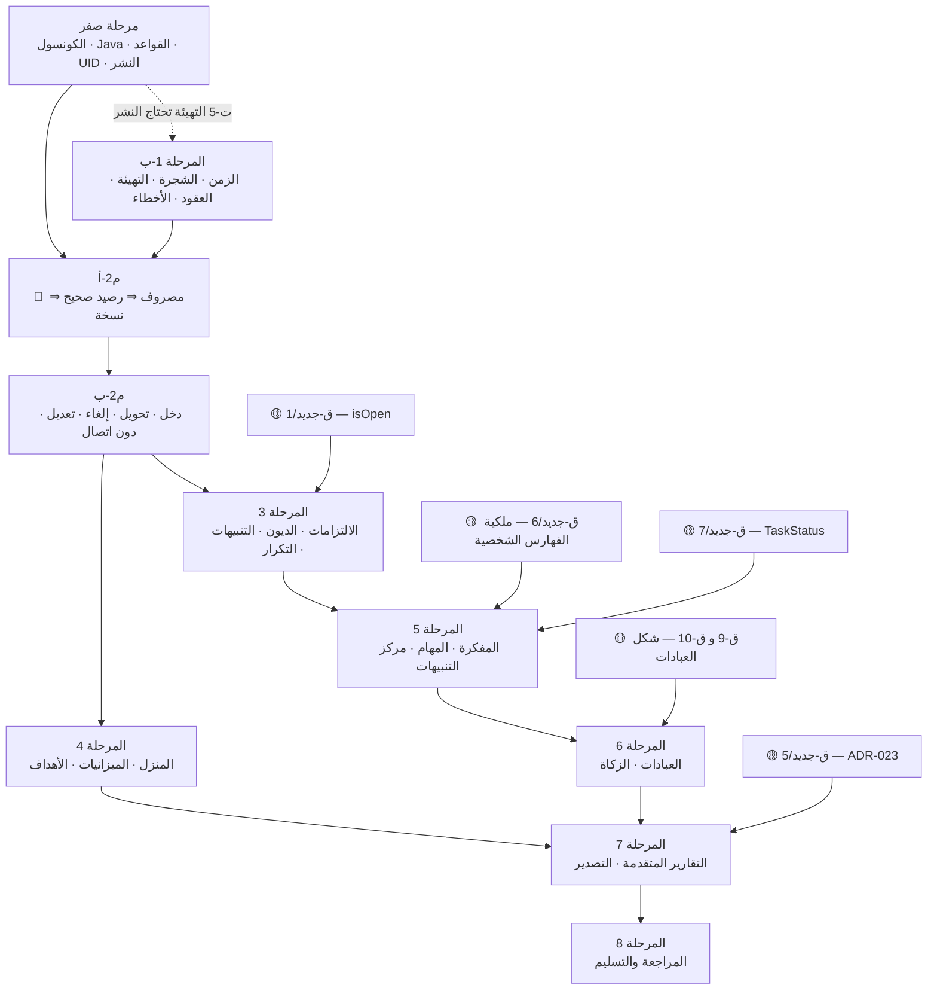

# خطة التنفيذ التفصيلية — رصيد | RASEED

> **المسار:** `docs/11-IMPLEMENTATION-PLAN.md`
> **الحالة:** خطة تنفيذ قابلة للتشغيل. لا تُعدِّل عقد النواة ولا أي وثيقة تصميم — تُرتِّب تنفيذها فقط.
> **المراجع الأعلى (بهذا الترتيب):** `docs/00-REQUIREMENTS.md` ← `docs/01-OWNER-DECISIONS.md` (ق-1، ق-2، ق-3)
> ← `docs/design/01-financial-core.md` (**العقد المحاسبي المُلزِم**) ← بقية `docs/design/*.md`.
> **النطاق:** القسم 24 من المتطلبات (المراحل الثماني) + مرحلة صفر لما يتطلب المالك شخصيًا،
> مع تحديث صريح لحالة المرحلة الأولى بناءً على **قياس الكود القائم** لا على افتراض.
> **قاعدة هذه الوثيقة:** كل سطر «أُنجز» مقترن بأمر تحقّق يُعاد تشغيله. وكل سطر «لم يُنجز»
> مقترن باسم ملف وبمعيار قبول بصيغة «عند X يحدث Y».
> **الوثائق الشقيقة على هذا المستوى:** `docs/10-MASTER-ARCHITECTURE.md` (الصورة الكاملة
> للمالك) · `docs/12-RISK-REGISTER.md` (**سجل المخاطر المرجعي** — و§16 هنا مقتطف تنفيذي منه لا بديل).

---

## 0. كيف تُقرأ هذه الوثيقة

| إن كنت | فاقرأ |
|---|---|
| **المالك** وتريد أقصر طريق إلى استخدام يومي | §1 (أقصر مسار) ثم §3 (مرحلة صفر) ثم §14 (قراراتك المطلوبة) |
| **المالك** وتريد أن تعرف أين صار المشروع | §2 (لوحة الحالة المقيسة) |
| **المنفِّذ** وستكتب كودًا الآن | §4 (المرحلة 1-ب) ثم §5 (المرحلة 2) — لا تبدأ قبل اجتياز بوابة §3.3 |
| **المنفِّذ** وتخطّط للأسابيع القادمة | §6 … §11 (المراحل 3-8) و§12 (الأحجام) و§15 (الترتيب والاعتماديات) |
| تريد معرفة ما يَحجُب ماذا | §15 (مخطط الاعتماديات) و§16 (المخاطر) |

**اصطلاحات ثابتة في كل مرحلة:**

- **الهدف** جملة واحدة · **الاعتماديات** ما لا تبدأ المرحلة قبله · **المهام** مرقّمة بأسماء ملفات فعلية
- **معايير القبول** بصيغة «عند X يحدث Y» — قابلة للتحقق موضوعيًا بلا رأي
- **الاختبارات** بأسماء حالات محددة (رموز النواة §20 و`07` §19 و`08` §12 و`09` §14)
- **تعريف الإنجاز (DoD)** · **المخرجات الملموسة** · **الحجم:** صغيرة (≤ يوم عمل مركَّز) /
  متوسطة (2–4 أيام) / كبيرة (5–10 أيام)
- **🔴 حاجب** = لا تقدُّم بدونه · **🟡 قرار مالك** · **✅ منجز ومقيس** · **⏳ قيد العمل** · **⬜ لم يبدأ**

---

## 1. أقصر مسار إلى نسخة قابلة للاستخدام اليومي

**تعريف «قابلة للاستخدام اليومي» في هذه الوثيقة — وهو التعريف الوحيد المعتمد:**

> أفتح التطبيق على الهاتف، أسجّل دخولي بحساب Google، أرى أرصدة حساباتي الحقيقية،
> **أسجّل مصروفًا واحدًا وأرى الرصيد ينقص بالمبلغ نفسه بالضبط**، وأرى «مصروفات الشهر»
> تزيد بالمبلغ نفسه، ثم **أصدّر نسخة JSON احتياطية**. وكل ذلك على بيانات حقيقية لا تجريبية.

### 1.1 القائمة — 22 مهمة بالترتيب الإلزامي

لا تُقدَّم مهمة على سابقتها. رمز كل مهمة يُحيل إلى القسم الذي يفصّلها.

| # | المهمة | الملف/الإجراء | الموضع | حاجب؟ |
|---|---|---|---|---|
| 1 | **تفعيل مزوّد Google** في Firebase Console | الكونسول | §3.2/ص-1 | 🔴 |
| 2 | **تثبيت Java 17+** لتشغيل محاكي Firestore | `winget install EclipseAdoptium.Temurin.17.JDK` | §3.2/ص-2 | 🔴 |
| 3 | **استبدال `firestore.rules`** بمحتوى `04-security.md` §6 — الملف الحالي يحمل ع-أمن-1 القاتل | `firestore.rules` | §3.2/ص-3 | 🔴 |
| 4 | **تثبيت UID المالك** بالإجراء غير القابل للتبديل | `firestore.rules` + `.env.local` | §3.2/ص-4 | 🔴 |
| 5 | **تشغيل 135 حالة قواعد خضراء** على المحاكي | `tests/rules/**` | §3.2/ص-5 | 🔴 |
| 6 | **نشر القواعد والفهارس** بموافقتك | `npm run deploy:rules` | §3.2/ص-6 | 🔴 |
| 7 | **تقييد مفتاح API** على النطاقات وعلى أربع واجهات برمجية | Google Cloud Console | §3.2/ص-7 | 🟡 |
| 8 | إكمال وحدة الزمن بـ `dateKeyToUtcNoon` و`startOfWeek` | `src/lib/time.ts` | §4/ت-1 | 🔴 |
| 9 | توحيد `DateKey` كاسم بديل لـ `ISODate` | `src/domain/types/primitives.ts` | §4/ت-2 | 🔴 |
| 10 | شجرة الحسابات كبيانات + المعرّفات الحتمية من `code` | `src/domain/coa/{codes,sides,seed}.ts` | §4/ت-3 | 🔴 |
| 11 | بُناة المسارات المُقنَّنة | `src/data/firebase/paths.ts` | §4/ت-4 | 🔴 |
| 12 | التهيئة idempotent: الشجرة + `meta/integrity` + `meta/schema` + `settings/app` + الفئات | `src/data/seed/ensureSeed.ts` | §4/ت-5 | 🔴 |
| 13 | مخططات Zod لحدّ الإدخال وحدّ القراءة | `src/domain/contracts/**` | §4/ت-6 | 🔴 |
| 14 | `AppError` + جدول الرسائل العربية + تحويل أخطاء Firestore | `src/domain/errors/**` | §4/ت-7 | 🔴 |
| 15 | `planOperation` + خطة `expense` — نقية بلا Firebase | `src/domain/ops/{plan.ts,plans/expense.ts}` | §5/ت-1 | 🔴 |
| 16 | `runPlan` ثلاثي المراحل: قراءة ← قرار ← كتابة | `src/data/tx/runPlan.ts` | §5/ت-2 | 🔴 |
| 17 | **مُشفِّر `periodDelta` يكتب كل الحقول العددية بـ `increment(0)`** — وإلا رُفض أول مصروف غير منزلي في كل شهر | `src/data/ledger/writers/periods.ts` | §5/ت-3 | 🔴 |
| 18 | `postOperation` — نقطة الكتابة المالية الوحيدة | `src/data/ledger/postOperation.ts` | §5/ت-4 | 🔴 |
| 19 | الاشتراكات الحيّة بعدّاد مراجع + محدِّدات النقد والفترة | `src/data/live/**` + `src/domain/selectors/{cash,period}.ts` | §5/ت-6 | 🔴 |
| 20 | الحد الأدنى من `ui` + نموذج المصروف | `src/ui/{primitives,money}/**` + `src/features/transactions/forms/ExpenseForm.tsx` | §5/ت-8 | 🔴 |
| 21 | بطاقتا «الأموال المتاحة» و«مصروفات الشهر» + شاشة الحسابات وكشف الحركة | `src/features/dashboard/**` + `src/features/accounts/**` | §5/ت-9 | 🔴 |
| 22 | **التصدير اليدوي JSON** — النسخة الاحتياطية الوحيدة (ق-1، التزام 3) | `src/data/export/exportAllJson.ts` + `src/features/backup/**` | §5/ت-11 | 🔴 |

### 1.2 ما لا يدخل هذا المسار — صراحةً

الالتزامات، الديون، الميزانيات، الأهداف، شاشة المنزل، المفكرة، المهام، العبادات، الزكاة،
التقارير المتقدمة، التصدير إلى Excel/PDF، الرسوم البيانية، التكرار والتنبيهات.
**كلها بعد النسخة القابلة للاستخدام**، لأن أيًّا منها ليس شرطًا لمعادلة «مصروف ⇒ رصيد صحيح».

### 1.3 ثلاثة أشياء تُسقط المسار كله لو أُهملت

| الخطر | لماذا يُسقط المسار | يُعالَج في |
|---|---|---|
| نشر `firestore.rules` الحالي كما هو | ع-أمن-1: قراءة `resource.data` في `allow create` المدموجة ⇒ `resource == null` عند الإنشاء ⇒ خطأ تقييم ⇒ **أول مصروف في أي شهر جديد يُرفَض**، وإنشاء أي التزام يُرفَض | §3.2/ص-3 |
| مُشفِّر `periodDelta` لا يكتب الحقول العددية كاملة | قاعدة `periods` تشترط حضور `householdExpenseMinor` في `create` ⇒ **أول مصروف غير منزلي في كل شهر يُرفَض** (ثغرة ق-2 / ADR-034) | §5/ت-3 |
| غياب `meta/integrity` من التهيئة | بوابة إعادة البناء في القواعد تقرؤه ⇒ `permission-denied` على **كل** كتابة مالية برسالة لا تشرح شيئًا (ع-ج-5) | §4/ت-5 |

---

## 2. لوحة الحالة — مقيسة لا مفترَضة

**تاريخ القياس:** 2026-10-10. كل رقم أدناه ناتج أمر شُغِّل على المستودع، والأمر مذكور بجانبه.

### 2.1 ما يعمل اليوم

| البند | الحالة | القياس | أمر التحقّق |
|---|---|---|---|
| البناء الإنتاجي | ✅ | `✓ built in 242ms` + PWA: 9 مُدخَلات، 912 KiB | `npm run build` |
| اختبارات الوحدة | ✅ | **4 ملفات، 144 اختبارًا، كلها ناجحة** | `npm run test` |
| توزيع الاختبارات | ✅ | `money` 34 · `arithmetic` 25 · `time` 29 · `ulid` 17 | `grep -c "it(" tests/unit/*.test.ts` |
| الترجمة النوعية | ✅ | `tsc -b` نظيف | `npm run typecheck` |
| وحدة المال | ✅ | 7 ملفات ومدخل واحد: `types · arithmetic · rate · allocate · parse · format · installments` | `cat src/domain/money/index.ts` |
| وحدة الزمن | ✅ جزئيًا | 28 تصديرًا، توقيت ليبيا UTC+2 ثابت، `ISODate`/`PeriodKey`/`ISOTimestamp` موسومة، و`setClock`/`resetClock` للاختبار | `grep "^export" src/lib/time.ts` |
| عقد الأنواع | ✅ | 11 وحدة تحت `src/domain/types/**` تُصدَّر من `index.ts` | `ls src/domain/types` |
| تهيئة Firebase + المصادقة | ✅ | `src/data/firebase/{app,auth}.ts` — Google فقط، و`connectEmulatorsOnce` داخل `app.ts` | `ls src/data/firebase` |
| نظام التصميم (الرموز) | ✅ جزئيًا | `src/ui/styles/{tokens,index}.css` — سلّم «نيلي» h=283° كاملًا + الرموز الدلالية المالية | `head -40 src/ui/styles/tokens.css` |
| هيكل مؤقت بعد الدخول | ✅ | `src/app/App.tsx` يعرض `formatLYD(unsafeMinor(0))` صريحًا و**لا يختلق أي رقم** (المتطلبات §25/4) | `cat src/app/App.tsx` |
| Firebase CLI | ✅ | الإصدار **15.33.0**، ومشروع افتراضي `raseed-2fac1` | `firebase --version` |
| Node | ✅ | **v24.18.0** (المطلوب ≥ 20) | `node -v` |
| تبعيات نظيفة | ✅ | `npm audit` صفر ثغرات، مع `overrides` على `@grpc/grpc-js` | `npm audit` |

### 2.2 ما كُتب ولم يُفعَّل بعد

| البند | القياس الفعلي | الفارق عن المطلوب |
|---|---|---|
| `firestore.indexes.json` | **96 فهرسًا مركَّبًا + 55 استثناء فهرسة**، JSON صالح، مطابق حرفيًا لكتلة `03` §10.2 | **لم يُنشَر.** وفهارس المجموعات الشخصية فيه بأسماء `03` §9.8 لا `09` §12.1 — §14/ق-جديد-6 |
| المجموعات المُفهرَسة | 21 مجموعة: `accountPeriods, accounts, attachments, auditLogs, contacts, debts, financialGoals, importBatches, incomeSchedules, journalEntries, notes, notifications, obligations, operations, pendingCommands, postings, recurrences, reminders, scenarios, tasks, zakatRecords` | **لا `worshipDays` ولا `quranSessions` ولا `habits` إطلاقًا**، و`tasks` بـ `status + dueDate` لا `trashed + status` |
| `firestore.rules` | **396 سطرًا** (لا 389) — مسوّدة النواة §14.3 حرفيًا + `match /{document=**}` مانع | **لا يُنشَر ويُستبدل.** يحمل ع-أمن-1 القاتل وتنقصه 18 `match` |
| اختبارات القواعد | `tests/rules/firestore.rules.test.ts` فيه **35 حالة `it(`** | `04-security.md` §10.3 يوصّف **135 حالة** ⇒ 100 حالة غير مكتوبة، و**لا واحدة شُغِّلت** |
| محاكي Firestore | `java: command not found` | 🔴 **Java غير مثبَّتة** ⇒ `npm run test:rules` لا يعمل ⇒ **صفر قاعدة أمنية مُختبَرة**، ومنها كل إصلاحات ع-أمن-10…15 |
| مزوّد Google | — | 🔴 **غير مُفعَّل في الكونسول** ⇒ `signInWithPopup` سيفشل بـ `auth/operation-not-allowed` |
| `VITE_OWNER_UID` | `z.string().default('')` في `src/lib/env.ts` | فارغ ⇒ `App.tsx` يعتبر الجميع مالكًا. **تجربة استخدام فقط** — الحاجز الحقيقي في القواعد (ق-2) |

### 2.3 ثقوب مقيسة في الأصول والوثائق

| الثقب | القياس | الأثر الملموس | يُعالَج في |
|---|---|---|---|
| أصول PWA مفقودة | `public/` يحتوي `favicon.svg` **وحده**، و`vite.config.ts` يُدرج `apple-touch-icon.png` و`pwa-192.png` و`pwa-512.png` و`pwa-512-maskable.png` | التثبيت على الهاتف بأيقونة مكسورة | §4/ت-9 |
| الخطوط مفقودة | لا `public/fonts/` إطلاقًا | خط النظام الاحتياطي ⇒ الأرقام غير مُحاذاة في الجداول | §4/ت-9 |
| `--font-numeric` غير معرَّف | `grep -rn "font-numeric" src/` ⇒ **صفر نتائج** | `tabular-nums` غير مفروض في الجداول المالية (ق-3) | §4/ت-9 |
| مجلد ADR فارغ | `docs/adr/` فيه **صفر ملفات** مع أن `02` §5.1 يُدرج ADR-001…ADR-040 | «وثّق أي قرار معماري» (المتطلبات §25/14) غير منفَّذ | §4/ت-10 |
| وحدة الزمن ناقصة | لا `dateKeyToUtcNoon` ولا `startOfWeek` ضمن 28 تصديرًا | `postings.bookedAtTs` (عقد النواة §4.3) غير قابل للبناء ⇒ **يحجب أول مصروف** | §4/ت-1 |
| تضارب تسمية النوع | الكود `ISODate` · `07` و`09` `DateKey` | نوعان موسومان لنفس الشيء لا يتبادلان بلا `as` | §4/ت-2 |
| انحراف شجرة الملفات | الكود `src/lib/time.ts` و`src/domain/types/primitives.ts` · شجرة `02` §5.2/§5.3 تقول `lib/time/tripoli.ts` و`types/common.ts` | `02` §5.4 أقرّ انحرافين فقط (`emulators.ts` و`auth.ts`)؛ هذان لم يُقَرّا | §4/ت-11 |
| العقد يخالف ق-3 نصًّا | `01-financial-core.md` §2.2 يحمل `Intl.NumberFormat('ar-LY-u-nu-latn', …)` الذي يُنتج `1.250,500` | الكود يحمل الحل الصحيح (`en-US`)؛ **العقد مخالف** ⇒ أي منفِّذ يتبع العقد يكسر ق-3 | §4/ت-10 (ADR-041) |

### 2.4 نسبة الإنجاز الصادقة للمرحلة الأولى (المتطلبات §24/1)

| كتلة المرحلة الأولى | الحالة |
|---|---|
| مراجعة القائم + المتطلبات والكيانات والعلاقات | ✅ تمَّت — 39,690 سطر وثائق تصميم في `docs/design/**` |
| الهيكل البرمجي والطبقات | ✅ `eslint.config.js` قائم ويفرض حُرُمات المال والزمن والطبقات · ⬜ `scripts/verify-layers.mjs` لم يُكتب |
| إعداد Firebase — التطبيق والقاعدة | ✅ تطبيق ويب مسجَّل، Firestore في `europe-west8` (ميلانو) |
| إعداد Firebase — المصادقة والنشر | 🔴 مزوّد Google غير مُفعَّل، ولا قواعد ولا فهارس منشورة |
| قواعد الأمان | ⏳ مكتوبة في موضعين (`04` §6 القابل للنشر، و`firestore.rules` المسوّدة المعطوبة)، **صفر اختبار مُشغَّل** |
| الهوية البصرية والمكونات الأساسية | ⏳ الرموز ✅ · المكوّنات ⬜ — لا `src/ui/primitives` ولا `src/ui/money` |
| **وحدة المال والزمن والمعرّفات والأنواع والمصادقة والاختبارات** | ✅ **منجزة ومقيسة** |

**الحكم الصريح:** المرحلة الأولى **منجزة نحو الثلثين في الكود**، و**محجوبة بالكامل في البيئة**:
كل ما يلمس Firebase فعليًا — مصادقة، قواعد، فهارس — ينتظر مرحلة صفر.
---

## 3. مرحلة صفر — ما لا يستطيع أحد غير المالك فعله

**الهدف:** تحويل المشروع من «يبني ويختبر محليًا» إلى «يكتب في Firestore حقيقي بقواعد مفروضة ومُختبَرة».

**الاعتماديات:** لا شيء. هذه أول مرحلة زمنيًا، وهي **بوابة** لكل ما بعدها.

**الحجم:** متوسطة — أغلبها انتظار كونسول وتنزيل، لا كتابة كود.

### 3.1 ما أُنجز فعلًا من مرحلة صفر — لا تُعِده

| # | البند | الدليل المقيس |
|---|---|---|
| ✅ م-1 | **إنشاء مشروع Firebase** `raseed-2fac1` | `.firebaserc` ⇒ `"default": "raseed-2fac1"` |
| ✅ م-2 | **تسجيل تطبيق ويب** والحصول على مفاتيح التهيئة | `.env.local` مملوء، و`src/lib/env.ts` يتحقق منه بـ Zod ويفشل سريعًا عند النقص |
| ✅ م-3 | **إنشاء قاعدة Firestore** في `europe-west8` (ميلانو) | وضع الإنتاج، وهي أقرب منطقة إلى ليبيا |
| ✅ م-4 | **تسجيل دخول Firebase CLI** على جهاز المالك | `firebase --version` ⇒ 15.33.0 ويستجيب للمشروع |
| ✅ م-5 | **ضبط `firebase.json`** — Hosting من `dist` + إعادة توجيه SPA + ترويسات أمنية + منافذ المحاكيات | `cat firebase.json` |
| ✅ م-6 | **كتابة** القواعد والفهارس (لا نشرها) | `firestore.rules` 396 سطرًا · `firestore.indexes.json` 96 فهرسًا |
| ✅ م-7 | **إعداد سكربتات النشر والمحاكي** في `package.json` | `deploy:rules` · `deploy:hosting` · `emulators` · `test:rules` |

### 3.2 ما بقي — ثماني خطوات بالترتيب غير القابل للتبديل

#### 🔴 ص-1 — تفعيل مزوّد Google في الكونسول

```
Firebase Console → raseed-2fac1 → Build → Authentication → Sign-in method
  1) Add new provider → Google → Enable
  2) Project support email: albarshi.96@gmail.com
  3) Save
  4) Settings → Authorized domains — تأكّد من وجود:
       localhost
       raseed-2fac1.web.app
       raseed-2fac1.firebaseapp.com
  5) Sign-in method → بقية المزوّدين: تأكّد أن جميعهم Disabled   (ق-2)
```

> **لا تُوقف `Enable create (sign-up)` الآن.** إيقافها قبل أول تسجيل دخول للمالك يمنع إنشاء
> حسابه نفسه. موضعها الصحيح هو **ص-4 بند 6** بعد التقاط UID.

**معايير القبول:**

| عند | يحدث |
|---|---|
| الضغط على «الدخول بحساب Google» في `npm run dev` | يُفتح اختيار حساب Google، وتعود الجلسة وUID ظاهر على الشاشة |
| تسجيل الدخول | **لا يظهر** `auth/operation-not-allowed` ولا `auth/unauthorized-domain` |
| فتح Console → Authentication → Users | يُسرد مستخدم واحد ببريد `albarshi.96@gmail.com` |

#### 🔴 ص-2 — تثبيت Java لتشغيل محاكي Firestore

```powershell
# Windows 11 — الأمر الفعلي
winget install --id EclipseAdoptium.Temurin.17.JDK -e --accept-package-agreements
# ثم أعِد فتح الطرفية وتحقّق:
java -version          # يجب أن يطبع 17 أو أحدث
# ثم:
npm run emulators      # Auth 9099 · Firestore 8080 · UI 4000
```

**لماذا هذه خطوة مالك لا منفِّذ:** التثبيت يتطلب صلاحية على الجهاز. و**القياس الحالي**
`java: command not found` يعني أن `npm run test:rules` لا يعمل إطلاقًا ⇒ **صفر قاعدة أمنية
مُختبَرة**، ومنها كل إصلاحات ع-أمن-10…15 المكتوبة في `04-security.md` §6.

**معايير القبول:**

| عند | يحدث |
|---|---|
| `java -version` | يُطبع إصدار 17 أو أحدث |
| `npm run emulators` | يُقلع المحاكي وتُفتح واجهته على `http://localhost:4000` بلا خطأ Java |
| `npm run test:rules` | تُشغَّل الحالات وتُطبَع نتيجة — ولو بفشل منطقي — **لا خطأ بيئة** |

#### 🔴 ص-3 — استبدال `firestore.rules` بالمحتوى القابل للنشر

**هذا قرار نشر لا قرار كود، ولذلك هو هنا.**

| الملف | ما هو | الحكم |
|---|---|---|
| `firestore.rules` (396 سطرًا) | مسوّدة النواة §14.3 حرفيًا + `match /{document=**}` مانع | **لا يُنشَر.** يحمل ع-أمن-1، وتنقصه 18 `match` |
| `docs/design/04-security.md` §6 | الملف الوحيد القابل للنشر — مُثبَّت بـ §6.0 «مصدر واحد للقواعد» | **هذا ما يُنشَر** |

**ما هو ع-أمن-1 بالضبط:** في المسوّدة الحالية تدمج قواعد `accountPeriods` و`obligations`
عبارتَي `allow create, update` في واحدة تقرأ `resource.data`. عند الإنشاء `resource == null`
⇒ خطأ تقييم ⇒ رفض. **الأثر الملموس: أول مصروف في أي شهر جديد يُرفَض، وإنشاء أي التزام يُرفَض.**

**وما تنقصه:** 18 `match`. و`03` §17/٤ و`06` §17/١ يُعلنان غياب `match` لأربعة عشر مسارًا
(`notes`, `tasks`, `reminders`, `zakatRecords`, `householdBudgets`, `attachments`, `profile`,
`budgetTemplates`, `scenarios`, `fiscalPeriods` …) مع `allow write: if false` على مستوى
`users/{uid}` ⇒ `permission-denied` عند أول كتابة في كل واحدة منها.

```bash
cp firestore.rules firestore.rules.core-draft.bak       # نسخة احتياطية للمسوّدة
# انقل كتلة §6 من docs/design/04-security.md إلى firestore.rules كاملةً
firebase deploy --only firestore:rules --dry-run        # تحقّق صرفي بلا نشر
```

**معايير القبول:**

| عند | يحدث |
|---|---|
| `grep -c "match /databases" firestore.rules` | الناتج `1` |
| البحث عن `match /{document=**}` | لا يظهر أي **منح** عام — الحرّاسة الختامية للرفض وحدها مقبولة (CLAUDE.md §15) |
| `firebase deploy --only firestore:rules --dry-run` | لا خطأ صرفي |
| عدّ كتل `match` للمجموعات | **لا مجموعة في `src/data/firebase/paths.ts` بلا قاعدة** — يفرضه `tests/rules/coverage.rules.test.ts` آليًا |

#### 🔴 ص-4 — تثبيت UID المالك (الترتيب غير قابل للتبديل — `04-security.md` §3.3)

```
1) انشر قواعد "مرحلة التهيئة" المؤقتة:
     allowedUids() = []                      ← لا أحد يكتب شيئًا
     + match /users/{uid}/bootstrap/{d}
         allow create: if request.auth != null && request.auth.uid == uid
                       && request.auth.token.email == 'albarshi.96@gmail.com'
                       && request.auth.token.email_verified == true;
         allow read:   if request.auth != null && request.auth.uid == uid;
2) سجّل الدخول بحساب Google للمالك من نطاق مأذون.
3) اقرأ UID من الشاشة (App.tsx يطبعه) أو من Console → Authentication → Users.
4) ضعه في allowedUids() في firestore.rules — وفي VITE_OWNER_UID في .env.local.
5) احذف قاعدة bootstrap نهائيًا + احذف مجموعة bootstrap.
6) انشر القواعد النهائية. **ثم** أوقف Enable create (sign-up).
7) شغّل سكربت التهيئة (seed) — وهو §4/ت-5 في هذه الخطة.
```

**لماذا البريد مرة واحدة فقط:** البريد قابل للتغيير و`uid` ثابت (ق-2 نصًّا). البريد يضيّق
نافذة التهيئة ثم يُحذف المسار بالكامل. **لا قاعدة إنتاجية واحدة تعتمد على `token.email`.**

**معايير القبول:**

| عند | يحدث |
|---|---|
| تسجيل دخول بحساب Google **غير** المالك ومحاولة قراءة أي مستند | `permission-denied` **من القواعد** لا من الواجهة (`T-ISOLATION`) |
| `grep "REPLACE_WITH_OWNER_UID" firestore.rules` | لا نتيجة |
| فتح التطبيق بحساب غير معتمد | تظهر شاشة «حساب غير مُصرَّح» مع زر خروج — **تجربة استخدام فقط** |
| `grep "token.email" firestore.rules` | لا نتيجة بعد حذف كتلة bootstrap |

#### 🔴 ص-5 — تشغيل اختبارات القواعد إلى الأخضر

**الوضع المقيس:** 35 حالة مكتوبة من 135 موصَّفة في `04-security.md` §10.3، وصفر مُشغَّلة.

```bash
npm run test:rules      # يتطلب ص-2
```

**معايير القبول:**

| عند | يحدث |
|---|---|
| `npm run test:rules` | تمرّ **135 حالة** بلا فشل |
| محاولة إنشاء قيد غير متوازن | يُرفَض من القواعد — `T-RULES-1` (الاختبار الذي يكشف عيب الأسبقية ع-أ-1) |
| حذف `users/{uid}/meta/integrity` ثم تسجيل مصروف | **النظام يبقى يعمل** — النمط الآمن `!exists(…) \|\| get(…)` (`T-RULES-GATE`) |
| `rebuildStatus == 'running'` ومحاولة إنشاء قيد | يُرفَض (`T-RULES-GATE`) |
| تنقيص `debitTotalMinor` و`rebuildStatus != 'running'` | يُرفَض؛ **ويُقبَل** عندما `rebuildStatus == 'running'` (`T-REPAIR`، ع-أ-4) |
| قيد داخل فترة مُقفلة | يُرفَض **من القواعد** لا من الكود (`T-LOCK`) |
| `paidMinor > due` أو `remainingMinor` خاطئ أو `balanceMinor != debit−credit` | يُرفَض (`T-RULES-2..9`) |
| كل مجموعة في `paths.ts` | لها قاعدة — يفرضه `tests/rules/coverage.rules.test.ts` |

**وقياس إلزامي مرافق (ع-أمن-2):** تُطبَع ميزانية استدعاءات `get`/`exists` لمعاملة
`payObligation` ويُثبَت أنها **≤ 20**. التقدير الحالي **17–21** — أي أن 21 يعني **رفض معاملة
كاملة**. إن تجاوزت، تُدمَج الشروط في قاعدة واحدة أو تُنقل إلى `postOperation` **بتوثيق الانحراف
في ADR**، ولا تُنشَر قبل القياس.

#### 🔴 ص-6 — نشر القواعد والفهارس (بموافقة صريحة منك)

```bash
npm run deploy:rules                  # firestore:rules + firestore:indexes
firebase firestore:indexes            # سرد الفهارس المنشورة للمطابقة
```

**لا تُنفَّذ قبل اجتياز ص-3 و ص-4 و ص-5** — المتطلبات §25/10 («القواعد ليست جاهزة لمجرد
كتابتها») و§25/11 («لا نشر إنتاجي قبل مراجعة الأثر والموافقة»).

**معايير القبول:**

| عند | يحدث |
|---|---|
| `firebase firestore:indexes` | يُسرد **96 فهرسًا** في حالة `READY` لا `CREATING` |
| تسجيل أول مصروف | لا `failed-precondition` |
| فتح لوحة التحكم | لا `failed-precondition` على أي استعلام |

> **ملاحظة تهدئة — لا تؤخّر النشر بسببها:** فهارس على حقول لم تُقَرّ بعد
> (`obligations.isOpen`, `debts.nextFollowUpDate`, `financialGoals.priority`)
> **لا تُفسد النشر**: الحقل الغائب لا يُفهرَس، فالفهرس يبقى خاملًا بلا تكلفة. أثرها أن
> **الشاشة تظهر فارغة بلا رسالة خطأ** — وهذا سبب وجود §14/ق-جديد-1 و ق-جديد-2، لا سبب للتأخير.

#### 🟡 ص-7 — تقييد مفتاح API (`04-security.md` §12.2)

```
Google Cloud Console → raseed-2fac1 → APIs & Services → Credentials
  1) المفتاح: "Browser key (auto created by Firebase)"
     [تحذير] لا تُقيَّد مفاتيح Android/iOS/Server بالطريقة نفسها — لها ضوابط مختلفة
  2) Application restrictions → HTTP referrers:
        https://raseed-2fac1.web.app/*
        https://raseed-2fac1.firebaseapp.com/*
        http://localhost:5173/*        (تطوير — ويُفضَّل مفتاح منفصل لا نفس المفتاح)
  3) API restrictions → Restrict key → هذه الأربع فقط:
        Identity Toolkit API · Token Service API
        Cloud Firestore API  · Firebase Installations API
     ولا تُضَف: Firebase Management API
     وتُضاف لاحقًا فقط عند الحاجة: Cloud Storage for Firebase · App Check · FCM Registration
  4) Save — الانتشار حتى 5 دقائق
  5) تحقّق إلزامي قبل إقفال التاب:
       أ) خروج ودخول كامل من النطاق الإنتاجي
       ب) getIdToken(true) ⇒ لا خطأ 403
       ج) تسجيل مصروف واحد ⇒ نجاح
       د) فتح لوحة التحكم ⇒ كل الأرقام تظهر
  6) خطة التراجع: أي 403 أو api-key-not-valid ⇒ أعِد Application restrictions
     إلى None فورًا، ثم شخّص أي API كان ناقصًا
```

> **أخطر خطأ في هذا الإجراء: إسقاط Token Service API.** الأثر مُخاتِل — الدخول ينجح
> والتطبيق يعمل، ثم **بعد ساعة بالضبط** يفشل كل شيء على كل الأجهزة بأخطاء مصادقة غامضة.

**ولا يُخلَط بينهما:** `Authorized domains` في Auth تُحدِّد من يُكمل **تدفق الدخول**،
و`HTTP referrers` على المفتاح تُحدِّد من يستخدم **المفتاح** في نداءات API.
الاثنان مطلوبان، وكلٌّ يُضبط في مكانه.

**معيار القبول:** عند إكمال التحقق الرباعي (أ…د) بعد 5 دقائق من الحفظ، **لا 403 واحد**
في تبويب الشبكة؛ وعند إعادة تحميل التطبيق بعد ساعة تبقى الجلسة صالحة.

#### 🟡 ص-8 — قرار النسخ الاحتياطي اليدوي

على Spark لا نسخ مجدَّل (ق-1). **التصدير اليدوي JSON هو النسخة الاحتياطية الوحيدة**،
وهو التزام رقم 3 في `01-OWNER-DECISIONS.md`: «ميزة أساسية في المرحلة الأولى، لا تأجيل».

| ما تقرّره | الخيارات | الافتراضي المقترح |
|---|---|---|
| الدورية | أسبوعي / نصف شهري / شهري | **أسبوعي** |
| موضع الحفظ | Google Drive / قرص خارجي / الاثنان | **الاثنان** — نسخة واحدة في مكان واحد ليست نسخة |
| التذكير | بطاقة في لوحة التحكم عند مرور المدة | **بطاقة + تنبيه `info`** |
| التشفير | نصّ صريح / كلمة سر (`04` §11.5) | **نصّ صريح**، مع حفظ الملف في مكان مشفَّر |
| تجربة الاستعادة | تُجرَّب أم تُؤجَّل | 🔴 **تُجرَّب مرة واحدة على الأقل.** نسخة لم تُستعَد ليست نسخة |

**معيار القبول:** عند الضغط على «تصدير نسخة» ينزل ملف
`raseed-export-v1-YYYY-MM-DD.json` يحمل `schemaVersion` و`projectionVersion`؛
وعند استيراده في مشروع محاكي **تُستعاد كل الأرصدة مطابقةً تمامًا** بعد إعادة بناء الإسقاطات.

### 3.3 بوابة الخروج من مرحلة صفر

لا تبدأ أي مهمة من §5 (المرحلة 2) قبل **كل** هذه:

```
[ ] مزوّد Google مُفعَّل ودخول المالك ينجح                            (ص-1)
[ ] java -version يطبع 17 أو أحدث                                     (ص-2)
[ ] firestore.rules = محتوى 04-security §6، بلا ع-أمن-1               (ص-3)
[ ] UID المالك مثبَّت في القواعد وفي .env.local، وbootstrap محذوف      (ص-4)
[ ] 135 حالة قواعد خضراء + ميزانية payObligation ≤ 20 مقيسة            (ص-5)
[ ] القواعد والفهارس منشورة و96 فهرسًا في READY                         (ص-6)
[ ] مفتاح API مقيَّد والتحقق الرباعي مُجتاز                               (ص-7)
[ ] دورية النسخ وموضع الحفظ مُقرَّران، والاستعادة مُجرَّبة مرة              (ص-8)
```

**مخرجات مرحلة صفر الملموسة:** قواعد وفهارس منشورة ومُختبَرة · UID مثبَّت · مفتاح مقيَّد ·
`docs/ops/FIREBASE-SETUP.md` و`docs/ops/BACKUP.md` مكتوبان بما نُفِّذ فعلًا لا بما كان مخططًا.
---

## 4. المرحلة 1 — التحليل والتأسيس · **تحديث الحالة والمتبقي**

> المتطلبات §24/1: «مراجعة القائم، المتطلبات والكيانات والعلاقات، الهيكل البرمجي،
> إعداد Firebase، قواعد الأمان، الهوية البصرية والمكونات الأساسية».

**الهدف:** إكمال الثلث المتبقي من الأساس حتى تصير كتابة أول عملية مالية مسألة تركيب لا بحث.

**الاعتماديات:** لا شيء على الكود (يمكن أن تسير بالتوازي مع مرحلة صفر)،
**إلا** `ت-5` (التهيئة) التي تتطلب ص-4 و ص-6 لتُشغَّل على الإنتاج.

**الحجم:** متوسطة.

### 4.1 المرحلة 1-أ — المنجز (لا يُعاد)

| البند | الملفات | القياس |
|---|---|---|
| وحدة المال | `src/domain/money/{types,arithmetic,rate,allocate,parse,format,installments,index}.ts` | 59 اختبارًا (`money` 34 + `arithmetic` 25) |
| وحدة الزمن | `src/lib/time.ts` | 29 اختبارًا، UTC+2 ثابت |
| معرّفات العمليات | `src/lib/ulid.ts` | 17 اختبارًا |
| عقد الأنواع | `src/domain/types/**` (11 وحدة) | يُترجَم نظيفًا |
| تهيئة Firebase والمصادقة | `src/data/firebase/{app,auth}.ts` · `src/features/auth/SignInScreen.tsx` | Google فقط |
| رموز التصميم | `src/ui/styles/{tokens,index}.css` | سلّم كامل + رموز دلالية مالية |
| تحقّق البيئة | `src/lib/env.ts` | Zod + فشل سريع |
| فرض الحُرُمات | `eslint.config.js` | يحرّم `toFixed`/`toLocaleString`/`parseFloat`/`new Date()` خارج موضعها |

### 4.2 المرحلة 1-ب — المهام المتبقية

| # | المهمة | الملفات التي تُنشأ أو تُعدَّل | الحجم |
|---|---|---|---|
| **ت-1** 🔴 | إكمال وحدة الزمن: `dateKeyToUtcNoon` (12:00 UTC لحقل `bookedAtTs` — عقد النواة §4.3 و`07` §2.2) و`startOfWeek` (السبت، `weekStartsOn = 6` ثابتًا — §14/ق-8) | **تُعدَّل** `src/lib/time.ts` · **يُعدَّل** `tests/unit/time.test.ts` | صغيرة |
| **ت-2** 🔴 | توحيد تسمية مفتاح التاريخ: `ISODate` هو الاسم الرسمي، و`export type DateKey = ISODate` اسم بديل مؤقت (توصية `02` §11.5) — **قبل أول استيراد متقاطع** | **يُعدَّل** `src/domain/types/primitives.ts` · **تُعدَّل** `src/lib/time.ts` | صغيرة |
| **ت-3** 🔴 | شجرة الحسابات: `normalSideOf`/`lineSign` · رموز الشجرة الثابتة من النواة §3.2 · `accountIdOf(code) = sha1(code).slice(0,20)` الحتمي · الفئات المقترحة من المتطلبات §6 | **يُنشأ** `src/domain/coa/{sides.ts,codes.ts,seed.ts}` · **يُنشأ** `src/lib/hash.ts` | متوسطة |
| **ت-4** 🔴 | بُناة المسارات المُقنَّنة — المصدر الوحيد لأسماء المجموعات، ومنه يقرأ اختبار تغطية القواعد | **يُنشأ** `src/data/firebase/paths.ts` | صغيرة |
| **ت-5** 🔴 | التهيئة idempotent في `writeBatch` واحد مُجزَّأ ≤450: الشجرة (~45 مستندًا) + `meta/integrity` + `meta/schema` + `settings/app` + الفئات | **يُنشأ** `src/data/seed/ensureSeed.ts` · **يُنشأ** `scripts/seed-chart-of-accounts.ts` | متوسطة |
| **ت-6** 🔴 | مخططات Zod: حدّ الإدخال (الطلبات) وحدّ القراءة (المستندات) + `zMinorFromText` و`zDateKey` و`zPeriodKey` | **يُنشأ** `src/domain/contracts/{primitives.ts,requests/,stored/,settings.ts}` | متوسطة |
| **ت-7** 🔴 | الأخطاء: `DomainError` + `AppError` + تحويل رموز Firestore + `ZodError` + **جدول الرسائل العربية مصدرًا وحيدًا للنص** | **يُنشأ** `src/domain/errors/{DomainError.ts,AppError.ts,fromFirestore.ts,fromZod.ts,messages.ar.ts}` | متوسطة |
| **ت-8** | شبكة أمان حدود الطبقات بأداة البناء لا بالمراجعة (`02` §4.4؛ و`eslint-plugin-boundaries` **مرفوضة بـ ADR-025**) | **يُنشأ** `scripts/verify-layers.mjs` · **يُعدَّل** `package.json` (سكربت `verify:layers`) | صغيرة |
| **ت-9** | أصول العرض: 4 أيقونات PWA + `robots.txt` (`Disallow: /` — ق-2) + ثلاثة خطوط `woff2` محليًا (ADR-035) + **تعريف `--font-numeric`** وفرض `tabular-nums` | **يُنشأ** `public/{apple-touch-icon.png,pwa-192.png,pwa-512.png,pwa-512-maskable.png,robots.txt,fonts/*}` · **يُعدَّل** `src/ui/styles/tokens.css` | صغيرة |
| **ت-10** | كتابة ملفات ADR الناقصة — والمجلد **فارغ** اليوم. أولوية لثلاثة: **ADR-041** (`formatLYD` بـ `en-US` لا `ar-LY-u-nu-latn` — يصحّح مخالفة العقد §2.2 لق-3) · **ADR-042** (`weekStartsOn = 6` ثابت، ومفتاح العرض إن أُقِرّ **لا يقرؤه محرّك التكرار**) · **ADR-043** (`startOfWeek`/`dateKeyToUtcNoon` في `lib/time` لا في `domain`) | **يُنشأ** `docs/adr/ADR-041-format-lyd-en-us.md` وما بعده | صغيرة |
| **ت-11** | تثبيت انحرافَي شجرة الملفات القائمين: `src/lib/time.ts` ملفًا واحدًا، و`src/domain/types/primitives.ts` بدل `common.ts` — **إمّا** إقرارهما في `02` §5.4 **أو** إعادة الهيكلة. القرار المقترح: **إقرارهما** (الملف 220 سطرًا ومختبَر، وإعادة تسميته تكلفة بلا مقابل) | **يُعدَّل** `docs/design/02-architecture.md` §5.4 (جدول الانحرافات) | صغيرة |
| **ت-12** | المكوّنات الأساسية الدنيا (لا المكتبة كاملة): `Button · Input · NumberInput · Select · Label · FieldError · Card · Page · Spinner · EmptyState · ErrorState · Toast` | **يُنشأ** `src/ui/primitives/**` · `src/ui/layout/**` · `src/ui/feedback/**` | متوسطة |

### 4.3 معايير قبول المرحلة 1-ب

| عند | يحدث |
|---|---|
| استدعاء `dateKeyToUtcNoon('2026-03-15')` | تعود طابعة زمنية عند **12:00 UTC** بالضبط من ذلك اليوم — لا 00:00 ولا توقيت محلي |
| استدعاء `startOfWeek('2026-10-10')` حيث السبت 2026-10-10 | يعود `'2026-10-10'` نفسه؛ وللأحد 2026-10-11 يعود `'2026-10-10'` |
| استيراد `DateKey` من `domain/types` واستيراد `ISODate` من `lib/time` وتمرير أحدهما مكان الآخر | **يُترجَم بلا `as`** |
| تشغيل `ensureSeed` مرتين على قاعدة فارغة | عدد المستندات **لا يتغير** بين التشغيلين، ولا تُنشأ شجرة ثانية (معرّفات حتمية من `code`) |
| حذف `users/{uid}/meta/integrity` ثم تسجيل مصروف | **النظام يبقى يعمل** — لا `permission-denied` (النمط الآمن) |
| إدخال `١٢٥٠٫٥` في حقل مبلغ | يُقبَل ويُفسَّر 1,250,500 درهمًا (`normalizeDigits` + `parseAmountToMinor`) |
| إدخال `1250.5555` | **يُرفَض برسالة عربية** تشرح أن الدرهم ثلاث خانات — لا تقريب صامت |
| حدوث `permission-denied` من Firestore | تظهر رسالة عربية من `messages.ar.ts`، **ولا يظهر النص الإنجليزي للمستخدم** |
| `grep -rn "font-numeric" src/` | يظهر تعريف `--font-numeric` في `tokens.css` وتطبيقه على `[data-money]` والجداول |
| `npm run verify:layers` | ينجح، ويفشل عند إدخال استيراد من `firebase` داخل `src/domain/**` |
| فتح `docs/adr/` | **لا يكون فارغًا** — وفيه ADR-041 يُصحّح انحراف ق-3 في العقد §2.2 |

### 4.4 الاختبارات المطلوبة — بأسماء الحالات

| الحالة | ما تفحصه | الملف |
|---|---|---|
| `T-TIME-NOON` | `dateKeyToUtcNoon` تعطي 12:00 UTC لكل يوم في سنة كاملة، وعكسها `toLibyaISODate` يعيد اليوم نفسه | `tests/unit/time.test.ts` |
| `T-TIME-WEEK` | `startOfWeek` على السبت وعلى كل أيام الأسبوع السبعة + عبور الشهر وعبور السنة | `tests/unit/time.test.ts` |
| `T-COA-ID` | `accountIdOf(code)` حتمية: نفس `code` ⇒ نفس المعرّف في 1000 تشغيل؛ ولا تضارب بين الرموز الـ45 | `tests/unit/coa.test.ts` |
| `T-COA-SIDE` | `normalSideOf` للأنواع الخمسة + `lineSign` يطابق جدول النواة §3.1 صفًّا صفًّا | `tests/unit/coa.test.ts` |
| `T-SEED-IDEM` | `ensureSeed` ×3 ⇒ عدد مستندات ثابت ولا تعديل على مستند قائم | `tests/integration/seed.test.ts` (محاكي) |
| `T-SEED-GUARD` | غياب `meta/integrity` ⇒ النظام يعمل؛ وحضوره بقيمة `rebuildStatus:'running'` ⇒ الكتابة المالية مرفوضة | `tests/rules/gate.rules.test.ts` |
| `T-CONTRACTS-IN` | كل مخطط طلب يرفض: مبلغًا صفريًا، سالبًا، أربع خانات، تاريخًا غير `YYYY-MM-DD`، `periodKey != bookedAt[0:7]` | `tests/unit/contracts.test.ts` |
| `T-CONTRACTS-OUT` | مستند مخزَّن بنسخة أقدم يُقرأ ويُرحَّل عند القراءة؛ ونسخة أحدث ⇒ `SCHEMA_VERSION_AHEAD` | `tests/unit/contracts.test.ts` |
| `T-ERR-MAP` | جدول تحويل رموز Firestore الثمانية ⇒ `AppError` برسالة عربية، **ولا رمز بلا رسالة** | `tests/unit/errors.test.ts` |
| `T-MONEY-FMT` (قائم) | `formatLYD` **لا يُنتج رقمًا هندي-عربيًا أبدًا** في كل الإعدادات (ق-3) | `tests/unit/money.test.ts` ✅ |

**تعريف الإنجاز:** `npm run verify` أخضر · `npm run verify:layers` أخضر ·
`ensureSeed` شُغِّل على الإنتاج بعد ص-6 وأنتج الشجرة · `docs/adr/` غير فارغ ·
`public/` يحمل كل الأصول · أصفار لوحة التحكم ما زالت **أصفارًا حقيقية** لا مُختلَقة.

**المخرجات:** أساس قابل للبناء عليه بلا بحث: شجرة حسابات مهيَّأة، مسارات مُقنَّنة،
عقود تحقّق، أخطاء بالعربية، مكوّنات دنيا، وأصول عرض كاملة.

---

## 5. المرحلة 2 — النظام المالي الأساسي · **هذه مرحلة النسخة القابلة للاستخدام**

> المتطلبات §24/2: «الحسابات والأرصدة، المصروفات، الدخل، التحويلات، الفئات،
> لوحة التحكم الأساسية، التقارير المالية الأولية».

**الهدف:** تسجيل عملية مالية واحدة في معاملة ذرّية، وانعكاس أثرها الصحيح على الرصيد
ولقطة الفترة وكشف الحركة، بلا ازدواج ولا فقدان.

**الاعتماديات:** بوابة §3.3 كاملةً · المرحلة 1-ب كاملةً.

**الحجم:** كبيرة. وهي **المرحلة الأهم في المشروع** — بعدها كل شيء تركيب على نمط قائم.

### 5.1 التقسيم إلى معلمين

| المعلم | يُنجَز عند | المحتوى |
|---|---|---|
| **م2-أ — «المصروف يعمل»** | ت-1 … ت-11 | المصروف + الرصيد + لقطة الفترة + كشف الحركة + بطاقتان + التصدير ⇒ **هنا تبدأ الاستخدام اليومي** |
| **م2-ب — «الطيف المالي الأساسي»** | ت-12 … ت-18 | الدخل، التحويل، الرصيد الافتتاحي، التسوية، الإلغاء، التعديل، الفئات، الطابور دون اتصال |

### 5.2 مهام م2-أ

| # | المهمة | الملفات | الحجم |
|---|---|---|---|
| **ت-1** 🔴 | `planOperation` الدالة المركزية النقية: طلب + لقطة ⇒ `WritePlan` أو `DomainError`. **بلا Firebase إطلاقًا** + خطة `recordExpense` | **يُنشأ** `src/domain/ops/{requests.ts,plan.ts,hash.ts,nearDuplicate.ts}` · `src/domain/ops/plans/expense.ts` | كبيرة |
| **ت-2** 🔴 | `TxPlan<TState,TWrites>` + `runPlan` — النوع الذي يجعل «القراءة بعد الكتابة» **غير قابلة للتعبير** (النواة §7.2)، + تصنيف أخطاء المعاملة | **يُنشأ** `src/data/tx/{runPlan.ts,retry.ts}` | متوسطة |
| **ت-3** 🔴 | المُشفِّرات والكتبة التسعة لمصروف واحد. **وفيها الإصلاح الحاجب:** `periodDelta` يكتب **مجموعة الحقول العددية كاملة** بـ `increment(0)` في `create` — وإلا رُفض أول مصروف غير منزلي في كل شهر (ثغرة ق-2 / ADR-034) | **يُنشأ** `src/data/ledger/writers/{entries,postings,accounts,accountPeriods,periods,budgets}.ts` · `src/data/codecs/**` | كبيرة |
| **ت-4** 🔴 | `postOperation` — **نقطة الكتابة المالية الوحيدة**: 6 قراءات ⇒ قرار ⇒ 9 كتابات (8 بلا ميزانية). و`entryId === opId` خصيصةُ مفتاح لا منطق (ADR-004) | **يُنشأ** `src/data/ledger/{postOperation.ts,readers.ts}` | كبيرة |
| **ت-5** 🔴 | الحوارس: `assertBalanced` · `assertLinesValid` · `assertBalanceFloor` · `assertKindShape` · `classifyLineForReports` (من `accountType` **لا** من حقل وصفي) | **يُنشأ** `src/domain/rules/{guards.ts,status.ts,kindShape.ts,classify.ts}` | متوسطة |
| **ت-6** 🔴 | الاشتراكات الحيّة: مفاتيح مُقنَّنة تبدأ بـ `['uid', uid, …]` + **سجل اشتراكات بعدّاد مراجع** (ADR-027) + تنظيف عند الخروج | **يُنشأ** `src/data/live/{queryKeys.ts,liveRegistry.ts,subscriptions.ts,queryClient.ts}` | متوسطة |
| **ت-7** 🔴 | المحدِّدات: `availableCashMinor` · `spendableCashMinor` · `monthExpenseMinor` · `netCashFlowMinor` · `priorPeriodCorrections` — على `spendableSet` من `06` §8.1 (المرشّح الوحيد `excludeFromNetWorth`) | **يُنشأ** `src/domain/selectors/{cash.ts,period.ts,statement.ts}` | متوسطة |
| **ت-8** 🔴 | مكوّنات المال + نموذج المصروف: `Amount · AmountInput · SignedAmount · BalanceBadge` ثم `ExpenseForm` يستهلك مخطط Zod من `domain/contracts` | **يُنشأ** `src/ui/money/**` · `src/features/transactions/forms/ExpenseForm.tsx` + `hooks/` | متوسطة |
| **ت-9** 🔴 | الشاشات الدنيا: لوحة تحكم ببطاقتين، وشاشة حسابات، وكشف حركة بالصفحات (رصيد جارٍ للصفحة الأولى فقط — النواة §18.2) | **يُنشأ** `src/features/dashboard/routes/DashboardPage.tsx` + `components/{AvailableCashCard,MonthExpenseCard}.tsx` · `src/features/accounts/routes/{AccountsPage,AccountStatementPage}.tsx` | متوسطة |
| **ت-10** 🔴 | تسلسل الإقلاع الست + بوابات الشاشات: بيئة ⇒ دخول ⇒ تصريح ⇒ تهيئة ⇒ نسخة مخطط ⇒ إعادة بناء | **يُنشأ** `src/app/boot/{bootstrap.ts,BootGate.tsx,screens/*.tsx}` · `src/app/router/{routes.tsx,paths.ts,AuthGuard.tsx,OwnerGuard.tsx,AppLayout.tsx}` · **يُعدَّل** `src/app/App.tsx` | متوسطة |
| **ت-11** 🔴 | **التصدير اليدوي JSON** — ق-1 التزام 3، وهي النسخة الاحتياطية الوحيدة | **يُنشأ** `src/data/export/exportAllJson.ts` · `src/features/backup/routes/BackupPage.tsx` + `components/{ExportJsonButton,BackupReminderCard,LastBackupInfo}.tsx` | متوسطة |

### 5.3 مهام م2-ب

| # | المهمة | الملفات | الحجم |
|---|---|---|---|
| **ت-12** | خطط الدخل والتحويل: **الاقتراض ليس دخلًا والإقراض ليس مصروفًا، والتحويل ليس أيًّا منهما** (R1–R3, R11) | `src/domain/ops/plans/{income.ts,transfer.ts}` · `src/features/transactions/forms/{IncomeForm,TransferForm}.tsx` | متوسطة |
| **ت-13** | الرصيد الافتتاحي والتسوية: **لا تعديل يدوي للرصيد دون قيد تسوية مبرَّر** (المتطلبات §5) | `src/domain/ops/plans/{opening.ts,adjust.ts}` · `src/features/accounts/forms/{OpeningBalanceForm,AdjustAccountForm}.tsx` | متوسطة |
| **ت-14** | الإلغاء والتعديل: **لا حذف مالي أبدًا** — عكس + بديل في معاملة واحدة (ADR-006). ودلتا **صافية** للتعديل | `src/domain/ledger/{reverse.ts,amend.ts}` · `src/domain/ops/plans/{void.ts,edit.ts}` · `src/features/transactions/{forms/EditTransactionForm.tsx,components/{VoidDialog,CorrectionHistory}.tsx}` | كبيرة |
| **ت-15** | الفئات: إنشاء/تعديل/**تعطيل بلا إضرار بالسجلات التاريخية** — حساب مصروف لكل فئة لا يُحذف أبدًا (النواة §3.4) | `src/data/repos/categoryRepo.ts` · `src/features/categories/**` | متوسطة |
| **ت-16** | الطابور دون اتصال: `pendingCommands` + تفريغ **تسلسلي** بتباطؤ أُسّي. و**المعلّق مستبعَد من كل رصيد وتقرير حتى يُرحَّل** (ADR-007) | `src/data/outbox/{queue.ts,flush.ts,mirror.ts}` · `src/stores/outboxStore.ts` · `src/features/transactions/components/PendingSyncList.tsx` | كبيرة |
| **ت-17** | ميزان المراجعة وشريط سلامة البيانات: `auditTrialBalance` من اللقطة بصفر قراءات إضافية + الثوابت I1…I24 | `src/domain/ledger/verify.ts` · `src/app/providers/IntegrityProvider.tsx` · `src/ui/feedback/IntegrityBanner.tsx` | متوسطة |
| **ت-18** | التقارير المالية الأولية الثلاثة: شهري من `periods/{pk}` بقراءة **واحدة** · الدخل · المصروفات حسب الفئة. و**«نشاط الفترة» و«تصحيحات فترات سابقة» سطران منفصلان** (I9) | `src/domain/reports/{definitions.ts,aggregate.ts}` · `src/features/reports/routes/ReportsPage.tsx` | متوسطة |

### 5.4 معايير قبول المرحلة 2 — «عند X يحدث Y»

#### القلب المحاسبي

| عند | يحدث |
|---|---|
| تسجيل مصروف 125.500 من حساب رصيده 1,000.000 | الرصيد يصير **874.500 بالضبط**، و`postings` سطران مجموعهما صفر، و`periods.totalExpenseMinor` يزيد 125,500 |
| تسجيل أول مصروف **غير منزلي** في شهر جديد (مستند `periods/{pk}` غير موجود) | **ينجح** — لأن `periodDelta` كتب مجموعة الحقول العددية كاملة بـ `increment(0)` ومنها `householdExpenseMinor` |
| تسجيل أول مصروف في أي شهر جديد بعد نشر القواعد | **ينجح** — لأن ع-أمن-1 أُصلح في ص-3 |
| إرسال نفس `opId` مرتين | قيد **واحد** و`alreadyApplied: true` بـ **صفر كتابات** |
| إرسال نفس `opId` بحمولة مختلفة | `OP_ID_CONFLICT` برسالة عربية — لا كتابة |
| تسجيل مصروفين متزامنين 60 و60 من رصيد 100 | **أحدهما يُرفَض** بـ `BALANCE_BELOW_FLOOR`، والرصيد النهائي 40 لا −20 |
| محاولة إنشاء قيد غير متوازن من كود مُعدَّل يدويًا | تُرفَض **من القواعد** لا من الكود فقط |
| تسجيل مصروف بوسم `household` | `periods.householdExpenseMinor` **و**`totalExpenseMinor` يزيدان؛ وشاشة المنزل تعرض الرقم **مرة واحدة** لا مرتين |
| تسجيل مصروف بتاريخ شهر سابق | `accountPeriods` للشهرين صحيحة، و`closing(سابق) === opening(لاحق)` مشتقًّا (I13) |
| إلغاء مصروف | يُنشأ قيد **عكس** لا حذف؛ و**كل** مُجمَّع يعود إلى قيمته قبل القيد بالضبط |
| إلغاء قيد من فترة مُقفلة | يُسجَّل بتاريخ اليوم في `priorPeriod*CorrectionMinor`، و`totalExpenseMinor` **لا يتغير**، و`budgetPeriods` **لا تُلمس** |
| تعديل مصروف من 500 إلى 480 على حساب تجاوز حدَّه الأصلُ | **لا يفشل** — الدلتا صافية (−20) لا إعادة تطبيق كامل |
| تعديل نفس القيد من جهازين | الثاني يحصل على `ALREADY_CORRECTED` **لا** `OP_ID_CONFLICT` |

#### الأرقام على الشاشة

| عند | يحدث |
|---|---|
| فتح لوحة التحكم على قاعدة فارغة | يظهر `0.000` **ومعه نص «لا توجد حسابات بعد»** — لا رقم مُختلَق ولا شاشة بيضاء |
| فتح لوحة التحكم بعد تسجيل مصروف | «الأموال المتاحة» و«مصروفات الشهر» تتحدثان **بلا إعادة تحميل الصفحة** |
| جمع صفوف كشف الحركة يدويًا | المجموع يطابق الرصيد المعروض **بالضبط** — وذلك يتطلب إدراج قيود `reversal` إلزامًا |
| فتح أي شاشة مالية | كل رقم فيها آتٍ من `domain/selectors/**` — **لا مكوّن واجهة يجمع أو يطرح** |
| قراءة أي مبلغ على الشاشة | بصيغة `1,250.500` لاتينية (ق-3)، وبـ `tabular-nums` في الجداول |

#### دون اتصال والسلامة

| عند | يحدث |
|---|---|
| قطع الشبكة وتسجيل مصروف | يُطابَر في `pendingCommands` بوسم «بانتظار المزامنة»، و**لا يظهر في أي رصيد أو تقرير** |
| عودة الشبكة | يُرحَّل **مرة واحدة** ويظهر الأثر؛ وتكرار المحاولة لا يُنتج قيدًا ثانيًا |
| اختلال ميزان المراجعة | يظهر شريط «سلامة البيانات» الأحمر، و**تُعطَّل الكتابات المالية** حتى التسوية |
| `meta/schema.currentVersion > APP_SCHEMA_VERSION` | شاشة تحديث إجباري غير قابلة للتجاهل، و**منع كل كتابة** |
| الضغط على «تصدير نسخة» | ينزل JSON بـ `schemaVersion` و`projectionVersion`، وأعمدته تحمل `status` و`reversesEntryId` و`replacesEntryId` |

### 5.5 الاختبارات المطلوبة — بأسماء النواة §20

| الحالة | البيئة | ما تفحصه |
|---|---|---|
| `T-PLAN` | وحدة | **اختبار جدولي لكل صف في النواة §9** (R1…R11): المدخل ⇒ `WritePlan` متوقَّع **بالكامل** — الاتجاه والمبلغ والحساب وكل مُجمَّع. **هذا هو الحاجز الوحيد ضد قلب اتجاه القيد** (§18.3) |
| `T-BALANCE` | وحدة | رفض قيد غير متوازن · بسطر واحد · بمبلغ 0 أو سالب أو كسري أو فوق `MAX_ABS_MINOR` |
| `T-KIND` | وحدة | `assertKindShape` يرفض: مصروفًا يرفع الرصيد، دخلًا يخفضه، سدادًا يُسجَّل مصروفًا |
| `T-FLOOR` | وحدة + محاكي | `minBalanceMinor = 0` ⇒ رفض · `= −500000` ⇒ قبول حتى الحد ثم `BALANCE_BELOW_FLOOR` · تخطّي الفحص في الاستيراد |
| `T-IDEM` | محاكي | نفس `opId` ×2 ⇒ قيد واحد بصفر كتابات · حمولة مختلفة ⇒ `OP_ID_CONFLICT` |
| `T-CONC` | محاكي | معاملتان متنافستان ⇒ رصيد نهائي صحيح · رصيد 100 ومصروفان 60 ⇒ أحدهما يُرفَض |
| `T-DUP-SOFT` | وحدة | `findNearDuplicates` يكتشف ويُرجع في `warnings` **ولا يحجب** |
| `T-VOID` | محاكي | العكس يُصفّر **كل** المُجمَّعات بالضبط · العكس المزدوج ممنوع بالقفل · عكس دخل أُنفق ⇒ رفض بالرسالة الصحيحة |
| `T-VOID-LOCKED` | محاكي | عكس من فترة مُقفلة ⇒ تاريخ اليوم + `priorPeriod*CorrectionMinor` + `totalExpenseMinor` ثابت + I9 يصحّ |
| `T-EDIT` | محاكي | دلتا صافية · نقل بين فترتين · 500→480 لا يفشل · جهازان ⇒ `ALREADY_CORRECTED` |
| `T-FIELDS` | محاكي | **صفّ لكل صف في جدول النواة §8.2**؛ و`tags.household` يُحدِّث `householdExpenseMinor` |
| `T-BACKDATE` | وحدة + محاكي | قيد بتاريخ شهر سابق: `accountPeriods` للشهرين، و`closing === opening` مشتقًّا (I13) |
| `T-OUTBOX` | محاكي + محاكاة شبكة | المعلّق لا يظهر في أي رصيد · يُرحَّل مرة واحدة · خطأ نهائي ⇒ `rejected` برسالة عربية |
| `T-INTEGRITY` | property + محاكي | 500 عملية عشوائية فيها إلغاءات وتعديلات ⇒ **كل ثابت من I1 إلى I24 يصحّ** |
| `T-REPORTS` | محاكي | مجموع `periods` لسنة = المحسوب من الصفر من القيود = `sum('signedAmountMinor')` على `postings` — **على بيانات فيها إلغاءات وتعديلات** |
| `T-MIGRATE` | محاكي | نسخة أحدث ⇒ منع كل كتابة · ترحيل بطيء عند القراءة · **لا ترحيل على `journalEntries` أبدًا** |
| `T-PERIOD-CREATE` | محاكي | **إنشاء `periods/{pk}` بأول مصروف غير منزلي ينجح** — الاختبار الذي يُثبت إغلاق ثغرة ق-2 |
| `T-EXPENSE-E2E` | e2e | دخول ⇒ تسجيل مصروف ⇒ انعكاسه في لوحة التحكم وكشف الحركة والتقرير الشهري في **تشغيل واحد** |

### 5.6 تعريف الإنجاز والمخرجات

**تعريف الإنجاز لـ م2-أ:** `npm run verify` أخضر · `npm run test:rules` أخضر ·
`T-PLAN` و`T-IDEM` و`T-REPORTS` و`T-PERIOD-CREATE` خضراء · والمالك **سجّل مصروفًا حقيقيًا
واحدًا على الإنتاج ورأى الرصيد ينقص بالمبلغ نفسه** · ونسخة JSON احتياطية أُخذت واستُعيدت مرة.

**تعريف الإنجاز لـ م2-ب:** كل ما فوق + `T-VOID` و`T-EDIT` و`T-OUTBOX` و`T-INTEGRITY` خضراء ·
`docs/qa/BUGLOG.md` يحمل كل خطأ اكتُشف يدويًا **وقد صار اختبارًا آليًا**.

**المخرجات الملموسة:** تطبيق منشور على Hosting، قابل للتثبيت على الهاتف،
يسجّل مصروفًا ودخلًا وتحويلًا، ويعرض أرصدة صحيحة وتقارير أولية، ويُصدِّر نسخة احتياطية.
---

## 6. المرحلة 3 — الالتزامات والديون

> المتطلبات §24/3: «الالتزامات، الديون عليّ، الديون لي، الدفعات والتحصيلات، التنبيهات المالية».

**الهدف:** تمثيل كل ما هو مستحق — عليّ ولي — بلا أن يلمس النقد المتاح قبل حركة فعلية.

**الاعتماديات:** المرحلة 2 كاملةً (م2-أ و م2-ب) · 🟡 **ق-جديد/1** (`isOpen`) و**ق-جديد/2**
(الحقول الثلاثة) و**ق-جديد/3** (`totalPayablesMinor` وهل يضمّ `zakatDue`).

**الحجم:** كبيرة.

### 6.1 المهام

| # | المهمة | الملفات | الحجم |
|---|---|---|---|
| ت-1 | 🟡 تطبيق **ق-جديد/1**: حقل `isOpen` على `obligations` و`debts` يُكتب في نفس عبارة `remainingMinor` ويُفرَض في القواعد. بلا إقراره تبقى 8 فهارس و10 استعلامات بلا بيانات | `src/domain/types/satellites.ts` · `src/data/ledger/writers/{obligations,debts}.ts` · `firestore.rules` | صغيرة |
| ت-2 | الالتزامات: الإنشاء والأقساط والحالات الست والرسوم الإضافية | `src/domain/ops/plans/{createObligation,payObligation,cancelObligation}.ts` · `src/data/repos/obligationRepo.ts` · `src/features/obligations/**` | كبيرة |
| ت-3 | الديون بالاتجاهين على مجموعة واحدة وشاشتين: سداد، تحصيل، شطب، سجل متابعات | `src/domain/ops/plans/{createDebt,payDebt,collectDebt,writeOffDebt}.ts` · `src/data/repos/debtRepo.ts` · `src/features/debts/**` | كبيرة |
| ت-4 | الاقتراض والإقراض: **الاقتراض النقدي (R6/أ) لا يستهلك الميزانية، والشراء بالأجل (R6/ب) يستهلكها** (`08` §3.4/§3.13 بعد التوحيد) | `src/domain/ops/plans/{borrow,lend}.ts` · `src/domain/rules/classify.ts` | متوسطة |
| ت-5 | الجسر بين التزام ودين (`06` §6) + `I5b`: `Σ settlementDeltaMinor === paidMinor` | `src/domain/ledger/verify.ts` · `src/data/ledger/reconcile.ts` | متوسطة |
| ت-6 | التكرار المالي: قالب لا دورة + `planCatchUp` + مفتاح idempotency حتمي (ق-1: المادّية عند فتح التطبيق) | `src/domain/recurrence/{nextDate.ts,materialize.ts}` · `src/data/repos/recurrenceRepo.ts` · `src/app/boot/startupTasks.ts` | كبيرة |
| ت-7 | مسح الحالات اليومي بدالّة التاريخ (`writeBatch` مسموحة — الحالة دالّة في التاريخ لا في مبلغ) + **فصل «القادمة» عن «المتأخرة» على العميل** من استعلام واحد (`06` §17.5) | `src/data/repos/obligationRepo.ts` · `src/domain/rules/status.ts` | متوسطة |
| ت-8 | التنبيهات المالية: مولّد حتمي بمفاتيح idempotency + منع الإغراق بثلاث طبقات (`07` §11 و§12) | `src/domain/notify/{generate.ts,dedupe.ts}` · `src/features/notifications/**` | كبيرة |
| ت-9 | 🟡 **ق-جديد/2**: `debts.nextFollowUpDate` و`debts.lastFollowUpAt` و`financialGoals.priority` — **إمّا** ADR يضيفها إلى عقد النواة §4، **أو** حذف الاستعلامات والفهارس الثلاثة (`DE4`, `DE5`, `FG2`) | عقد النواة §4.6/§4.8 أو `firestore.indexes.json` | صغيرة |

### 6.2 معايير القبول

| عند | يحدث |
|---|---|
| إنشاء التزام بقيمة 1,200.000 غير مدفوع | **الرصيد النقدي لا يتغير إطلاقًا** (R4)، ويظهر في «الالتزامات القادمة» |
| سداد 500.000 من ذلك الالتزام | الرصيد ينقص 500.000، و`paidMinor` 500,000، و`remainingMinor` 700,000، والحالة «مسدَّد جزئيًا» |
| محاولة سداد 800.000 على متبقٍّ 700.000 | **تُرفَض** بـ `OVER_SETTLEMENT` — إلا على فاتورة متغيرة بإقرار صريح |
| سداد زائد على **دين** | **يُرفَض دائمًا** بلا استثناء (`T-OVER`) |
| التزام متأخر ومسدَّد جزئيًا في آنٍ | تظهر الحالة **«متأخر»** — المتأخر يغلب المسدَّد جزئيًا (`T-STATUS` الصف 3) |
| اقتراض نقدي 2,000.000 | **لا يُحسب دخلًا** ولا يستهلك الميزانية؛ النقد يزيد والخصوم تزيد بالقدر نفسه، وصافي الثروة **لا يتغير** |
| شراء بالأجل 300.000 | **يستهلك الميزانية** (R6/ب) ويظهر في المصروفات، والخصوم تزيد |
| تحصيل دين 400.000 | الرصيد يزيد 400.000، و**لا يظهر دخلًا** في تقرير الدخل |
| زرع `paidMinor` خاطئ يدويًا في المحاكي | **I5b يكتشفه** في أول تسوية (`T-SETTLE-LINK`) |
| عدم تشغيل مسح الحالات اليومي لثلاثة أيام | **قائمتا «القادمة» و«المتأخرة» تبقيان صحيحتين** — لأن الفصل يتم على العميل بـ `obligationStatus(o, today)` (ر-16) |
| فتح التطبيق بعد غياب 10 أيام | تُستدرَك الدورات الفائتة **مرة واحدة فقط** مهما تعدّدت الأجهزة؛ وما تجاوز `maxBackfillDays` يصير **قائمة اختيار** لا كتابة صامتة |
| سداد جزئي لالتزام متكرر | **لا يمنع** دورة الشهر التالي؛ وعكس دفعة **لا يُنشئ ولا يُلغي** أي دورة |

### 6.3 الاختبارات

`T-NATURE` (التزام تمويلي: `totalExpenseMinor` ثابت و`budgetPeriods` لا تُلمس) ·
`T-EXTRA` (رسوم إضافية: `totalMinor` ثابت و`extraChargesMinor` يزيد و`auditLogs` مكتوب) ·
`T-OVER` · `T-STATUS` · `T-RECUR` · `T-SETTLE-LINK` · و`07` §19: `T-REC-KEY` (ثبات
`occurrenceKey`) و`T-NOTIF-DEDUPE` و`T-CATCHUP-50` (استدراك ×50 ⇒ دورة واحدة).

**تعريف الإنجاز:** كل ما فوق أخضر · ق-جديد/1 و2 و3 مُقرَّرة ومطبَّقة · الفهارس الثمانية
المعتمدة على `isOpen` تُعيد بيانات فعلية لا قوائم فارغة.

**المخرجات:** شاشات الالتزامات والديون بالاتجاهين، مركز تنبيهات مالية يعمل، تكرار يستدرك بلا ازدواج.

---

## 7. المرحلة 4 — المنزل والتخطيط المالي

> المتطلبات §24/4: «مصاريف المنزل، الميزانيات، الادخار، الأهداف، التوقعات».

**الهدف:** تخطيط ومتابعة بلا أن يُحسب أي مبلغ مرتين.

**الاعتماديات:** المرحلة 2 (الميزانيات تُلمس في `postOperation` أصلًا) · المرحلة 3 للتوقعات.

**الحجم:** متوسطة.

### 7.1 المهام

| # | المهمة | الملفات |
|---|---|---|
| ت-1 | شاشة المنزل: **عرض مُصفّى على نفس القيود، لا بيانات ثانية**. و`accountType: 'expense'` **إلزامي** في التجميع وإلا كان الناتج صفرًا (`06` §5.4/ر-2، والفهرس `PG4`) | `src/domain/selectors/household.ts` · `src/features/household/**` |
| ت-2 | الميزانيات: سقف عام + سقف لكل فئة + `I16`: `overallSpentMinor === Σ categories[*].spentMinor` | `src/data/repos/budgetRepo.ts` · `src/features/budgets/**` |
| ت-3 | الأهداف والادخار بـ `equity.earmark.*`: **تجاوز الحجز تحذير ويمضي، وتجاوز حدّ الرصيد منع** (I20, I21) | `src/domain/ops/plans/earmark.ts` · `src/domain/selectors/goals.ts` · `src/features/goals/**` |
| ت-4 | التوقعات والسيناريوهات — مع **فصل بصري صريح بين الفعلي والمتوقَّع والافتراض** (المتطلبات §12) | `src/features/planning/**` · `src/ui/feedback/AssumptionsNotice.tsx` |
| ت-5 | ميزانية المنزل الشهرية ومقارنتها بالفعلي | `src/features/household/components/HouseholdBudgetVsActual.tsx` |

### 7.2 معايير القبول

| عند | يحدث |
|---|---|
| تسجيل مصروف منزلي 80.000 | يظهر في شاشة المنزل **وفي** التقرير العام، ومجموع التقرير العام يزيد **80.000 لا 160.000** |
| جمع فئات الميزانية | المجموع يساوي `overallSpentMinor` بالضبط (I16) |
| بلوغ 80% من سقف فئة | يظهر تنبيه **مرة واحدة** لا عند كل مصروف بعدها |
| حجز 500.000 لهدف على حساب رصيده 600.000 ثم محاولة صرف 400.000 | **تحذير يمكن تجاوزه** بإقرار — لا منع (الحجز دفتري) |
| محاولة صرف يخترق `minBalanceMinor` | **منع** لا تحذير |
| فتح شاشة التوقعات | كل رقم متوقَّع موسوم بصريًا، و**لا يُجمع** مع أي رقم فعلي في بطاقة واحدة |
| أرشفة حساب رصيده 50.000 | 🟡 يعتمد على **ق-جديد/4**: مع الحارس `ACCOUNT_NOT_EMPTY` **تُمنع الأرشفة**؛ وبدونه تُسمح ويبقى الرصيد محسوبًا في صافي الثروة |

**الاختبارات:** `T-EARMARK` · `T-BUDGET-ALERT` (تنبيه مرة واحدة) · `T-HOUSEHOLD-NODUP`
(المبلغ مرة واحدة في التقرير العام) · `T-HH-9` و`M-I19` (إلزامية `accountType` في تجميع المنزل).

**تعريف الإنجاز:** `T-HOUSEHOLD-NODUP` أخضر، وبطاقة المنزل في لوحة التحكم تطابق تجميع
`postings` بـ `tags ∋ 'household' && accountType == 'expense'`.

---

## 8. المرحلة 5 — التنظيم الشخصي

> المتطلبات §24/5: «المفكرة، المهام، التقويم، التذكيرات، مركز التنبيهات».

**الهدف:** الوحدات غير المالية بصفر أثر مالي، وبقواعد وفهارس خاصة بها فعلًا منشورة.

**الاعتماديات:** المرحلة 3 (مولّد التنبيهات) · 🔴 **إقرار ق-جديد/6** (من يملك فهارس المجموعات
الشخصية) و**ق-جديد/7** (`TaskStatus`) — **بدونهما شاشات المهام والمفكرة والزكاة تفشل بـ
`failed-precondition`** لأن الفهارس المنشورة على حقول لا وجود لها.

**الحجم:** متوسطة.

### 8.1 المهام

| # | المهمة | الملفات |
|---|---|---|
| ت-1 | 🔴 **نقل فهارس `09` §12.1 و`07` إلى `firestore.indexes.json`** بدل صفوف `03` §9.8 الميتة، ثم إعادة النشر | `firestore.indexes.json` · `docs/design/03-data-model.md` §9.8/§10 |
| ت-2 | 🔴 تثبيت `TaskStatus` في `09` §4.1 صراحةً (ثلاث قيم، بلا `'inProgress'` — ADR-PW-10) ثم توحيد `08` §3.12 و§6 و`03` §9.8 عليه | `docs/design/09-personal-worship.md` · `docs/design/08-reports.md` · `src/domain/types/` |
| ت-3 | المفكرة: ملاحظات + دفاتر + بحث + تثبيت + أرشفة + ربط اختياري بمهمة أو هدف أو التزام. ومجموعة فرعية `notes/{id}/content` (ع-أمن-12) | `src/domain/notes/search.ts` · `src/data/repos/noteRepo.ts` · `src/features/notes/**` |
| ت-4 | المهام والتقويم: `trashed == false` إلزامي، والمفتاح `completedOn` (`DateKey`) لا `completedAt` | `src/domain/tasks/recurring.ts` · `src/data/repos/taskRepo.ts` · `src/features/tasks/**` |
| ت-5 | التذكيرات والتكرار الشخصي (الطور B من خط أنابيب فتح التطبيق) | `src/data/repos/recurrenceRepo.ts` · `src/app/boot/startupTasks.ts` |
| ت-6 | مركز التنبيهات الموحَّد: حالة قراءة + مستوى أهمية + رابط للسجل + إعدادات لكل نوع | `src/features/notifications/**` |
| ت-7 | إشعارات المتصفح عند منح الإذن والتطبيق مفتوح — و**لا وعد بإشعار والتطبيق مغلق** (ق-1) | `src/data/notify/webNotifications.ts` خلف `PushPort` معطَّل |

### 8.2 معايير القبول

| عند | يحدث |
|---|---|
| فتح شاشة المهام بعد نشر فهارس `09` | تُعرض القائمة **بلا `failed-precondition`** |
| نقل مهمة إلى السلة | تختفي من كل القوائم والتقارير — `trashed == false` مرشّح إلزامي |
| تمييز مهمة مكتملة | **لا تُعرض كمكتملة إلا بإجراء إكمال صريح** (المتطلبات §14)، ويُكتب `completedOn` بمفتاح اليوم |
| إنشاء ملاحظة | **لا حقل `bodyHtml`** إطلاقًا، و`searchTokens ≤ 150`، و`contentVersion` لا يرتد إلى الخلف (P6/P7) |
| توليد تنبيه مرتين لنفس الحدث | يظهر **مرة واحدة** — مفتاح idempotency حتمي |
| إيقاف نوع تنبيه من الإعدادات | لا يُولَّد إطلاقًا، **إلا الحرج** (الاستثناء الوحيد — `07` §12) |
| فتح التطبيق من تبويبين متجاورين | خط أنابيب الفتح يعمل **مرة واحدة** — علم ذاكرة + مفتاح `localStorage` بمهلة 120 ثانية |

**الاختبارات:** `09` §14: `T-PW-TASK-STATUS` · `T-PW-NOTE-CONTENT` · `T-PW-TRASH` ·
و`07` §19: `T-PERSONAL-CATCHUP` · `T-NOTIF-SETTINGS` · `T-SINGLE-FLIGHT`.

**تعريف الإنجاز:** صفر `failed-precondition` على كل شاشات هذه المرحلة ·
`TaskStatus` موحَّد في ثلاث وثائق وفي الكود · الفهارس المنشورة تطابق `09` §12.1 و`07` §16.

---

## 9. المرحلة 6 — العبادات

> المتطلبات §24/6: «الصلاة، القرآن، الأذكار، الزكاة والصدقات».

**الهدف:** متابعة شخصية هادئة **بلا أي حكم على المستخدم** وبلا أي أثر مالي — إلا دفع الزكاة
الذي يمرّ بنفس نقطة الكتابة المالية الوحيدة.

**الاعتماديات:** المرحلة 5 · 🟡 **ق-جديد/9** (شكل `worshipDay.prayers`) و**ق-جديد/10**
(`dhikr` مقابل `habits`، وموضع القرآن) — القاعدة الأمنية تفرض شكل المفاتيح، فتغيير الشكل
لاحقًا يعني استبدال قواعد لا تعديل واجهة.

**الحجم:** متوسطة.

### 9.1 المهام

| # | المهمة | الملفات |
|---|---|---|
| ت-1 | 🟡 تثبيت شكل `worshipDay.prayers`: `state: 'unset' \| 'onTime' \| 'qada'` + `jamaah: boolean` (موقف `09`). **`'missed'` حكم على المستخدم ويخرق المتطلب 15 نصًّا**، و`'congregation'` مع `'onTime'` في اتحاد واحد تجعل «في وقتها وفي جماعة» غير قابلة للتمثيل | `docs/design/09-personal-worship.md` §17.3 · `firestore.rules` |
| ت-2 | متابعة الصلاة: `worshipDays/{dateKey}` بالمفاتيح الخمسة بالضبط، و`periodKey == dateKey[0:7]`، و**لا حذف** (P1, P2) | `src/domain/worship/prayer.ts` · `src/features/worship/{PrayerPage,components}` |
| ت-3 | القرآن: `quranSessions/{id}` بحدود 1..114 و1..604 و1..6236 | `src/domain/worship/quran.ts` · `src/features/worship/QuranPage.tsx` |
| ت-4 | الأذكار والأعمال: `habits/{id}` — **متابعة بلا تقييم** | `src/domain/worship/adhkar.ts` · `src/features/worship/AdhkarPage.tsx` |
| ت-5 | الزكاة: **فصل تام بين الاحتساب والدفع**. الحاسبة إرشادية تُظهر الطريقة والافتراضات والمصادر و**ليست فتوى**؛ ولا يُخصم مبلغ دون دفع فعلي | `src/domain/worship/zakat.ts` · `src/domain/ops/plans/{accrueZakat,payZakat}.ts` · `src/features/worship/ZakatPage.tsx` |
| ت-6 | التقويم الهجري للعرض (`Intl` + `islamic-umalqura`) + `hijriOffsetDays ∈ [-1,0,1]` | `src/lib/time/hijri.ts` · `src/features/worship/components/HijriDateLabel.tsx` |
| ت-7 | 🟡 مواقيت الصلاة: **المرحلة الأولى بلا مواقيت إطلاقًا** (`09` §5.6: لا افتراضي صامت بالتصميم). المرحلة الثانية تتطلب اختيار المالك للطريقة أو إقرار أن أول دخول للشاشة يطلب الاختيار صريحًا | مؤجَّل |

### 9.2 معايير القبول

| عند | يحدث |
|---|---|
| فتح شاشة الصلاة ليوم لم يُسجَّل | كل الصلوات بحالة `'unset'` — **لا `'missed'` ولا أي وسم سلبي** |
| تسجيل صلاة في وقتها وفي جماعة | يُمثَّل بـ `state: 'onTime'` و`jamaah: true` معًا — حالتان مستقلتان لا اتحاد واحد |
| محاولة حذف مستند `worshipDays` | **تُرفَض من القواعد** (P2) |
| احتساب زكاة مستحقة 1,250.000 | تظهر كالتزام زكاة، و**الرصيد النقدي لا يتغير** |
| دفع الزكاة فعليًا | يمرّ بـ `postOperation` كغيره، والرصيد ينقص، ويُربط بسجل الاحتساب |
| فتح الحاسبة | تظهر الطريقة والنصاب والافتراضات والمصادر، **ونصّ صريح بأنها إرشادية لا فتوى** |
| فتح شاشة مواقيت الصلاة في المرحلة الأولى | **لا تُعرض أوقات تقديرية** — تُعرض رسالة أن الميزة تتطلب اختيار طريقة حساب |
| قراءة `totalPayablesMinor` في بطاقة «الديون عليّ» | 🟡 حسب **ق-جديد/3**: وحتى الإقرار تُعرض الزكاة في **سطر فرعي داخل البطاقة** لا مدموجة ولا محذوفة |

**الاختبارات:** `09` §14: `T-PW-PRAYER-SHAPE` · `T-PW-NO-DELETE` · `T-PW-QURAN-BOUNDS` ·
`T-ZAKAT-SPLIT` (الاحتساب لا يحرّك رصيدًا، والدفع يحرّكه عبر `postOperation` وحده).

**تعريف الإنجاز:** صفر مفردة حُكمية في نصوص الواجهة · `T-ZAKAT-SPLIT` أخضر ·
شكل `prayers` مثبَّت في `09` وفي القواعد وفي الكود بنفس الصيغة.

---

## 10. المرحلة 7 — التقارير المتقدمة

> المتطلبات §24/7: «الرسوم، التفصيلية، التصدير، المقارنات، التحليلات».

**الهدف:** السبعة عشر تقريرًا من `08` §6 بأرقام تطابق العمليات الأصلية، وتصدير بلا تحويل.

**الاعتماديات:** المراحل 2–6 · 🟡 **ق-جديد/5** (ADR-023 `dailyRollups`) — وحتى الإقرار
تبقى معادلات `08` §3.1 و§3.7 و§3.12 على «نطاق جزئي»، و`R-I3`/`R-I4`/`R-I6` **معطَّلة فعليًا**،
والخطة البديلة في `08` §4.4 تعمل، والخاسر الوحيد **مخطط السنة باليوم**.

**الحجم:** كبيرة.

### 10.1 المهام

| # | المهمة | الملفات |
|---|---|---|
| ت-1 | 🟡 حسم ADR-023. القبول يرفع كتابات المصروف من 9 إلى 10 (انحراف عن النواة §15.1) ويُضيف بندًا إلى `RebuildPlan.projections` وفهرسًا جديدًا | `docs/adr/ADR-023-daily-rollups.md` · `firestore.indexes.json` |
| ت-2 | السجلات السبعة عشر: R1…R17 بمصادرها من `08` §6 | `src/domain/reports/definitions.ts` |
| ت-3 | الرسوم بـ SVG داخلي بلا مكتبة خارجية (`02` §13.3) | `src/ui/charts/**` |
| ت-4 | التصدير: Excel و CSV و PDF بأرقام لاتينية (ق-3) وبأعمدة `status` و`reversesEntryId` و`replacesEntryId` (العقد §8.6) | `src/domain/reports/exportShape.ts` · `src/features/reports/components/ExportMenu.tsx` |
| ت-5 | التجميع الخادمي: `getAggregateFromServer(sum('signedAmountMinor'))` مع `accountType` **إلزامًا**، وتكلفته `⌈n/1000⌉` لا 2 (ر-12) | `src/data/repos/aggregateRepo.ts` |
| ت-6 | المقارنات والاتجاهات: اتجاه رصيد الحساب بتجميع تراكمي على `accountPeriods` (ADR-009: لا لقطات مخزونية) | `src/domain/selectors/dashboard.ts` |
| ت-7 | 🔴 **تحسين مؤجَّل مقصود:** توحيد `postings.bookedAt` و`bookedAtTs` على حقل واحد للنطاق والترتيب. اليوم يُفهرَسان بالتبادل لنفس الغرض (`PO1` بـ`bookedAt`، و`PO3`/`PO10`/`PO11`/`PO12` بـ`bookedAtTs`) مع أن §4.3 يجعل `bookedAtTs` دالّة حتمية في `bookedAt` ⇒ **نصف هذه الفهارس تكلفة كتابة بلا مقابل**. يمسّ 15 فهرسًا ويحتاج إعادة ترقيم الرموز | `firestore.indexes.json` · `docs/design/03-data-model.md` §10 |

### 10.2 معايير القبول

| عند | يحدث |
|---|---|
| مقارنة مجموع التقرير السنوي بالمحسوب من الصفر من القيود | **يتطابقان بالضبط** على بيانات فيها إلغاءات وتعديلات (`T-REPORTS`) |
| فتح التقرير الشهري | **قراءة واحدة** من `periods/{pk}` |
| قراءة التقرير الشهري | «نشاط الفترة» و«تصحيحات فترات سابقة» **سطران منفصلان** (I9) |
| فتح تقرير الدخل | **لا يشمل الاقتراض ولا التحصيل — بنيويًا** لا بمرشّح |
| فتح تقرير المصروفات | **لا يشمل السداد ولا الإقراض ولا التحويل ولا قسط التمويل** |
| فتح «الديون عليّ» | الرقم يأتي من **مصدرين مستقلين** (`debts` + أرصدة `liability.payable.*`)، وتقاطعهما يكشف أي انحراف (I6b) |
| تصدير CSV وفتحه في Excel | الأرقام لاتينية تُقرأ كأرقام بلا تحويل، والأعمدة التدقيقية الثلاثة حاضرة |
| فتح شاشة تقرير | **لا مكوّن واجهة يجمع أو يطرح** — كل رقم من `domain/selectors/**` |
| حذف فهرس على حقل تُجمّعه `sum()` | **ممنوع** — التجميع يصير مستحيلًا (تحذير `06` §19.2 المُلزِم) |

**الاختبارات:** `T-REPORTS` · `08` §12: `T-RPT-R1..R17` · `T-RPT-EXPORT-LATIN` ·
`T-RPT-AGG-COST` (التجميع يُحسب `⌈n/1000⌉`) · `T-RPT-NO-UI-MATH`.

**تعريف الإنجاز:** السبعة عشر تقريرًا تعمل على بيانات حقيقية · `T-REPORTS` أخضر على سنة
كاملة فيها إلغاءات · ADR-023 محسوم قبولًا أو رفضًا و**مكتوب**.

---

## 11. المرحلة 8 — المراجعة والتسليم

> المتطلبات §24/8: «اختبارات شاملة، إصلاح الأخطاء، مراجعة الأمان، تحسين الأداء، التوثيق، نسخة مستقرة».

**الهدف:** إغلاق المتطلبات §23 بندًا بندًا، وتسليم نسخة مستقرة موثَّقة.

**الاعتماديات:** كل ما سبق.

**الحجم:** كبيرة.

### 11.1 المهام — مقابل المتطلبات §23 (الخمسة عشر بندًا)

| # | بند §23 | المهمة | الملفات |
|---|---|---|---|
| ت-1 | 1 | اختبارات وحدة لمنطق الحسابات | قائمة ✅ وتُوسَّع |
| ت-2 | 2, 3, 4, 5 | الإضافة/التعديل/الحذف · منع التكرار · السداد الجزئي والكامل · التجاوز | `T-IDEM` · `T-OVER` · `T-EDIT` |
| ت-3 | 6 | التحويل بين الحسابات | `T-PLAN/R3` |
| ت-4 | 7, 8 | صلاحيات Firebase بالمحاكي · عزل بيانات المستخدمين | `tests/rules/**` 135 حالة · `T-ISOLATION` |
| ت-5 | 9 | التزامن بين الهاتف والحاسوب | `T-CONC` + اختبار يدوي موثَّق |
| ت-6 | 10, 11 | التصفح على الهاتف والحاسوب · العربية و RTL | `tests/e2e/{responsive,rtl-a11y}.spec.ts` + `axe` |
| ت-7 | 12 | مطابقة التقارير للعمليات الأصلية | `T-REPORTS` |
| ت-8 | 13 | انقطاع الإنترنت وفشل الكتابة | `tests/e2e/offline.spec.ts` · `T-OUTBOX` |
| ت-9 | 14 | أداء الواجهات والاستعلامات | قياس زمن أول رسم وزمن فتح لوحة التحكم، وتجزئة الحزمة (البناء الحالي يحذّر من تجاوز 500 KB) |
| ت-10 | 15 | البناء وأخطاء TypeScript | `npm run verify` في CI |
| ت-11 | — | مراجعة أمنية ختامية + قياس ميزانية `get`/`exists` لكل معاملة | `docs/qa/SECURITY-REVIEW.md` |
| ت-12 | — | التوثيق: `docs/ops/RUNBOOK.md` · `FIREBASE-SETUP.md` · `BACKUP.md` · `docs/qa/{TEST-PLAN,BUGLOG}.md` | تُنشأ |
| ت-13 | — | **قائمة بما نُفِّذ وما لم يُنفَّذ** + تقرير نهائي بالأخطاء المتبقية (المتطلبات §26) | `docs/13-DELIVERY-REPORT.md` |
| ت-14 | — | CI: `.github/workflows/ci.yml` (فحص + اختبار + بناء) و`deploy.yml` (نشر يدوي بموافقة) | تُنشأ |

### 11.2 معايير القبول

| عند | يحدث |
|---|---|
| `npm run verify` على فرع نظيف | أخضر بالكامل بصفر تحذيرات |
| `npm run test:rules` | **135 حالة** خضراء |
| تشغيل `T-INTEGRITY` على 500 عملية عشوائية | **كل ثابت من I1 إلى I24 يصحّ** |
| فتح التطبيق على هاتف بعرض 360px | لا تمرير أفقي، والشريط السفلي يعمل، والأرقام لاتينية مُحاذاة |
| تشغيل `axe` على كل شاشة | صفر مخالفة من الدرجة الحرجة، و`dir="rtl"` على كل الصفحات والجداول والنوافذ |
| إيقاف الشبكة أثناء كتابة مالية | رسالة عربية واضحة، والعملية **لا تُعتبر محفوظة** حتى تأكيد النجاح |
| قراءة `docs/qa/BUGLOG.md` | كل خطأ مكتشَف له: الوصف، السبب الجذري، الإصلاح، نتيجة إعادة الاختبار، **ورقم الاختبار الآلي المضاف** |
| فتح `docs/13-DELIVERY-REPORT.md` | قائمة صريحة بما نُفِّذ وما لم يُنفَّذ، بلا ادعاء اكتمال غير مُختبَر (المتطلبات §25/16) |

**تعريف الإنجاز:** نسخة منشورة على Hosting، مثبَّتة على هاتف المالك، تعمل يوميًا منذ
أسبوعين على الأقل بلا خطأ سلامة بيانات واحد، ومعها تقرير تسليم ودليل تشغيل.
---

## 12. جدول الأحجام ونقاط التسليم

| المرحلة | الحجم | ما يصير ممكنًا بعدها |
|---|---|---|
| **صفر** | متوسطة | الكتابة في Firestore حقيقي بقواعد مفروضة ومُختبَرة |
| **1-ب** | متوسطة | كتابة أول عملية مالية صارت تركيبًا لا بحثًا |
| **2 / م2-أ** | كبيرة | 🎯 **الاستخدام اليومي: مصروف ⇒ رصيد صحيح ⇒ نسخة احتياطية** |
| **2 / م2-ب** | كبيرة | دخل وتحويل وتسوية وإلغاء وتعديل وعمل دون اتصال |
| **3** | كبيرة | الالتزامات والديون والتنبيهات المالية والتكرار |
| **4** | متوسطة | المنزل والميزانيات والأهداف والتوقعات |
| **5** | متوسطة | المفكرة والمهام والتذكيرات ومركز التنبيهات |
| **6** | متوسطة | العبادات والزكاة |
| **7** | كبيرة | السبعة عشر تقريرًا والرسوم والتصدير |
| **8** | كبيرة | نسخة مستقرة مُسلَّمة وموثَّقة |

**ثلاث نقاط تسليم يراها المالك:**

1. **بعد م2-أ** — تطبيق يُستخدم يوميًا لتسجيل المصروفات ورؤية الرصيد.
2. **بعد المرحلة 4** — النظام المالي الكامل: التزامات، ديون، ميزانيات، أهداف.
3. **بعد المرحلة 8** — المنظومة كاملةً مع العبادات والتقارير المتقدمة.

---

## 13. مصفوفة تتبّع المتطلبات ← المراحل

| قسم المتطلبات | المرحلة | الحالة اليوم |
|---|---|---|
| §2 البنية التقنية | 1 | ✅ Vite + React 19 + TS 6 + Tailwind 4 + PWA |
| §3 الهوية البصرية و RTL | 1-ب (ت-9, ت-12) | ⏳ الرموز ✅ · المكوّنات ⬜ |
| §4 لوحة التحكم | 2 (ت-9) ثم 7 | ⬜ بطاقتان في م2-أ، والبقية تتراكم |
| §5 الحسابات والأرصدة | 2 (ت-9, ت-13) | ⬜ |
| §6 المصروفات اليومية | 2 (ت-1…ت-8) | ⬜ — **هذا هو أقصر مسار §1** |
| §7 الدخل والإيرادات | 2 (ت-12) | ⬜ |
| §8 الالتزامات | 3 (ت-2) | ⬜ |
| §9 الديون عليّ | 3 (ت-3) | ⬜ |
| §10 الديون لي | 3 (ت-3) | ⬜ |
| §11 مصاريف المنزل | 4 (ت-1) | ⬜ |
| §12 التخطيط والميزانيات | 4 (ت-2…ت-4) | ⬜ |
| §13 المفكرة | 5 (ت-3) | ⬜ |
| §14 المهام والتذكيرات | 5 (ت-4, ت-5) | ⬜ |
| §15 العبادات | 6 | ⬜ |
| §16 التقارير | 2 (ت-18) ثم 7 | ⬜ |
| §17 التنبيهات الذكية | 3 (ت-8) و5 (ت-6) | ⬜ |
| §18 قاعدة البيانات والفهارس | صفر (ص-6) + 1-ب | ⏳ مكتوبة ولم تُنشر |
| §19 قواعد الأعمال R1…R11 | 2 (ت-1, ت-5) و3 (ت-4) | ⬜ — يفرضها `T-PLAN` |
| §20 الأمن والخصوصية | صفر (ص-3…ص-7) | 🔴 صفر اختبار مُشغَّل |
| §21 الإعدادات الشخصية | 1-ب (ت-5) ثم 5 | ⏳ `settings/app` في التهيئة |
| §22 الأداء والمزامنة | 2 (ت-6, ت-16) و8 (ت-9) | ⬜ |
| §23 اختبارات الجودة | 8 | ⏳ 144 اختبار وحدة ✅ · القواعد 🔴 |
| §24 المراحل | هذه الوثيقة | ✅ |
| §26 المخرجات المطلوبة | 8 (ت-12, ت-13) | ⬜ |

---

## 14. القرارات المطلوبة من المالك

**القاعدة:** ما لم يُحسم هنا يبقى مُثبَّتًا على الموقف المؤقت المذكور، ولا يُخترع له جواب.

### 14.1 قرارات حاجبة — تَحجُب مرحلةً بعينها

| الرمز | القرار | ما يُحجَب | الموقف المؤقت المطبَّق |
|---|---|---|---|
| **ق-جديد/1** | حقل `isOpen` على `obligations` و`debts` (ADR على عقد النواة §4.5/§4.6). الصيغة: `obligations.isOpen == (remainingMinor > 0 && status != 'cancelled')` و`debts.isOpen == (remainingMinor > 0 && !(status in ['cancelled','writtenOff']))`، تُكتب في نفس عبارة `remainingMinor` وتُفرَض في القواعد. **البديل (`remainingMinor > 0` + فرز بـ`dueDate`) ترفضه Firestore** | **المرحلة 3** — 8 فهارس (`OB1,OB3,OB4,OB8,DE1,DE4,DE5`) و10 استعلامات (Q7–Q11, Q41, Q42, Q46, Q51, Q52) وكل بطاقات «الالتزامات القادمة/المتأخرة» و«الديون» | الفهارس منشورة وخاملة؛ الشاشات ستظهر فارغة |
| **ق-جديد/6** | من يملك فهارس المجموعات الشخصية والتنبيهات؟ المقترح: `09` §12.1 و`07` مرجعًا، وتُستبدل صفوف `03` §9.8/§10. **تعديل على `03` لا على العقد** | **المرحلة 5** — شاشات المهام والمفكرة والزكاة تفشل بـ `failed-precondition`، والفهارس المنشورة اليوم على حقول **لا وجود لها** (`tasks: status+dueDate` بدل `trashed+status`؛ ولا `worshipDays` ولا `quranSessions` ولا `habits` إطلاقًا) | الفهارس الميتة منشورة، وفهارس `09`/`07` غير منشورة |
| **ق-جديد/7** | تثبيت `TaskStatus` في `09` §4.1 صراحةً. `09` يقول «ثلاث قيم فقط، لا `inProgress`» ولا يسمّيها ثم يستعلم بـ`status=='open'`؛ و`08` §3.12 يُعلن أربعًا `todo\|inProgress\|done\|cancelled` ويعزوها إلى `09` | **المرحلة 5** — R16 والفهارس `TA1…TA7` | القواعد تفرض `['open','done','cancelled']` (ع-أمن-13) |
| **ق-11** | **استبدال `firestore.rules` ونشره.** يحتاج أربعة: (1) موافقتك على الاستبدال بمحتوى `04` §6، (2) تثبيت UID مكان `REPLACE_WITH_OWNER_UID`، (3) Java و135 حالة خضراء، (4) قياس ميزانية `payObligation` ≤ 20. **ولا نشر قبل الأربعة** | **كل شيء** | الملف الحالي **لا يُنشَر** — لو نُشر أوقف النظام (ع-أمن-1) |

### 14.2 قرارات تُنتج انحرافًا مُعلَنًا عن العقد — تحتاج ADR

| الرمز | القرار | الحجّة | الموقف المؤقت |
|---|---|---|---|
| **ق-جديد/2** | `debts.nextFollowUpDate` و`debts.lastFollowUpAt` و`financialGoals.priority` — ثلاثة حقول غير موجودة في عقد النواة §4 وعليها فهارس (`DE4,DE5,FG2`) واستعلامات (Q51, Q52, Q100) | بلا إقرارها: «مواعيد المتابعة» وترتيب بطاقات الأهداف **فارغان بلا رسالة خطأ** | إمّا ADR يضيفها إلى §4، أو حذف الثلاثة |
| **ق-جديد/3** | `totalPayablesMinor`: هل يضمّ `zakatDue`؟ العقد §5.3/§R9 يحصره في `subtype ∈ {payable, financing}`، و`06` §8.1 (ر-9) يضمّ كل `type === 'liability'` | استبعاد الزكاة المُقرّة يجعل بطاقة «الديون عليّ» ≠ مكوّن الخصوم في «صافي الثروة» **في شاشة واحدة** | تُعرض الزكاة في **سطر فرعي داخل البطاقة** حتى الإقرار |
| **ق-جديد/4** | إسقاط المرشّح `status === 'active'` من أرقام الثروة والحركة، وإبقاء `excludeFromNetWorth` وحده + حارس جديد `ACCOUNT_NOT_EMPTY` يمنع أرشفة حساب رصيده ≠ 0 | أرشفة حساب برصيد 50.000 كانت تُنقص صافي الثروة **بلا أي قيد** وتكسر M-I9 | `08` §3.6/§3.9/§3.13 وُحِّدت على ذلك؛ **الحارس بانتظار إقرارك** وتعديل نصّ النواة §R9/§5.3 بـ ADR |
| **ق-جديد/5** | ADR-023 (`dailyRollups`): قبول أو رفض. القبول يرفع كتابات المصروف من 9 إلى 10 (انحراف عن النواة §15.1) ويُضيف بندًا إلى `RebuildPlan.projections` وفهرسًا، ويُفعِّل `R-I3`/`R-I4`/`R-I6` والتقرير اليومي/الأسبوعي ومخطط السنة باليوم | الرفض يُثبّت الخطة البديلة (`08` §4.4)، والخاسر الوحيد **حبّة اليوم في مخطط السنة** | «مقترح» — الفهرس غير منشور، والمعادلات على «نطاق جزئي» |
| **ق-12 (ق-3 في العقد)** | `01-financial-core.md` §2.2 يحمل `Intl.NumberFormat('ar-LY-u-nu-latn', …)` الذي **يُنتج `1.250,500`** خلافًا لق-3 (مؤكَّد بالقياس) | الكود يحمل الحل الصحيح (`en-US`)، و`05` §7.2 يحمل التشخيص والقياس | **يحتاج تصحيحًا في النواة أو ADR يُثبِّت الانحراف** — ADR-041 في §4/ت-10 |

### 14.3 قرارات أمنية وتشغيلية

| الرمز | القرار | الثمن والمكسب | الموقف المؤقت |
|---|---|---|---|
| **ق-12/UID** | UID احتياطي (`04` سؤال 1، T5). فقدان حساب Google = فقدان كل البيانات | إضافة UID ثانٍ تعني **صلاحية كاملة** لا قراءة فقط، إلا بتغيير بنيوي يفكّ ارتباط «مالك المسار» عن «المستخدم الحالي» — وهو نفسه ما يفتح باب تعدد المستخدمين | UID واحد؛ التخفيف بالتصدير الدوري (ق-1) |
| **ق-13** | `profile/main` أم `settings/profile`؟ (`04` سؤال 9) | إبقاء الاثنين = مساران لنفس المعلومة ⇒ خطر «ملفان شخصيان» | المساران **مفتوحان الآن** في `04` §6 للتوافق، و`profile/main` هو الرسمي. أيّهما يُحذف؟ |
| **ق-14** | تشديد نافذة الجلسة: `sessionNotStale()` بـ 12 ساعة على الكتابة المالية | **الثمن:** إعادة تسجيل دخول كل 12 ساعة على كل جهاز · **المكسب:** تقليص نافذة خطر ساعة واحدة عند ضياع جهاز | **غير مُفعَّل افتراضيًا** |
| **ق-8** | بداية الأسبوع — هل يوجد مفتاح؟ الافتراضي محسوم (**السبت**، `weekStartsOn = 6`، بدليل CLDR لـ `ar-LY`). الخلاف: `09` §9 يبنيه مفتاحًا، و`07` §2.4 و`05` §8.6 يريدان ثابتًا بلا مفتاح | 🔴 **تحذير تقني يُقرأ قبل القرار:** لو قرأ **محرّك التكرار** المفتاح، فتغييره لاحقًا يُغيّر `occurrenceKey` لقواعد `weekly`/`biweekly` **قائمة** ⇒ **دورات مزدوجة بمفتاحين مختلفين**. فإن أُقِرّ المفتاح فهو **مفتاح عرض فقط** ولا يقرؤه المحرّك | الثابت 6، والمفتاح **لا يُبنى** |
| **ق-9** | شكل `worshipDay.prayers` (`09` §17.3/1): `state: 'unset'\|'onTime'\|'qada'` + `jamaah: boolean` **مقابل** `status: 'onTime'\|'late'\|'congregation'\|'missed'` (مخطط `07`) | موقف `09` أقوى حجّةً: `'missed'` **حكم على المستخدم** يخرق المتطلب 15 نصًّا ويناقض نثر `07` نفسه، و`'congregation'` مع `'onTime'` في اتحاد واحد تجعل «في وقتها وفي جماعة» **غير قابلة للتمثيل**. **لم يُنقَض في التدقيق** | اعتُمد موقف `09` في قواعد `04` §6 (ع-أمن-14) — **ويُحتاج تثبيته قراريًا** لأن القاعدة تفرض شكل المفاتيح |
| **ق-10** | `dhikr` مقابل `habits` (`09` §17.3/2) وموضع القرآن (بند 3): خانة داخل مستند اليوم (`07`) مقابل `habits/{id}` + `quranSessions` (`09`) | `07` نفسه يقرّر أن `kind:'dhikr'` لا يُمادّ شيئًا ⇒ «قاعدة تكرار لا تتكرر» | اعتُمدت أسماء `09`؛ **ولو عُكس القرار فقواعد `habits` و`quranSessions` تُستبدل** |
| **ق-15** | طريقة حساب مواقيت الصلاة (`09` §5.6) | **لا افتراضي صامت بالتصميم** — وقت تقديري غير موثوق في شأن عبادي غير مقبول | المرحلة الأولى **بلا مواقيت إطلاقًا**؛ المرحلة الثانية تحتاج اختيارك للطريقة، أو إقرار أن أول دخول للشاشة يطلبه صريحًا |
| **ق-9/ثغرة ق-5** | مسار تحديث `accounts` واحد يشترط `balanceVersion > resource.data.balanceVersion` ويفرض I3 ⇒ **تعديل وصفي (اسم، ترتيب، أيقونة) يُلوِّث عدّادًا دلالته «تغيّر الرصيد»** فيفقد وظيفته الوحيدة | الإصلاح المقترح: **مساران** — وصفي بـ `touchedOnly` بلا شرط `balanceVersion`، ومالي بالشروط الكاملة | **لم يُطبَّق** — يمسّ فرض I3 ويستحق ADR ومراجعة مالك النواة |

---

## 15. مخطط الاعتماديات والترتيب



**قراءة المخطط في ثلاث جُمَل:**

1. **مرحلة صفر والمرحلة 1-ب تسيران بالتوازي** — إلا مهمة التهيئة (`ت-5`) التي لا تُشغَّل على
   الإنتاج قبل نشر القواعد (ص-6).
2. **م2-أ هي العنق** — لا شيء بعدها يبدأ قبلها، وهي وحدها تُنتج قيمة يومية للمالك.
3. **القرارات الصفراء ليست على المسار الحرج لـ م2-أ** — فلا تنتظرها لتبدأ. لكنها **على المسار
   الحرج للمراحل 3 و5 و6 و7**، فالأفضل حسمها خلال تنفيذ المرحلة 2.

---

## 16. المخاطر التي تهدّد هذه الخطة بعينها

> **السجل الكامل في `docs/12-RISK-REGISTER.md`** وهو المرجع للمخاطر. ما أدناه **مقتطف
> تنفيذي فقط**: المخاطر التي تُسقط مرحلةً من هذه الخطة أو تؤخّر «أقصر مسار» في §1،
> مربوطةً بموضعها هنا. لا تُدار المخاطر من هذه الوثيقة.

| # | الخطر | الاحتمال | الأثر | التخفيف المحدَّد |
|---|---|---|---|---|
| خ-1 | نشر `firestore.rules` الحالي سهوًا | متوسط | **قاتل** — أول مصروف في أي شهر جديد يُرفَض | `firebase deploy --dry-run` أولًا · والملف يُستبدل في ص-3 **قبل** أول نشر · ونسخة المسوّدة تُحفظ باسم `.core-draft.bak` |
| خ-2 | ميزانية `get`/`exists` في `payObligation` تتجاوز 20 | **مرتفع** (التقدير 17–21) | رفض معاملة كاملة | قياس إلزامي في ص-5 **قبل** النشر · وإن تجاوزت: دمج الشروط أو نقلها إلى `postOperation` بـ ADR |
| خ-3 | كتابة شاشات على فهارس ميتة (`tasks: status+dueDate`) | **مرتفع** | `failed-precondition` على شاشات كاملة | حسم ق-جديد/6 و ق-جديد/7 **قبل** بدء المرحلة 5 · واختبار دخان لكل استعلام جديد على المحاكي |
| خ-4 | حقل `isOpen` غير مُقَرّ وشاشات تُبنى عليه | **مرتفع** | **قوائم فارغة بلا رسالة خطأ** — أسوأ من خطأ صريح | حسم ق-جديد/1 **قبل** المرحلة 3 · وحتى الحسم: رسالة «بانتظار قرار» لا قائمة فارغة |
| خ-5 | عدم تجربة الاستعادة من النسخة الاحتياطية | متوسط | **فقدان كل البيانات** عند أول حادث — النسخة الوحيدة على Spark | تجربة استعادة إلزامية في ص-8 · وتذكير دوري في لوحة التحكم |
| خ-6 | فقدان حساب Google للمالك | منخفض | **فقدان كل الوصول** (ق-2) | تفعيل 2FA على الحساب · تصدير أسبوعي · وحسم ق-12/UID |
| خ-7 | الانحراف بين وثائق التصميم والكود يتسع | متوسط | منفِّذ يتبع العقد فيكسر ق-3 (مثال `Intl` في §2.2) | ADR لكل انحراف (§4/ت-10) · وسطر «تعديل اتساق» في ذيل كل وثيقة مُعدَّلة |
| خ-8 | تضخّم الحزمة (البناء يحذّر من تجاوز 500 KB) | متوسط | زمن أول رسم بطيء على شبكة ليبية | `lazy` لكل ميزة في `routes.tsx` (المرحلة 2/ت-10) · وقياس في المرحلة 8/ت-9 |
| خ-9 | 100 حالة قواعد غير مكتوبة | **مرتفع** | قاعدة خاطئة تُكتشف في الإنتاج | إكمالها شرط خروج من مرحلة صفر (ص-5) — لا تأجيل |
| خ-10 | ترحيل Blaze يصير إعادة بناء | منخفض | إخلال بشرط ق-1 الصريح | كل ما يحتاج Blaze خلف `StoragePort`/`SchedulerPort`/`PushPort` معطَّل — يُفحَص في المرحلة 8 |

---

## 17. خلاصة في عشر جُمَل

1. **المشروع ليس في نقطة الصفر:** 144 اختبارًا ناجحًا، وبناء ينجح، ووحدات المال والزمن
   والمعرّفات والأنواع والمصادقة والتصميم منفَّذة ومقيسة.
2. **وليس جاهزًا للاستخدام:** لا سطر واحد يكتب في Firestore بعد، ولا قاعدة أمنية واحدة
   مُختبَرة، ومزوّد Google غير مُفعَّل.
3. **الحاجز الأول بيئي لا برمجي:** مزوّد Google، وJava، واستبدال القواعد، وتثبيت UID، والنشر.
4. **الملف `firestore.rules` في المستودع لا يُنشَر** — يحمل ع-أمن-1 الذي يرفض أول مصروف في
   كل شهر جديد، وتنقصه 18 `match`. يُستبدل بمحتوى `04-security.md` §6.
5. **ثغرتان ستظهران في أول استخدام حقيقي ولهما إصلاح معروف:** مُشفِّر `periodDelta` يجب أن
   يكتب كل الحقول العددية بـ `increment(0)`، و`meta/integrity` يجب أن يكون في التهيئة.
6. **أقصر مسار إلى الاستخدام اليومي 22 مهمة** — سبع منها مرحلة صفر، وخمس عشرة كود.
   ولا تدخله الالتزامات ولا الديون ولا التقارير ولا العبادات.
7. **القرارات الصفراء ليست على المسار الحرج لذلك المسار** — فابدأ، واحسمها خلال المرحلة 2.
8. **أربع منها حاجبة لمراحل بعينها:** `isOpen` (المرحلة 3)، وملكية الفهارس الشخصية
   و`TaskStatus` (المرحلة 5)، واستبدال القواعد (كل شيء).
9. **كل معيار قبول في هذه الوثيقة بصيغة «عند X يحدث Y»** لأن «المرحلة اكتملت» ليست حقيقة
   قابلة للقياس، و«تسجيل مصروف 125.500 من رصيد 1,000.000 يُنتج 874.500» قابلة.
10. **التصدير اليدوي JSON ليس تأجيلًا:** على Spark هو النسخة الاحتياطية الوحيدة، ولذلك
    هو المهمة رقم 22 في أقصر مسار لا في المرحلة الثامنة.

---

> **ملاحظة ختامية على أمانة هذه الوثيقة:** كل رقم في §2 نتج عن أمر شُغِّل على المستودع
> بتاريخ 2026-10-10، وثلاثة منها تخالف ما ورد في تكليف هذه المهمة فصُحِّحت هنا:
> `firestore.rules` **396 سطرًا لا 389**، واختبارات القواعد المكتوبة **35 حالة لا 135**
> (الـ135 توصيف في `04-security.md` §10.3 لا كود)، و`docs/adr/` **فارغ تمامًا** لا ناقصًا.
> ولم أُنشئ ولم أعدّل أي ملف كود أو وثيقة تصميم في هذه المهمة — هذه الوثيقة وحدها.
