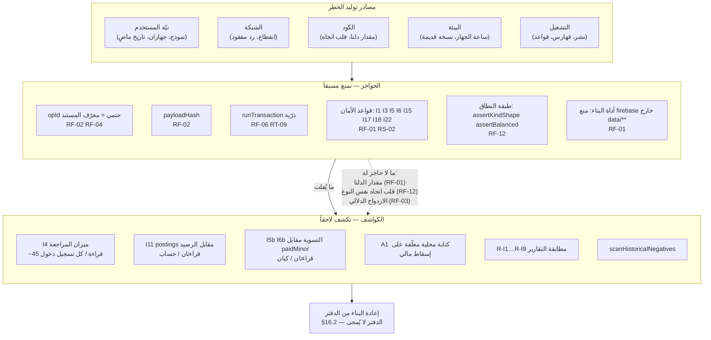
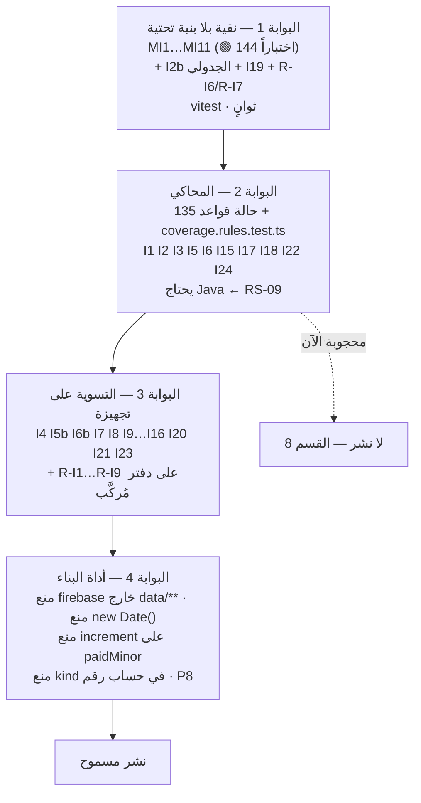

# سجل المخاطر — رصيد | RASEED

> **المسار:** `docs/12-RISK-REGISTER.md`
> **الحالة:** سجل تشغيلي حيّ. يُراجَع عند كل ميزة جديدة وقبل كل نشر (القسم 13).
> **المراجع الأعلى (بهذا الترتيب):** `docs/00-REQUIREMENTS.md` ← `docs/01-OWNER-DECISIONS.md`
> (ق-1، ق-2، ق-3) ← `docs/design/01-financial-core.md` (**العقد المُلزِم**) ← الوثائق الشقيقة 02…09.
> **قاعدة الالتزام:** كل خطر في هذا السجل **مُستخرج من نصّ موجود** في الوثائق أو من **قياس** على
> المستودع (القسم 0.3). لم يُخترع خطر، ولم تُقترح مخالفة لقرار مالك.
> **ما ليس هذا السجل:** ليس قائمة أعمال (تلك في `06-module-map.md` §19)، ولا قائمة عيوب مُصلَحة
> (تلك في النواة §19)، ولا سجل قرارات (ADR). هو **جرد لما قد يقع، وبأي سيناريو، وبماذا نكتشفه**.

---

## 0. كيف يُقرأ هذا السجل

### 0.1 الترميز

| البادئة | الفئة | عدد المخاطر |
|---|---|---|
| `RF-NN` | **مالي** — انحراف رقم، أو تصنيف يُضخّم تقريراً، أو ازدواج/فقدان أثر | 17 |
| `RT-NN` | **تقني** — فشل استعلام، انفجار تكلفة، فقدان كتابة، تلف حالة | 15 |
| `RS-NN` | **أمني** — وصول، فقدان بيانات، تسريب، فرض خادمي | 12 |
| `RO-NN` | **تشغيلي** — نشر، انضباط، وثائق، شخص واحد | 9 |
| `RL-NN` | **شرعي** — فتوى، نصّ قرآني، حكم على المستخدم | 8 |
| **الإجمالي** | | **61** |

### 0.2 معنى عمود «الحالة»

| الحالة | المعنى الحرفي — لا تأويل |
|---|---|
| **مُعالَج في التصميم** | التخفيف **مكتوب في وثيقة مُعتمدة** وله اختبار محدَّد في خطة الاختبار. **لا يعني أنه منفَّذ في الكود.** |
| **مُعالَج ومُنفَّذ** | التخفيف في الكود **وله اختبار أخضر الآن**. هذه الحالة مقصورة على ما قِيس (القسم 0.3). |
| **مُعالَج جزئياً** | طبقة واحدة أو أكثر قائمة، وطبقة مُعلَنة ناقصة بالاسم في خانة التخفيف. |
| **مفتوح** | لا تخفيف مُقرَّر، أو التخفيف ينتظر **قرار مالك** مُحدَّد بالرقم. |
| **حاجب للنشر** | لا يجوز `firebase deploy` قبل إغلاقه. مجموعها في القسم 8. |

### 0.3 ما قِيس فعلاً على المستودع (لا افتراض)

| القياس | النتيجة | الأمر |
|---|---|---|
| الاختبارات | **144 ناجحاً / 4 ملفات** | `npx vitest run` |
| `firestore.rules` | **396 سطراً**، وفيه `match /{document=**}` مانع في السطر 392 | `wc -l` + `grep` |
| الثوابت المذكورة في ملف القواعد | `I1 I3 I5 I6 I15 I17 I18 I22 I24` **فقط** | `grep -oE "I[0-9]+"` |
| الثوابت المذكورة في `04-security.md` §6 | تُضيف `I2 I4 I5b I6b I7 I8 I11 I13` | `grep` |
| `firestore.indexes.json` | **96 فهرساً مركَّباً + 55 استثناء فهرسة** | `node -e` |
| Java | **غير مثبَّتة** (`java: command not found`) ⇒ محاكي القواعد لا يعمل | `java -version` |
| Git | `origin/main` متزامن (0/0)، و**5 وثائق مُعدَّلة غير مُودَعة** | `git rev-list` + `git status` |
| `public/` | `favicon.svg` **وحده**، و`vite.config.ts` يُدرج 4 أصول PNG غير موجودة | `ls` + `grep` |

### 0.4 حدود السجل المُعلَنة

1. **الاحتمالات تقديرية** مبنية على جداول التهديد القائمة (النواة §11.5، و04 §2) لا على قياس ميداني —
   لا توجد بيانات تشغيل بعد، فأول شهر استخدام حقيقي هو ما يُعاير هذه الأعمدة.
2. **ثلاث مخاطر لا تُقاس إلا بعد النشر:** صحة الفهارس الـ96، ميزانية استدعاءات القواعد، استهلاك حصة
   Spark. وهي موسومة في السجل بـ «مُستنتج لا مقيس».

---

## 1. مقاييس التقدير — حتى لا تكون التقديرات ذوقية

### 1.1 الاحتمال

| الوسم | التعريف العملي |
|---|---|
| **عالٍ جداً** | يقع في **أول أسبوع** استخدام عادي بلا نيّة سيئة ولا ظرف استثنائي. |
| **عالٍ** | يقع في **أول شهر**، أو يكفي لوقوعه ظرف شائع (جهازان، انقطاع شبكة، شهر جديد). |
| **متوسط** | يحتاج تضافر ظرفين (سفر + إدخال بتاريخ ماضٍ)، أو خطأ برمجي في مسار غير مغطّى باختبار. |
| **منخفض** | يحتاج خطأً نادراً أو فعلاً متعمَّداً (كتابة من Console، ملحق متصفح خبيث). |
| **منخفض جداً** | يحتاج فشلاً في بنية Google التحتية أو خرقاً لضمانة `runTransaction` الذرّية. |

### 1.2 الأثر

| الوسم | التعريف العملي |
|---|---|
| **كارثي** | فقدان بيانات لا يُستعاد، أو انحراف محاسبي **غير قابل للكشف** بأي ثابت. |
| **عالٍ** | رقم مالي خاطئ معروض للمالك، أو وحدة كاملة متوقفة، أو انحراف يُكتشف لكن إصلاحه يحتاج إعادة بناء. |
| **متوسط** | شاشة واحدة فارغة أو مُضلِّلة، أو تكلفة قراءات مفاجئة، أو إزعاج متكرر. |
| **منخفض** | عيب تجميلي أو إزعاج مرّة واحدة بلا أثر على رقم. |

### 1.3 قاعدة الترتيب

> الخطر الذي **لا كاشف له** يُرفَع درجة واحدة في الأثر مهما كان احتماله منخفضاً.
> هذه قاعدة النواة §13 الملاحظة 3 (قلب اتجاه القيد) معمَّمة على السجل كله.

---

## 2. خريطة المخاطر — أين تتولَّد وأين تُكتشف

**القراءة الواجبة للخريطة:** السهم المنقَّط هو جوهر السجل. ثلاثة أصناف أخطاء **لا حاجز لها** على
Spark، ويعتمد أمانها على الكاشف وعلى جودة الاختبار الجدولي — وهذا **مُعلَن في النواة §18.3 و§18.4
وفي 04 §8.2**، لا مُكتشَف هنا.

---

## 3. السجل — المخاطر المالية (`RF`)

| المعرّف | الفئة | الوصف | السيناريو الذي يحققه | الاحتمال | الأثر | التخفيف الملموس | كيف نكتشف وقوعه | الحالة |
|---|---|---|---|---|---|---|---|---|
| **RF-01** | مالي | **انحراف الرصيد المجمَّع عن مجموع الحركات.** القواعد تفرض أن `balanceMinor` **مشتق** من الإجماليين (I3) ولا تفرض أن **مقدار** تغيّرهما يطابق سطور هذا القيد (النواة §18.4) | خطأ برمجي في مُشفِّر الدلتا يضاعف `increment` على `debitTotalMinor`: القيد متوازن، و`balanceMinor` متسق مع الإجماليين، و`balanceVersion` متزايد ⇒ **يمرّ من كل قاعدة**. الرصيد المعروض 1,250.500 والصحيح 625.250 | متوسط | **كارثي** (انحراف يمرّ من كل فحص شكلي) | ‏(أ) `postOperation` نقطة الكتابة المالية الوحيدة؛ (ب) حدّ الاستيراد `firebase/firestore` محظور خارج `data/**` (02 §4.4 B-rules)؛ (ج) `postings` **مصدر مستقل** عن `accounts` (ADR-002) | **I11**: `Σ signedAmountMinor [postings: accountId==A] === A.balanceMinor − A.openingBalanceMinor` (قراءتان/حساب) + **I4** ميزان المراجعة (~45 قراءة عند كل تسجيل دخول) + **I7** | **مُعالَج في التصميم** (كشفاً لا منعاً — ADR-020 بإعلان مخاطرة). الفرض الخادمي للمقدار يبدأ عند Blaze |
| **RF-02** | مالي | **ازدواج الحركة عند إعادة المحاولة.** `runTransaction` تُعاد تلقائياً عند `aborted`، والمستخدم يعيد الإرسال عند فقدان الرد | المستخدم يسجّل 25.500، تنجح الكتابة ويُفقد الرد، فيرى خطأً ويعيد الإرسال | **عالٍ جداً** (أول أسبوع) | عالٍ | `entryId === opId` (ADR-004) ⇒ الازدواج **خصيصة في مفتاح المستند** لا منطق تطبيقي. + `opId` يُولَّد عند **تركيب النموذج** لا عند الإرسال. + تعطيل الزر عند أول نقرة | المحاولة الثانية تُرجع `{ alreadyApplied: true }` بـ **صفر كتابات**. والمحاولة بمحتوى مختلف تُرفض بـ `OP_ID_CONFLICT` عبر `payloadHash` (§6.3) | **مُعالَج في التصميم** — `src/lib/ulid.ts` و`deterministicOpId` منفَّذان ومختبَران (18 اختباراً)؛ `postOperation` لم يُكتب |
| **RF-03** | مالي | **الازدواج الدلالي:** نفس المصروف من الهاتف ومن الحاسوب بمعرّفين مختلفين ⇒ قيدان مشروعان شكلاً | إدخال بقالة 25.500 من الهاتف ثم نسيانه وإدخاله من الحاسوب بعد 4 دقائق | **متوسط ومتكرر عملياً** (النواة §11.5 صف 12) | عالٍ (رصيد ناقص بلا سبب مرئي) | `findNearDuplicates` على لقطة محلية: نفس `accountId` + `amountMinor` + `bookedAt` + `categoryId` وفارق إنشاء ≤ 10 دقائق ⇒ **تحذير لا حجب** («قهوتان في ساعة حالة مشروعة») | **لا كاشف آلي بعد الوقوع.** الكشف بشري: كشف الحساب، أو عدم تطابق الرصيد الحقيقي | **مُعالَج جزئياً** — التحذير مُصمَّم؛ والقبول الواعي أن الحجب سلوك سيئ يدفع لتحريف المبلغ |
| **RF-04** | مالي | **التوليد المتكرر للدورات المتكررة** عند فتح التطبيق من أجهزة متعددة (لا جدولة خادمية — ق-1) | المُشغِّل يعمل 50 مرة في اليوم نفسه من ثلاثة أجهزة | عالٍ | عالٍ | `opId` حتمي `obl:{recurrenceId}:{dueDate}` و`rec:{recurrenceId}:{occurrenceKey}` (ADR-013) ⇒ المفتاح الطبيعي يمنع التكرار بنيوياً. ولا اعتماد على `lastRunAt` ولا قفل | صفر قيود مكرَّرة بالتصميم. والكشف لو خُرق: `entryCount` على الحساب + I8 | **مُعالَج في التصميم** |
| **RF-05** | مالي | **تغيّر `weekStartsOn` يُنتج دورات مزدوجة** لقواعد `weekly`/`biweekly` قائمة، لأن `occurrenceKey` مشتق من بداية الأسبوع | لو قرأ **محرّك التكرار** مفتاح `settings/personal.weekStartsOn` ثم غيّره المالك من السبت إلى الأحد ⇒ نفس الأسبوع بمفتاحين ⇒ **قيدان لنفس الدورة** | متوسط (مشروط بالقرار) | عالٍ | الموقف المؤقت المطبَّق: **الثابت 6 (السبت)** والمفتاح **لا يُبنى**. وإن أُقِرّ المفتاح فهو **مفتاح عرض فقط لا يقرؤه المحرّك** | ظهور دورتين لنفس الأسبوع في «القادمة»؛ وI5b على الالتزام المرتبط | **مفتوح — ينتظر قرار المالك 8** (بداية الأسبوع) |
| **RF-06** | مالي | **فقدان الكتابة عند انقطاع الشبكة واعتقاد المستخدم أنها حُفظت.** `runTransaction` **يفشل دون اتصال** ولا يُطابَر محلياً (ADR-007) | المالك يسجّل مصروفاً في منطقة بلا تغطية، يرى «حُفظ»، ثم **يضيع الجهاز قبل أي اتصال** | عالٍ (الانقطاع) / منخفض (مع ضياع الجهاز) | عالٍ | طابور `pendingCommands` في Firestore + مرآة IndexedDB؛ الدخول إلى الطابور **قبل** المحاولة دائماً؛ والواجهة تقول **«حفظ في قائمة الانتظار»** لا «حفظ»، والعملية **مستبعدة من كل رصيد وتقرير** | عدّاد الطابور في الشريط العلوي + شاشة `PendingSyncList` + حالة `rejected` برسالة عربية | **مُعالَج جزئياً** — الخسارة الباقية **مُعلَنة** في النواة §18.6: «عملية على جهاز ضاع **قبل** أي اتصال = ضائعة» |
| **RF-07** | مالي | **احتساب مصروف المنزل مرتين.** `periods.householdExpenseMinor` **مجموع فرعي من نفس الرقم لا قيمة مضافة** | تصميم بديل بشجرة حسابات موازية للمنزل، أو جمع `totalExpenseMinor + householdExpenseMinor` في بطاقة لوحة التحكم | منخفض (بنيوياً) | عالٍ | الطبيعة المنزلية **وسم على القيد** (`tags: ['household']`) + فئات تحت `expense.home`، وشاشة المنزل **استعلام مُصفّى على نفس القيود** (النواة §3.5). و**M-I1**: كل قيد يمسّ `expense` يحمل **وسم نطاق واحداً بالضبط** | **I15**: `householdExpenseMinor ≤ totalExpenseMinor` — **مفروض من الخادم** (موجود في `firestore.rules` السطر ~298) + **R-I8** | **مُعالَج في التصميم** |
| **RF-08** | مالي | **انحراف تقرير المنزل عند تعديل الوسم.** `household` ليس حقلاً وصفياً: تعديله يحرّك مُجمَّعاً مالياً | المستخدم يُزيل وسم «منزلي» من مصروف قديم عبر مسار تعديل وصفي عام ⇒ `householdExpenseMinor` لا يتغيّر ⇒ تقرير المنزل أعلى من الحقيقة **بلا قيد يفسّره** | متوسط (النواة §11.5 صف 13) | عالٍ | جدول النواة §8.2: `household` **مسار خاص** يُحدِّث المُجمَّع في **نفس المعاملة**، وليس ضمن الحقول الوصفية الحرّة | I15 لا يكشفه (الشرط ≤ يبقى صحيحاً). الكشف بـ **تجميع `postings` على الوسم** مقابل `householdExpenseMinor` — وهو ثابت **غير موجود في §13** | **مُعالَج جزئياً** — المسار مُصمَّم ولا ثابت كاشف. **مقترح: ثابت جديد I25** (القسم 11.6) |
| **RF-09** | مالي | **اعتبار الاقتراض دخلًا أو الإقراض مصروفًا** ⇒ تضخّم التقارير (المتطلبات §19 آخر بند) | منطق تقارير يصنّف بـ `kind` أو بإشارة المبلغ: `borrow` يرفع النقد ⇒ يُقرأ دخلاً | منخفض (بنيوياً) | عالٍ | `classifyLineForReports` تصنّف بـ **`line.accountType` حصراً** لا بـ `kind` ولا بالإشارة. والاستبعاد **هيكلي لا شرطي**: لا حساب `income` في قيد الاقتراض ⇒ لا يظهر دخلاً **نتيجةً لا قراراً**. و`kind` **محظور في أي حساب رقم** بأداة البناء | جدول الحقيقة §9/R11 (16 صفاً) + **الاختبار الجدولي لكل صف** + `grep` آلي على `kind ===` في `domain/reports` | **مُعالَج في التصميم** — الاختبار الجدولي **شرط غير قابل للتفاوض قبل أي نشر** ولم يُكتب بعد |
| **RF-10** | مالي | **الشراء بالأجل يُستبعَد من الميزانية خطأً.** الاقتراض نوعان: نقدي (R6/أ، محيَّد) وشراء بالأجل (R6/ب، **مصروف حقيقي**) | مُنفِّذ يقرأ «الاقتراض محيَّد» فيستبعد `kind === 'borrow'` كله ⇒ شراء بالأجل بـ 800.000 **لا يستهلك الميزانية** ⇒ المالك يظن أن لديه متبقياً | متوسط | عالٍ | `08-reports.md` §3.4/٣ و§3.13 صُحِّحا في تدقيق الاتساق: المستبعَد هو **الاقتراض النقدي (R6/أ)** لا الاقتراض مطلقاً، والشراء بالأجل **يستهلك الميزانية** تطبيقاً لجدول §9 | **R-I1**: `Σ signedAmountMinor [postings: periodKey==P, accountType=='expense']` === `totalExpenseMinor + ppExpCorr` ⇒ أي استبعاد خاطئ لمصروف حقيقي يُظهر فرقاً | **مُعالَج في التصميم** (صُحِّح في التدقيق) |
| **RF-11** | مالي | **أخطاء الكسور العشرية** في مبالغ بثلاث خانات | جمع `0.1 + 0.2` عائماً، أو ضرب رصيد بنسبة الزكاة `number`-ياً فوق `2^53` | منخفض | عالٍ | الدرهم **أعداد صحيحة** (`1 LYD = 1000`)، و`MAX_ABS_MINOR = 10^12`، و**`mulRate` بـ `BigInt` إلزامياً** (ضرب الحد الأقصى في أساس نقطة يعطي `10^16 > 2^53`)، و`parseAmountToMinor` بتجزئة **نصّية** بلا حساب عائم، و**رفض صريح** لأكثر من ثلاث خانات (`TOO_MANY_DECIMALS`) لا تقريب صامت | ثوابت وقت التشغيل داخل دوال التوزيع نفسها: أي انحراف في المجموع **عيب برمجي يرمي استثناء** لا خطأ مستخدم | **مُعالَج ومُنفَّذ** — `src/domain/money/**` + **144 اختباراً أخضر**، منها `mulRate(1_000_000_000_000, 250)` التي **تفشل لو استُخدم `number`** |
| **RF-12** | مالي | **قلب اتجاه القيد.** `Dr asset / Cr expense` بدل العكس **متوازن تماماً** ⇒ يمرّ من I1 ومن كل القواعد، لكنه **يرفع الرصيد ويخفض المصروف** | خطأ في بناء `lines` لعملية جديدة لم يغطّها اختبار جدولي | متوسط | **كارثي** (صنف أخطاء **لا يحميه ثابت بنيوي** — §18.3) | ثلاث طبقات مُعلَنة أنها **اختبار لا ثابت**: (1) `planOperation` المكان الوحيد الذي يبني `lines` و`side`، مفروضاً بأداة البناء؛ (2) **`assertKindShape`** (I2b) يرفض أي سطر لا يطابق (النوع، الجانب) المسموح لـ 14 نوع قيد؛ (3) **اختبار جدولي لكل صف في §9** | `assertKindShape` يكشف «مصروف يرفع الرصيد» و«دخل يخفضه» و«سداد يُسجَّل مصروفاً». **ولا يكشف** قلب الاتجاه بين حسابين من **نفس النوع** (تحويل، تحصيل) | **مُعالَج جزئياً** — بإعلان صريح: «هذه نقطة يعتمد فيها الأمان على جودة الاختبارات لا على ثابت رياضي» |
| **RF-13** | مالي | **رصيد سالب تاريخي** — حاجز الرصيد يُفحَص على الرصيد **الآن** لا كما كان في `bookedAt` (§18.1) | الرصيد اليوم 500.000، ويُسجَّل مصروف 300.000 بتاريخ 2026-08-02 حيث كان الرصيد 50.000 ⇒ **يُقبَل** وينتج سالباً في منتصف التاريخ على حساب `minBalanceMinor = 0` | متوسط (الفاتورة المتأخرة حالة شائعة) | متوسط (تناقض في كشف الحساب لا في الرصيد الحالي) | ثلاث طبقات: (1) `scanHistoricalNegatives(accountId)` **يُبلِّغ لا يمنع**، في شاشة «سلامة البيانات»؛ (2) تحذير واجهة عند الإدخال بتاريخ ماضٍ؛ (3) الرصيد التراكمي **في كشف الحساب فقط** | الفاحص نفسه: كل لحظة سلبية تاريخية مع تاريخها والقيد المسبِّب | **مُعالَج في التصميم** — المنع الحقيقي **مستحيل** (`tx.get` لا يقبل استعلامات)، والبديل (حظر التاريخ الماضي) يُسقط حالة مشروعة |
| **RF-14** | مالي | **`paidMinor` خاطئ مع قيد متوازن تماماً** — أخطر صنف لأنه يمرّ من كل الفحوص الشكلية | دفعة بأرجل 20.000 و`paidMinor += 200.000`: القيد متوازن، و`remainingMinor` مشتق صحيح من `paidMinor` الخاطئ ⇒ I5 يمرّ، والالتزام يظهر «مسدَّداً» وهو ليس كذلك | متوسط | **كارثي** | ‏`increment` **محرَّم** على `paidMinor`/`settledMinor`/`spentMinor` (جدول §5.4 + قاعدة ESLint): قيمة مطلقة محسوبة من قراءة داخل المعاملة | **I5b / I6b** (ADR-021): `paidMinor === Σ settlementDeltaMinor` على `postings where obligationId == id` — **تجميع خادمي بقراءتين** ⇒ السيناريو يُكتشف فوراً: `20.000 ≠ 200.000` | **مُعالَج في التصميم** — و**مشروط بفهرسة `settlementDeltaMinor`**: إلغاء فهرسته يُسقط `sum()` (RT-05) |
| **RF-15** | مالي | **عكس حركة مرتين** ⇒ أثر معاكس مضاعف | المالك يضغط «إلغاء العملية» مرتين، أو من جهازين | متوسط | عالٍ | `opId` حتمي `rev:{originalEntryId}` + **قفل ذرّي** `entryCorrections/{originalEntryId}` (ADR-014، لا عدّاد `amendCount`) | **I23**: لا قيد `posted` له `reversedByEntryId`؛ وكل قيد `reversed`/`replaced` له `entryCorrections/{id}` موجود | **مُعالَج في التصميم** |
| **RF-16** | مالي | **التزام شهر مدفوع في شهر آخر يظهر في تقرير الشهر الخطأ** (التقارير **نقدية الأساس**) | إيجار ديسمبر يُدفَع في 3 يناير ⇒ مصروف **يناير** | عالٍ (سلوك عادي) | متوسط (فهم لا رقم) | قرار مقصود: الالتزام **توقّع لا مصروف حتى يُدفع** (R4). والتخفيف **عرضي**: بطاقة «الالتزامات القادمة/المتأخرة» منفصلة عن المصروف، وتذييل صريح في R03 | لا يحتاج كشفاً — سلوك مُعلَن في §18.6 | **مُعالَج في التصميم** (قصور مُعلَن) |
| **RF-17** | مالي | **تصحيح فترة مُقفلة لا يدخل مجاميع السنة** ⇒ قارئ عجول يجمع رقمين | إقفال 2026-09 ثم اكتشاف مصروف ناقص فيه ⇒ يُسجَّل بـ `isPriorPeriodCorrection: true` بتاريخ اليوم | متوسط | متوسط | سطر مستقل **«تصحيحات فترات سابقة»** في R04 + تذييل يشرح أن مجاميع السنة = النشاط. وحقلا `priorPeriod*CorrectionMinor` على الفترة | **I9**: `netCashFlowMinor === totalIncome − totalExpense + ppIncCorr − ppExpCorr` + **R-I1/R-I2** | **مُعالَج في التصميم** — والمعالجة **عرضية (عنونة) لا رياضية**، مُعلَنة في 08 §13/٣ |

---

## 4. السجل — المخاطر التقنية (`RT`)

| المعرّف | الفئة | الوصف | السيناريو الذي يحققه | الاحتمال | الأثر | التخفيف الملموس | كيف نكتشف وقوعه | الحالة |
|---|---|---|---|---|---|---|---|---|
| **RT-01** | تقني | **انفجار قراءات Firestore في التقارير.** تصدير تفصيلي لسنة = **عدد قيود السنة (2,000–6,000 قراءة)** في عملية واحدة | المالك يفتح «تصدير سنة 2026 تفصيلي» ثلاث مرات في جلسة ⇒ ~18,000 قراءة من حصّة 50,000/يوم | متوسط | متوسط (توقّف الخدمة بقية اليوم) | طبقات مقيسة: التجميعات الخادمية **قبل** المسح (`sum()` بقراءتين)؛ `getAggregateFromServer` لا تنزيل صفوف؛ ترقيم بالمؤشر لا بالإزاحة؛ **حارس ميزانية القراءة** `estimateReads()` مع `READ_CONFIRM_THRESHOLD = 1,000` و`READ_HARD_CAP = 20,000`؛ ونصّ تأكيد عربي يذكر الرقم والحصّة. ولوحة التحكم **~120 قراءة باردة** و**0–5** بعدها، وتقرير السنة **36 قراءة** | عدّاد استهلاك تقديري في IndexedDB يُعرض في «سلامة البيانات» — **وهو تقدير مُعلَن**: Firestore لا يُتيح للعميل قراءة حصّته الفعلية، ولا يحتسب قراءات القواعد ولا الأجهزة الأخرى | **مُعالَج في التصميم** — ومُستنتج لا مقيس |
| **RT-02** | تقني | **الاعتماد على خطة Spark** (ق-1): لا Functions، لا جدولة، لا FCM، لا Storage، وحصص يومية صلبة | استنزاف الحصّة بقراءات التقارير + كتابات الاستيراد الجَمْعي في يوم واحد ⇒ التطبيق يتوقف يوماً كاملاً | منخفض | متوسط | كل ما يحتاج Blaze **خلف منفذ مجرَّد** (`StoragePort`, `SchedulerPort`, `PushPort`) بتطبيق «معطَّل» الآن ⇒ الترحيل **تفعيل لا إعادة بناء**. ومسار استيراد منفصل يحمي `periods/{pk}` من الازدحام (~كتابة/ثانية) | عدّاد الاستهلاك + ظهور `resource-exhausted` في خريطة أخطاء Firestore (02 §7.3) | **مُعالَج في التصميم** (قرار مالك ق-1 صريح) |
| **RT-03** | تقني | **الفهارس الـ96 لم تُنشر ولم تُختبر** ⇒ صحّتها **مُستنتجة من العقود لا مُقاسة** | أول فتح لشاشة الالتزامات: `failed-precondition: The query requires an index` | **عالٍ جداً** (أول تشغيل) | متوسط (شاشة معطّلة برسالة واضحة) | الملف المنشور **مطابق حرفياً** لكتلة `03-data-model.md` §10.2 (تحقّق آلي: `IDENTICAL: True`)، و96 فهرساً + 55 استثناءً مقيسة في الملف، وأسماء الحقول من عقد النواة §4 حصراً | `failed-precondition` **رسالة صريحة من Firestore تحمل رابط إنشاء الفهرس** ⇒ أرخص كاشف في النظام. وخريطة أخطاء 02 §7.3 تحوّلها إلى رسالة عربية | **مُعالَج في التصميم** — **الإجراء:** `firebase deploy --only firestore:indexes` ثم تشغيل كل استعلام مرة واحدة |
| **RT-04** | تقني | **فهارس ميتة على حقول لا وجود لها.** `firestore.indexes.json` يحمل فهارس المجموعات الشخصية والتنبيهات **بأسماء 03 §9.8/§10** لا بأسماء 09 §12.1 و07 | `tasks: status + dueDate` و`notes: status + updatedAt` و`zakatRecords: status + hawlEndDate` و`reminders: target.kind + status + nextFireAt` — والحقل الغائب **لا يُفهرس** ⇒ الفهرس ميت، **وفهارس 09/07 المطلوبة غير منشورة** ⇒ شاشات المهام والمفكرة والزكاة تفشل بـ `failed-precondition` | **عالٍ جداً** | عالٍ (ثلاث وحدات معطّلة) | لم تُعَد كتابتها في التدقيق لأن **09 و07 خارج الوثائق الأربع المدقَّقة وهما المرجع لمجموعاتهما** | `failed-precondition` عند أول فتح لكل شاشة | **مفتوح — ينتظر قرار المالك 6** (من يملك فهارس المجموعات الشخصية؟). والإجراء: نقل فهارس 09 §12.1 و07 إلى الملف |
| **RT-05** | تقني | **استعلام على حقل غير موجود يُرجع فراغاً بلا خطأ.** Firestore **لا يفهرس المستند الذي لا يحمل الحقل** ⇒ لا رسالة خطأ ولا سطر فارغ: **شاشة فارغة صامتة** | ثلاثة حقول معلَّمة ➕ **وغير موجودة في عقد النواة §4**: `debts.nextFollowUpDate`، `debts.lastFollowUpAt` (§4.6)، `financialGoals.priority` (§4.8). وعليها فهارس منشورة (`DE4`, `DE5`, `FG2`) واستعلامات (Q51, Q52, Q100) ⇒ شاشة «مواعيد المتابعة» وترتيب بطاقات الأهداف **فارغان بلا أي رسالة** | **عالٍ** | عالٍ (**لا كاشف طبيعي — الفراغ يُقرأ «لا بيانات»**) | لا تخفيف تقني: إمّا **ADR يضيف الحقول إلى §4**، أو **حذف الاستعلامات والفهارس الثلاثة**. والحارس العام: أي حقل يُستعلَم عليه يجب أن يكون في عقد §4 | اختبار تجهيزة: مستند بكل الحقول + مستند بدونها، وتأكيد أن الاستعلام يُرجع الأول. **لا كشف في الإنتاج** | **مفتوح — ينتظر قرار المالك 2**. وهذا الصنف **أخطر من `failed-precondition`** لأن الفشل صامت |
| **RT-06** | تقني | **ثمانية فهارس وعشرة استعلامات تقوم على حقل `isOpen` غير موجود في عقد النواة** | `OB1 OB3 OB4 OB8 DE1 DE4 DE5` و`Q7–Q11, Q41, Q42, Q46, Q51, Q52` تعتمد `isOpen`، و**البديل** (`remainingMinor > 0` + فرز بـ `dueDate`) **ترفضه Firestore** (متباينة على حقل + فرز على آخر) ⇒ بطاقات «الالتزامات القادمة/المتأخرة» و«الديون» **فارغة** | **عالٍ** | عالٍ | الصيغة المطلوب إقرارها: `obligations.isOpen == (remainingMinor > 0 && status != 'cancelled')` و`debts.isOpen == (remainingMinor > 0 && !(status in ['cancelled','writtenOff']))` — تُكتب في **نفس عبارة** `remainingMinor` و**تُفرَض في القواعد** | الفرض في القواعد هو الكاشف: `isOpen` مُشتق مُفرَض ⇒ لا انحراف ممكن. وبدونه: فراغ صامت | **مفتوح — ينتظر قرار المالك 1** (ADR على §4.5/§4.6) |
| **RT-07** | تقني | **عرض رصيد قديم من الكاش** يُقرأ كرصيد حقيقي | `onSnapshot` يُصدِر لقطة `metadata.fromCache === true` أولاً ⇒ المالك يرى 1,250.500 وهو فعلاً 950.500، ويقرّر الشراء | **عالٍ** (سلوك Firestore الطبيعي) | عالٍ | **الخطر الوحيد الحقيقي** بعد تحليل ثلاثي في 02 §9.3 (القرار المالي على رصيد كاش **مستحيل** لأن `runTransaction` لا تقرأ الكاش أبداً). أربع طبقات: (1) `StaleDataBadge` على **كل** رقم مالي — «آخر تحديث: قبل 12 دقيقة»؛ (2) شريط اتصال عام؛ (3) الأزرار تتحول إلى «حفظ في قائمة الانتظار»؛ (4) `getDocFromCache`/`getDocsFromCache` **محظورتان في كل المشروع** (B11) | **الثابت A1** (02 §9.3): لا لقطة لإسقاط مالي يجوز أن تحمل `hasPendingWrites === true` ⇒ ظهوره يعني **مسار كتابة التفّ على `postOperation`** ⇒ `A1_PENDING_WRITE_ON_PROJECTION` **حاجب فوري** | **مُعالَج في التصميم** — والثابت A1 ذكي: يحوّل عَرَضاً إلى كاشف لأخطر خطر (RF-01) |
| **RT-08** | تقني | **ساعة الجهاز الخاطئة تُنتج تواريخ محاسبية خاطئة** | هاتف بساعة متأخرة 9 ساعات ⇒ مصروف الساعة 1:00 صباحاً يهبط في اليوم السابق، و`periodKey` في الشهر الخطأ على قيد **غير قابل للتغيير** | متوسط | عالٍ | **«اليوم» من وقت الخادم لا من ساعة الجهاز** (07 §2.5): استقصاء بـ `serverTimestamp()` على `meta/scheduler` ثم `getDocFromServer` (كتابة + قراءة واحدة لكل جلسة). والتدرّج: `≤60s` تُهمل؛ `60s–6h` تُسجَّل في `clockSkewMs` والنظام يعمل بوقت **الخادم**؛ **`>6h` تنبيه `critical` و`تُعطَّل مادّية كل الأنواع`** | شريط أحمر بنصّ عربي يذكر **الفارق بالساعات**: «ساعة هذا الجهاز تخالف الخادم بـ 9 ساعات» | **مُعالَج في التصميم** — **ومحجوب الآن:** قائمة `meta` المغلقة في القواعد كانت تُسقط `scheduler` (أُصلح بـ ع-أمن-11 في 04 §6 غير المنشور) |
| **RT-09** | تقني | **`dateKeyToUtcNoon` غير منفَّذة** مع أن `bookedAtTs` **مُعرَّف بأنه منتصف نهار UTC** لذلك اليوم (النواة §4.3) | مُنفِّذ يكتب `bookedAtTs` بمنتصف ليل محلي بدل 12:00 UTC ⇒ القيد عند حدّ النطاق يهبط في اليوم المجاور ⇒ تقرير يومي **ينقص قيداً ويزيد آخر**، و15 فهرس نطاق على `bookedAtTs` تُرتِّب خطأً | **عالٍ** (الدالة مستهلَكة بالاسم في ثلاث وثائق ولم تُكتب) | عالٍ | الدالة محدَّدة بالاسم والعقد في 02 §11.5: `dateKeyToUtcNoon(dk: ISODate): Date` — **12:00 UTC**، لتكون `bookedAtTs` **دالّة حتمية في `bookedAt`** وحده. واختيار منتصف النهار مقصود: يُبعد الحدّ عن أي إزاحة ±2 ساعة | اختبار وحدة: `dateKeyToUtcNoon('2026-10-31')` === `2026-10-31T12:00:00Z`، + ثابت «`bookedAtTs` دالّة في `bookedAt`» على 365 يوماً | **مفتوح** — عمل تنفيذي محدَّد في `src/lib/time.ts` (ومعه `startOfWeek` السبت) |
| **RT-10** | تقني | **`postings.bookedAt` و`bookedAtTs` يُفهرسان بالتبادل لنفس الغرض** ⇒ نصف 15 فهرساً تكلفة كتابة بلا مقابل | `PO1` بـ `bookedAt`، و`PO3/PO10/PO11/PO12` بـ `bookedAtTs`، مع أن §4.3 يجعل الثاني **دالّة حتمية** في الأول ⇒ ترتيبهما ونطاقاهما **متكافئان** | عالٍ (قائم الآن) | منخفض (تكلفة كتابة ومساحة لا صحّة) | التوحيد على حقل واحد للنطاق/الترتيب في `postings` — **تحسين لم يُنفَّذ** لأنه يلمس 15 فهرساً ويحتاج إعادة ترقيم الرموز | قياس زمن الكتابة بعد النشر + عدّاد الفهارس في الكونسول | **مفتوح** (تحسين مؤجَّل بوعي، لا عيب صحّة) |
| **RT-11** | تقني | **حدّ 20 استدعاء وصول (`get`/`exists`) لكل تقييم قاعدة** قد يُرفض **معاملة كاملة** | `payObligation` يُقدَّر بـ **17–21 استدعاءً** مقابل حدّ **20** (ع-أمن-2) ⇒ دفع التزام **يُرفض بـ `permission-denied` غامض** في بعض الحالات | متوسط | عالٍ (أكثر العمليات حساسية) | التشخيص موجود في 04 §7.3 مع مقترحات تقليص الاستدعاءات. والحدّ معروف ومكتوب | **لا قياس بعد — Java غير مثبَّتة** فلم تُشغَّل 135 حالة المحاكي. القياس الوحيد الممكن: تشغيل `payObligation` على المحاكي وعدّ الاستدعاءات | **مفتوح — حاجب للنشر** (شرط 4 من أربعة شروط النشر في قرار المالك 11) |
| **RT-12** | تقني | **إعادة بناء الإسقاطات ليست ذرّية إن تجاوزت دفعة** | ~850 مستند إسقاط ⇒ **دفعتان**؛ انقطاع بين الدفعتين يترك الإسقاطات نصف مبنية | منخفض | عالٍ | ثلاث طبقات (§16.2): **بوابة في القواعد** (`rebuildStatus == 'running'` ⇒ **لا قيد جديد** بعد `rebuildStartedAt`) + **مؤشر استئناف** + **قيم مطلقة** لا `increment` ⇒ إعادة التشغيل تُكمل بلا مضاعفة | **I24** مفروض من الخادم (البوابة) + الفاحص. و`rebuildStatus` المعلَّق ظاهر في «سلامة البيانات» | **مُعالَج في التصميم** — القصور **مُعلَن** في §18.5: «البوابة هي ما يحميها لا الذرّية» |
| **RT-13** | تقني | **تعارض تسمية النوع:** الكود يستخدم `ISODate` الموسوم، و07 و09 تستخدمان `DateKey` | أول استيراد متقاطع بين `domain/money` و`domain/worship` ⇒ **نوعان موسومان لنفس الشيء لا يتبادلان بلا `as`** ⇒ تسرّب `as` في الكود يُسقط فائدة الوسم | **عالٍ** (مؤكَّد عند أول تكامل) | متوسط | توصية 02 §11.5: التوحيد على **`ISODate`** (الكود المبني والمختبَر)، و`type DateKey = ISODate` كاسم بديل مؤقت في 07 و09 | `grep` آلي على `as ISODate` و`as DateKey` في CI: أي ظهور خارج `lib/time.ts` ⇒ فشل | **مفتوح** — يجب الحسم **قبل أول استيراد متقاطع** |
| **RT-14** | تقني | **أصول PWA مفقودة** ⇒ فشل التثبيت أو أيقونة مكسورة | `public/` يحتوي `favicon.svg` **وحده** (مقيس)، و`vite.config.ts` يُدرج في الـ manifest و`includeAssets`: `apple-touch-icon.png`, `pwa-192.png`, `pwa-512.png`, `pwa-512-maskable.png` | **عالٍ جداً** (قائم الآن) | منخفض | إنتاج الأصول الأربعة، أو تقليص قائمة الـ manifest إلى الموجود | تحذير Workbox وقت البناء + فحص Lighthouse «Installable» | **مفتوح** — عمل تنفيذي صغير محدَّد |
| **RT-15** | تقني | **الخطوط و`--font-numeric` غائبة** ⇒ أرقام غير متراصّة في الجداول المالية، خلافاً لق-3 | ملفات الخطوط غير موجودة، و`--font-numeric` **غير معرَّف** في `tokens.css` مع أن ق-3 يفرض `font-variant-numeric: tabular-nums` على الجداول المالية | **عالٍ** | منخفض | تعريف الرمز في `tokens.css` + إضافة الخطوط، أو الاعتماد على `tabular-nums` مع خط النظام مع توثيق ذلك | فحص بصري على جدول كشف الحساب: أعمدة المبالغ غير متراصّة | **مفتوح** |

---

## 5. السجل — المخاطر الأمنية (`RS`)

| المعرّف | الفئة | الوصف | السيناريو الذي يحققه | الاحتمال | الأثر | التخفيف الملموس | كيف نكتشف وقوعه | الحالة |
|---|---|---|---|---|---|---|---|---|
| **RS-01** | أمني | **من يستطيع إنشاء حساب.** Google Sign-In مفتوح للعالم (مفتاح الويب عام بطبيعته)، فأي شخص يستطيع **المصادقة** | شخص يفتح رابط التطبيق ويسجّل دخولاً بحساب Google الخاص ⇒ إن كان الإغلاق في **الواجهة** رأى بيانات المالك | **عالٍ** (T1: المفتاح عام والرابط قد يُشارَك) | **كارثي** | ق-2 صريح: **الإغلاق في القواعد لا في الواجهة** — `uid in allowedUids()` في **كل** قاعدة، + تعطيل بقية المزوّدين في الكونسول، + إيقاف التسجيل. والاعتماد على **UID الثابت لا البريد** (البريد قابل للتغيير) | اختبار المحاكي بمستخدم `uid` غير معتمد: كل قراءة وكتابة تُرفض. وهو من 135 حالة | **مُعالَج في التصميم — غير مُختبَر** (Java مفقودة)، و**مزوّد Google غير مُفعَّل** في الكونسول بعد |
| **RS-02** | أمني | **القواعد لا تفرض صحة الحسابات ⇒ عميل موثوق** (ADR-020) | عميل (أو ملحق متصفح) يكتب `balanceMinor` **متسقاً داخلياً لكن خاطئاً**: يرضي I3، و`balanceVersion` متزايد، والقيد متوازن، و`postings` مطابقة الشكل ⇒ **يمرّ** | متوسط (كخطأ برمجي) / منخفض (كتلاعب) | **كارثي** | الحقيقة غير المريحة مكتوبة للمالك في 04 §1.3: ما نملكه = **مسار كتابة وحيد + توازن مفروض خادمياً + مشتقات مفروضة (`balanceMinor`, `remainingMinor`) + حدّ رصيد مطلق + فاحص دوري + دفتر غير قابل للمحو**. وما لا نملكه = **مقدار الدلتا**. والقسمة مُعلَنة: **«نحمي المصدر فرضاً، ونكشف المشتق كشفاً»** | أربعة ثوابت رخيصة: **I4** (~45 قراءة/تسجيل دخول)، **I11** (قراءتان)، **I5b/I6b** (قراءتان) — و`postings` **مصدر مستقل** عن `accounts` | **مُعالَج بإعلان مخاطرة** — و**يصبح غير مقبول** في ثلاث حالات بالاسم: (1) مستخدم ثانٍ، (2) استخدام الأرقام في إقرار زكوي/ضريبي رسمي، (3) جهاز مشترك أو ملحق غير موثوق |
| **RS-03** | أمني | **فقدان الوصول لحساب Google = فقدان كل البيانات** — نتيجة مباشرة لق-2 | تعطيل حساب Google، أو فقدان هاتف 2FA ⇒ **لا مسار دخول بديل**، والبيانات كلها تحت `users/{uid}` لـ UID واحد | منخفض | **كارثي** | ‏(أ) **تصدير JSON يدوي دوري** (ق-1) — النسخة الاحتياطية الوحيدة؛ (ب) إجراء **UID احتياطي موثَّق** في 04 §3.3؛ (ج) التوصية بتفعيل 2FA على حساب Google | لا كشف — الحدث نفسه هو الكشف. **القياس الوحيد المفيد: تاريخ آخر تصدير**، معروضاً في «سلامة البيانات» | **مفتوح — ينتظر قرار المالك 12.** والعقبة مُعلَنة: إضافة UID ثانٍ تعني **صلاحية كاملة** لا قراءة فقط، إلا بتغيير بنيوي يفكّ «مالك المسار» عن «المستخدم الحالي» — وهو نفس التغيير الذي يفتح باب تعدد المستخدمين |
| **RS-04** | أمني | **لا نسخ احتياطي تلقائي على Spark** — التصدير اليدوي هو الوحيد | المالك لا يُصدِّر لثلاثة أشهر، ثم يقع RS-03 أو RF-01 غير قابل للإصلاح ⇒ لا نقطة استعادة | **عالٍ** (الانضباط البشري أضعف حلقة) | **كارثي** | ‏(أ) التصدير الكامل **ميزة أساسية في المرحلة الأولى لا تأجيل** (ق-1 بند 3)؛ (ب) التصدير يحمل `projectionVersion` و`schemaVersion` لكل مستند ⇒ الاستعادة تعرف ما تفعله؛ (ج) **الاستعادة تستورد الدفتر فقط ثم تُشغِّل إعادة بناء** — لا تستورد المُجمَّعات (استيراد مُجمَّع قد يُدخل انحرافاً)؛ (د) `auditLogs { action: 'dataExported' }` + **تذكير دوري داخل التطبيق**؛ (هـ) تنبيه `backupReminder` في مركز التنبيهات | `auditLogs` تحمل تاريخ كل تصدير ⇒ «آخر نسخة: قبل 94 يوماً» رقم قابل للعرض والتنبيه | **مُعالَج في التصميم** — والشرط التشغيلي **غير قابل للتفاوض** في 04 §8.4/٣: **تصدير JSON شهري يُحفَظ خارج الجهاز** |
| **RS-05** | أمني | **تسريب ملف تصدير JSON غير مشفّر** — يحمل أسماء وهواتف جهات الاتصال وكل تاريخ مالي | الملف في مجلد التنزيلات على حاسوب مشترك، أو يُرفع إلى تخزين سحابي عام | متوسط | عالٍ | تحذير إلزامي عند التصدير + تسمية ملف واضحة + **خيار تشفير** (04 §11.5) + **منع التصدير إلى Storage** | لا كشف تقني. الضابط المتبقّي الناقص مُعلَن: **سلوك المستخدم لا يُفرَض** (T7) | **مُعالَج جزئياً** |
| **RS-06** | أمني | **XSS أو ملحق متصفح خبيث** يرث جلسة المالك كاملة | ملحق متصفح يقرأ الجلسة ويكتب قيوداً زائفة **متوازنة** | منخفض–متوسط | **كارثي نظرياً** | CSP صارمة (04 §3.6)، لا `dangerouslySetInnerHTML` بلا تنقية، لا سرّ إداري في الواجهة، **حارس حداثة المصادقة على المدمِّرات**. والأهم: **الدفتر غير قابل للحذف** ⇒ الضرر الأقصى = قيود زائفة **مكشوفة** لا محو | القيود الزائفة تظهر في «دفتر القيود»، وتُكشف بـ I5b إن مسّت كياناً. **وزمن الكشف قد يتأخر** (04 §8.2) | **مُعالَج جزئياً** — وبناء `notes` بلا `bodyHtml` (ع-أمن-12) يُسقط أكبر ناقل XSS محتمل |
| **RS-07** | أمني | **ضياع جهاز بجلسة مفتوحة** | الهاتف يُسرَق وجلسة التطبيق مفتوحة | متوسط | عالٍ | إبطال رموز التحديث بسكربت Admin (04 §3.5) + تعطيل المستخدم من الكونسول + حارس الحداثة على العمليات الحسّاسة | لا كشف تقني. **الضابط المتبقّي الناقص مُعلَن: رمز الهوية القائم يبقى صالحاً حتى ساعة** | **مُعالَج جزئياً — وينتظر قرار المالك 14** (`sessionNotStale()` بـ 12 ساعة على الكتابة المالية: الثمن إعادة دخول كل 12 ساعة على كل جهاز، والمكسب تقليص نافذة الساعة) |
| **RS-08** | أمني | **`firestore.rules` في جذر المستودع يُوقف النظام لو نُشر.** 396 سطراً = مسوّدة النواة §14.3 حرفياً + `match /{document=**}` مانع، وفيها **ع-أمن-1 القاتل** | قراءة `resource.data` في قاعدة `allow create, update` **مدموجة** لـ `accountPeriods` و`obligations` ⇒ عند الإنشاء `resource == null` ⇒ **خطأ تقييم** ⇒ **أول مصروف في أي شهر جديد يُرفَض**، وإنشاء أي التزام يُرفَض. وتنقصه **18 `match`** ⇒ 14 مساراً بلا قاعدة مع `allow write: if false` الافتراضي | **عالٍ جداً** (مؤكَّد لو نُشر) | **كارثي** (نظام لا يكتب) | **المصدر الواحد للقواعد:** `04-security.md` §6.0 يُثبِّت أن §6 هو ملف القواعد **الوحيد القابل للنشر**، ويعلن أن ملف الجذر مسوّدة **لا تُنشر وتُستبدل**. والعلاج النمطي: **فصل `allow create` عن `allow update`** في كل مجموعة | **فحص جدولي إلزامي:** لكل مجموعة، اختبار `create` على مستند **غير موجود** واختبار `update` على مستند قائم (02 §14.2) | **حاجب للنشر** — **الإجراء: استبداله بمحتوى `04-security.md` §6 قبل أي `firebase deploy`** |
| **RS-09** | أمني | **135 حالة اختبار قواعد غير مشغَّلة ولا مرّة** | **Java غير مثبَّتة** (مقيس) ⇒ `npm run test:rules` لا يعمل ⇒ **لا قاعدة واحدة مُختبَرة**، ومنها **كل** إصلاحات ع-أمن-10…15 المكتوبة في 04 §6 | **عالٍ جداً** (قائم الآن) | عالٍ | خطة اختبار كاملة جاهزة: 135 حالة في 04 §10.3 بمهاد مشترك في §10.2، + `tests/rules/coverage.rules.test.ts` يفرض **«لا مجموعة بلا قاعدة»** آلياً من `src/data/firebase/paths.ts` بدل الادعاء | لا كشف — **غياب الاختبار هو الخطر نفسه** | **حاجب للنشر** — الإجراء: تثبيت Java ثم 135 حالة خضراء (شرط 3 من قرار المالك 11) |
| **RS-10** | أمني | **ق-5: `balanceVersion` يفقد وظيفته الوحيدة.** مسار تحديث `accounts` واحد يشترط `balanceVersion > resource.data.balanceVersion` ويفرض I3 | تعديل **وصفي** بحت (اسم، ترتيب، أيقونة، ملاحظة) يُجبَر على رفع عدّاد دلالته **«تغيّر الرصيد»** ⇒ العدّاد يفقد قدرته على كشف التحديثات المفقودة — وهي الوظيفة الوحيدة التي بُرِّر بها الحقل | **عالٍ** (كل تعديل اسم) | متوسط (فقدان كاشف لا انحراف) | المقترح: **مساران منفصلان** — وصفي بـ `touchedOnly(['name','nameLower','sortOrder','icon','colorToken','notes','updatedAt'])` **بلا** شرط `balanceVersion` ولا I3، ومالي بالشروط الكاملة | لا كشف — الفقدان صامت بطبيعته (كاشف معطَّل لا يصرخ) | **مفتوح** — لم يُطبَّق لأنه يمسّ فرض I3 ويستحق ADR ومراجعة مالك النواة |
| **RS-11** | أمني | **ق-2: `periods` تشترط حضور `householdExpenseMinor` في `create`** | أول مصروف **غير منزلي** في كل شهر: مُشفِّر `periodDelta` لا يكتب الحقل (لا وسم `household`) ⇒ `request.resource.data.householdExpenseMinor` غير موجود ⇒ **خطأ تقييم** ⇒ **رفض**. وهذا **أكثر العمليات شيوعاً** | **عالٍ جداً** (أول مصروف في كل شهر) | **كارثي** | **ADR-034 ليس تحسيناً بل شرط صحة:** مُشفِّر `periodDelta` في `data/ledger/writers` **يكتب دائماً مجموعة الحقول العددية كاملة** بـ `increment(0)` لغير المتأثر | اختبار القواعد: `create` على `periods/2026-11` بمصروف غير منزلي. **ويُكشف في الدقيقة الأولى من أول شهر جديد** | **حاجب للنشر** — ويقع في `src/data/ledger/writers` **غير المكتوب بعد** |
| **RS-12** | أمني | **مسارا ملف شخصي مفتوحان لنفس المعلومة** ⇒ خطر «ملفان شخصيان» | `profile/main` (الرسمي) و`settings/profile` مفتوحان معاً في `04-security.md` §6 «للتوافق» ⇒ جهاز يكتب هنا وآخر هناك ⇒ اسم ومدينة مختلفان بلا تعارض ظاهر | متوسط | منخفض | حذف أحد المسارين من القواعد، وتثبيت `profile/main` الرسمي | اختبار: كتابة إلى المسار المحذوف تُرفض | **مفتوح — ينتظر قرار المالك 13** |

---

## 6. السجل — المخاطر التشغيلية (`RO`)

| المعرّف | الفئة | الوصف | السيناريو الذي يحققه | الاحتمال | الأثر | التخفيف الملموس | كيف نكتشف وقوعه | الحالة |
|---|---|---|---|---|---|---|---|---|
| **RO-01** | تشغيلي | **مطوّر واحد وفقدان الكود** (معامل الباص = 1) | فقدان الحاسوب ⇒ كل ما لم يُدفَع إلى `origin` يضيع. **والقياس الآن: `origin/main` متزامن (0/0) لكن 5 وثائق مُعدَّلة غير مُودَعة** — وهي ناتج تدقيق الاتساق كله (47 إصلاحاً) | متوسط | عالٍ (فقدان عمل لا بيانات) | ‏(أ) المستودع البعيد قائم: `github.com/albarshi996/RASEED`؛ (ب) `.gitignore` يستبعد `.env` و`.env.local` (مقيس: لا ملف بيئة مُتابَع)؛ (ج) **إيداع كل تدقيق في commit مستقل برسالة تشرح السبب** — وهو ما تفعله رسائل الـ commit القائمة؛ (د) الوثائق **هي** المواصفة ⇒ ضياع الكود مع بقاء الوثائق = إعادة بناء لا إعادة تصميم | `git status` قبل كل إقفال جلسة؛ و`git rev-list --left-right --count origin/main...HEAD` | **مُعالَج جزئياً** — الإجراء الفوري: إيداع الوثائق الخمس المُعدَّلة |
| **RO-02** | تشغيلي | **لا شيء نُشر ولا شيء شُغِّل:** القواعد والفهارس مكتوبة ولم تُنشر، ومزوّد Google غير مُفعَّل | أول تشغيل حقيقي يكشف RT-03 و RT-04 و RT-11 و RS-11 **مجتمعة** ⇒ يوم كامل من `permission-denied` و`failed-precondition` | **عالٍ جداً** | عالٍ | **ترتيب نشر إلزامي** (القسم 8): استبدال القواعد ← تثبيت UID ← Java ← 135 حالة ← قياس ميزانية الاستدعاءات ← نشر الفهارس ← تشغيل كل استعلام مرة واحدة ← أول مصروف حقيقي | كل خطوة في الترتيب لها كاشفها الخاص؛ والترتيب مُصمَّم ليكون **كل فشل معزولاً ومفهوماً** | **مفتوح — حاجب للنشر** |
| **RO-03** | تشغيلي | **تضخّم الوثائق وتعارضها ⇒ تنفيذ على نصّ قديم.** 19 ملف تصميم / **39,690 سطراً** (مقيس) | مُنفِّذ يقرأ `03-data-model.md` §7 فيجد `worshipRecords/{YYYY-MM}` **شهرياً**، و09 §5.2 **يرفض الشهرية بالأرقام**، و04 §6 يكتب `worshipDays/{dateKey}` ⇒ **تعارض ثلاثي** يُنفَّذ ثلاث مرات | **عالٍ** (12 مسألة دون حسم مسجَّلة) | عالٍ | ‏(أ) **تسلسل مراجع صريح** في رأس كل وثيقة؛ (ب) **«مصدر واحد»** لكل مجال: 04 §6.0 للقواعد، 03 §10 للفهارس، النواة §4 لأسماء الحقول؛ (ج) وسم §13.2 في 06 بأنه **منسوخ** بـ 09؛ (د) سطر «تعديل اتساق» في نهاية كل ملف مُعدَّل | ‏**تحقّق آلي**: كتلة 03 §10.2 تُحلَّل وتُطابق `firestore.indexes.json` حرفياً (`IDENTICAL: True`). ومثله مطلوب للقواعد: مطابقة 04 §6 لملف `firestore.rules` | **مُعالَج جزئياً** — 12 مسألة دون حسم مسجَّلة بأسمائها، والإجراء: جلسة تدقيق اتساق للوحدات الشخصية (09/07) و03 |
| **RO-04** | تشغيلي | **ADR-023 (`dailyRollups`) «مقترح» ⇒ ميزات معطَّلة فعلياً** | فهرس `dailyRollups: periodKey + dateKey` **غير منشور**، ومعادلات 08 §3.1/§3.7/§3.12 على «نطاق جزئي» و**`R-I3`/`R-I4`/`R-I6` معطَّلة**، والخاسر: التقرير اليومي/الأسبوعي ومخطط السنة باليوم | قائم الآن | متوسط | **الخطة البديلة مُصمَّمة بالكامل** في 08 §4.4 وتعمل؛ ومخطط السنة **يتدهور إلى 12 نقطة برسالة صريحة** لا بفراغ | لا كشف مطلوب — الحالة معروفة ومعلنة | **مفتوح — ينتظر قرار المالك 5.** القبول يرفع كتابات المصروف من **9 إلى 10** (انحراف عن §15.1) ويُضيف بنداً إلى `RebuildPlan.projections` |
| **RO-05** | تشغيلي | **الفاحص الدوري يعتمد على انضباط بشري** (لا جدولة خادمية — ق-1) | المالك لا يفتح «سلامة البيانات» لستة أشهر ⇒ انحراف RF-01 قائم ومكتشَف **لو** شُغِّل الفاحص | **عالٍ** | عالٍ (يحوّل كاشفاً موجوداً إلى كاشف نائم) | الحلّ المعتمد **لا يعتمد على الانضباط في الطبقة الحرجة**: **I4 يعمل عند كل تسجيل دخول تلقائياً**، وإذا انكسر ⇒ **إيقاف تسجيل العمليات** بـ `TRIAL_BALANCE_BROKEN` — **منع لا تحذير يُتجاهل** (04 §8.4/١). والفاحص الكامل (I7, I11, I5b, I6b, I13) شهرياً **بتذكير داخل التطبيق** | `meta/integrity.lastVerified*` معروضاً كعدد أيام؛ وتنبيه عند تجاوز 30 يوماً | **مُعالَج في التصميم** — والقسمة ذكية: الرخيص **إجباري**، والمكلف **بتذكير** |
| **RO-06** | تشغيلي | **عملية غير مكتملة** (المتطلبات §19) | انقطاع في منتصف ترحيل عملية ⇒ قيد بلا تحديث رصيد | **منخفض جداً** | عالٍ | **غير ممكنة بنيوياً:** الترحيل كله في `runTransaction` **ذرّية واحدة**. الحالة الوحيدة المتبقية = عملية **لم تُرحَّل بعد** في `pendingCommands`، معروضة «بانتظار المزامنة» و**مستبعدة من كل الأرصدة والتقارير** | **I4** يختلّ فوراً لو وقعت (قيد بلا رصيد يكسر الميزان) | **مُعالَج في التصميم** — المكسب الأساسي من `runTransaction` |
| **RO-07** | تشغيلي | **عرض الطابور بعد انقطاع طويل يُقرأ كرصيد** | 40 عملية معلّقة بعد أسبوع بلا شبكة، معروضة بمجموع مبالغها ⇒ المالك يقرأ المجموع كأنه مُرحَّل | متوسط | متوسط | ‏(أ) شاشة مستقلة `PendingSyncList` + عدّاد في الشريط العلوي؛ (ب) **لا عرض لمبالغها مجموعةً — عدد فقط** حتى لا يُقرأ كرصيد (02 §14.3 ن-2)؛ (ج) تفريغ **تسلسلي** بترتيب الإدخال (لأن تحويلاً ثم سداداً من نفس الحساب قد يفشل الثاني بسبب الرصيد) | عدّاد الطابور نفسه + حالة `rejected` برسالة عربية قابلة للتصحيح | **مُعالَج في التصميم** |
| **RO-08** | تشغيلي | **CI لا يفرض ما لا يستطيع تشغيله** | بلا Java في CI، تمرّ تغييرات على القواعد **بلا اختبار واحد** ⇒ ع-أمن-1 من نوع جديد يدخل بصمت | **عالٍ** | عالٍ | إضافة Java إلى صورة CI وتشغيل `test:rules` كبوابة؛ وحتى ذلك: `coverage.rules.test.ts` يفرض التغطية (لا يحتاج محاكي؟ **يحتاج** — فهو اختبار قواعد) | بوابة CI حمراء عند أول تعديل قاعدة | **مفتوح** — تابع لـ RS-09 |
| **RO-09** | تشغيلي | **15 قراراً مُعلَّقاً للمالك تُجمِّد وحدات كاملة** | بلا قرار 6 (ملكية الفهارس) و7 (`TaskStatus`) و9 (شكل `prayers`) و10 (`dhikr`/`habits`): **المهام والمفكرة والزكاة والعبادات** غير قابلة للتنفيذ النهائي — تُبنى ثم تُعاد | قائم الآن | عالٍ (إعادة عمل) | السجل الكامل في القسم 12 مرتَّباً بأثر التأجيل، ومعه **الموقف المؤقت المطبَّق** لكل واحد (مثلاً: الثابت 6 للأسبوع، وأسماء 09 في القواعد) حتى لا يتوقف العمل | كل قرار مرتبط بوحدة بالاسم ⇒ الجمود مرئي في خريطة الوحدات | **مفتوح** |

---

## 7. السجل — المخاطر الشرعية (`RL`)

| المعرّف | الفئة | الوصف | السيناريو الذي يحققه | الاحتمال | الأثر | التخفيف الملموس | كيف نكتشف وقوعه | الحالة |
|---|---|---|---|---|---|---|---|---|
| **RL-01** | شرعي | **حاسبة الزكاة تُفهم كفتوى** | المالك يرى «زكاتك: 1,250.500 د.ل» فيُخرجها على أنها الحكم، ولم يكن النصاب بالفضة أو الذهب محسوماً في حالته | **عالٍ** (طبيعة الرقم المعروض) | عالٍ (أثر شرعي لا مالي) | أربع طبقات في 09 §8: (1) نصّ مُعتمد حرفياً: **«هذه حاسبة إرشادية تساعدك على تقدير زكاتك، وليست فتوى.»**؛ (2) **لا اختيار مذهب نيابة عن المستخدم** — كل مسألة خلافية **حقل سياسة بلا قيمة افتراضية** + شرح محايد؛ (3) `Z-NISAB-3` (أي النصابين) **لا افتراضي — اختيار إلزامي**؛ (4) عرض الطريقة والافتراضات والمصادر مع كل نتيجة | **P14**: مدخلات احتساب `confirmed` **مُجمَّدة** — لا تتغيّر بتغيّر رصيد ولا سعر ولا سياسة ولا إزاحة هجرية ⇒ الرقم المُقَرّ يبقى شاهداً على أيّ افتراض بُني | **مُعالَج في التصميم** |
| **RL-02** | شرعي | **سعر الذهب المتعفّن يُنتج نصاباً وزكاة خاطئين** | قيمة افتراضية مُبرمَجة لسعر الغرام تبقى سنتين ⇒ نصاب خاطئ ⇒ **إمّا زكاة على من لا تلزمه، أو إسقاطها عن من تلزمه** | متوسط | عالٍ | قرار صريح: **لا قيمة افتراضية مُبرمَجة**. السعر **مُدخل من المستخدم دائماً**، **بتاريخ تسعير**، و**تحذير إن تجاوز عمره 30 يوماً** | عمر التسعير محسوب ومعروض؛ والتحذير آلي | **مُعالَج في التصميم** |
| **RL-03** | شرعي | **لا تتبّع لتقلّب الرصيد خلال الحول** | من هبط ماله تحت النصاب في منتصف الحول ثم عاد، يُحسب له على الطرفين | قائم بالتصميم | متوسط | `Z-HAWL-2` قرار مُعلَن: «يُفترض بلوغ النصاب في طرفي الحول ولا نتتبّع التقلّب» — ومعه **تبريره** (مذهب الجمهور يتسامح) و**تكلفة البديل** (لقطة رصيد يومية). و**مُعلَن في الواجهة** لا في وثيقة فقط | لا كشف — قصور مُعلَن | **مُعالَج في التصميم** (قصور مُعلَن، 09 §13 بند 11) |
| **RL-04** | شرعي | **دقة النص القرآني إن أُضيف** | إدراج نص بلا تشكيل، أو من مصدر غير مُراجَع، أو بترقيم آيات مختلف ⇒ **تحريف** | منخفض (المرحلة الأولى بلا نصّ) | **كارثي** (أثر شرعي لا يُجبر) | **أحد عشر شرطاً قبل أي نصّ** (09 §6.4): مصدر موثَّق مُراجَع (مجمع الملك فهد أو Tanzil بنسخة معلنة) مع تسجيل الاسم والرابط وتاريخ الجلب والنسخة والرواية؛ **التشكيل الكامل إلزامي — لا إدراج نص بلا تشكيل في أي حال**؛ **لا اقتطاع آية في منتصفها** في أي بطاقة أو إشعار؛ **ولا خط لا يدعم الرسم العثماني**. وميزانية الحجم (≈1–1.5MB نص + 1–2MB خط) ⇒ **تحميل متأخر لمسار المصحف وحده** | **P10** مفروض في **سكربت الاستيراد الذي يُفشل البناء**: `Σ surah.ayahCount === 6236`، `pages.length === 604`، حدود الصفحات متزايدة صارماً، **وبصمة الملف مطابقة** | **مُعالَج في التصميم** — والمرحلة الأولى **بلا نصّ قرآني إطلاقاً**، وهو أقوى تخفيف |
| **RL-05** | شرعي | **`normalizeArabic` تُطبَّق على نص قرآني ⇒ إتلاف** | دالة البحث تُطبَّع النص (حذف التشكيل وتوحيد الرسم) ثم يُعرض الناتج ⇒ **نصّ قرآني بلا تشكيل** | منخفض | **كارثي** | **P8** مفروض **بأداة البناء** لا بمراجعة: `no-restricted-imports` يمنع استيراد `normalizeArabic` في مسار المصحف (ADR-025) | فشل البناء عند أول استيراد خاطئ | **مُعالَج في التصميم** — والفرض بالأداة هو الفرق بين قاعدة وبين نيّة |
| **RL-06** | شرعي | **حكم على المستخدم في متابعة العبادات** ⇒ خرق المتطلب 15 نصّاً («متابعة شخصية دون أحكام أو تقييمات دينية») | مخطط 07 يقترح `status: 'onTime' \| 'late' \| 'congregation' \| 'missed'` ⇒ القيمة **`'missed'` حكم على المستخدم**؛ و`'congregation'` مع `'onTime'` في اتحاد واحد تجعل «في وقتها وفي جماعة» **غير قابلة للتمثيل** | قائم كتعارض وثائقي | عالٍ (أثر نفسي وشرعي، وخرق متطلب) | موقف 09 المعتمد في قواعد 04 §6: `state: 'unset' \| 'onTime' \| 'qada'` + `jamaah: boolean`. و**P3**: لا تُخزَّن حالة «فائتة/متروكة» لصلاة ولا لعادة ولا ليوم — **الغياب = «لم تُسجَّل»** | **P2 و P3 مفروضان من الخادم** (قائمة القيم المغلقة) ⇒ لا يمكن لعميل كتابة `'missed'` أصلاً. + مراجعة نصوص الواجهة | **مُعالَج في التصميم — وينتظر قرار المالك 9** (شكل `prayers` قراراً شكلياً، فالقاعدة الأمنية تفرض شكل المفاتيح) |
| **RL-07** | شرعي | **تقدير زكوي إرشادي يدخل صافي الثروة كخصم مؤكَّد** ⇒ خرق «فصل الفعلي عن التوقعات» (المتطلبات §12) | قيد استحقاق `Cr liability.zakat` في الإصدار الأول ⇒ رقم **إرشادي** يُنقص صافي الثروة كأنه دين ثابت | متوسط | عالٍ | قرار 09 بند 8: **احتساب الزكاة سجل مستقل بلا أي قيد محاسبي**؛ **الدفع وحده قيد** (`Dr expense.charity / Cr asset.*`) مرتبطاً بـ `refs.zakatRecordId`. وق-جديد/3 معلَّق: هل يضمّ `totalPayablesMinor` الزكاة المُقرّة؟ **وحتى الإقرار تُعرض في سطر فرعي داخل البطاقة** لا في الإجمالي | **P13**: `zakat.paidMinor === Σ amountMinor` لقيود `refs.zakatRecordId == id` بحالة `posted` ⇒ لا «مدفوع» بلا قيد. و**P15**: لا قيد يشير إلى احتساب `draft` | **مُعالَج جزئياً — وينتظر قرار المالك 3** |
| **RL-08** | شرعي | **مواقيت صلاة غير موثوقة** — المتطلب 15 يمنع صراحة «أوقات ثابتة أو تقديرية غير موثوقة» | إدراج طريقة حساب افتراضية صامتة ⇒ أوقات خاطئة تُبنى عليها تنبيهات صلاة | منخفض | عالٍ | قرار بالتصميم: **لا افتراضي صامت**. **المرحلة الأولى بلا مواقيت إطلاقاً**، والمرحلة الثانية تحتاج اختيار المالك للطريقة، أو إقرار أن **أول دخول للشاشة يطلب الاختيار صريحاً** | لا كشف مطلوب في المرحلة الأولى (الميزة غائبة) | **مفتوح — ينتظر قرار المالك 15** |

---

## 8. المخاطر الحاجبة للنشر — القائمة القصيرة المرتَّبة

> **لا `firebase deploy` قبل إغلاق الخمسة.** الترتيب **غير قابل للتبديل**: كل خطوة تُثبِّت ما تحتاجه التالية.

| # | المعرّف | الحاجب | لماذا لا يُؤجَّل |
|---|---|---|---|
| 1 | **RS-08** | `firestore.rules` الحالي = مسوّدة §14.3 + ع-أمن-1 + نقص 18 `match` | نشره **يوقف النظام**: أول مصروف في أي شهر جديد يُرفَض، وإنشاء أي التزام يُرفَض |
| 2 | **RS-01** | UID المالك غير مثبَّت، ومزوّد Google غير مُفعَّل | بدون التثبيت بالترتيب الصحيح: إمّا النظام مفتوح، أو المالك مقفول خارج بياناته |
| 3 | **RS-09 / RO-08** | Java مفقودة ⇒ صفر من 135 حالة مُختبَرة | كل إصلاحات ع-أمن-10…15 **غير مُتحقَّق منها**، ومنها ما يمسّ كل مجموعة شخصية |
| 4 | **RT-11** | ميزانية `payObligation` 17–21 مقابل حدّ 20 | تجاوز الحدّ **يرفض معاملة كاملة** برسالة لا تشرح شيئاً |
| 5 | **RS-11** | `periods.create` يشترط `householdExpenseMinor` | **أول مصروف غير منزلي في كل شهر يُرفَض** — أكثر العمليات شيوعاً |

---

## 9. مصفوفة الاحتمال × الأثر — أين تتكدّس المخاطر

| الأثر ↓ \ الاحتمال → | منخفض / منخفض جداً | متوسط | عالٍ / عالٍ جداً |
|---|---|---|---|
| **كارثي** | RS-03 · RS-06 · RO-06 · RL-04 · RL-05 | **RF-01** · **RF-12** · **RF-14** · RS-02 | **RS-01** · **RS-08** · **RS-11** |
| **عالٍ** | RF-07 · RF-09 · RF-11 · RF-15 · RT-12 · RS-07 · RL-08 | RF-03 · RF-05 · RF-08 · RF-10 · RT-11 · RS-05 · RS-10 · RO-01 · RL-06 · RL-07 | **RF-02** · **RF-04** · **RF-06** · **RT-04** · **RT-05** · **RT-06** · **RT-07** · **RT-09** · **RS-04** · **RS-09** · **RO-02** · **RO-05** · **RO-08** · **RO-09** · **RL-01** |
| **متوسط** | RT-02 | RF-13 · RF-16 · RF-17 · RT-01 · RT-08 · RO-04 · RO-07 · RL-02 · RL-03 | RT-03 · RT-13 · RO-03 |
| **منخفض** | — | RS-12 | RT-10 · RT-14 · RT-15 |

**ثلاث قراءات من المصفوفة:**

1. **الخانة العليا اليمنى (كارثي × عالٍ) تحمل ثلاثة، وكلها من صنف واحد: قاعدة أمان مكتوبة
   ولم تُنشر ولم تُختبر** (RS-01 الإغلاق على UID، RS-08 ملف القواعد المعيب، RS-11 شرط
   `householdExpenseMinor`) — أي أن أخطر ما في النظام **قابل للإغلاق بعمل محدَّد في ملف واحد
   وبوابة محاكي واحدة**، لا بإعادة تصميم.
2. **صفّ «كارثي × متوسط» هو جوهر ADR-020:** RF-01 و RF-12 و RF-14 و RS-02 كلها نفس الشيء من أربع
   زوايا — **لا فرض خادمي للمقدار على Spark**. وكلها **مكشوفة بثوابت رخيصة** (I4, I11, I5b/I6b) لا ممنوعة.
3. **صفّ «عالٍ × عالٍ جداً» يحمل ستّ مخاطر من صنف واحد:** حقل أو اسم في وثيقة لا يطابق آخر
   (RT-04, RT-05, RT-06, RT-09) ⇒ **الثمن الحقيقي لتعارض الوثائق ليس التباساً بل شاشات فارغة**.

---

## 10. جدول الكشف — ما يعمل متى

| اللحظة | ما يعمل | التكلفة | ما يكشفه |
|---|---|---|---|
| **كل تسجيل دخول** | **I4** ميزان المراجعة (`Σ debitTotal === Σ creditTotal`) | ~45 قراءة | RF-01 · RF-12 جزئياً · RO-06 · RS-02. **وإذا انكسر: إيقاف تسجيل العمليات** بـ `TRIAL_BALANCE_BROKEN` |
| **كل تسجيل دخول** | استقصاء ساعة الخادم على `meta/scheduler` | كتابة + قراءة | RT-08 |
| **كل اشتراك** | `trackFreshness` + **الثابت A1** | 0 | RT-07 · **ومسار كتابة التفّ على `postOperation`** (RF-01) |
| **كل عملية** | `payloadHash` + `opId` حتمي | 0 | RF-02 |
| **قبل كل عملية** | `findNearDuplicates` على لقطة محلية | 0 عادةً | RF-03 (تحذيراً) |
| **قبل كل تقرير مكلف** | `estimateReads()` + عتبة 1,000 وسقف 20,000 | 0 | RT-01 |
| **شهرياً (بتذكير)** | الفاحص الكامل: **I7 · I11 · I5b · I6b · I13** | قراءتان/كيان + ≤24/حساب | RF-01 · RF-14 · RS-02 |
| **شهرياً (بتذكير)** | **تصدير JSON خارج الجهاز** | — | يحوّل RS-03 و RF-01 من «فقدان» إلى «قابل للإصلاح» |
| **عند الطلب** | `scanHistoricalNegatives` | مسح حساب | RF-13 |
| **عند فتح تقرير** | **R-I1 … R-I9** | 2/شهر + محلي | RF-10 · RF-17 · انحراف الإسقاطات |
| **في CI** | الاختبار الجدولي لكل صف في §9 + `assertKindShape` | 0 | **RF-09 · RF-12** — البديل الفعلي عن الفرض الخادمي |
| **في CI** | `coverage.rules.test.ts` («لا مجموعة بلا قاعدة») | محاكي | RS-12 ومجموعات بلا قاعدة |
| **في البناء** | `P8` (منع `normalizeArabic` على المصحف) · `P10` (بصمة بيانات المصحف) | 0 | RL-04 · RL-05 |

---

## 11. الثوابت التي يجب ألا تُكسر أبدًا

### 11.1 تصحيح لازم في الترقيم

> التكليف يطلب «الثوابت I1…I30». **عقد النواة §13 يحمل 24 ثابتاً مرقَّماً (I1…I24) + ثلاثة
> بأحرف لاحقة (I2b، I5b، I6b) = 27 جملة قابلة للاختبار.** لا توجد `I25…I30`.
> هذا القسم يجمع السبعة والعشرين كاملة، ثم يضيف أُسَر الثوابت في الوثائق الشقيقة (§11.4)،
> ثم يقترح ثلاثة ثوابت جديدة ظهرت في هذا السجل (§11.6) — **مقترحة لا مُقرَّرة**.

### 11.2 الجدول الكامل — قابل للتحويل المباشر إلى اختبارات CI

**وسوم الحالة:** 🟢 **مُنفَّذ ومختبَر الآن** · 🟡 **مكتوب في قاعدة غير منشورة ولا مُختبَرة** · ⚪ **ينتظر التنفيذ**

| # | الجملة القابلة للاختبار | أين يُفرض | ملف الاختبار المقترح | الحالة |
|---|---|---|---|---|
| **I1** | لكل قيد: `totalDebitMinor === totalCreditMinor` | النطاق + **الخادم** | `tests/unit/entry.balance.test.ts` + `tests/rules/journal.rules.test.ts` | 🟡 (في `firestore.rules` السطر ~97 وفي 04 §6) |
| **I2** | لكل قيد: `2 ≤ lines.length ≤ 50`، وكل `line.amountMinor` **صحيح موجب** `≤ MAX_ABS_MINOR`، و`Σ lines[debit].amountMinor === totalDebitMinor` | النطاق + الخادم | `tests/unit/entry.shape.test.ts` | 🟡 (في 04 §6؛ ليس في ملف الجذر) |
| **I2b** | لكل سطر: `(accountType, side)` مطابق لجدول `ALLOWED[kind]` لأنواع القيد الأربعة عشر ⇒ **يكشف قلب الاتجاه** | **النطاق** (`assertKindShape`) | `tests/unit/kindShape.test.ts` — **جدولي على كل صف في §9** | ⚪ **أولوية عليا** (RF-12) |
| **I3** | لكل حساب: `balanceMinor === (debitTotal − creditTotal) × (normalSide==='debit' ? 1 : −1)` | **الخادم** + الفاحص | `tests/rules/accounts.rules.test.ts` | 🟡 |
| **I4** | على كل الشجرة: `Σ debitTotalMinor === Σ creditTotalMinor` (**ميزان المراجعة**) | الفاحص عند **كل تسجيل دخول** | `tests/unit/reconcile.trialBalance.test.ts` | ⚪ |
| **I5** | لكل التزام: `remainingMinor === totalMinor + extraChargesMinor − paidMinor` و`0 ≤ paidMinor ≤ totalMinor + extraChargesMinor` | **الخادم** + المعاملة | `tests/rules/obligations.rules.test.ts` | 🟡 |
| **I5b** | لكل التزام: `paidMinor === Σ settlementDeltaMinor` على `postings where obligationId == id` | الفاحص بـ `sum()` | `tests/unit/reconcile.obligation.test.ts` | ⚪ (ADR-021) |
| **I6** | لكل دين: `remainingMinor === principalMinor − settledMinor − writtenOffMinor` و`settled + writtenOff ≤ principal` | **الخادم** + المعاملة | `tests/rules/debts.rules.test.ts` | 🟡 (في ملف الجذر السطر ~285) |
| **I6b** | لكل دين: `settledMinor === Σ settlementDeltaMinor` على `postings where debtId == id` | الفاحص بالتجميع الخادمي | `tests/unit/reconcile.debt.test.ts` | ⚪ |
| **I7** | لكل حساب: `debitTotalMinor === Σ` السطور المدينة في **كل** قيوده (بما فيها `reversal`)، ومثله `creditTotalMinor` | الفاحص التراكمي | `tests/unit/reconcile.accountTotals.test.ts` | ⚪ |
| **I8** | لكل حساب: `entryCount === عدد القيود` التي تضمّ `accountId` في `accountIds` | الفاحص + `getCountFromServer` | نفس الملف | ⚪ |
| **I9** | لكل فترة: `netCashFlowMinor === totalIncome − totalExpense + ppIncCorr − ppExpCorr` | المعاملة + الفاحص | `tests/unit/period.net.test.ts` | ⚪ |
| **I10** | **بصمة الدفتر:** `Σ totalDebitMinor` على كل القيود `=== Σ amountMinor` على `postings where side=='debit'` | التجميع الخادمي | `tests/unit/reconcile.ledgerFingerprint.test.ts` | ⚪ (ADR-016) |
| **I11** | `Σ signedAmountMinor [postings: accountId==A] === A.balanceMinor − A.openingBalanceMinor` | التجميع الخادمي | `tests/unit/reconcile.accountFromPostings.test.ts` | ⚪ **أولوية عليا** (كاشف RF-01) |
| **I12** | لكل (حساب، فترة): `netMinor === (debitMinor − creditMinor) × lineSignOfNormal(accountType)` | الفاحص | `tests/unit/accountPeriod.net.test.ts` | ⚪ |
| **I13** | لكل حساب: `openingBalanceMinor + Σ_{كل الفترات} accountPeriods.netMinor === balanceMinor` ← **بديل لقطات `opening/closing` المحذوفة (ADR-009)** | الفاحص | نفس الملف | ⚪ |
| **I14** | لكل فترة: `totalExpenseMinor === Σ expenseByCategory[*]` و`totalIncomeMinor === Σ incomeBySource[*]` | الفاحص | `tests/unit/period.breakdown.test.ts` | ⚪ |
| **I15** | لكل فترة: `householdExpenseMinor ≤ totalExpenseMinor` ← **مجموع فرعي لا إضافة** | الفاحص + **الخادم** | `tests/rules/periods.rules.test.ts` | 🟡 (في ملف الجذر السطر ~298) |
| **I16** | لكل ميزانية: `overallSpentMinor === Σ categories[*].spentMinor`، وكل `spentMinor ≥ 0` | الفاحص | `tests/unit/budget.spent.test.ts` | ⚪ |
| **I17** | لا قيد بـ `periodKey` لفترة لها `periodLocks/{pk}` **إلا** بـ `isPriorPeriodCorrection: true` وتاريخ اليوم | **الخادم** (`exists()`) | `tests/rules/periodLocks.rules.test.ts` | 🟡 |
| **I18** | لكل قيد: `periodKey === bookedAt.slice(0,7)` | **الخادم** | `tests/rules/journal.rules.test.ts` | 🟡 (ADR-008) |
| **I19** | لكل قيد: `accountIds` = المجموعة المميَّزة لـ `lines[].accountId`، و`accountTypes` = مثلها للأنواع | النطاق + الفاحص | `tests/unit/entry.denorm.test.ts` | ⚪ |
| **I20** | `Σ account.earmarkedMinor === Σ balanceMinor` لحسابات `equity.earmark.*` | الفاحص | `tests/unit/earmark.mirror.test.ts` | ⚪ (ADR-017) |
| **I21** | لكل هدف `virtualEarmark`: `savedMinor === balanceMinor` لحساب `equity.earmark.goal.{id}` | الفاحص | نفس الملف | ⚪ |
| **I22** | كل حساب `subtype === 'receivable'` له `isCashLike === false` | **الخادم** | `tests/rules/accounts.rules.test.ts` | 🟡 (أساس R9 و P19) |
| **I23** | لا قيد `posted` له `reversedByEntryId`/`replacedByEntryId` غير فارغ؛ وكل `reversed`/`replaced` له `entryCorrections/{id}` موجود | الفاحص + القواعد | `tests/unit/correction.lock.test.ts` | ⚪ (ADR-014) |
| **I24** | `rebuildStatus === 'running'` ⇒ **لا قيد جديد أُنشئ بعد `rebuildStartedAt`** | **الخادم** (البوابة) + الفاحص | `tests/rules/rebuildGate.rules.test.ts` | 🟡 (ADR-015) |

**القراءة الصادقة للجدول:** تسعة ثوابت مكتوبة في قاعدة أمان، و**صفر منها مُختبَر** (Java مفقودة).
و**لا ثابت واحد من I1…I24 منفَّذ في كود النطاق**، لأن `src/domain/ledger/**` و`src/data/ledger/**`
لم يُكتبا بعد. **الأخضر كله في وحدة المال** (§11.3).

### 11.3 ثوابت وحدة المال — 🟢 مُنفَّذة ومختبَرة الآن

> هذه هي **الطبقة الوحيدة الخضراء في النظام**: `src/domain/money/**` و`src/lib/time.ts`
> و`src/lib/ulid.ts`، بـ **144 اختباراً ناجحاً في 4 ملفات** (مقيس بـ `npx vitest run`).
> ترقيمها `MI` خاص بهذا السجل لأن النواة §2.7 جدَّدتها كاختبارات لا كثوابت مرقَّمة.

| # | الجملة القابلة للاختبار | الملف المنفَّذ | الاختبار الأخضر |
|---|---|---|---|
| **MI1** | `splitEven(x, n)`: المجموع `=== x`، والفرق بين أكبر وأصغر جزء `≤ 1`، لكل `x ∈ [0..5000]`, `n ∈ [1..24]` | `domain/money/allocate.ts` | `money.test.ts` — **property test** + `[334,333,333]` و`[1,0,0]` و5 أصفار |
| **MI2** | الباقي يتبع الإشارة: `splitEven(-1000, 3) === [-334,-333,-333]` | نفسه | `money.test.ts` |
| **MI3** | `allocateByWeights(total, w)`: `Σ result === total` على 10,000 حالة عشوائية؛ والتعادل في الكسر يُحَل **بالفهرس الأصغر** ⇒ حتمية كاملة | نفسه | `money.test.ts` — property على 10,000 حالة |
| **MI4** | `mulRate` بـ **`BigInt`**: `mulRate(1_000_000_000_000, 250)` نتيجة صحيحة بالضبط — **يفشل لو استُخدم `number`** | `domain/money/rate.ts` | `money.test.ts` («يعطي النتيجة الصحيحة بالضبط عند الحد الأقصى») |
| **MI5** | `mulRate` **نصف-لأعلى** في كل أنصاف الوحدات؛ والقسمة على صفر تعطي **صفراً لا `NaN`**؛ والتماثل مع السالب محفوظ | نفسه | `money.test.ts` (خمسة اختبارات، منها «زكاة 2.5% على رصيد كبير — دقيقة») |
| **MI6** | `parseAmountToMinor`: **لا تقريب صامت** — `25.5055` ⇒ `TOO_MANY_DECIMALS`؛ و**round-trip** `minorToInputString` ثم `parse` يعيد نفس القيمة | `domain/money/parse.ts` | `money.test.ts` |
| **MI7** | `formatLYD`: **لا حرف هندي-عربي في المخرج قطعاً** (ق-3)، والسالب بعلامة `U+2212`، واحترام عدد الخانات | `domain/money/format.ts` (بـ `en-US` للجزء الرقمي) | `money.test.ts` |
| **MI8** | `buildInstallmentPlan`: مجموع الأقساط `===` القيمة، والقسط **الأول** يحمل الباقي، والترقيم **1-based**، و`31 يناير + شهر ⇒ 28 فبراير` (لا ينزلق إلى 3 مارس) | `domain/money/installments.ts` | `money.test.ts` — + property «المجموع محفوظ لأي قيمة وعدد» |
| **MI9** | الحساب الآمن: `addMinor`/`subMinor`/`sumMinor` مع فحص `MAX_ABS_MINOR`، و`assertInRange` يرمي عند التجاوز | `domain/money/arithmetic.ts` | `arithmetic.test.ts` — 25 اختباراً |
| **MI10** | **«اليوم» واحد لا يتغيّر بمنطقة الجهاز:** `today()` و`periodKeyOf()` بإزاحة ليبيا الثابتة `+120` دقيقة بلا توقيت صيفي | `lib/time.ts` | `time.test.ts` — 29 اختباراً (ساعة محقونة بـ `setClock`) |
| **MI11** | معرّف العملية: ULID مرتَّب معجمياً = مرتَّب زمنياً، و`deterministicOpId` ثابت لنفس المدخلات | `lib/ulid.ts` | `ulid.test.ts` — 18 اختباراً |

**ثابت وقت تشغيل مرافق (منفَّذ):** أي انحراف في المجموع داخل دوال التوزيع **يرمي استثناء نظام
يُسجَّل ولا يُصطاد إلى الواجهة** — لأن انحراف المجموع **عيب برمجي لا خطأ مستخدم** (النواة §2.7).

### 11.4 أُسَر الثوابت في الوثائق الشقيقة — لا تُنسى في CI

| الأُسرة | المصدر | العدد | أمثلة حاسمة | الحالة |
|---|---|---|---|---|
| **A1** | `02-architecture.md` §9.3 | 1 | لا لقطة لإسقاط مالي تحمل `hasPendingWrites === true` ⇒ **حاجب فوري** (كاشف RF-01) | ⚪ |
| **R-I1 … R-I9** | `08-reports.md` §5.1 | 9 | **R-I1/R-I2**: `Σ signedAmountMinor [postings: periodKey==P, accountType]` === مُجمَّع الفترة + تصحيحاتها · **R-I7**: الإجمالي المعروض === `sumMinor(الصفوف)` · **R-I9**: **الملف المُصدَّر === الشاشة** حرفياً | ⚪ — و**R-I3/R-I4/R-I6 معطَّلة** حتى إقرار ADR-023 (RO-04) |
| **P1 … P20** | `09-personal-worship.md` §… | 20 | **P3**: لا تُخزَّن «فائتة/متروكة» — الغياب = «لم تُسجَّل» (RL-06) · **P8**: `normalizeArabic` **لا تُطبَّق** على نص قرآني — مفروض **بأداة البناء** (RL-05) · **P10**: `Σ ayahCount === 6236` و`pages.length === 604` — **يُفشل البناء** (RL-04) · **P20**: لا حقل `*Minor` في `notes`/`tasks`/`worshipDays`/`habits`/`quranSessions` | ⚪ — ومنها 8 مفروضة من الخادم في 04 §6 غير المنشور |
| **M-I1 … M-I19** | `06-module-map.md` §16 | 19 | **M-I1**: كل قيد يمسّ `expense` يحمل **وسم نطاق واحداً بالضبط** (RF-07) · **M-I2**: أي فئة تحت `expense.home` تفرض الوسم `household` · **M-I16**: معرّف التنبيه **حتمي دائماً** لا `autoId` | ⚪ |
| **T-DRIFT-1 … 14** | النواة §11.5 | 14 | جرد مصادر الانحراف — **كل صف يتحوّل إلى اختبار**، والصف 1 («كتابة التفّت على المستودع الوحيد») **أعلى احتمال على الإطلاق** | ⚪ |
| **T-RULES-1 … 9 / 135 حالة** | النواة §19.1 + 04 §10.3 | 135 | كل خرق يُحاوَل على حدة: قيد غير متوازن، سطر واحد، مبلغ صفري، فترة مُقفلة، `uid` غير معتمد | ⚪ — **محجوبة بغياب Java** (RS-09) |

### 11.5 كيف تُحوَّل إلى CI — أربع بوابات، لا أكثر

| البوابة | ما تفرضه | الشرط التقني | الحالة |
|---|---|---|---|
| **1 — نقية** | كل ثوابت وحدة المال + `assertKindShape` الجدولي + ثوابت التقارير المحلية | `vitest` وحده | 🟢 **تعمل الآن** (144 اختباراً، 391ms) |
| **2 — المحاكي** | كل ثابت مفروض من الخادم + «لا مجموعة بلا قاعدة» | **Java** + `@firebase/rules-unit-testing` | 🔴 **محجوبة** — RS-09 · RO-08 |
| **3 — التسوية** | كل ثوابت الفاحص على دفتر مُركَّب في تجهيزة ثابتة | محاكي Firestore | ⚪ |
| **4 — أداة البناء** | الحدود التي **لا تُفرض باختبار بل بمنع الاستيراد**: `firebase` خارج `data/**`، `new Date()` خارج `lib/time.ts`، `increment` على حقل قراري، `kind` في حساب رقم، `normalizeArabic` على المصحف | ESLint (ADR-025 — **لا `eslint-plugin-boundaries`**) | 🟡 جزئياً (منع `new Date()` قائم) |

### 11.6 ثلاثة ثوابت مقترحة ظهرت في هذا السجل — **مقترحة لا مُقرَّرة**

| # | الجملة المقترحة | الخطر الذي تكشفه | لماذا ليست في §13 |
|---|---|---|---|
| **I25 (مقترح)** | `periods[P].householdExpenseMinor === Σ signedAmountMinor [postings: periodKey==P, accountType=='expense', tags ∋ 'household']` | **RF-08** — تعديل الوسم يحرّك المُجمَّع، وI15 (`≤`) **لا يكشفه** | النواة تملك I15 (شرط اتجاه واحد) ولا تملك مطابقة ثنائية الطرف للمنزل |
| **I26 (مقترح)** | كل حقل يُستعلَم عليه في `03 §10` **موجود في عقد النواة §4** (فحص آلي يقارن أسماء حقول الفهارس بعقد الأنواع) | **RT-05 · RT-06** — الفهرس على حقل غير موجود **لا يفشل، بل يُرجع فراغاً صامتاً** | صنف خطأ وثائقي لا محاسبي ⇒ خارج نطاق §13، ويلزم كبوابة CI |
| **I27 (مقترح)** | `bookedAtTs === dateKeyToUtcNoon(bookedAt)` لكل قيد و`posting` | **RT-09** — §4.3 يجعلها دالّة حتمية والدالة **غير منفَّذة** | العلاقة مُعلَنة نصّاً في §4.3 ولم تُصَغ كثابت قابل للاختبار |

---

## 12. المخاطر المرتبطة بقرارات المالك المعلَّقة

| قرار المالك | المخاطر التي يُغلقها | أثر التأجيل الملموس |
|---|---|---|
| **1 — حقل `isOpen`** (ADR على §4.5/§4.6) | RT-06 | **8 فهارس و10 استعلامات معلَّقة** ⇒ بطاقات «الالتزامات القادمة/المتأخرة» و«الديون» فارغة. والبديل **ترفضه Firestore** |
| **2 — ثلاثة حقول ➕** (`debts.nextFollowUpDate`, `lastFollowUpAt`, `financialGoals.priority`) | RT-05 | شاشة «مواعيد المتابعة» وترتيب بطاقات الأهداف **فارغان بلا رسالة خطأ** |
| **3 — `totalPayablesMinor`: هل يضمّ `zakatDue`؟** | RL-07 | «الديون عليّ» ≠ مكوّن الخصوم في «صافي الثروة» **في شاشة واحدة** |
| **4 — إسقاط مرشّح `status==='active'` + حارس `ACCOUNT_NOT_EMPTY`** | انحراف صافي الثروة | أرشفة حساب برصيد 50.000 **تُنقص صافي الثروة بلا قيد** وتكسر M-I9 |
| **5 — ADR-023 (`dailyRollups`)** | RO-04 | **R-I3/R-I4/R-I6 معطَّلة**، والتقرير اليومي/الأسبوعي ومخطط السنة باليوم ناقصة |
| **6 — ملكية فهارس المجموعات الشخصية** | RT-04 | فهارس ميتة على حقول غائبة، **وفهارس 09/07 غير منشورة** ⇒ ثلاث شاشات تفشل |
| **7 — تثبيت `TaskStatus` في 09 §4.1** | RT-04 · تناقض 08/09 | `TA1…TA7` وR16 معلَّقة؛ و08 §3.12 يُعلن أربع قيم و09 يقول «ثلاث فقط لا `inProgress`» |
| **8 — بداية الأسبوع: مفتاح أم ثابت؟** | **RF-05** | **تحذير تقني يجب أن يُقرأ قبل القرار:** لو قرأ محرّك التكرار المفتاح، فتغييره يُغيّر `occurrenceKey` لقواعد قائمة ⇒ **دورات مزدوجة**. فإن أُقِرّ، فهو **مفتاح عرض فقط** |
| **9 — شكل `worshipDay.prayers`** | **RL-06** | القاعدة الأمنية تفرض شكل المفاتيح ⇒ لا تُكتب قاعدة `worshipDays` نهائياً قبله |
| **10 — `dhikr` مقابل `habits`، وموضع القرآن** | RL-04 جزئياً | قواعد `habits` و`quranSessions` تُستبدل لو عُكس القرار |
| **11 — استبدال `firestore.rules` ونشره** | **RS-08 · RS-09 · RT-11 · RS-11** | **أربعة شروط قبل أي نشر** (القسم 8) |
| **12 — UID احتياطي** | **RS-03** | فقدان حساب Google = فقدان كل البيانات، بلا مسار بديل |
| **13 — `profile/main` أم `settings/profile`؟** | RS-12 | مسارين لنفس المعلومة ⇒ «ملفان شخصيان» |
| **14 — `sessionNotStale()` 12 ساعة** | RS-07 | نافذة خطر ساعة واحدة عند ضياع جهاز تبقى مفتوحة |
| **15 — طريقة حساب مواقيت الصلاة** | **RL-08** | المرحلة الثانية متوقفة؛ ولا افتراضي صامت بالتصميم |

---

## 13. مراجعة هذا السجل

| متى | ما يُراجَع | من يُحدِّثه |
|---|---|---|
| **عند كل ميزة جديدة** | جدول النواة §11.5 (مصادر الانحراف) + هذا السجل: هل تُدخل الميزة مصدر انحراف جديداً؟ | المُنفِّذ، قبل أول commit في الميزة |
| **قبل كل `firebase deploy`** | القسم 8 كاملاً — **لا نشر قبل إغلاق الخمسة** | المُنفِّذ + إقرار المالك |
| **بعد أول شهر استخدام حقيقي** | **أعمدة الاحتمال كلها** — تُعاير على بيانات تشغيل بدل التقدير (القسم 0.4) | المالك + المُنفِّذ |
| **عند كل قرار مالك يُحسَم** | القسم 12 + حالة المخاطر المرتبطة به بالاسم | المُنفِّذ |
| **شهرياً** | القسم 10: هل عمل كل كاشف فعلاً؟ وتاريخ آخر تصدير JSON (RS-04) | المالك من «الإعدادات ← سلامة البيانات» |

---

> **سجل جديد (تدقيق مالي/أمني):** أُنشئ `docs/12-RISK-REGISTER.md` بـ **61 خطراً** موزَّعة على خمس فئات،
> مُستخرجة من نصوص قائمة (النواة §11.5 و§13 و§18 و§19، و02 §9.3 و§14.2، و04 §2 و§7 و§8،
> و08 §10 و§13، و09 §6 و§8 و§13) ومن **ثمانية قياسات على المستودع** مُدرَجة في §0.3
> (144 اختباراً أخضر، 396 سطر قواعد، 96 فهرساً + 55 استثناءً، Java غير مثبَّتة، `origin/main`
> متزامن مع 5 وثائق غير مُودَعة، `public/` بأصل واحد من خمسة). و**خمسة حواجب نشر** مرتَّبة
> بترتيب غير قابل للتبديل في §8. وقسم الثوابت **صحّح الترقيم المطلوب**: §13 في النواة تحمل
> **I1…I24 + I2b/I5b/I6b = 27 جملة، لا I1…I30**؛ ووُسم كل ثابت بحالته الحقيقية
> (🟢 منفَّذ ومختبَر / 🟡 مكتوب في قاعدة غير منشورة / ⚪ ينتظر)، فظهر أن **الأخضر كله في وحدة
> المال والزمن والمعرّفات (MI1…MI11)** و**صفر** من ثوابت الدفتر منفَّذ، و**صفر** من الثوابت
> التسعة المكتوبة في القواعد مُختبَر. وأُضيفت ثلاثة ثوابت **مقترحة لا مُقرَّرة** (I25, I26, I27)
> لثلاث ثغرات كشف ظهرت في هذا الجرد.
