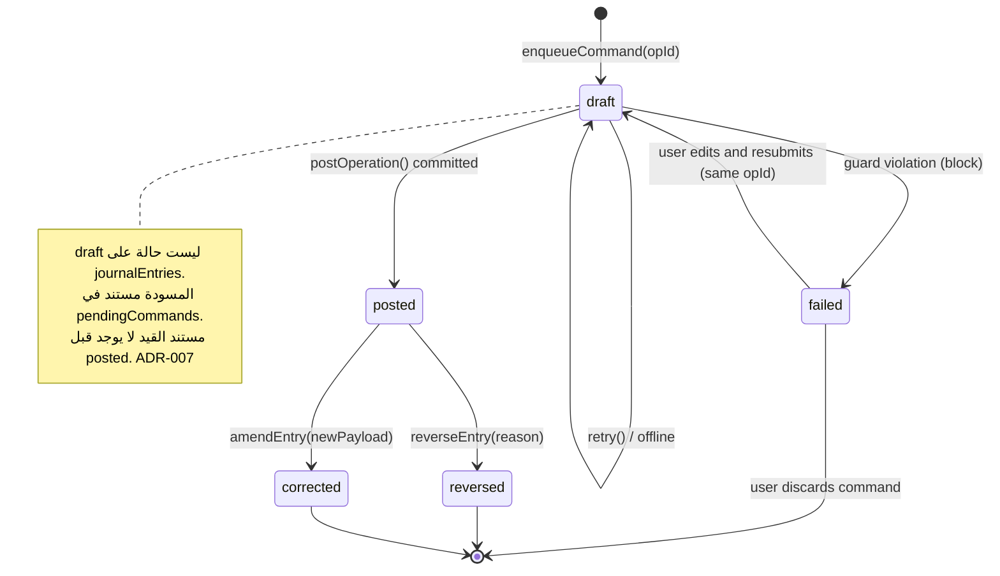
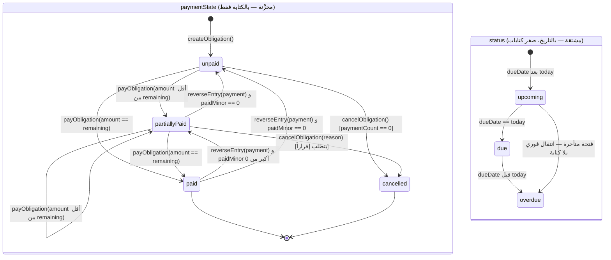
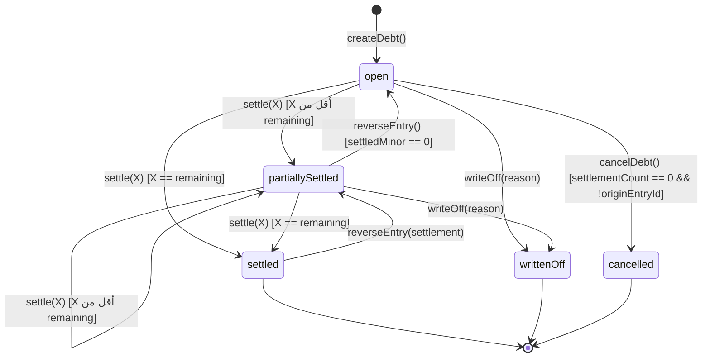
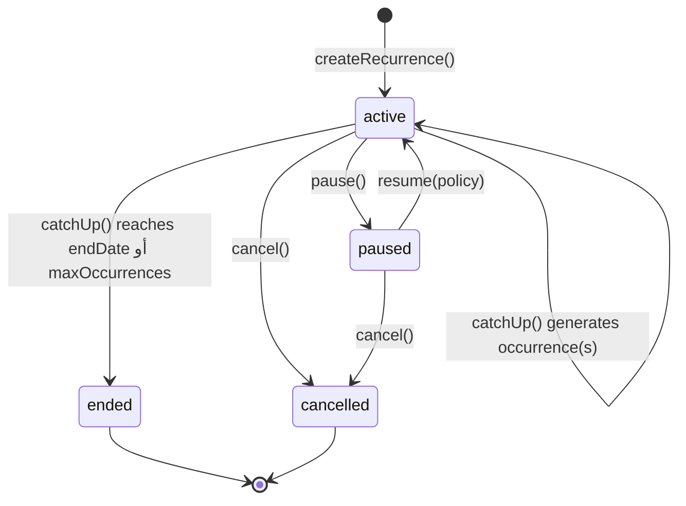

## 9. جدول الحقيقة — قواعد القسم 19 كاملة

هذا القسم هو **المرجع الحاكم** لأي سؤال من نوع «ما أثر هذه العملية على هذا الرقم؟».
كل شاشة وكل تقرير وكل اختبار وحدة يعود إلى هنا. أي خلاف بين كود وبين هذا الجدول = **عيب في الكود**.

### 9.0 تعريف الأرقام العشرة المتأثرة (قبل الجدول)

لا معنى لعمود «أثرها على النقد المتاح» دون تعريف تنفيذي للنقد المتاح. هذه التعريفات **نهائية**،
وكلها دوال نقية على المُجمَّعات أو على `postings`، ولا واحدة منها تُحسب في مكوّن واجهة.

| الرقم | الاسم في الكود | التعريف التنفيذي الدقيق |
|---|---|---|
| رصيد الحساب | `account.balanceMinor` | مُجمَّع مخزَّن (ADR-003): `openingBalanceMinor + Σ lineSign(type, side) × amountMinor` |
| النقد المتاح | `selectAvailableCashMinor()` | `Σ balanceMinor` على `accounts` حيث `isCashLike === true && status === 'active'`. **`asset.receivable.*` مستثنى بنيوياً** (`isCashLike === false`) ⇒ القاعدة 19.9 خصيصة بيانات لا شرط استعلام |
| المتاح للإنفاق | `selectSpendableMinor()` | `selectAvailableCashMinor() − Σ account.earmarkedMinor` (ADR-017). **للعرض والتحذير فقط، لا يُستخدم في أي حارس منع** |
| تقرير الدخل | `incomeMinor(range)` | `Σ postings.amountMinor` حيث `accountType === 'income' && side === 'credit' && reversed === false` − نفسها بـ `side === 'debit'` |
| تقرير المصروف | `expenseMinor(range)` | `Σ postings.amountMinor` حيث `accountType === 'expense' && side === 'debit' && reversed === false` − نفسها بـ `side === 'credit'` |
| صافي التدفق | `netFlowMinor(range)` | `Σ (debit − credit)` على `postings` حيث الحساب `isCashLike === true && reversed === false`. **مستقل تماماً عن الدخل/المصروف** — ولهذا القرض والسداد يظهران فيه ولا يظهران فيهما |
| الالتزام | `obligation.paidMinor` / `remainingMinor` | `remainingMinor = totalMinor + extraChargesMinor − paidMinor` (ADR-012) |
| الدين | `debt.settledMinor` / `remainingMinor` | `remainingMinor = principalMinor − settledMinor − writtenOffMinor` |
| الميزانية | `budgets/{periodKey}.categories[catId].spentMinor` | يتغذى **حصراً** من سطور `accountType === 'expense'` ذات `categoryId` مطابق |
| الهدف | `financialGoal.savedMinor` / `earmarkedMinor` | `backedAccount`: رصيد حساب الدعم. `virtualEarmark`: `earmarkedMinor` على المستند (لا قيد — 9.15) |
| صافي الثروة | `netWorthMinor()` | `Σ asset.balanceMinor − Σ liability.balanceMinor` (الأصول تشمل `asset.receivable.*`) |

**ثابت عابر للأعمدة (I-9.0):** `netFlowMinor` لا يساوي `incomeMinor − expenseMinor` إلا إذا خلت الفترة من
تحويل واقتراض وإقراض وسداد وتحصيل وتسوية. أي تقرير يعرض الثلاثة معاً **يجب** أن يعرض سطر مطابقة:
`netFlow = (income − expense) + financingIn − financingOut ± adjustments`. عرضها دون هذا السطر = شكوى
مستخدم مؤكدة.

### 9.1 الجدول الموحّد — القواعد 12 من القسم 19

`X` = المبلغ بالدرهم. «✗» = لا أثر. `↑`/`↓` = زيادة/نقص بمقدار `X` إلا إن كُتب غير ذلك.

| # | قاعدة القسم 19 | القيد المحاسبي الناتج | رصيد الحساب | النقد المتاح | الدخل | المصروف | صافي التدفق | الالتزام | الدين | الميزانية | الهدف | صافي الثروة | ملاحظة |
|---|---|---|---|---|---|---|---|---|---|---|---|---|---|
| R1 | المصروف المدفوع يخفض رصيد الحساب | `Dr expense.{cat}` X<br>`Cr asset.{cash\|bank\|ewallet}.{id}` X | `↓ X` على حساب الدفع<br>`↑ X` على حساب المصروف | `↓ X` | ✗ | `↑ X` | `↓ X` | ✗ (إلا بـ `refs.obligationId`) | ✗ | `spentMinor ↑ X` إن وُجد سقف للفئة | ✗ | `↓ X` | `kind: 'expense'`. الفئة تحدد حساب المصروف 1:1 |
| R2 | الدخل المستلم يرفع رصيد الحساب | `Dr asset.{bank}.{id}` X<br>`Cr income.{src}` X | `↑ X` | `↑ X` | `↑ X` | ✗ | `↑ X` | ✗ | ✗ | ✗ | ✗ (أو `savedMinor ↑` إن كان حساب الاستلام حساب دعم هدف) | `↑ X` | **الدخل المتوقَّع لا يُقيَّد** (المتطلبات §7): لا قيد قبل الاستلام الفعلي |
| R3 | التحويل بين حسابين لا يغيّر إجمالي الأموال | `Dr asset.{dest}` X<br>`Cr asset.{src}` X | `↑ X` و `↓ X` | ✗ (إن كان الطرفان `isCashLike`) | ✗ | ✗ | ✗ | ✗ | ✗ | ✗ | `savedMinor ↑ X` إن كانت الوجهة حساب دعم هدف | ✗ | **لا يمكن بنيوياً** أن يدخل الدخل أو المصروف: لا سطر على حساب `income`/`expense` أصلاً (§1.2) |
| R4 | إنشاء التزام غير مدفوع لا يخفض الرصيد النقدي | **لا قيد** (أساس نقدي) | ✗ | ✗ | ✗ | ✗ | ✗ | مستند جديد: `paidMinor=0`, `remainingMinor=totalMinor` | ✗ | ✗ | ✗ | ✗ | كتابة مستند واحدة + `auditLogs`، **لا `runTransaction`**. التفصيل والتبرير في 9.3-ح8 |
| R5 | دفع التزام يخفض الرصيد ويسجل الدفعة المرتبطة | `nature:'expense'`: `Dr expense.{cat}` X / `Cr asset.{pay}` X<br>`nature:'financing'`: انظر 9.3-ح10 | `↓ X` | `↓ X` | ✗ | `↑ X` إن `nature='expense'`، **✗ إن `financing`** (ADR-011) | `↓ X` | `paidMinor ↑ X`, `remainingMinor ↓ X`, `paymentCount ↑1`, `lastPaymentEntryId` | `settledMinor ↑` بجزء الأصل إن `financing` ومرتبط بـ `refs.debtId` | `spentMinor ↑ X` إن `nature='expense'` فقط | ✗ | `↓ X` إن `expense`، `↓ الفائدة` إن `financing` | «الدفعة المرتبطة» = القيد نفسه (ADR-005): سجل الدفعات استعلام على `postings` بـ `refs.obligationId` |
| R6 | تسجيل دين على المستخدم لا يعني بالضرورة حركة نقدية | **بنقد** (`cashMoved:true`): `Dr asset.{cash}` X / `Cr liability.payable.{contactId}` X<br>**بلا نقد** (`cashMoved:false`): **لا قيد نقدي**؛ إن مثّل شراءً بالأجل: `Dr expense.{cat}` X / `Cr liability.payable.{contactId}` X | حسب الحالة | `↑ X` بنقد، ✗ بلا نقد | ✗ **أبداً** | ✗ بنقد، `↑ X` في الشراء بالأجل | `↑ X` بنقد، ✗ بلا نقد | ✗ | `principalMinor = X`, `remainingMinor = X`, `status:'open'` | ✗ بنقد | ✗ | ✗ بنقد | `kind: 'borrow'`. **الاقتراض ليس دخلاً** — لا سطر على أي حساب `income` |
| R7 | تحصيل دين يرفع رصيد الحساب المستلم | `Dr asset.{bank}` X<br>`Cr asset.receivable.{contactId}` X | `↑ X` و `↓ X` | `↑ X` (لأن `receivable.isCashLike=false`) | ✗ | ✗ | `↑ X` | ✗ | `settledMinor ↑ X`, `remainingMinor ↓ X` | ✗ | ✗ | ✗ | `kind: 'debtCollection'`. **ليس دخلاً**: صافي الثروة ثابت لأن أصلاً تحوّل إلى أصل |
| R8 | سداد دين يخفض رصيد الحساب المستخدم للدفع | `Dr liability.payable.{contactId}` X<br>`Cr asset.{pay}` X | `↓ X` و `↓ X` (الخصم ينقص) | `↓ X` | ✗ | ✗ **أبداً** | `↓ X` | ✗ | `settledMinor ↑ X`, `remainingMinor ↓ X` | ✗ | ✗ | ✗ | `kind: 'debtRepayment'`. **ليس مصروفاً**: أصل ↓ وخصم ↓ بنفس المقدار |
| R9 | المبالغ المستحقة للتحصيل لا تُعرض ضمن النقد المتاح | `Dr asset.receivable.{contactId}` X<br>`Cr asset.{cash}` X (إقراض) | `↑ X` و `↓ X` | `↓ X` **ولا ترتفع بمقابلها** | ✗ | ✗ | `↓ X` | ✗ | دين `receivable` جديد | ✗ | ✗ | ✗ | `isCashLike=false` على كل `asset.receivable.*` هو **التنفيذ الكامل** للقاعدة. لا مرشّح في أي استعلام |
| R10 | تعديل/إلغاء عملية معتمدة يحفظ الأثر ويمنع تضارب الأرصدة | **إلغاء:** قيد `kind:'reversal'` يقلب الجانبين<br>**تعديل:** عكس + بديل في معاملة واحدة بدلتا صافية (ADR-006) | يتغير بالدلتا الصافية فقط | كذلك | كذلك | كذلك | كذلك | `paidMinor` بالدلتا | `settledMinor` بالدلتا | `spentMinor` بالدلتا | `savedMinor` بالدلتا | بالدلتا | **لا حذف مالي أبداً.** القيد الأصلي يبقى بـ `status:'reversed'\|'corrected'`، و `reversed:true` على سطوره في `postings` ⇒ كل تقرير يستبعدها بلا منطق خاص. القفل: `entryCorrections/{originalEntryId}` (ADR-014) |
| R11 | التمييز بين التحويل والاقتراض والسداد والدخل والمصروف الحقيقي | التمييز **خصيصة نوع الحساب**: الدخل = سطور `income`، المصروف = سطور `expense` | — | — | يتغذى من `accountType='income'` فقط | يتغذى من `accountType='expense'` فقط | يتغذى من `isCashLike` فقط | — | — | — | — | — | `transfer`/`borrow`/`debtRepayment`/`lend`/`debtCollection`/`earmark` **لا تملك سطراً واحداً** على حساب دخل أو مصروف ⇒ **تضخّم التقارير مستحيل بنيوياً**، لا ممنوع بقاعدة |
| R12 | منع: السالب غير المسموح، السداد الزائد، التكرار، العمليات غير المكتملة | **لا قيد** — طبقة حوارس قبل بناء القيد | — | — | — | — | — | — | — | — | — | — | السالب: `minBalanceMinor` (11.1). الزائد: 11.2. التكرار: `entryId === opId` (ADR-004). غير المكتملة: `pendingCommands` مستبعدة من كل رصيد وتقرير (ADR-007) |

**ثلاث قراءات إلزامية من الجدول:**

1. **خمس عمليات لا تمسّ الدخل ولا المصروف إطلاقاً:** `transfer`, `borrow`, `lend`, `debtRepayment`,
   `debtCollection`. وسادسة لا تمسّ شيئاً من الأحد عشر: `earmark` (9.15).
2. **ثلاث عمليات لا تغيّر صافي الثروة:** `transfer`, `borrow`, `lend` (و`debtRepayment` و`debtCollection`).
   كل واحدة منها تبدّل شكل الأصل أو تُطفئ أصلاً مقابل خصم.
3. **عمليتان تخفضان صافي الثروة دون أن تخفضا النقد:** غرامة التأخير عند دفعها، وتسوية النقص.

### 9.2 موضع `settlementDeltaMinor` — القاعدة الحاسمة (ADR-021)

`paidMinor` و`settledMinor` مُجمَّعات مخزَّنة، ولا بد من **مصدر مستقل** للتحقق منها، وإلا فحقل
`remainingMinor` يصدّق نفسه. المصدر هو `postings.settlementDeltaMinor`، بهذه القاعدة الواحدة:

> **القاعدة:** `settlementDeltaMinor` على سطر = المبلغ الذي **يُسوّي كل مرجع** مذكور في `refs` لذلك السطر.
> سطور الحسابات السائلة (`isCashLike === true`) تحمل `settlementDeltaMinor === 0` **دائماً**
> ولا تحمل مراجع تسوية.
>
> **الثابت (I-9.2):** لكل مرجع `R` ولكل مجموعة مستندات:
> `Σ postings.settlementDeltaMinor where refs.R == id && reversed == false` **===** الحقل المُجمَّع المقابل
> (`obligation.paidMinor` أو `debt.settledMinor`).
>
> **السطور المنشئة للأصل** (`borrow`, `lend`) تحمل `settlementDeltaMinor === 0`: إنشاء أصل الدين ليس تسوية.
> **قيود العكس** تحمل `settlementDeltaMinor` **سالباً** — وهو الموضع الوحيد في النظام الذي يُسمح فيه
> بمبلغ سالب داخل سطر (انظر 11.5).

التحقق على Spark: `getAggregateFromServer(sum('settlementDeltaMinor'))` على استعلام مفهرس عند الطلب
(ADR-016)، لا عدّاد ساخن. تكلفة الفحص لالتزام ذي 12 دفعة = قراءة واحدة مُجمَّعة.

### 9.3 الحالات الخمس عشرة — بقيودها الرقمية الكاملة

الفرض في كل الأمثلة: `pk = '2026-10'`، و`bookedAt = '2026-10-09'` ⇒ `periodKey ≡ bookedAt[0:7]` (ADR-008).
الحسابات: `acc_cash_main` (`asset.cash.main`)، `acc_bank_jm` (`asset.bank.jm`)، وكلاهما `isCashLike: true`.

---

#### ح1 — مصروف نقدي 25.500 د.ل

`parseAmountToMinor('25.500') → 25500` درهم.

| السطر | الحساب | `accountType` | الجانب | `amountMinor` | `settlementDeltaMinor` |
|---|---|---|---|---|---|
| 1 | `acc_exp_food` (`expense.food`) | `expense` | `Dr` | 25500 | 0 |
| 2 | `acc_cash_main` (`asset.cash.main`) | `asset` | `Cr` | 25500 | 0 |

```
journalEntries/{opId}: kind:'expense', status:'posted', bookedAt:'2026-10-09', periodKey:'2026-10',
                       debitTotalMinor: 25500, creditTotalMinor: 25500, scope:'personal'
postings/{opId}__1 ، postings/{opId}__2
accounts/acc_exp_food   : debitTotalMinor  += 25500 ، balanceMinor += 25500 ، balanceVersion ↑1
accounts/acc_cash_main  : creditTotalMinor += 25500 ، balanceMinor −= 25500 ، balanceVersion ↑1
accountPeriods/acc_exp_food_2026-10  : debitMinor  += 25500      (حركة فقط — ADR-009)
accountPeriods/acc_cash_main_2026-10 : creditMinor += 25500
budgets/2026-10 : categories['cat_food'].spentMinor += 25500   (فقط إن وُجد المستند والمفتاح)
```

**الأثر:** النقد المتاح `↓ 25.500`، المصروف `↑ 25.500`، صافي التدفق `↓ 25.500`، صافي الثروة `↓ 25.500`،
الدخل ✗، الالتزام ✗، الدين ✗، الهدف ✗.

---

#### ح2 — دخل راتب 2,500 د.ل إلى حساب مصرفي

`2500 × 1000 = 2_500_000` درهم.

| السطر | الحساب | `accountType` | الجانب | `amountMinor` |
|---|---|---|---|---|
| 1 | `acc_bank_jm` (`asset.bank.jm`) | `asset` | `Dr` | 2500000 |
| 2 | `acc_inc_salary` (`income.salary`) | `income` | `Cr` | 2500000 |

`kind:'income'`. `accounts/acc_inc_salary.creditTotalMinor += 2500000` و`balanceMinor += 2500000`
(الجانب الطبيعي للدخل دائن ⇒ `lineSign = +1`).

**الأثر:** النقد المتاح `↑ 2,500.000`، الدخل `↑ 2,500.000`، صافي التدفق `↑ 2,500.000`،
صافي الثروة `↑ 2,500.000`، المصروف ✗، الميزانية ✗.

**ملاحظة إلزامية:** راتب **متوقَّع** في 25 من الشهر لا يُقيَّد. ينتظر في `incomeSchedules` كتوقّع،
ويظهر في «التدفقات المتوقعة» فقط، وشاشة الرصيد لا تعرف بوجوده — المتطلبات §7 سطر 84.

---

#### ح3 — تحويل 500 د.ل من المصرف إلى النقد (لا دخل ولا مصروف)

`500_000` درهم.

| السطر | الحساب | `accountType` | الجانب | `amountMinor` |
|---|---|---|---|---|
| 1 | `acc_cash_main` | `asset` | `Dr` | 500000 |
| 2 | `acc_bank_jm` | `asset` | `Cr` | 500000 |

`kind:'transfer'`, `refs.transferPairKey = opId`.

**الأثر:** رصيد النقد `↑ 500.000`، رصيد المصرف `↓ 500.000`، **النقد المتاح ✗**، الدخل ✗، المصروف ✗،
**صافي التدفق ✗**، صافي الثروة ✗.

**لماذا لا يمكن أن يتسلل إلى التقارير:** القيد يحمل سطرين `accountType === 'asset'` فقط. دالة
`expenseMinor` تجمع على `accountType === 'expense'`. لا شرط، لا استثناء، لا مرشّح — **لا مُجمَّع عليه**.
وصافي التدفق صفر لأن السطرين كليهما على حسابات `isCashLike` بإشارتين متعاكستين فيلغيان.
**التحويل إلى حساب غير سائل** (حساب توفير مُعلَّم `isCashLike:false`) يخفض النقد المتاح ولا يخفض صافي الثروة.

---

#### ح4 — اقتراض 1,000 د.ل نقداً من صديق (ليس دخلاً)

`1_000_000` درهم. أولاً يُنشأ حساب الدائن: `liability.payable.{contactId}` = `acc_pay_khaled`.

| السطر | الحساب | `accountType` | الجانب | `amountMinor` | `refs` | `settlementDeltaMinor` |
|---|---|---|---|---|---|---|
| 1 | `acc_cash_main` | `asset` | `Dr` | 1000000 | — | 0 |
| 2 | `acc_pay_khaled` | `liability` | `Cr` | 1000000 | `debtId: 'dbt_khaled'` | **0** |

```
journalEntries/{opId}: kind:'borrow', refs:{ debtId:'dbt_khaled', debtDirection:'payable' }
debts/dbt_khaled: direction:'payable', principalMinor:1000000, settledMinor:0,
                  remainingMinor:1000000, cashMovedOnCreation:true, originEntryId:opId, status:'open'
accounts/acc_cash_main  : balanceMinor += 1000000
accounts/acc_pay_khaled : creditTotalMinor += 1000000 ، balanceMinor += 1000000  ← خصم موجب = دين عليّ
```

**الأثر:** النقد المتاح `↑ 1,000.000`، صافي التدفق `↑ 1,000.000`، **الدخل ✗**، المصروف ✗،
**صافي الثروة ✗** (أصل `↑ 1,000.000` وخصم `↑ 1,000.000`)، الدين: دين جديد قيمته `1,000.000`.

**لماذا هذا هو الاختبار الذي يُسقط التصاميم:** في تصميم أحادي الجانب بـ `type:'income'` و
`subtype:'debtDrawdown'`، استعلام لوحة التحكم الطبيعي `where('type','==','income')` يضخّم دخل الشهر
بـ 1,000 د.ل لم يكسبها المستخدم. هنا `accountType` للسطر الدائن هو `liability` — و`incomeMinor`
لا تراه بأي حال. هذا هو جوهر القاعدة 19.11.

---

#### ح5 — إقراض 500 د.ل لشخص (ليس مصروفاً)

`500_000` درهم. حساب المدين: `asset.receivable.{contactId}` = `acc_recv_ali` بـ **`isCashLike: false`**.

| السطر | الحساب | `accountType` | الجانب | `amountMinor` | `refs` | `settlementDeltaMinor` |
|---|---|---|---|---|---|---|
| 1 | `acc_recv_ali` | `asset` | `Dr` | 500000 | `debtId: 'dbt_ali'` | **0** |
| 2 | `acc_cash_main` | `asset` | `Cr` | 500000 | — | 0 |

`kind:'lend'`. `debts/dbt_ali`: `direction:'receivable'`, `principalMinor:500000`, `status:'open'`.

**الأثر:** رصيد النقد `↓ 500.000`، **النقد المتاح `↓ 500.000` ولا يرتفع بمقابله** (القاعدة 19.9 — لأن
`isCashLike=false`)، المصروف **✗**، الدخل ✗، صافي التدفق `↓ 500.000`، **صافي الثروة ✗** (أصل سائل تحوّل
إلى أصل غير سائل)، الدين: مستحق لي `500.000`.

---

#### ح6 — سداد جزئي 200 د.ل لدين عليّ قيمته 1,000

الدين `dbt_khaled`: `principalMinor: 1000000`, `settledMinor: 0`. الدفعة `200_000` درهم.

| السطر | الحساب | `accountType` | الجانب | `amountMinor` | `refs` | `settlementDeltaMinor` |
|---|---|---|---|---|---|---|
| 1 | `acc_pay_khaled` | `liability` | `Dr` | 200000 | `debtId:'dbt_khaled'` | **+200000** |
| 2 | `acc_cash_main` | `asset` | `Cr` | 200000 | — | 0 |

```
kind:'debtRepayment'
debts/dbt_khaled: settledMinor 0→200000 ، remainingMinor 1000000→800000 ،
                  settlementCount ↑1 ، lastSettlementEntryId:opId ، status 'open'→'partiallySettled'
accounts/acc_pay_khaled: debitTotalMinor += 200000 ، balanceMinor 1000000→800000
accounts/acc_cash_main : balanceMinor −= 200000
```

**الأثر:** النقد المتاح `↓ 200.000`، صافي التدفق `↓ 200.000`، **المصروف ✗**، الدخل ✗،
**صافي الثروة ✗**، الميزانية **✗** (لا تُستهلك بسداد دين — وهذا سؤال يتكرر: الميزانية سقف إنفاق،
والسداد ليس إنفاقاً)، الدين `remainingMinor = 800.000`.

**التحقق المستقل:** `Σ settlementDeltaMinor where refs.debtId=='dbt_khaled' = 200000 === settledMinor` ✔

---

#### ح7 — تحصيل 150 د.ل من دين لي قيمته 400

الدين `dbt_ali2`: `direction:'receivable'`, `principalMinor: 400000`, `settledMinor: 0`. التحصيل `150_000`.

| السطر | الحساب | `accountType` | الجانب | `amountMinor` | `refs` | `settlementDeltaMinor` |
|---|---|---|---|---|---|---|
| 1 | `acc_bank_jm` | `asset` | `Dr` | 150000 | — | 0 |
| 2 | `acc_recv_ali2` | `asset` | `Cr` | 150000 | `debtId:'dbt_ali2'` | **+150000** |

```
kind:'debtCollection'
debts/dbt_ali2: settledMinor 0→150000 ، remainingMinor 400000→250000 ، status→'partiallySettled'
accounts/acc_bank_jm  : balanceMinor += 150000
accounts/acc_recv_ali2: creditTotalMinor += 150000 ، balanceMinor 400000→250000
```

**الأثر:** النقد المتاح `↑ 150.000`، صافي التدفق `↑ 150.000`، **الدخل ✗**، المصروف ✗،
**صافي الثروة ✗**، الدين: متبقٍ لي `250.000`.

---

#### ح8 — إنشاء التزام إيجار 800 د.ل غير مدفوع

**الحسم: لا يُكتب قيد. لا سطر واحد في `journalEntries` ولا في `postings`.**

```
obligations/obl_rent_2026_10 = {
  name: 'إيجار المنزل', nature: 'expense', categoryId: 'cat_rent',
  totalMinor: 800000, paidMinor: 0, extraChargesMinor: 0, remainingMinor: 800000,
  dueDate: '2026-10-05', paymentState: 'unpaid', paymentCount: 0,
  lastPaymentEntryId: null, priority: 1, recurrenceId: 'rec_rent', ...
}
auditLogs/{opId} = { action:'obligation.create', totalMinor:800000, at: serverTimestamp(), ... }
```

كتابتان في `writeBatch` واحد — **لا `runTransaction`**، لأن لا مُجمَّع مالياً يُقرأ ويُكتب هنا.
وهذه العملية **الوحيدة من الخمس عشرة التي تعمل دون اتصال** بكامل دلالتها (ADR-007)، لأن `writeBatch`
يُطابَر محلياً في Firestore SDK.

**الأثر على الأحد عشر رقماً:** كلها ✗ إلا «الالتزام»: مستند جديد بـ `remainingMinor = 800.000`
يظهر في «الالتزامات القادمة» وفي التدفقات المتوقعة.

**لماذا لا قيد — الحجة الكاملة (ثلاث طبقات):**

1. **نصّ المتطلبات:** القاعدة 19.4 «إنشاء التزام غير مدفوع لا يخفض الرصيد النقدي»، و§12 «فصل واضح
   بين البيانات الفعلية والتوقعات والافتراضات».
2. **ما يحدث لو قيّدناه بأسلوب الاستحقاق** (`Dr expense.rent 800000 / Cr liability.obligation.obl_rent`):
   النقد لا ينخفض ✔ — **لكن تقرير مصروفات أكتوبر يرتفع 800 د.ل لم تُدفع**. وإنشاء التزام سنوي 9,600 د.ل
   يرفع مصروفات الشهر 9,600. هذا الرقم **لا يريده المستخدم ولا يفهمه**، وهو البديل المرفوض صراحةً
   في §1.3 الصف الثالث.
3. **ما الذي نخسره — معلَن:** الالتزامات غير المدفوعة **ليست خصوماً في الدفاتر** ⇒ `netWorthMinor()`
   لا يطرحها. هذا **قصور مُعلَن**، لا سهو. التخفيف: لوحة التحكم تعرض «الالتزامات القادمة» و«المتأخرة»
   بطاقتين مستقلتين (المتطلبات §4)، وتقرير صافي الثروة يعرض سطراً إضافياً
   `التزامات مستحقة غير مدفوعة: Σ remainingMinor` **تحت** صافي الثروة ومفصولاً عنه بخط، لا مدمجاً فيه.
   سبب الفصل: مزج التزام مستقبلي بخصم قائم يعطي رقماً لا يطابق أي دفتر.

**نتيجة بنيوية:** فرع `liability.obligation.*` **لا يُنشأ في الإصدار الأول**، وحقل `accounting: 'cash' | 'accrual'`
**محذوف من مخطط `Obligation`** نهائياً. أساس نقدي واحد لا وضعان، لأن وضعين يعنيان تقريرين مختلفين
لنفس البيانات ومسارَي اختبار مضاعفين.

---

#### ح9 — سداد جزئي 200 د.ل للالتزام أعلاه

الالتزام: `totalMinor: 800000`, `extraChargesMinor: 0`, `paidMinor: 0`, `nature: 'expense'`,
`categoryId: 'cat_rent'`. الدفعة `200_000` من النقد.

| السطر | الحساب | `accountType` | الجانب | `amountMinor` | `refs` | `settlementDeltaMinor` |
|---|---|---|---|---|---|---|
| 1 | `acc_exp_rent` (`expense.home.rent`) | `expense` | `Dr` | 200000 | `obligationId:'obl_rent_2026_10'` | **+200000** |
| 2 | `acc_cash_main` | `asset` | `Cr` | 200000 | — | 0 |

```
kind:'obligationPayment'
obligations/obl_rent_2026_10: paidMinor 0→200000 ، remainingMinor 800000→600000 ،
                              paymentCount ↑1 ، lastPaymentEntryId:opId ،
                              paymentState 'unpaid'→'partiallyPaid'
accounts/acc_exp_rent : debitTotalMinor += 200000 ، balanceMinor += 200000
accounts/acc_cash_main: balanceMinor −= 200000
accountPeriods/acc_exp_rent_2026-10 : debitMinor += 200000
budgets/2026-10: categories['cat_rent'].spentMinor += 200000
```

**الأثر:** النقد المتاح `↓ 200.000`، **المصروف `↑ 200.000`** (المصروف يُعترف به **عند الدفع** لا عند
الإنشاء — نتيجة مباشرة لح8)، الميزانية `spentMinor ↑ 200.000`، صافي التدفق `↓ 200.000`،
صافي الثروة `↓ 200.000`، الالتزام `remainingMinor = 600.000`، الدخل ✗، الدين ✗، الهدف ✗.

**ملاحظة توقيت مهمة:** الالتزام أُنشئ في سبتمبر واستحق 2026-10-05 ودُفع 2026-11-02 ⇒ المصروف يُحتسب
في `periodKey: '2026-11'` لأن `periodKey ≡ bookedAt[0:7]` (ADR-008). شاشة الالتزامات تعرض التأخر،
وتقرير المصروفات يعرض الدفع في شهره. **هذان رقمان مختلفان بقصد**، ويجب أن تحمل الشاشة نصاً يوضح ذلك.

---

#### ح10 — قسط قرض: التزام `nature: 'financing'` (ليس مصروفاً)

التركيب المُلزِم: قسط القرض **التزام** (جدول استحقاقات) **مرتبط بدين** (أصل قائم).
`obligation.nature = 'financing'` **يستلزم** `obligation.refs.debtId` غير فارغ — حارس في 11.3.

المعطيات: قرض مصرفي `dbt_bank_car` بـ `principalMinor: 9_000_000` (9,000 د.ل). قسط شهري
`450.000 د.ل = 450_000` درهم، منه **أصل 400.000 د.ل** و**فائدة 50.000 د.ل**.

الفصل بين الأصل والفائدة يأتي من حمولة الأمر، لا من حساب ضمني:

```ts
export interface PayObligationRequest {
  opId: string;
  obligationId: string;
  payFromAccountId: string;
  amountMinor: Minor;           // إجمالي المدفوع = 450000
  /** جزء الفائدة/أعباء التمويل. 0 افتراضياً. يجب أن يكون ≤ amountMinor. */
  interestMinor?: Minor;        // 50000
  bookedAt: string;             // 'YYYY-MM-DD'
  note?: string;
}
// الأصل مشتق، لا يُدخله المستخدم مرتين:
// principalPortionMinor = amountMinor − (interestMinor ?? 0)   = 400000
```

| السطر | الحساب | `accountType` | الجانب | `amountMinor` | `refs` | `settlementDeltaMinor` |
|---|---|---|---|---|---|---|
| 1 | `acc_pay_bank_car` (`liability.payable.bank_car`) | `liability` | `Dr` | 400000 | `obligationId:'obl_car_inst_7'`, `debtId:'dbt_bank_car'` | **+400000** |
| 2 | `acc_exp_interest` (`expense.financeCost`) | `expense` | `Dr` | 50000 | `obligationId:'obl_car_inst_7'` | **+50000** |
| 3 | `acc_bank_jm` | `asset` | `Cr` | 450000 | — | 0 |

```
debitTotalMinor = 450000 === creditTotalMinor = 450000     ✔ (ثلاثة سطور، التوازن قائم)
kind:'obligationPayment'
obligations/obl_car_inst_7: paidMinor += 450000 ، remainingMinor → 0 ، paymentState→'paid'
debts/dbt_bank_car       : settledMinor += 400000 ، remainingMinor 9000000→8600000 ،
                           status→'partiallySettled'
accounts/acc_pay_bank_car : balanceMinor 9000000→8600000
accounts/acc_exp_interest : balanceMinor += 50000
accounts/acc_bank_jm      : balanceMinor −= 450000
budgets/2026-10: categories['cat_finance_cost'].spentMinor += 50000      ← **الفائدة وحدها**
```

**الأثر:** النقد المتاح `↓ 450.000`، صافي التدفق `↓ 450.000`، **المصروف `↑ 50.000` فقط** (الفائدة)،
**الأصل 400.000 ليس مصروفاً** (ADR-011)، الميزانية `↑ 50.000` فقط، صافي الثروة `↓ 50.000` فقط
(لأن 400.000 خصم انقضى مقابل نقد خرج)، الالتزام مسدد بالكامل، الدين `remainingMinor = 8,600.000`.

**التحقق المستقل (ADR-021) — لاحظ أن المرجعين يُجمعان بشكل مختلف على نفس السطور:**

```
Σ settlementDeltaMinor where refs.obligationId == 'obl_car_inst_7' = 400000 + 50000 = 450000 === paidMinor  ✔
Σ settlementDeltaMinor where refs.debtId      == 'dbt_bank_car'   = 400000           === settledMinor(هذا القسط) ✔
```

وهذا هو سبب صياغة قاعدة 9.2 بـ «يُسوّي **كل** مرجع على ذلك السطر»: السطر 1 يحمل المرجعين فيُحتسب لهما،
والسطر 2 يحمل مرجع الالتزام وحده.

**إن لم تكن هناك فائدة** (قرض حسن): `interestMinor` غائب ⇒ سطران فقط، `Dr liability.payable / Cr asset`،
والمصروف **✗ تماماً**، وهذا بالضبط ح6 بمرجع التزام إضافي.

**ما لا يفعله هذا التصميم — معلَن:** لا يستنبط جدول الإطفاء (amortization) ولا يحسب الفائدة من نسبة.
`interestMinor` **يدخله المستخدم** من كشف المصرف. البديل (حساب الفائدة من `Bps` ورصيد الأصل) يولّد
أرقاماً تخالف كشف المصرف بوحدات درهم ويفتح جدلاً لا ينتهي. القرار: الحقيقة من الكشف.

---

#### ح11 — غرامة تأخير على التزام (`extraChargesMinor` — `totalMinor` لا يُرفع أبداً)

الالتزام بعد ح9: `totalMinor: 800000`, `paidMinor: 200000`, `extraChargesMinor: 0`, `remainingMinor: 600000`.
غرامة تأخير `25.000 د.ل = 25_000` درهم.

**الخطوة 1 — تسجيل الغرامة: لا قيد.**

```
obligations/obl_rent_2026_10:
  extraChargesMinor 0 → 25000
  remainingMinor    600000 → 625000          // = total + extra − paid = 800000+25000−200000
  totalMinor        800000 → 800000          // **لا يُمَس. أبداً.**
  charges[] ← { chargeId, kind:'lateFee', amountMinor:25000, at:'2026-10-20', reason:'تأخر 15 يوماً' }
auditLogs/{opId}: action:'obligation.addCharge', before:{extra:0}, after:{extra:25000}
```

**لماذا `totalMinor` لا يُرفع (ADR-012) — ثلاثة أسباب تنفيذية:**
1. `totalMinor` هو **المبلغ المتعاقَد عليه**، وهو المرجع الذي يُقاس به كل شيء. رفعه يجعل حارس السداد
   الزائد يصدّق أي مبلغ: كل سداد زائد يُبرّر نفسه برفع السقف.
2. تقرير «الإيجار المتعاقد عليه سنوياً» يصبح 9,625 بدل 9,600 ⇒ رقم لا يطابق العقد.
3. المتكرر: `recurrence` يولّد الدورة القادمة من `totalMinor` القالبي. لو رُفع، لورّثت الغرامة نفسها
   إلى إيجار الشهر القادم — خطأ يتراكم شهرياً.

**الخطوة 2 — دفع المتبقي كله 625.000 د.ل** = `625_000` درهم.

قاعدة التوزيع **حتمية ونقية**: الأصل أولاً ثم الغرامات.

```ts
/** توزيع دفعة التزام على الأصل ثم الغرامات. حتمي، نقي، قابل للاختبار. */
export function allocateObligationPayment(
  o: Pick<Obligation, 'totalMinor' | 'extraChargesMinor' | 'paidMinor'>,
  amountMinor: Minor,
): { principalPortionMinor: Minor; chargesPortionMinor: Minor } {
  const principalDue = Math.max(0, o.totalMinor - o.paidMinor);        // 600000
  const principalPortionMinor = Math.min(amountMinor, principalDue) as Minor;   // 600000
  const chargesPortionMinor = (amountMinor - principalPortionMinor) as Minor;   //  25000
  return { principalPortionMinor, chargesPortionMinor };
}
// الثابت: principalPortionMinor + chargesPortionMinor === amountMinor  (دائماً، بلا تقريب)
```

| السطر | الحساب | `accountType` | الجانب | `amountMinor` | `refs` | `settlementDeltaMinor` |
|---|---|---|---|---|---|---|
| 1 | `acc_exp_rent` (`expense.home.rent`) | `expense` | `Dr` | 600000 | `obligationId:'obl_rent_2026_10'` | **+600000** |
| 2 | `acc_exp_fees` (`expense.fees`) | `expense` | `Dr` | 25000 | `obligationId:'obl_rent_2026_10'` | **+25000** |
| 3 | `acc_cash_main` | `asset` | `Cr` | 625000 | — | 0 |

```
obligations: paidMinor 200000→825000 ، remainingMinor 625000→0 ، paymentState→'paid'
             (825000 === totalMinor 800000 + extraChargesMinor 25000  ✔)
budgets/2026-10: categories['cat_rent'].spentMinor += 600000
                 categories['cat_fees'].spentMinor += 25000      ← الغرامة في فئتها، لا في فئة الإيجار
```

**الأثر:** النقد المتاح `↓ 625.000`، المصروف `↑ 625.000` (600.000 إيجار + 25.000 رسوم)،
صافي الثروة `↓ 625.000`، الالتزام مسدد بالكامل.

**قرار صريح:** الغرامة تُحمَّل على `expense.fees` لا على فئة الالتزام، لأن سؤال «كم دفعت غرامات تأخير
هذه السنة؟» سؤال مشروع ومتكرر، ودفنه داخل فئة الإيجار يجعله غير قابل للإجابة.
و**الأصل أولاً** لأن المستخدم يرى الدفعة «إيجاراً» قبل أن يراها غرامة، ولأن هذا الترتيب يُغلق
`totalMinor` أولاً فيبقى `remainingMinor` قابلاً للقراءة الذهنية.

---

#### ح12 — تسوية رصيد (`Adjust`)

**متى تجوز — أربعة شروط مجتمعة (تُفحص كلها قبل بناء القيد):**

1. **الحساب سائل فقط** (`isCashLike === true`). لا تسوية على حساب مصروف أو دخل أو خصم أو مستحق —
   هذه تُصحَّح بتعديل قيدها الأصلي (R10)، لا بتسوية.
2. **سبب نصي إلزامي** `reason` طوله ≥ 10 محارف. السبب يُخزَّن في القيد **وفي `auditLogs`**.
3. **الفرق ≠ 0** و`|الفرق| ≤ ADJUST_MAX_ABS_MINOR = 5_000_000` (5,000 د.ل). ما تجاوز ذلك عيب بيانات
   لا فرق جرد، ويُرفض ويُوجَّه المستخدم إلى «إعادة بناء الإسقاطات» (§16).
4. **الفترة غير مُقفلة** (`budgets/{pk}.isLocked !== true`).

**المقابل: `equity.adjustment` — ولا شيء آخر.** ليس `expense.other` وليس `income.other`.
السبب: التسوية **ليست حدثاً اقتصادياً**، بل إقرار بأن الدفتر كان مخطئاً. تمريرها على المصروف يضخّم
مصروفات الشهر بخطأ محاسبي ويستهلك الميزانية بلا إنفاق — خرق مباشر للقاعدة 19.11.
وضعها في حقوق الملكية يحفظ `Σ debit = Σ credit` ويُظهرها في تقرير مستقل «تسويات الفترة».

**مثال رقمي — نقص:** الدفتر يقول `25.500 د.ل` والجرد الفعلي `24.000 د.ل` ⇒ الفرق `−1.500 د.ل = 1_500` درهم.

| السطر | الحساب | `accountType` | الجانب | `amountMinor` |
|---|---|---|---|---|
| 1 | `acc_eq_adjust` (`equity.adjustment`) | `equity` | `Dr` | 1500 |
| 2 | `acc_cash_main` | `asset` | `Cr` | 1500 |

`kind:'adjustment'`. (حالة الزيادة تقلب الجانبين: `Dr asset.cash / Cr equity.adjustment`.)

**الأثر:** رصيد الحساب `↓ 1.500`، النقد المتاح `↓ 1.500`، **الدخل ✗، المصروف ✗**،
**صافي التدفق ✗** (فرق جرد ليس تدفقاً نقدياً — وهذا قرار: التسوية مستثناة من صافي التدفق بشرط
`kind !== 'adjustment'` في `netFlowMinor`، وهو **المرشّح الوحيد المسموح** في دوال التقارير)،
صافي الثروة `↓ 1.500`، الميزانية ✗، الالتزام ✗، الدين ✗، الهدف ✗.

**ما يُسجَّل في `auditLogs/{opId}` بالضبط:**

```ts
// users/{uid}/auditLogs/{opId}            إنشاء فقط — لا تعديل ولا حذف (قواعد §14)
{
  logId: opId,                      // = entryId ⇒ ربط 1:1 بالقيد، ومنع ازدواج السجل نفسه
  action: 'account.adjustBalance',
  severity: 'sensitive',
  at: serverTimestamp(),
  actorUid: uid,
  deviceId: 'dev_...',
  targetKind: 'account',
  targetId: 'acc_cash_main',
  before: { balanceMinor: 25500, balanceVersion: 418 },
  after:  { balanceMinor: 24000, balanceVersion: 419 },
  deltaMinor: -1500,                // **سالب مسموح هنا**: حقل تدقيق لا سطر قيد (11.5)
  entryId: opId,
  reason: 'جرد نقدي فعلي بتاريخ 2026-10-09، فرق غير مبرَّر',
  periodKey: '2026-10',
  payloadHash: '…',
}
```

ثلاثة قيود على السجل: (أ) يُكتب **في نفس معاملة** القيد لا بعدها؛ (ب) معرّفه `opId` فيستحيل ازدواجه؛
(ج) القواعد تمنع `update` و`delete` عليه مطلقاً.

---

#### ح13 — مصروف منزلي (`scope: 'household'`)

مشتريات بقالة منزلية `75.000 د.ل = 75_000` درهم.

| السطر | الحساب | `accountType` | الجانب | `amountMinor` |
|---|---|---|---|---|
| 1 | `acc_exp_home_groceries` (`expense.home.groceries`) | `expense` | `Dr` | 75000 |
| 2 | `acc_cash_main` | `asset` | `Cr` | 75000 |

**القيد نفسه تماماً كـ ح1. الفارق الوحيد حقل واحد:**

```ts
// على JournalEntry وعلى كل سطر في postings (مكرَّر للتجميع الخادمي)
scope: 'personal' | 'household';      // افتراضي 'personal'
```

```
journalEntries/{opId}: kind:'expense', scope:'household', description:'بقالة الأسبوع'
postings/{opId}__1: { accountType:'expense', scope:'household', categoryId:'cat_home_groceries', ... }
postings/{opId}__2: { accountType:'asset',   scope:'household', ... }
budgets/2026-10: categories['cat_home_groceries'].spentMinor += 75000
                 householdSpentMinor += 75000            ← مُجمَّع عرض، ليس مصروفاً ثانياً
```

**الأثر:** مطابق لـ ح1 بالكامل: النقد المتاح `↓ 75.000`، المصروف `↑ 75.000`، صافي الثروة `↓ 75.000`.

**كيف لا يُحتسب مرتين — بثلاث خصائص بنيوية:**

1. **قيد واحد فقط.** `scope` **وسم على نفس القيد**، لا قيد ثانٍ ولا شجرة حسابات موازية
   ولا مجموعة `householdExpenses`. لا يوجد ما يمكن احتسابه مرتين.
2. **شاشة المنزل استعلام مُصفّى على نفس `postings`:**
   `where accountType=='expense' and scope=='household' and periodKey=='2026-10'`.
   مجموعها **جزء من** مجموع المصروف العام، لا إضافة إليه. هذا هو نصّ المتطلبات §11:
   «تظهر مصاريف المنزل في التقارير العامة دون تكرار قيمتها».
3. **`householdSpentMinor` على `budgets` مُجمَّع عرض مشتق** يُحدَّث في نفس المعاملة، ولا يُجمع أبداً مع
   `overallSpentMinor` في أي شاشة. اختبار إلزامي:
   `householdSpentMinor ≤ overallSpentMinor` لكل `periodKey`، و
   `overallSpentMinor === Σ categories[*].spentMinor` (الفئات المنزلية **ضمنها** لا بجانبها).

**قرار:** `scope` حقل مُقيَّد بقيمتين لا مصفوفة وسوم حرة. السبب: استعلام `where scope == 'household'`
أرخص وأقل عرضة للخطأ من `array-contains`، والمجال مغلق فعلاً (شخصي/منزلي) ولا حاجة لثالث.
وسوم المستخدم الحرة تبقى في حقل `tags: string[]` منفصل لا يُبنى عليه أي رقم مالي.

---

#### ح14 — دفع زكاة فعلي (منفصل تماماً عن احتسابها)

**الاحتساب لا يولّد قيداً. نقطة.**

```
zakatRecords/zk_1448 = {
  hawlDate: '2026-10-09',            // تاريخ الحول
  zakatableBaseMinor: 50_000_000,    // 50,000 د.ل أموال خاضعة
  nisabMinor: 12_750_000,            // النصاب المُعلن مع مصدره وتاريخه
  rateBps: 250,                      // 2.5% — mulRate بـ BigInt (§2.4)
  dueMinor: 1_250_000,               // = mulRate(50_000_000, 250) = 1,250.000 د.ل
  paidMinor: 0, remainingMinor: 1_250_000,
  method: 'عروض التجارة + النقد − الديون الحالّة', assumptionsAr: '…',
  isAdvisory: true,                  // «إرشادية لا فتوى» — المتطلبات §15.4
}
```

`dueMinor` **ليس خصماً في الدفاتر**، ولا يُطرح من صافي الثروة، ولا يظهر في المصروفات.
هذا هو التطبيق الحرفي لـ«فصل احتساب الزكاة عن تسجيل دفعها ماليًا، فلا يُخصم مبلغ دون دفع فعلي»
(المتطلبات §15.4 سطر 153). وهو **نفس** قرار ح8 بالضبط: لا استحقاق في الدفاتر، أساس نقدي واحد.
ولهذا **حُذف `liability.zakat` و`kind:'zakatAccrual'` من المخطط** — وجودهما كان سيخلق وضعاً ثانياً
يناقض ح8.

**الدفع الفعلي 1,250.000 د.ل = `1_250_000` درهم من المصرف:**

| السطر | الحساب | `accountType` | الجانب | `amountMinor` | `refs` | `settlementDeltaMinor` |
|---|---|---|---|---|---|---|
| 1 | `acc_exp_zakat` (`expense.zakat`) | `expense` | `Dr` | 1250000 | `zakatRecordId:'zk_1448'` | **+1250000** |
| 2 | `acc_bank_jm` | `asset` | `Cr` | 1250000 | — | 0 |

```
kind:'expense'  ← نوعه مصروف حقيقي، لا نوع خاص. الربط بـ refs.zakatRecordId وحده.
zakatRecords/zk_1448: paidMinor 0→1250000 ، remainingMinor →0 ، lastPaymentEntryId:opId
budgets/2026-10: categories['cat_zakat'].spentMinor += 1250000
```

**الأثر:** النقد المتاح `↓ 1,250.000`، **المصروف `↑ 1,250.000`** (عند الدفع فقط)،
صافي الثروة `↓ 1,250.000`، الدخل ✗، الالتزام ✗، الدين ✗، الهدف ✗.

**قرار:** `expense.zakat` حساب مستقل عن `expense.charity` (الصدقات). السبب: الزكاة فريضة محسوبة لها
سجل حول ونصاب ومتبقٍ، والصدقة تطوع بلا سقف؛ خلطهما في حساب واحد يجعل «كم بقي من زكاة الحول؟»
سؤالاً غير قابل للإجابة من الدفتر. والدفعة الجزئية مدعومة بنفس حارس السداد الزائد (11.2) على
`dueMinor − paidMinor`.

---

#### ح15 — تخصيص ادخار لهدف مالي (`earmarkedMinor`)

**الحسم: لا يولّد قيداً. ولا سطراً في `postings`.**

تخصيص `300.000 د.ل = 300_000` درهم من `acc_bank_jm` لهدف `goal_car`:

```
// معاملة واحدة ذرّية، كتابتان + سجل
financialGoals/goal_car : mode:'virtualEarmark' ، earmarkedMinor 0→300000 ،
                          savedMinor = earmarkedMinor = 300000 ، sourceAccountId:'acc_bank_jm'
accounts/acc_bank_jm    : earmarkedMinor += 300000        ← مرآة مشتقة (ADR-017)
auditLogs/{opId}        : action:'goal.earmark', deltaMinor:+300000, goalId:'goal_car'
```

**الأثر على الأحد عشر رقماً:** **كلها ✗** إلا «الهدف» (`savedMinor = 300.000`) و«المتاح للإنفاق»
(`↓ 300.000`). رصيد الحساب ✗، **النقد المتاح ✗**، الدخل ✗، المصروف ✗، صافي التدفق ✗، صافي الثروة ✗.

**التبرير — أربع حجج، والقرار المرفوض بينها:**

1. **لا حدث اقتصادي وقع.** المال في نفس الحساب، والملكية لم تتغير، ولا طرف خارجي. القيد يوثّق **أحداثاً**،
   والحجز **نيّة قابلة للإلغاء في أي لحظة بزر واحد**. قيد لنيّة = سجل مالي قابل للتراجع يومياً،
   وهو تماماً ما يحوّل الدفتر إلى ضجيج.
2. **البديل المرفوض صريحاً:** `Dr equity.unallocated 300000 / Cr equity.earmark.goal.goal_car 300000`.
   متوازن ✔ ولا يمسّ الأصول ✔ — **ومع ذلك مرفوض**، لثلاثة أسباب تنفيذية:
   (أ) مستخدم يعدّل حجزه ثلاث مرات أسبوعياً يولّد 150 قيداً سنوياً **بلا أي قيمة إخبارية**، ويلوّث
   كشف الحركة وميزان المراجعة وتصدير JSON والفحص الدوري؛
   (ب) إلغاء الحجز يحتاج قيد عكس وسلسلة تصحيح كاملة (R10) لأن **لا حذف مالي** — ثمن إداري باهظ
   لتعديل مؤشر تقدم؛
   (ج) ADR-017 ينصّ أن `earmarkedMinor` **مرآة مشتقة على الحساب**: مصدر الحقيقة مستند الهدف.
   لو كان القيد مصدراً، صار لدينا مصدران لنفس الرقم — وهو عين ما تمنعه ADR-005.
3. **ما يحفظ الاتساق بدل القيد:** ثابت قابل للفحص لا يحتاج دفتراً:
   `account.earmarkedMinor === Σ financialGoals[*].earmarkedMinor where sourceAccountId == account.id
   and status === 'active'`. يُفحص في الفاحص الدوري ويُعاد بناؤه في §16 بقراءة الأهداف وحدها
   (عشرات المستندات، لا الدفتر كله).
4. **الوضع الآخر لا يحتاج شيئاً:** `mode:'backedAccount'` = مال حُوِّل فعلاً إلى حساب توفير ⇒ القيد
   موجود أصلاً وهو **التحويل العادي** (ح3)، و`savedMinor` = رصيد حساب الدعم. لا قيد خاص للهدف إطلاقاً
   في أي من الوضعين.

**تنبيه واجهة إلزامي** على وضع `virtualEarmark`: «مخصص دفترياً — المال لا يزال في حسابك ويمكنك إنفاقه».
وحارس 11.4 يحوّل محاولة الإنفاق من المحجوز إلى **تحذير لا منع**.

---

## 10. آلات الحالة الأربع

**قاعدة عامة تحكم الأربع (قرار معماري، لا تفصيل):**

> **الحالة المخزَّنة لا تتغير إلا بكتابة. الحالة الزمنية لا تُخزَّن أبداً، بل تُحسب عند القراءة.**

على Spark لا جدولة خادمية (ق-1)، فأي حالة تخزِّن مرور الوقت تصبح **كاذبة بصمت** بمجرد دخول منتصف الليل
على جهاز لم يُفتح فيه التطبيق. الحل ليس «مُشغِّل يكتب الحالات عند الفتح» (يكتب عشرات المستندات في كل
فتحة، ويظل كاذباً بين الفتحات، ويتسابق بين جهازين)، بل **فصل الحالة إلى بُعدين**:
بُعد كتابي مخزَّن + بُعد زمني مشتق. هذا يُسقط الحاجة إلى الجدولة **من أصلها**، لا يحتال عليها.

### 10.1 `JournalEntry` — المسودة / المرحَّل / المعكوس / المصحَّح



```ts
/** على مستند القيد. لا تضم 'draft': القيد لا يُنشأ إلا مُرحَّلاً. */
export type EntryStatus = 'posted' | 'reversed' | 'corrected';

/** على pendingCommands/{opId}. هذه هي «المسودة» فعلياً. */
export type CommandStatus = 'draft' | 'inFlight' | 'posted' | 'failed';
```

| الحالة | الحدث | الحالة الجديدة | الشرط الدقيق |
|---|---|---|---|
| — (لا مستند) | `enqueueCommand(req)` | `draft` (في `pendingCommands/{opId}`) | `opId` فريد؛ الحمولة صالحة شكلياً (Zod). **مستبعدة من كل رصيد وتقرير** (ADR-007) |
| `draft` | `postOperation()` نجح | `posted` (في `journalEntries/{opId}`) | `runTransaction` commit؛ يتطلب **اتصالاً** (ADR-007)؛ كل حوارس القسم 11 مرّت |
| `draft` | `postOperation()` فشل بحارس منع | `failed` | `violations.some(v => v.severity === 'block')`؛ يُخزَّن `lastError.code` و`messageAr` |
| `draft` | انقطاع اتصال / مهلة | `draft` | إعادة المحاولة بنفس `opId` ⇒ `entryId === opId` يجعل المحاولة الثانية **لا تُكرِّر** (ADR-004) |
| `failed` | المستخدم عدّل وأعاد الإرسال | `draft` | نفس `opId`؛ `payloadHash` يتغير ⇒ مسموح **لأن القيد لم يُرحَّل بعد** |
| `failed` | المستخدم أسقط الأمر | محذوف | حذف `pendingCommands/{opId}` مسموح (لا أثر مالي) |
| `posted` | `reverseEntry(reason)` | `reversed` | `status === 'posted'` **و** `kind !== 'reversal'` **و** الفترة غير مُقفلة **و** `reason.length ≥ 10`. يُنشأ قيد `kind:'reversal'` بجانبين مقلوبين، ويُوسم `reversed:true` على سطور الأصل في `postings` |
| `posted` | `amendEntry(newPayload)` | `corrected` | نفس شروط العكس **و** نجاح إنشاء قفل `entryCorrections/{originalEntryId}` (ADR-014). عكس + بديل **بدلتا صافية** في معاملة واحدة (ADR-006) |
| `reversed` / `corrected` | أي محاولة عكس أو تعديل | **مرفوضة** | `ALREADY_REVERSED` / `ALREADY_CORRECTED` — حالتان نهائيتان |
| قيد `kind:'reversal'` | أي محاولة عكس | **مرفوضة** | `IMMUTABLE_REVERSAL`: عكس العكس يُنتج سلسلة لا تُقرأ. التصحيح يبدأ من الأصل |

**ثلاث نتائج تنفيذية:** (أ) **لا حالة `deleted` ولا حذف مالي أبداً** (ADR-006)؛
(ب) كل تقرير يُرشِّح `reversed === false` على `postings` — **مرشّح واحد وحيد**، ولا يحتاج معرفة
`status` ولا السلسلة؛ (ج) `pendingCommands` غير مرئية لأي دالة مُجمِّعة، فالمسودة لا تؤثر على رقم واحد.

### 10.2 `Obligation` — وفصل الحالة الكتابية عن الزمنية

**الحسم المطلوب: لا جدولة، ولا كتابة عند الفتح. الحالة الزمنية مشتقة عند القراءة — دائماً.**

```ts
/** الحالة المخزَّنة: تتغير فقط بكتابة دفعة أو إلغاء. لا علاقة لها بالتاريخ. */
export type ObligationPaymentState = 'unpaid' | 'partiallyPaid' | 'paid' | 'cancelled';

/** الحالة المعروضة (المتطلبات §8): مشتقة، غير مخزَّنة، لا تُستعلم عليها. */
export type ObligationStatus =
  | 'upcoming' | 'due' | 'overdue' | 'partiallyPaid' | 'paid' | 'cancelled';

export interface ObligationView {
  status: ObligationStatus;
  isOverdue: boolean;        // مستقل عن status — ليبقى «مسدد جزئياً + متأخر» قابلاً للعرض
  daysToDue: number;         // سالب = متأخر بهذا العدد
}

/** دالة نقية واحدة في النظام كله. todayKey بتوقيت ليبيا UTC+2 الثابت. */
export function computeObligationView(
  o: Pick<Obligation, 'paymentState' | 'dueDate'>,
  todayKey: string,                      // 'YYYY-MM-DD' من todayKeyLibya()
): ObligationView {
  const daysToDue = diffDays(o.dueDate, todayKey);
  const isOverdue =
    (o.paymentState === 'unpaid' || o.paymentState === 'partiallyPaid') && o.dueDate < todayKey;

  if (o.paymentState === 'cancelled')     return { status: 'cancelled',     isOverdue: false, daysToDue };
  if (o.paymentState === 'paid')          return { status: 'paid',          isOverdue: false, daysToDue };
  if (o.paymentState === 'partiallyPaid') return { status: 'partiallyPaid', isOverdue, daysToDue };
  if (o.dueDate > todayKey)               return { status: 'upcoming',      isOverdue: false, daysToDue };
  if (o.dueDate === todayKey)             return { status: 'due',           isOverdue: false, daysToDue };
  return { status: 'overdue', isOverdue: true, daysToDue };
}
```



| الحالة | الحدث | الحالة الجديدة | الشرط الدقيق |
|---|---|---|---|
| — | `createObligation()` | `unpaid` | `totalMinor ≥ 1`؛ `dueDate` صالح؛ **لا قيد** (ح8) |
| `unpaid` | `payObligation(X)` | `partiallyPaid` | `0 < X < totalMinor + extraChargesMinor − paidMinor` |
| `unpaid` \| `partiallyPaid` | `payObligation(X)` | `paid` | `X === totalMinor + extraChargesMinor − paidMinor` بالضبط |
| أي | `payObligation(X)` | **مرفوض** | `X > total + extra − paid` ⇒ `OVERPAYMENT_OBLIGATION` (11.2) |
| `unpaid` \| `partiallyPaid` | `addCharge(fee)` | **لا تغيّر الحالة** | `remainingMinor` يزيد؛ لو كان `paid` فإنه يعود `partiallyPaid` تلقائياً لأن `remaining > 0` |
| `paid` \| `partiallyPaid` | `reverseEntry(paymentEntryId)` | يُعاد حسابها من `paidMinor` بعد الدلتا | `paidMinor` ينقص بقيمة الدفعة المعكوسة؛ القاعدة: `paid ⟺ remaining === 0`، `partiallyPaid ⟺ 0 < paid`، وإلا `unpaid` |
| `unpaid` | `cancelObligation()` | `cancelled` | `paymentCount === 0` — إلغاء نظيف بلا أثر مالي |
| `partiallyPaid` | `cancelObligation(reason)` | `cancelled` | يتطلب `reason` وإقراراً صريحاً؛ **الدفعات المرحَّلة تبقى كما هي** (مصروف فعلي وقع) |
| `paid` | `cancelObligation()` | **مرفوض** | `OBLIGATION_ALREADY_PAID` — إلغاء التزام مدفوع يعني عكس دفعاته أولاً |
| `upcoming` | مرور الوقت | `due` ثم `overdue` | **لا حدث ولا كتابة.** `dueDate` يُقارن بـ `todayKeyLibya()` في كل قراءة |

**أثر الاختيار على الاستعلامات والفهارس — السبب الحقيقي للقرار:**

| الاستعلام (المتطلبات §4 و§8 و§17) | الصيغة التنفيذية | الفهرس المركَّب |
|---|---|---|
| الالتزامات المتأخرة | `where paymentState in ['unpaid','partiallyPaid'] and dueDate < todayKey orderBy dueDate` | `(paymentState ASC, dueDate ASC)` |
| القادمة خلال 7 أيام | `where paymentState in ['unpaid','partiallyPaid'] and dueDate >= todayKey and dueDate <= todayKey+7` | نفسه |
| المستحقة اليوم | `where paymentState in ['unpaid','partiallyPaid'] and dueDate == todayKey` | نفسه |
| المسددة هذا الشهر | `where paymentState == 'paid' and lastPaymentPeriodKey == '2026-10'` | `(paymentState ASC, lastPaymentPeriodKey ASC)` |

**فهرس واحد يخدم ثلاثة من الأربعة.** ولأن `status` غير مخزَّنة فلا يوجد فهرس عليها ولا استعلام يستهدفها.

**لماذا رُفض البديلان:**

| البديل | ما يكسره |
|---|---|
| **`status` مخزَّنة يكتبها مُشغِّل عند فتح التطبيق** | (أ) **تكلفة:** 40 التزاماً نشطاً ⇒ حتى 40 كتابة في فتحة بعد غياب، والكتابة أغلى 1:1 من القراءة على Spark، بلا قيمة إخبارية واحدة؛ (ب) **تظل كاذبة:** جهاز لم يُفتح منذ أسبوع يعرض `upcoming` لالتزام متأخر 5 أيام ⇒ خرق «جميع الأرقام من البيانات الفعلية» (§16)؛ (ج) **تسابق:** هاتف وحاسوب يفتحان معاً فيكتبان نفس المستندات؛ (د) أي تنبيه مبني عليها يتأخر إلى حين الفتح. |
| **`status` مخزَّنة + `statusComputedFor` ويُعاد الحساب عند القراءة إن تغيّر اليوم** | أسوأ الاثنين: يحمل تعقيد الحقلين وتكلفة الكتابة، **وتبقى القيمة المخزَّنة غير موثوقة** في كل استعلام خادمي — فالاستعلام لا ينظر إلى `statusComputedFor`. حقل يكذب على الخادم ويصدق على العميل. |

**ثمن القرار — معلَن:** لا يمكن استعلام `where status == 'overdue'` مباشرة؛ يُترجَم إلى
`paymentState + dueDate` في طبقة `selectors` **مرة واحدة** في النظام. و«التأخر» يحتاج `todayKey` في
كل استدعاء ⇒ تُمرَّر كوسيط صريح، ولا تُقرأ `Date.now()` داخل دالة نقية (وإلا استحال اختبارها).

```ts
/** توقيت ليبيا ثابت UTC+2 بلا توقيت صيفي — ق-1/البيئة. تُستخدم في كل مكان بلا استثناء. */
export function todayKeyLibya(now: Date = new Date()): string {
  return new Intl.DateTimeFormat('en-CA', {
    timeZone: 'Africa/Tripoli', year: 'numeric', month: '2-digit', day: '2-digit',
  }).format(now);                      // → '2026-10-09'
}
```

### 10.3 `Debt` — `payable` و `receivable`

نفس المبدأ: الحالة كتابية بحتة، والتأخر مشتق. الفرق الوحيد بين الاتجاهين هو **اتجاه القيد** و**معنى
الإسقاط** (`writtenOff`).



```ts
export type DebtStatus = 'open' | 'partiallySettled' | 'settled' | 'writtenOff' | 'cancelled';
export interface DebtView { status: DebtStatus; isOverdue: boolean; daysToDue: number | null; }
// isOverdue = (status === 'open' || status === 'partiallySettled')
//             && dueDate !== null && dueDate < todayKey
```

| الحالة | الحدث | الجديدة | الشرط الدقيق | القيد الناتج |
|---|---|---|---|---|
| — | `createDebt({direction:'payable', cashMoved:true})` | `open` | `principalMinor ≥ 1`؛ ينشئ حساب `liability.payable.{contactId}` إن لم يوجد | ح4: `Dr asset / Cr liability.payable` |
| — | `createDebt({direction:'payable', cashMoved:false})` | `open` | شراء بالأجل أو إقرار بدين قديم | `Dr expense.{cat} / Cr liability.payable` أو **لا قيد** إن كان إقراراً بدين سابق لرصيد افتتاحي (يُقابله `equity.opening`) |
| — | `createDebt({direction:'receivable'})` | `open` | ينشئ `asset.receivable.{contactId}` بـ **`isCashLike:false`** | ح5: `Dr asset.receivable / Cr asset.cash` |
| `open` | `settleDebt(X)` — `payable` | `partiallySettled` \| `settled` | `0 < X ≤ principalMinor − settledMinor − writtenOffMinor` | ح6: `Dr liability.payable / Cr asset` |
| `open` | `settleDebt(X)` — `receivable` | `partiallySettled` \| `settled` | نفس الشرط | ح7: `Dr asset / Cr asset.receivable` |
| أي | `settleDebt(X)` | **مرفوض** | `X > remainingMinor` ⇒ `OVERPAYMENT_DEBT` (11.2). `allowOverSettle: false` **ثابت في المخطط** لا إعداد |
| `open` \| `partiallySettled` | `writeOff(reason)` — `receivable` | `writtenOff` | دين ميؤوس منه؛ `reason.length ≥ 10`؛ `writtenOffMinor = remainingMinor` | `Dr expense.badDebt X / Cr asset.receivable.{id} X` — **خسارة فعلية**: صافي الثروة `↓ X` والمصروف `↑ X` |
| `open` \| `partiallySettled` | `writeOff(reason)` — `payable` | `writtenOff` | الدائن أسقط الدين | `Dr liability.payable.{id} X / Cr income.other X` — **مكسب فعلي**: صافي الثروة `↑ X` والدخل `↑ X`. قرار: هذا **دخل حقيقي** وليس استثناء من 19.11، لأن خصماً انقضى بلا مقابل |
| `open` | `cancelDebt()` | `cancelled` | `settlementCount === 0` **و** `originEntryId === null` (لم يصحب نشوءه قيد) ⇒ تصحيح إدخال خاطئ | لا قيد. لو كان `originEntryId !== null` ⇒ `DEBT_HAS_ENTRIES`: المسار الصحيح عكس قيد النشوء (R10) |
| `settled` \| `writtenOff` | `settleDebt()` | **مرفوض** | `DEBT_CLOSED` |
| `settled` | `reverseEntry(settlement)` | `partiallySettled` \| `open` | يُعاد الحساب من `settledMinor` بعد الدلتا السالبة | قيد عكس |

**ثابت `payable` مقابل `receivable` (I-10.3):**
`Σ accounts.balanceMinor where subtype === 'payable'` **===** `Σ debts.remainingMinor where direction === 'payable'`،
والمثل لـ `receivable` مع `subtype === 'receivable'`. هذا ثابت عرضي بين الشجرة والمستندات المرافقة
يكشف كل دفعة حُدِّث فيها أحد الطرفين دون الآخر، ويُفحص في الفاحص الدوري بقراءة الحسابات والديون وحدها.

### 10.4 `Recurrence` — مع مؤشر الاستدراك

التكرار **قالب** لا حركة. ADR-013: الدورات تُولَّد **من القالب عبر مُشغِّل الاستدراك**، لا من معاملة الدفع.
وبلا جدولة خادمية (ق-1) فالمُشغِّل يعمل **عند فتح التطبيق**، ويلزمه مؤشر حتمي يمنع الازدواج
بين الأجهزة.

```ts
export type RecurrenceState = 'active' | 'paused' | 'ended' | 'cancelled';

export interface Recurrence {
  id: string;
  state: RecurrenceState;
  targetKind: 'obligation' | 'expense' | 'income';
  templatePayload: Record<string, unknown>;   // الحمولة التي ستُنفَّذ لكل دورة (المبلغ والفئة والحساب)
  frequency: 'daily' | 'weekly' | 'biweekly' | 'monthly' | 'quarterly' | 'yearly';
  interval: number;                           // ≥ 1
  anchorDate: string;                         // 'YYYY-MM-DD' — أصل التوليد، ثابت للأبد
  dayOfMonthPolicy: 'clampToEndOfMonth' | 'exact';
  endMode: 'never' | 'onDate' | 'afterCount';
  endDate?: string;
  maxOccurrences?: number;

  // ── مؤشر الاستدراك ──
  lastGeneratedKey: string | null;    // 'YYYY-MM-DD' لآخر دورة وُلِّدت فعلاً
  generatedCount: number;             // عدد الدورات المولَّدة — يُقاس به endMode:'afterCount'
  catchUpThroughKey: string | null;   // آخر يوم فُحص حتى نهايته (قد يسبق lastGeneratedKey لو لا دورات فيه)
  maxCatchUpPerRun: number;           // 24 افتراضياً — سقف الجرعة الواحدة
  lastRunAt: Timestamp | null;
  pausedAt?: string;
  skippedKeys: string[];              // دورات تخطّاها المستخدم صراحةً — لا تُولَّد أبداً
}
```



| الحالة | الحدث | الجديدة | الشرط الدقيق |
|---|---|---|---|
| — | `createRecurrence()` | `active` | `interval ≥ 1`؛ `anchorDate` صالح؛ `lastGeneratedKey = null`؛ `catchUpThroughKey = null` |
| `active` | `catchUp(todayKey)` | `active` | توليد كل `occurrenceKey` في `(catchUpThroughKey, todayKey]` غير الموجود في `skippedKeys`، بسقف `maxCatchUpPerRun` |
| `active` | `catchUp()` وصل النهاية | `ended` | `endMode==='onDate' && nextKey > endDate` **أو** `endMode==='afterCount' && generatedCount >= maxOccurrences` |
| `active` | `pause()` | `paused` | يُثبَّت `pausedAt = todayKey`. **`catchUpThroughKey` لا يُحدَّث أثناء التوقف** |
| `paused` | `resume({ policy: 'skipMissed' })` | `active` | `catchUpThroughKey = todayKey` ⇒ **الدورات الفائتة أثناء التوقف تُلغى نهائياً**. الافتراضي |
| `paused` | `resume({ policy: 'catchUpMissed' })` | `active` | `catchUpThroughKey` يبقى كما كان ⇒ الفائتات تُولَّد في أول استدراك. يتطلب تأكيداً يذكر العدد: «سيُنشأ 3 التزامات فائتة» |
| `active` \| `paused` | `cancel()` | `cancelled` | الدورات **المولَّدة سابقاً تبقى كما هي** — لها قيودها ومستنداتها المستقلة |
| `ended` \| `cancelled` | `catchUp()` | **لا شيء** | المُشغِّل يستعلم `where state == 'active'` فقط |

**مُشغِّل الاستدراك — التوقيع والعقد التنفيذي:**

```ts
/**
 * يُنادى مرة واحدة بعد نجاح المصادقة واكتمال التحميل الأول. لا يُنادى من مكوّن واجهة.
 * **كل دورة في معاملة مستقلة** — استثناء صريح من قاعدة «الخوارزمية في معاملة واحدة»،
 * لأن معاملة واحدة لعشرين دورة تعني فشل العشرين بفشل واحدة، وتتجاوز حدود المعاملة.
 */
export async function runCatchUp(ctx: Ctx, todayKey: string): Promise<CatchUpReport>;

export interface CatchUpReport {
  generated: number; skipped: number; failed: number;
  remaining: number;                     // > 0 ⇒ لافتة واجهة: «بقيت N دورة، أعد الفتح أو اضغط استدراك»
  errors: { recurrenceId: string; occurrenceKey: string; code: string }[];
}
```

**منع الازدواج بين الأجهزة — حتمي لا احتمالي (ق-1 بند «مفتاح idempotency حتمي»):**

```
occurrenceKey = تاريخ الدورة 'YYYY-MM-DD' المحسوب من anchorDate + frequency × interval (+ dayOfMonthPolicy)
opId          = `rec:${recurrenceId}:${occurrenceKey}`
entryId       = opId                                                    (ADR-004)
obligationId  = `obl:${recurrenceId}:${occurrenceKey}`                  لدورات الالتزام
```

لا عشوائية، لا ساعة جهاز، لا عدّاد. هاتف وحاسوب يفتحان في نفس الثانية ⇒ **نفس المعرّفات بالضبط**
⇒ الكتابة الثانية تسقط على `create` لمستند موجود. والمؤشر `catchUpThroughKey` يُحدَّث **في نفس معاملة
الدورة** فيبقى متسقاً مع ما وُلِّد فعلاً حتى لو انقطع الاتصال في منتصف الجرعة.

**الدورات المولَّدة لا تولّد قيوداً تلقائياً.** دورة الالتزام تُنشئ مستند التزام `unpaid` (ح8: لا قيد)،
ودورة المصروف المتكرر تُنشئ **أمراً معلّقاً** في `pendingCommands` بحالة `draft` يحتاج تأكيد المستخدم.
السبب: القسم 14 سطر 140 يمنع إكمال شيء دون إجراء صريح، ومصروف متكرر يُقيَّد تلقائياً وهو لم يُدفع
يخرق القاعدة 19.1 ويضخّم المصروفات بتواريخ لم يحدث فيها شيء.

---

## 11. الحوارس (Guards)

**العقد الموحَّد لكل حارس في النظام:**

```ts
// domain/rules/guards.ts
export type GuardSeverity = 'block' | 'warn';

export type GuardCode =
  | 'BALANCE_BELOW_MIN' | 'OVERPAYMENT_OBLIGATION' | 'OVERPAYMENT_DEBT' | 'OVERPAYMENT_ZAKAT'
  | 'ORPHAN_ACCOUNT' | 'ORPHAN_OBLIGATION' | 'ORPHAN_DEBT' | 'ACCOUNT_ARCHIVED'
  | 'ACCOUNT_NOT_POSTABLE' | 'FINANCING_WITHOUT_DEBT'
  | 'EARMARK_EXCEEDED' | 'AMOUNT_ZERO' | 'AMOUNT_NEGATIVE' | 'AMOUNT_OUT_OF_RANGE'
  | 'FUTURE_BOOKED_AT' | 'BOOKED_AT_TOO_OLD' | 'PERIOD_LOCKED'
  | 'UNBALANCED_ENTRY' | 'TOO_FEW_LINES' | 'TOO_MANY_LINES'
  | 'SIMILAR_ENTRY' | 'ADJUST_NOT_ALLOWED' | 'ADJUST_LIMIT_EXCEEDED';

export interface GuardViolation {
  code: GuardCode;
  severity: GuardSeverity;
  messageAr: string;                       // جاهز للعرض، أرقام لاتينية (ق-3)، لا مصطلح محاسبي
  field?: string;                          // لتوجيه التركيز في النموذج
  context?: Record<string, string | number>;
}

export type GuardResult = { ok: true; warnings: GuardViolation[] }
                        | { ok: false; violations: GuardViolation[] };   // فيها block واحد على الأقل
```

**كيف يُستهلك الفرق بين `block` و`warn` — قاعدة واحدة، لا تقدير:**

```ts
export interface OperationRequest {
  opId: string;
  /** على الواجهة أن تُعيد الإرسال بأكواد التحذيرات التي أقرّها المستخدم صراحةً. */
  acknowledgedWarnings?: GuardCode[];
}
// planOperation():
//   أي violation بـ severity:'block'                                  ⇒ فشل، لا كتابة، رسالة عربية
//   أي warning كوده غير موجود في acknowledgedWarnings                 ⇒ فشل مؤقت NEEDS_ACK + نص الحوار
//   كل التحذيرات مُقرّة                                                ⇒ تُنفَّذ، وتُسجَّل الأكواد المُقرّة
//                                                                        في entry.acknowledgedWarnings[]
```

**تسجيل الإقرار في القيد نفسه** ليس تفصيلاً: بعد ستة أشهر يصبح سؤال «لماذا تجاوز هذا القيد حجز الهدف؟»
قابلاً للإجابة من الدفتر.

**مكان التنفيذ:** كل الحوارس في `domain/rules/guards.ts` — دوال نقية تأخذ لقطة (`snapshot`) وتُعيد
`GuardResult`. تُنادى **مرتين**: في الواجهة للتحقق الفوري على اللقطة المحلية (تجربة استخدام)،
و**مرة ملزِمة داخل `runTransaction`** على القراءة الطازجة (صحة). الثانية هي الحجة؛ الأولى راحة.
على Spark لا يوجد فرض خادمي كامل (ADR-020) — والقواعد تفرض ما تستطيع فرضه فقط (11.7).

### 11.1 `minBalanceMinor` الموقَّع — منع الرصيد تحت الحد (ADR-010)

```ts
export function guardMinBalance(
  account: Pick<Account, 'id' | 'name' | 'balanceMinor' | 'minBalanceMinor' | 'isCashLike'>,
  deltaMinor: number,                       // موقَّع: أثر هذا القيد على balanceMinor
): GuardResult;
```

**الشرط الدقيق:**

```
after = account.balanceMinor + deltaMinor
انتهاك ⟺ after < account.minBalanceMinor
```

يُفحص **لكل حساب يمسّه القيد** على `after` بعد تطبيق **كل** سطور القيد على ذلك الحساب (قيد قد يمسّ
الحساب بسطرين)، لا سطراً سطراً.

| البند | القيمة |
|---|---|
| الرمز | `BALANCE_BELOW_MIN` |
| النوع | **منع** (`block`) |
| الرسالة | `«الرصيد لا يكفي. رصيد «{name}» الحالي {balance} د.ل، والحد الأدنى المسموح {min} د.ل، وهذه العملية ستجعله {after} د.ل.»` |
| مثال فعلي | `«الرصيد لا يكفي. رصيد «نقد المحفظة» الحالي 25.500 د.ل، والحد الأدنى المسموح 0.000 د.ل، وهذه العملية ستجعله -4.500 د.ل.»` |

**أمثلة الإعداد:** نقد ومصرف عادي `minBalanceMinor = 0`. بطاقة ائتمان بسقف سحب 500 د.ل:
`minBalanceMinor = -500_000`. حساب مصرفي بحد أدنى إلزامي 50 د.ل: `minBalanceMinor = +50_000`
— **وهذه الحالة الثالثة هي الحجة الكاملة.**

**لماذا حُذف `allowNegative` البولياني نهائياً — أربعة أسباب:**

1. **لا يعبّر عن الحالة الثالثة إطلاقاً.** «حد أدنى موجب 50 د.ل» غير قابل للتمثيل بأي قيمة بوليانية.
   و`minBalanceMinor` يعبّر عن الثلاثة بحقل واحد: موجب، صفر، سالب.
2. **حقلان لنفس القرار = تعارض ممكن.** `allowNegative: false` مع `minBalanceMinor: -500000` ماذا يعني؟
   أي ترتيب أسبقية نختاره يصبح معرفة ضمنية في رأس المطوّر، وأول من ينسى يُنتج عيباً.
   الحذف يُسقط السؤال من أصله.
3. **`allowNegative: true` تعني «بلا حدّ»** — وهذا ليس مطلباً في أي سطر من المتطلبات، بل عكس القسم 19
   («منع المبالغ السالبة غير المسموح بها»). السحب على المكشوف دائماً **محدود** بسقف.
4. **الشرط يصبح مقارنة واحدة** `after < minBalanceMinor` تُكتب حرفياً في النطاق **وفي قواعد Firestore**
   بنفس الصيغة. شرط مركّب من حقلين يستحيل كتابته في القواعد بثقة.

**حدود هذا الحارس — معلَنة:** على حسابات `isCashLike` و`receivable` فقط. ولا يُطبَّق على حسابات
`expense` و`income` و`equity` (رصيدها تراكمي ولا معنى لحدّ أدنى عليه)، ولا على `liability.payable`
(رصيدها يرتفع بالدين وينخفض بالسداد، ومنعها من النزول تحت الصفر مكفول بحارس السداد الزائد 11.2).

### 11.2 السداد الزائد — المنع بالصيغة الدقيقة

```ts
export function guardNoOverpayObligation(
  o: Pick<Obligation, 'id'|'name'|'totalMinor'|'extraChargesMinor'|'paidMinor'|'paymentState'>,
  amountMinor: Minor,
): GuardResult;

export function guardNoOverpayDebt(
  d: Pick<Debt, 'id'|'counterpartyName'|'direction'|'principalMinor'|'settledMinor'|'writtenOffMinor'|'status'>,
  amountMinor: Minor,
): GuardResult;
```

**الشرطان الدقيقان — بلا هامش ولا تقريب:**

```
الالتزام:  dueNow = totalMinor + extraChargesMinor − paidMinor
           انتهاك ⟺ amountMinor > dueNow                         ⇒ OVERPAYMENT_OBLIGATION

الدين:     dueNow = principalMinor − settledMinor − writtenOffMinor
           انتهاك ⟺ amountMinor > dueNow                         ⇒ OVERPAYMENT_DEBT

الزكاة:    dueNow = dueMinor − paidMinor                          ⇒ OVERPAYMENT_ZAKAT
```

| البند | القيمة |
|---|---|
| النوع | **منع** (`block`) — في الحالات الثلاث |
| رسالة الالتزام | `«المبلغ أكبر من المتبقي. المتبقي على «{name}» هو {due} د.ل (أصل {total} + إضافات {extra} − مسدد {paid})، وأنت تحاول دفع {amount} د.ل.»` |
| مثال فعلي | `«المبلغ أكبر من المتبقي. المتبقي على «إيجار المنزل» هو 625.000 د.ل (أصل 800.000 + إضافات 25.000 − مسدد 200.000)، وأنت تحاول دفع 700.000 د.ل.»` |
| رسالة الدين | `«المبلغ أكبر من المتبقي. المتبقي من دين «{counterpartyName}» هو {due} د.ل، وأنت تحاول {verb} {amount} د.ل.»` حيث `verb` = «سداد» لـ `payable` و«تحصيل» لـ `receivable` |

**ثلاثة قرارات مرافقة:**

1. **`allowOverpayment` / `allowOverSettle` محذوفان من المخطط.** `allowOverSettle: false` **ثابت نوعي**
   لا حقل قابل للتعديل. السبب: «سددت أكثر من الدين» ليست حالة مالية، بل إما خطأ إدخال وإما **دين جديد
   بالاتجاه المعاكس** — وهذا ما تقوله الرسالة للمستخدم. إعدادٌ يسمح بالتجاوز يعني أن `remainingMinor`
   قد يصبح سالباً، وأن كل شاشة تعرضه تحتاج معالجة حالة سالبة، وأن حارس 11.1 يفقد معناه.
2. **الفائض يُوجَّه، لا يُقبل صامتاً.** الواجهة تعرض زرّين: «دفع المتبقي فقط ({due})» و«إنشاء دين جديد
   بالفرق ({amount − due})». لا زر ثالث.
3. **التساوي مسموح** (`amountMinor === dueNow` ⇒ `paid`/`settled`). المنع عند `>` الصريح فقط.
   و`guardNoOverpay*` يُفحص **داخل المعاملة على القراءة الطازجة**، وإلا فدفعتان متزامنتان من جهازين
   تمرّان كلتاهما على نفس اللقطة القديمة.

### 11.3 اليتم (orphan) — قيد يشير إلى غير موجود أو محذوف

```ts
export function guardNoOrphanRefs(
  plan: WritePlan,
  snap: {
    accounts: Map<string, Pick<Account,'id'|'status'|'isPostable'|'type'|'isCashLike'>>;
    obligations: Map<string, Pick<Obligation,'id'|'paymentState'|'nature'|'refs'>>;
    debts: Map<string, Pick<Debt,'id'|'status'|'direction'>>;
  },
): GuardResult;
```

| الشرط الدقيق | الرمز | النوع | الرسالة العربية |
|---|---|---|---|
| `line.accountId` غير موجود في اللقطة الطازجة | `ORPHAN_ACCOUNT` | **منع** | `«الحساب المحدد غير موجود. قد يكون حُذف من جهاز آخر. أعد تحميل الصفحة ثم اختر حساباً آخر.»` |
| الحساب موجود لكن `status === 'archived'` | `ACCOUNT_ARCHIVED` | **منع** | `«الحساب «{name}» مُعطَّل ولا يمكن التسجيل عليه. أعِد تنشيطه من شاشة الحسابات أو اختر غيره.»` |
| الحساب `isPostable === false` (حساب فرع للتجميع) | `ACCOUNT_NOT_POSTABLE` | **منع** | `«لا يمكن التسجيل على «{name}» لأنه مجموعة تجميعية. اختر حساباً فرعياً منه.»` |
| `refs.obligationId` موجود والمستند غير موجود | `ORPHAN_OBLIGATION` | **منع** | `«الالتزام المرتبط غير موجود. ربما حُذف. سجّل العملية كمصروف عادي أو أعد إنشاء الالتزام.»` |
| `refs.obligationId` موجود والالتزام `paymentState === 'cancelled'` | `ORPHAN_OBLIGATION` | **منع** | `«الالتزام «{name}» ملغى ولا يقبل دفعات جديدة.»` |
| `refs.debtId` موجود والمستند غير موجود أو `status ∈ {settled, writtenOff, cancelled}` | `ORPHAN_DEBT` | **منع** | `«الدين المرتبط مغلق أو غير موجود، ولا يقبل حركة جديدة.»` |
| `obligation.nature === 'financing'` و`refs.debtId` فارغ | `FINANCING_WITHOUT_DEBT` | **منع** | `«قسط القرض يجب أن يكون مرتبطاً بدين مسجَّل، وإلا فلن يُخصم من أصل الدين. اربطه بدين أو غيّر نوعه إلى مصروف.»` |

**خمس طبقات تجعل اليتم غير قابل للحدوث عملياً — لا حارس واحد:**

1. **السطور مضمَّنة في مستند القيد** ⇒ «سطر بلا قيد» و«قيد بلا سطور» **مستحيلان بنيوياً** (§1.3).
2. **هذا الحارس داخل المعاملة** على قراءة طازجة بـ `tx.get()` — لا على اللقطة المحلية. أي حذف وقع
   على جهاز آخر يظهر هنا.
3. **لا حذف فعلي لأي كيان مُشار إليه.** الحسابات تُؤرشف (`status:'archived'`)، والالتزامات والديون
   تُلغى (`cancelled`)، والقيود لا تُحذف أبداً (ADR-006). الحذف الفعلي **ممنوع في قواعد Firestore**
   لمجموعات `accounts` و`journalEntries` و`postings` و`auditLogs`.
4. **الاتجاه المعاكس:** أرشفة حساب رصيده `≠ 0` **ممنوعة** برسالة
   `«لا يمكن تعطيل حساب رصيده 125.500 د.ل. حوّل رصيده إلى حساب آخر أولاً.»` ⇒ لا يُترك قيد
   مرتبط بحساب معطَّل ذي رصيد.
5. **الفاحص الدوري** يكشف اليتم التاريخي: استعلام `postings` بـ `accountId` غير موجود في `accounts`
   ⇒ تقرير «سلامة البيانات» في شاشة الإعدادات، ومسار إصلاح في §16.

### 11.4 الحجز (earmark) — تجاوز الحجز تحذير، تجاوز الرصيد منع (ADR-017)

```ts
export function guardEarmarkCoverage(
  account: Pick<Account, 'id'|'name'|'balanceMinor'|'earmarkedMinor'|'minBalanceMinor'>,
  spendMinor: Minor,                        // المبلغ الخارج من هذا الحساب
): GuardResult;                             // قد تُعيد ok:true مع warnings
```

**الشرطان، بالترتيب:**

```
after     = balanceMinor − spendMinor
spendable = balanceMinor − earmarkedMinor

1) after < minBalanceMinor      ⇒ BALANCE_BELOW_MIN   severity: 'block'   (11.1)
2) spendMinor > spendable  و  after ≥ minBalanceMinor
                                ⇒ EARMARK_EXCEEDED    severity: 'warn'
```

| البند | القيمة |
|---|---|
| الرمز | `EARMARK_EXCEEDED` |
| النوع | **تحذير** (`warn`) — يُتجاوز بإقرار صريح، ويُسجَّل الإقرار في `entry.acknowledgedWarnings[]` |
| الرسالة | `«هذا الإنفاق يمسّ مبلغاً خصصته لأهدافك. المتاح للإنفاق {spendable} د.ل، والمحجوز {earmarked} د.ل، وأنت تنفق {spend} د.ل. المال ملكك ويمكنك المتابعة، وسيتراجع تقدم الهدف «{goalName}».»` |
| الأثر عند الإقرار | يُقلَّص `financialGoals[].earmarkedMinor` بمقدار العجز، وتُحدَّث مرآة `account.earmarkedMinor`، **في نفس المعاملة**، ويُسجَّل في `auditLogs` بـ `action:'goal.earmarkReduced'` |

**الفرق بمثال واحد كامل — نفس الحساب، نفس الحد، ثلاثة مبالغ:**

`acc_bank_jm`: `balanceMinor = 1_000_000` (1,000 د.ل)، `earmarkedMinor = 300_000` (300 د.ل محجوزة
لهدف «شراء سيارة»)، `minBalanceMinor = 0`. ⇒ `spendable = 700_000`.

| المبلغ المطلوب | `after` | النتيجة | ما يراه المستخدم |
|---|---|---|---|
| 650.000 د.ل | 350.000 | **تمرّ بلا أي تحذير** | العملية تُسجَّل فوراً. `earmarkedMinor` لا يتغير (350.000 ≥ 300.000 لا تزال تغطي الحجز) |
| 800.000 د.ل | 200.000 | **تحذير `EARMARK_EXCEEDED`** | حوار: «المتاح للإنفاق 700.000 د.ل والمحجوز 300.000 د.ل وأنت تنفق 800.000 د.ل… سيتراجع تقدم الهدف «شراء سيارة»». زرّان: «متابعة وتقليل الحجز» و«إلغاء». عند المتابعة: `earmarkedMinor: 300000 → 200000` وتقدم الهدف ينزل من 300.000 إلى 200.000 |
| 1,200.000 د.ل | −200.000 | **منع `BALANCE_BELOW_MIN`** | «الرصيد لا يكفي…». **لا زر متابعة.** الحجز لا يُذكر أصلاً — المشكلة ليست الحجز |

**لماذا هذا الفرق جوهري ولا يجوز دمجه:** تجاوز **الرصيد** استحالة مادية — المال غير موجود، والسماح به
يُنتج رصيداً سالباً كاذباً وميزان مراجعة مختلاً. تجاوز **الحجز** تغيّر في **نيّة** المستخدم تجاه ماله
الخاص. برنامج يمنع صاحب المال من إنفاق ماله لأنه وعد نفسه بشيء يُستبدَل في أسبوع.
دمج الاثنين في «منع» يُنتج الثاني؛ دمجهما في «تحذير» يُنتج أرصدة سالبة.

### 11.5 المبلغ الصفري أو السالب

```ts
export function guardLineAmount(line: Pick<JournalLine,'lineNo'|'amountMinor'>): GuardResult;
export function guardRequestAmount(amountMinor: number, field: string): GuardResult;
```

**القاعدة الصارمة على سطور القيد — لا استثناء:**

```
انتهاك ⟺ !Number.isInteger(amountMinor)  ||  amountMinor < 1  ||  amountMinor > MAX_ABS_MINOR
```

| الشرط | الرمز | النوع | الرسالة |
|---|---|---|---|
| `amountMinor === 0` | `AMOUNT_ZERO` | **منع** | `«المبلغ لا يمكن أن يكون صفراً. أدخل مبلغاً أكبر من 0.001 د.ل.»` |
| `amountMinor < 0` | `AMOUNT_NEGATIVE` | **منع** | `«المبلغ لا يمكن أن يكون سالباً. الاتجاه يُحدَّد بنوع العملية، لا بإشارة المبلغ.»` |
| غير صحيح أو `> MAX_ABS_MINOR` | `AMOUNT_OUT_OF_RANGE` | **منع** | `«المبلغ خارج النطاق المسموح (الحد الأقصى 1,000,000,000.000 د.ل).»` |

**متى يجوز الصفر — الجواب الكامل (أربع حالات مسموحة وثلاث ممنوعة):**

| الموضع | الصفر؟ | السبب |
|---|---|---|
| `line.amountMinor` | **ممنوع** | سطر بصفر لا يحمل معلومة ويُشوّش كشف الحركة وميزان المراجعة |
| `request.amountMinor` لمصروف/دخل/تحويل/دفعة/تحصيل | **ممنوع** | عملية بصفر = لا عملية. الشكل الصحيح للتعبير عن «لا شيء» هو عدم التسجيل |
| `account.openingBalanceMinor === 0` | **مسموح، وهو الافتراضي** | حساب جديد فارغ. والنتيجة: **لا قيد افتتاحي يُكتب أصلاً** — لا قيد بصفر |
| `obligation.extraChargesMinor === 0` | **مسموح، وهو الافتراضي** | «لا غرامات» حالة طبيعية ودائمة |
| `obligation.paidMinor === 0` | **مسموح** | التزام جديد غير مدفوع |
| `account.minBalanceMinor === 0` | **مسموح، وهو الافتراضي** | «لا يُسمح بالنزول تحت الصفر» |
| `budgets.categories[x].limitMinor === 0` | **مسموح بمعنى صريح** | سقف صفري = «لا إنفاق في هذه الفئة» ⇒ أي مصروف فيها يولّد تحذير تجاوز فوراً. وهو مختلف عن `limitMinor: null` = «بلا سقف» |
| فاتورة متغيرة بقيمة 0 (كهرباء شهر بلا استهلاك) | **ممنوع كقيد** | المسار الصحيح: `cancelObligation()` للدورة أو تركها `unpaid` حتى الدمج مع الشهر التالي. **لا قيد بصفر** |

**متى يجوز السالب — ثلاثة مواضع فقط، ولا رابع:**

| الحقل | سالب؟ | المعنى |
|---|---|---|
| `account.minBalanceMinor` | **نعم** | سقف سحب على المكشوف: `-500_000` (11.1) |
| `postings.settlementDeltaMinor` | **نعم، في قيود العكس فقط** | إلغاء أثر دفعة سابقة. الثابت I-9.2 يجمع الموجب والسالب فيساوي `paidMinor` الصحيح |
| `auditLogs.deltaMinor` و`netFlowMinor` والمُجمَّعات المشتقة للعرض | **نعم** | أرقام تدقيق وتقرير، ليست سطوراً في قيد |
| `account.balanceMinor` | **نعم — نتيجةً، لا إدخالاً** | يصبح سالباً فقط إن كان `minBalanceMinor` سالباً وسمح بذلك. لا يُدخله مستخدم ولا يُكتب مباشرة |
| `line.amountMinor` / أي مبلغ في أي طلب | **لا. أبداً** | الاتجاه في `side`، والإشارة في `lineSign(type, side)`. **إشارة واحدة في النظام ومكانها معروف** |

**السبب المعماري:** لو حمل `amountMinor` إشارة، لصار للمبلغ تمثيلان لنفس الحدث
(`Dr 100` و`Cr -100`)، ولانهار كل اختبار تساوٍ، ولأصبح `Σ debit = Σ credit` قابلاً للتحقق بالصدفة.
الإشارة تخرج من `lineSign()` وحدها (دالة نقية واحدة في النظام).

### 11.6 التاريخ المستقبلي / البعيد في الماضي

```ts
export function guardBookedAt(
  bookedAt: string,                   // 'YYYY-MM-DD'
  kind: EntryKind,
  ctx: { todayKey: string; periodLocked: (pk: string) => boolean },
): GuardResult;
```

**الحسم: لا. لا يجوز تسجيل مصروف بتاريخ غد. منعاً لا تحذيراً.**

```
انتهاك ⟺ bookedAt > todayKeyLibya()                        ⇒ FUTURE_BOOKED_AT      block
انتهاك ⟺ bookedAt < minusYears(todayKey, 10)               ⇒ BOOKED_AT_TOO_OLD     block
انتهاك ⟺ periodLocked(bookedAt.slice(0,7))                 ⇒ PERIOD_LOCKED         block
```

| البند | القيمة |
|---|---|
| `FUTURE_BOOKED_AT` | **منع**. `«لا يمكن تسجيل عملية بتاريخ مستقبلي. التاريخ المسموح حتى {today}. لتسجيل دفعة قادمة استخدم «الالتزامات» أو «العمليات المتكررة».»` |
| `BOOKED_AT_TOO_OLD` | **منع**. `«التاريخ أقدم من عشر سنوات ({bookedAt}). تأكد من التاريخ، فربما وقع خطأ في الإدخال.»` |
| `PERIOD_LOCKED` | **منع**. `«شهر {pk} مُقفل ولا يقبل عمليات جديدة. افتح القفل من الإعدادات إن أردت التعديل.»` |

**لماذا المنع ولا تحذير — أربع حجج:**

1. **القاعدة 19.1 تقول «المصروف المدفوع»**، والمدفوع فعل ماضٍ. مصروف بتاريخ غد يخفض الرصيد **اليوم**
   مقابل حدث **لم يقع**، فيصبح رصيد التطبيق مخالفاً لرصيد المحفظة.
2. **الأداة الصحيحة موجودة ومذكورة في الرسالة:** `obligations` للدفعة القادمة (ح8: لا قيد، لا أثر على
   النقد) و`Recurrence` للمتكرر. تحذير «متأكد؟» يعلّم المستخدم الأداة الخطأ.
3. **يفسد كل تقرير ومُجمَّع:** `periodKey ≡ bookedAt[0:7]` (ADR-008) ⇒ قيد بتاريخ الشهر القادم يستهلك
   ميزانية شهر لم يبدأ، ويظهر في `accountPeriods` لفترة مستقبلية، وتقرير «مصروفات هذا الشهر» يصبح
   دالّة في اللحظة التي يُقرأ فيها.
4. **المنطقة الزمنية محسومة:** `todayKeyLibya()` بـ UTC+2 ثابتة بلا توقيت صيفي ⇒ لا هامش ساعة ولا
   «يوم غد عند المستخدم». ولا `+1 day` من باب التسامح: الهامش يفتح الباب لمنتصف ليلٍ يُنتج قيداً
   في شهر لم يبدأ.

**الماضي مسموح بسخاء** حتى عشر سنوات، لأن تسجيل عملية بالأمس أو الشهر الماضي حاجة يومية حقيقية
(المتطلبات §6 تذكر تاريخ المصروف حقلاً مستقلاً عن وقت الإدخال). **الأثر المحاسبي كامل ورجعي:**
`accountPeriods` و`budgets` للشهر الماضي تُحدَّث فعلاً. والقفل (`isLocked`) هو الأداة التي يمنع بها
المستخدم ذلك لفترة أغلقها وراجعها.

**استثناء واحد مُعلَن:** `obligation.dueDate` و`debt.dueDate` و`recurrence.anchorDate` و`goal.targetDate`
**تقبل المستقبل بل هي مستقبلية بطبيعتها**. ليست `bookedAt`، ولا تمرّ بهذا الحارس، ولا تولّد قيداً.

### 11.7 التوازن `Σ debit === Σ credit` — ثلاث طبقات

**الطبقة 1 — النطاق (`domain`): ثابت نظام، لا خطأ مستخدم.**

```ts
// domain/ledger/buildEntry.ts — آخر سطر في بنّاء كل قيد، بلا استثناء
const sumDr = sumMinor(lines.filter(l => l.side === 'debit' ).map(l => l.amountMinor));
const sumCr = sumMinor(lines.filter(l => l.side === 'credit').map(l => l.amountMinor));

invariant(lines.length >= 2,            'TOO_FEW_LINES');
invariant(lines.length <= MAX_LINES,    'TOO_MANY_LINES');       // MAX_LINES = 10
invariant(lines.every(l => Number.isInteger(l.amountMinor) && l.amountMinor >= 1), 'AMOUNT_ZERO');
invariant(sumDr === sumCr,              'UNBALANCED_ENTRY');     // ← الثابت الحاكم

return { ...entry, lines, debitTotalMinor: sumDr, creditTotalMinor: sumCr };
```

`invariant()` يرمي **`SystemError` لا `DomainError`**: اختلال التوازن **عيب برمجي**، لا إدخال خاطئ.
لا يُصطاد إلى نموذج الإدخال، ولا يُعرض برسالة حقل. يُعرض للمستخدم:
`«حدث خطأ داخلي ولم تُحفظ العملية. أُبلغنا عن المشكلة (رمز: UNBALANCED_ENTRY).»`
ويُسجَّل كاملاً. **صفر كتابات** تحدث.

**الطبقة 2 — البيانات (`data`): بوابة أخيرة قبل `commit`.**

```ts
// data/ledger/postOperation.ts
export function validateTxPlan(plan: TxPlan): void {
  for (const e of plan.entries) {
    const dr = e.lines.filter(l => l.side==='debit' ).reduce((s,l)=>s+l.amountMinor, 0);
    const cr = e.lines.filter(l => l.side==='credit').reduce((s,l)=>s+l.amountMinor, 0);
    assert(dr === cr && dr === e.debitTotalMinor && cr === e.creditTotalMinor, 'UNBALANCED_ENTRY');
    // postings مشتقة من lines في هذه الطبقة بالضبط ⇒ لا انحراف ممكن بين الاثنين
    assert(plan.postings.filter(p => p.entryId === e.id).length === e.lines.length, 'POSTINGS_MISMATCH');
  }
  // أثر المُجمَّعات يجب أن يُطابق السطور — يكشف تحديث مُجمَّع نُسي أو تكرّر
  assertAggregateDeltasMatchLines(plan);
}
```

**لماذا طبقة ثانية تفحص ما فحصته الأولى:** الأولى تفحص **ما بُني**، والثانية تفحص **ما سيُكتب** بعد
التقنين (serialization) وبناء `postings` وحساب دلتا المُجمَّعات. الأخطاء التي تظهر بين الاثنين — سطر
أُسقط أثناء التحويل، `postings` بُنيت من مصدر قديم، دلتا مُجمَّع كُتبت مرتين — لا تلتقطها الطبقة الأولى.
هي **نقطة الكتابة المالية الوحيدة** في النظام (§1.1)، فالفحص فيها يغطي كل مسار.

**الطبقة 3 — قواعد Firestore: ما تستطيع فرضه، بصدق تام.**

```javascript
// firestore.rules — مقتطف الفرض المحاسبي
function isBalanced(e) {
  return e.debitTotalMinor is int
      && e.creditTotalMinor is int
      && e.debitTotalMinor == e.creditTotalMinor
      && e.debitTotalMinor > 0
      && e.debitTotalMinor <= 1000000000000;
}
function linesShapeOk(e) {
  return e.lines is list && e.lines.size() >= 2 && e.lines.size() <= 10
      && lineOk(e, 0) && lineOk(e, 1)
      && (e.lines.size() < 3  || lineOk(e, 2))  && (e.lines.size() < 4  || lineOk(e, 3))
      && (e.lines.size() < 5  || lineOk(e, 4))  && (e.lines.size() < 6  || lineOk(e, 5))
      && (e.lines.size() < 7  || lineOk(e, 6))  && (e.lines.size() < 8  || lineOk(e, 7))
      && (e.lines.size() < 9  || lineOk(e, 8))  && (e.lines.size() < 10 || lineOk(e, 9));
}
function lineOk(e, i) {
  return e.lines[i].amountMinor is int
      && e.lines[i].amountMinor >= 1
      && e.lines[i].side in ['debit','credit']
      && e.lines[i].accountId is string;
}

match /users/{uid}/journalEntries/{entryId} {
  allow create: if isOwner(uid)
                && entryId == request.resource.data.opId        // ADR-004: منع الازدواج بالمفتاح
                && isBalanced(request.resource.data)
                && linesShapeOk(request.resource.data)
                && request.resource.data.periodKey == request.resource.data.bookedAt[0:7]  // ADR-008
                && request.resource.data.status == 'posted';
  allow update: if isOwner(uid) && onlyLifecycleFieldsChanged();  // reversed/corrected فقط
  allow delete: if false;                                         // لا حذف مالي أبداً
}
```

**ما لا تستطيعه القواعد — يُقال صريحاً (ADR-020):** لغة القواعد **لا تملك `reduce` على قائمة**،
فلا يمكنها التحقق من أن `Σ lines[i].amountMinor` على الجانب المدين يساوي `debitTotalMinor`.
ما تفرضه فعلاً: تساوي الإجماليين المُعلَنين، وموجبيّتهما، وحدّهما الأقصى، وشكل كل سطر حتى عشرة سطور
(مفكوكة يدوياً — ومن هنا جاء `MAX_LINES = 10`)، و`entryId == opId`، و`periodKey ≡ bookedAt[0:7]`،
ومنع الحذف، وتقييد التحديث على حقول دورة الحياة.

**الفجوة الباقية:** عميل مُعدَّل يكتب `lines: [{Dr 100}, {Cr 1}]` مع `debitTotalMinor = creditTotalMinor = 100`
**تمرّ من القواعد**. ما يغلقها:

1. **مسار كتابة وحيد** (`postOperation`) تفرضه `eslint-plugin-boundaries` وقت البناء (ADR-018).
2. **الفاحص الدوري** بـ `getAggregateFromServer` (ADR-016): لكل قيد،
   `Σ postings.amountMinor where side=='debit'` يجب أن يساوي `debitTotalMinor`. يُشغَّل على نطاق الشهر
   في «سلامة البيانات»، وعلى الدفتر كله في §16.
3. **ميزان المراجعة** بقراءة الحسابات وحدها: `Σ debitTotalMinor === Σ creditTotalMinor` على كل الشجرة
   — يُحسب عند كل تسجيل دخول بقراءة ~45 مستنداً، وأي اختلال يظهر فوراً (§1.2 الفائدة 3).
4. **ADR-022** (`getAfter()` يربط تغيّر الرصيد بقيد مصاحب) — **مقترح لا يُعتمد قبل إثباته في المحاكي**.
5. **عند الترقية إلى Blaze**: الفرض الخادمي الحقيقي عبر دالة كتابة موثوقة. وحتى ذلك الحين **هذه مخاطرة
   معلَنة للمالك**، لا ضمان مُدَّعى. والنموذج التهديدي الواقعي يخففها: نظام مغلق على UID واحد هو
   المالك نفسه (ق-2)، فالمهاجم الوحيد الممكن هو مالك البيانات.

### 11.8 التشابه (`SIMILAR_ENTRY`) — الحارس الوحيد الذي لا يمنع

منع الازدواج التقني مكفول بـ `entryId === opId` (ADR-004)، لكنه **لا يمنع الازدواج الدلالي**:
المستخدم يسجّل «قهوة 5 د.ل» من الهاتف ثم ينساها ويسجّلها من الحاسوب بـ `opId` جديد. عمليتان مختلفتان
تقنياً، وحدث واحد واقعياً.

```ts
export function guardSimilarEntry(
  req: { accountId: string; amountMinor: Minor; categoryId?: string; bookedAt: string },
  recent: Pick<Posting,'entryId'|'accountId'|'amountMinor'|'categoryId'|'bookedAt'>[],
): GuardResult;
```

```
تشابه ⟺ نفس accountId  و  نفس amountMinor  و  نفس categoryId  و  نفس bookedAt
          و  القيد الأصلي reversed === false
```

| البند | القيمة |
|---|---|
| الرمز | `SIMILAR_ENTRY` |
| النوع | **تحذير** (`warn`) |
| الرسالة | `«سجّلت عملية مشابهة اليوم: {amount} د.ل على «{accountName}» في فئة «{categoryName}» قبل {minutes} دقيقة. هل هي نفسها أم عملية جديدة؟»` زرّان: «عملية جديدة، تابع» و«عرض العملية السابقة» |

**لماذا تحذير لا منع:** شخص يشتري قهوتين بنفس السعر في نفس اليوم حالة شائعة تماماً. المنع هنا يمنع
بيانات صحيحة. مصدر البحث `postings` بفهرس `(accountId, bookedAt)` ⇒ قراءة واحدة محدودة بـ `limit(20)`.

### 11.9 جدول الحوارس الكامل — مرجع سريع

| الحارس | الرمز | النوع | موضع الفحص |
|---|---|---|---|
| `guardMinBalance` | `BALANCE_BELOW_MIN` | منع | داخل المعاملة + القواعد (جزئياً) |
| `guardNoOverpayObligation` | `OVERPAYMENT_OBLIGATION` | منع | داخل المعاملة على قراءة طازجة |
| `guardNoOverpayDebt` | `OVERPAYMENT_DEBT` | منع | داخل المعاملة على قراءة طازجة |
| `guardNoOverpayZakat` | `OVERPAYMENT_ZAKAT` | منع | داخل المعاملة |
| `guardNoOrphanRefs` | `ORPHAN_*`, `ACCOUNT_ARCHIVED`, `ACCOUNT_NOT_POSTABLE`, `FINANCING_WITHOUT_DEBT` | منع | داخل المعاملة |
| `guardEarmarkCoverage` | `EARMARK_EXCEEDED` | **تحذير** | النطاق (قبل المعاملة) |
| `guardLineAmount` / `guardRequestAmount` | `AMOUNT_ZERO`, `AMOUNT_NEGATIVE`, `AMOUNT_OUT_OF_RANGE` | منع | النطاق + القواعد |
| `guardBookedAt` | `FUTURE_BOOKED_AT`, `BOOKED_AT_TOO_OLD`, `PERIOD_LOCKED` | منع | النطاق + القواعد (`periodKey ≡ bookedAt[0:7]`) |
| `guardAdjustAllowed` | `ADJUST_NOT_ALLOWED`, `ADJUST_LIMIT_EXCEEDED` | منع | النطاق + داخل المعاملة (ح12) |
| `invariant` التوازن | `UNBALANCED_ENTRY`, `TOO_FEW_LINES`, `TOO_MANY_LINES` | **عيب نظام** | النطاق + البيانات + القواعد |
| `guardSimilarEntry` | `SIMILAR_ENTRY` | **تحذير** | النطاق |

**ثلاث قواعد تحكم الجدول كله:**
كل رسالة **عربية وكاملة وبها الأرقام الفعلية بأرقام لاتينية** (ق-3) — لا «خطأ في البيانات».
كل رسالة **تقول البديل** — لا تصف المشكلة فقط. ولا رسالة تحتوي كلمة `debit` أو `credit` أو `posting`:
الواجهة لا تعرف هذه الكلمات (§1.1).
