# مخطط Firestore الكامل والفهارس — رصيد | RASEED

> **المسار:** `docs/design/03-data-model.md`
> **الحالة:** مسوّدة تصميم مقترحة للاعتماد. **مرحلة تصميم فقط** — لا كود تطبيقي، لا لمس Firebase.
> **المراجع الأعلى بالترتيب:**
> 1. `docs/00-REQUIREMENTS.md` (المتطلبات الرسمية)
> 2. `docs/01-OWNER-DECISIONS.md` (ق-1 Spark، ق-2 Google فقط، ق-3 أرقام لاتينية)
> 3. `docs/design/01-financial-core.md` — **العقد المُلزِم**. كل ما يخصّ النواة المحاسبية في هذه
>    الوثيقة **نقل أو تفصيل** لما فيه، لا إعادة تعريف. أي ثغرة وجدتها فيه ذكرتها في
>    القسم 17 ولم أغيّره.
> **الأرشيف:** `core-A.md`, `core-B.md`, `core-C.md` ليست مرجعاً تنفيذياً.

---

## 0. ملخص تنفيذي

**القرار الأول — النطاق:** كل البيانات تحت `users/{uid}/…` بمجموعات فرعية، **مع بقاء حقل
`ownerUid` في كل مستند** رغم أنه مستنتج من المسار. السبب في القسم 2، والخلاصة: عزل البيانات
يصير **شرطاً واحداً في جذر القواعد** بدل شرط مكرَّر في كل مجموعة (وأي نسيان = تسريب)، وإضافة
مستخدمين لاحقاً **لا تمسّ شكل أي مستند** لأن `ownerUid` موجود من اليوم الأول، و
`collectionGroup` يبقى متاحاً عند الحاجة بلا إعادة تصميم.

**القرار الثاني — تقسيم المجموعات إلى خمس طبقات** بسياسات مختلفة للحذف والترحيل والفهرسة:

| الطبقة | المجموعات | سياسة الحذف | قابلة لإعادة البناء؟ |
|---|---|---|---|
| **د — الدفتر (سجل الحقيقة)** | `journalEntries`, `postings` | **لا حذف ولا تعديل محاسبي ولا ترحيل** | هي الأصل |
| **م — مُجمَّعات مشتقة** | `accounts` (أرقامها), `accountPeriods`, `periods`, `budgetPeriods` (المصروف), `obligations` (المسدَّد), `debts` (المسدَّد), `financialGoals` (المدخَر) | لا حذف، أرشفة فقط | **نعم بالكامل** (قسم 16 من العقد) |
| **ت — تشغيلية/مُدخَلات مستخدم** | `categories`, `contacts`, `recurrences`, `incomeSchedules`, `budgetTemplates`, `settings`, `profile`, `scenarios` | أرشفة فقط | لا — مُدخَلات أصلية |
| **ش — تنظيم شخصي** | `notes`, `notebooks`, `tasks`, `taskLists`, `reminders`, `worshipRecords`, `quranProgress`, `zakatRecords` | **حذف ناعم** (`status:'deleted'`) | لا |
| **ح — تحكّم وتدقيق** | `auditLogs`, `operations`, `entryCorrections`, `periodLocks`, `meta/*`, `notifications`, `pendingCommands`, `importBatches`, `attachments` | لا حذف (استثناءان: `pendingCommands` وإشعارات أنشأها المستخدم) | لا |

**القرار الثالث — المبالغ:** كل مبلغ حقل `number` **عدد صحيح بالدرهم الليبي** (`1 LYD = 1000 درهم`،
أُسّ عشري = 3، ADR-001). واسم كل حقل مالي ينتهي بـ `Minor` **بلا استثناء** — ليصير أي حقل مالي
بلا اللاحقة **خطأ مراجعة ظاهراً للعين**، وليعمل فحص آلي بسيط على المخطط.

**القرار الرابع — المعرّفات الحتمية حيث يوجد مفتاح طبيعي:** `journalEntries/{opId}`،
`postings/{entryId}__{lineNo}`، `accountPeriods/{accountId}__{periodKey}`، `periods/{YYYY-MM}`،
`budgetPeriods/{YYYY-MM}`، `entryCorrections/{originalEntryId}`،
`worshipRecords/{YYYY-MM}`، `quranProgress/{YYYY-MM}`، **و`notifications/{dedupeKey}`**.
الأخير إضافة هذه الوثيقة: «منع التنبيهات المكررة» (المتطلب 17) يصير **خصيصة في مفتاح المستند**
لا منطقاً تطبيقياً — بنفس منطق ADR-004.

**القرار الخامس — ما لا نُخزّنه عن قصد:** لا `debtPayments` ولا `obligationPayments` (ADR-005)
ولا `goalContributions` ولا `zakatPayments` — **كل سجل دفعات استعلام مفهرس على الدفتر**. ولا نصّ
القرآن في Firestore. ولا نتائج السيناريوهات المالية. ولا أرصدة بداية/نهاية الفترة (ADR-009).
ولا رصيد جارٍ على القيد (18.2 من العقد).

**الأرقام النهائية للمخطط:** **36 مجموعة/مسار مستند** (منها 3 محجوزة أو معطَّلة في الإصدار
الأول)، و**81 فهرساً مركَّباً**، و**59 استثناء فهرسة أحادية**، و**100 استعلام** مُعدَّد ومُغطّى
بفهرسه (القسمان 9 و10).

**ثلاثة اكتشافات تقنية أثّرت في المخطط** (تفصيلها في 9.1 و17):

1. الاستعلام `where remainingMinor > 0 order by dueDate` الذي يذكره **البند 15.5 من العقد غير
   قابل للتنفيذ في Firestore** (أول فرز يجب أن يكون على حقل المتباينة). العلاج المقترح: حقل
   مشتق بولياني `isOpen`.
2. المرشّح `status == 'posted' && kind != 'reversal'` (8.6 من العقد) غير قابل للفهرسة مع
   `order by bookedAtTs`؛ الشكل المكافئ القابل للفهرسة هو `kind in [...]`.
3. تصفية المصروفات حسب الفئة **مستحيلة على `journalEntries`** لأن `categoryId` داخل مصفوفة
   `lines`؛ الحل بلا تغيير العقد: **قائمة المصروفات المصفّاة استعلام على `postings`** التي تحمل
   `categoryId` و`accountType` و`periodKey` حقولاً قياسية.

---

## 1. اصطلاحات ومفاتيح

### 1.1 الأنواع المستخدمة في الجداول

| العمود «TS» | العمود «Firestore» | ملاحظة |
|---|---|---|
| `string` | `string` | |
| `number (Minor)` | `number` **عدد صحيح** | مبلغ بالدرهم؛ الاسم ينتهي بـ `Minor` |
| `number` | `number` | عدّاد/نسبة/ترتيب — صحيح ما لم يُنص |
| `boolean` | `boolean` | |
| `Timestamp` | `timestamp` | `serverTimestamp()` عند الكتابة |
| `DateKey` | `string` | `'YYYY-MM-DD'` بتوقيت المستخدم المحلي |
| `PeriodKey` | `string` | `'YYYY-MM'` — ADR-008 |
| `T[]` | `array` | |
| `Record<K,V>` | `map` | مفاتيحها معرّفات بلا `.` ولا `/` |
| `enum` | `string` | القيم المسموحة مُعدَّدة في الجدول |
| `null` | `null` | Firestore يدعم `== null` في الاستعلام |

**قيد إلزامي على كل المعرّفات:** `^[A-Za-z0-9_-]{1,64}$`.
السبب ليس تجميلياً: `categoryId` و`incomeSourceId` تُستخدم **مفاتيحَ خرائط** في
`periods.expenseByCategory` و`periods.incomeBySource` وفي مسارات حقول مثل
`'expenseByCategory.' + categoryId`؛ فوجود `.` في المعرّف يُنتج مسار حقل متشعّباً خاطئاً صامتاً،
ووجود `/` يُفسد معرّف المستند. يُفرض هذا القيد في طبقة النطاق وفي القواعد.

### 1.2 الحقول المشتركة (العلبة القياسية)

```ts
// domain/types/common.ts  (امتداد لما في 4.1 من العقد)
export interface OwnedDoc {
  id: string;             // == معرّف المستند، مُكرَّر داخله
  ownerUid: string;
  schemaVersion: number;
  createdAt: Timestamp;
  updatedAt: Timestamp;
}

/** للمجموعات التي يُنشئها المستخدم ويُراجَع أثرها لاحقاً. */
export interface AuthoredDoc extends OwnedDoc {
  createdBy: string;              // uid
  updatedBy: string;              // uid
  deviceId?: string;
}

/** للمجموعات القابلة للحذف الناعم (الطبقة ش فقط). */
export interface SoftDeletable {
  deletedAt: Timestamp | null;
  deletedBy: string | null;
}
```

| الحقل | إلزامي في | لماذا موجود رغم أنه قابل للاستنتاج |
|---|---|---|
| `id` | **كل** مستند | التصدير والاستعادة يعملان على مصفوفات مستقلة عن المسار؛ ونتائج التجميع في الذاكرة تحتاج المعرّف داخل الحمولة. الكلفة 20–40 بايت |
| `ownerUid` | **كل** مستند | ‏(أ) القواعد تفحص `request.resource.data.ownerUid == uid` فتمنع كتابة مستند بمالك آخر؛ (ب) **الجاهزية لتعدد المستخدمين**: استعلام `collectionGroup` أو نقل إلى مجموعات جذرية لاحقاً **لا يحتاج إعادة كتابة أي مستند**؛ (ج) ملف التصدير يبقى ذا معنى بعد نزعه من المسار |
| `schemaVersion` | كل مستند | الترحيل البطيء عند القراءة (قسم 13) |
| `createdAt` / `updatedAt` | كل مستند | المتطلب 18: «تاريخ الإنشاء، تاريخ آخر تعديل» |
| `status` | كل مستند له دورة حياة | القيم تختلف لكل مجموعة ومُعدَّدة في جدولها |
| `deletedAt` / `deletedBy` | الطبقة **ش** فقط | الحذف الناعم (قسم 12). **لا توجد هذه الحقول في أي مجموعة مالية** — لأن وجود حقل حذف يوحي بإمكانه |
| `createdBy` / `updatedBy` | الطبقات د و ت و ش | المتطلب 18 «معرّف مالك السجل»، وجاهزية تعدد المستخدمين |

**قرار مرفوض:** الاعتماد على `deletedAt == null` كمرشّح في قوائم الطبقة ش.
Firestore يقبل `where('deletedAt','==',null)` فعلاً، لكنه **يضيف حقلاً إلى كل فهرس مركَّب**
لكل شاشة قائمة (`deletedAt` + `status` + `updatedAt` بدل `status` + `updatedAt`)، ويضاعف عدد
الفهارس عند إضافة أي بُعد تصفية. **المعتمد:** الحذف الناعم يضع `status: 'deleted'`
و`deletedAt` معاً، و**كل** مرشّح قائمة يُبنى على `status` وحده، و`deletedAt` حقل معلوماتي للعرض
وللحذف النهائي المؤجَّل.

### 1.3 مخطط المسارات الكامل

```
users/{uid}                                  ← مستند جذر (غير مكتوب — انظر 2.4)
├── profile/main                             ← الملف الشخصي (بديل `profiles` في المتطلب 18)
├── settings/app                             ← الإعدادات العامة
├── settings/dashboard                       ← ترتيب بطاقات لوحة التحكم
├── meta/integrity                           ← بوابة إعادة البناء والتسوية (العقد 4.10)
├── meta/schema                              ← نسخة المخطط (العقد 4.10)
├── meta/quran                               ← موضع القراءة وعدّاد الختمات
├── meta/backup                              ← مؤشّرات التصدير (هذه الوثيقة، قسم 15)
│
├── accounts/{accountId}                     ← شجرة الحسابات (العقد 4.2)
├── journalEntries/{entryId}                 ← الدفتر (العقد 4.3)      [لا حذف، لا تعديل]
├── postings/{entryId}__{lineNo}             ← الإسقاط المسطَّح (العقد 4.4)
├── accountPeriods/{accountId}__{periodKey}  ← حركة الحساب شهرياً (العقد 4.7)
├── periods/{periodKey}                      ← الملخّص الشهري (العقد 4.7)
├── budgetPeriods/{periodKey}                ← الميزانية الشهرية (العقد 4.7)
├── budgetTemplates/{templateId}             ← قوالب سقوف الميزانية (هذه الوثيقة)
├── periodLocks/{periodKey}                  ← إقفال الفترة (العقد 4.7)
│
├── categories/{categoryId}                  ← الفئات (العقد 3.4 + تفصيل هنا)
├── contacts/{contactId}                     ← الجهات والأشخاص
├── obligations/{obligationId}               ← الالتزامات (العقد 4.5)
├── debts/{debtId}                           ← الديون بالاتجاهين (العقد 4.6)
│   └── followUps/{followUpId}               ← سجل المتابعات (العقد 4.6)
├── financialGoals/{goalId}                  ← الأهداف المالية (العقد 4.8)
├── recurrences/{recurrenceId}               ← قوالب التكرار (العقد 4.9)
├── incomeSchedules/{scheduleId}             ← الدخل المتوقع (ثغرة في العقد — تُسدّ هنا)
├── scenarios/{scenarioId}                   ← سيناريوهات مالية (افتراضات فقط، بلا نتائج مخزَّنة)
│
├── notes/{noteId}                           ← المفكرة
├── notebooks/{notebookId}                   ← دفاتر الملاحظات
├── tasks/{taskId}                           ← المهام
├── taskLists/{listId}                       ← قوائم المهام
├── reminders/{reminderId}                   ← التذكيرات
├── notifications/{dedupeKey}                ← مركز التنبيهات
│
├── worshipRecords/{periodKey}               ← الصلاة والأذكار والصيام (مستند شهري)
├── quranProgress/{periodKey}                ← الورد اليومي (مستند شهري)
├── zakatRecords/{zakatRecordId}             ← الزكاة (احتساب منفصل عن الدفع)
│
├── auditLogs/{logId}                        ← سجل التدقيق (العقد 4.10)
├── operations/{opId}                        ← سجل العمليات متعددة القيود (العقد 4.10)
├── entryCorrections/{originalEntryId}       ← قفل التصحيح الذرّي (ADR-014)
├── pendingCommands/{opId}                   ← طابور العمل دون اتصال (ADR-007)
├── importBatches/{batchId}                  ← دفعات الاستيراد (العقد 7.4)
├── attachments/{attachmentId}               ← المرفقات [معطَّلة — تتطلب Blaze، ق-1]
└── fiscalPeriods/{fiscalKey}                ← محور الشهر المالي [محجوز — ADR-008]
```

---

## 2. قرار النطاق: `users/{uid}/…` مقابل مجموعات جذرية بـ `ownerId`

### 2.1 القرار

> **المعتمد: مجموعات فرعية تحت `users/{uid}/…`، مع `ownerUid` مُكرَّراً في كل مستند.**

وهو ما ينصّ عليه المتطلب 18 صريحاً («تنظيم ضمن نطاق المستخدم المصادق عليه `users/{uid}`»)
وما تبنيه قواعد العقد (14.3) فعلاً. لكن النصّ وحده ليس تبريراً — فالمتطلب نفسه يسمح بتعديل
الهيكل «بشرط توثيق الأسباب». هذا هو التوثيق، بالمحاور الأربعة المطلوبة.

### 2.2 المقارنة على المحاور الأربعة

| المحور | `users/{uid}/…` (المعتمد) | مجموعات جذرية + `ownerId` |
|---|---|---|
| **قواعد الأمان** | **الفائز بفارق حاسم.** `match /users/{uid}` ثم `isOwner(uid)` يعزل كل شيء بشرط واحد في الجذر، وأي مجموعة جديدة **ترث العزل** ولا تستطيع أن تُسرِّب لأن المسار نفسه يحمل الهوية | كل مجموعة تحتاج `resource.data.ownerId == request.auth.uid` **مكرَّراً**، و**نسيان واحد في مجموعة واحدة = تسريبها كاملاً**. والأخطر: شرط `ownerId` على `read` **لا يحمي الاستعلامات** إلا إذا احتوى كل استعلام على `where ownerId ==`، وإلا رُفض الاستعلام كله بسلوك محيّر ⇒ صحة الأمان تصير شرطاً على **شكل كل استعلام في التطبيق** |
| **استعلامات `collectionGroup`** | متاحة بالكامل، وتحتاج `match /{path=**}/journalEntries/{id}` منفصلة بشرط `resource.data.ownerUid == request.auth.uid` — **ولهذا بالضبط نحتفظ بـ `ownerUid` في كل مستند**. وفي الإصدار الأول **لا نستخدمها إطلاقاً** (مستخدم واحد ⇒ لا فائدة)، والقدرة محفوظة بلا ثمن | متاحة، وهي الميزة الوحيدة الحقيقية للجذر. وقيمتها هنا **صفر** لأن حالة الاستخدام الوحيدة («كل قيود كل المستخدمين») غير مطلوبة لا الآن ولا في «أسرة من ثلاثة أفراد» |
| **التصدير** | يمشي على قائمة مسارات معروفة تحت جذر واحد ⇒ **حلقة واحدة على 36 مساراً**، بلا أي مرشّح، وبلا خطر إغفال أو تجاوز. والاستعادة تعرف وجهتها من المسار | كل مجموعة تُصدَّر بـ `where ownerId == uid` ⇒ **كل تصدير يحتاج فهرساً ويستهلك قراءات مرشَّحة**، وخطأ في المرشّح يُصدِّر بيانات غيرك أو يُغفل بياناتك |
| **إضافة مستخدمين لاحقاً** | **لا تمسّ المخطط إطلاقاً**: كل مستخدم شجرة مستقلة، و`allowedUids()` تتسع. وللمشاركة الحقيقية المسار المعتمد في العقد 14.1: `households/{hid}/…` بعضوية صريحة، و**شكل القيد لا يتغير** لأنه لا يعتمد على المسار بل على `ownerUid` والحسابات | يبدو «أجهز»، والمكسب وهمي: التحوّل من «مستخدم واحد» إلى «أسرة مشتركة» **تغيير في نموذج الصلاحيات لا في مكان المستندات**، ويحتاج `members` و`roles` في الحالتين |

### 2.3 ماذا رُفض بالتحديد

| البديل المرفوض | سبب الرفض |
|---|---|
| **مجموعات جذرية + `ownerId`** | المحاور أعلاه. وبإيجاز: يشتري قدرة `collectionGroup` التي لا نحتاجها بثمنٍ هو **تكرار شرط الأمان 36 مرة** و**ربط صحة الأمان بشكل كل استعلام** |
| **وثيقة واحدة عظمى لكل مستخدم** (`users/{uid}` يحمل كل شيء في خرائط) | سقف المستند 1MB يُستهلَك بعد ~800 قيد، وسقف الكتابة ~1/ثانية يصير سقفاً على النظام كله، ولا فهرسة ولا ترقيم صفحات ولا `onSnapshot` جزئي |
| **تقسيم المجموعات المالية بالسنة** (`journalEntries_2026`) | يُفسد `collectionGroup`، ويُضاعف الفهارس، ويجعل أي استعلام يعبر رأس السنة استعلامين مدموجين يدوياً. والفائدة المزعومة (تقليل حجم المجموعة) **بلا قيمة في Firestore** لأن تكلفة القراءة بعدد المستندات المُعادة لا بحجم المجموعة |
| **`users/{uid}` مستنداً يحمل الملف الشخصي** | قواعد العقد 14.3 تضع `allow write: if false` على مستوى `match /users/{uid}` ⇒ **المستند الجذري غير قابل للكتابة** بتلك القواعد. فالملف الشخصي في `profile/main` — قرار مُلزَم بالقواعد القائمة لا تفضيل، **ويحتاج `match /profile/{docId}`** (القسم 17، السؤال 4) |

### 2.4 مستند `users/{uid}` نفسه

**يبقى غير موجود عن قصد.** Firestore لا يشترط وجود المستند الأب لوجود مجموعاته الفرعية،
ولا نكتب فيه شيئاً لأن القواعد تمنع، والمعلومة التي كانت ستسكنه موزَّعة على `profile/main`
و`settings/app` و`meta/*`. وهذا **ليس إغفالاً**: الواجهة لا تقرأه أبداً، وسكربت التهيئة لا يُنشئه.

---

## 3. جرد المجموعات: من المتطلب 18 إلى المخطط النهائي

المتطلب 18 يسمّي 20 مجموعة ويُجيز تعديل الهيكل «بشرط توثيق الأسباب والعلاقات». هذا هو الجدول
المرجعي الكامل — **كل اسم ورد في المتطلب له صفّ هنا**، ولا اسم يختفي بلا سبب مكتوب.

| اسم في المتطلب 18 | المخطط النهائي | القرار والسبب |
|---|---|---|
| `profiles` | **`profile/main`** (مستند واحد) | مستخدم واحد لكل شجرة ⇒ مجموعة بمستند واحد مُبدَّدة. مستند ثابت المعرّف يُقرأ بـ `get` بلا استعلام ولا فهرس. وسبب كونه مجموعة فرعية لا مستند `users/{uid}`: القواعد (2.3) |
| `accounts` | **`accounts`** كما هي | العقد 4.2. شجرة الحسابات الخمسية، وهي **مصادر الأموال والفئات ومصادر الدخل والديون** كلها في شجرة واحدة |
| `transactions` | **`journalEntries` + `postings`** | **انحراف موثَّق (ADR-002).** «الحركة» عندنا قيد مزدوج بسطور مضمَّنة (ذرّية مضمونة) + إسقاط مسطَّح للتجميع الخادمي. مجموعة `transactions` أحادية الجانب مرفوضة بأسباب 1.3 من العقد |
| `categories` | **`categories`** كما هي | 1:1 مع حساب `expense` (العقد 3.4)، وتُضاف هنا فئات الدخل (`kind:'income'`) |
| `obligations` | **`obligations`** كما هي | العقد 4.5 |
| `debts` | **`debts`** (الاتجاهان معاً) + `debts/{id}/followUps` | العقد 4.6. الاتجاهان في مجموعة واحدة بحقل `direction` لأن كل الحوارس والحالات والحسابات مشتركة، والفصل يُضاعف الكود والفهارس |
| `debtPayments` | **محذوفة — لا مجموعة** | **انحراف موثَّق (ADR-005).** سجل الدفعات = `journalEntries where refs.debtId == id`. مجموعة موازية تنحرف عن الدفتر ولا ثابت يربطها، والارتباط هنا مضمون بـ I6b (`Σ settlementDeltaMinor`) |
| `contacts` | **`contacts`** كما هي | تُفصَّل في 6.2 |
| `budgets` | **`budgetPeriods/{YYYY-MM}` + `budgetTemplates/{id}`** | الميزانية **كيان شهري** لا كيان مستقل (المتطلب 12: «ميزانية شهرية عامة، سقف لكل فئة»). و`budgetTemplates` إضافة هذه الوثيقة لحلّ مشكلة حقيقية: بلا قالب يعيد المستخدم إدخال كل السقوف كل شهر، والعقد 4.7 **يحرّم** إنشاء مستند ميزانية بلا سقوف |
| `financialGoals` | **`financialGoals`** كما هي | العقد 4.8 |
| `notes` | **`notes` + `notebooks`** | «دفاتر/تصنيفات» في المتطلب 13 ⇒ كيان مستقل صغير |
| `tasks` | **`tasks` + `taskLists`** | «قوائم مهام» في المتطلب 14 |
| `reminders` | **`reminders`** كما هي | **منفصلة عن `notifications` عن قصد:** التذكير **قاعدة** يضعها المستخدم (موعد + تكرار + هدف)، والإشعار **حدث** مُولَّد. دمجهما يعني أن حذف إشعار يحذف القاعدة |
| `notifications` | **`notifications/{dedupeKey}`** | معرّف حتمي ⇒ منع التكرار بنيوي (المتطلب 17) |
| `worshipRecords` | **`worshipRecords/{YYYY-MM}`** (مستند شهري) | قرار مُبرَّر في 7.1: مستند لكل شهر بخريطة أيام، بدل مستند لكل يوم |
| `quranProgress` | **`quranProgress/{YYYY-MM}` + `meta/quran`** | نفس المنطق، مع مستند حالة واحد للموضع وعدّاد الختمات |
| `zakatRecords` | **`zakatRecords`** كما هي | احتساب منفصل عن الدفع (المتطلب 15.4) |
| `attachments` | **`attachments`** — **معطَّلة** | ق-1: الحقل والمجموعة في المخطط من الآن، الواجهة معطَّلة بوسم «يتطلب ترقية». لا Base64 في Firestore |
| `auditLogs` | **`auditLogs`** كما هي | العقد 4.10 + القسم 14 هنا |
| `settings` | **`settings/app` + `settings/dashboard`** | فصل الإعدادات العامة عن تخصيص لوحة التحكم: الأولى تُقرأ في كل جلسة، والثانية تُقرأ وتُكتب كثيراً عند السحب والإفلات ⇒ الفصل يمنع إعادة إرسال كل الإعدادات مع كل تغيير ترتيب بطاقة |
| — | **`accountPeriods`, `periods`, `budgetPeriods`, `periodLocks`** | مُجمَّعات العقد 4.7 — المتطلبان 16 و22 (تقارير بلا قراءة آلاف القيود) |
| — | **`recurrences`** | العقد 4.9 — المتطلبان 6 و8 (التكرار قالب لا دورة) |
| — | **`incomeSchedules`** | المتطلب 7 («الدخل المتوقع، والتمييز بين المتوقع والمستلم»). **العقد يشير إليها في 4.3 و12.2 و14.3 ولا يعرّفها** ⇒ تُعرَّف هنا (6.3) |
| — | **`operations`, `entryCorrections`, `pendingCommands`, `meta/*`** | العقد 4.10 |
| — | **`importBatches`** | العقد 7.4 يصف نمط الاستيراد بمرحلتين و`aggregatesApplied` ولا يعرّف مستنده |
| — | **`scenarios`** | المتطلب 12 («سيناريوهات مالية») — تُخزَّن **الافتراضات فقط**، والنتائج تُحسب |
| — | **`fiscalPeriods`** | محجوزة — ADR-008 (محور الشهر المالي، غير مفعَّل في الإصدار الأول) |

---

## 4. مجموعات النواة المالية (الطبقتان د و م)

> هذه المجموعات **معرَّفة في العقد** (`01-financial-core.md` القسم 4). ما هنا **جدول حقول كامل
> بأنواع TS وFirestore وإلزامية كل حقل** — وهو ما تطلبه هذه المهمة — دون إعادة تعريف أي حقل
> ولا إضافة أي حقل مالي جديد. الحقول القليلة المقترحة إضافتها مُعلَّمة بـ ➕ وموضوعة في القسم 17.

### 4.1 `accounts/{accountId}` — شجرة الحسابات

**الغرض:** الكيان المحاسبي الوحيد الذي تُرحَّل عليه السطور، وهو في الوقت نفسه **مصدر كل رقم
في لوحة التحكم** (الأموال المتاحة، المستحق لي، الديون عليّ، صافي الثروة) بلا أي قراءة إضافية.
**المعرّف:** حتمي للحسابات المُهيَّأة: `accountIdOf(code) = sha1(code).slice(0,20)` (العقد 3.3)؛
و`sha1(code).slice(0,20)` كذلك للحسابات المُنشأة من فئة/جهة/هدف لأن `code` حتمي.

| الحقل | TS | Firestore | إلزامي | القيم/الملاحظات |
|---|---|---|---|---|
| `id` | `string` | string | ✔ | == معرّف المستند |
| `ownerUid` | `string` | string | ✔ | |
| `schemaVersion` | `number` | number | ✔ | `1` |
| `createdAt` / `updatedAt` | `Timestamp` | timestamp | ✔ | |
| `code` | `string` | string | ✔ | `'asset.cash.main'` — فريد وثابت ولا يُترجم. **غير قابل للتغيير** (القواعد) |
| `name` | `string` | string | ✔ | عربي، قابل للتعديل |
| `nameLower` | `string` | string | ✔ | للبحث والفرز |
| `type` | `AccountType` | string | ✔ | `asset \| liability \| income \| expense \| equity`. **غير قابل للتغيير** |
| `subtype` | `AccountSubtype` | string | ✔ | `cash \| bank \| ewallet \| other \| receivable \| payable \| financing \| zakatDue \| incomeSource \| expenseCategory \| opening \| adjustment \| earmark \| unallocated` |
| `parentId` | `string \| null` | string/null | ✔ | |
| `ancestorIds` | `string[]` | array<string> | ✔ | مسار الأسلاف — تجميع فرع باستعلام `array-contains` واحد |
| `depth` | `number` | number | ✔ | 0 للجذور |
| `normalSide` | `Side` | string | ✔ | `debit \| credit` — مشتق من `type`، **مخزَّن ليُفرض I3 في القواعد** |
| `isPostable` | `boolean` | boolean | ✔ | الترحيل على الأوراق فقط |
| `isCashLike` | `boolean` | boolean | ✔ | يدخل «النقد المتاح» (القاعدة 19.9). القواعد تفرض `false` لكل `subtype=='receivable'` (I22) |
| `currency` | `'LYD'` | string | ✔ | ثابت |
| `minBalanceMinor` | `number (Minor)` | number | ✔ | **موقَّع**، افتراضي `0`، والقواعد تشترط `<= 0` (ADR-010) |
| `openingBalanceMinor` | `number (Minor)` | number | ✔ | مرآة قيد `opening` — لا يُكتب يدوياً |
| `debitTotalMinor` | `number (Minor)` | number | ✔ | مدى الحياة |
| `creditTotalMinor` | `number (Minor)` | number | ✔ | مدى الحياة |
| `balanceMinor` | `number (Minor)` | number | ✔ | مشتق مخزَّن — I3 مفروض في القواعد |
| `earmarkedMinor` | `number (Minor)` | number | ✔ | ADR-017 — للتحذير لا للمنع، `>= 0` في القواعد |
| `entryCount` | `number` | number | ✔ | I8 |
| `balanceVersion` | `number` | number | ✔ | يزيد 1 مع كل تحديث؛ القواعد تشترط التزايد الصارم |
| `lastEntryId` | `string \| null` | string/null | ✔ | ADR-022 |
| `lastPostedAt` | `Timestamp \| null` | timestamp/null | ✔ | |
| `lastVerifiedAt` | `Timestamp \| null` | timestamp/null | ✔ | نقطة تحقق الفاحص |
| `lastVerifiedBalanceMinor` | `number \| null` | number/null | ✔ | |
| `lastVerifiedThroughBookedAt` | `DateKey \| null` | string/null | ✔ | يجعل الفحص ~200 قراءة **إلى الأبد** |
| `linkedContactId` | `string?` | string | ✖ | `receivable \| payable \| financing` |
| `linkedCategoryId` | `string?` | string | ✖ | `expenseCategory` |
| `linkedGoalId` | `string?` | string | ✖ | `earmark` |
| `linkedIncomeSourceId` | `string?` | string | ✖ | |
| `status` | `enum` | string | ✔ | `active \| archived` |
| `sortOrder` | `number` | number | ✔ | |
| `icon` / `colorToken` | `string?` | string | ✖ | |
| `isSystem` | `boolean` | boolean | ✔ | حسابات النظام لا تُؤرشَف ولا تُعاد تسميتها |
| `excludeFromNetWorth` | `boolean` | boolean | ✔ | |
| `notes` | `string?` | string | ✖ | ≤ 2000 حرف |

### 4.2 `journalEntries/{entryId}` — الدفتر

**الغرض:** سجل الحقيقة الوحيد. **غير قابل للحذف ولا للترحيل ولا للتعديل المحاسبي.**
**المعرّف:** `opId` أو `${opId}__{k}` (العقد 6.2).

| الحقل | TS | Firestore | إلزامي | القيم/الملاحظات |
|---|---|---|---|---|
| `id`, `ownerUid`, `schemaVersion`, `createdAt`, `updatedAt` | — | — | ✔ | العلبة القياسية |
| `opId` | `string` | string | ✔ | مفتاح منع الازدواج |
| `payloadHash` | `string` | string | ✔ | SHA-256 hex، 64 حرفاً (مفروض في القواعد) |
| `kind` | `EntryKind` | string | ✔ | `expense \| income \| transfer \| borrow \| debtRepayment \| lend \| debtCollection \| debtWriteOff \| obligationPayment \| opening \| adjustment \| earmark \| zakatAccrual \| reversal` |
| `status` | `EntryStatus` | string | ✔ | `posted \| reversed \| replaced` — يُنشأ `posted` دائماً (القواعد) |
| `bookedAt` | `DateKey` | string | ✔ | التاريخ المحاسبي — `^\d{4}-\d{2}-\d{2}$`، **غير قابل للتغيير** |
| `bookedAtTs` | `Timestamp` | timestamp | ✔ | منتصف نهار UTC لذلك اليوم — للترتيب والنطاقات |
| `periodKey` | `PeriodKey` | string | ✔ | `== bookedAt[0:7]` مفروض في القواعد (I18) |
| `valueDate` | `DateKey?` | string | ✖ | تاريخ القيمة المصرفي |
| `description` | `string` | string | ✔ | عربي، 1..500 حرفاً |
| `lines` | `JournalLine[]` | array<map> | ✔ | الطول 2..50 — **مُستثنى من الفهرسة** |
| `accountIds` | `string[]` | array<string> | ✔ | مشتق مميَّز من `lines` — مفتاح استعلام كشف الحساب |
| `accountTypes` | `AccountType[]` | array<string> | ✔ | مشتق مميَّز — تصفية التقارير |
| `totalDebitMinor` | `number (Minor)` | number | ✔ | **حقل قياسي ⇒ `sum()` خادمي** |
| `totalCreditMinor` | `number (Minor)` | number | ✔ | `== totalDebitMinor` (I1 مفروض في القواعد) |
| `amountMinor` | `number (Minor)` | number | ✔ | `== totalDebitMinor` |
| `currency` | `'LYD'` | string | ✔ | |
| `tags` | `string[]` | array<string> | ✔ | ≤ 20؛ `household \| personal \| …` |
| `refs` | `EntryRefs` | map | ✔ | قد تكون `{}`؛ الحقول في 4.2.1 |
| `attachmentIds` | `string[]?` | array<string> | ✖ | مؤجَّل (ق-1) — **مُستثنى من الفهرسة** |
| `reversesEntryId` | `string?` | string | ✖ | |
| `reversedByEntryId` | `string?` | string | ✖ | |
| `replacedByEntryId` | `string?` | string | ✖ | |
| `replacesEntryId` | `string?` | string | ✖ | |
| `correctionGroupId` | `string?` | string | ✖ | معرّف أول قيد في السلسلة |
| `correctionReason` | `string?` | string | ✖ | إلزامي عند العكس/التعديل، 5..500 |
| `isPriorPeriodCorrection` | `boolean?` | boolean | ✖ | تصحيح فترة مُقفلة (8.3) |
| `createdBy` | `string` | string | ✔ | uid |
| `deviceId` | `string?` | string | ✖ | |
| `clientCreatedAt` | `string` | string | ✔ | ISO من الجهاز — للتدقيق لا للترتيب |

#### 4.2.1 `JournalLine` (مضمَّن) و`EntryRefs` (مضمَّن)

| حقل السطر | TS | Firestore | إلزامي | ملاحظات |
|---|---|---|---|---|
| `lineNo` | `number` | number | ✔ | 1-based، ثابت إلى الأبد (يدخل معرّف الـ posting) |
| `accountId` | `string` | string | ✔ | |
| `accountType` | `AccountType` | string | ✔ | **مكرَّر عن قصد** — تصنيف التقرير بلا انضمام |
| `accountCode` | `string` | string | ✔ | مكرَّر للعرض والتصدير |
| `side` | `Side` | string | ✔ | `debit \| credit` |
| `amountMinor` | `number (Minor)` | number | ✔ | **موجب دائماً**، لا صفر ولا سالب |
| `categoryId` | `string?` | string | ✖ | |
| `contactId` | `string?` | string | ✖ | |
| `memo` | `string?` | string | ✖ | ≤ 200 |

| حقل `refs` | TS | إلزامي | ملاحظات |
|---|---|---|---|
| `obligationId` | `string?` | ✖ | مفتاح سجل دفعات الالتزام |
| `obligationInstallmentIndex` | `number?` | ✖ | |
| `debtId` | `string?` | ✖ | |
| `debtDirection` | `'payable' \| 'receivable'` | ✖ | |
| `goalId` | `string?` | ✖ | |
| `recurrenceId` | `string?` | ✖ | |
| `recurrenceOccurrenceKey` | `DateKey?` | ✖ | |
| `incomeScheduleId` | `string?` | ✖ | |
| `transferPairKey` | `string?` | ✖ | == `opId` للتحويل |
| `zakatRecordId` | `string?` | ✖ | مفتاح سجل دفعات الزكاة |
| `taskId` / `noteId` | `string?` | ✖ | ربط اختياري (المتطلبان 13 و14) |

### 4.3 `postings/{entryId}__{lineNo}` — الإسقاط المسطَّح

**الغرض:** إتاحة **التجميع الخادمي** (`sum()`/`count()` على Spark) وإتاحة **التصفية على
`categoryId` و`accountType` و`tags` حقولاً قياسية** — وهو ما يستحيل على `lines` المضمَّنة.
**لا تُعدَّل ولا تُحذف أبداً.**

| الحقل | TS | Firestore | إلزامي | ملاحظات |
|---|---|---|---|---|
| `id`, `ownerUid`, `schemaVersion`, `createdAt` | — | — | ✔ | لا `updatedAt` — لا تُعدَّل |
| `entryId` | `string` | string | ✔ | |
| `lineNo` | `number` | number | ✔ | القواعد تفرض `postingId == entryId + '__' + lineNo` |
| `accountId` | `string` | string | ✔ | |
| `accountType` | `AccountType` | string | ✔ | |
| `accountCode` | `string` | string | ✔ | |
| `isCashLike` | `boolean` | boolean | ✔ | **لقطة تاريخية** — انظر تحذير 8.4 |
| `side` | `Side` | string | ✔ | |
| `amountMinor` | `number (Minor)` | number | ✔ | موجب دائماً |
| `signedAmountMinor` | `number (Minor)` | number | ✔ | `= amountMinor × lineSign(accountType, side)` ⇒ `sum()` يتصافر مع العكس تلقائياً |
| `settlementDeltaMinor` | `number (Minor)` | number | ✔ | ADR-021 — غير صفري على رجل التسوية فقط. مصدر I5b و I6b |
| `categoryId` | `string \| null` | string/null | ✔ | **`null` لا حقل غائب** — ليعمل `where categoryId == X` بفهرس واحد |
| `contactId` | `string \| null` | string/null | ✔ | |
| `obligationId` | `string \| null` | string/null | ✔ | |
| `debtId` | `string \| null` | string/null | ✔ | |
| `goalId` | `string \| null` | string/null | ✔ | |
| `periodKey` | `PeriodKey` | string | ✔ | `== bookedAt[0:7]` (القواعد) |
| `bookedAt` | `DateKey` | string | ✔ | |
| `bookedAtTs` | `Timestamp` | timestamp | ✔ | |
| `tags` | `string[]` | array<string> | ✔ | |
| `entryKind` | `EntryKind` | string | ✔ | للتصفية والعرض — **لا يُستخدم في حساب رقم** (B10) |
| `entryStatus` | `EntryStatus` | string | ✔ | لقطة عند الكتابة، **لا تُحدَّث** |

> **لماذا `null` صريح لا حقل غائب في الحقول الخمسة المرجعية؟** لأن Firestore **لا يُفهرس الحقل
> الغائب**، فاستعلام `where categoryId == null` لا يُعيد المستندات التي لا تحمل الحقل أصلاً.
> ولأن `postings` هي مصدر كل تقرير تجميعي، أي تفاوت في وجود الحقل يُنتج **تقريراً ناقصاً صامتاً**.

### 4.4 `accountPeriods/{accountId}__{periodKey}` — حركة الحساب شهرياً

**الغرض:** مخطط «اتجاه رصيد الحساب» وتقرير حركة الحساب الشهرية بـ ≤12 قراءة.
**ADR-009: حركة فقط، لا أرصدة مخزونية.**

| الحقل | TS | Firestore | إلزامي | ملاحظات |
|---|---|---|---|---|
| `id` | `string` | string | ✔ | `${accountId}__${periodKey}` |
| `ownerUid`, `schemaVersion` | — | — | ✔ | |
| `accountId` | `string` | string | ✔ | |
| `accountType` | `AccountType` | string | ✔ | يُكتب في `set(merge)` الأول ويبقى |
| `periodKey` | `PeriodKey` | string | ✔ | |
| `debitMinor` | `number (Minor)` | number | ✔ | حركة الفترة مدين، `>= 0` |
| `creditMinor` | `number (Minor)` | number | ✔ | حركة الفترة دائن، `>= 0` |
| `netMinor` | `number (Minor)` | number | ✔ | `(debit − credit) × (normalSide=='debit' ? 1 : −1)` (I12) |
| `entryCount` | `number` | number | ✔ | |
| `updatedAt` | `Timestamp` | timestamp | ✔ | |

**محرَّم صراحةً:** أي حقل اسمه `openingBalanceMinor` أو `closingBalanceMinor` هنا.
المخزون يُشتقّ: `closing(acc,P) = acc.openingBalanceMinor + Σ_{p ≤ P} netMinor` (I13).

### 4.5 `periods/{periodKey}` — الملخّص الشهري (مُكافئ `monthlySummaries`)

**الغرض:** لوحة التحكم والتقرير الشهري **بقراءة واحدة** بدل آلاف القيود.
المتطلب يسمّيها «تجميعات»؛ الاسم المعتمد `periods` **لأنه اسم العقد**، وإعادة تسميتها إلى
`monthlySummaries` تخالف العقد بلا مكسب.

| الحقل | TS | Firestore | إلزامي | ملاحظات |
|---|---|---|---|---|
| `id` / `periodKey` | `PeriodKey` | string | ✔ | `'2026-10'` |
| `ownerUid`, `schemaVersion`, `updatedAt` | — | — | ✔ | |
| `totalIncomeMinor` | `number (Minor)` | number | ✔ | من سطور حسابات `income` فقط، `>= 0` |
| `totalExpenseMinor` | `number (Minor)` | number | ✔ | من سطور حسابات `expense` فقط، `>= 0` |
| `expenseByCategory` | `Record<string, number>` | map | ✔ | `categoryId → Minor` (I14) |
| `incomeBySource` | `Record<string, number>` | map | ✔ | `incomeAccountId → Minor` |
| `householdExpenseMinor` | `number (Minor)` | number | ✔ | **مجموع فرعي** — القواعد تفرض `<= totalExpenseMinor` (I15) |
| `transferVolumeMinor` | `number (Minor)` | number | ✔ | للرقابة، لا يدخل الدخل/المصروف |
| `borrowedMinor` / `repaidMinor` | `number (Minor)` | number | ✔ | |
| `lentMinor` / `collectedMinor` | `number (Minor)` | number | ✔ | |
| `obligationPaidMinor` | `number (Minor)` | number | ✔ | يزيد في `expense` و`financing` معاً |
| `financingPaidMinor` | `number (Minor)` | number | ✔ | الجزء التمويلي وحده — لا يدخل المصروف |
| `priorPeriodExpenseCorrectionMinor` | `number (Minor)` | number | ✔ | **موقَّع** — تصحيحات فترات مُقفلة، لا تُخلط بنشاط الفترة |
| `priorPeriodIncomeCorrectionMinor` | `number (Minor)` | number | ✔ | **موقَّع** |
| `netCashFlowMinor` | `number (Minor)` | number | ✔ | I9: `income − expense + incomeCorr − expenseCorr` |
| `entryCount` | `number` | number | ✔ | |
| `firstEntryAt` / `lastEntryAt` | `DateKey` | string | ✔ | |

### 4.6 `budgetPeriods/{periodKey}` — الميزانية الشهرية

**الغرض:** سقوف الإنفاق ونسب الاستهلاك ومنع تكرار تنبيه التجاوز (المتطلبان 12 و17).

| الحقل | TS | Firestore | إلزامي | ملاحظات |
|---|---|---|---|---|
| `id` / `periodKey` | `PeriodKey` | string | ✔ | |
| `ownerUid`, `schemaVersion`, `updatedAt` | — | — | ✔ | |
| `overallLimitMinor` | `number \| null` | number/null | ✔ | `null` = لا ميزانية عامة |
| `overallSpentMinor` | `number (Minor)` | number | ✔ | `>= 0` (القواعد)، I16 |
| `categories` | `Record<string, BudgetCategory>` | map | ✔ | المفتاح `categoryId` |
| `appliedTemplateId` | `string \| null` | string/null | ✔ | ➕ من أي قالب أُنشئ (أثر للتدقيق) |

| `BudgetCategory` | TS | إلزامي | ملاحظات |
|---|---|---|---|
| `limitMinor` | `number (Minor)` | ✔ | **مُدخَل مستخدم — لا يُمسّ في إعادة البناء** |
| `spentMinor` | `number (Minor)` | ✔ | مشتق، `>= 0` |
| `alertAtPercent` | `number` | ✔ | 1..200، افتراضي 80 |
| `alertFiredAtPercent` | `number \| null` | ✔ | منع تكرار التنبيه |

> **قاعدة صلبة (العقد 4.7):** يُحرَّم إنشاء مستند ميزانية بـ `set(merge)` + `increment` لشهر لم
> يضع له المستخدم ميزانية. إن لم يوجد المستند أو لم توجد الفئة فيه ⇒ **لا كتابة ميزانية
> إطلاقاً**، والشاشة تعرض «لم تُحدَّد ميزانية لهذا الشهر».

### 4.7 `budgetTemplates/{templateId}` ➕ — قوالب الميزانية

**الغرض:** حلّ مشكلة ناتجة مباشرة عن القاعدة الصلبة أعلاه: بلا قالب، يُعيد المستخدم إدخال كل
السقوف يدوياً كل شهر، أو يُنتج النظام ميزانيات بلا سقوف (محرَّم).
**المعتمد:** قالب واحد افتراضي `default`، و**تطبيقه إجراء صريح من المستخدم** يُنشئ
`budgetPeriods/{pk}` كاملاً بالسقوف. لا تطبيق تلقائي صامت (المتطلب 25 بند 4).

| الحقل | TS | Firestore | إلزامي | ملاحظات |
|---|---|---|---|---|
| `id` | `string` | string | ✔ | `'default'` عادةً |
| `ownerUid`, `schemaVersion`, `createdAt`, `updatedAt`, `createdBy`, `updatedBy` | — | — | ✔ | |
| `name` | `string` | string | ✔ | «الميزانية المعتادة» |
| `overallLimitMinor` | `number \| null` | number/null | ✔ | |
| `categories` | `Record<string, { limitMinor: number; alertAtPercent: number }>` | map | ✔ | |
| `autoApplyPrompt` | `boolean` | boolean | ✔ | هل نسأل المستخدم عند أول يوم من الشهر؟ (سؤال لا تطبيق) |
| `lastAppliedPeriodKey` | `PeriodKey \| null` | string/null | ✔ | يمنع تكرار السؤال في نفس الشهر |
| `status` | `enum` | string | ✔ | `active \| archived` |

### 4.8 `periodLocks/{periodKey}` — إقفال الفترة

**الغرض:** تثبيت التقارير المُصدَّرة؛ وهو **شرط صحة سياسة تاريخ قيد العكس** (العقد 8.3).
**لا تُحدَّث ولا تُحذف** (الإقفال نهائي؛ الفتح قرار مالك بتغيير القواعد).

| الحقل | TS | Firestore | إلزامي |
|---|---|---|---|
| `id` / `periodKey` | `PeriodKey` | string | ✔ |
| `ownerUid`, `schemaVersion` | — | — | ✔ |
| `lockedAt` | `Timestamp` | timestamp | ✔ |
| `lockedBy` | `string` | string | ✔ |
| `reason` | `string` | string | ✔ |
| `exportedReportIds` | `string[]` | array<string> | ✖ | ➕ أثر: ما صُدِّر قبل الإقفال |

### 4.9 `obligations/{obligationId}` — الالتزامات

**الغرض:** المتطلب 8. الالتزام **توقّع** لا مصروف: إنشاؤه **لا يولّد قيداً** (R4).
**المعرّف:** `crypto.randomUUID()` للالتزام اليدوي، و`obl:{recurrenceId}:{dueDate}` **حتمي**
لدورة مُولَّدة من قالب تكرار (ADR-013) ⇒ تشغيل المُشغِّل 50 مرة ينتج دورة واحدة.

| الحقل | TS | Firestore | إلزامي | القيم/الملاحظات |
|---|---|---|---|---|
| `id`, `ownerUid`, `schemaVersion`, `createdAt`, `updatedAt` | — | — | ✔ | |
| `createdBy`, `updatedBy` | `string` | string | ✔ | |
| `name` | `string` | string | ✔ | «إيجار المنزل» |
| `nameLower` | `string` | string | ✔ | ➕ للفرز والبحث |
| `nature` | `ObligationNature` | string | ✔ | `expense \| financing` — **ADR-011، أخطر تمييز في النظام** |
| `payeeContactId` | `string?` | string | ✖ | إلزامي عند `nature=='financing'` |
| `categoryId` | `string` | string | ✔ | يحدد حساب المصروف عند `nature=='expense'` |
| `financingAccountId` | `string?` | string | ✖ | حساب الخصم المقابل، يُنشأ عند أول دفعة |
| `totalMinor` | `number (Minor)` | number | ✔ | `> 0`. **لا يُرفع أبداً** (ADR-012، مفروض في القواعد) |
| `extraChargesMinor` | `number (Minor)` | number | ✔ | `>= 0` — غرامات/زيادة فاتورة |
| `extraChargesReason` | `string?` | string | ✖ | **إلزامي عند أي زيادة > 0** |
| `isVariableAmount` | `boolean` | boolean | ✔ | فواتير متغيرة (كهرباء/ماء) |
| `paidMinor` | `number (Minor)` | number | ✔ | `0 <= paidMinor <= total + extra` (I5، القواعد) |
| `remainingMinor` | `number (Minor)` | number | ✔ | `== total + extra − paid` (I5، القواعد) |
| `isOpen` ➕ | `boolean` | boolean | ✔ | `== remainingMinor > 0` — **ضرورة فهرسة، انظر 9.1** |
| `paymentCount` | `number` | number | ✔ | |
| `lastPaymentEntryId` | `string \| null` | string/null | ✔ | |
| `dueDate` | `DateKey` | string | ✔ | |
| `recurrenceId` | `string?` | string | ✖ | قالب التكرار المُولِّد |
| `occurrenceKey` | `DateKey?` | string | ✖ | تاريخ استحقاق الدورة |
| `installments` | `Installment[]?` | array<map> | ✖ | تُخزَّن صريحةً عند الإنشاء (العقد 2.6) |
| `priority` | `1 \| 2 \| 3` | number | ✔ | |
| `status` | `ObligationStatus` | string | ✔ | `upcoming \| due \| overdue \| partiallyPaid \| paid \| cancelled` — مخزَّنة للفهرسة ومحسوبة دائماً بدالة 10.2 |
| `statusComputedFor` | `DateKey` | string | ✔ | اليوم الذي حُسبت فيه الحالة |
| `notes` | `string?` | string | ✖ | |
| `attachmentIds` | `string[]?` | array<string> | ✖ | معطَّل (ق-1) |

| `Installment` (مضمَّن) | TS | إلزامي | ملاحظات |
|---|---|---|---|
| `index` | `number` | ✔ | 1-based، ثابت إلى الأبد |
| `dueDate` | `DateKey` | ✔ | |
| `amountMinor` | `number (Minor)` | ✔ | من `splitEven`، **يُخزَّن صريحاً** (الباقي على القسط الأول) |
| `paidMinor` | `number (Minor)` | ✔ | |
| `status` | `enum` | ✔ | `upcoming \| due \| overdue \| partiallyPaid \| paid \| cancelled` |

**لا مصفوفة `paymentEventIds` ولا مجموعة `obligationPayments`** (ADR-005).

### 4.10 `debts/{debtId}` — الديون بالاتجاهين

**الغرض:** المتطلبان 9 و10 في مجموعة واحدة بحقل `direction`.

| الحقل | TS | Firestore | إلزامي | القيم/الملاحظات |
|---|---|---|---|---|
| `id`, `ownerUid`, `schemaVersion`, `createdAt`, `updatedAt`, `createdBy`, `updatedBy` | — | — | ✔ | |
| `direction` | `enum` | string | ✔ | `payable` (عليّ) \| `receivable` (لي) |
| `counterpartyContactId` | `string` | string | ✔ | |
| `counterpartyName` | `string` | string | ✔ | **لقطة** للعرض والتصدير — انظر 8.3 |
| `counterpartyPhone` | `string?` | string | ✖ | المتطلب 10 |
| `accountId` | `string` | string | ✔ | حساب الخصم/المستحق المقابل (1:1) |
| `principalMinor` | `number (Minor)` | number | ✔ | `> 0` |
| `settledMinor` | `number (Minor)` | number | ✔ | المسدَّد أو المحصَّل |
| `writtenOffMinor` | `number (Minor)` | number | ✔ | `receivable` فقط |
| `remainingMinor` | `number (Minor)` | number | ✔ | `== principal − settled − writtenOff` (I6، القواعد) |
| `isOpen` ➕ | `boolean` | boolean | ✔ | `== remainingMinor > 0` — ضرورة فهرسة (9.1) |
| `originatedAt` | `DateKey` | string | ✔ | |
| `expectedSettleAt` | `DateKey?` | string | ✖ | موعد السداد/التحصيل |
| `createdCash` | `boolean` | boolean | ✔ | هل نشأ بحركة نقدية فعلية؟ (R6) |
| `installments` | `Installment[]?` | array<map> | ✖ | |
| `settlementCount` | `number` | number | ✔ | |
| `lastSettlementEntryId` | `string \| null` | string/null | ✔ | |
| `lastFollowUpAt` ➕ | `Timestamp \| null` | timestamp/null | ✔ | مرآة لآخر متابعة (المتطلب 10: «سجل المتابعات») |
| `nextFollowUpDate` ➕ | `DateKey \| null` | string/null | ✔ | «تحديد موعد للتواصل» (المتطلب 10) — مفهرس |
| `status` | `DebtStatus` | string | ✔ | `open \| partiallySettled \| settled \| writtenOff \| cancelled` |
| `allowOverSettle` | `false` | boolean | ✔ | **ثابت `false`** مفروض في القواعد |
| `notes` | `string?` | string | ✖ | |
| `attachmentIds` | `string[]?` | array<string> | ✖ | معطَّل |

### 4.11 `debts/{debtId}/followUps/{followUpId}` — سجل المتابعات

**الغرض:** المتطلب 10 («تسجيل ملاحظات متابعة مع كل شخص وتحديد موعد للتواصل»).
**مجموعة فرعية لا مصفوفة مضمَّنة:** تنمو بلا سقف معروف وتُقرأ في شاشة واحدة فقط.

| الحقل | TS | Firestore | إلزامي | ملاحظات |
|---|---|---|---|---|
| `id`, `ownerUid`, `schemaVersion`, `createdAt` | — | — | ✔ | |
| `at` | `Timestamp` | timestamp | ✔ | وقت المتابعة |
| `channel` | `enum` | string | ✔ | `call \| message \| visit \| other` |
| `outcome` | `enum` | string | ✔ | `promisedToPay \| paidPartially \| noAnswer \| refused \| rescheduled \| other` |
| `noteAr` | `string` | string | ✔ | 1..1000 |
| `nextFollowUpDate` | `DateKey \| null` | string/null | ✔ | يُحدِّث مرآة `debt.nextFollowUpDate` في نفس الدفعة |
| `promisedAmountMinor` | `number \| null` | number/null | ✔ | **توقّع لا قيد** — لا يمسّ أي رصيد |
| `createdBy` | `string` | string | ✔ | |

> **تنبيه محاسبي:** `promisedAmountMinor` **لا يُدخَل في أي رصيد ولا تقرير**. وعد بالدفع ليس
> تحصيلاً (المتطلب 19: «المبالغ المستحقة للتحصيل لا تُعرض ضمن النقد المتاح» — والوعد أبعد منها).

### 4.12 `financialGoals/{goalId}` — الأهداف المالية

| الحقل | TS | Firestore | إلزامي | القيم/الملاحظات |
|---|---|---|---|---|
| `id`, `ownerUid`, `schemaVersion`, `createdAt`, `updatedAt`, `createdBy`, `updatedBy` | — | — | ✔ | |
| `name` | `string` | string | ✔ | |
| `targetMinor` | `number (Minor)` | number | ✔ | `> 0` |
| `mode` | `enum` | string | ✔ | `backedAccount` (مال محوَّل فعلاً) \| `virtualEarmark` (تخصيص دفتري) |
| `backingAccountId` | `string?` | string | ✖ | `mode=='backedAccount'` |
| `earmarkAccountId` | `string?` | string | ✖ | `equity.earmark.goal.{id}` |
| `earmarkSourceAccountId` | `string?` | string | ✖ | الحساب النقدي الذي يُحتسب عليه الحجز |
| `savedMinor` | `number (Minor)` | number | ✔ | مشتق مخزَّن، `>= 0` (I21) |
| `targetDate` | `DateKey?` | string | ✖ | |
| `priority` ➕ | `1 \| 2 \| 3` | number | ✔ | لترتيب البطاقات |
| `status` | `enum` | string | ✔ | `active \| achieved \| paused \| cancelled` |
| `notes` | `string?` | string | ✖ | |

**لا مجموعة `goalContributions`:** المساهمات = `journalEntries where refs.goalId == id`.
**تنبيه واجهة إلزامي** في `virtualEarmark`: «مخصص دفترياً، والمال لا يزال في حسابك».

### 4.13 `recurrences/{recurrenceId}` — قوالب التكرار

**الغرض:** ADR-013 — **القالب هو مصدر الدورات، لا معاملة الدفع.**

| الحقل | TS | Firestore | إلزامي | القيم/الملاحظات |
|---|---|---|---|---|
| `id`, `ownerUid`, `schemaVersion`, `createdAt`, `updatedAt`, `createdBy`, `updatedBy` | — | — | ✔ | |
| `kind` | `enum` | string | ✔ | `expense \| income \| obligation` ➕ `task` (المتطلب 14: «مهام متكررة») |
| `name` | `string` | string | ✔ | |
| `frequency` | `Frequency` | string | ✔ | `daily \| weekly \| biweekly \| monthly \| quarterly \| yearly` |
| `interval` | `number` | number | ✔ | `>= 1`، افتراضي 1 |
| `startDate` | `DateKey` | string | ✔ | |
| `endDate` | `DateKey?` | string | ✖ | |
| `maxOccurrences` | `number?` | number | ✖ | |
| `dayOfMonthPolicy` | `enum` | string | ✔ | `clampToEndOfMonth \| exact` |
| `template` | `Record<string, unknown>` | map | ✔ | حمولة العملية المُولَّدة بلا `opId` ولا تاريخ — **مُستثنى من الفهرسة** |
| `lastMaterializedKey` | `DateKey \| null` | string/null | ✔ | **للعرض والتشخيص فقط** — المادّية تعتمد المعرّف الحتمي |
| `status` | `enum` | string | ✔ | `active \| paused \| ended` |

### 4.14 `operations/{opId}` — سجل العمليات

**الغرض:** للعمليات التي تولّد **أكثر من قيد واحد** فقط (تعديل، استيراد، عمليات مركّبة).
لا يُكتب لكل مصروف — لأن القيد نفسه سجل كامل.

| الحقل | TS | Firestore | إلزامي | القيم/الملاحظات |
|---|---|---|---|---|
| `id` | `string` | string | ✔ | `== opId` (مفروض في القواعد) |
| `ownerUid`, `schemaVersion`, `createdAt` | — | — | ✔ | |
| `kind` | `OperationKind` | string | ✔ | `recordExpense \| recordIncome \| transfer \| payObligation \| createObligation \| createDebt \| payDebt \| collectDebt \| writeOffDebt \| setOpeningBalance \| adjustAccount \| voidTransaction \| editTransaction \| earmarkToGoal \| materializeRecurring \| importBatch \| accrueZakat \| payZakat \| rebuildProjections` |
| `status` | `enum` | string | ✔ | `committed \| compensated` — **لا `pending`** (المعاملة ذرّية فلا حالة وسطى) |
| `payloadHash` | `string` | string | ✔ | |
| `entryIds` | `string[]` | array<string> | ✔ | |
| `touchedDocIds` | `string[]` | array<string> | ✔ | |
| `resultSummary` | `Record<string, number \| string>` | map | ✔ | |
| `clientCreatedAt` | `string` | string | ✔ | ISO |
| `deviceId` | `string?` | string | ✖ | |

### 4.15 `entryCorrections/{originalEntryId}` — قفل التصحيح الذرّي

**الغرض:** ADR-014. **وجود المستند** = «هذا القيد صُحِّح أو أُلغي»، ومعرّفه معرّف القيد الأصلي
⇒ «مرة واحدة فقط» شرط **ذرّي مفروض بمفتاح المستند**، لا بمنطق تطبيقي.
**لا يُحدَّث ولا يُحذف.**

| الحقل | TS | Firestore | إلزامي | ملاحظات |
|---|---|---|---|---|
| `id` | `string` | string | ✔ | `== originalEntryId` |
| `ownerUid`, `schemaVersion` | — | — | ✔ | |
| `reversalEntryId` | `string` | string | ✔ | |
| `replacedByEntryId` | `string \| null` | string/null | ✔ | `null` في الإلغاء المحض |
| `reason` | `string` | string | ✔ | **5..500 حرفاً مفروضة في القواعد** |
| `correctionGroupId` | `string` | string | ✔ | |
| `at` | `Timestamp` | timestamp | ✔ | |
| `by` | `string` | string | ✔ | uid |
| `deviceId` | `string?` | string | ✖ | |

### 4.16 `pendingCommands/{opId}` — طابور العمل دون اتصال

**الغرض:** ADR-007. `runTransaction` **يفشل دون اتصال**؛ هذا الطابور يُكتب بـ `setDoc`
(يُطابَر محلياً ويُرسَل عند عودة الاتصال).
**الشرط غير القابل للتفاوض:** مستبعدة من **كل** رصيد و**كل** تقرير و**كل** مُجمَّع، ومعروضة
بوسم «بانتظار المزامنة».

| الحقل | TS | Firestore | إلزامي | القيم/الملاحظات |
|---|---|---|---|---|
| `id` | `string` | string | ✔ | `== opId` النهائي |
| `ownerUid`, `schemaVersion` | — | — | ✔ | |
| `kind` | `OperationKind` | string | ✔ | |
| `payload` | `Record<string, unknown>` | map | ✔ | **مُستثنى من الفهرسة** |
| `payloadHash` | `string` | string | ✔ | |
| `status` | `enum` | string | ✔ | `queued \| applied \| rejected` — يُنشأ `queued` (القواعد) |
| `rejectionCode` | `DomainErrorCode?` | string | ✖ | |
| `rejectionMessageAr` | `string?` | string | ✖ | |
| `attemptCount` | `number` | number | ✔ | |
| `createdAtClient` | `string` | string | ✔ | ISO — **ترتيب التنفيذ التسلسلي** |
| `createdAt` | `Timestamp` | timestamp | ✔ | `serverTimestamp` عند الوصول |
| `deviceId` | `string?` | string | ✖ | |

**المجموعة المالية الوحيدة القابلة للحذف** (بعد `applied`، أو بقرار المستخدم على `rejected`)،
لأنها ليست سجلاً محاسبياً.

### 4.17 `meta/integrity` — بوابة السلامة

**إلزامي الإنشاء في التهيئة** (العقد 3.3): غيابه يُربك بوابة القواعد.
**ليس مستنداً ساخناً** (ADR-016): يُكتب في التهيئة وإعادة البناء والتسوية الناجحة فقط.

| الحقل | TS | Firestore | إلزامي | القيم |
|---|---|---|---|---|
| `id` | `'integrity'` | string | ✔ | |
| `ownerUid`, `schemaVersion`, `updatedAt` | — | — | ✔ | |
| `projectionVersion` | `number` | number | ✔ | يزيد 1 مع كل إعادة بناء ناجحة |
| `rebuildStatus` | `enum` | string | ✔ | `idle \| running \| failed` (مفروض في القواعد) |
| `rebuildCursor` | `{ lastCreatedAt: string; lastEntryId: string } \| null` | map/null | ✔ | استئناف لا استعادة |
| `rebuildStartedAt` | `Timestamp \| null` | timestamp/null | ✔ | |
| `lastReconciledAt` | `Timestamp \| null` | timestamp/null | ✔ | |
| `lastReconciledDebitMinor` | `number \| null` | number/null | ✔ | بصمة الدفتر |
| `lastReconciledEntryCount` | `number \| null` | number/null | ✔ | |

### 4.18 `meta/schema` — نسخة المخطط

| الحقل | TS | Firestore | إلزامي | ملاحظات |
|---|---|---|---|---|
| `id` | `'schema'` | string | ✔ | |
| `ownerUid`, `schemaVersion`, `updatedAt` | — | — | ✔ | |
| `currentVersion` | `number` | number | ✔ | حارس `SCHEMA_VERSION_AHEAD` |
| `appliedMigrations` | `string[]` | array<string> | ✔ | `['m001_initial', …]` |
| `lastMigrationAt` | `Timestamp \| null` | timestamp/null | ✔ | ➕ |

### 4.19 `auditLogs/{logId}` — سجل التدقيق

**الغرض والشكل الكامل في القسم 14.** هنا الحقول فقط.
**غير قابل للتعديل ولا الحذف** (القواعد). المعرّف تلقائي (`autoId`).

| الحقل | TS | Firestore | إلزامي | ملاحظات |
|---|---|---|---|---|
| `id`, `ownerUid`, `schemaVersion` | — | — | ✔ | |
| `action` | `AuditAction` | string | ✔ | القائمة الكاملة في 14.1 |
| `targetCollection` | `string` | string | ✔ | `'journalEntries'`, `'accounts'`, … |
| `targetId` | `string` | string | ✔ | |
| `before` | `Record<string, unknown>?` | map | ✖ | الحقول المتغيّرة فقط — **≤ 8KB وإلا `truncated`** |
| `after` | `Record<string, unknown>?` | map | ✖ | نفسه |
| `truncated` ➕ | `boolean` | boolean | ✔ | هل اقتُطعت `before`/`after`؟ |
| `reason` | `string?` | string | ✖ | إلزامي لأفعال التصحيح والرسوم والتسوية |
| `opId` | `string?` | string | ✖ | ربط بالعملية |
| `at` | `Timestamp` | timestamp | ✔ | |
| `by` | `string` | string | ✔ | uid |
| `deviceId` | `string?` | string | ✖ | |

---

## 5. المجموعات التشغيلية (الطبقة ت)

### 5.1 `profile/main` — الملف الشخصي

**الغرض:** المتطلبان 21 و25 بند 20. مستند واحد ثابت المعرّف يُقرأ بـ `get` بلا فهرس.

| الحقل | TS | Firestore | إلزامي | ملاحظات |
|---|---|---|---|---|
| `id` | `'main'` | string | ✔ | |
| `ownerUid`, `schemaVersion`, `createdAt`, `updatedAt` | — | — | ✔ | |
| `ownerFullName` | `string` | string | ✔ | «محمد إبراهيم البرشي» افتراضاً، **قابل للتعديل من الإعدادات** |
| `displayName` | `string` | string | ✔ | من حساب Google |
| `email` | `string` | string | ✔ | من حساب Google — للعرض فقط، والإغلاق على `uid` لا البريد (ق-2) |
| `photoUrl` | `string \| null` | string/null | ✔ | رابط Google (لا Storage) |
| `authProvider` | `'google'` | string | ✔ | ثابت (ق-2) |
| `locale` | `string` | string | ✔ | `'ar-LY'` |
| `timeZone` | `string` | string | ✔ | `'Africa/Tripoli'` — **مصدر `DateKey` المحلي** |
| `lastLoginAt` | `Timestamp` | timestamp | ✔ | |
| `lastDeviceId` | `string \| null` | string/null | ✔ | تشخيص تزامن الأجهزة |
| `seedVersion` | `number` | number | ✔ | نسخة سكربت التهيئة المُنفَّذة |
| `initializedAt` | `Timestamp \| null` | timestamp/null | ✔ | `null` ⇒ التهيئة لم تكتمل ⇒ تُعاد (idempotent) |
| `status` | `enum` | string | ✔ | `active \| suspended` |

### 5.2 `settings/app` — الإعدادات العامة

**الغرض:** المتطلب 21 كاملاً. **مستند واحد** لأن الواجهة تحتاجه كله في كل جلسة.

| الحقل | TS | Firestore | إلزامي | القيم/الملاحظات |
|---|---|---|---|---|
| `id` | `'app'` | string | ✔ | |
| `ownerUid`, `schemaVersion`, `createdAt`, `updatedAt` | — | — | ✔ | |
| `currency` | `'LYD'` | string | ✔ | ثابت (المتطلب 25 بند 19) |
| `display.theme` | `enum` | string | ✔ | `light \| dark \| system` |
| `display.amountDecimals` | `0 \| 2 \| 3` | number | ✔ | **البطاقات والمخططات فقط**؛ الجداول والتصدير 3 دائماً |
| `display.numerals` | `'latn'` | string | ✔ | **ثابت بق-3** — لا مفتاح تبديل |
| `display.dateFormat` | `enum` | string | ✔ | `YYYY-MM-DD \| DD/MM/YYYY` |
| `display.calendar` | `enum` | string | ✔ | `gregorian \| gregorianWithHijri` — الهجري عند الحاجة (المتطلب 3) |
| `display.hijriOffsetDays` | `number` | number | ✔ | −2..+2، تصحيح يدوي |
| `display.firstDayOfWeek` | `number` | number | ✔ | 0..6 (6 = السبت) |
| `fiscalMonthStartDay` | `number` | number | ✔ | 1..28. **معروض ومعطَّل في الإصدار الأول** (ADR-008) ومعلَّم بذلك في الواجهة |
| `defaults.expenseAccountId` | `string \| null` | string/null | ✔ | الحساب الافتراضي للصرف |
| `defaults.incomeAccountId` | `string \| null` | string/null | ✔ | |
| `defaults.expenseCategoryId` | `string \| null` | string/null | ✔ | |
| `budgets.defaultAlertAtPercent` | `number` | number | ✔ | افتراضي 80 (سؤال مالك #5) |
| `recurrence.maxBackfillDays` | `number` | number | ✔ | افتراضي 120 (سؤال مالك #4) |
| `notifications.channels` | `{ inApp: boolean; webPush: boolean }` | map | ✔ | **لا `fcmPush`** (ق-1) |
| `notifications.types` | `Record<NotificationType, boolean>` | map | ✔ | تفعيل/إيقاف لكل نوع (المتطلب 17) |
| `notifications.quietHours` | `{ from: string; to: string } \| null` | map/null | ✔ | `'HH:mm'` |
| `worship.prayerTrackingEnabled` | `boolean` | boolean | ✔ | |
| `worship.quranDailyTargetPages` | `number` | number | ✔ | 0 = بلا هدف |
| `worship.athkarEnabled` | `boolean` | boolean | ✔ | |
| `worship.remindersEnabled` | `boolean` | boolean | ✔ | «تذكيرات العبادات الاختيارية» (المتطلب 17) |
| `privacy.hideAmountsUntilTap` | `boolean` | boolean | ✔ | إخفاء المبالغ على الشاشة |
| `privacy.requireConfirmOnDelete` | `boolean` | boolean | ✔ | المتطلب 3 |
| `backup.exportReminderEveryDays` | `number` | number | ✔ | افتراضي 14 (ق-1) |
| `integrity.autoReconcileEveryDays` | `number` | number | ✔ | افتراضي 30 (العقد 16.1) |

**محرَّم:** أي مفتاح في `settings` يغيّر **معنى** بيانات مخزَّنة (مثل تغيير العملة أو عدد خانات
التخزين أو `periodKey`). الإعدادات هنا **عرضية وتشغيلية فقط**.

### 5.3 `settings/dashboard` — تخصيص لوحة التحكم

**الغرض:** المتطلب 4 («تخصيص ترتيب البطاقات وإظهار/إخفاء بعضها»).
**مستند منفصل** لأن السحب والإفلات يكتبه كثيراً، وخلطه بـ `settings/app` يعني إعادة إرسال كل
الإعدادات مع كل تغيير ترتيب.

| الحقل | TS | Firestore | إلزامي | ملاحظات |
|---|---|---|---|---|
| `id` | `'dashboard'` | string | ✔ | |
| `ownerUid`, `schemaVersion`, `updatedAt` | — | — | ✔ | |
| `cards` | `Array<{ key: DashboardCardKey; visible: boolean; order: number }>` | array<map> | ✔ | |
| `quickActions` | `string[]` | array<string> | ✔ | `addExpense \| addIncome \| addDebt \| addTask \| transfer` |
| `trendMonths` | `number` | number | ✔ | 6 \| 12 \| 24 |

`DashboardCardKey` (مشتق حرفياً من المتطلب 4):
`availableCash | spendableCash | monthIncome | monthExpense | netCashFlow |
upcomingObligations | overdueObligations | totalPayables | totalReceivables |
householdExpense | savingsAllocated | budgetUtilization | todayTasks | alerts |
expenseByCategoryChart | incomeVsExpenseChart | spendingTrendChart | goalsProgress |
worshipToday | integrityStatus`

### 5.4 `categories/{categoryId}` — الفئات

**الغرض:** الكيان الذي يراه المستخدم، و**لكل فئة حساب** في الشجرة (العقد 3.4).
**المعرّف:** حتمي للفئات المُهيَّأة (`sha1('cat.' + code).slice(0,20)`)، وعشوائي للمخصّصة.

| الحقل | TS | Firestore | إلزامي | القيم/الملاحظات |
|---|---|---|---|---|
| `id`, `ownerUid`, `schemaVersion`, `createdAt`, `updatedAt`, `createdBy`, `updatedBy` | — | — | ✔ | |
| `code` | `string` | string | ✔ | `'food'`, `'home.groceries'` — ثابت، لا يُترجم |
| `name` | `string` | string | ✔ | عربي، **قابل للتعديل** ⇒ لا يُكرَّر في القيود (8.2) |
| `nameLower` | `string` | string | ✔ | |
| `kind` ➕ | `enum` | string | ✔ | `expense \| income`. العقد يذكر فئات المصروف فقط؛ المتطلب 7 يحتاج «مصادر الدخل» ⇒ فئات دخل 1:1 مع حسابات `income` |
| `expenseAccountId` | `string?` | string | ✖ | **إلزامي عند `kind=='expense'`** (اسم الحقل من العقد 3.4) |
| `incomeAccountId` ➕ | `string?` | string | ✖ | إلزامي عند `kind=='income'` |
| `parentId` | `string \| null` | string/null | ✔ | |
| `ancestorIds` | `string[]` | array<string> | ✔ | |
| `depth` | `number` | number | ✔ | |
| `isHousehold` | `boolean` | boolean | ✔ | فئة منزلية ⇒ الواجهة **تقترح** وسم `household` ولا تفرضه |
| `icon` / `colorToken` | `string` | string | ✔ | أيقونات موحّدة (المتطلب 3) |
| `sortOrder` | `number` | number | ✔ | |
| `isSystem` | `boolean` | boolean | ✔ | الفئات المقترحة في المتطلب 6 |
| `status` | `enum` | string | ✔ | `active \| archived` — **لا حذف** (المتطلب 6: «دون الإضرار بالسجلات التاريخية») |
| `archivedAt` | `Timestamp \| null` | timestamp/null | ✔ | |
| `defaultLimitMinor` | `number \| null` | number/null | ✔ | يُستخدم عند بناء `budgetTemplates` |

**ممنوع:** حقل `usageCount` أو `totalSpentMinor` على الفئة. هو مُجمَّع إضافي بسطح انحراف جديد
بلا ثابت يربطه، والرقم متاح مجاناً من `periods.expenseByCategory` أو
`sum('signedAmountMinor')` على `postings` بقراءتين.

### 5.5 `contacts/{contactId}` — الجهات والأشخاص

| الحقل | TS | Firestore | إلزامي | القيم/الملاحظات |
|---|---|---|---|---|
| `id`, `ownerUid`, `schemaVersion`, `createdAt`, `updatedAt`, `createdBy`, `updatedBy` | — | — | ✔ | |
| `name` | `string` | string | ✔ | |
| `nameLower` | `string` | string | ✔ | للفرز والبحث بالبادئة (`>=`/`<=`) |
| `kind` | `enum` | string | ✔ | `person \| company \| authority \| other` |
| `phone` | `string?` | string | ✖ | كما أدخله المستخدم |
| `phoneNormalized` | `string?` | string | ✖ | `+218…` — للبحث |
| `email` | `string?` | string | ✖ | |
| `receivableAccountId` | `string \| null` | string/null | ✔ | يُنشأ عند أول دين لي |
| `payableAccountId` | `string \| null` | string/null | ✔ | يُنشأ عند أول دين عليّ |
| `financingAccountId` | `string \| null` | string/null | ✔ | يُنشأ عند أول دفعة تمويل |
| `tags` | `string[]` | array<string> | ✔ | |
| `notes` | `string?` | string | ✖ | |
| `status` | `enum` | string | ✔ | `active \| archived` |
| `archivedAt` | `Timestamp \| null` | timestamp/null | ✔ | |

**قاعدة:** أرشفة جهة لها حساب برصيد ≠ 0 **مرفوضة** برسالة تشرح الرصيد المتبقي.

### 5.6 `incomeSchedules/{scheduleId}` — الدخل المتوقع (سدّ ثغرة)

**الغرض:** المتطلب 7: «دعم الدخل المتكرر والمتوقع، والتمييز بين المتوقع والمستلم فعلياً»، و
«**لا تُضاف المبالغ المتوقعة إلى الرصيد المتاح قبل تسجيل استلامها**».
**العقد يشير إلى هذه المجموعة في 4.3 (`refs.incomeScheduleId`) و12.2 و14.3 ولا يعرّف شكلها** —
هذا تعريفها المقترح (سؤال مالك #5 في القسم 17).

> **الثابت الحاكم:** هذه المجموعة **لا تولّد أي قيد تلقائياً أبداً**. الاستلام الفعلي عملية
> `recordIncome` صريحة من المستخدم، وهي التي تَسِم الدورة `received`.

| الحقل | TS | Firestore | إلزامي | القيم/الملاحظات |
|---|---|---|---|---|
| `id`, `ownerUid`, `schemaVersion`, `createdAt`, `updatedAt`, `createdBy`, `updatedBy` | — | — | ✔ | |
| `name` | `string` | string | ✔ | «الراتب الشهري» |
| `incomeAccountId` | `string` | string | ✔ | حساب `income.*` |
| `defaultToAccountId` | `string` | string | ✔ | حساب الاستلام المقترح |
| `expectedAmountMinor` | `number (Minor)` | number | ✔ | `> 0` — **توقّع لا رصيد** |
| `isVariableAmount` | `boolean` | boolean | ✔ | عمل إضافي متغيّر |
| `frequency` | `Frequency` | string | ✔ | |
| `interval` | `number` | number | ✔ | |
| `startDate` | `DateKey` | string | ✔ | |
| `endDate` | `DateKey?` | string | ✖ | |
| `dayOfMonthPolicy` | `enum` | string | ✔ | `clampToEndOfMonth \| exact` |
| `occurrences` | `Record<DateKey, IncomeOccurrence>` | map | ✔ | المفتاح تاريخ الاستحقاق |
| `nextExpectedDate` | `DateKey \| null` | string/null | ✔ | مشتق مخزَّن — مفهرس لبطاقة «الدخل المتوقع» |
| `status` | `enum` | string | ✔ | `active \| paused \| ended` |

| `IncomeOccurrence` | TS | إلزامي | ملاحظات |
|---|---|---|---|
| `status` | `enum` | ✔ | `expected \| received \| skipped \| partiallyReceived` |
| `expectedMinor` | `number (Minor)` | ✔ | لقطة المتوقع لتلك الدورة |
| `receivedMinor` | `number \| null` | ✔ | |
| `entryId` | `string \| null` | ✔ | قيد الاستلام |
| `receivedAt` | `DateKey \| null` | ✔ | |

**حجم المستند:** كل دورة ≈ 120 بايت ⇒ 240 دورة (20 سنة شهرياً) ≈ 29KB، و600 دورة ≈ 72KB —
بعيد جداً عن 1MB. **سقف صلب معلن: 600 مفتاح**، وبعده يُنشأ جدول جديد ويُؤرشَف القديم.

### 5.7 `scenarios/{scenarioId}` — السيناريوهات المالية

**الغرض:** المتطلب 12 («انخفاض الدخل / ارتفاع المصروفات بنسبة») مع «**فصل واضح بين البيانات
الفعلية والتوقعات والافتراضات**».
**القرار:** تُخزَّن **الافتراضات فقط**، والنتائج تُحسب عند العرض من المُجمَّعات الفعلية.

| الحقل | TS | Firestore | إلزامي | ملاحظات |
|---|---|---|---|---|
| `id`, `ownerUid`, `schemaVersion`, `createdAt`, `updatedAt`, `createdBy`, `updatedBy` | — | — | ✔ | |
| `name` | `string` | string | ✔ | «انخفاض الراتب 20%» |
| `baselinePeriodFrom` / `baselinePeriodTo` | `PeriodKey` | string | ✔ | الفترة الفعلية المرجعية |
| `horizonMonths` | `number` | number | ✔ | 1..36 |
| `incomeDeltaBps` | `number` | number | ✔ | أساس نقطة موقَّع (`-2000` = −20%) |
| `expenseDeltaBps` | `number` | number | ✔ | |
| `categoryOverridesBps` | `Record<string, number>` | map | ✔ | لكل فئة |
| `includeObligations` / `includeDebtSchedules` | `boolean` | boolean | ✔ | |
| `status` | `enum` | string | ✔ | `active \| archived` |

**ممنوع:** حقل `resultMinor` أو أي رقم ناتج مخزَّن. نتيجة محفوظة تصير **رقماً قديماً يُعرض
كحقيقة** بعد أول عملية جديدة — وهو عين ما يحرّمه المتطلب 25 بند 4.

### 5.8 `importBatches/{batchId}` — دفعات الاستيراد

**الغرض:** العقد 7.4 يصف نمط الاستيراد بأربع مراحل و`aggregatesApplied: false` ولا يعرّف مستنده.
هذا تعريفه. **المعرّف:** `imp:{YYYYMMDD}:{slug}` حتمي ⇒ إعادة تشغيل الاستيراد لا تُنشئ دفعة ثانية.

| الحقل | TS | Firestore | إلزامي | القيم/الملاحظات |
|---|---|---|---|---|
| `id`, `ownerUid`, `schemaVersion`, `createdAt`, `updatedAt`, `createdBy` | — | — | ✔ | |
| `source` | `enum` | string | ✔ | `csv \| json \| raseedExport \| manual` |
| `fileName` | `string?` | string | ✖ | |
| `fileChecksumSha256` | `string?` | string | ✖ | يمنع استيراد نفس الملف مرتين بمعرّف مختلف |
| `rowCount` | `number` | number | ✔ | |
| `writtenCount` / `failedCount` | `number` | number | ✔ | |
| `status` | `enum` | string | ✔ | `planning \| writingLedger \| aggregating \| completed \| failed` |
| `aggregatesApplied` | `boolean` | boolean | ✔ | المرحلة 3 في العقد 7.4 |
| `cursor` | `{ lastRow: number } \| null` | map/null | ✔ | استئناف |
| `skipBalanceGuard` | `true` | boolean | ✔ | ثابت — ويُشغَّل بعده `scanHistoricalNegatives` |
| `errors` | `Array<{ row: number; code: string; messageAr: string }>` | array<map> | ✔ | **سقف 200 عنصر**؛ الباقي عدداً فقط في `errorsOverflow` |
| `errorsOverflow` | `number` | number | ✔ | |
| `reconciliationOk` | `boolean \| null` | boolean/null | ✔ | نتيجة التسوية بعد الاستيراد |

### 5.9 `attachments/{attachmentId}` — المرفقات [معطَّلة، ق-1]

**الغرض:** المتطلبات 6 و8 و9 (صور الإيصالات وإثبات السداد). **Firebase Storage يتطلب Blaze**
⇒ الحقل والمجموعة في المخطط من الآن، والواجهة معطَّلة بوسم «يتطلب ترقية الخطة».
**يُرفض Base64 في Firestore** (سقف 1MB، تضخيم القراءات، تكلفة فهرسة).

| الحقل | TS | Firestore | إلزامي | ملاحظات |
|---|---|---|---|---|
| `id`, `ownerUid`, `schemaVersion`, `createdAt`, `updatedAt`, `createdBy` | — | — | ✔ | |
| `storagePath` | `string \| null` | string/null | ✔ | `users/{uid}/attachments/{id}/{fileName}` — `null` حتى الترقية |
| `fileName` | `string` | string | ✔ | |
| `mimeType` | `string` | string | ✔ | `image/jpeg \| image/png \| image/webp \| application/pdf` |
| `sizeBytes` | `number` | number | ✔ | سقف 5MB عند التفعيل |
| `width` / `height` | `number?` | number | ✖ | |
| `checksumSha256` | `string?` | string | ✖ | كشف التكرار |
| `linkedTo` | `{ collection: string; docId: string }` | map | ✔ | `journalEntries \| obligations \| debts \| notes \| zakatRecords` |
| `status` | `enum` | string | ✔ | `blockedRequiresBlaze \| pendingUpload \| available \| failed` |
| `uploadedAt` | `Timestamp \| null` | timestamp/null | ✔ | |

### 5.10 `meta/backup` ➕ و`meta/quran` ➕

**`meta/backup`** — مؤشّرات التصدير (قسم 15). ضروري لأن ق-1 يجعل التصدير اليدوي **النسخة
الاحتياطية الوحيدة**، ولأن التصدير الكامل مكلف بالقراءات ⇒ نحتاج مؤشّر تصدير تزايدي.

| الحقل | TS | Firestore | إلزامي | ملاحظات |
|---|---|---|---|---|
| `id` | `'backup'` | string | ✔ | |
| `ownerUid`, `schemaVersion`, `updatedAt` | — | — | ✔ | |
| `lastFullExportAt` | `Timestamp \| null` | timestamp/null | ✔ | |
| `lastFullExportCounts` | `Record<string, number>` | map | ✔ | عدد المستندات لكل مجموعة — للتحقق عند الاستعادة |
| `lastFullExportFingerprint` | `{ debitTotalMinor: number; entryCount: number } \| null` | map/null | ✔ | بصمة I10 لحظة التصدير |
| `lastIncrementalCursor` | `{ createdAt: string; entryId: string } \| null` | map/null | ✔ | للتصدير التزايدي |
| `reminderSnoozedUntil` | `DateKey \| null` | string/null | ✔ | تأجيل تذكير النسخ الاحتياطي |

**`meta/quran`** — موضع القراءة وعدّاد الختمات (المتطلب 15.2).

| الحقل | TS | Firestore | إلزامي | ملاحظات |
|---|---|---|---|---|
| `id` | `'quran'` | string | ✔ | |
| `ownerUid`, `schemaVersion`, `updatedAt` | — | — | ✔ | |
| `lastPosition` | `{ surah: number; ayah: number; page: number } \| null` | map/null | ✔ | 1..114، 1..286، 1..604 |
| `khatmaCount` | `number` | number | ✔ | عدد الختمات المكتملة |
| `currentKhatmaStartedAt` | `DateKey \| null` | string/null | ✔ | |
| `currentKhatmaPagesRead` | `number` | number | ✔ | |

> **قرار:** **نصّ القرآن لا يُخزَّن في Firestore إطلاقاً.** المتطلب 15.2 يشترط «مصدر موثوق
> ومراجَع». النصّ أصل ثابت (static asset) يُشحن مع التطبيق ويُراجَع مرة واحدة، فيُقرأ بلا تكلفة
> قراءة ولا سقف مستند ولا خطر تلف جزئي. تخزينه في Firestore يعني ~604 مستند صفحة
> (أو 6236 مستند آية) ⇒ قراءات مدفوعة بلا أي مقابل.

### 5.11 `fiscalPeriods/{fiscalKey}` — [محجوزة، ADR-008]

**الغرض:** محور «الشهر المالي» (المتطلب 21) **كإسقاط تقريري منفصل** على نطاق `bookedAt`،
لا كتغيير في `periodKey`. **لا تُنشأ في الإصدار الأول**، ويُبنى هذا الإسقاط بآلية إعادة البناء
(العقد 16) عند تفعيل الميزة.

| الحقل (مقترح) | TS | ملاحظات |
|---|---|---|
| `id` / `fiscalKey` | `string` | `'2026-F10'` = الشهر المالي العاشر لسنة 2026 |
| `rangeStart` / `rangeEnd` | `DateKey` | `'2026-09-25'` … `'2026-10-24'` |
| `fiscalMonthStartDay` | `number` | القيمة المستخدمة عند البناء — تُثبّت في المستند |
| كل حقول `PeriodSummary` | — | بنفس الأسماء والدلالة |
| `projectionVersion` | `number` | نسخة الإسقاط التي بنته |

---

## 6. التنظيم الشخصي والتنبيهات (الطبقة ش)

### 6.1 `notes/{noteId}` — المفكرة

**الغرض:** المتطلب 13.

| الحقل | TS | Firestore | إلزامي | القيم/الملاحظات |
|---|---|---|---|---|
| `id`, `ownerUid`, `schemaVersion`, `createdAt`, `updatedAt`, `createdBy`, `updatedBy` | — | — | ✔ | |
| `title` | `string` | string | ✔ | 1..200 |
| `titleLower` | `string` | string | ✔ | فرز وبحث بالبادئة |
| `notebookId` | `string \| null` | string/null | ✔ | |
| `contentFormat` | `'markdown'` | string | ✔ | الإصدار الأول |
| `content` | `string` | string | ✔ | **سقف صلب 200,000 حرف** (≈ 200KB) — يُرفض ما فوقه برسالة عربية صريحة |
| `searchTokens` | `string[]` | array<string> | ✔ | ≤ 60 رمزاً مُطبَّعاً من العنوان والمحتوى — **بديل البحث النصي الغائب في Firestore** |
| `tags` | `string[]` | array<string> | ✔ | ≤ 20 |
| `pinned` | `boolean` | boolean | ✔ | «تثبيت المهم» |
| `pinnedAt` | `Timestamp \| null` | timestamp/null | ✔ | |
| `linkedRefs` | `{ taskId?: string; goalId?: string; obligationId?: string; debtId?: string }` | map | ✔ | «ربط اختياري بمهمة أو هدف مالي أو التزام» |
| `revision` | `number` | number | ✔ | يزيد 1 مع كل حفظ — كشف تعارض التعديل (المتطلب 22) |
| `status` | `enum` | string | ✔ | `active \| archived \| deleted` |
| `deletedAt` / `deletedBy` | `Timestamp \| null` / `string \| null` | timestamp/string/null | ✔ | الحذف الناعم |

**`searchTokens` — كيف تُبنى:** تطبيع عربي (إزالة التشكيل، توحيد الألف والهمزة والتاء المربوطة)
+ تقسيم على المسافات + إسقاط الكلمات ≤ 2 حرفاً + إزالة التكرار + أول 60 رمزاً.
**القصور المُعلَن:** بحث بالكلمة الكاملة لا بالجزء، و`array-contains-any` بسقف 30 رمزاً،
ولا ترتيب بالأهمية. البديل (Algolia/Typesense) **مرفوض** على Spark لأنه خدمة مدفوعة ويخرج
البيانات من Firestore.

### 6.2 `notebooks/{notebookId}` — دفاتر الملاحظات

| الحقل | TS | Firestore | إلزامي |
|---|---|---|---|
| `id`, `ownerUid`, `schemaVersion`, `createdAt`, `updatedAt` | — | — | ✔ |
| `name` / `nameLower` | `string` | string | ✔ |
| `icon` / `colorToken` | `string` | string | ✔ |
| `sortOrder` | `number` | number | ✔ |
| `status` | `enum` (`active \| archived \| deleted`) | string | ✔ |
| `deletedAt` / `deletedBy` | — | — | ✔ |

**قاعدة:** حذف دفتر **لا يحذف ملاحظاته**؛ تصير `notebookId = null` (دفعة واحدة ≤450).

### 6.3 `tasks/{taskId}` — المهام

**الغرض:** المتطلب 14. **الثابت المُلزِم:** «لا تُعرض مهمة كمكتملة دون إجراء إكمال صريح» ⇒
`status == 'done'` **يستلزم** `completedAt != null` و`completedOn != null`
(يُفرض في النطاق وفي القواعد).
**المعرّف:** عشوائي للمهمة اليدوية، و`task:{recurrenceId}:{occurrenceKey}` **حتمي** للمهمة
المتكررة ⇒ لا تكرار عند تشغيل الاستدراك مرات.

| الحقل | TS | Firestore | إلزامي | القيم/الملاحظات |
|---|---|---|---|---|
| `id`, `ownerUid`, `schemaVersion`, `createdAt`, `updatedAt`, `createdBy`, `updatedBy` | — | — | ✔ | |
| `title` / `titleLower` | `string` | string | ✔ | 1..200 |
| `description` | `string?` | string | ✖ | ≤ 4000 |
| `listId` | `string \| null` | string/null | ✔ | |
| `dueDate` | `DateKey \| null` | string/null | ✔ | `null` = مهمة بلا موعد |
| `dueTime` | `string \| null` | string/null | ✔ | `'HH:mm'` |
| `priority` | `1 \| 2 \| 3` | number | ✔ | 1 = الأعلى |
| `status` | `enum` | string | ✔ | `open \| inProgress \| done \| cancelled \| deleted` |
| `completedAt` | `Timestamp \| null` | timestamp/null | ✔ | **إلزامي غير فارغ عند `done`** |
| `completedOn` | `DateKey \| null` | string/null | ✔ | للفرز في «المكتملة» |
| `executionNotes` | `string?` | string | ✖ | «ملاحظات التنفيذ» (المتطلب 14) |
| `recurrenceId` | `string \| null` | string/null | ✔ | |
| `occurrenceKey` | `DateKey \| null` | string/null | ✔ | |
| `tags` | `string[]` | array<string> | ✔ | |
| `linkedRefs` | `{ noteId?; obligationId?; debtId?; goalId? }` | map | ✔ | |
| `sortOrder` | `number` | number | ✔ | الترتيب اليدوي داخل القائمة |
| `deletedAt` / `deletedBy` | — | — | ✔ | |

**ممنوع:** حقل `isOverdue` مخزَّن. التأخّر **دالّة في الوقت**، وتخزينه يحتاج كتابة يومية على كل
مهمة متأخرة ويُنتج حالة كاذبة إن لم تُشغَّل. الاستعلام
`status in ['open','inProgress'] && dueDate < today` يعطيه مجاناً.

### 6.4 `taskLists/{listId}` — قوائم المهام

| الحقل | TS | Firestore | إلزامي |
|---|---|---|---|
| `id`, `ownerUid`, `schemaVersion`, `createdAt`, `updatedAt` | — | — | ✔ |
| `name` / `nameLower` | `string` | string | ✔ |
| `icon` / `colorToken` | `string` | string | ✔ |
| `sortOrder` | `number` | number | ✔ |
| `status` | `enum` (`active \| archived \| deleted`) | string | ✔ |
| `deletedAt` / `deletedBy` | — | — | ✔ |

### 6.5 `reminders/{reminderId}` — التذكيرات

**الغرض:** المتطلبان 14 و17. **منفصل عن `notifications` عن قصد:** التذكير **قاعدة** يضعها
المستخدم، والإشعار **حدث** مُولَّد منها.
**على Spark لا توجد دوال مجدولة** ⇒ التذكيرات تُقيَّم **عند فتح التطبيق وتغيّر اليوم**،
وتُولِّد إشعاراً بمعرّف حتمي `reminder:{reminderId}:{fireDateKey}` ⇒ **لا تكرار** مهما تعدّد
الفتح أو الأجهزة.

| الحقل | TS | Firestore | إلزامي | القيم/الملاحظات |
|---|---|---|---|---|
| `id`, `ownerUid`, `schemaVersion`, `createdAt`, `updatedAt`, `createdBy`, `updatedBy` | — | — | ✔ | |
| `title` | `string` | string | ✔ | |
| `noteAr` | `string?` | string | ✖ | |
| `target` | `{ kind: enum; id: string \| null }` | map | ✔ | `kind`: `task \| obligation \| debt \| goal \| note \| worship \| backup \| none` |
| `mode` | `enum` | string | ✔ | `once \| recurring \| relativeToDue` |
| `atDate` | `DateKey \| null` | string/null | ✔ | `once` |
| `atTime` | `string` | string | ✔ | `'HH:mm'` |
| `frequency` | `Frequency \| null` | string/null | ✔ | `recurring` |
| `interval` | `number` | number | ✔ | |
| `endDate` | `DateKey \| null` | string/null | ✔ | |
| `leadDays` | `number` | number | ✔ | `relativeToDue`: 0 = يوم الاستحقاق، 3 = قبله بثلاثة |
| `nextFireAt` | `DateKey` | string | ✔ | **مشتق مخزَّن ومفهرس** — عمود الاستعلام الوحيد |
| `lastFiredKey` | `DateKey \| null` | string/null | ✔ | للعرض؛ منع التكرار بمعرّف الإشعار لا بهذا الحقل |
| `channels` | `{ inApp: true; webPush: boolean }` | map | ✔ | `inApp` دائماً `true` (ق-1) |
| `status` | `enum` | string | ✔ | `active \| paused \| done \| cancelled \| deleted` |
| `deletedAt` / `deletedBy` | — | — | ✔ | |

### 6.6 `notifications/{dedupeKey}` — مركز التنبيهات

**الغرض:** المتطلب 17. **المعرّف هو مفتاح منع التكرار** — وهذا أهم قرار في هذه المجموعة.

**قوالب المعرّف المعتمدة:**

```
oblUpcoming:{obligationId}:{dueDate}        التزام يستحق قريباً
oblDue:{obligationId}:{dueDate}             يوم الاستحقاق
oblOverdue:{obligationId}:{YYYY-MM-DD}      تأخّر (يوم واحد لكل يوم تأخير مُنبَّه عنه)
debtDue:{debtId}:{expectedSettleAt}         دين عليّ/لي حان موعده
debtFollowUp:{debtId}:{nextFollowUpDate}    موعد متابعة
budget:{periodKey}:{categoryId}:{pct}       تجاوز عتبة ميزانية (pct = العتبة المُطلَقة)
budgetOverall:{periodKey}:{pct}             تجاوز الميزانية العامة
goalNear:{goalId}:{pct}                     اقتراب من هدف (25/50/75/100)
goalDeadline:{goalId}:{targetDate}          اقتراب موعد الهدف
taskOverdue:{taskId}:{YYYY-MM-DD}           مهمة متأخرة
reminder:{reminderId}:{fireDateKey}         تذكير
recurMaterialized:{recurrenceId}:{dateKey}  دورة تكرار وُلّدت
integrity:{checkCode}:{YYYY-MM-DD}          خلل سلامة بيانات
backupReminder:{YYYY}-W{WW}                 تذكير نسخة احتياطية (أسبوعي)
syncRejected:{opId}                         عملية في الطابور رُفضت نهائياً
nearDuplicate:{opId}                        تشابه مُحتمل
user:{autoId}                               إشعار أنشأه المستخدم
```

| الحقل | TS | Firestore | إلزامي | القيم/الملاحظات |
|---|---|---|---|---|
| `id` | `string` | string | ✔ | `== dedupeKey` |
| `ownerUid`, `schemaVersion`, `createdAt` | — | — | ✔ | |
| `type` | `NotificationType` | string | ✔ | القائمة أدناه |
| `severity` | `enum` | string | ✔ | `info \| warning \| critical` |
| `titleAr` | `string` | string | ✔ | عربي واضح، يذكر الرقم والسبب |
| `bodyAr` | `string` | string | ✔ | |
| `amountMinor` | `number \| null` | number/null | ✔ | للعرض |
| `periodKey` | `PeriodKey \| null` | string/null | ✔ | |
| `link` | `{ screen: string; collection: string; docId: string } \| null` | map/null | ✔ | «رابط للسجل المرتبط» (المتطلب 17) |
| `read` | `boolean` | boolean | ✔ | **الحقل الوحيد القابل للتحديث** (مع `readAt`, `updatedAt`) |
| `readAt` | `Timestamp \| null` | timestamp/null | ✔ | |
| `validUntil` | `DateKey \| null` | string/null | ✔ | إخفاء تلقائي بعد فقدان المعنى |
| `createdBy` | `enum` | string | ✔ | `system \| user` |
| `updatedAt` | `Timestamp` | timestamp | ✔ | |

`NotificationType`:
`obligationUpcoming | obligationDue | obligationOverdue | debtPayableDue |
debtReceivableDue | debtFollowUp | budgetThreshold | budgetExceeded | goalMilestone |
goalDeadline | taskDue | taskOverdue | recurringMaterialized | reminder |
integrityAlert | backupReminder | syncRejected | nearDuplicate | userNote`

> **قرار حاسم — الإشعارات النظامية لا تُحذف، بل تُقرأ أو تنتهي صلاحيتها.**
> السبب سيناريو ملموس: لو كان «الإخفاء» حذفاً، لأعاد المُولِّد إنشاء الإشعار بنفس المعرّف
> الحتمي عند فتح التطبيق التالي ⇒ **إشعار يعود من الموت كل مرة**، وهو أسوأ من التكرار.
> ولأن المُولِّد يفحص `exists(notifications/{dedupeKey})` ويتوقف، فبقاء المستند **هو** آلية
> منع التكرار. لذلك: الحذف مقصور على `createdBy == 'user'`، والإخفاء للباقي بـ `read` و
> `validUntil`. (قواعد العقد 14.3 تسمح بالحذف عموماً ⇒ **سؤال مالك #8** لتقييدها.)

---

## 7. العبادات والزكاة

### 7.1 `worshipRecords/{periodKey}` — مستند شهري

**الغرض:** المتطلب 15 بنودها 1 و3 (الصلاة، الأذكار، الصيام، الصدقة).

**القرار المعماري: مستند واحد لكل شهر بخريطة أيام، لا مستند لكل يوم.**

| البديل | قراءات شاشة الشهر | قراءات لوحة التحكم (اليوم) | كتابات/يوم | الحجم |
|---|---|---|---|---|
| **مستند شهري (المعتمد)** | **1** | **1** (نفس المستند مُخزَّن محلياً) | 5–8 على مستند واحد | ~15KB |
| مستند لكل يوم | 31 | 1 | 5–8 على مستندات مختلفة | 31 × 600B |
| مستند لكل صلاة | 155 | 5 | 1 لكل صلاة | ضئيل |

**لماذا الشهري:** متابعة «أسبوعية وشهرية» مطلوبة نصّاً في المتطلب 15.1 ⇒ شاشة الشهر هي الشاشة
الأساسية؛ فـ31 قراءة لكل عرض شهر على Spark (50,000/يوم) سلوك مُسرف بلا مقابل. وسقف الكتابة
(~1/ثانية للمستند) **غير مهدَّد**: 8 كتابات في يوم كامل = 0.0001/ثانية.
**الثمن المقبول والمُعلَن:** تعديلان متزامنان من جهازين على **يومين مختلفين في نفس الشهر**
يتنافسان على المستند نفسه؛ والحل `set(..., { merge: true })` على مسار الحقل
`days.{DD}.prayers.{name}` ⇒ لا تضارب فعلي إلا على **نفس الصلاة نفسها**، وهي حالة لا معنى لها.

| الحقل | TS | Firestore | إلزامي | ملاحظات |
|---|---|---|---|---|
| `id` / `periodKey` | `PeriodKey` | string | ✔ | `'2026-10'` |
| `ownerUid`, `schemaVersion`, `createdAt`, `updatedAt` | — | — | ✔ | |
| `days` | `Record<'01'..'31', WorshipDay>` | map | ✔ | مفاتيح يومين رقميين |
| `summary` | `WorshipSummary` | map | ✔ | **مشتق مخزَّن** — يُعاد بناؤه من `days` في نفس المستند |
| `hijriLabel` | `string \| null` | string/null | ✔ | «ربيع الأول 1448» — للعرض فقط |
| `status` | `enum` | string | ✔ | `active \| deleted` |
| `deletedAt` / `deletedBy` | — | — | ✔ | |

| `WorshipDay` | TS | إلزامي | القيم |
|---|---|---|---|
| `prayers` | `Record<PrayerName, PrayerRecord>` | ✔ | `fajr \| dhuhr \| asr \| maghrib \| isha` |
| `athkar` | `{ morning: boolean; evening: boolean; istighfarCount: number }` | ✔ | |
| `fasting` | `enum` | ✔ | `none \| voluntary \| obligatory \| makeUp` |
| `sadaqah` | `boolean` | ✔ | **وسم شخصي فقط** — المبلغ إن وُجد مصروف بفئة `expense.charity` |
| `noteAr` | `string?` | ✖ | ≤ 500 |

| `PrayerRecord` | TS | إلزامي | القيم |
|---|---|---|---|
| `status` | `enum` | ✔ | `unset \| onTime \| late \| jamaah \| missed \| excused` |
| `noteAr` | `string?` | ✖ | ≤ 200 |

| `WorshipSummary` | TS | إلزامي |
|---|---|---|
| `daysLogged`, `prayersLogged`, `onTimeCount`, `jamaahCount`, `lateCount`, `missedCount`, `fastingDays`, `athkarMorningDays`, `athkarEveningDays`, `sadaqahDays` | `number` | ✔ |

> **قاعدة أدبية مُلزِمة (المتطلب 15.3):** لا حقل تقييم ولا درجة ولا «نسبة التزام» في المخطط.
> `summary` **عدّادات وصفية** فقط، والواجهة تعرضها بلا أحكام. ولا قيمة افتراضية `missed`:
> الحالة الافتراضية `unset` — لأن «لم يُسجَّل» ليس «لم يُصلَّ».

**مواقيت الصلاة (المتطلب 15.1):** **لا تُخزَّن في Firestore.** تُحسب في العميل من إحداثيات
المدينة وطريقة الحساب المُعلنة (مخزَّنة في `settings/app.worship`)، لأن تخزين 365×5 موعد
سنوياً قراءات بلا مقابل، والمتطلب يمنع «أوقات ثابتة أو تقديرية غير موثوقة» ⇒ الحساب الصريح
بطريقة مُعلَنة هو الأصدق.

### 7.2 `quranProgress/{periodKey}` — مستند شهري

| الحقل | TS | Firestore | إلزامي | ملاحظات |
|---|---|---|---|---|
| `id` / `periodKey` | `PeriodKey` | string | ✔ | |
| `ownerUid`, `schemaVersion`, `createdAt`, `updatedAt` | — | — | ✔ | |
| `days` | `Record<'01'..'31', QuranDay>` | map | ✔ | |
| `summary` | `{ totalPages: number; totalAyat: number; daysWithReading: number; targetPagesPerDay: number; targetMetDays: number; longestStreak: number }` | map | ✔ | مشتق من `days` |
| `status` | `enum` | string | ✔ | `active \| deleted` |
| `deletedAt` / `deletedBy` | — | — | ✔ | |

| `QuranDay` | TS | إلزامي | ملاحظات |
|---|---|---|---|
| `pagesRead` | `number` | ✔ | `>= 0` |
| `from` | `{ surah: number; ayah: number } \| null` | ✔ | |
| `to` | `{ surah: number; ayah: number } \| null` | ✔ | |
| `minutes` | `number \| null` | ✔ | |
| `noteAr` | `string?` | ✖ | |

### 7.3 `zakatRecords/{zakatRecordId}` — الزكاة

**الغرض:** المتطلب 15.4. **الثابت المُلزِم: فصل الاحتساب عن الدفع.**
الاحتساب مستند `draft` **لا يمسّ أي رصيد**. الاستحقاق قيد `zakatAccrual`
(`Dr equity.unallocated / Cr liability.zakat`). الدفع قيد مصروف على `expense.charity`.
**المعرّف:** `zk:{hijriYear}` حتمي ⇒ سجل واحد لكل حول (سؤال مالك #9).

| الحقل | TS | Firestore | إلزامي | القيم/الملاحظات |
|---|---|---|---|---|
| `id`, `ownerUid`, `schemaVersion`, `createdAt`, `updatedAt`, `createdBy`, `updatedBy` | — | — | ✔ | |
| `hijriYear` | `number` | number | ✔ | 1448 |
| `hawlStartDate` / `hawlEndDate` | `DateKey` | string | ✔ | ميلادي |
| `hawlStartHijri` / `hawlEndHijri` | `string` | string | ✔ | `'1448-01-01'` |
| `nisabBasis` | `enum` | string | ✔ | `gold \| silver` |
| `nisabGrams` | `number` | number | ✔ | 85 (ذهب) \| 595 (فضة) |
| `nisabGramPriceMinor` | `number (Minor)` | number | ✔ | **مُدخَل مستخدم** — لا سعر مُجلَب من خدمة خارجية |
| `nisabMinor` | `number (Minor)` | number | ✔ | `nisabGrams × nisabGramPriceMinor` |
| `assets` | `ZakatAssets` | map | ✔ | انظر أدناه |
| `deductions` | `{ immediateDebtsMinor: number; dueObligationsMinor: number }` | map | ✔ | |
| `grossZakatableMinor` | `number (Minor)` | number | ✔ | |
| `netZakatableMinor` | `number (Minor)` | number | ✔ | `gross − deductions` |
| `aboveNisab` | `boolean` | boolean | ✔ | |
| `rateBps` | `250` | number | ✔ | ثابت = 2.5%، والحساب بـ `mulRate` (BigInt) |
| `dueZakatMinor` | `number (Minor)` | number | ✔ | `mulRate(netZakatable, 250)` |
| `snapshotAt` | `Timestamp` | timestamp | ✔ | لحظة التقاط الأرصدة |
| `snapshotSource` | `enum` | string | ✔ | `autoFromAccounts \| manual` |
| `accrualEntryId` | `string \| null` | string/null | ✔ | قيد الاستحقاق |
| `paidMinor` | `number (Minor)` | number | ✔ | من قيود الدفع |
| `remainingMinor` | `number (Minor)` | number | ✔ | `dueZakatMinor − paidMinor` |
| `calculationMethodAr` | `string` | string | ✔ | **إلزامي**: شرح الطريقة |
| `assumptionsAr` | `string[]` | array<string> | ✔ | **إلزامي**: الافتراضات |
| `sourcesAr` | `string[]` | array<string> | ✔ | **إلزامي**: المصادر |
| `disclaimerAcknowledgedAt` | `Timestamp \| null` | timestamp/null | ✔ | إقرار المستخدم بأنها **إرشادية لا فتوى** |
| `status` | `enum` | string | ✔ | `draft \| accrued \| partiallyPaid \| paid \| cancelled \| deleted` |
| `notes` | `string?` | string | ✖ | |
| `deletedAt` / `deletedBy` | — | — | ✔ | |

| `ZakatAssets` | TS | إلزامي | ملاحظات |
|---|---|---|---|
| `cashMinor`, `bankMinor`, `walletMinor` | `number (Minor)` | ✔ | لقطة من `accounts` بـ `isCashLike` |
| `goodReceivablesMinor` | `number (Minor)` | ✔ | المستحق **المرجو** فقط — والمشكوك فيه يُستثنى بقرار المستخدم |
| `goldGrams`, `goldValueMinor` | `number` | ✔ | |
| `silverGrams`, `silverValueMinor` | `number` | ✔ | |
| `tradeGoodsMinor`, `investmentsMinor`, `otherMinor` | `number (Minor)` | ✔ | |
| `excludedReceivableDebtIds` | `string[]` | ✔ | أثر صريح لما استُثني |

**لا مجموعة `zakatPayments`:** سجل الدفعات = `journalEntries where refs.zakatRecordId == id`
(نفس منطق ADR-005).

---

## 8. العلاقات وقرارات التكرار (denormalization)

### 8.1 مخطط الكيانات

```mermaid
erDiagram
    USER ||--|| PROFILE : "profile/main"
    USER ||--|| SETTINGS_APP : "settings/app"
    USER ||--|| SETTINGS_DASHBOARD : "settings/dashboard"
    USER ||--|| META_INTEGRITY : "meta/integrity"
    USER ||--|| META_SCHEMA : "meta/schema"
    USER ||--|| META_BACKUP : "meta/backup"
    USER ||--|| META_QURAN : "meta/quran"

    ACCOUNT {
        string id PK
        string code UK
        string type "asset|liability|income|expense|equity"
        string subtype
        string parentId FK
        array ancestorIds FK
        bool isCashLike
        bool isPostable
        int minBalanceMinor
        int debitTotalMinor
        int creditTotalMinor
        int balanceMinor
        int earmarkedMinor
        string linkedContactId FK
        string linkedCategoryId FK
        string linkedGoalId FK
        string status "active|archived"
    }
    ACCOUNT ||--o{ ACCOUNT : "parentId"

    JOURNAL_ENTRY {
        string id PK "== opId"
        string opId UK
        string payloadHash
        string kind
        string status "posted|reversed|replaced"
        string bookedAt
        string periodKey
        array lines "2..50 embedded"
        array accountIds FK
        int totalDebitMinor
        int totalCreditMinor
        map refs FK
        string reversesEntryId FK
        string replacedByEntryId FK
        string correctionGroupId
    }
    JOURNAL_LINE {
        int lineNo PK
        string accountId FK
        string accountType
        string side "debit|credit"
        int amountMinor
        string categoryId FK
        string contactId FK
    }
    POSTING {
        string id PK "entryId__lineNo"
        string entryId FK
        int lineNo
        string accountId FK
        string accountType
        string side
        int amountMinor
        int signedAmountMinor
        int settlementDeltaMinor
        string categoryId FK
        string contactId FK
        string obligationId FK
        string debtId FK
        string goalId FK
        string periodKey
    }

    JOURNAL_ENTRY ||--|{ JOURNAL_LINE : "embedded lines[]"
    JOURNAL_ENTRY ||--|{ POSTING : "same transaction"
    ACCOUNT ||--o{ JOURNAL_LINE : "accountId"
    ACCOUNT ||--o{ POSTING : "accountId"
    JOURNAL_ENTRY |o--o| JOURNAL_ENTRY : "reverses / replaces"

    ACCOUNT ||--o{ ACCOUNT_PERIOD : "accountId__periodKey"
    ACCOUNT_PERIOD {
        string id PK
        string accountId FK
        string periodKey FK
        int debitMinor
        int creditMinor
        int netMinor
    }
    PERIOD_SUMMARY {
        string id PK "YYYY-MM"
        int totalIncomeMinor
        int totalExpenseMinor
        map expenseByCategory FK
        map incomeBySource FK
        int householdExpenseMinor
        int priorPeriodExpenseCorrectionMinor
        int netCashFlowMinor
    }
    BUDGET_PERIOD {
        string id PK "YYYY-MM"
        int overallLimitMinor
        int overallSpentMinor
        map categories FK
        string appliedTemplateId FK
    }
    PERIOD_LOCK {
        string id PK "YYYY-MM"
        ts lockedAt
        string reason
    }
    BUDGET_TEMPLATE ||--o{ BUDGET_PERIOD : "appliedTemplateId"
    PERIOD_SUMMARY ||--o| BUDGET_PERIOD : "same periodKey"
    PERIOD_SUMMARY ||--o| PERIOD_LOCK : "same periodKey"
    JOURNAL_ENTRY }o--|| PERIOD_SUMMARY : "periodKey"
    POSTING }o--|| PERIOD_SUMMARY : "periodKey"

    CATEGORY {
        string id PK
        string code UK
        string kind "expense|income"
        string expenseAccountId FK
        string incomeAccountId FK
        string parentId FK
        bool isHousehold
        string status
    }
    CATEGORY ||--o| ACCOUNT : "1:1 expense/income account"
    CATEGORY ||--o{ CATEGORY : "parentId"
    CATEGORY ||--o{ POSTING : "categoryId"

    CONTACT {
        string id PK
        string name
        string phoneNormalized
        string receivableAccountId FK
        string payableAccountId FK
        string financingAccountId FK
    }
    CONTACT ||--o{ ACCOUNT : "1:1 per direction"
    CONTACT ||--o{ DEBT : "counterpartyContactId"
    CONTACT ||--o{ OBLIGATION : "payeeContactId"

    OBLIGATION {
        string id PK
        string nature "expense|financing"
        string categoryId FK
        string payeeContactId FK
        string financingAccountId FK
        int totalMinor
        int extraChargesMinor
        int paidMinor
        int remainingMinor
        bool isOpen
        string dueDate
        string recurrenceId FK
        array installments
        string status
    }
    OBLIGATION ||--o{ JOURNAL_ENTRY : "refs.obligationId = payments"
    OBLIGATION ||--o{ POSTING : "settlementDeltaMinor sums to paidMinor"

    DEBT {
        string id PK
        string direction "payable|receivable"
        string counterpartyContactId FK
        string counterpartyName "snapshot"
        string accountId FK
        int principalMinor
        int settledMinor
        int writtenOffMinor
        int remainingMinor
        bool isOpen
        string nextFollowUpDate
        string status
    }
    DEBT_FOLLOWUP {
        string id PK
        ts at
        string channel
        string outcome
        string nextFollowUpDate
        int promisedAmountMinor
    }
    DEBT ||--o{ DEBT_FOLLOWUP : "subcollection"
    DEBT ||--o{ JOURNAL_ENTRY : "refs.debtId = settlements"
    DEBT ||--|| ACCOUNT : "payable/receivable account"

    FINANCIAL_GOAL {
        string id PK
        string mode "backedAccount|virtualEarmark"
        int targetMinor
        int savedMinor
        string backingAccountId FK
        string earmarkAccountId FK
        string earmarkSourceAccountId FK
        string status
    }
    FINANCIAL_GOAL ||--o{ JOURNAL_ENTRY : "refs.goalId = earmarks"
    FINANCIAL_GOAL ||--o| ACCOUNT : "equity.earmark.goal.{id}"

    RECURRENCE {
        string id PK
        string kind "expense|income|obligation|task"
        string frequency
        int interval
        string startDate
        map template
        string status
    }
    RECURRENCE ||--o{ OBLIGATION : "obl:{id}:{dueDate}"
    RECURRENCE ||--o{ JOURNAL_ENTRY : "rec:{id}:{key}"
    RECURRENCE ||--o{ TASK : "task:{id}:{key}"

    INCOME_SCHEDULE {
        string id PK
        string incomeAccountId FK
        string defaultToAccountId FK
        int expectedAmountMinor
        map occurrences
        string nextExpectedDate
        string status
    }
    INCOME_SCHEDULE ||--o{ JOURNAL_ENTRY : "refs.incomeScheduleId"
    INCOME_SCHEDULE ||--|| ACCOUNT : "income account"

    ZAKAT_RECORD {
        string id PK "zk:{hijriYear}"
        int netZakatableMinor
        int dueZakatMinor
        int paidMinor
        string accrualEntryId FK
        string status
    }
    ZAKAT_RECORD ||--o{ JOURNAL_ENTRY : "refs.zakatRecordId"

    NOTE {
        string id PK
        string notebookId FK
        array searchTokens
        map linkedRefs FK
        string status
    }
    NOTEBOOK ||--o{ NOTE : "notebookId"
    TASK {
        string id PK
        string listId FK
        string dueDate
        int priority
        string status
        ts completedAt
        string recurrenceId FK
        map linkedRefs FK
    }
    TASK_LIST ||--o{ TASK : "listId"
    NOTE ||--o{ TASK : "linkedRefs.taskId"

    REMINDER {
        string id PK
        map target FK
        string nextFireAt
        string status
    }
    NOTIFICATION {
        string id PK "dedupeKey"
        string type
        string severity
        map link FK
        bool read
        string validUntil
    }
    REMINDER ||--o{ NOTIFICATION : "reminder:{id}:{date}"
    OBLIGATION ||--o{ NOTIFICATION : "oblDue / oblOverdue"
    DEBT ||--o{ NOTIFICATION : "debtDue / debtFollowUp"
    BUDGET_PERIOD ||--o{ NOTIFICATION : "budget:{pk}:{cat}:{pct}"
    TASK ||--o{ NOTIFICATION : "taskOverdue"

    WORSHIP_MONTH {
        string id PK "YYYY-MM"
        map days
        map summary
    }
    QURAN_MONTH {
        string id PK "YYYY-MM"
        map days
        map summary
    }

    AUDIT_LOG {
        string id PK
        string action
        string targetCollection
        string targetId FK
        map before
        map after
        string reason
    }
    OPERATION_RECORD {
        string id PK "== opId"
        string kind
        string status
        array entryIds FK
    }
    ENTRY_CORRECTION {
        string id PK "== originalEntryId"
        string reversalEntryId FK
        string replacedByEntryId FK
        string reason
    }
    PENDING_COMMAND {
        string id PK "== opId"
        string kind
        map payload
        string status
    }
    IMPORT_BATCH {
        string id PK
        int rowCount
        bool aggregatesApplied
        string status
    }
    ATTACHMENT {
        string id PK
        string storagePath
        map linkedTo FK
        string status "blockedRequiresBlaze"
    }

    JOURNAL_ENTRY ||--o| ENTRY_CORRECTION : "lock by entryId"
    JOURNAL_ENTRY ||--o{ AUDIT_LOG : "targetId"
    OPERATION_RECORD ||--|{ JOURNAL_ENTRY : "entryIds"
    PENDING_COMMAND ||--o| JOURNAL_ENTRY : "same opId after apply"
    IMPORT_BATCH ||--o{ JOURNAL_ENTRY : "imp:{batchId}:{row}"
    JOURNAL_ENTRY ||--o{ ATTACHMENT : "attachmentIds (disabled)"
```



### 8.2 جدول العلاقات والمراجع الكامل

| من | إلى | النوع | حقل الربط | سلامة المرجع |
|---|---|---|---|---|
| `journalEntries.lines[]` | `accounts` | N:1 | `accountId` | **إلزامية**: كل حساب يُقرأ في مرحلة القراءة ⇒ `ACCOUNT_NOT_FOUND` + `exists()` في القواعد |
| `journalEntries` | `postings` | 1:N (2..50) | `entryId` | في **نفس المعاملة** ⇒ لا يتيّم أحدهما |
| `journalEntries.refs.obligationId` | `obligations` | N:1 | `refs.obligationId` | إلزامية ⇒ `ORPHAN_REFERENCE` |
| `journalEntries.refs.debtId` | `debts` | N:1 | — | إلزامية |
| `journalEntries.refs.goalId` | `financialGoals` | N:1 | — | إلزامية |
| `journalEntries.refs.zakatRecordId` | `zakatRecords` | N:1 | — | إلزامية |
| `journalEntries.refs.incomeScheduleId` | `incomeSchedules` | N:1 | — | إلزامية |
| `journalEntries.refs.recurrenceId` | `recurrences` | N:1 | — | **ضعيفة**: حذف القالب ممنوع (أرشفة فقط) فلا يتيّم |
| `journalEntries` ↔ `journalEntries` | 1:1 اختياري | `reversesEntryId` / `replacedByEntryId` / `replacesEntryId` | مضمونة بالمعاملة الواحدة |
| `journalEntries` → `entryCorrections` | 1:0..1 | معرّف المستند | **القفل الذرّي** (ADR-014) |
| `accounts` → `accounts` | شجرة | `parentId` + `ancestorIds` | `isSystem` يمنع حذف الجذور |
| `categories` ↔ `accounts` | 1:1 | `expenseAccountId` / `incomeAccountId` + `linkedCategoryId` | **ثنائية الاتجاه** — يُفحصان في التسوية |
| `contacts` ↔ `accounts` | 1:0..3 | `receivable/payable/financingAccountId` + `linkedContactId` | تُنشأ تلقائياً عند أول استخدام |
| `contacts` → `debts` | 1:N | `counterpartyContactId` | أرشفة الجهة ممنوعة إن بقي رصيد |
| `debts` → `debts/followUps` | 1:N | مجموعة فرعية | حذف الدين ممنوع ⇒ لا يتيّم |
| `obligations` → `recurrences` | N:1 | `recurrenceId` | الدورة من القالب (ADR-013) |
| `obligations` → `categories` | N:1 | `categoryId` | إلزامية عند `nature=='expense'` |
| `financialGoals` → `accounts` | 1:1..2 | `earmarkAccountId` / `backingAccountId` | I20 و I21 |
| `budgetPeriods.categories{}` | `categories` | N:1 | مفتاح الخريطة | مفتاح معدوم ⇒ الفئة أُرشفت: تُعرض باسمها التاريخي من `categories` (لا تُحذف أبداً) |
| `periods.expenseByCategory{}` | `categories` | N:1 | مفتاح الخريطة | نفسه |
| `periods.incomeBySource{}` | `accounts` (`income.*`) | N:1 | مفتاح الخريطة | نفسه |
| `reminders.target.id` | عدة مجموعات | N:1 | `target.kind` + `target.id` | **ضعيفة بقصد**: اختفاء الهدف ⇒ التذكير يُعرض بوسم «الهدف غير موجود» ويُقترح حذفه |
| `notifications.link.docId` | عدة مجموعات | N:1 | `link.collection` + `link.docId` | ضعيفة؛ النقر على رابط ميت يعرض رسالة لا شاشة فارغة |
| `tasks`/`notes` ↔ بعضهما والكيانات المالية | N:M خفيفة | `linkedRefs.*` | ضعيفة بقصد (المتطلب 13: «ربط اختياري») |
| `attachments.linkedTo` | عدة مجموعات | N:1 | `collection` + `docId` | معطَّلة (ق-1) |
| `importBatches` → `journalEntries` | 1:N | `opId = imp:{batchId}:{row}` | مضمونة بالمعرّف الحتمي |

### 8.3 قرارات التكرار: ماذا نكرّر ولماذا

**القاعدة الحاكمة التي تحسم كل حالة بلا نقاش:**

> **كرِّر الحقل إن كان أصله ثابتاً (immutable). لا تكرّره إن كان أصله متغيّراً —
> إلا كـ«لقطة تاريخية مُعلَنة» لها غرض تدقيقي، لا كمصدر للعرض الحالي.**

| الحقل المكرَّر | أصله | أصله ثابت؟ | القرار | كيف نحافظ على الاتساق |
|---|---|---|---|---|
| `lines[].accountType` و`postings.accountType` | `accounts.type` | **نعم** — القواعد تفرض `unchanged('type')` | **نكرّر** | **لا انحراف ممكن بنيوياً.** وهذا هو ما يجعل «التقرير دالّة في نوع الحساب» رخيصاً: تصنيف كل سطر بلا أي انضمام |
| `lines[].accountCode` و`postings.accountCode` | `accounts.code` | **نعم** — `unchanged('code')` | **نكرّر** | نفسه. يُغني التصدير عن جدول حسابات مرافق |
| `accounts.normalSide` | مشتق من `type` | نعم | **نكرّر** | ضرورة: **بدونه يستحيل فرض I3 في قواعد الأمان** |
| `postings.signedAmountMinor` | `amountMinor × lineSign(type, side)` | نعم (الثلاثة ثابتة) | **نكرّر** | هو جوهر التجميع الخادمي |
| `journalEntries.accountIds` / `accountTypes` | مشتقان من `lines` | نعم | **نكرّر** | الاستعلام على المصفوفة مستحيل بلا هذا (I19) |
| **اسم الفئة** داخل القيد أو الـ posting | `categories.name` | **لا — قابل للتعديل** | **لا نكرّر** | الواجهة تحمّل `categories` كلها مرة واحدة (`onSnapshot`، ≤200 مستند) وتُبدّل المعرّف بالاسم عند العرض. **لو كرّرناه**: تعديل اسم فئة واحدة يستلزم كتابة على **كل قيد تاريخي** يحملها — وهو **محرَّم** (القيد غير قابل للتغيير) ⇒ تقرير قديم باسم قديم وتقرير جديد باسم جديد **لنفس الفئة** |
| **اسم الحساب** | `accounts.name` | **لا** | **لا نكرّر** (نكرّر `code` الثابت بدلاً منه) | نفس السبب |
| `debts.counterpartyName` | `contacts.name` | **لا** | **نكرّر كلقطة تاريخية مُعلَنة** | **استثناء مُبرَّر:** الدين كيان قانوني/اجتماعي، وتصديره وطبعه يجب أن يحمل الاسم كما كان وقت النشوء. **الاتساق:** الشاشات الحالية تعرض الاسم من `contacts` (انضمام رخيص: جهة واحدة)، والتصدير والسجل التاريخي يعرضان اللقطة. وإجراء صيانة اختياري «إعادة مزامنة الأسماء» يحدّث اللقطات ويكتب `auditLogs: 'contactRenamePropagated'` ⇒ **التغيير مرئي ومقصود لا صامت** |
| `obligations.nameLower` / `contacts.nameLower` / `notes.titleLower` | الاسم نفسه | لا | **نكرّر داخل نفس المستند** | لا انحراف ممكن: يُكتبان في **نفس** عبارة الكتابة من **نفس** القيمة، ويُفرضان في النطاق. الغرض: فرز وبحث بادئة بلا حساسية حالة |
| `obligations.remainingMinor` / `debts.remainingMinor` | `total + extra − paid` | — | **مشتق مخزَّن** | **القواعد تفرض المعادلة حرفياً** (I5, I6) ⇒ لا يمكن حفظ قيمة مخالفة. والفحص في المعاملة **يُعيد حسابه من الأطراف** ولا يقرأ المخزَّن |
| `obligations.isOpen` / `debts.isOpen` ➕ | `remainingMinor > 0` | — | **مشتق مخزَّن** | يُكتب في نفس العبارة، ويُقترح فرضه في القواعد: `isOpen == (remainingMinor > 0)` ⇒ **لا انحراف ممكن**. الغرض: الفهرسة (9.1) |
| `debts.lastFollowUpAt` / `nextFollowUpDate` ➕ | آخر مستند في `followUps` | — | **مرآة مخزَّنة** | تُكتب في نفس `writeBatch` مع المتابعة. الغرض: استعلام «مواعيد المتابعة هذا الأسبوع» بلا `collectionGroup` على مجموعة فرعية. الانحراف المحتمل: متابعة كُتبت والمرآة لا ⇒ تُكشف في شاشة الدين (أحدث متابعة ظاهرة) وتُصلَح بزر «تحديث» |
| `periods.householdExpenseMinor` | مجموع فرعي من `totalExpenseMinor` | — | **مُجمَّع** | القواعد تفرض `<= totalExpenseMinor` (I15)، ووسم `household` له **مسار تعديل خاص** يُحدِّث المُجمَّع في نفس المعاملة (العقد 8.2) |
| `worshipRecords.summary` / `quranProgress.summary` | `days` **في نفس المستند** | — | **مُجمَّع داخلي** | **أقوى حالة ممكنة:** الأصل والمشتق في مستند واحد ⇒ يُحدَّثان في كتابة ذرّية واحدة دائماً، **ولا انحراف عبر المستندات ممكن أصلاً**، وإعادة البناء محلية بلا قراءة أي مستند آخر |
| `notes.searchTokens` | `title` + `content` | — | **مشتق داخلي** | نفس المستند ⇒ يُعاد توليده في كل حفظ |

### 8.4 حالة خاصة تحتاج قراراً: `postings.isCashLike`

**المشكلة:** `postings.isCashLike` مُكرَّر من `accounts.isCashLike`، و**قواعد العقد 14.3 تمنع
تغيير `type` و`code` و`normalSide` على الحساب لكنها لا تمنع تغيير `isCashLike`.**
فلو حوّل المستخدم حساباً من «شبيه بالنقد» إلى غيره (أو العكس) بعد وجود حركات، صارت كل الـ
postings التاريخية تحمل **قيمة قديمة**، وأي تقرير تدفق نقدي يعتمد
`where isCashLike == true` على `postings` يُنتج **رقماً خاطئاً صامتاً**.

**العلاج المعتمد في هذه الوثيقة (طبقتان):**

1. **قاعدة استخدام صريحة:** `postings.isCashLike` **لقطة تاريخية**، تُستخدم في تقارير التدفق
   النقدي **التاريخية** فقط، مع تسمية صريحة في الكود (`isCashLikeAtPosting`) إن أمكن.
   **«النقد المتاح» الحالي يُحسب من `accounts` وحدها دائماً** (العقد 5.3 و R9) — وهذا ما
   يحمي أهم رقم في لوحة التحكم.
2. **المقترح للقواعد (سؤال مالك #2):** تثبيت `isCashLike` بعد أول حركة:
   `unchanged('isCashLike') || resource.data.entryCount == 0` ⇒ **تختفي المشكلة من جذرها**،
   وتغيير التصنيف يصير «أرشف الحساب وأنشئ غيره» — وهو السلوك الصحيح محاسبياً أصلاً.

### 8.5 ما رفضنا تكراره صراحةً

| المقترح المرفوض | سبب الرفض |
|---|---|
| `categories.totalSpentMinor` أو `usageCount` | سطح انحراف جديد **بلا ثابت يربطه بالدفتر**، والرقم متاح مجاناً من `periods.expenseByCategory` أو بقراءتين على `postings` |
| `contacts.totalPayableMinor` / `totalReceivableMinor` | نفسه، والرقم موجود في **حساب** الجهة (`accounts.balanceMinor`) المحمي بـ I3 و I4 |
| `accounts.lastNEntries[]` (آخر 5 حركات داخل الحساب) | يُنمّي مستنداً تقرؤه لوحة التحكم مع كل عملية، و`arrayUnion` لا يقابله `arrayRemove` عند العكس ⇒ نفس عيب ع-ج-7 |
| `journalEntries.categoryId` حقلاً قياسياً (بجانب `lines[].categoryId`) | **مغرٍ جداً** لأنه يحلّ تصفية المصروفات على الدفتر مباشرة، لكنه **يكذب في القيود متعددة الفئات** (مصروف مُقسَّم على فئتين) ⇒ إمّا حقل مصفوفة `categoryIds` أو لا شيء. والمعتمد: **لا شيء على الدفتر، والتصفية على `postings`** التي تحمل فئة واحدة لكل سطر بدقة (سؤال مالك #3 إن أراد المالك `categoryIds`) |
| `journalEntries.runningBalanceMinor` | العقد 18.2 — يُبطل القيد بتاريخ ماضٍ ويجعل السجل حساساً لترتيب الكتابة |
| `tasks.isOverdue` / `obligations.isOverdueCached` | دالّة في الوقت ⇒ تحتاج كتابة يومية وتُنتج حالة كاذبة إن لم تُشغَّل |
| `notes.excerpt` | في **نفس المستند** الذي يحمل `content` ⇒ **لا يوفّر أي قراءة**. تكرار بلا مقابل |

---

## 9. كل استعلام يحتاجه التطبيق

**قاعدتان حاكمتان للفهرسة في هذه الوثيقة:**

> **لا فهرس مركَّب بلا استعلام مُسمّى في هذا القسم.**
> **ولا فهرس مركَّب لمجموعة مُحمَّلة بالكامل في العميل.**

المجموعات المُحمَّلة بالكامل مرة واحدة في الجلسة عبر `onSnapshot` هي: `accounts` (~60)،
`categories` (≤200)، `notebooks`، `taskLists`، `budgetTemplates` (≤5)، و`settings` و`profile`
و`meta/*` (قراءة بالمعرّف). كل تصفية وفرز وتجميع فرعي عليها يحدث **في الذاكنة بصفر قراءات
إضافية** — ولذلك لا نُنشئ لها فهارس إلا ما يطلبه العقد صراحةً.

### 9.1 ثلاثة قيود Firestore اكتُشفت عند اشتقاق الفهارس

**(أ) `where remainingMinor > 0 order by dueDate` غير قابل للتنفيذ.**
Firestore يشترط أن يكون **أول فرز على حقل المتباينة**. فالاستعلام الذي يذكره البند 15.5 من
العقد (`obligations: remainingMinor (>) + dueDate ASC`) يرفضه العميل بـ
`The first orderBy() field must match the inequality field`. والمخرج الوحيد هو
`orderBy('remainingMinor').orderBy('dueDate')` — أي **فرز الالتزامات حسب المبلغ المتبقي أولاً**،
وهو عكس المطلوب تماماً («الالتزامات القادمة/المتأخرة مرتَّبة بتاريخ الاستحقاق»، المتطلب 4).

**العلاج المعتمد:** حقل بولياني مشتق `isOpen = remainingMinor > 0` يُكتب في **نفس عبارة
الكتابة** التي تكتب `remainingMinor` (⇒ لا انحراف ممكن)، ويُقترح فرضه في القواعد بـ
`request.resource.data.isOpen == (request.resource.data.remainingMinor > 0)`.
فيصير الاستعلام `where isOpen == true && dueDate <= X order by dueDate ASC` — **متباينة واحدة
على حقل الفرز نفسه** ⇒ صحيح ورخيص. ونُبقي فهرس `(remainingMinor, dueDate)` كما يطلبه العقد
لأنه يخدم «الأكبر متبقياً أولاً» في شاشة الالتزامات. **(سؤال مالك #1)**

**(ب) `status == 'posted' && kind != 'reversal'` غير قابل للفهرسة مع `order by bookedAtTs`.**
`!=` متباينة ⇒ أول فرز يجب أن يكون على `kind`. الشكل المكافئ القابل للفهرسة والمعتمد:

```ts
// 13 نوعاً من أصل 14 — سقف `in` هو 30 قيمة، فالهامش واسع
where('status','==','posted')
  .where('kind','in', ENTRY_KINDS_EXCEPT_REVERSAL)
  .orderBy('bookedAtTs','desc')
```

`in` يُعامَل كمساواة ⇒ الفهرس `(status, kind, bookedAtTs DESC)` يخدمه. **هذا تصحيح شكل
استعلام لا تغيير في البيانات**، ولا يخالف العقد 8.6 بل ينفّذه.

**(ج) تصفية المصروفات حسب الفئة مستحيلة على `journalEntries`.**
`categoryId` يسكن داخل `lines[]` (مصفوفة خرائط)، وFirestore **لا يستعلم على حقل داخل عنصر
مصفوفة**. ولا يوجد `categoryId` قياسي على القيد (ولا يصحّ وجوده — 8.5).
**العلاج المعتمد:** كل قائمة أو تقرير مصروفات **مُصفّى بفئة أو وسم أو جهة** هو استعلام على
`postings`، التي تحمل `categoryId` و`contactId` و`accountType` و`tags` و`periodKey` و
`bookedAtTs` حقولاً قياسية. والـ posting يحمل كل ما يُعرض في الصف (المبلغ، التاريخ، الحساب،
النوع)، و`entryId` للتفصيل عند النقر ⇒ **قراءة واحدة لكل صف، بلا انضمام**.

### 9.2 لوحة التحكم (المتطلب 4)

| # | الاستعلام | الفهرس |
|---|---|---|
| Q1 | `accounts where status=='active' order by sortOrder` (`onSnapshot`) | `AC1` |
| Q2 | `accounts where isCashLike==true && status=='active' order by sortOrder` (تحقّق «الأموال المتاحة» خارج اللقطة) | `AC3` |
| Q3 | `accounts where type=='liability' && status=='active' order by sortOrder` | `AC2` |
| Q4 | `get periods/{currentPk}` | — |
| Q5 | `periods order by periodKey desc limit 12` (مخطط الاتجاه) | أحادي |
| Q6 | `get budgetPeriods/{currentPk}` | — |
| Q7 | `obligations where isOpen==true && dueDate < today order by dueDate asc limit 20` (المتأخرة) | `OB1` |
| Q8 | `obligations where isOpen==true && dueDate >= today && dueDate <= today+7 order by dueDate asc limit 10` (القادمة) | `OB1` |
| Q9 | `debts where direction=='payable' && isOpen==true order by expectedSettleAt asc limit 10` | `DE1` |
| Q10 | `debts where direction=='receivable' && isOpen==true order by expectedSettleAt asc limit 10` | `DE1` |
| Q11 | `debts where direction=='receivable' && isOpen==true && expectedSettleAt < today order by expectedSettleAt asc` (متأخر التحصيل) | `DE1` |
| Q12 | `financialGoals where status=='active' order by targetDate asc limit 5` | `FG1` |
| Q13 | `tasks where status in ['open','inProgress'] && dueDate==today order by priority asc` | `TA2` |
| Q14 | `tasks where status in ['open','inProgress'] && dueDate < today order by dueDate asc limit 20` | `TA1` |
| Q15 | `notifications where read==false order by createdAt desc limit 20` | `NT1` |
| Q16 | `get settings/dashboard` + `get settings/app` + `get profile/main` | — |
| Q17 | `pendingCommands where status=='queued' order by createdAtClient asc` | `PC1` |
| Q18 | `incomeSchedules where status=='active' && nextExpectedDate <= today+30 order by nextExpectedDate asc` (الدخل المتوقع) | `IS1` |
| Q19 | `get worshipRecords/{currentPk}` + `get quranProgress/{currentPk}` | — |
| Q20 | **تجميع خادمي:** `count()` + `sum('totalDebitMinor')` على كل `journalEntries` (بصمة الدفتر I10) | أحادي |

**تكلفة أول فتحة ≈ 120 قراءة**، والفتحات التالية في الجلسة ≈ 0–5 (العقد 15.3).

### 9.3 المصروفات والدخل: القوائم المصفّاة (المتطلبان 6 و7)

| # | الاستعلام | الفهرس |
|---|---|---|
| Q21 | `postings where accountType=='expense' && periodKey==pk order by bookedAtTs desc limit 25` | `PO4` |
| Q22 | `postings where categoryId==X && periodKey==pk order by bookedAtTs desc limit 25` | `PO6` |
| Q23 | `postings where categoryId==X && bookedAt >= a && bookedAt <= b order by bookedAt asc` | `PO7` |
| Q24 | `postings where accountType=='expense' && bookedAt >= a && bookedAt <= b order by bookedAt asc` | `PO5` |
| Q25 | `postings where accountId==A && bookedAt >= a && bookedAt <= b order by bookedAt asc` | `PO1` |
| Q26 | `postings where periodKey==pk && tags array-contains 'household' order by bookedAtTs desc` (شاشة المنزل، المتطلب 11) | `PO8` |
| Q27 | `postings where contactId==X && bookedAt >= a order by bookedAt asc` (كشف جهة) | `PO13` |
| Q28 | `postings where accountType=='expense' && periodKey==pk order by amountMinor desc limit 25` (الأعلى مبلغاً) | `PO14` |
| Q29 | `postings where entryKind=='obligationPayment' && periodKey==pk order by bookedAtTs desc` | `PO15` |
| Q30 | `postings where accountType=='income' && periodKey==pk order by bookedAtTs desc limit 25` | `PO4` |
| Q31 | `journalEntries where status=='posted' && kind in [...] order by bookedAtTs desc limit 25` (سجل العمليات) | `JE4` |
| Q32 | `journalEntries where periodKey==pk && kind==K order by bookedAtTs desc` | `JE7` |
| Q33 | `journalEntries where tags array-contains T order by bookedAtTs desc` | `JE14` |

**تصفية المبلغ بنطاق (من/إلى) مع ترتيب زمني:** تُطبَّق **في العميل على الصفحة المُحمَّلة**،
لأن جمع متباينتين على حقلين مع ترتيب زمني يستلزم إدخال `amountMinor` في الفرز أولاً ⇒ يُفقد
الترتيب الزمني. **قصور مُعلَن**، وبديله المتاح: Q28 (الفرز بالمبلغ) أو التصفية داخل الشهر.

**البحث النصي في وصف العمليات:** غير متاح خادمياً (لا بحث نصي في Firestore).
**المعتمد:** بحث في العميل على الصفحة/الشهر المُحمَّل. **البديل المرفوض:** خدمة بحث خارجية
(Algolia/Typesense) — مدفوعة وتُخرج البيانات من Firestore، وتخالف روح ق-1 و20.

### 9.4 الحسابات والتحويلات (المتطلب 5)

| # | الاستعلام | الفهرس |
|---|---|---|
| Q34 | `journalEntries where accountIds array-contains A order by bookedAtTs desc limit 25` (كشف الحساب) | `JE1` |
| Q35 | `journalEntries where accountIds array-contains A && bookedAt > from order by bookedAt asc` (الفاحص التراكمي) | `JE2` |
| Q36 | `journalEntries where periodKey==pk && accountIds array-contains A order by bookedAtTs desc` | `JE3` |
| Q37 | `accountPeriods where accountId==A order by periodKey asc limit 24` (اتجاه الرصيد) | `AP1` |
| Q38 | **تجميع:** `sum('signedAmountMinor') on postings where accountId==A` (I11) | `PO2`/أحادي |
| Q39 | `postings where accountId==A order by bookedAtTs desc limit 50` (كشف مسطَّح للتصدير) | `PO3` |

### 9.5 الالتزامات (المتطلب 8)

| # | الاستعلام | الفهرس |
|---|---|---|
| Q40 | `obligations where status==S order by dueDate asc` | `OB2` |
| Q41 | `obligations where isOpen==true && nature=='expense' order by dueDate asc` (استبعاد أقساط التمويل من «المصروفات القادمة») | `OB3` |
| Q42 | `obligations where categoryId==C && isOpen==true order by dueDate asc` | `OB4` |
| Q43 | `obligations where payeeContactId==X order by dueDate desc` | `OB5` |
| Q44 | `obligations where recurrenceId==R order by occurrenceKey asc` (دورات قالب) | `OB6` |
| Q45 | `obligations order by remainingMinor desc, dueDate asc limit 20` (الأكبر متبقياً) | `OB7` |
| Q46 | `obligations where isOpen==true order by priority asc, dueDate asc` (المتطلب 8: الأولوية) | `OB8` |
| Q47 | `journalEntries where refs.obligationId==X order by bookedAtTs desc` (**سجل الدفعات** — ADR-005) | `JE8` |
| Q48 | **تجميع:** `sum('settlementDeltaMinor') on postings where obligationId==X` (I5b) | `PO10` |

### 9.6 الديون بالاتجاهين (المتطلبان 9 و10)

| # | الاستعلام | الفهرس |
|---|---|---|
| Q49 | `debts where direction==D && status in [...] order by expectedSettleAt asc` | `DE2` |
| Q50 | `debts where counterpartyContactId==X && direction==D order by originatedAt desc` | `DE3` |
| Q51 | `debts where isOpen==true && nextFollowUpDate <= today+7 order by nextFollowUpDate asc` (مواعيد المتابعة) | `DE4` |
| Q52 | `debts where direction==D && isOpen==true order by remainingMinor desc limit 20` (الترتيب بالأولوية والمبلغ) | `DE5` |
| Q53 | `debts/{id}/followUps order by at desc limit 20` | أحادي |
| Q54 | `journalEntries where refs.debtId==X order by bookedAtTs desc` (**سجل الدفعات/التحصيلات**) | `JE9` |
| Q55 | **تجميع:** `sum('settlementDeltaMinor') on postings where debtId==X` (I6b) | `PO11` |

### 9.7 التقارير (المتطلب 16)

| # | الاستعلام | الفهرس |
|---|---|---|
| Q56 | `get periods/{pk}` (التقرير الشهري كاملاً بقراءة واحدة) | — |
| Q57 | `periods where periodKey >= '2026-01' && <= '2026-12' order by periodKey asc` (سنوي = 12 قراءة) | أحادي |
| Q58 | `journalEntries where periodKey==pk order by bookedAtTs asc` (تقرير يومي/تفصيلي وتصدير الشهر) | `JE6` |
| Q59 | `journalEntries where status in ['reversed','replaced'] order by bookedAtTs desc` (تقرير التصحيحات) | `JE5` |
| Q60 | `journalEntries where correctionGroupId==X order by createdAt asc` («سجل التعديلات» لعملية) | `JE13` |
| Q61 | **تجميع:** `sum('signedAmountMinor') on postings where accountType=='expense' && periodKey==pk` | `PO4` |
| Q62 | **تجميع:** `sum('signedAmountMinor') on postings where categoryId==C && periodKey==pk` | `PO6` |
| Q63 | **تجميع:** `sum('amountMinor') on postings where periodKey==pk && side=='debit'` (بصمة الفترة) | `PO9` |
| Q64 | `journalEntries where refs.goalId==X order by bookedAtTs desc` (مساهمات هدف) | `JE10` |
| Q65 | `journalEntries where refs.zakatRecordId==X order by bookedAtTs desc` (دفعات الزكاة) | `JE11` |
| Q66 | `journalEntries where refs.incomeScheduleId==X order by bookedAtTs desc` | `JE12` |

### 9.8 التنظيم الشخصي والعبادات (المتطلبات 13 و14 و15)

| # | الاستعلام | الفهرس |
|---|---|---|
| Q67 | `notes where status=='active' order by updatedAt desc limit 20` | `NO1` |
| Q68 | `notes where status=='active' order by pinned desc, updatedAt desc limit 20` | `NO2` |
| Q69 | `notes where notebookId==N && status=='active' order by updatedAt desc` | `NO3` |
| Q70 | `notes where status=='active' && tags array-contains T order by updatedAt desc` | `NO4` |
| Q71 | `notes where status=='active' && searchTokens array-contains-any [...] order by updatedAt desc` | `NO5` |
| Q72 | `tasks where listId==L && status in [...] order by sortOrder asc` | `TA3` |
| Q73 | `tasks where status=='done' order by completedOn desc limit 20` | `TA4` |
| Q74 | `tasks where status in [...] && dueDate >= a && dueDate <= b order by dueDate asc` (التقويم) | `TA1` |
| Q75 | `tasks where status in [...] order by priority asc, dueDate asc` | `TA5` |
| Q76 | `tasks where tags array-contains T && status in [...] order by dueDate asc` | `TA6` |
| Q77 | `tasks where recurrenceId==R order by occurrenceKey asc` | `TA7` |
| Q78 | `reminders where status=='active' && nextFireAt <= today order by nextFireAt asc` (مُولِّد الإشعارات) | `RM1` |
| Q79 | `reminders where target.kind==K && status=='active' order by nextFireAt asc` | `RM2` |
| Q80 | `notifications where type==T order by createdAt desc limit 20` | `NT2` |
| Q81 | `notifications where severity=='critical' && read==false order by createdAt desc` | `NT3` |
| Q82 | `notifications where validUntil < today` (تنظيف) | أحادي |
| Q83 | `get worshipRecords/{pk}` / `get quranProgress/{pk}` / نطاق بالمعرّف لعدة أشهر | — |
| Q84 | `zakatRecords where status in [...] order by hawlEndDate desc` | `ZK1` |

### 9.9 السلامة والتدقيق والنظام

| # | الاستعلام | الفهرس |
|---|---|---|
| Q85 | `journalEntries order by createdAt asc, __name__ asc` بصفحات 500 (**إعادة البناء، ترتيب حتمي**) | `JE15` |
| Q86 | `journalEntries where createdAt > cursor order by createdAt asc` (**التصدير التزايدي**) | أحادي |
| Q87 | `auditLogs where targetId==X order by at desc` | `AU1` |
| Q88 | `auditLogs where action==A order by at desc limit 50` | `AU2` |
| Q89 | `auditLogs where targetCollection==C order by at desc` | `AU3` |
| Q90 | `auditLogs where opId==X order by at desc` | `AU4` |
| Q91 | `operations where kind==K order by createdAt desc` | `OP1` |
| Q92 | `operations where status=='compensated' order by createdAt desc` | `OP2` |
| Q93 | `pendingCommands where status=='rejected' order by createdAtClient asc` | `PC1` |
| Q94 | `importBatches where status in [...] order by createdAt desc` | `IB1` |
| Q95 | `attachments where linkedTo.docId==X order by createdAt desc` | `AT1` |
| Q96 | `recurrences where status=='active' && kind==K` (مُشغِّل الاستدراك) | `RE1` |
| Q97 | `contacts where status=='active' order by nameLower asc` | `CO1` |
| Q98 | `contacts where kind==K && status=='active' order by nameLower asc` | `CO2` |
| Q99 | `scenarios where status=='active' order by updatedAt desc` | `SC1` |
| Q100 | `financialGoals where status=='active' order by priority asc, createdAt desc` | `FG2` |

**الإجمالي: 100 استعلام مُسمّى، و79 فهرساً مركَّباً** — وكل فهرس في القسم 10 يحمل في تعليقه
أرقام الاستعلامات التي يخدمها، **فلا فهرس بلا مستهلك**.

---

## 10. ملف `firestore.indexes.json`

### 10.1 خريطة الفهارس ← الاستعلامات

JSON لا يقبل التعليقات، فهذه خريطة المستهلكين. **أي فهرس بلا استعلام هنا يُحذف.**

| الرمز | المجموعة | الحقول | يخدم |
|---|---|---|---|
| `AC1` | accounts | status, sortOrder | Q1 |
| `AC2` | accounts | type, status, sortOrder | Q3 |
| `AC3` | accounts | isCashLike, status, sortOrder | Q2 |
| `AP1` | accountPeriods | accountId, periodKey | Q37, I13 |
| `JE1` | journalEntries | accountIds◇, bookedAtTs↓ | Q34 |
| `JE2` | journalEntries | accountIds◇, bookedAt↑ | Q35 (الفاحص التراكمي) |
| `JE3` | journalEntries | periodKey, accountIds◇, bookedAtTs↓ | Q36 |
| `JE4` | journalEntries | status, kind, bookedAtTs↓ | Q31 |
| `JE5` | journalEntries | status, bookedAtTs↓ | Q59 |
| `JE6` | journalEntries | periodKey, bookedAtTs↑ | Q58 |
| `JE7` | journalEntries | periodKey, kind, bookedAtTs↓ | Q32 |
| `JE8` | journalEntries | refs.obligationId, bookedAtTs↓ | Q47 |
| `JE9` | journalEntries | refs.debtId, bookedAtTs↓ | Q54 |
| `JE10` | journalEntries | refs.goalId, bookedAtTs↓ | Q64 |
| `JE11` | journalEntries | refs.zakatRecordId, bookedAtTs↓ | Q65 |
| `JE12` | journalEntries | refs.incomeScheduleId, bookedAtTs↓ | Q66 |
| `JE13` | journalEntries | correctionGroupId, createdAt↑ | Q60 |
| `JE14` | journalEntries | tags◇, bookedAtTs↓ | Q33 |
| `JE15` | journalEntries | createdAt↑, __name__↑ | Q85 (إعادة البناء) |
| `PO1` | postings | accountId, bookedAt↑ | Q25 |
| `PO2` | postings | accountId, periodKey | Q38 |
| `PO3` | postings | accountId, bookedAtTs↓ | Q39 |
| `PO4` | postings | periodKey, accountType, bookedAtTs↓ | Q21, Q30, Q61 |
| `PO5` | postings | accountType, bookedAt↑ | Q24 |
| `PO6` | postings | categoryId, periodKey, bookedAtTs↓ | Q22, Q62 |
| `PO7` | postings | categoryId, bookedAt↑ | Q23 |
| `PO8` | postings | periodKey, tags◇, bookedAtTs↓ | Q26 |
| `PO9` | postings | periodKey, side | Q63 |
| `PO10` | postings | obligationId, bookedAtTs↑ | Q48 (I5b) |
| `PO11` | postings | debtId, bookedAtTs↑ | Q55 (I6b) |
| `PO12` | postings | goalId, bookedAtTs↑ | I21 |
| `PO13` | postings | contactId, bookedAt↑ | Q27 |
| `PO14` | postings | accountType, periodKey, amountMinor↓ | Q28 |
| `PO15` | postings | entryKind, periodKey, bookedAtTs↓ | Q29 |
| `OB1` | obligations | isOpen, dueDate↑ | Q7, Q8 |
| `OB2` | obligations | status, dueDate↑ | Q40 |
| `OB3` | obligations | isOpen, nature, dueDate↑ | Q41 |
| `OB4` | obligations | categoryId, isOpen, dueDate↑ | Q42 |
| `OB5` | obligations | payeeContactId, dueDate↓ | Q43 |
| `OB6` | obligations | recurrenceId, occurrenceKey↑ | Q44 |
| `OB7` | obligations | remainingMinor↓, dueDate↑ | Q45 (فهرس العقد 15.5) |
| `OB8` | obligations | isOpen, priority↑, dueDate↑ | Q46 |
| `DE1` | debts | direction, isOpen, expectedSettleAt↑ | Q9, Q10, Q11 |
| `DE2` | debts | direction, status, expectedSettleAt↑ | Q49 |
| `DE3` | debts | counterpartyContactId, direction, originatedAt↓ | Q50 |
| `DE4` | debts | isOpen, nextFollowUpDate↑ | Q51 |
| `DE5` | debts | direction, isOpen, remainingMinor↓ | Q52 |
| `FG1` | financialGoals | status, targetDate↑ | Q12 |
| `FG2` | financialGoals | status, priority↑, createdAt↓ | Q100 |
| `RE1` | recurrences | status, kind | Q96 |
| `IS1` | incomeSchedules | status, nextExpectedDate↑ | Q18 |
| `CO1` | contacts | status, nameLower↑ | Q97 |
| `CO2` | contacts | kind, status, nameLower↑ | Q98 |
| `TA1` | tasks | status, dueDate↑ | Q14, Q74 |
| `TA2` | tasks | status, dueDate, priority↑ | Q13 |
| `TA3` | tasks | listId, status, sortOrder↑ | Q72 |
| `TA4` | tasks | status, completedOn↓ | Q73 |
| `TA5` | tasks | status, priority↑, dueDate↑ | Q75 |
| `TA6` | tasks | status, tags◇, dueDate↑ | Q76 |
| `TA7` | tasks | recurrenceId, occurrenceKey↑ | Q77 |
| `NO1` | notes | status, updatedAt↓ | Q67 |
| `NO2` | notes | status, pinned↓, updatedAt↓ | Q68 |
| `NO3` | notes | notebookId, status, updatedAt↓ | Q69 |
| `NO4` | notes | status, tags◇, updatedAt↓ | Q70 |
| `NO5` | notes | status, searchTokens◇, updatedAt↓ | Q71 |
| `RM1` | reminders | status, nextFireAt↑ | Q78 |
| `RM2` | reminders | target.kind, status, nextFireAt↑ | Q79 |
| `NT1` | notifications | read, createdAt↓ | Q15 |
| `NT2` | notifications | type, createdAt↓ | Q80 |
| `NT3` | notifications | severity, read, createdAt↓ | Q81 |
| `ZK1` | zakatRecords | status, hawlEndDate↓ | Q84 |
| `AU1` | auditLogs | targetId, at↓ | Q87 |
| `AU2` | auditLogs | action, at↓ | Q88 |
| `AU3` | auditLogs | targetCollection, at↓ | Q89 |
| `AU4` | auditLogs | opId, at↓ | Q90 |
| `OP1` | operations | kind, createdAt↓ | Q91 |
| `OP2` | operations | status, createdAt↓ | Q92 |
| `PC1` | pendingCommands | status, createdAtClient↑ | Q17, Q93 |
| `IB1` | importBatches | status, createdAt↓ | Q94 |
| `AT1` | attachments | linkedTo.docId, createdAt↓ | Q95 |
| `SC1` | scenarios | status, updatedAt↓ | Q99 |

◇ = `array-contains` · ↑ = تصاعدي · ↓ = تنازلي · **81 فهرساً**.

### 10.2 محتوى الملف

```json
{
  "indexes": [
    { "collectionGroup": "accounts", "queryScope": "COLLECTION", "fields": [
      { "fieldPath": "status", "order": "ASCENDING" },
      { "fieldPath": "sortOrder", "order": "ASCENDING" } ] },
    { "collectionGroup": "accounts", "queryScope": "COLLECTION", "fields": [
      { "fieldPath": "type", "order": "ASCENDING" },
      { "fieldPath": "status", "order": "ASCENDING" },
      { "fieldPath": "sortOrder", "order": "ASCENDING" } ] },
    { "collectionGroup": "accounts", "queryScope": "COLLECTION", "fields": [
      { "fieldPath": "isCashLike", "order": "ASCENDING" },
      { "fieldPath": "status", "order": "ASCENDING" },
      { "fieldPath": "sortOrder", "order": "ASCENDING" } ] },

    { "collectionGroup": "accountPeriods", "queryScope": "COLLECTION", "fields": [
      { "fieldPath": "accountId", "order": "ASCENDING" },
      { "fieldPath": "periodKey", "order": "ASCENDING" } ] },

    { "collectionGroup": "journalEntries", "queryScope": "COLLECTION", "fields": [
      { "fieldPath": "accountIds", "arrayConfig": "CONTAINS" },
      { "fieldPath": "bookedAtTs", "order": "DESCENDING" } ] },
    { "collectionGroup": "journalEntries", "queryScope": "COLLECTION", "fields": [
      { "fieldPath": "accountIds", "arrayConfig": "CONTAINS" },
      { "fieldPath": "bookedAt", "order": "ASCENDING" } ] },
    { "collectionGroup": "journalEntries", "queryScope": "COLLECTION", "fields": [
      { "fieldPath": "periodKey", "order": "ASCENDING" },
      { "fieldPath": "accountIds", "arrayConfig": "CONTAINS" },
      { "fieldPath": "bookedAtTs", "order": "DESCENDING" } ] },
    { "collectionGroup": "journalEntries", "queryScope": "COLLECTION", "fields": [
      { "fieldPath": "status", "order": "ASCENDING" },
      { "fieldPath": "kind", "order": "ASCENDING" },
      { "fieldPath": "bookedAtTs", "order": "DESCENDING" } ] },
    { "collectionGroup": "journalEntries", "queryScope": "COLLECTION", "fields": [
      { "fieldPath": "status", "order": "ASCENDING" },
      { "fieldPath": "bookedAtTs", "order": "DESCENDING" } ] },
    { "collectionGroup": "journalEntries", "queryScope": "COLLECTION", "fields": [
      { "fieldPath": "periodKey", "order": "ASCENDING" },
      { "fieldPath": "bookedAtTs", "order": "ASCENDING" } ] },
    { "collectionGroup": "journalEntries", "queryScope": "COLLECTION", "fields": [
      { "fieldPath": "periodKey", "order": "ASCENDING" },
      { "fieldPath": "kind", "order": "ASCENDING" },
      { "fieldPath": "bookedAtTs", "order": "DESCENDING" } ] },
    { "collectionGroup": "journalEntries", "queryScope": "COLLECTION", "fields": [
      { "fieldPath": "refs.obligationId", "order": "ASCENDING" },
      { "fieldPath": "bookedAtTs", "order": "DESCENDING" } ] },
    { "collectionGroup": "journalEntries", "queryScope": "COLLECTION", "fields": [
      { "fieldPath": "refs.debtId", "order": "ASCENDING" },
      { "fieldPath": "bookedAtTs", "order": "DESCENDING" } ] },
    { "collectionGroup": "journalEntries", "queryScope": "COLLECTION", "fields": [
      { "fieldPath": "refs.goalId", "order": "ASCENDING" },
      { "fieldPath": "bookedAtTs", "order": "DESCENDING" } ] },
    { "collectionGroup": "journalEntries", "queryScope": "COLLECTION", "fields": [
      { "fieldPath": "refs.zakatRecordId", "order": "ASCENDING" },
      { "fieldPath": "bookedAtTs", "order": "DESCENDING" } ] },
    { "collectionGroup": "journalEntries", "queryScope": "COLLECTION", "fields": [
      { "fieldPath": "refs.incomeScheduleId", "order": "ASCENDING" },
      { "fieldPath": "bookedAtTs", "order": "DESCENDING" } ] },
    { "collectionGroup": "journalEntries", "queryScope": "COLLECTION", "fields": [
      { "fieldPath": "correctionGroupId", "order": "ASCENDING" },
      { "fieldPath": "createdAt", "order": "ASCENDING" } ] },
    { "collectionGroup": "journalEntries", "queryScope": "COLLECTION", "fields": [
      { "fieldPath": "tags", "arrayConfig": "CONTAINS" },
      { "fieldPath": "bookedAtTs", "order": "DESCENDING" } ] },
    { "collectionGroup": "journalEntries", "queryScope": "COLLECTION", "fields": [
      { "fieldPath": "createdAt", "order": "ASCENDING" },
      { "fieldPath": "__name__", "order": "ASCENDING" } ] },

    { "collectionGroup": "postings", "queryScope": "COLLECTION", "fields": [
      { "fieldPath": "accountId", "order": "ASCENDING" },
      { "fieldPath": "bookedAt", "order": "ASCENDING" } ] },
    { "collectionGroup": "postings", "queryScope": "COLLECTION", "fields": [
      { "fieldPath": "accountId", "order": "ASCENDING" },
      { "fieldPath": "periodKey", "order": "ASCENDING" } ] },
    { "collectionGroup": "postings", "queryScope": "COLLECTION", "fields": [
      { "fieldPath": "accountId", "order": "ASCENDING" },
      { "fieldPath": "bookedAtTs", "order": "DESCENDING" } ] },
    { "collectionGroup": "postings", "queryScope": "COLLECTION", "fields": [
      { "fieldPath": "periodKey", "order": "ASCENDING" },
      { "fieldPath": "accountType", "order": "ASCENDING" },
      { "fieldPath": "bookedAtTs", "order": "DESCENDING" } ] },
    { "collectionGroup": "postings", "queryScope": "COLLECTION", "fields": [
      { "fieldPath": "accountType", "order": "ASCENDING" },
      { "fieldPath": "bookedAt", "order": "ASCENDING" } ] },
    { "collectionGroup": "postings", "queryScope": "COLLECTION", "fields": [
      { "fieldPath": "categoryId", "order": "ASCENDING" },
      { "fieldPath": "periodKey", "order": "ASCENDING" },
      { "fieldPath": "bookedAtTs", "order": "DESCENDING" } ] },
    { "collectionGroup": "postings", "queryScope": "COLLECTION", "fields": [
      { "fieldPath": "categoryId", "order": "ASCENDING" },
      { "fieldPath": "bookedAt", "order": "ASCENDING" } ] },
    { "collectionGroup": "postings", "queryScope": "COLLECTION", "fields": [
      { "fieldPath": "periodKey", "order": "ASCENDING" },
      { "fieldPath": "tags", "arrayConfig": "CONTAINS" },
      { "fieldPath": "bookedAtTs", "order": "DESCENDING" } ] },
    { "collectionGroup": "postings", "queryScope": "COLLECTION", "fields": [
      { "fieldPath": "periodKey", "order": "ASCENDING" },
      { "fieldPath": "side", "order": "ASCENDING" } ] },
    { "collectionGroup": "postings", "queryScope": "COLLECTION", "fields": [
      { "fieldPath": "obligationId", "order": "ASCENDING" },
      { "fieldPath": "bookedAtTs", "order": "ASCENDING" } ] },
    { "collectionGroup": "postings", "queryScope": "COLLECTION", "fields": [
      { "fieldPath": "debtId", "order": "ASCENDING" },
      { "fieldPath": "bookedAtTs", "order": "ASCENDING" } ] },
    { "collectionGroup": "postings", "queryScope": "COLLECTION", "fields": [
      { "fieldPath": "goalId", "order": "ASCENDING" },
      { "fieldPath": "bookedAtTs", "order": "ASCENDING" } ] },
    { "collectionGroup": "postings", "queryScope": "COLLECTION", "fields": [
      { "fieldPath": "contactId", "order": "ASCENDING" },
      { "fieldPath": "bookedAt", "order": "ASCENDING" } ] },
    { "collectionGroup": "postings", "queryScope": "COLLECTION", "fields": [
      { "fieldPath": "accountType", "order": "ASCENDING" },
      { "fieldPath": "periodKey", "order": "ASCENDING" },
      { "fieldPath": "amountMinor", "order": "DESCENDING" } ] },
    { "collectionGroup": "postings", "queryScope": "COLLECTION", "fields": [
      { "fieldPath": "entryKind", "order": "ASCENDING" },
      { "fieldPath": "periodKey", "order": "ASCENDING" },
      { "fieldPath": "bookedAtTs", "order": "DESCENDING" } ] },

    { "collectionGroup": "obligations", "queryScope": "COLLECTION", "fields": [
      { "fieldPath": "isOpen", "order": "ASCENDING" },
      { "fieldPath": "dueDate", "order": "ASCENDING" } ] },
    { "collectionGroup": "obligations", "queryScope": "COLLECTION", "fields": [
      { "fieldPath": "status", "order": "ASCENDING" },
      { "fieldPath": "dueDate", "order": "ASCENDING" } ] },
    { "collectionGroup": "obligations", "queryScope": "COLLECTION", "fields": [
      { "fieldPath": "isOpen", "order": "ASCENDING" },
      { "fieldPath": "nature", "order": "ASCENDING" },
      { "fieldPath": "dueDate", "order": "ASCENDING" } ] },
    { "collectionGroup": "obligations", "queryScope": "COLLECTION", "fields": [
      { "fieldPath": "categoryId", "order": "ASCENDING" },
      { "fieldPath": "isOpen", "order": "ASCENDING" },
      { "fieldPath": "dueDate", "order": "ASCENDING" } ] },
    { "collectionGroup": "obligations", "queryScope": "COLLECTION", "fields": [
      { "fieldPath": "payeeContactId", "order": "ASCENDING" },
      { "fieldPath": "dueDate", "order": "DESCENDING" } ] },
    { "collectionGroup": "obligations", "queryScope": "COLLECTION", "fields": [
      { "fieldPath": "recurrenceId", "order": "ASCENDING" },
      { "fieldPath": "occurrenceKey", "order": "ASCENDING" } ] },
    { "collectionGroup": "obligations", "queryScope": "COLLECTION", "fields": [
      { "fieldPath": "remainingMinor", "order": "DESCENDING" },
      { "fieldPath": "dueDate", "order": "ASCENDING" } ] },
    { "collectionGroup": "obligations", "queryScope": "COLLECTION", "fields": [
      { "fieldPath": "isOpen", "order": "ASCENDING" },
      { "fieldPath": "priority", "order": "ASCENDING" },
      { "fieldPath": "dueDate", "order": "ASCENDING" } ] },

    { "collectionGroup": "debts", "queryScope": "COLLECTION", "fields": [
      { "fieldPath": "direction", "order": "ASCENDING" },
      { "fieldPath": "isOpen", "order": "ASCENDING" },
      { "fieldPath": "expectedSettleAt", "order": "ASCENDING" } ] },
    { "collectionGroup": "debts", "queryScope": "COLLECTION", "fields": [
      { "fieldPath": "direction", "order": "ASCENDING" },
      { "fieldPath": "status", "order": "ASCENDING" },
      { "fieldPath": "expectedSettleAt", "order": "ASCENDING" } ] },
    { "collectionGroup": "debts", "queryScope": "COLLECTION", "fields": [
      { "fieldPath": "counterpartyContactId", "order": "ASCENDING" },
      { "fieldPath": "direction", "order": "ASCENDING" },
      { "fieldPath": "originatedAt", "order": "DESCENDING" } ] },
    { "collectionGroup": "debts", "queryScope": "COLLECTION", "fields": [
      { "fieldPath": "isOpen", "order": "ASCENDING" },
      { "fieldPath": "nextFollowUpDate", "order": "ASCENDING" } ] },
    { "collectionGroup": "debts", "queryScope": "COLLECTION", "fields": [
      { "fieldPath": "direction", "order": "ASCENDING" },
      { "fieldPath": "isOpen", "order": "ASCENDING" },
      { "fieldPath": "remainingMinor", "order": "DESCENDING" } ] },

    { "collectionGroup": "financialGoals", "queryScope": "COLLECTION", "fields": [
      { "fieldPath": "status", "order": "ASCENDING" },
      { "fieldPath": "targetDate", "order": "ASCENDING" } ] },
    { "collectionGroup": "financialGoals", "queryScope": "COLLECTION", "fields": [
      { "fieldPath": "status", "order": "ASCENDING" },
      { "fieldPath": "priority", "order": "ASCENDING" },
      { "fieldPath": "createdAt", "order": "DESCENDING" } ] },

    { "collectionGroup": "recurrences", "queryScope": "COLLECTION", "fields": [
      { "fieldPath": "status", "order": "ASCENDING" },
      { "fieldPath": "kind", "order": "ASCENDING" } ] },

    { "collectionGroup": "incomeSchedules", "queryScope": "COLLECTION", "fields": [
      { "fieldPath": "status", "order": "ASCENDING" },
      { "fieldPath": "nextExpectedDate", "order": "ASCENDING" } ] },

    { "collectionGroup": "contacts", "queryScope": "COLLECTION", "fields": [
      { "fieldPath": "status", "order": "ASCENDING" },
      { "fieldPath": "nameLower", "order": "ASCENDING" } ] },
    { "collectionGroup": "contacts", "queryScope": "COLLECTION", "fields": [
      { "fieldPath": "kind", "order": "ASCENDING" },
      { "fieldPath": "status", "order": "ASCENDING" },
      { "fieldPath": "nameLower", "order": "ASCENDING" } ] },

    { "collectionGroup": "tasks", "queryScope": "COLLECTION", "fields": [
      { "fieldPath": "status", "order": "ASCENDING" },
      { "fieldPath": "dueDate", "order": "ASCENDING" } ] },
    { "collectionGroup": "tasks", "queryScope": "COLLECTION", "fields": [
      { "fieldPath": "status", "order": "ASCENDING" },
      { "fieldPath": "dueDate", "order": "ASCENDING" },
      { "fieldPath": "priority", "order": "ASCENDING" } ] },
    { "collectionGroup": "tasks", "queryScope": "COLLECTION", "fields": [
      { "fieldPath": "listId", "order": "ASCENDING" },
      { "fieldPath": "status", "order": "ASCENDING" },
      { "fieldPath": "sortOrder", "order": "ASCENDING" } ] },
    { "collectionGroup": "tasks", "queryScope": "COLLECTION", "fields": [
      { "fieldPath": "status", "order": "ASCENDING" },
      { "fieldPath": "completedOn", "order": "DESCENDING" } ] },
    { "collectionGroup": "tasks", "queryScope": "COLLECTION", "fields": [
      { "fieldPath": "status", "order": "ASCENDING" },
      { "fieldPath": "priority", "order": "ASCENDING" },
      { "fieldPath": "dueDate", "order": "ASCENDING" } ] },
    { "collectionGroup": "tasks", "queryScope": "COLLECTION", "fields": [
      { "fieldPath": "status", "order": "ASCENDING" },
      { "fieldPath": "tags", "arrayConfig": "CONTAINS" },
      { "fieldPath": "dueDate", "order": "ASCENDING" } ] },
    { "collectionGroup": "tasks", "queryScope": "COLLECTION", "fields": [
      { "fieldPath": "recurrenceId", "order": "ASCENDING" },
      { "fieldPath": "occurrenceKey", "order": "ASCENDING" } ] },

    { "collectionGroup": "notes", "queryScope": "COLLECTION", "fields": [
      { "fieldPath": "status", "order": "ASCENDING" },
      { "fieldPath": "updatedAt", "order": "DESCENDING" } ] },
    { "collectionGroup": "notes", "queryScope": "COLLECTION", "fields": [
      { "fieldPath": "status", "order": "ASCENDING" },
      { "fieldPath": "pinned", "order": "DESCENDING" },
      { "fieldPath": "updatedAt", "order": "DESCENDING" } ] },
    { "collectionGroup": "notes", "queryScope": "COLLECTION", "fields": [
      { "fieldPath": "notebookId", "order": "ASCENDING" },
      { "fieldPath": "status", "order": "ASCENDING" },
      { "fieldPath": "updatedAt", "order": "DESCENDING" } ] },
    { "collectionGroup": "notes", "queryScope": "COLLECTION", "fields": [
      { "fieldPath": "status", "order": "ASCENDING" },
      { "fieldPath": "tags", "arrayConfig": "CONTAINS" },
      { "fieldPath": "updatedAt", "order": "DESCENDING" } ] },
    { "collectionGroup": "notes", "queryScope": "COLLECTION", "fields": [
      { "fieldPath": "status", "order": "ASCENDING" },
      { "fieldPath": "searchTokens", "arrayConfig": "CONTAINS" },
      { "fieldPath": "updatedAt", "order": "DESCENDING" } ] },

    { "collectionGroup": "reminders", "queryScope": "COLLECTION", "fields": [
      { "fieldPath": "status", "order": "ASCENDING" },
      { "fieldPath": "nextFireAt", "order": "ASCENDING" } ] },
    { "collectionGroup": "reminders", "queryScope": "COLLECTION", "fields": [
      { "fieldPath": "target.kind", "order": "ASCENDING" },
      { "fieldPath": "status", "order": "ASCENDING" },
      { "fieldPath": "nextFireAt", "order": "ASCENDING" } ] },

    { "collectionGroup": "notifications", "queryScope": "COLLECTION", "fields": [
      { "fieldPath": "read", "order": "ASCENDING" },
      { "fieldPath": "createdAt", "order": "DESCENDING" } ] },
    { "collectionGroup": "notifications", "queryScope": "COLLECTION", "fields": [
      { "fieldPath": "type", "order": "ASCENDING" },
      { "fieldPath": "createdAt", "order": "DESCENDING" } ] },
    { "collectionGroup": "notifications", "queryScope": "COLLECTION", "fields": [
      { "fieldPath": "severity", "order": "ASCENDING" },
      { "fieldPath": "read", "order": "ASCENDING" },
      { "fieldPath": "createdAt", "order": "DESCENDING" } ] },

    { "collectionGroup": "zakatRecords", "queryScope": "COLLECTION", "fields": [
      { "fieldPath": "status", "order": "ASCENDING" },
      { "fieldPath": "hawlEndDate", "order": "DESCENDING" } ] },

    { "collectionGroup": "auditLogs", "queryScope": "COLLECTION", "fields": [
      { "fieldPath": "targetId", "order": "ASCENDING" },
      { "fieldPath": "at", "order": "DESCENDING" } ] },
    { "collectionGroup": "auditLogs", "queryScope": "COLLECTION", "fields": [
      { "fieldPath": "action", "order": "ASCENDING" },
      { "fieldPath": "at", "order": "DESCENDING" } ] },
    { "collectionGroup": "auditLogs", "queryScope": "COLLECTION", "fields": [
      { "fieldPath": "targetCollection", "order": "ASCENDING" },
      { "fieldPath": "at", "order": "DESCENDING" } ] },
    { "collectionGroup": "auditLogs", "queryScope": "COLLECTION", "fields": [
      { "fieldPath": "opId", "order": "ASCENDING" },
      { "fieldPath": "at", "order": "DESCENDING" } ] },

    { "collectionGroup": "operations", "queryScope": "COLLECTION", "fields": [
      { "fieldPath": "kind", "order": "ASCENDING" },
      { "fieldPath": "createdAt", "order": "DESCENDING" } ] },
    { "collectionGroup": "operations", "queryScope": "COLLECTION", "fields": [
      { "fieldPath": "status", "order": "ASCENDING" },
      { "fieldPath": "createdAt", "order": "DESCENDING" } ] },

    { "collectionGroup": "pendingCommands", "queryScope": "COLLECTION", "fields": [
      { "fieldPath": "status", "order": "ASCENDING" },
      { "fieldPath": "createdAtClient", "order": "ASCENDING" } ] },

    { "collectionGroup": "importBatches", "queryScope": "COLLECTION", "fields": [
      { "fieldPath": "status", "order": "ASCENDING" },
      { "fieldPath": "createdAt", "order": "DESCENDING" } ] },

    { "collectionGroup": "attachments", "queryScope": "COLLECTION", "fields": [
      { "fieldPath": "linkedTo.docId", "order": "ASCENDING" },
      { "fieldPath": "createdAt", "order": "DESCENDING" } ] },

    { "collectionGroup": "scenarios", "queryScope": "COLLECTION", "fields": [
      { "fieldPath": "status", "order": "ASCENDING" },
      { "fieldPath": "updatedAt", "order": "DESCENDING" } ] }
  ],

  "fieldOverrides": [
    { "collectionGroup": "journalEntries", "fieldPath": "lines", "indexes": [] },
    { "collectionGroup": "journalEntries", "fieldPath": "description", "indexes": [] },
    { "collectionGroup": "journalEntries", "fieldPath": "accountTypes", "indexes": [] },
    { "collectionGroup": "journalEntries", "fieldPath": "attachmentIds", "indexes": [] },
    { "collectionGroup": "journalEntries", "fieldPath": "payloadHash", "indexes": [] },
    { "collectionGroup": "journalEntries", "fieldPath": "clientCreatedAt", "indexes": [] },
    { "collectionGroup": "journalEntries", "fieldPath": "correctionReason", "indexes": [] },

    { "collectionGroup": "postings", "fieldPath": "accountCode", "indexes": [] },
    { "collectionGroup": "postings", "fieldPath": "isCashLike", "indexes": [] },
    { "collectionGroup": "postings", "fieldPath": "signedAmountMinor", "indexes": [] },
    { "collectionGroup": "postings", "fieldPath": "settlementDeltaMinor", "indexes": [] },
    { "collectionGroup": "postings", "fieldPath": "lineNo", "indexes": [] },

    { "collectionGroup": "accounts", "fieldPath": "ancestorIds", "indexes": [] },
    { "collectionGroup": "accounts", "fieldPath": "nameLower", "indexes": [] },
    { "collectionGroup": "accounts", "fieldPath": "notes", "indexes": [] },
    { "collectionGroup": "accounts", "fieldPath": "openingBalanceMinor", "indexes": [] },
    { "collectionGroup": "accounts", "fieldPath": "debitTotalMinor", "indexes": [] },
    { "collectionGroup": "accounts", "fieldPath": "creditTotalMinor", "indexes": [] },
    { "collectionGroup": "accounts", "fieldPath": "earmarkedMinor", "indexes": [] },
    { "collectionGroup": "accounts", "fieldPath": "lastVerifiedBalanceMinor", "indexes": [] },

    { "collectionGroup": "periods", "fieldPath": "expenseByCategory", "indexes": [] },
    { "collectionGroup": "periods", "fieldPath": "incomeBySource", "indexes": [] },
    { "collectionGroup": "budgetPeriods", "fieldPath": "categories", "indexes": [] },
    { "collectionGroup": "budgetTemplates", "fieldPath": "categories", "indexes": [] },

    { "collectionGroup": "obligations", "fieldPath": "installments", "indexes": [] },
    { "collectionGroup": "obligations", "fieldPath": "notes", "indexes": [] },
    { "collectionGroup": "obligations", "fieldPath": "attachmentIds", "indexes": [] },
    { "collectionGroup": "obligations", "fieldPath": "extraChargesReason", "indexes": [] },

    { "collectionGroup": "debts", "fieldPath": "installments", "indexes": [] },
    { "collectionGroup": "debts", "fieldPath": "notes", "indexes": [] },
    { "collectionGroup": "debts", "fieldPath": "attachmentIds", "indexes": [] },
    { "collectionGroup": "debts", "fieldPath": "counterpartyName", "indexes": [] },

    { "collectionGroup": "recurrences", "fieldPath": "template", "indexes": [] },
    { "collectionGroup": "incomeSchedules", "fieldPath": "occurrences", "indexes": [] },

    { "collectionGroup": "pendingCommands", "fieldPath": "payload", "indexes": [] },
    { "collectionGroup": "pendingCommands", "fieldPath": "rejectionMessageAr", "indexes": [] },

    { "collectionGroup": "notes", "fieldPath": "content", "indexes": [] },
    { "collectionGroup": "notifications", "fieldPath": "link", "indexes": [] },

    { "collectionGroup": "auditLogs", "fieldPath": "before", "indexes": [] },
    { "collectionGroup": "auditLogs", "fieldPath": "after", "indexes": [] },
    { "collectionGroup": "importBatches", "fieldPath": "errors", "indexes": [] },

    { "collectionGroup": "worshipRecords", "fieldPath": "days", "indexes": [] },
    { "collectionGroup": "worshipRecords", "fieldPath": "summary", "indexes": [] },
    { "collectionGroup": "quranProgress", "fieldPath": "days", "indexes": [] },
    { "collectionGroup": "quranProgress", "fieldPath": "summary", "indexes": [] },

    { "collectionGroup": "operations", "fieldPath": "entryIds", "indexes": [] },
    { "collectionGroup": "operations", "fieldPath": "touchedDocIds", "indexes": [] },
    { "collectionGroup": "operations", "fieldPath": "resultSummary", "indexes": [] },

    { "collectionGroup": "settings", "fieldPath": "cards", "indexes": [] },
    { "collectionGroup": "settings", "fieldPath": "display", "indexes": [] },
    { "collectionGroup": "settings", "fieldPath": "notifications", "indexes": [] },
    { "collectionGroup": "settings", "fieldPath": "worship", "indexes": [] },
    { "collectionGroup": "settings", "fieldPath": "defaults", "indexes": [] },

    { "collectionGroup": "zakatRecords", "fieldPath": "assets", "indexes": [] },
    { "collectionGroup": "zakatRecords", "fieldPath": "deductions", "indexes": [] },
    { "collectionGroup": "zakatRecords", "fieldPath": "assumptionsAr", "indexes": [] },
    { "collectionGroup": "zakatRecords", "fieldPath": "sourcesAr", "indexes": [] },
    { "collectionGroup": "zakatRecords", "fieldPath": "calculationMethodAr", "indexes": [] },

    { "collectionGroup": "scenarios", "fieldPath": "categoryOverridesBps", "indexes": [] }
  ]
}
```

### 10.3 لماذا 59 استثناء فهرسة — وليست تحسيناً اختيارياً

**الخرائط ذات المفاتيح من صنع المستخدم هي أخطر ما في المخطط من ناحية الفهرسة.**
Firestore يُفهرس **كل حقل فرعي في الخريطة تلقائياً**. فـ`periods/{pk}.expenseByCategory` بـ200
فئة = **200 مُدخَل فهرس في كل كتابة** على مستند يُكتب في **كل عملية مالية**، إضافة إلى اقتراب
خطير من حدّ **40,000 مُدخَل فهرس لكل مستند** مع تراكم المفاتيح على مرّ السنين.
و`worshipRecords.days` بـ31 يوماً × 5 صلوات × حقلين = ~300 مُدخَل فهرس لكل كتابة صلاة واحدة.
**ولا استعلام واحد في القسم 9 يحتاج أياً منها** — كلها تُقرأ داخل مستند مقروء بالمعرّف.

| فئة الاستثناء | الأمثلة | المكسب |
|---|---|---|
| **خرائط بمفاتيح مستخدم** | `expenseByCategory`, `incomeBySource`, `budgetPeriods.categories`, `occurrences`, `days`, `summary` | تجنّب 200–300 مُدخَل فهرس لكل كتابة، وتجنّب حدّ 40,000/مستند |
| **نصوص طويلة** | `description`, `notes`, `content`, `rejectionMessageAr`, `calculationMethodAr` | حدّ 1,500 بايت لقيمة الحقل المفهرس يرفض النصوص الطويلة أصلاً؛ الاستثناء يمنع فشل الكتابة |
| **مصفوفات لا نستعلم عليها** | `lines`, `attachmentIds`, `ancestorIds`, `installments`, `entryIds`, `touchedDocIds`, `errors` | مُدخَل فهرس لكل عنصر |
| **أرقام مالية تُجمَّع ولا تُرشَّح** | `signedAmountMinor`, `settlementDeltaMinor`, `debitTotalMinor`, `creditTotalMinor`, `earmarkedMinor` | التجميع (`sum`) يستخدم فهرس **الاستعلام** لا فهرس الحقل المجموع ⇒ فهرستها إنفاق بلا مقابل، وعلى `accounts` تُدفع **مع كل عملية مالية** |
| **حقول وصفية مكرَّرة** | `accountCode`, `counterpartyName`, `payloadHash`, `clientCreatedAt` | لا استعلام عليها |

---

## 11. التجميعات: ما يُخزَّن، ومتى يُحدَّث، وكيف يُعاد بناؤه

### 11.1 لماذا نحتاجها أصلاً

| البديل | تكلفة التقرير الشهري | تكلفة فتح لوحة التحكم بعد سنتين |
|---|---|---|
| **قراءة القيود وحسابها** | 150–500 قراءة لكل عرض | **~3,000 قراءة** ⇒ 16 فتحة/يوم على Spark ⇒ **مرفوض** |
| **المُجمَّعات المخزَّنة (المعتمد)** | **1 قراءة** | **~120 قراءة** ⇒ ~410 فتحة/يوم |

### 11.2 جرد المُجمَّعات ودورة تحديثها

| المُجمَّع | المصدر | متى يُحدَّث | أسلوب الكتابة | الثابت الحاكم |
|---|---|---|---|---|
| `accounts.debitTotalMinor` / `creditTotalMinor` / `entryCount` / `balanceVersion` | سطور القيد | **داخل نفس معاملة القيد** | `increment` (لا قرار يعتمد على النتيجة) | I7, I8 |
| `accounts.balanceMinor` | الإجماليان | نفس المعاملة | **قراءة + `increment`** (الحساب يُقرأ لفحص `minBalanceMinor`) | I3 (مفروض في القواعد) |
| `accounts.earmarkedMinor` | قيود `earmark` | نفس المعاملة | قراءة + قيمة مطلقة | I20 |
| `accountPeriods.*` | سطور القيد | نفس المعاملة | `set(merge)` + `increment` | I12, I13 |
| `periods.*` | القيد كاملاً | نفس المعاملة | `set(merge)` + `increment` | I9, I14, I15 |
| `budgetPeriods.*.spentMinor` / `overallSpentMinor` | قيود المصروف | نفس المعاملة، **وفقط إن وُجد المستند والفئة** | **قراءة + قيمة مطلقة** (تنبيه العتبة يقرأ النتيجة داخل المعاملة) | I16 |
| `obligations.paidMinor` / `remainingMinor` / `isOpen` / `status` | قيود الدفع | نفس المعاملة | **قراءة + قيمة مطلقة محسوبة** | I5, I5b |
| `debts.settledMinor` / `remainingMinor` / `isOpen` / `status` | قيود التسوية | نفس المعاملة | قراءة + قيمة مطلقة | I6, I6b |
| `financialGoals.savedMinor` | قيود `earmark` | نفس المعاملة | قراءة + قيمة مطلقة | I21 |
| `debts.lastFollowUpAt` / `nextFollowUpDate` | آخر متابعة | نفس `writeBatch` للمتابعة | قيمة مطلقة | — (مرآة، 8.3) |
| `incomeSchedules.occurrences{}` / `nextExpectedDate` | قيد الدخل المرتبط | نفس معاملة `recordIncome` | قيمة مطلقة على مسار الحقل | — |
| `worshipRecords.summary` / `quranProgress.summary` | `days` **في نفس المستند** | نفس الكتابة | قيمة مطلقة مُعاد حسابها من `days` | — (لا انحراف عبر المستندات) |
| `zakatRecords.paidMinor` / `remainingMinor` | قيود دفع الزكاة | نفس المعاملة | قراءة + قيمة مطلقة | مجموع `refs.zakatRecordId` |
| `meta/integrity` | — | **التهيئة وإعادة البناء والتسوية فقط** | قيمة مطلقة | ADR-016: **ليس مستنداً ساخناً** |

**القاعدة الفاصلة (العقد 5.4) مُعاد تأكيدها:**
`increment` تصلح متى كان المقدار معلوماً يقيناً ولا يعتمد عليه قرار. **ولا تصلح متى اعتمد
قرارٌ على نتيجة الزيادة** — ولذلك `paidMinor` و`settledMinor` و`spentMinor` و`savedMinor`
تُكتب **قيماً مطلقة محسوبة** (وقاعدة البناء `B6` تمنع `increment` عليها كخطأ بناء).

### 11.3 ما **لا** نُجمِّعه عن قصد

| المقترح | سبب الرفض |
|---|---|
| `yearSummaries/{YYYY}` | التقرير السنوي = **12 قراءة** من `periods` بلا مستند إضافي ولا سطح انحراف جديد ولا كتابة سنوية. المكسب (11 قراءة) لا يُوازن التكلفة |
| `accountPeriods.openingBalanceMinor` / `closingBalanceMinor` | ADR-009 — عيب قاتل: ينكسر مع أي قيد بتاريخ ماضٍ **بلا أي ثابت يكشفه** |
| `categories.totalSpentMinor` | 8.5 |
| مستند عدّاد «بصمة الدفتر» ساخن | ADR-016 — تُحسب عند الطلب بـ 2–3 قراءات |
| `tasks` counters على `taskLists` | `getCountFromServer` بقراءة واحدة عند الحاجة، بدل كتابة على القائمة مع كل مهمة |

### 11.4 إعادة البناء: الإجراء، ومن يُعاد ومن لا يُعاد

الإجراء الكامل في العقد 16.2 (ست مراحل: بوابة ← حالة أولية ← إعادة تشغيل حتمية ← حقول زمنية
← كتابة بقيم مطلقة ← تحقّق). ما يضيفه هذا القسم: **جدول من يُعاد بناؤه ومن لا يُعاد، لكل
مجموعة في المخطط** — لأن إغفال صفٍّ هنا يعني إمّا مُجمَّعاً لا يُصلَح أبداً، أو **إتلاف
مُدخَل مستخدم**.

| المجموعة/الحقل | في إعادة البناء |
|---|---|
| `journalEntries`, `postings` | **لا تُلمَس إطلاقاً** — هي المصدر |
| `accounts`: `debitTotalMinor`, `creditTotalMinor`, `balanceMinor`, `earmarkedMinor`, `entryCount`, `lastEntryId`, `lastPostedAt` | **يُعاد بناؤها** بقيم مطلقة |
| `accounts`: `name`, `minBalanceMinor`, `isCashLike`, `sortOrder`, `status`, `icon`, `notes` | **مُدخَلات مستخدم — لا تُلمَس** |
| `accounts`: `lastVerified*` | تُصفَّر إلى `null` (نقطة تحقق قديمة لا معنى لها بعد إعادة البناء) |
| `accountPeriods` | **يُعاد بناؤها بالكامل**؛ والمستندات التي لم تعد لها حركة **تُصفَّر ولا تُحذف** (الحذف ممنوع بالقواعد) |
| `periods` | **يُعاد بناؤها بالكامل** |
| `budgetPeriods`: `spentMinor`, `overallSpentMinor`, `alertFiredAtPercent` | **يُعاد بناؤها** |
| `budgetPeriods`: `overallLimitMinor`, `categories[].limitMinor`, `alertAtPercent` | **مُدخَلات مستخدم — لا تُلمَس** (إتلافها يُفقد الميزانيات كلها) |
| `obligations`: `paidMinor`, `remainingMinor`, `isOpen`, `paymentCount`, `lastPaymentEntryId`, `status`, `installments[].paidMinor` | **يُعاد بناؤها** |
| `obligations`: `totalMinor`, `extraChargesMinor`, `dueDate`, `nature`, `priority` | **مُدخَلات — لا تُلمَس** |
| `debts`: `settledMinor`, `writtenOffMinor`, `remainingMinor`, `isOpen`, `settlementCount`, `status` | **يُعاد بناؤها** |
| `debts`: `principalMinor`, `direction`, `counterpartyName`, `expectedSettleAt` | **لا تُلمَس** |
| `financialGoals`: `savedMinor`, `status` | **يُعاد بناؤها** |
| `zakatRecords`: `paidMinor`, `remainingMinor`, `status` | **يُعاد بناؤها** |
| `incomeSchedules.occurrences[].status/entryId/receivedMinor` | **يُعاد بناؤها** من قيود `refs.incomeScheduleId` |
| `categories`, `contacts`, `recurrences`, `settings`, `profile`, `budgetTemplates`, `scenarios` | **لا تُلمَس** |
| `notes`, `tasks`, `notebooks`, `taskLists`, `reminders` | **لا تُلمَس** — غير مشتقة من الدفتر |
| `worshipRecords.summary`, `quranProgress.summary` | **إعادة بناء محلية** داخل كل مستند من `days` — **مستقلة تماماً عن إعادة بناء الدفتر** ويمكن تشغيلها وحدها |
| `notifications` | **لا تُعاد** (أحداث تاريخية)؛ إلا تنبيهات الميزانية التي يُعاد ضبط عتباتها |
| `auditLogs`, `operations`, `entryCorrections`, `periodLocks` | **لا تُلمَس** — سجل |
| `meta/integrity` | يُكتب **أخيراً** بـ `projectionVersion + 1` و`rebuildStatus:'idle'` |

**حجم العملية الواقعي:** ~60 حساباً + ~720 `accountPeriods` (بعد سنتين) + 24 `periods` + 24
ميزانية + 60 التزاماً + 80 ديناً + 10 أهداف + جداول دخل ≈ **900 مستند ⇒ دفعتان**.
ولأن الكتابة **قيم مطلقة لا زيادات**، فالعملية **قابلة للتكرار بأمان**: انقطاع ثم إعادة تشغيل
يُنتج النتيجة نفسها بالضبط (العقد 16.2).

---

## 12. الحذف والأرشفة، وأثرهما على التقارير التاريخية

### 12.1 سياسة الحذف لكل كيان

| المجموعة | حذف نهائي (hard) | حذف ناعم (soft) | أرشفة | الأثر على التقارير التاريخية |
|---|---|---|---|---|
| `journalEntries` | **ممنوع في القواعد** | — | — | لا شيء يُحذف ⇒ **كل تقرير تاريخي يبقى قابلاً لإعادة الإنتاج حرفياً** |
| `postings` | **ممنوع** | — | — | نفسه |
| `accounts` | **ممنوع** | — | `status:'archived'` | **صفر أثر**: القيود تشير إلى `accountId` لا إلى اسم؛ الحساب المؤرشَف يختفي من قوائم الإدخال ويبقى في التقارير وكشوف الحساب |
| `categories` | **ممنوع** | — | `status:'archived'` | **صفر أثر** (المتطلب 6 حرفياً). مفتاح `expenseByCategory` يبقى، والواجهة تعرض الاسم مع وسم «(مؤرشفة)» |
| `contacts` | **ممنوع** | — | `status:'archived'` | صفر أثر. **أرشفة مرفوضة إن بقي رصيد على حساب الجهة** |
| `obligations` | **ممنوع** | — | `status:'cancelled'` + `isOpen:false` | الإلغاء **لا يعكس الدفعات المسجَّلة**؛ ما دُفع يبقى مصروفاً في شهره. التقرير يظهره «ملغى» ويبقى مجموع مدفوعاته صحيحاً |
| `debts` | **ممنوع** | — | `status:'cancelled'` (بشرط `settlementCount == 0`) أو `writtenOff` | إلغاء دين بدفعات **مرفوض** (`DEBT_HAS_SETTLEMENTS`)؛ والشطب **مصروف حقيقي** (`expense.baddebt`) يظهر في شهره |
| `financialGoals` | **ممنوع** | — | `status:'cancelled'` | قيود التخصيص تبقى؛ وإلغاء الهدف لا يُحرِّر الحجز تلقائياً بل يحتاج عكس قيد التخصيص |
| `recurrences` | **ممنوع** | — | `status:'ended'` / `'paused'` | الدورات المادّية تبقى |
| `incomeSchedules` | **ممنوع** | — | `status:'ended'` | الدورات المستلمة لها قيود فعلية تبقى |
| `budgetPeriods` / `periods` / `accountPeriods` / `periodLocks` | **ممنوع** | — | — | مُجمَّعات؛ تُصفَّر في إعادة البناء ولا تُحذف |
| `zakatRecords` | ممنوع عملياً | `status:'deleted'` **فقط إن `status=='draft'`** | `cancelled` | سجل بعد `accrued` له قيد ⇒ لا يُحذف |
| `notes` / `notebooks` | **مسموح بعد 30 يوماً** من الحذف الناعم، بقرار المستخدم | `status:'deleted'` + `deletedAt` | `status:'archived'` | **لا أثر مالي**. حذف دفتر لا يحذف ملاحظاته |
| `tasks` / `taskLists` | **مسموح بعد 30 يوماً** | `status:'deleted'` | — | لا أثر مالي. المهام المكتملة تبقى للمتطلب 16 («تقارير المهام والإنجازات») ⇒ **الحذف لا يُقترح للمكتملة** |
| `reminders` | مسموح | `status:'deleted'` | `paused` | الإشعارات المُولَّدة منه تبقى |
| `worshipRecords` / `quranProgress` | **مسموح لمستند شهر كامل** بقرار صريح | `status:'deleted'` | — | **تحذير واجهة إلزامي:** حذف مستند شهر = فقدان متابعة شهر كامل بلا مصدر آخر (**لا يُعاد بناؤه من أي شيء**) |
| `notifications` | **مسموح لـ `createdBy=='user'` فقط** | — | `read` / `validUntil` | لا أثر. والنظامية لا تُحذف (6.6) |
| `pendingCommands` | **مسموح** (بعد `applied`، أو `rejected` بقرار المستخدم) | — | — | ليست سجلاً محاسبياً |
| `operations` / `entryCorrections` / `auditLogs` | **ممنوع** | — | — | سجل تدقيق |
| `importBatches` | ممنوع | — | — | أثر الاستيراد |
| `attachments` | مسموح (عند التفعيل) مع حذف الملف من Storage | — | — | القيد يبقى؛ `attachmentIds` يُنظَّف + `auditLogs` |

### 12.2 القاعدة الجامعة

> **لا شيء يحمل أثراً مالياً يُحذف. ما لا يحمل أثراً مالياً يُحذف ناعماً أولاً، ونهائياً
> بقرار صريح بعد مدّة.**

**الأثر العملي على التقارير التاريخية — ثلاث حالات مُختبَرة:**

1. **أرشفة فئة بعد سنة من الاستخدام:** تقرير 2026-03 يبقى **كما هو حرفياً**، لأن
   `periods['2026-03'].expenseByCategory[catId]` لا يتغيّر والمستند `categories/{catId}` لا
   يُحذف ⇒ الاسم متاح للعرض. **لو كانت الفئة تُحذف** لظهر التقرير بمعرّف بلا اسم.
2. **إلغاء التزام سُدِّد جزئياً:** `paidMinor` يبقى، والقيود تبقى، والمصروف يبقى في شهره.
   «إجمالي الالتزامات المستحقة» ينقص بمقدار `remainingMinor` فقط — وهو الصحيح.
3. **حذف مستند شهر عبادات:** **يُفقد نهائياً** ولا يُعاد بناؤه. ولذلك الحذف هنا يحتاج تأكيداً
   مكتوباً + `auditLogs` — وهو البند الوحيد في المخطط كله الذي **لا توجد له نسخة مشتقة**
   غير ملف التصدير اليدوي (قسم 15).

---

## 13. الترحيل (migration)

### 13.1 العقد الثلاثي (ADR-019)

1. **`journalEntries` و`postings` لا تُرحَّل بأي حال.** الكتابة عليهما تناقض عدم قابليتهما
   للتغيير وتُبطل قيمتهما كسجل تدقيق. بدلاً من ذلك: **كل قارئ ومُسقِط يحمل معالجاً لكل
   `schemaVersion` تاريخي** (`reduceEntryV1`, `reduceEntryV2`, …).
2. **الترحيل يُطبَّق على المستندات المشتقة والمرافقة فقط** — وكلها إمّا قابلة لإعادة البناء من
   الدفتر، أو مُدخَلات مستخدم بسيطة الشكل ⇒ أي ترحيل فاشل يُصلَح **بإعادة بناء لا باستعادة
   نسخة احتياطية**.
3. **الترحيل البطيء عند القراءة هو الافتراضي**، والمُرحَّل يُكتب عند **أول كتابة طبيعية** على
   المستند لا في دفعة عند تسجيل الدخول.

### 13.2 دوال الترحيل المطلوبة لكل مجموعة في هذا المخطط

```ts
// domain/migrate/versions.ts
export const APP_SCHEMA_VERSION = 1;

/** سجل المُرحِّلات: لكل مجموعة، دالة من (نسخة n) إلى (نسخة n+1). نقية 100%. */
export interface Migrator<T> {
  collection: string;
  from: number;            // schemaVersion المصدر
  to: number;              // == from + 1
  /** تحويل في الذاكرة. لا I/O، لا Date.now، لا randomUUID. */
  up: (raw: Record<string, unknown>) => Record<string, unknown>;
  /** هل يحتاج هذا الترحيل إعادة بناء إسقاطات بعده؟ (تغيير معنى لا شكل) */
  requiresRebuild: boolean;
}

export const MIGRATORS: Migrator<unknown>[] = [/* تُضاف مع كل نسخة */];

/** يطبّق كل المُرحِّلات المتدرّجة حتى APP_SCHEMA_VERSION. نقية وقابلة للاختبار بلا Firebase. */
export function migrateDoc(collection: string, raw: Record<string, unknown>)
  : { doc: Record<string, unknown>; migrated: boolean; appliedIds: string[] };
```

| المجموعة | تحتاج مُرحِّلاً؟ | ملاحظة |
|---|---|---|
| `journalEntries`, `postings` | **لا — محرَّم** | معالج قراءة لكل نسخة بدلاً منه |
| `accounts`, `accountPeriods`, `periods`, `budgetPeriods`, `obligations`, `debts`, `financialGoals`, `incomeSchedules` | نعم | **وكلها قابلة لإعادة البناء** ⇒ المُرحِّل الفاشل غير قاتل |
| `categories`, `contacts`, `recurrences`, `settings`, `profile`, `budgetTemplates`, `scenarios` | نعم | **غير قابلة لإعادة البناء** ⇒ **المُرحِّل هنا هو الخطر الحقيقي**: يُختبر بـ fixtures لكل نسخة، ويُكتب أثره في `auditLogs` |
| `notes`, `tasks`, `notebooks`, `taskLists`, `reminders`, `worshipRecords`, `quranProgress`, `zakatRecords` | نعم | نفسه |
| `auditLogs`, `operations`, `entryCorrections`, `periodLocks`, `notifications`, `pendingCommands`, `importBatches` | **لا** | سجلات غير قابلة للتعديل ⇒ قارئ متعدد النسخ |

### 13.3 تسلسل بدء التطبيق (مُلزِم بهذا الترتيب)

```
1  مصادقة Google ⇒ uid                                    [ق-2]
2  get profile/main · get meta/schema · get meta/integrity   (3 قراءات)
3  إن غاب أيٌّ منها ⇒ runSeed()
       writeBatch مجزَّأ ≤450: شجرة الحسابات (~60) + الفئات (~25) +
       settings/app + settings/dashboard + meta/integrity + meta/schema +
       meta/backup + meta/quran + profile/main + budgetTemplates/default
       معرّفات حتمية ⇒ **idempotent**: إعادة التشغيل لا تُنشئ شجرة ثانية
4  حارس النسخة:
       meta.currentVersion > APP_SCHEMA_VERSION ⇒ **منع كل كتابة** (SCHEMA_VERSION_AHEAD)
           «بيانات حسابك أحدث من نسخة التطبيق على هذا الجهاز. حدِّث التطبيق للمتابعة.»
       meta.currentVersion < APP_SCHEMA_VERSION ⇒ تسجيل النسخة + auditLogs('migrationApplied')
           والترحيل نفسه **بطيء عند القراءة**، إلا مُرحِّلاً requiresRebuild ⇒ يُطلب من
           المستخدم تشغيل «إعادة بناء الإسقاطات» ويُمنع الترحيل حتى ذلك
5  بوابة السلامة: rebuildStatus == 'running' ⇒ وضع «قراءة فقط» برسالة عربية صريحة
6  onSnapshot على accounts + categories + settings (اللقطات المُخزَّنة محلياً)
7  التسوية الرخيصة: ميزان المراجعة I3+I4 من لقطة accounts (0 قراءات)
       + بصمة الدفتر I10 (3 قراءات) ⇒ اختلال I4 ⇒ **تعطيل الترحيل** + شريط أحمر
8  materializeRecurring()  (الاستدراك بمعرّفات حتمية)        [ق-1]
9  تحديث حالات الالتزامات اليومية (due→overdue) بـ writeBatch ≤450
10 تقييم reminders ⇒ توليد notifications بمعرّفات حتمية
11 flushPendingCommands() تسلسلياً
12 تذكير النسخة الاحتياطية إن مضى > exportReminderEveryDays
```

### 13.4 كيف يُختبَر الترحيل

| الاختبار | المحتوى | البيئة |
|---|---|---|
| `T-MIG-FIXTURES` | لكل مُرحِّل: مستند **حقيقي** بالنسخة القديمة (fixture محفوظ في `tests/fixtures/schema/vN/`) ⇒ الناتج يساوي المستند المتوقَّع بالنسخة الجديدة **حرفياً** (deep equal) | وحدة، بلا Firebase |
| `T-MIG-IDEMPOTENT` | تشغيل `migrateDoc` مرتين ⇒ نفس الناتج؛ وتشغيله على مستند **بالنسخة الحالية** ⇒ `migrated: false` بلا تغيير | وحدة |
| `T-MIG-GUARD` | `meta.currentVersion > APP_SCHEMA_VERSION` ⇒ **كل** كتابة مالية تُرفض بـ `SCHEMA_VERSION_AHEAD` | محاكي |
| `T-MIG-NO-LEDGER` | محاولة ترحيل/كتابة على `journalEntries` أو `postings` ⇒ **مرفوضة من القواعد** | محاكي |
| `T-MIG-LAZY` | قراءة مستند بنسخة أقدم ⇒ يُعرض صحيحاً **بلا كتابة**؛ وأول كتابة طبيعية عليه تحفظ النسخة الجديدة | محاكي |
| `T-MIG-REBUILD` | مُرحِّل بـ `requiresRebuild: true` ⇒ الترحيل محجوب حتى تنجح إعادة البناء، وبعدها المُجمَّعات **مطابقة** لإعادة بناء من الصفر | محاكي |
| `T-MIG-SEED` | تشغيل `runSeed` مرتين ⇒ **نفس عدد المستندات بالضبط** (المعرّفات الحتمية) | محاكي |
| `T-MIG-EXPORT` | ملف تصدير بنسخة قديمة ⇒ الاستعادة تُرحِّل ثم تُعيد البناء ⇒ **البصمة I10 مطابقة** | محاكي |

**قاعدة إصدار:** كل تغيير في هذا المخطط يرفع `APP_SCHEMA_VERSION`، ويضيف مُرحِّلاً، ويضيف
fixture، **ويحدّث هذه الوثيقة في نفس الالتزام (commit)**. نسخة مخطط بلا fixture = عيب يُسقط البناء.

<!-- NEXT -->
