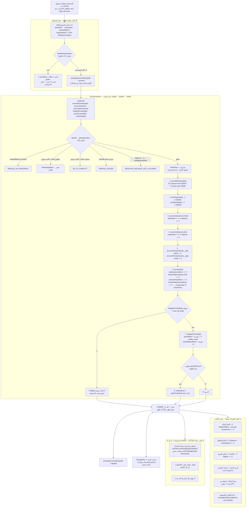

# خريطة الوحدات والترابط بينها — رصيد | RASEED

> **المسار:** `docs/design/06-module-map.md`
> **الحالة:** مسوّدة تصميم مُقترحة للاعتماد. **لا كود تطبيقي، لا مشروع npm، لا لمس Firebase.**
> **المرجع الأعلى:** `docs/00-REQUIREMENTS.md` ثم `docs/01-OWNER-DECISIONS.md` (ق-1، ق-2، ق-3).
> **العقد المُلزِم:** `docs/design/01-financial-core.md`. كل ما في هذه الوثيقة **تابع** له.
> حيث وجدت ثغرة في العقد تخصّ التكامل، **ذكرتها ولم أغيّرها** — القسم 17 يجمعها كلها.
> **لا تُقرأ** `core-A.md` / `core-B.md` / `core-C.md`: أرشيف تقييم لا مرجع تنفيذي.

---

## 0. ملخص تنفيذي

هذه الوثيقة تجيب على سؤال واحد: **عندما يكتب المستخدم رقماً واحداً، ما الذي يتغيّر بالضبط، وبأي ترتيب،
ولماذا لا يتضاعف؟** والجواب يقوم على ثلاثة عشر قراراً:

| # | القرار | المرجع |
|---|---|---|
| **ق-خ-1** | **لا مُجمَّع يَجمع رقماً عاماً مع رقم مشتق منه.** كل مُجمَّع في النظام مُصنَّف صراحةً: **بُعد تجزيء (partition)** يُجمع، أو **مجموع فرعي (subset)** يُقرأ ولا يُجمع. هذا هو الحاجز الوحيد ضد الازدواج في التقارير | §2 |
| **ق-خ-2** | **مصروف المنزل سطر واحد في الدفتر ووسم واحد** (`tags ∋ 'household'`)، لا شجرة موازية ولا قيد ثانٍ. `periods.householdExpenseMinor` **مجموع فرعي** محكوم بالثابت I15 (`≤ totalExpenseMinor`) | §5 |
| **ق-خ-3** | **كل مصروف يحمل وسم نطاق واحد بالضبط** من مجموعة مغلقة `{personal, household}`، افتراضه `personal`. فيصبح `personalExpense = totalExpense − householdExpense` **مشتقاً لا مخزَّناً**، والتجزيء كامل وقابل للفحص | §5.2 |
| **ق-خ-4** | **ميزانية المنزل = مستند سقف فقط** (`householdBudgets/{pk}` بـ `limitMinor` بلا `spentMinor`)، والمصروف الفعلي يُقرأ من `periods.householdExpenseMinor`. **صفر كتابات على المسار الساخن ⇒ صفر سطح انحراف جديد**، ولا خرق للثابت I16 | §5.4 |
| **ق-خ-5** | **الالتزام توقّع، والدين مديونية قائمة.** الفارق **بنيوي لا وصفي**: الالتزام **لا يولّد قيداً** عند الإنشاء (R4)، والدين **يولّد قيداً** وله **حساب خصوم/أصل حقيقي** في الشجرة (R6) | §6 |
| **ق-خ-6** | **الجسر التزام ← دين لا يعمل تلقائياً أبداً.** عملية صريحة بقرار المستخدم (`convertObligationToDebt`) تُنشئ الاستحقاق بقيد R6(ب) **وتُغلق الالتزام في نفس المعاملة**، وإلا ظهر المبلغ مرتين في «إجمالي المستحق» | §6.4 |
| **ق-خ-7** | **الاقتراض ليس دخلاً والإقراض ليس مصروفاً — بنيوياً لا شرطياً.** لا حساب `income` في قيد الاقتراض ولا حساب `expense` في قيد الإقراض، والتقرير دالّة في **نوع الحساب** (R11) ⇒ **لا شرط استبعاد في أي تقرير** | §7 |
| **ق-خ-8** | **النقد المتاح ≠ صافي الثروة، ولا يُجمعان في رقم واحد أبداً.** `netWorth` **من الدفتر وحده**؛ **الالتزامات المستقبلية غير المستحقة لا تُطرح منه** — تُعرض في مؤشر توقّع منفصل مُوسوم «توقّع» | §8 |
| **ق-خ-9** | **الادخار افتراضياً تخصيص دفتري** (`virtualEarmark`) لأن المال موجود فعلاً في حساب قائم؛ و**الحجز تحذير لا منع** (ADR-017). المنع الصلب موجود أصلاً وهو `minBalanceMinor` — من أراد قفلاً حقيقياً رفع أرضية الحساب | §9 |
| **ق-خ-10** | **الزكاة: الاحتساب والدفع منفصلان تماماً.** الاحتساب قيد `zakatAccrual` (`Dr equity.unallocated / Cr liability.zakat`) **لا يمسّ النقد**، والدفع يُطفئ الخصم. والوعاء **لقطة مخزَّنة في سجل الزكاة** لا حساب لحظي | §10 |
| **ق-خ-11** | **المهمة عمل، والتذكير جدولة، والتنبيه أثر.** ثلاث مجموعات لا تتبادل الأدوار، والمهام المولَّدة من التزام لها **معرّف حتمي** `task:obl:{obligationId}` ⇒ **استحالة التكاثر** | §11 |
| **ق-خ-12** | **لا ناقل أحداث زمن تشغيل (event bus) في الطبقة المالية.** الأحداث على مستويين: **(1) آثار داخل المعاملة** جزء من `WritePlan` (ليست أحداثاً، بل كتابات حتمية)، **(2) مُستجيبات بعد الـ commit** لا تكتب رقماً مالياً أبداً، وكلها **متكرّرة بأمان بمعرّف حتمي** | §12 |
| **ق-خ-13** | **لا شاشة بلا مصدر بيانات محدَّد ولا رقم بلا محدِّد (selector).** §14 يذكر لكل تقرير مصدره بالاسم وتكلفته بالقراءات | §14 |

**أخطر ما كشفته هذه الوثيقة** (تفصيله في §17، وكلها **ثغرات في العقد لا مخالفات له**):

1. **خمس وحدات من المتطلبات لا تعمل إطلاقاً** على القواعد كما هي في §14.3: `notes`, `tasks`,
   `reminders`, `worshipRecords`, `quranProgress`, `zakatRecords` — **لا `match` لها** ⇒ المنع الافتراضي
   ⇒ `permission-denied` عند أول كتابة. وهذا **نفس العيب ع-أ-9** الذي أُصلح للمجموعات المالية ولم يُصلح لهذه.
2. **أول مصروف في أي شهر جديد قد يفشل** من قاعدة `periods`: القاعدة تقرأ
   `request.resource.data.householdExpenseMinor` بينما §12.1 **لا تكتب الحقل** إن لم يكن المصروف منزلياً
   ⇒ المستند الجديد بلا الحقل ⇒ تقييم الشرط على حقل غائب. الحل المقترح: دلتا الفترة تحمل **كل** الحقول
   الرقمية دائماً (0 لغير الملموس).
3. **الالتزام المحوَّل إلى دين يظهر مرتين**: `obligations` بلا حالة `converted`، ومحدِّد لوحة التحكم في
   §5.3 (`where remainingMinor > 0`) **لا يستثني `cancelled`**.
4. **تعارض في مسار دفع الزكاة**: R11 يصنّف «دفع زكاة» مصروفاً على `expense.charity`، بينما
   `zakatAccrual` أنشأ خصماً على `liability.zakat`. تطبيق الاثنين معاً = **خصم لا يُطفأ أبداً + مصروف
   مزدوج اقتصادياً**.

---

## 1. كيف تُقرأ هذه الوثيقة

| القسم | ما فيه | من يقرؤه |
|---|---|---|
| 2 | القاعدة الأم للتكامل (بُعد تجزيء / مجموع فرعي) | الجميع — قبل أي شيء |
| 3 | الجدول الشامل: كل وحدة تقرأ/تكتب/تؤثّر + مصفوفة ملكية الكتابة | كل مطوّر وحدة |
| 4 | تدفق الأثر الكامل لتسجيل مصروف واحد (Mermaid + جدول ترتيب) | `domain/ops` + `data/ledger` |
| 5 | الازدواج المنزلي — القاعدة الحاسمة والمواضع الخمسة | التقارير + الميزانيات |
| 6 | التزام مقابل دين + الجسر بينهما | الالتزامات + الديون |
| 7 | الاقتراض والإقراض | الديون + التقارير |
| 8 | صافي الثروة مقابل النقد المتاح بالمعادلات | لوحة التحكم |
| 9 | الأهداف والادخار | الأهداف |
| 10 | الزكاة | العبادات |
| 11 | المهام/التذكيرات/التنبيهات | التنظيم الشخصي |
| 12 | كتالوج الأحداث الداخلية الكامل | الجميع |
| 13 | المفكرة والعبادات | التنظيم الشخصي |
| 14 | التقارير: كل رقم ومصدره | التقارير |
| 15 | الإعدادات وأثر كل مفتاح | الإعدادات |
| 16 | ثوابت التكامل M-I1…M-I14 + الاختبارات | الاختبارات |
| 17 | ثغرات العقد وما يحتاج قرار المالك | المالك |

**اصطلاحات ثابتة:**

- `X` = مبلغ بالدرهم الليبي، عدد صحيح موجب. `pk` = `periodKey` = `'YYYY-MM'`.
- **«✗»** = **لا أثر**، وهو نفي **مقصود ومُختبَر** لا سكوت.
- أي اسم مجموعة أو حقل أو دالة بالإنجليزية = **اسمه النهائي في الكود**.
- **〔جديد〕** = مجموعة/حقل **غير موجود في `01-financial-core.md`** ⇒ يحتاج ADR وموافقة المالك
  قبل التنفيذ. كل ما وُسم بهذا الوسم مجموع في §17.
- **〔تابع〕** = موجود في العقد، أُعيد ذكره هنا للربط فقط، **بلا إعادة تعريف**.

---

## 2. القاعدة الأم للتكامل: بُعد تجزيء أم مجموع فرعي؟

**كل مشاكل «الرقم يظهر مرتين» في أنظمة المصروفات ترجع إلى سبب واحد:** مُجمَّع أُضيف إلى النظام
بلا جواب على سؤال واحد.

> **السؤال الإلزامي قبل إضافة أي حقل مُجمَّع:**
> هل هذا الحقل **بُعد تجزيء** (partition) — أي أن مجموع إخوته يساوي الكل بالضبط ولا تتقاطع —
> أم **مجموع فرعي** (subset) — أي أنه جزء من رقم آخر موجود؟

| التصنيف | الخصيصة الرياضية | قاعدة الاستخدام | الثابت المرافق | أمثلة في «رصيد» |
|---|---|---|---|---|
| **بُعد تجزيء** | `Σ الإخوة === الكل`، والتقاطع فارغ | **يُجمع** في التقارير | ثابت **مساواة** | `expenseByCategory[*]` (I14)، `incomeBySource[*]` (I14)، `budgetPeriods.categories[*].spentMinor` (I16) |
| **مجموع فرعي** | `الحقل ≤ الكل`، وقد يتقاطع مع أبعاد أخرى | **يُقرأ ويُعرض، ولا يُجمع مع أي رقم آخر أبداً** | ثابت **≤** | `periods.householdExpenseMinor` (I15)، `periods.financingPaidMinor ⊂ obligationPaidMinor`، `account.earmarkedMinor ⊂ balanceMinor` |
| **محيَّد (neutral)** | لا يدخل الدخل ولا المصروف إطلاقاً | يُعرض للرقابة فقط | — | `transferVolumeMinor`, `borrowedMinor`, `repaidMinor`, `lentMinor`, `collectedMinor` |
| **تصحيح فترة سابقة** | دلتا موقَّعة لفترة مُقفلة | **سطر منفصل في التقرير، لا يُخلط بنشاط الفترة** | I9 | `priorPeriodExpenseCorrectionMinor`, `priorPeriodIncomeCorrectionMinor` |

**جدول التصنيف الكامل لكل حقل مُجمَّع في النظام** — هذا الجدول هو ما يُراجع عند كل ميزانية جديدة أو تقرير جديد:

| الحقل | التصنيف | الكل الذي ينتمي إليه | ثابته |
|---|---|---|---|
| `periods.totalExpenseMinor` | الكل | — | I14 |
| `periods.expenseByCategory[cat]` | بُعد تجزيء | `totalExpenseMinor` | I14 (مساواة) |
| `periods.householdExpenseMinor` | **مجموع فرعي** | `totalExpenseMinor` | **I15 (≤)** |
| `periods.totalIncomeMinor` | الكل | — | I14 |
| `periods.incomeBySource[s]` | بُعد تجزيء | `totalIncomeMinor` | I14 |
| `periods.obligationPaidMinor` | **مجموع فرعي عبر بُعدين** | جزء منه في `totalExpenseMinor` (nature=expense) وجزء خارجه تماماً (nature=financing) | **M-I3** |
| `periods.financingPaidMinor` | **مجموع فرعي** | `obligationPaidMinor` | **M-I4 (≤)** |
| `periods.transferVolumeMinor` | محيَّد | لا شيء | — |
| `periods.borrowedMinor` / `repaidMinor` / `lentMinor` / `collectedMinor` | محيَّد | لا شيء | — |
| `periods.netCashFlowMinor` | مشتق | — | I9 |
| `budgetPeriods.overallSpentMinor` | الكل | — | I16 |
| `budgetPeriods.categories[cat].spentMinor` | بُعد تجزيء | `overallSpentMinor` | I16 (مساواة) |
| `householdBudgets.limitMinor` 〔جديد〕 | **سقف مُدخَل مستخدم، لا مُجمَّع** | — | **لا شيء يُحسب منه** |
| `account.balanceMinor` | الكل لهذا الحساب | — | I3 |
| `account.earmarkedMinor` | **مجموع فرعي** | `balanceMinor` | I20، وعرضه `balance − earmarked` |
| `obligation.paidMinor` | الكل للالتزام | — | I5 / I5b |
| `debt.settledMinor` | الكل للدين | — | I6 / I6b |
| `goal.savedMinor` | مشتق | رصيد `equity.earmark.goal.{id}` | I21 |
| `zakatRecord.zakatBaseMinor` 〔جديد〕 | **لقطة مشتقة من الحسابات، لا مُجمَّع دفتري** | — | **M-I11** |

**البديل المرفوض:** «نكتفي بالمراجعة والانتباه». مرفوض لأن المصروف المنزلي **سيُطلب** يوماً بميزانية
مستقلة وبتقرير مستقل وببطاقة مستقلة في لوحة التحكم، وكل طلب من هذه يُضيف حقلاً. بلا تصنيف مكتوب،
ثالث حقل هو الذي يُدخل الازدواج، **ولا ثابت يكشفه** لأن المجموع يبقى «صحيحاً» داخل كل مستند على حدة.

---

## 3. الجدول الشامل للوحدات

### 3.1 مفتاح الجدول

- **تقرأ:** المجموعات التي تستعلمها الوحدة أو تستمع لها (`onSnapshot`).
- **تكتب:** ما **تملك** الوحدة الكتابة عليه. **كل كتابة مالية تمرّ عبر `postOperation` حصراً** —
  أي أن الوحدة لا تكتب مباشرة في `journalEntries` أو `accounts` أو أي مُجمَّع، بل **تطلب عملية**
  (`execute(req)`)، والعقد هو الذي يكتب. العمود يذكر ما يتغيّر **نتيجة** طلبها.
- **تتأثر:** الوحدات التي يتغيّر معروضها بسبب كتابة هذه الوحدة.
- **مالية؟** هل تستدعي الوحدة `execute()` بعملية مالية (⇒ قيد + معاملة ذرّية)؟

### 3.2 الجدول

| # | الوحدة | تقرأ | تكتب (تملكه أو تطلبه) | وحدات تتأثر بكتابتها | مالية؟ |
|---|---|---|---|---|---|
| 1 | **الحسابات** (مصادر الأموال) 〔تابع〕 | `accounts` (onSnapshot كامل)، `accountPeriods` للاتجاه، `journalEntries` للكشف، `settings/app` | `accounts` (إنشاء/تعديل اسم وأيقونة وترتيب و`minBalanceMinor`/أرشفة) + `auditLogs`؛ والأرصدة **لا تُكتب يدوياً أبداً** (`setOpeningBalance` / `adjustAccount` فقط) | لوحة التحكم، التقارير، المصروفات، الدخل، التحويلات، الالتزامات، الديون، الأهداف، الزكاة | نعم (الافتتاحي والتسوية) |
| 2 | **المصروفات** 〔تابع〕 | `accounts`, `categories`, `budgetPeriods/{pk}`, `periodLocks/{pk}`, `meta/integrity`, `journalEntries` (آخر 25 للتشابه) | `recordExpense` ⇒ `journalEntries` + `postings` + `accounts×2` + `accountPeriods×2` + `periods/{pk}` + `budgetPeriods/{pk}`(شرطي) + `notifications`(شرطي) | الحسابات، الميزانيات، مصاريف المنزل (إن موسوماً)، التقارير، التنبيهات، لوحة التحكم، الزكاة (الوعاء يتغير بتغيّر الرصيد) | **نعم** |
| 3 | **الدخل** 〔تابع〕 | `accounts`, `incomeSchedules`, `periodLocks`, `meta/integrity` | `recordIncome` ⇒ قيد + `accounts×2` + `accountPeriods×2` + `periods` + `incomeSchedules.occurrences[key]`(شرطي). و`incomeSchedules` (إنشاء/تعديل جدول الدخل المتوقع) | الحسابات، التقارير، لوحة التحكم، الأهداف (قدرة الادخار)، الزكاة | **نعم** |
| 4 | **التحويلات** 〔تابع〕 | `accounts` (الطرفان + `expense.fees`) | `transfer` ⇒ قيد بسطرين أو ثلاثة + `accounts×2..3` + `accountPeriods` + `periods.transferVolumeMinor` (+`totalExpenseMinor` بالعمولة وحدها) | الحسابات، التقارير (كحجم محيَّد)، **لا الدخل ولا المصروف** | **نعم** |
| 5 | **الفئات** 〔تابع〕 | `categories`, `accounts` (حساب المصروف المقابل)، `budgetPeriods` | `categories` + **إنشاء حساب `expense.{code}` مقابل 1:1** + `auditLogs`. **لا حذف — أرشفة فقط** | المصروفات (قائمة الاختيار)، الميزانيات (سقوف الفئات)، التقارير (`expenseByCategory`)، مصاريف المنزل (الفئات تحت `expense.home`) | لا (إنشاء الحساب بلا قيد) |
| 6 | **الالتزامات** 〔تابع〕 | `obligations`, `recurrences`, `contacts`, `categories`, `accounts`, `journalEntries where refs.obligationId==id` (سجل الدفعات) | `createObligation` (**بلا قيد — R4**)؛ `payObligation` ⇒ قيد + تحديث `obligation.{paidMinor,remainingMinor,paymentCount,status}`؛ `cancelObligation`؛ و`recurrences` (قالب التكرار) | الحسابات، الميزانيات (nature=expense فقط)، التقارير، التنبيهات، المهام (مهمة مولَّدة)، مصاريف المنزل (إن موسوماً)، الديون (عند التحويل) | **نعم** (الدفع فقط) |
| 7 | **الديون عليّ** (payable) 〔تابع〕 | `debts where direction=='payable'`, `contacts`, `accounts` (`liability.payable.*`)، سجل الدفعات من الدفتر | `createDebt` ⇒ قيد R6(أ/ب/ج) + `debts/{id}` + إنشاء `liability.payable.{contactId}` عند أول دين؛ `payDebt` ⇒ قيد + `debt.{settledMinor,remainingMinor,status}` | الحسابات، صافي الثروة، التقارير، التنبيهات، الزكاة (خصم الديون الحالّة)، **لا الدخل ولا الميزانية** | **نعم** |
| 8 | **الديون لي** (receivable) 〔تابع〕 | `debts where direction=='receivable'`, `contacts`, `accounts` (`asset.receivable.*`), `debts/{id}/followUps` | `createDebt` (`lend`) ⇒ قيد + حساب `asset.receivable.{contactId}`؛ `collectDebt`؛ `writeOffDebt` ⇒ `expense.baddebt`؛ و`followUps` (سجل المتابعات) | الحسابات، النقد المتاح (عند التحصيل)، صافي الثروة، التقارير، التنبيهات، الزكاة (الديون المرجوّة)، **لا الدخل** | **نعم** |
| 9 | **جهات الاتصال** 〔تابع〕 | `contacts`, `debts`, `obligations` (للربط العكسي) | `contacts` (إنشاء/تعديل/أرشفة). **لا حذف.** وإنشاء جهة **لا يُنشئ حساباً** — الحساب يُنشأ عند أول دين/التزام فعلي | الديون (الطرفان)، الالتزامات (الجهة المستفيدة)، التقارير حسب الجهة (`postings.contactId`) | لا |
| 10 | **مصاريف المنزل** | `journalEntries where tags array-contains 'household'`, `postings where tags array-contains 'household'` (للتجميع الخادمي)، `periods/{pk}.householdExpenseMinor`, `householdBudgets/{pk}` 〔جديد〕, `categories` | **لا تكتب أي رقم مالي إطلاقاً.** تكتب فقط `householdBudgets/{pk}.limitMinor` 〔جديد〕 (سقف) و`settings` العرض. **شاشة عرض متخصصة لا مصدر بيانات** | لا شيء مالياً. تغيير السقف يؤثر على التنبيهات ولوحة التحكم فقط | **لا** |
| 11 | **الميزانيات** 〔تابع〕 | `budgetPeriods/{pk}`, `periods/{pk}`, `categories`, `householdBudgets/{pk}` 〔جديد〕 | `budgetPeriods.{overallLimitMinor, categories[cat].limitMinor, alertAtPercent}` (**سقوف فقط**). `spentMinor` **تكتبه العمليات المالية وحدها** داخل معاملتها، ولا تلمسه شاشة الميزانية أبداً | لوحة التحكم (نسبة الاستهلاك)، التنبيهات، التقارير (الانحرافات) | لا (سقوف) |
| 12 | **الأهداف المالية** 〔تابع〕 | `financialGoals`, `accounts` (الحساب الداعم أو حساب الحجز)، `periods` (قدرة الادخار) | `financialGoals` (إنشاء/تعديل هدف)؛ `earmarkToGoal` ⇒ قيد `Dr equity.unallocated / Cr equity.earmark.goal.{id}` + `goal.savedMinor` + `account.earmarkedMinor` | الحسابات (`earmarkedMinor` ⇒ «المتاح للإنفاق»)، لوحة التحكم، التنبيهات، **لا النقد المتاح ولا صافي الثروة** | **نعم** (التخصيص) |
| 13 | **المفكرة** 〔جديد〕 | `notes`, `notebooks` 〔جديد〕, `tasks`, `financialGoals`, `obligations` (للربط الاختياري) | `notes` (إنشاء/تعديل/تثبيت/أرشفة)، `notebooks` | لا شيء مالياً. الربط يُظهر الملاحظة في شاشة الكيان المرتبط | لا |
| 14 | **المهام** 〔جديد〕 | `tasks`, `taskLists` 〔جديد〕, `obligations`, `debts`, `settings/app` | `tasks` (إنشاء/إكمال/تأجيل/إلغاء)، والمهام المولَّدة بمعرّف حتمي `task:obl:{obligationId}` | التنبيهات (مهمة متأخرة ⇒ تنبيه)، لوحة التحكم (مهام اليوم)، التقارير (الإنجازات) | لا |
| 15 | **التذكيرات** 〔جديد〕 | `reminders`, `obligations`, `debts`, `tasks`, `financialGoals`, `zakatRecords`, `settings/app` | `reminders` (قاعدة توقيت)، وتحديث `lastFiredKey` عند الإطلاق | التنبيهات **فقط** (التذكير لا يكتب شيئاً آخر) | لا |
| 16 | **التنبيهات** 〔تابع〕 | `notifications`, وكل الكيانات المُحال إليها | `notifications` (إنشاء بمعرّف حتمي، تعليم مقروء، حذف). **المجموعة الوحيدة غير المحاسبية القابلة للحذف مع `pendingCommands`** | لوحة التحكم (العدّاد)، لا شيء مالياً | لا |
| 17 | **العبادات** 〔جديد〕 | `worshipRecords`, `quranProgress`, `settings/app` (المدينة، طريقة الحساب) | `worshipRecords` (صلاة/ذكر/صيام/صدقة غير مالية)، `quranProgress` | التنبيهات (تذكيرات اختيارية)، التقارير (متابعة العبادات). **لا أثر مالي إطلاقاً** | لا |
| 18 | **الزكاة** 〔جديد للسجل، تابع للقيد〕 | `accounts` (الأرصدة والمستحقات والخصوم)، `debts`, `zakatRecords` 〔جديد〕, `settings/app` | `zakatRecords` (لقطة الوعاء والنصاب والحول والنتيجة)؛ `accrueZakat` ⇒ قيد `zakatAccrual`؛ `payZakat` ⇒ قيد إطفاء الخصم | الحسابات (عند الدفع)، صافي الثروة (عند الاحتساب: خصم ↑)، التقارير، التنبيهات (حلول الحول) | **نعم** (الاحتساب والدفع) |
| 19 | **التقارير** 〔تابع〕 | **كل شيء، وتكتب لا شيء**: `periods`, `accountPeriods`, `accounts`, `journalEntries`, `postings` (تجميع خادمي)، `obligations`, `debts`, `budgetPeriods`, `financialGoals`, `tasks`, `worshipRecords` | `auditLogs { action:'dataExported' }` عند التصدير فقط | لا شيء | لا |
| 20 | **الإعدادات** 〔تابع〕 | `settings/app`, `settings/dashboard`, `meta/schema`, `meta/integrity` | `settings/*` + أدوات السلامة (`runReconciliation`, `rebuildProjections`, `exportAllJson`) + `periodLocks` (الإقفال) | **كل الوحدات** (العرض، التنبيهات، بداية الشهر المالي كمحور تقرير، الحسابات الافتراضية). و`rebuildProjections` **يُجمّد كل الوحدات المالية** | غير مباشر |

### 3.3 مصفوفة ملكية الكتابة — من يكتب في كل مجموعة

**هذه المصفوفة هي ما يُفرض بأداة البناء (B1…B10 في §21 من العقد)، وأي خرق لها = عيب يُسقط البناء.**

| المجموعة | الكاتب الوحيد المسموح | ممنوع عليه الكتابة |
|---|---|---|
| `journalEntries`, `postings` | `data/ledger/postOperation.ts` حصراً (+ `rebuild.ts` للقراءة فقط) | **كل شيء آخر، بلا استثناء** |
| `accounts.{debitTotalMinor, creditTotalMinor, balanceMinor, earmarkedMinor, entryCount, balanceVersion}` | `postOperation` + `data/ledger/rebuild.ts` | شاشة الحسابات، الإعدادات، أي مُستجيب |
| `accounts.{name, icon, sortOrder, status, minBalanceMinor, notes}` | شاشة الحسابات (بـ `auditLogs` لـ `minBalanceMinor`) | `postOperation` |
| `accountPeriods`, `periods` | `postOperation` + `rebuild.ts` | الجميع |
| `budgetPeriods.*.limitMinor`, `overallLimitMinor`, `alertAtPercent` | شاشة الميزانيات | `postOperation` (**يقرؤها ولا يكتبها**) |
| `budgetPeriods.*.spentMinor`, `overallSpentMinor`, `alertFiredAtPercent` | `postOperation` + `rebuild.ts` | شاشة الميزانيات |
| `obligations.{totalMinor, dueDate, nature, categoryId, priority, name}` | شاشة الالتزامات | `postOperation` |
| `obligations.{paidMinor, remainingMinor, paymentCount, lastPaymentEntryId, extraChargesMinor}` | `postOperation` + `rebuild.ts` | شاشة الالتزامات |
| `obligations.status`, `statusComputedFor` | `postOperation` + مهمة تحديث الحالات اليومية (`writeBatch`) + `rebuild.ts` | الواجهة |
| `debts.{settledMinor, remainingMinor, writtenOffMinor, settlementCount, status}` | `postOperation` + `rebuild.ts` | شاشة الديون |
| `debts/{id}/followUps` | شاشة الديون لي | `postOperation` |
| `financialGoals.savedMinor`, `status` | `postOperation` + `rebuild.ts` | شاشة الأهداف |
| `financialGoals.{name, targetMinor, targetDate, mode}` | شاشة الأهداف | `postOperation` |
| `householdBudgets.limitMinor` 〔جديد〕 | شاشة مصاريف المنزل | **لا أحد غيرها — ولا `postOperation`** |
| `notifications` | مُستجيبات ما بعد الـ commit + `postOperation` (التنبيهات داخل `WritePlan`) | — |
| `tasks` | شاشة المهام + مُولِّد المهام (`reactors/taskFromObligation.ts`) | `postOperation` |
| `reminders` | شاشة التذكيرات + مُشغِّل الاستدراك (`lastFiredKey` فقط) | `postOperation` |
| `zakatRecords` 〔جديد〕 | شاشة الزكاة + `postOperation` (ربط `entryId` عند الاحتساب والدفع) | — |
| `notes`, `notebooks`, `worshipRecords`, `quranProgress` 〔جديد〕 | شاشاتها | `postOperation` |
| `meta/integrity` | التهيئة + `rebuild.ts` + `reconcile.ts` **فقط** | **المسار الساخن — لا يُكتب مع أي عملية (ADR-016)** |
| `periodLocks` | شاشة الإعدادات (إقفال نهائي، لا تعديل ولا حذف) | — |
| `pendingCommands` | `data/outbox/*` | — |

---

## 4. مخطط تدفق الأثر — تسجيل مصروف واحد

### 4.1 المخطط



### 4.2 جدول الترتيب الدقيق — ماذا يتحدّث، بأي ترتيب، وبأي أسلوب كتابة

| # | الكيان | التغيير الدقيق | أسلوب الكتابة | لماذا هذا الترتيب | شرطي؟ |
|---|---|---|---|---|---|
| 0أ | — | `opId` + `bookedAt` + `periodKey` + `payloadHash` + `deviceId` | حساب قبل المعاملة | `decide` **نقية**: لا `Date.now()` ولا `randomUUID()` داخل معاملة تُعاد 5 مرات | لا |
| 0ب | `pendingCommands/{opId}` | `status: 'queued'` | `setDoc` (يُطابَر دون اتصال) | الوحيد الذي ينجح بلا اتصال؛ و**مستبعد من كل رصيد وتقرير** | لا |
| 1 | `journalEntries/{opId}` | إنشاء القيد بسطرين: `Dr expense.{cat} X` / `Cr asset.{A} X` | `create` (يفشل إن وُجد) | **المصدر الوحيد للحقيقة.** كل ما بعده مشتق منه | لا |
| 2 | `postings/{opId}__1`, `__2` | `signedAmountMinor = +X` و`−X`؛ `settlementDeltaMinor = 0` | `create` | يفتح التجميع الخادمي بقراءتين لأي بُعد | لا |
| 3 | `accounts/{expense.cat}` | `debitTotalMinor += X` ⇒ `balanceMinor += X`، `entryCount += 1`, `balanceVersion += 1`, `lastEntryId`, `lastPostedAt` | قراءة + `increment` | `balanceMinor` **مفروض بالقاعدة** أنه مشتق من الإجماليين (I3) | لا |
| 4 | `accounts/{asset.A}` | `creditTotalMinor += X` ⇒ `balanceMinor −= X` + نفس حقول التتبع | قراءة + `increment` | القراءة إلزامية لفحص `minBalanceMinor` **داخل** المعاملة | لا |
| 5 | `accountPeriods/{cat}__{pk}` و`{A}__{pk}` | `debitMinor`/`creditMinor` و`netMinor` و`entryCount` | `set(merge)` + `increment` | **حركة فقط** — لا أرصدة مخزونية (ADR-009) | لا |
| 6 | `periods/{pk}` | `totalExpenseMinor += X`، `expenseByCategory.{cat} += X`، `netCashFlowMinor −= X`، `entryCount += 1`، `lastEntryAt`، **و`householdExpenseMinor += X` إن `tags ∋ 'household'`** | `set(merge)` + `increment` | لا قرار يعتمد على النتيجة ⇒ `increment` آمن وأرخص | لا |
| 7 | `budgetPeriods/{pk}` | `categories[cat].spentMinor = مقروء + X`، `overallSpentMinor = مقروء + X` | **قراءة + قيمة مطلقة** | **تنبيه العتبة يقرأ النتيجة داخل المعاملة** ⇒ `increment` الأعمى يُنتج تنبيهات مكرّرة | **نعم: يُحذف كاملاً إن لم يوجد المستند أو لم توجد الفئة فيه** |
| 8 | `notifications/{autoId}` | إشعار تجاوز العتبة + `alertFiredAtPercent = pct` | `create` داخل نفس المعاملة | منع تكرار التنبيه مشروط بقراءة النتيجة | **نعم** |
| — | **COMMIT** | — | — | **لا قارئ يرى حالة جزئية إطلاقاً** | — |
| 9 | `pendingCommands/{opId}` | `status: 'applied'` | بعد تأكيد النجاح | «لا تُعتبر العملية محفوظة إلا بعد تأكيد الكتابة» (المتطلبات §22) | لا |
| 10 | مُستجيبات | تنبيه ميزانية المنزل، تنبيه قرب الهدف | بعد الـ commit، بمعرّف حتمي | **لا رقم مالي**، ولا أثر على أي مُجمَّع | نعم |

### 4.3 ملاحظة ذرّية إلزامية

> الترتيب أعلاه هو **ترتيب `WritePlan` المنطقي**، لا ترتيب زمني يراه أحد.
> كل الخطوات 1→8 في **معاملة واحدة**: لا توجد لحظة يرى فيها المستخدم (أو جهاز آخر) قيداً بلا رصيد،
> أو رصيداً بلا ميزانية، أو ميزانية بلا تنبيه. **ولهذا لا حاجة إلى أي «معالجة حالة وسطى» في الواجهة.**
> الحالة الوحيدة الوسطى في النظام كله هي `pendingCommands` — **وهي معروضة بوسم مختلف ومستبعدة من كل رقم.**

### 4.4 الحالة المنزلية — نفس التدفق بفرق واحد

| الفرق | التفصيل |
|---|---|
| القيد | **نفسه حرفياً**. لا سطر إضافي، لا حساب إضافي، لا قيد ثانٍ |
| الوسم | `tags: ['household']` بدل `['personal']` |
| الخطوة 6 | يُضاف حقل واحد: `householdExpenseMinor += X` |
| الخطوات 1–5 و7–8 | **بلا أي تغيير** — الميزانية العامة وميزانية الفئة تُستهلكان **كما في أي مصروف** |
| المُستجيب 10 | يُفحص سقف `householdBudgets/{pk}` (مشتق من `periods.householdExpenseMinor`) |
| إجمالي المصروفات | `+X` **مرة واحدة** — وهذا جوهر §5 |

### 4.5 ما لا يتأثر — نفي مقصود ومُختبَر

| الكيان | لماذا ✗ |
|---|---|
| `obligations` | المصروف الحرّ لا يرتبط بالتزام. ولو ارتبط (`refs.obligationId`) فهي عملية أخرى: `payObligation` (R5) |
| `debts` | لا طرف مديونية في القيد |
| `financialGoals`, `account.earmarkedMinor` | التخصيص عملية مستقلة في حقوق الملكية. المصروف **يقلّل «المتاح للإنفاق» بالقراءة** (`balance − earmarked`) **ولا يكتب `earmarkedMinor`** |
| `meta/integrity` | ADR-016 — لا كتابة على المسار الساخن مطلقاً |
| `periods.totalIncomeMinor` | لا حساب `income` في القيد ⇒ **استحالة بنيوية** |
| `periods.transferVolumeMinor` / `borrowedMinor` / … | أنواع مختلفة من العمليات |
| `zakatRecords` | **لا تحديث تلقائي للوعاء أبداً.** الوعاء **لقطة** تُحسب عند طلب المستخدم (§10.4) |
| `tasks`, `reminders` | مصروف حرّ لا يولّد عملاً ولا جدولة |
| `auditLogs` | دفتر القيود **هو** سجل التدقيق. `auditLogs` لما لا يمرّ عبر القيود فقط |

---

## 5. مشكلة الازدواج في التقارير — مصاريف المنزل

### 5.1 التمثيل المعتمد

العقد حَسَم التمثيل (§3.5 و§4.3 منه): الطبيعة المنزلية **وسم على القيد** `tags: ['household']`،
مع فئات فرعية تحت `expense.home`. وشاشة المنزل **استعلام مُصفّى على نفس القيود**.

> **المهمة وصفت الوسم بـ `scope=household`. هذا هو المعنى، وتطبيقه في العقد هو `tags`**، لأن
> `JournalEntry` **لا يحتوي حقل `scope`** وإضافته تعني تعديل واجهة في العقد — وهو محرَّم.
> لذلك: **المفهوم `scope`، والتطبيق `tags`.**

### 5.2 قرار مكمّل: وسم نطاق **واحد بالضبط** على كل قيد مصروف

```ts
// domain/rules/scope.ts  〔جديد — سلوك نطاق لا تغيير مخطط〕
export const SCOPE_TAGS = ['personal', 'household'] as const;
export type ScopeTag = typeof SCOPE_TAGS[number];

/**
 * ثابت M-I1: كل قيد يمسّ حساب expense يحمل **وسم نطاق واحداً بالضبط**.
 * الافتراضي 'personal' يُضاف في planOperation إن لم يختر المستخدم شيئاً.
 * يُرفض: صفر وسوم نطاق، أو أكثر من واحد.
 */
export function assertSingleScopeTag(tags: readonly string[]): Result<void, DomainError>;

/** قاعدة الاتساق M-I2: أي فئة تحت شجرة expense.home تفرض الوسم household تلقائياً. */
export function enforceHomeCategoryScope(
  categoryAccountCode: string, tags: readonly string[]
): string[];
```

| القرار | البدائل المرفوضة | سبب الرفض |
|---|---|---|
| **وسم نطاق واحد إلزامي من مجموعة مغلقة** | **(أ) الوسم اختياري** | مصروف بلا وسم ليس شخصياً ولا منزلياً ⇒ `personal = total − household` **كذب**، وتقرير «الشخصي» يحتوي المجهول. والتجزيء ينكسر |
| | **(ب) حقل `scope` منفصل على القيد** | يعدّل `JournalEntry` في العقد — محرَّم. وبلا فائدة: الوسم مفهرس (`tags array-contains`) ويعمل في `postings` أيضاً |
| | **(ج) الاستدلال من الفئة وحدها** (كل ما تحت `expense.home` منزلي) | **يخسر الحالة الأكثر شيوعاً**: شراء طعام للمنزل بفئة «الطعام والمشروبات». فتظهر مصاريف المنزل أقل من الحقيقة بلا أي خطأ ظاهر |
| | **(د) شجرة فئات منزلية موازية** (`expense.household.food` مقابل `expense.food`) | يُضاعف عدد الفئات، ويُفسد `expenseByCategory` كبُعد تجزيء (الطعام في بندين)، ويُجبر كل تقرير فئوي على الجمع يدوياً ⇒ **عين الازدواج** |
| **الفئة تفرض الوسم، لا العكس** | الوسم يفرض الفئة | المستخدم قد يوسم مصروف صيانة بفئة «المشتريات» منزلياً — مشروع. لكن فاتورة كهرباء المنزل (`expense.home.utilities`) **لا يمكن** أن تكون شخصية ⇒ الاتجاه أحادي ومُبرَّر |

**النتيجة المشتقة التي لا تُخزَّن أبداً:**

```ts
// domain/selectors/expense.ts
export const personalExpenseMinor = (p: PeriodSummary): Minor =>
  subMinor(p.totalExpenseMinor as Minor, p.householdExpenseMinor as Minor);
// ثابت M-I5: personalExpenseMinor >= 0 دائماً (نتيجة مباشرة لـ I15)
```

### 5.3 القاعدة الحاسمة

> ### القاعدة الحاسمة لمنع الازدواج المنزلي
>
> **١. المصروف المنزلي قيد واحد.** لا قيد ثانٍ، لا سطر ثالث، لا حساب مرآة، لا مستند مواز.
> «مصاريف المنزل» **ليست مصدر بيانات**، بل **عدسة قراءة** على `journalEntries`/`postings`.
>
> **٢. `periods.householdExpenseMinor` مجموع فرعي (subset) لا بُعد تجزيء.** يُقرأ ويُعرض،
> **ولا يُجمع مع أي رقم آخر في أي معادلة في النظام، إطلاقاً.** ثابته `≤` لا `=` (I15)،
> **ومفروض من الخادم** في قاعدة `periods`.
>
> **٣. كل مصروف يستهلك الميزانية العامة وميزانية فئته مرة واحدة، بصرف النظر عن نطاقه.**
> الوسم `household` **لا يغيّر أي رقم ميزانية**، ولا يُنشئ استهلاكاً ثالثاً.
>
> **٤. «ميزانية المنزل» سقف مُقارن بمجموع فرعي قائم، لا مُجمَّع جديد.** لا تُخزَّن لها
> `spentMinor` ولا تُكتب على المسار الساخن ⇒ **لا يوجد رقم ثالث يمكن أن ينحرف.**
>
> **٥. إجمالي المصروفات يأتي من حقل واحد فقط: `periods.totalExpenseMinor`.**
> **يُحرَّم** في أي شاشة أو تقرير أو تصدير حساب الإجمالي بجمع «الشخصي + المنزلي»،
> أو بجمع «الفئات + المنزل»، أو بجمع «الميزانية العامة + ميزانية المنزل».
>
> **٦. اختبار القبول الحاسم:** على بيانات فيها مصاريف منزلية وشخصية وإلغاءات وتعديلات،
> يجب أن يصحّ **في وقت واحد**:
> `periods.totalExpenseMinor` = `Σ expenseByCategory[*]` = `sum(signedAmountMinor)` على
> `postings where accountType=='expense' && periodKey==pk` = `householdExpenseMinor + personalExpense`
> و`budgetPeriods.overallSpentMinor` = `Σ categories[*].spentMinor`.
> **تساوي الخمسة معاً هو البرهان الوحيد المقبول على عدم الازدواج.**

### 5.4 المواضع الخمسة بالتفصيل

| # | الموضع | المصدر الوحيد | ما يمنع الازدواج | ما كان سيحدث بلا القاعدة |
|---|---|---|---|---|
| **1** | **إجمالي المصروفات** (لوحة التحكم، التقرير الشهري، التدفق النقدي) | `periods/{pk}.totalExpenseMinor` **حقل واحد** | المصروف المنزلي يزيد `totalExpenseMinor` **مرة واحدة** تماماً كالشخصي. الوسم **حقل وصفي تجميعي إضافي**، لا مصروف إضافي | لو كان المنزل قيداً ثانياً (أو فئة موازية تُجمع) ⇒ مصروف 100 د.ل منزلي يظهر 200 د.ل في إجمالي الشهر ⇒ **صافي التدفق النقدي خاطئ ولا يطابق حركة الحسابات** |
| **2** | **تقرير المنزل** | تصفية بالوسم: `postings where tags array-contains 'household' && periodKey == pk` ⇒ `sum(signedAmountMinor)`؛ أو `periods.householdExpenseMinor` مباشرة (قراءة واحدة) | **التصفية بالوسم فقط، أبداً بالفئة.** والرقم الناتج **يساوي** `periods.householdExpenseMinor` (ثابت M-I6) ⇒ مصدران مستقلان لنفس الرقم، وأي اختلاف = انحراف يُكتشف | تصفية بالفئة (`expense.home`) تُسقط الطعام المنزلي؛ وتصفية بالوسم **و** الفئة معاً (`OR`) **تحسب المصروف المنزلي ذا الفئة المنزلية مرتين** |
| **3** | **الميزانية العامة** | `budgetPeriods/{pk}.overallSpentMinor` | الخطوة 7 في §4.2 تزيده `+X` **مرة واحدة لكل مصروف** — بلا أي شرط على النطاق | لو أُضيف «استهلاك ميزانية المنزل» إلى `overallSpentMinor` أيضاً ⇒ نسبة الاستهلاك تتجاوز 100% على إنفاق نصف السقف |
| **4** | **ميزانية الفئة** | `budgetPeriods.categories[cat].spentMinor` | المصروف يستهلك **فئته هي** فقط. و**I16 يفرض** `overallSpentMinor === Σ categories[*].spentMinor` ⇒ **أي سقف ثالث داخل `budgetPeriods` يخرق ثابتاً مفروضاً** | إدخال `categories['__household__']` ككيان شقيق ⇒ **I16 يختلّ فوراً** ⇒ إما تنبيه انحراف دائم، أو إسقاط I16 وخسارة الحاجز كله |
| **5** | **ميزانية المنزل** | `householdBudgets/{pk}.limitMinor` (سقف **فقط**) مقابل `periods.householdExpenseMinor` (فعلي قائم) | **لا `spentMinor` ⇒ لا كتابة ⇒ لا انحراف ممكن بنيوياً.** المقارنة تُحسب عند القراءة من رقمين موجودين أصلاً | أي `spentMinor` منزلي مخزَّن = **سطح انحراف سادس**، يجب أن يُحدَّث في نفس المعاملة، وأن يُعكس عند الإلغاء، وأن يُعاد بناؤه، وأن يُفحص بثابت جديد. مقابل **صفر فائدة**: الرقم موجود في `periods` |

**قرار ميزانية المنزل — والبدائل المرفوضة صراحةً:**

| البديل | الحكم | السبب |
|---|---|---|
| **سقف مستقل بلا `spentMinor`** في `householdBudgets/{pk}` 〔جديد〕 | **✅ المعتمد** | صفر كتابات على المسار الساخن، صفر سطح انحراف، صفر خرق للثوابت، والفعلي من `periods.householdExpenseMinor` بقراءة واحدة موجودة أصلاً |
| إضافة `scopes.household` إلى `budgetPeriods` | ❌ | يعدّل واجهة `BudgetPeriod` في العقد (محرَّم)، و**يخرق I16** إن دخل في `overallSpentMinor`، وإن لم يدخل فهو حقل مُجمَّع ساكن يحتاج ثابتاً خاصاً به |
| مجموعة `householdPeriods` بـ `spentMinor` تُحدَّث في نفس المعاملة | ❌ | كتابة عاشرة على كل مصروف منزلي، وسطح انحراف جديد، ويجب عكسه في `voidTransaction` و`editTransaction` وإعادة بناؤه — **مقابل رقم موجود** |
| اعتبار «المنزل» فئة في `categories` | ❌ | المنزل **ليس طبيعة إنفاق** بل **نطاق**: فاتورة الكهرباء والطعام والصيانة فئات مختلفة كلها منزلية. وجعله فئة يُفسد `expenseByCategory` كبُعد تجزيء |
| سقف منزلي **لكل فئة فرعية** داخل المنزل | ⏸ مؤجَّل | مفيد لاحقاً (مواد غذائية 300، تنظيف 80…)، لكنه يفتح مصفوفة (فئة × نطاق). يُبنى بنفس نمط «سقف فقط»: `householdBudgets/{pk}.categories[cat].limitMinor`، والفعلي من `sum` على `postings` بقراءتين. **لا يُنفَّذ في الإصدار الأول** |

```ts
// 〔جديد〕 users/{uid}/householdBudgets/{periodKey}
export interface HouseholdBudget {
  id: PeriodKey;
  ownerUid: string;
  schemaVersion: number;
  periodKey: PeriodKey;
  /** السقف الشهري المعتمد لمصاريف المنزل. مُدخَل مستخدم. */
  limitMinor: number;
  /** سقوف إرشادية لفئات منزلية — سقوف فقط، بلا أي spentMinor. */
  categories?: Record<string, { limitMinor: number }>;
  alertAtPercent: number;                 // 80 افتراضياً
  /** منع تكرار التنبيه: آخر عتبة أُطلقت. يُكتب من مُستجيب ما بعد الـ commit. */
  alertFiredAtPercent: number | null;
  notes?: string;
  updatedAt: Timestamp;
}

/**
 * **لا يوجد spentMinor — بقصد.** المصروف الفعلي يُقرأ:
 *   actualMinor = periods/{pk}.householdExpenseMinor
 *   remainingMinor = limitMinor − actualMinor          (قد يكون سالباً = تجاوز)
 *   utilizationBps = ratioBps(actualMinor, limitMinor)
 */
export function householdBudgetView(
  b: HouseholdBudget | null, p: PeriodSummary | null
): { limitMinor: Minor; actualMinor: Minor; remainingMinor: Minor; utilizationBps: Bps } | null;
```

**تنبيه ميزانية المنزل بلا تكرار وبلا كتابة في المعاملة:** لأن الرقم مشتق، لا يمكن فحص العتبة داخل
المعاملة (العقد لا يقرأ `householdBudgets` هناك). الحل **معرّف إشعار حتمي** بدل الفحص داخل المعاملة:

```
notificationId = `notif:hhBudget:${periodKey}:${thresholdPercent}`
```

فتشغيل المُستجيب خمسين مرة في اليوم ⇒ **إشعار واحد** (نفس منطق ADR-013/ADR-004: المفتاح هو الحارس،
لا المنطق التطبيقي). و`alertFiredAtPercent` يبقى للعرض ولضبط العتبة التالية.

### 5.5 الثوابت والاختبارات المرافقة

| # | الثابت | أين يُفرض |
|---|---|---|
| **M-I1** | كل قيد يمسّ حساب `expense` يحمل **وسم نطاق واحداً بالضبط** من `{personal, household}` | طبقة النطاق (`assertSingleScopeTag`) + اختبار |
| **M-I2** | كل قيد فئته تحت `expense.home` يحمل `household` | طبقة النطاق |
| **M-I5** | `periods.totalExpenseMinor − householdExpenseMinor >= 0` | نتيجة I15 (مفروض من الخادم) |
| **M-I6** | `periods.householdExpenseMinor === sum(signedAmountMinor)` على `postings where tags ∋ 'household' && accountType=='expense' && periodKey==pk` | الفاحص — **قراءتان** |
| **M-I7** | **لا مجموعة في النظام تحتوي حقلاً اسمه `*spentMinor` خارج `budgetPeriods`** | قاعدة ESLint مقترحة **B11** |

| الاختبار | المحتوى |
|---|---|
| **T-HH-1** | مصروف منزلي 100 ⇒ `totalExpenseMinor += 100` **و** `householdExpenseMinor += 100` **و** `overallSpentMinor += 100` **و** `categories[cat].spentMinor += 100`؛ وتساوي الخمسة في §5.3/٦ |
| **T-HH-2** | عشرة مصاريف مختلطة ⇒ `household + personal === total` بالضبط، و`M-I6` يصحّ |
| **T-HH-3** | إلغاء مصروف منزلي ⇒ **كل** الأرقام الخمسة تنقص بالضبط، و`householdExpenseMinor` لا يصير سالباً |
| **T-HH-4** | تعديل وسم من `personal` إلى `household` ⇒ `householdExpenseMinor` يتحدّث **في نفس المعاملة** (جدول 8.2 من العقد) و`totalExpenseMinor` **لا يتغيّر** |
| **T-HH-5** | مصروف منزلي بفئة غير منزلية (طعام) ⇒ يظهر في تقرير المنزل **وفي** `expenseByCategory.food`، ولا يُحسب مرتين في أي مجموع |
| **T-HH-6** | فئة تحت `expense.home` بلا وسم ⇒ الوسم يُضاف تلقائياً (M-I2) |
| **T-HH-7** | ميزانية منزل 500 ومصروف منزلي 410 ⇒ تنبيه واحد عند 80%؛ تشغيل المُستجيب 50 مرة ⇒ **إشعار واحد** بالمعرّف الحتمي |
| **T-HH-8** | دفع التزام منزلي `nature='expense'` موسوم `household` ⇒ `householdExpenseMinor += X`؛ وبـ `nature='financing'` ⇒ **لا يزيد** `householdExpenseMinor` ولا `totalExpenseMinor` |
