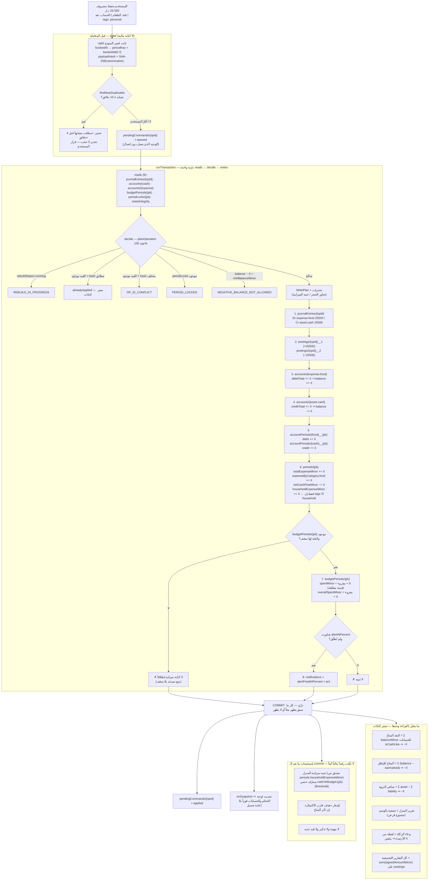
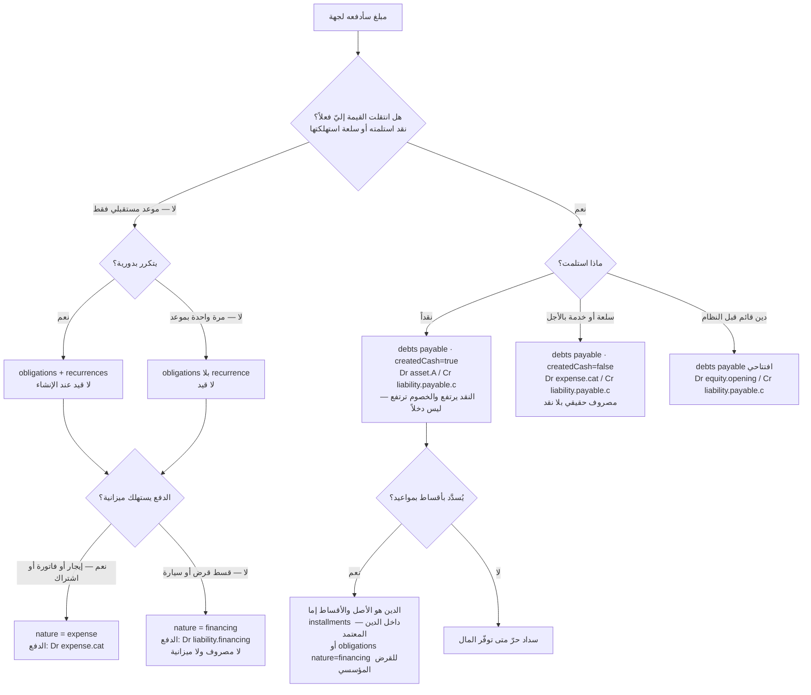
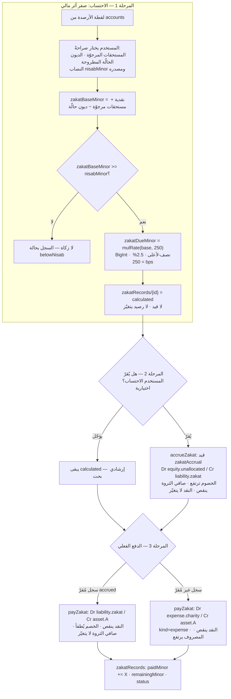

# خريطة الوحدات والترابط بينها — رصيد | RASEED

> **المسار:** `docs/design/06-module-map.md`
> **الحالة:** مسوّدة تصميم مُقترحة للاعتماد. **لا كود تطبيقي، لا مشروع npm، لا لمس Firebase.**
> **المرجع الأعلى:** `docs/00-REQUIREMENTS.md` ثم `docs/01-OWNER-DECISIONS.md` (ق-1، ق-2، ق-3).
> **العقد المُلزِم:** `docs/design/01-financial-core.md`. كل ما في هذه الوثيقة **تابع** له.
> حيث وجدت ثغرة في العقد تخصّ التكامل، **ذكرتها ولم أغيّرها** — القسم 17 يجمعها كلها.
> **لا تُقرأ** `core-A.md` / `core-B.md` / `core-C.md`: أرشيف تقييم لا مرجع تنفيذي.

---

## 0. ملخص تنفيذي

هذه الوثيقة تجيب على سؤال واحد: **عندما يكتب المستخدم رقماً واحداً، ما الذي يتغيّر بالضبط، وبأي ترتيب،
ولماذا لا يتضاعف؟** والجواب يقوم على ثلاثة عشر قراراً:

| # | القرار | المرجع |
|---|---|---|
| **ق-خ-1** | **لا مُجمَّع يَجمع رقماً عاماً مع رقم مشتق منه.** كل مُجمَّع في النظام مُصنَّف صراحةً: **بُعد تجزيء (partition)** يُجمع، أو **مجموع فرعي (subset)** يُقرأ ولا يُجمع. هذا هو الحاجز الوحيد ضد الازدواج في التقارير | §2 |
| **ق-خ-2** | **مصروف المنزل سطر واحد في الدفتر ووسم واحد** (`tags ∋ 'household'`)، لا شجرة موازية ولا قيد ثانٍ. `periods.householdExpenseMinor` **مجموع فرعي** محكوم بالثابت I15 (`≤ totalExpenseMinor`) | §5 |
| **ق-خ-3** | **كل مصروف يحمل وسم نطاق واحد بالضبط** من مجموعة مغلقة `{personal, household}`، افتراضه `personal`. فيصبح `personalExpense = totalExpense − householdExpense` **مشتقاً لا مخزَّناً**، والتجزيء كامل وقابل للفحص | §5.2 |
| **ق-خ-4** | **ميزانية المنزل = مستند سقف فقط** (`householdBudgets/{pk}` بـ `limitMinor` بلا `spentMinor`)، والمصروف الفعلي يُقرأ من `periods.householdExpenseMinor`. **صفر كتابات على المسار الساخن ⇒ صفر سطح انحراف جديد**، ولا خرق للثابت I16 | §5.4 |
| **ق-خ-5** | **الالتزام توقّع، والدين مديونية قائمة.** الفارق **بنيوي لا وصفي**: الالتزام **لا يولّد قيداً** عند الإنشاء (R4)، والدين **يولّد قيداً** وله **حساب خصوم/أصل حقيقي** في الشجرة (R6) | §6 |
| **ق-خ-6** | **الجسر التزام ← دين لا يعمل تلقائياً أبداً.** عملية صريحة بقرار المستخدم (`convertObligationToDebt`) تُنشئ الاستحقاق بقيد R6(ب) **وتُغلق الالتزام في نفس المعاملة**، وإلا ظهر المبلغ مرتين في «إجمالي المستحق» | §6.4 |
| **ق-خ-7** | **الاقتراض ليس دخلاً والإقراض ليس مصروفاً — بنيوياً لا شرطياً.** لا حساب `income` في قيد الاقتراض ولا حساب `expense` في قيد الإقراض، والتقرير دالّة في **نوع الحساب** (R11) ⇒ **لا شرط استبعاد في أي تقرير** | §7 |
| **ق-خ-8** | **النقد المتاح ≠ صافي الثروة، ولا يُجمعان في رقم واحد أبداً.** `netWorth` **من الدفتر وحده**؛ **الالتزامات المستقبلية غير المستحقة لا تُطرح منه** — تُعرض في مؤشر توقّع منفصل مُوسوم «توقّع» | §8 |
| **ق-خ-9** | **الادخار افتراضياً تخصيص دفتري** (`virtualEarmark`) لأن المال موجود فعلاً في حساب قائم؛ و**الحجز تحذير لا منع** (ADR-017). المنع الصلب موجود أصلاً وهو `minBalanceMinor` — من أراد قفلاً حقيقياً رفع أرضية الحساب | §9 |
| **ق-خ-10** | **الزكاة: الاحتساب والدفع منفصلان تماماً.** الاحتساب قيد `zakatAccrual` (`Dr equity.unallocated / Cr liability.zakat`) **لا يمسّ النقد**، والدفع يُطفئ الخصم. والوعاء **لقطة مخزَّنة في سجل الزكاة** لا حساب لحظي | §10 |
| **ق-خ-11** | **المهمة عمل، والتذكير جدولة، والتنبيه أثر.** ثلاث مجموعات لا تتبادل الأدوار، والمهام المولَّدة من التزام لها **معرّف حتمي** `task:obl:{obligationId}` ⇒ **استحالة التكاثر** | §11 |
| **ق-خ-12** | **لا ناقل أحداث زمن تشغيل (event bus) في الطبقة المالية.** الأحداث على مستويين: **(1) آثار داخل المعاملة** جزء من `WritePlan` (ليست أحداثاً، بل كتابات حتمية)، **(2) مُستجيبات بعد الـ commit** لا تكتب رقماً مالياً أبداً، وكلها **متكرّرة بأمان بمعرّف حتمي** | §12 |
| **ق-خ-13** | **لا شاشة بلا مصدر بيانات محدَّد ولا رقم بلا محدِّد (selector).** §14 يذكر لكل تقرير مصدره بالاسم وتكلفته بالقراءات | §14 |

**أخطر ما كشفته هذه الوثيقة** (تفصيله في §17، وكلها **ثغرات في العقد لا مخالفات له**):

1. **خمس وحدات من المتطلبات لا تعمل إطلاقاً** على القواعد كما هي في §14.3: `notes`, `tasks`,
   `reminders`, `worshipRecords`, `quranProgress`, `zakatRecords` — **لا `match` لها** ⇒ المنع الافتراضي
   ⇒ `permission-denied` عند أول كتابة. وهذا **نفس العيب ع-أ-9** الذي أُصلح للمجموعات المالية ولم يُصلح لهذه.
2. **أول مصروف في أي شهر جديد قد يفشل** من قاعدة `periods`: القاعدة تقرأ
   `request.resource.data.householdExpenseMinor` بينما §12.1 **لا تكتب الحقل** إن لم يكن المصروف منزلياً
   ⇒ المستند الجديد بلا الحقل ⇒ تقييم الشرط على حقل غائب. الحل المقترح: دلتا الفترة تحمل **كل** الحقول
   الرقمية دائماً (0 لغير الملموس).
3. **الالتزام المحوَّل إلى دين يظهر مرتين**: `obligations` بلا حالة `converted`، ومحدِّد لوحة التحكم في
   §5.3 (`where remainingMinor > 0`) **لا يستثني `cancelled`**.
4. **تعارض في مسار دفع الزكاة**: R11 يصنّف «دفع زكاة» مصروفاً على `expense.charity`، بينما
   `zakatAccrual` أنشأ خصماً على `liability.zakat`. تطبيق الاثنين معاً = **خصم لا يُطفأ أبداً + مصروف
   مزدوج اقتصادياً**.

---

## 1. كيف تُقرأ هذه الوثيقة

| القسم | ما فيه | من يقرؤه |
|---|---|---|
| 2 | القاعدة الأم للتكامل (بُعد تجزيء / مجموع فرعي) | الجميع — قبل أي شيء |
| 3 | الجدول الشامل: كل وحدة تقرأ/تكتب/تؤثّر + مصفوفة ملكية الكتابة | كل مطوّر وحدة |
| 4 | تدفق الأثر الكامل لتسجيل مصروف واحد (Mermaid + جدول ترتيب) | `domain/ops` + `data/ledger` |
| 5 | الازدواج المنزلي — القاعدة الحاسمة والمواضع الخمسة | التقارير + الميزانيات |
| 6 | التزام مقابل دين + الجسر بينهما | الالتزامات + الديون |
| 7 | الاقتراض والإقراض | الديون + التقارير |
| 8 | صافي الثروة مقابل النقد المتاح بالمعادلات | لوحة التحكم |
| 9 | الأهداف والادخار | الأهداف |
| 10 | الزكاة | العبادات |
| 11 | المهام/التذكيرات/التنبيهات | التنظيم الشخصي |
| 12 | كتالوج الأحداث الداخلية الكامل | الجميع |
| 13 | المفكرة والعبادات | التنظيم الشخصي |
| 14 | التقارير: كل رقم ومصدره | التقارير |
| 15 | الإعدادات وأثر كل مفتاح | الإعدادات |
| 16 | ثوابت التكامل M-I1…M-I14 + الاختبارات | الاختبارات |
| 17 | ثغرات العقد وما يحتاج قرار المالك | المالك |

**اصطلاحات ثابتة:**

- `X` = مبلغ بالدرهم الليبي، عدد صحيح موجب. `pk` = `periodKey` = `'YYYY-MM'`.
- **«✗»** = **لا أثر**، وهو نفي **مقصود ومُختبَر** لا سكوت.
- أي اسم مجموعة أو حقل أو دالة بالإنجليزية = **اسمه النهائي في الكود**.
- **〔جديد〕** = مجموعة/حقل **غير موجود في `01-financial-core.md`** ⇒ يحتاج ADR وموافقة المالك
  قبل التنفيذ. كل ما وُسم بهذا الوسم مجموع في §17.
- **〔تابع〕** = موجود في العقد، أُعيد ذكره هنا للربط فقط، **بلا إعادة تعريف**.

---

## 2. القاعدة الأم للتكامل: بُعد تجزيء أم مجموع فرعي؟

**كل مشاكل «الرقم يظهر مرتين» في أنظمة المصروفات ترجع إلى سبب واحد:** مُجمَّع أُضيف إلى النظام
بلا جواب على سؤال واحد.

> **السؤال الإلزامي قبل إضافة أي حقل مُجمَّع:**
> هل هذا الحقل **بُعد تجزيء** (partition) — أي أن مجموع إخوته يساوي الكل بالضبط ولا تتقاطع —
> أم **مجموع فرعي** (subset) — أي أنه جزء من رقم آخر موجود؟

| التصنيف | الخصيصة الرياضية | قاعدة الاستخدام | الثابت المرافق | أمثلة في «رصيد» |
|---|---|---|---|---|
| **بُعد تجزيء** | `Σ الإخوة === الكل`، والتقاطع فارغ | **يُجمع** في التقارير | ثابت **مساواة** | `expenseByCategory[*]` (I14)، `incomeBySource[*]` (I14)، `budgetPeriods.categories[*].spentMinor` (I16) |
| **مجموع فرعي** | `الحقل ≤ الكل`، وقد يتقاطع مع أبعاد أخرى | **يُقرأ ويُعرض، ولا يُجمع مع أي رقم آخر أبداً** | ثابت **≤** | `periods.householdExpenseMinor` (I15)، `periods.financingPaidMinor ⊂ obligationPaidMinor`، `account.earmarkedMinor ⊂ balanceMinor` |
| **محيَّد (neutral)** | لا يدخل الدخل ولا المصروف إطلاقاً | يُعرض للرقابة فقط | — | `transferVolumeMinor`, `borrowedMinor`, `repaidMinor`, `lentMinor`, `collectedMinor` |
| **تصحيح فترة سابقة** | دلتا موقَّعة لفترة مُقفلة | **سطر منفصل في التقرير، لا يُخلط بنشاط الفترة** | I9 | `priorPeriodExpenseCorrectionMinor`, `priorPeriodIncomeCorrectionMinor` |

**جدول التصنيف الكامل لكل حقل مُجمَّع في النظام** — هذا الجدول هو ما يُراجع عند كل ميزانية جديدة أو تقرير جديد:

| الحقل | التصنيف | الكل الذي ينتمي إليه | ثابته |
|---|---|---|---|
| `periods.totalExpenseMinor` | الكل | — | I14 |
| `periods.expenseByCategory[cat]` | بُعد تجزيء | `totalExpenseMinor` | I14 (مساواة) |
| `periods.householdExpenseMinor` | **مجموع فرعي** | `totalExpenseMinor` | **I15 (≤)** |
| `periods.totalIncomeMinor` | الكل | — | I14 |
| `periods.incomeBySource[s]` | بُعد تجزيء | `totalIncomeMinor` | I14 |
| `periods.obligationPaidMinor` | **مجموع فرعي عبر بُعدين** | جزء منه في `totalExpenseMinor` (nature=expense) وجزء خارجه تماماً (nature=financing) | **M-I3** |
| `periods.financingPaidMinor` | **مجموع فرعي** | `obligationPaidMinor` | **M-I4 (≤)** |
| `periods.transferVolumeMinor` | محيَّد | لا شيء | — |
| `periods.borrowedMinor` / `repaidMinor` / `lentMinor` / `collectedMinor` | محيَّد | لا شيء | — |
| `periods.netCashFlowMinor` | مشتق | — | I9 |
| `budgetPeriods.overallSpentMinor` | الكل | — | I16 |
| `budgetPeriods.categories[cat].spentMinor` | بُعد تجزيء | `overallSpentMinor` | I16 (مساواة) |
| `householdBudgets.limitMinor` 〔جديد〕 | **سقف مُدخَل مستخدم، لا مُجمَّع** | — | **لا شيء يُحسب منه** |
| `account.balanceMinor` | الكل لهذا الحساب | — | I3 |
| `account.earmarkedMinor` | **مجموع فرعي** | `balanceMinor` | I20، وعرضه `balance − earmarked` |
| `obligation.paidMinor` | الكل للالتزام | — | I5 / I5b |
| `debt.settledMinor` | الكل للدين | — | I6 / I6b |
| `goal.savedMinor` | مشتق | رصيد `equity.earmark.goal.{id}` | I21 |
| `zakatRecord.zakatBaseMinor` 〔جديد〕 | **لقطة مشتقة من الحسابات، لا مُجمَّع دفتري** | — | **M-I11** |

**البديل المرفوض:** «نكتفي بالمراجعة والانتباه». مرفوض لأن المصروف المنزلي **سيُطلب** يوماً بميزانية
مستقلة وبتقرير مستقل وببطاقة مستقلة في لوحة التحكم، وكل طلب من هذه يُضيف حقلاً. بلا تصنيف مكتوب،
ثالث حقل هو الذي يُدخل الازدواج، **ولا ثابت يكشفه** لأن المجموع يبقى «صحيحاً» داخل كل مستند على حدة.

---

## 3. الجدول الشامل للوحدات

### 3.1 مفتاح الجدول

- **تقرأ:** المجموعات التي تستعلمها الوحدة أو تستمع لها (`onSnapshot`).
- **تكتب:** ما **تملك** الوحدة الكتابة عليه. **كل كتابة مالية تمرّ عبر `postOperation` حصراً** —
  أي أن الوحدة لا تكتب مباشرة في `journalEntries` أو `accounts` أو أي مُجمَّع، بل **تطلب عملية**
  (`execute(req)`)، والعقد هو الذي يكتب. العمود يذكر ما يتغيّر **نتيجة** طلبها.
- **تتأثر:** الوحدات التي يتغيّر معروضها بسبب كتابة هذه الوحدة.
- **مالية؟** هل تستدعي الوحدة `execute()` بعملية مالية (⇒ قيد + معاملة ذرّية)؟

### 3.2 الجدول

| # | الوحدة | تقرأ | تكتب (تملكه أو تطلبه) | وحدات تتأثر بكتابتها | مالية؟ |
|---|---|---|---|---|---|
| 1 | **الحسابات** (مصادر الأموال) 〔تابع〕 | `accounts` (onSnapshot كامل)، `accountPeriods` للاتجاه، `journalEntries` للكشف، `settings/app` | `accounts` (إنشاء/تعديل اسم وأيقونة وترتيب و`minBalanceMinor`/أرشفة) + `auditLogs`؛ والأرصدة **لا تُكتب يدوياً أبداً** (`setOpeningBalance` / `adjustAccount` فقط) | لوحة التحكم، التقارير، المصروفات، الدخل، التحويلات، الالتزامات، الديون، الأهداف، الزكاة | نعم (الافتتاحي والتسوية) |
| 2 | **المصروفات** 〔تابع〕 | `accounts`, `categories`, `budgetPeriods/{pk}`, `periodLocks/{pk}`, `meta/integrity`, `journalEntries` (آخر 25 للتشابه) | `recordExpense` ⇒ `journalEntries` + `postings` + `accounts×2` + `accountPeriods×2` + `periods/{pk}` + `budgetPeriods/{pk}`(شرطي) + `notifications`(شرطي) | الحسابات، الميزانيات، مصاريف المنزل (إن موسوماً)، التقارير، التنبيهات، لوحة التحكم، الزكاة (الوعاء يتغير بتغيّر الرصيد) | **نعم** |
| 3 | **الدخل** 〔تابع〕 | `accounts`, `incomeSchedules`, `periodLocks`, `meta/integrity` | `recordIncome` ⇒ قيد + `accounts×2` + `accountPeriods×2` + `periods` + `incomeSchedules.occurrences[key]`(شرطي). و`incomeSchedules` (إنشاء/تعديل جدول الدخل المتوقع) | الحسابات، التقارير، لوحة التحكم، الأهداف (قدرة الادخار)، الزكاة | **نعم** |
| 4 | **التحويلات** 〔تابع〕 | `accounts` (الطرفان + `expense.fees`) | `transfer` ⇒ قيد بسطرين أو ثلاثة + `accounts×2..3` + `accountPeriods` + `periods.transferVolumeMinor` (+`totalExpenseMinor` بالعمولة وحدها) | الحسابات، التقارير (كحجم محيَّد)، **لا الدخل ولا المصروف** | **نعم** |
| 5 | **الفئات** 〔تابع〕 | `categories`, `accounts` (حساب المصروف المقابل)، `budgetPeriods` | `categories` + **إنشاء حساب `expense.{code}` مقابل 1:1** + `auditLogs`. **لا حذف — أرشفة فقط** | المصروفات (قائمة الاختيار)، الميزانيات (سقوف الفئات)، التقارير (`expenseByCategory`)، مصاريف المنزل (الفئات تحت `expense.home`) | لا (إنشاء الحساب بلا قيد) |
| 6 | **الالتزامات** 〔تابع〕 | `obligations`, `recurrences`, `contacts`, `categories`, `accounts`, `journalEntries where refs.obligationId==id` (سجل الدفعات) | `createObligation` (**بلا قيد — R4**)؛ `payObligation` ⇒ قيد + تحديث `obligation.{paidMinor,remainingMinor,paymentCount,status}`؛ `cancelObligation`؛ و`recurrences` (قالب التكرار) | الحسابات، الميزانيات (nature=expense فقط)، التقارير، التنبيهات، المهام (مهمة مولَّدة)، مصاريف المنزل (إن موسوماً)، الديون (عند التحويل) | **نعم** (الدفع فقط) |
| 7 | **الديون عليّ** (payable) 〔تابع〕 | `debts where direction=='payable'`, `contacts`, `accounts` (`liability.payable.*`)، سجل الدفعات من الدفتر | `createDebt` ⇒ قيد R6(أ/ب/ج) + `debts/{id}` + إنشاء `liability.payable.{contactId}` عند أول دين؛ `payDebt` ⇒ قيد + `debt.{settledMinor,remainingMinor,status}` | الحسابات، صافي الثروة، التقارير، التنبيهات، الزكاة (خصم الديون الحالّة)، **لا الدخل ولا الميزانية** | **نعم** |
| 8 | **الديون لي** (receivable) 〔تابع〕 | `debts where direction=='receivable'`, `contacts`, `accounts` (`asset.receivable.*`), `debts/{id}/followUps` | `createDebt` (`lend`) ⇒ قيد + حساب `asset.receivable.{contactId}`؛ `collectDebt`؛ `writeOffDebt` ⇒ `expense.baddebt`؛ و`followUps` (سجل المتابعات) | الحسابات، النقد المتاح (عند التحصيل)، صافي الثروة، التقارير، التنبيهات، الزكاة (الديون المرجوّة)، **لا الدخل** | **نعم** |
| 9 | **جهات الاتصال** 〔تابع〕 | `contacts`, `debts`, `obligations` (للربط العكسي) | `contacts` (إنشاء/تعديل/أرشفة). **لا حذف.** وإنشاء جهة **لا يُنشئ حساباً** — الحساب يُنشأ عند أول دين/التزام فعلي | الديون (الطرفان)، الالتزامات (الجهة المستفيدة)، التقارير حسب الجهة (`postings.contactId`) | لا |
| 10 | **مصاريف المنزل** | `journalEntries where tags array-contains 'household'`, `postings where tags array-contains 'household' && accountType=='expense' && periodKey==pk` (للتجميع الخادمي — **`accountType` شرط صحة لا تحسين، §5.4/ر-2**)، `periods/{pk}.householdExpenseMinor`, `householdBudgets/{pk}` 〔جديد〕, `categories` | **لا تكتب أي رقم مالي إطلاقاً.** تكتب فقط `householdBudgets/{pk}.limitMinor` 〔جديد〕 (سقف) و`settings` العرض. **شاشة عرض متخصصة لا مصدر بيانات** | لا شيء مالياً. تغيير السقف يؤثر على التنبيهات ولوحة التحكم فقط | **لا** |
| 11 | **الميزانيات** 〔تابع〕 | `budgetPeriods/{pk}`, `periods/{pk}`, `categories`, `householdBudgets/{pk}` 〔جديد〕 | `budgetPeriods.{overallLimitMinor, categories[cat].limitMinor, alertAtPercent}` (**سقوف فقط**). `spentMinor` **تكتبه العمليات المالية وحدها** داخل معاملتها، ولا تلمسه شاشة الميزانية أبداً | لوحة التحكم (نسبة الاستهلاك)، التنبيهات، التقارير (الانحرافات) | لا (سقوف) |
| 12 | **الأهداف المالية** 〔تابع〕 | `financialGoals`, `accounts` (الحساب الداعم أو حساب الحجز)، `periods` (قدرة الادخار) | `financialGoals` (إنشاء/تعديل هدف)؛ `earmarkToGoal` ⇒ قيد `Dr equity.unallocated / Cr equity.earmark.goal.{id}` + `goal.savedMinor` + `account.earmarkedMinor` | الحسابات (`earmarkedMinor` ⇒ «المتاح للإنفاق»)، لوحة التحكم، التنبيهات، **لا النقد المتاح ولا صافي الثروة** | **نعم** (التخصيص) |
| 13 | **المفكرة** 〔جديد〕 | `notes`, `notebooks` 〔جديد〕, `tasks`, `financialGoals`, `obligations` (للربط الاختياري) | `notes` (إنشاء/تعديل/تثبيت/أرشفة)، `notebooks` | لا شيء مالياً. الربط يُظهر الملاحظة في شاشة الكيان المرتبط | لا |
| 14 | **المهام** 〔جديد〕 | `tasks`, `taskLists` 〔جديد〕, `obligations`, `debts`, `settings/app` | `tasks` (إنشاء/إكمال/تأجيل/إلغاء)، والمهام المولَّدة بمعرّف حتمي `task:obl:{obligationId}` | التنبيهات (مهمة متأخرة ⇒ تنبيه)، لوحة التحكم (مهام اليوم)، التقارير (الإنجازات) | لا |
| 15 | **التذكيرات** 〔جديد〕 | `reminders`, `obligations`, `debts`, `tasks`, `financialGoals`, `zakatRecords`, `settings/app` | `reminders` (قاعدة توقيت)، وتحديث `lastFiredKey` عند الإطلاق | التنبيهات **فقط** (التذكير لا يكتب شيئاً آخر) | لا |
| 16 | **التنبيهات** 〔تابع〕 | `notifications`, وكل الكيانات المُحال إليها | `notifications` (إنشاء بمعرّف حتمي، تعليم مقروء، حذف). **المجموعة الوحيدة غير المحاسبية القابلة للحذف مع `pendingCommands`** | لوحة التحكم (العدّاد)، لا شيء مالياً | لا |
| 17 | **العبادات** 〔جديد〕 | `worshipRecords`, `quranProgress`, `settings/app` (المدينة، طريقة الحساب) | `worshipRecords` (صلاة/ذكر/صيام/صدقة غير مالية)، `quranProgress` | التنبيهات (تذكيرات اختيارية)، التقارير (متابعة العبادات). **لا أثر مالي إطلاقاً** | لا |
| 18 | **الزكاة** 〔جديد للسجل، تابع للقيد〕 | `accounts` (الأرصدة والمستحقات والخصوم)، `debts`, `zakatRecords` 〔جديد〕, `settings/app` | `zakatRecords` (لقطة الوعاء والنصاب والحول والنتيجة)؛ `accrueZakat` ⇒ قيد `zakatAccrual`؛ `payZakat` ⇒ قيد إطفاء الخصم | الحسابات (عند الدفع)، صافي الثروة (عند الاحتساب: خصم ↑)، التقارير، التنبيهات (حلول الحول) | **نعم** (الاحتساب والدفع) |
| 19 | **التقارير** 〔تابع〕 | **كل شيء، وتكتب لا شيء**: `periods`, `accountPeriods`, `accounts`, `journalEntries`, `postings` (تجميع خادمي)، `obligations`, `debts`, `budgetPeriods`, `financialGoals`, `tasks`, `worshipRecords` | `auditLogs { action:'dataExported' }` عند التصدير فقط | لا شيء | لا |
| 20 | **الإعدادات** 〔تابع〕 | `settings/app`, `settings/dashboard`, `meta/schema`, `meta/integrity` | `settings/*` + أدوات السلامة (`runReconciliation`, `rebuildProjections`, `exportAllJson`) + `periodLocks` (الإقفال) | **كل الوحدات** (العرض، التنبيهات، بداية الشهر المالي كمحور تقرير، الحسابات الافتراضية). و`rebuildProjections` **يُجمّد كل الوحدات المالية** | غير مباشر |

### 3.3 مصفوفة ملكية الكتابة — من يكتب في كل مجموعة

**هذه المصفوفة هي ما يُفرض بأداة البناء (B1…B10 في §21 من العقد)، وأي خرق لها = عيب يُسقط البناء.**

| المجموعة | الكاتب الوحيد المسموح | ممنوع عليه الكتابة |
|---|---|---|
| `journalEntries`, `postings` | `data/ledger/postOperation.ts` حصراً (+ `rebuild.ts` للقراءة فقط) | **كل شيء آخر، بلا استثناء** |
| `accounts.{debitTotalMinor, creditTotalMinor, balanceMinor, earmarkedMinor, entryCount, balanceVersion}` | `postOperation` + `data/ledger/rebuild.ts` | شاشة الحسابات، الإعدادات، أي مُستجيب |
| `accounts.{name, icon, sortOrder, status, minBalanceMinor, notes}` | شاشة الحسابات (بـ `auditLogs` لـ `minBalanceMinor`) | `postOperation` |
| `accountPeriods`, `periods` | `postOperation` + `rebuild.ts` | الجميع |
| `budgetPeriods.*.limitMinor`, `overallLimitMinor`, `alertAtPercent` | شاشة الميزانيات | `postOperation` (**يقرؤها ولا يكتبها**) |
| `budgetPeriods.*.spentMinor`, `overallSpentMinor`, `alertFiredAtPercent` | `postOperation` + `rebuild.ts` | شاشة الميزانيات |
| `obligations.{totalMinor, dueDate, nature, categoryId, priority, name}` | شاشة الالتزامات | `postOperation` |
| `obligations.{paidMinor, remainingMinor, paymentCount, lastPaymentEntryId, extraChargesMinor}` | `postOperation` + `rebuild.ts` | شاشة الالتزامات |
| `obligations.status`, `statusComputedFor` | `postOperation` + مهمة تحديث الحالات اليومية (`writeBatch`) + `rebuild.ts` | الواجهة |
| `debts.{settledMinor, remainingMinor, writtenOffMinor, settlementCount, status}` | `postOperation` + `rebuild.ts` | شاشة الديون |
| `debts/{id}/followUps` | شاشة الديون لي | `postOperation` |
| `financialGoals.savedMinor`, `status` | `postOperation` + `rebuild.ts` | شاشة الأهداف |
| `financialGoals.{name, targetMinor, targetDate, mode}` | شاشة الأهداف | `postOperation` |
| `householdBudgets.limitMinor` 〔جديد〕 | شاشة مصاريف المنزل | **لا أحد غيرها — ولا `postOperation`** |
| `notifications` | مُستجيبات ما بعد الـ commit + `postOperation` (التنبيهات داخل `WritePlan`) | — |
| `tasks` | شاشة المهام + مُولِّد المهام (`reactors/taskFromObligation.ts`) | `postOperation` |
| `reminders` | شاشة التذكيرات + مُشغِّل الاستدراك (`lastFiredKey` فقط) | `postOperation` |
| `zakatRecords` 〔جديد〕 | شاشة الزكاة + `postOperation` (ربط `entryId` عند الاحتساب والدفع) | — |
| `notes`, `notebooks`, `worshipRecords`, `quranProgress` 〔جديد〕 | شاشاتها | `postOperation` |
| `meta/integrity` | التهيئة + `rebuild.ts` + `reconcile.ts` **فقط** | **المسار الساخن — لا يُكتب مع أي عملية (ADR-016)** |
| `periodLocks` | شاشة الإعدادات (إقفال نهائي، لا تعديل ولا حذف) | — |
| `pendingCommands` | `data/outbox/*` | — |

---

## 4. مخطط تدفق الأثر — تسجيل مصروف واحد

### 4.1 المخطط



### 4.2 جدول الترتيب الدقيق — ماذا يتحدّث، بأي ترتيب، وبأي أسلوب كتابة

| # | الكيان | التغيير الدقيق | أسلوب الكتابة | لماذا هذا الترتيب | شرطي؟ |
|---|---|---|---|---|---|
| 0أ | — | `opId` + `bookedAt` + `periodKey` + `payloadHash` + `deviceId` | حساب قبل المعاملة | `decide` **نقية**: لا `Date.now()` ولا `randomUUID()` داخل معاملة تُعاد 5 مرات | لا |
| 0ب | `pendingCommands/{opId}` | `status: 'queued'` | `setDoc` (يُطابَر دون اتصال) | الوحيد الذي ينجح بلا اتصال؛ و**مستبعد من كل رصيد وتقرير** | لا |
| 1 | `journalEntries/{opId}` | إنشاء القيد بسطرين: `Dr expense.{cat} X` / `Cr asset.{A} X` | `create` (يفشل إن وُجد) | **المصدر الوحيد للحقيقة.** كل ما بعده مشتق منه | لا |
| 2 | `postings/{opId}__1`, `__2` | `signedAmountMinor = +X` و`−X`؛ `settlementDeltaMinor = 0` | `create` | يفتح التجميع الخادمي بقراءتين لأي بُعد | لا |
| 3 | `accounts/{expense.cat}` | `debitTotalMinor += X` ⇒ `balanceMinor += X`، `entryCount += 1`, `balanceVersion += 1`, `lastEntryId`, `lastPostedAt` | قراءة + `increment` | `balanceMinor` **مفروض بالقاعدة** أنه مشتق من الإجماليين (I3) | لا |
| 4 | `accounts/{asset.A}` | `creditTotalMinor += X` ⇒ `balanceMinor −= X` + نفس حقول التتبع | قراءة + `increment` | القراءة إلزامية لفحص `minBalanceMinor` **داخل** المعاملة | لا |
| 5 | `accountPeriods/{cat}__{pk}` و`{A}__{pk}` | `debitMinor`/`creditMinor` و`netMinor` و`entryCount` | `set(merge)` + `increment` | **حركة فقط** — لا أرصدة مخزونية (ADR-009) | لا |
| 6 | `periods/{pk}` | `totalExpenseMinor += X`، `expenseByCategory.{cat} += X`، `netCashFlowMinor −= X`، `entryCount += 1`، `lastEntryAt`، **و`householdExpenseMinor += X` إن `tags ∋ 'household'`** | `set(merge)` + `increment` | لا قرار يعتمد على النتيجة ⇒ `increment` آمن وأرخص | لا |
| 7 | `budgetPeriods/{pk}` | `categories[cat].spentMinor = مقروء + X`، `overallSpentMinor = مقروء + X` | **قراءة + قيمة مطلقة** | **تنبيه العتبة يقرأ النتيجة داخل المعاملة** ⇒ `increment` الأعمى يُنتج تنبيهات مكرّرة | **نعم: يُحذف كاملاً إن لم يوجد المستند أو لم توجد الفئة فيه** |
| 8 | `notifications/{notif:budgetThreshold:{pk}__{categoryId}__{pct}}` | إشعار تجاوز العتبة + `alertFiredAtPercent = pct` | `create` داخل نفس المعاملة، **بمعرّف حتمي لا `autoId`** | منع تكرار التنبيه مشروط بقراءة النتيجة، **والمعرّف الحتمي طبقة ثانية (M-I16)** | **نعم** |

> **تصحيح تعارض داخلي (ر-11):** النسخة الأولى من هذا الجدول كتبت `notifications/{autoId}` وهو يناقض
> §11.4 و M-I16 في هذه الوثيقة نفسها. **المعرّف حتمي دائماً**، وصيغته الملزمة في §19.1 —
> ولاحظ أن مفتاح تنبيه الميزانية مركَّب من ثلاثة أجزاء (`pk`, `categoryId`, `pct`) ⇒ تُفصل
> بـ `__` لا بـ `:` وإلا كسر التعبير النمطي للقاعدة ⇒ **`permission-denied` يُسقط معاملة المصروف كلها**.
| — | **COMMIT** | — | — | **لا قارئ يرى حالة جزئية إطلاقاً** | — |
| 9 | `pendingCommands/{opId}` | `status: 'applied'` | بعد تأكيد النجاح | «لا تُعتبر العملية محفوظة إلا بعد تأكيد الكتابة» (المتطلبات §22) | لا |
| 10 | مُستجيبات | تنبيه ميزانية المنزل، تنبيه قرب الهدف | بعد الـ commit، بمعرّف حتمي | **لا رقم مالي**، ولا أثر على أي مُجمَّع | نعم |

### 4.3 ملاحظة ذرّية إلزامية

> الترتيب أعلاه هو **ترتيب `WritePlan` المنطقي**، لا ترتيب زمني يراه أحد.
> كل الخطوات 1→8 في **معاملة واحدة**: لا توجد لحظة يرى فيها المستخدم (أو جهاز آخر) قيداً بلا رصيد،
> أو رصيداً بلا ميزانية، أو ميزانية بلا تنبيه. **ولهذا لا حاجة إلى أي «معالجة حالة وسطى» في الواجهة.**
> الحالة الوحيدة الوسطى في النظام كله هي `pendingCommands` — **وهي معروضة بوسم مختلف ومستبعدة من كل رقم.**

### 4.4 الحالة المنزلية — نفس التدفق بفرق واحد

| الفرق | التفصيل |
|---|---|
| القيد | **نفسه حرفياً**. لا سطر إضافي، لا حساب إضافي، لا قيد ثانٍ |
| الوسم | `tags: ['household']` بدل `['personal']` |
| الخطوة 6 | يُضاف حقل واحد: `householdExpenseMinor += X` |
| الخطوات 1–5 و7–8 | **بلا أي تغيير** — الميزانية العامة وميزانية الفئة تُستهلكان **كما في أي مصروف** |
| المُستجيب 10 | يُفحص سقف `householdBudgets/{pk}` (مشتق من `periods.householdExpenseMinor`) |
| إجمالي المصروفات | `+X` **مرة واحدة** — وهذا جوهر §5 |

### 4.5 ما لا يتأثر — نفي مقصود ومُختبَر

| الكيان | لماذا ✗ |
|---|---|
| `obligations` | المصروف الحرّ لا يرتبط بالتزام. ولو ارتبط (`refs.obligationId`) فهي عملية أخرى: `payObligation` (R5) |
| `debts` | لا طرف مديونية في القيد |
| `financialGoals`, `account.earmarkedMinor` | التخصيص عملية مستقلة في حقوق الملكية. المصروف **يقلّل «المتاح للإنفاق» بالقراءة** (`balance − earmarked`) **ولا يكتب `earmarkedMinor`** |
| `meta/integrity` | ADR-016 — لا كتابة على المسار الساخن مطلقاً |
| `periods.totalIncomeMinor` | لا حساب `income` في القيد ⇒ **استحالة بنيوية** |
| `periods.transferVolumeMinor` / `borrowedMinor` / … | أنواع مختلفة من العمليات |
| `zakatRecords` | **لا تحديث تلقائي للوعاء أبداً.** الوعاء **لقطة** تُحسب عند طلب المستخدم (§10.4) |
| `tasks`, `reminders` | مصروف حرّ لا يولّد عملاً ولا جدولة |
| `auditLogs` | دفتر القيود **هو** سجل التدقيق. `auditLogs` لما لا يمرّ عبر القيود فقط |

---

## 5. مشكلة الازدواج في التقارير — مصاريف المنزل

### 5.1 التمثيل المعتمد

العقد حَسَم التمثيل (§3.5 و§4.3 منه): الطبيعة المنزلية **وسم على القيد** `tags: ['household']`،
مع فئات فرعية تحت `expense.home`. وشاشة المنزل **استعلام مُصفّى على نفس القيود**.

> **المهمة وصفت الوسم بـ `scope=household`. هذا هو المعنى، وتطبيقه في العقد هو `tags`**، لأن
> `JournalEntry` **لا يحتوي حقل `scope`** وإضافته تعني تعديل واجهة في العقد — وهو محرَّم.
> لذلك: **المفهوم `scope`، والتطبيق `tags`.**

### 5.2 قرار مكمّل: وسم نطاق **واحد بالضبط** على كل قيد مصروف

```ts
// domain/rules/scope.ts  〔جديد — سلوك نطاق لا تغيير مخطط〕
export const SCOPE_TAGS = ['personal', 'household'] as const;
export type ScopeTag = typeof SCOPE_TAGS[number];

/**
 * ثابت M-I1: كل قيد يمسّ حساب expense يحمل **وسم نطاق واحداً بالضبط**.
 * الافتراضي 'personal' يُضاف في planOperation إن لم يختر المستخدم شيئاً.
 * يُرفض: صفر وسوم نطاق، أو أكثر من واحد.
 */
export function assertSingleScopeTag(tags: readonly string[]): Result<void, DomainError>;

/** قاعدة الاتساق M-I2: أي فئة تحت شجرة expense.home تفرض الوسم household تلقائياً. */
export function enforceHomeCategoryScope(
  categoryAccountCode: string, tags: readonly string[]
): string[];
```

| القرار | البدائل المرفوضة | سبب الرفض |
|---|---|---|
| **وسم نطاق واحد إلزامي من مجموعة مغلقة** | **(أ) الوسم اختياري** | مصروف بلا وسم ليس شخصياً ولا منزلياً ⇒ `personal = total − household` **كذب**، وتقرير «الشخصي» يحتوي المجهول. والتجزيء ينكسر |
| | **(ب) حقل `scope` منفصل على القيد** | يعدّل `JournalEntry` في العقد — محرَّم. وبلا فائدة: الوسم مفهرس (`tags array-contains`) ويعمل في `postings` أيضاً |
| | **(ج) الاستدلال من الفئة وحدها** (كل ما تحت `expense.home` منزلي) | **يخسر الحالة الأكثر شيوعاً**: شراء طعام للمنزل بفئة «الطعام والمشروبات». فتظهر مصاريف المنزل أقل من الحقيقة بلا أي خطأ ظاهر |
| | **(د) شجرة فئات منزلية موازية** (`expense.household.food` مقابل `expense.food`) | يُضاعف عدد الفئات، ويُفسد `expenseByCategory` كبُعد تجزيء (الطعام في بندين)، ويُجبر كل تقرير فئوي على الجمع يدوياً ⇒ **عين الازدواج** |
| **الفئة تفرض الوسم، لا العكس** | الوسم يفرض الفئة | المستخدم قد يوسم مصروف صيانة بفئة «المشتريات» منزلياً — مشروع. لكن فاتورة كهرباء المنزل (`expense.home.utilities`) **لا يمكن** أن تكون شخصية ⇒ الاتجاه أحادي ومُبرَّر |

**النتيجة المشتقة التي لا تُخزَّن أبداً:**

```ts
// domain/selectors/expense.ts
export const personalExpenseMinor = (p: PeriodSummary): Minor =>
  subMinor(p.totalExpenseMinor as Minor, p.householdExpenseMinor as Minor);
// ثابت M-I5: personalExpenseMinor >= 0 دائماً (نتيجة مباشرة لـ I15)
```

### 5.2ب وسم النطاق على قيد العكس والبديل — ثغرة كانت تُسقط T-HH-3

**المشكلة المكتشفة (ر-3):** العقد §8.3 ينصّ حرفياً: «**ولا يورّث قيد العكس أي تصنيف تقريري** — لا يوجد
في هذا التصميم حقل تصنيف يُورَّث أصلاً». وهذا صحيح لحقول **التصنيف المحاسبي**، لكنه **يترك `tags`
غير محدَّد** على قيد العكس. وفي الوقت نفسه العقد §8.3 **يُلزم** بأن عكس مصروف منزلي يُنقص
`periods.householdExpenseMinor −= X`. فينتج أحد سلوكين، **وكلاهما يكسر النظام**:

| لو كان قيد العكس | النتيجة |
|---|---|
| **بلا وسم نطاق** | يخرق **M-I1** (كل قيد يمسّ `expense` يحمل وسماً واحداً بالضبط) ⇒ يرفضه حارس النطاق ⇒ **إلغاء أي مصروف منزلي أو شخصي مستحيل** |
| **بوسم `personal` الافتراضي** | `householdExpenseMinor` ينقص `X` (من العقد) بينما `sum(signedAmountMinor)` على postings الموسومة `household` **لا ينقص** ⇒ **M-I6 يختلّ إلى الأبد**، و«المصروف الشخصي» المحسوب من postings يصير **سالباً** (`0 + (−X) = −X`)، والفاحص يُبلّغ انحرافاً أبدياً لا سبب له. **وهذا بالضبط ما تدّعيه T-HH-3 أنه يعمل.** |

> ### القرار (M-I1ب): `tags` على قيد العكس وقيد البديل **تُنسخ حرفياً من الأصل**
>
> ```ts
> // domain/ledger/reverse.ts
> /** قيد العكس يحمل **نفس** مصفوفة tags الأصل بلا إضافة ولا حذف. */
> reversalEntry.tags = [...original.tags];
> // وقيد البديل في editTransaction يحمل وسم النطاق **من المسودة الجديدة**
> // (وهو المسار الذي يُغيّر الوسم قصداً — T-HH-4)، ويبقى قيد العكس على وسم الأصل.
> ```
>
> **لماذا هذا لا يخالف العقد §8.3:** `tags` **ليس حقل تصنيف تقريري** بالمعنى الذي يمنعه العقد
> (العقد يمنع وراثة حقل يحدّد «هل هذا مصروف أم دخل» — وهذا عندنا دالّة في `accountType` وحده).
> `tags` **بُعد تصفية** يُستخدم في `postings`، ونسخه هو ما يجعل **تصافر العكس التلقائي**
> (العقد §8.6) يعمل على البُعد الموسوم كما يعمل على بُعد الحساب. **بلا النسخ، أكبر فائدة
> مُعلَنة للقيد المزدوج في العقد تسقط على هذا البُعد تحديداً.**
>
> **〔يحتاج ADR〕** لأن العقد §8.3 صامت عنه وجملته قد تُقرأ على خلافه ⇒ مُدرَج في §17.1/١١.

**قاعدة مرافقة (M-I1ج): كل قيد يمسّ حساب `expense` يحمل وسم نطاق — بلا استثناء، ولو لم يختر المستخدم.**
المواضع التي يُنسى فيها الوسم عادةً، والتي **يجب** أن يُحقنها `planOperation` بـ `personal` افتراضياً:

| العملية | السطر المصروفي | الوسم المحقون |
|---|---|---|
| `transfer` بعمولة | `Dr expense.fees` | `personal` (ما لم يختر المستخدم) |
| `payDebt` بفوائد | `Dr expense.finance` | `personal` |
| `debtWriteOff` | `Dr expense.baddebt` | `personal` **إجبارياً** — لا معنى لشطب «منزلي» |
| `payZakat` مسار ③ب | `Dr expense.charity` | `personal` + وسم `zakat` |
| `createDebt` حالة (ب) شراء بالأجل | `Dr expense.{cat}` | اختيار المستخدم، والافتراضي من الفئة (M-I2) |
| `convertObligationToDebt` | `Dr expense.{cat}` | §6.4 المصحَّح أدناه |

**البديل المرفوض:** «الوسم على المصروف اليدوي فقط». سبب الرفض: `personalExpense = total − household`
يصير كذباً فور أول عمولة تحويل، و`M-I6` يختلّ، ولا شيء يكشفه لأن المجموعات تبقى متوازنة محاسبياً.

### 5.3 القاعدة الحاسمة

> ### القاعدة الحاسمة لمنع الازدواج المنزلي
>
> **١. المصروف المنزلي قيد واحد.** لا قيد ثانٍ، لا سطر ثالث، لا حساب مرآة، لا مستند مواز.
> «مصاريف المنزل» **ليست مصدر بيانات**، بل **عدسة قراءة** على `journalEntries`/`postings`.
>
> **٢. `periods.householdExpenseMinor` مجموع فرعي (subset) لا بُعد تجزيء.** يُقرأ ويُعرض،
> **ولا يُجمع مع أي رقم آخر في أي معادلة في النظام، إطلاقاً.** ثابته `≤` لا `=` (I15)،
> **ومفروض من الخادم** في قاعدة `periods`.
>
> **٣. كل مصروف يستهلك الميزانية العامة وميزانية فئته مرة واحدة، بصرف النظر عن نطاقه.**
> الوسم `household` **لا يغيّر أي رقم ميزانية**، ولا يُنشئ استهلاكاً ثالثاً.
>
> **٤. «ميزانية المنزل» سقف مُقارن بمجموع فرعي قائم، لا مُجمَّع جديد.** لا تُخزَّن لها
> `spentMinor` ولا تُكتب على المسار الساخن ⇒ **لا يوجد رقم ثالث يمكن أن ينحرف.**
>
> **٥. إجمالي المصروفات يأتي من حقل واحد فقط: `periods.totalExpenseMinor`.**
> **يُحرَّم** في أي شاشة أو تقرير أو تصدير حساب الإجمالي بجمع «الشخصي + المنزلي»،
> أو بجمع «الفئات + المنزل»، أو بجمع «الميزانية العامة + ميزانية المنزل».
>
> **٦. اختبار القبول الحاسم:** على بيانات فيها مصاريف منزلية وشخصية وإلغاءات وتعديلات،
> يجب أن يصحّ **في وقت واحد**:
> `periods.totalExpenseMinor` = `Σ expenseByCategory[*]` = `sum(signedAmountMinor)` على
> `postings where accountType=='expense' && periodKey==pk` = `householdExpenseMinor + personalExpense`
> و`budgetPeriods.overallSpentMinor` = `Σ categories[*].spentMinor`.
> **تساوي الخمسة معاً هو البرهان الوحيد المقبول على عدم الازدواج.**

### 5.4 المواضع الخمسة بالتفصيل

| # | الموضع | المصدر الوحيد | ما يمنع الازدواج | ما كان سيحدث بلا القاعدة |
|---|---|---|---|---|
| **1** | **إجمالي المصروفات** (لوحة التحكم، التقرير الشهري، التدفق النقدي) | `periods/{pk}.totalExpenseMinor` **حقل واحد** | المصروف المنزلي يزيد `totalExpenseMinor` **مرة واحدة** تماماً كالشخصي. الوسم **حقل وصفي تجميعي إضافي**، لا مصروف إضافي | لو كان المنزل قيداً ثانياً (أو فئة موازية تُجمع) ⇒ مصروف 100 د.ل منزلي يظهر 200 د.ل في إجمالي الشهر ⇒ **صافي التدفق النقدي خاطئ ولا يطابق حركة الحسابات** |
| **2** | **تقرير المنزل** | تصفية بالوسم **مع نوع الحساب إلزاماً**: `postings where tags array-contains 'household' && accountType == 'expense' && periodKey == pk` ⇒ `sum(signedAmountMinor)`؛ أو `periods.householdExpenseMinor` مباشرة (قراءة واحدة) | **التصفية بالوسم + نوع الحساب، أبداً بالفئة.** والرقم الناتج **يساوي** `periods.householdExpenseMinor` (ثابت M-I6) ⇒ مصدران مستقلان لنفس الرقم، وأي اختلاف = انحراف يُكتشف | تصفية بالفئة (`expense.home`) تُسقط الطعام المنزلي؛ وتصفية بالوسم **و** الفئة معاً (`OR`) **تحسب المصروف المنزلي ذا الفئة المنزلية مرتين**؛ **وتصفية بالوسم وحده تُرجع صفراً دائماً** — انظر التحذير أدناه |

> ### تحذير حاسم (ر-2): «تصفية بالوسم وحده» تُرجع **صفراً**، لا الرقم الصحيح
>
> `Posting.tags` **لقطة من وسوم القيد على كل سطر من سطوره** (العقد §4.4). فمصروف منزلي 100 يُنتج
> **سطرين** كلاهما موسوم `household`:
> `postings/{op}__1` على `expense.home.food` بـ `signedAmountMinor = +100000`، و
> `postings/{op}__2` على `asset.cash` بـ `signedAmountMinor = −100000`.
> ⇒ `sum(signedAmountMinor) where tags ∋ 'household' && periodKey == pk` = **`0` بالضبط، دائماً**.
>
> لذلك **`accountType == 'expense'` ليس تحسيناً بل شرط صحة**. وهذا يسري على كل تصفية بوسم في النظام
> (`zakat`, `charity`, وسوم المستخدم): **أي تجميع على `postings` بوسم بلا تحديد `accountType`
> يُرجع صفراً أو رقماً بلا معنى.** يُفرض بثابت M-I19 (§19.4) وباختبار `T-HH-9`.
>
> **وهذا يستلزم فهرساً مركَّباً غير موجود في العقد §15.5:**
> `postings: tags (array-contains) + accountType (==) + periodKey (==)` — انظر §19.2.
> بدونه يفشل الاستعلام بـ `failed-precondition` ولا يعمل تقرير المنزل إطلاقاً.
| **3** | **الميزانية العامة** | `budgetPeriods/{pk}.overallSpentMinor` | الخطوة 7 في §4.2 تزيده `+X` **مرة واحدة لكل مصروف** — بلا أي شرط على النطاق | لو أُضيف «استهلاك ميزانية المنزل» إلى `overallSpentMinor` أيضاً ⇒ نسبة الاستهلاك تتجاوز 100% على إنفاق نصف السقف |
| **4** | **ميزانية الفئة** | `budgetPeriods.categories[cat].spentMinor` | المصروف يستهلك **فئته هي** فقط. و**I16 يفرض** `overallSpentMinor === Σ categories[*].spentMinor` ⇒ **أي سقف ثالث داخل `budgetPeriods` يخرق ثابتاً مفروضاً** | إدخال `categories['__household__']` ككيان شقيق ⇒ **I16 يختلّ فوراً** ⇒ إما تنبيه انحراف دائم، أو إسقاط I16 وخسارة الحاجز كله |
| **5** | **ميزانية المنزل** | `householdBudgets/{pk}.limitMinor` (سقف **فقط**) مقابل `periods.householdExpenseMinor` (فعلي قائم) | **لا `spentMinor` ⇒ لا كتابة ⇒ لا انحراف ممكن بنيوياً.** المقارنة تُحسب عند القراءة من رقمين موجودين أصلاً | أي `spentMinor` منزلي مخزَّن = **سطح انحراف سادس**، يجب أن يُحدَّث في نفس المعاملة، وأن يُعكس عند الإلغاء، وأن يُعاد بناؤه، وأن يُفحص بثابت جديد. مقابل **صفر فائدة**: الرقم موجود في `periods` |

**قرار ميزانية المنزل — والبدائل المرفوضة صراحةً:**

| البديل | الحكم | السبب |
|---|---|---|
| **سقف مستقل بلا `spentMinor`** في `householdBudgets/{pk}` 〔جديد〕 | **✅ المعتمد** | صفر كتابات على المسار الساخن، صفر سطح انحراف، صفر خرق للثوابت، والفعلي من `periods.householdExpenseMinor` بقراءة واحدة موجودة أصلاً |
| إضافة `scopes.household` إلى `budgetPeriods` | ❌ | يعدّل واجهة `BudgetPeriod` في العقد (محرَّم)، و**يخرق I16** إن دخل في `overallSpentMinor`، وإن لم يدخل فهو حقل مُجمَّع ساكن يحتاج ثابتاً خاصاً به |
| مجموعة `householdPeriods` بـ `spentMinor` تُحدَّث في نفس المعاملة | ❌ | كتابة عاشرة على كل مصروف منزلي، وسطح انحراف جديد، ويجب عكسه في `voidTransaction` و`editTransaction` وإعادة بناؤه — **مقابل رقم موجود** |
| اعتبار «المنزل» فئة في `categories` | ❌ | المنزل **ليس طبيعة إنفاق** بل **نطاق**: فاتورة الكهرباء والطعام والصيانة فئات مختلفة كلها منزلية. وجعله فئة يُفسد `expenseByCategory` كبُعد تجزيء |
| سقف منزلي **لكل فئة فرعية** داخل المنزل | ⏸ مؤجَّل | مفيد لاحقاً (مواد غذائية 300، تنظيف 80…)، لكنه يفتح مصفوفة (فئة × نطاق). يُبنى بنفس نمط «سقف فقط»: `householdBudgets/{pk}.categories[cat].limitMinor`، والفعلي من `sum` على `postings` بقراءتين. **لا يُنفَّذ في الإصدار الأول** |

```ts
// 〔جديد〕 users/{uid}/householdBudgets/{periodKey}
export interface HouseholdBudget {
  id: PeriodKey;
  ownerUid: string;
  schemaVersion: number;
  periodKey: PeriodKey;
  /** السقف الشهري المعتمد لمصاريف المنزل. مُدخَل مستخدم. */
  limitMinor: number;
  /** سقوف إرشادية لفئات منزلية — سقوف فقط، بلا أي spentMinor. */
  categories?: Record<string, { limitMinor: number }>;
  alertAtPercent: number;                 // 80 افتراضياً
  /** منع تكرار التنبيه: آخر عتبة أُطلقت. يُكتب من مُستجيب ما بعد الـ commit. */
  alertFiredAtPercent: number | null;
  notes?: string;
  updatedAt: Timestamp;
}

/**
 * **لا يوجد spentMinor — بقصد.** المصروف الفعلي يُقرأ:
 *   actualMinor = periods/{pk}.householdExpenseMinor
 *   remainingMinor = limitMinor − actualMinor          (قد يكون سالباً = تجاوز)
 *   utilizationBps = ratioBps(actualMinor, limitMinor)
 */
export function householdBudgetView(
  b: HouseholdBudget | null, p: PeriodSummary | null
): { limitMinor: Minor; actualMinor: Minor; remainingMinor: Minor; utilizationBps: Bps } | null;
```

**تنبيه ميزانية المنزل بلا تكرار وبلا كتابة في المعاملة:** لأن الرقم مشتق، لا يمكن فحص العتبة داخل
المعاملة (العقد لا يقرأ `householdBudgets` هناك). الحل **معرّف إشعار حتمي** بدل الفحص داخل المعاملة:

```
notificationId = `notif:hhBudget:${periodKey}:${thresholdPercent}`
```

فتشغيل المُستجيب خمسين مرة في اليوم ⇒ **إشعار واحد** (نفس منطق ADR-013/ADR-004: المفتاح هو الحارس،
لا المنطق التطبيقي). و`alertFiredAtPercent` يبقى للعرض ولضبط العتبة التالية.

### 5.5 الثوابت والاختبارات المرافقة

| # | الثابت | أين يُفرض |
|---|---|---|
| **M-I1** | كل قيد يمسّ حساب `expense` يحمل **وسم نطاق واحداً بالضبط** من `{personal, household}` | طبقة النطاق (`assertSingleScopeTag`) + اختبار |
| **M-I2** | كل قيد فئته تحت `expense.home` يحمل `household` | طبقة النطاق |
| **M-I5** | `periods.totalExpenseMinor − householdExpenseMinor >= 0` | نتيجة I15 (مفروض من الخادم) |
| **M-I6** | `periods.householdExpenseMinor === sum(signedAmountMinor)` على `postings where tags ∋ 'household' && accountType=='expense' && periodKey==pk` | الفاحص — **قراءتان** |
| **M-I7** | **لا مجموعة في النظام تحتوي حقلاً اسمه `*spentMinor` خارج `budgetPeriods`** | قاعدة ESLint مقترحة **B11** |

| الاختبار | المحتوى |
|---|---|
| **T-HH-1** | مصروف منزلي 100 ⇒ `totalExpenseMinor += 100` **و** `householdExpenseMinor += 100` **و** `overallSpentMinor += 100` **و** `categories[cat].spentMinor += 100`؛ وتساوي الخمسة في §5.3/٦ |
| **T-HH-2** | عشرة مصاريف مختلطة ⇒ `household + personal === total` بالضبط، و`M-I6` يصحّ |
| **T-HH-3** | إلغاء مصروف منزلي ⇒ **كل** الأرقام الخمسة تنقص بالضبط، و`householdExpenseMinor` لا يصير سالباً |
| **T-HH-4** | تعديل وسم من `personal` إلى `household` ⇒ `householdExpenseMinor` يتحدّث **في نفس المعاملة** (جدول 8.2 من العقد) و`totalExpenseMinor` **لا يتغيّر** |
| **T-HH-5** | مصروف منزلي بفئة غير منزلية (طعام) ⇒ يظهر في تقرير المنزل **وفي** `expenseByCategory.food`، ولا يُحسب مرتين في أي مجموع |
| **T-HH-6** | فئة تحت `expense.home` بلا وسم ⇒ الوسم يُضاف تلقائياً (M-I2) |
| **T-HH-7** | ميزانية منزل 500 ومصروف منزلي 410 ⇒ تنبيه واحد عند 80%؛ تشغيل المُستجيب 50 مرة ⇒ **إشعار واحد** بالمعرّف الحتمي |
| **T-HH-8** | دفع التزام منزلي `nature='expense'` موسوم `household` ⇒ `householdExpenseMinor += X`؛ وبـ `nature='financing'` ⇒ **لا يزيد** `householdExpenseMinor` ولا `totalExpenseMinor` |

---

## 6. التزام مقابل دين — الفرق الدقيق والجسر بينهما

### 6.1 الفرق الاقتصادي في سطر واحد

> **الالتزام (`obligations`) = مبلغ أتوقّع أن أدفعه في موعد.** لم يُستهلك شيء ولم يُستلم شيء بعد.
> **الدين عليّ (`debts.direction='payable'`) = مبلغ أنا مدين به الآن.** القيمة انتقلت فعلاً
> (نقداً استلمته، أو سلعة/خدمة استهلكتها بالأجل).

**والفارق في النظام ليس وصفياً بل بنيوي:**

| | الالتزام | الدين |
|---|---|---|
| **قيد عند الإنشاء؟** | **لا — إطلاقاً** (R4) | **نعم** (R6) |
| **حساب في شجرة الحسابات؟** | **لا** | **نعم**: `liability.payable.{contactId}` أو `asset.receivable.{contactId}` |
| **يدخل صافي الثروة؟** | **لا** (لا قيد ⇒ لا خصم محاسبي) | **نعم** (خصم/أصل حقيقي) |
| **مصدر رقمه في لوحة التحكم** | `obligations` (استعلام على المستندات) | `accounts` (مجموع أرصدة حسابات الديون) |
| **التكرار** | نعم، عبر `recurrences` بمعرّف حتمي `obl:{recurrenceId}:{dueDate}` | لا — الدين حدث مرة واحدة، وأقساطه `installments[]` |
| **الحالة** | دالّة في **التاريخ** (`upcoming/due/overdue`) — §10.2 | دالّة في **المسدَّد** (`open/partiallySettled/settled`) — §10.3 |
| **الحذف** | `allow delete: if false` — إلغاء فقط | `allow delete: if false` — إلغاء بشرط `settlementCount == 0` |

### 6.2 جدول التمييز العملي

| الحالة الواقعية | التصنيف | الكيان | القيد عند النشوء | `nature`/`direction` |
|---|---|---|---|---|
| إيجار المنزل الشهري 800 د.ل | **التزام متكرر** | `obligations` + `recurrences` | ✗ لا قيد | `nature: 'expense'` |
| فاتورة كهرباء متغيرة | **التزام متكرر متغيّر** | `obligations` بـ `isVariableAmount: true` | ✗ | `nature: 'expense'` |
| اشتراك إنترنت شهري | **التزام متكرر** | `obligations` + `recurrences` | ✗ | `nature: 'expense'` |
| **1000 د.ل اقترضتها نقداً من صديق** | **دين عليّ** | `debts` | ✅ `Dr asset.cash / Cr liability.payable.{c}` | `direction: 'payable'`, `createdCash: true` |
| شراء ثلاجة بالأجل 1500 د.ل | **دين عليّ** | `debts` | ✅ `Dr expense.shopping / Cr liability.payable.{c}` — R6(ب) | `direction: 'payable'`, `createdCash: false` |
| قرض سيارة بـ 60 قسطاً | **الاثنان**: الدين هو الأصل، والأقساط التزامات تمويلية | `debts` (الأصل) + `obligations` لكل دورة | الدين: ✅ ؛ كل دورة: ✗ | الدين `payable` ؛ الالتزام `nature: 'financing'` |
| قسط قرض شهري أدفعه | **التزام تمويلي** | `obligations` | ✗ | **`nature: 'financing'`** ⇒ الدفع **ليس مصروفاً** (ADR-011) |
| دين قديم عليّ قبل استخدام النظام | **دين افتتاحي** | `debts` | ✅ `Dr equity.opening / Cr liability.payable.{c}` — R6(ج) | `direction: 'payable'`, `createdCash: false` |
| 500 د.ل أقرضتها لشخص | **دين لي** | `debts` | ✅ `Dr asset.receivable.{c} / Cr asset.cash` | `direction: 'receivable'` |
| راتب الخدمة المنزلية الشهري | **التزام متكرر** | `obligations` | ✗ | `nature: 'expense'` |
| زكاة مُحتسبة لم تُدفع | **خصم مستحق — لا التزام ولا دين** | `zakatRecords` + قيد `zakatAccrual` | ✅ `Dr equity.unallocated / Cr liability.zakat` | — |

### 6.3 شجرة القرار (تُطبَّق في الواجهة عند «إضافة جديد»)



### 6.4 الجسر: التزام تأخّر وتحوّل إلى دين

**السؤال الواقعي:** لم أدفع إيجار أكتوبر 800 د.ل، وصاحب العقار قال «اعتبرها ديناً عليك وسدّدها على
دفعتين». ما الذي يحدث في النظام؟

**الحقيقة الاقتصادية:** تغيّر **جوهري** لا تجميلي. قبل الاتفاق كان المبلغ **توقّعاً** (التزام)؛ بعده
صار **مديونية قائمة** معترفاً بها (دين) — والسكن استُهلك فعلاً. وهذا بالضبط **R6(ب)**: استهلاك بالأجل.

> ### القرار: عملية صريحة واحدة بقرار المستخدم، ذرّية، **ولا تحويل تلقائي أبداً**.

```ts
// 〔جديد〕 إضافة إلى OperationRequest — تحتاج ADR-023
export interface ConvertObligationToDebtRequest {
  type: 'convertObligationToDebt';
  opId: string;                       // حتمي: `oblconv:${obligationId}` ⇒ تحويل واحد إلى الأبد
  obligationId: string;
  /** إلزامي: الدائن. يُشتقّ من obligation.payeeContactId إن وُجد، وإلا يُطلب صراحةً. */
  creditorContactId: string;
  /**
   * **تصحيح (ر-4):** `Obligation` في العقد §4.5 **لا يحتوي حقل `tags`** ⇒ لا يمكن «توريث الوسم
   * من الالتزام». الوسم يأتي من **هذا الطلب**، وافتراضه من الفئة بقاعدة M-I2:
   *   categoryAccountCode يبدأ بـ 'expense.home'  ⇒  ['household']
   *   غير ذلك                                      ⇒  ['personal']
   * والواجهة تعرضه قابلاً للتغيير قبل التأكيد (نفس سلوك شاشة الدفع، لأن `payObligation`
   * في العقد §12.4 يأخذ `tags` من **طلب الدفع** لا من مستند الالتزام).
   */
  tags?: string[];
  /** المبلغ المحوَّل. الافتراضي والأقصى = remaining المحسوب. لا تجاوز. */
  principalMinor: Minor;
  bookedAt: DateKey;                  // تاريخ الاعتراف بالدين (تاريخ الاتفاق)
  expectedSettleAt?: DateKey;
  installments?: InstallmentPlanInput;
  reason: string;                     // إلزامي 5..500 — يُكتب في auditLogs وفي الطرفين
}
```

**الخوارزمية — معاملة واحدة:**

```
reads:
  E   ← journalEntries/{opId}                                 منع الازدواج
  O   ← obligations/{obligationId}
  C   ← accounts/{expenseAccountOf(O.categoryId)}             إن nature=='expense'
        أو accounts/{O.financingAccountId}                    إن nature=='financing'
  P   ← accounts/{liability.payable.{creditorContactId}}      قد يكون غير موجوداً
  B   ← budgetPeriods/{pk} ; L ← periodLocks/{pk} ; M ← meta/integrity

decide:
  if M.rebuildStatus=='running'                → err REBUILD_IN_PROGRESS
  if E exists                                  → alreadyApplied / OP_ID_CONFLICT
  if L exists                                  → err PERIOD_LOCKED
  if O.status ∈ {paid, cancelled}              → err OBLIGATION_NOT_CONVERTIBLE   〔جديد〕
  remaining = O.totalMinor + O.extraChargesMinor − O.paidMinor      // محسوب لا مقروء
  if principalMinor > remaining                 → err OVERPAYMENT
  if principalMinor <= 0                        → err NON_POSITIVE_AMOUNT
  assertNonEmpty(reason)
  if P missing: newAccounts += buildAccount(`liability.payable.{creditorContactId}`)

  // القيد = R6(ب) بالضبط: اعتراف باستهلاك بالأجل.  kind = 'borrow'
  lines = O.nature == 'expense'
    ? [ Dr expense.{O.categoryId}        principalMinor ,
        Cr liability.payable.{creditor}  principalMinor ]
    : [ Dr liability.financing.{payee}   principalMinor ,   // الخصم التمويلي ينقص
        Cr liability.payable.{creditor}  principalMinor ]   // ويُنقل إلى دائن شخصي
  refs = { obligationId, debtId: newDebtId, debtDirection: 'payable' }
  // **مصحَّح (ر-4): Obligation بلا حقل tags في العقد §4.5.** الوسم من الطلب، وافتراضه من الفئة:
  tags = req.tags ?? (codeOf(O.categoryId).startsWith('expense.home') ? ['household'] : ['personal'])
  assertSingleScopeTag(tags)                                   // M-I1
  newDebtId = `dbt:oblconv:${obligationId}`                    // **حتمي** — وإلا فشلت إعادة
                                                               // المحاولة بإنشاء دين ثانٍ (ر-5)

writes (معاملة واحدة):
  1 create accounts/{liability.payable.{creditor}}   إن لم يوجد
  2 create journalEntries/{opId} + postings ×2
  3 create debts/{newDebtId} {
        // **حقول OwnedDoc الإلزامية — كانت ناقصة (ر-6):**
        ownerUid: uid, schemaVersion: SCHEMA_VERSION, createdAt, updatedAt,
        direction:'payable', counterpartyContactId:creditorContactId,
        counterpartyName: C_contact.name,        ← **إلزامي في العقد §4.6 (لقطة للعرض والتصدير)**
                                                   ⇒ يُضاف `contacts/{creditorContactId}` إلى reads
        accountId: liability.payable.{creditor},
        principalMinor, settledMinor:0, remainingMinor:principalMinor, writtenOffMinor:0,
        createdCash:false, originatedAt:bookedAt, expectedSettleAt?, installments?,
        status:'open', settlementCount:0, lastSettlementEntryId:null, allowOverSettle:false,
        notes: `محوَّل من التزام ${O.name} (${obligationId}) — ${reason}` }
  4 update obligations/{obligationId} {
        paidMinor: O.paidMinor,          ← **لا يتغيّر: لم يُدفع شيء**
        status: 'cancelled',             ← يخرج من «القادمة» و«المتأخرة»
        notes: O.notes + `\nمحوَّل إلى دين ${newDebtId} بتاريخ ${bookedAt}` }
  5 update accounts:  expense.{cat} +principal   (أو liability.financing −principal)
                      liability.payable.{creditor} +principal
  6 set accountPeriods ×2  +  periods/{pk}:
        nature=='expense' ? { totalExpenseMinor:+principal,
                              'expenseByCategory.{cat}':+principal,
                              householdExpenseMinor: tags∋'household' ? +principal : — ,
                              borrowedMinor:+principal }
                          : { borrowedMinor:+principal }      // تمويلي ⇒ لا مصروف
        // netCashFlowMinor **لا يتغيّر** — لم يتحرك أي نقد
  7 if nature=='expense' AND B وفئته موجودان: budgetPeriods (قيم مطلقة + منطق التنبيه)
  8 create auditLogs { action:'obligationConvertedToDebt', before:O, after, reason }   〔جديد〕
  9 create notifications/{`notif:obligationConverted:${obligationId}__${bookedAt}`}
        «حُوِّل التزام {name} إلى دين على {creditor}»          ← **معرّف حتمي (M-I16)، لا autoId**
```

**تكلفة العملية على Spark (كانت غائبة — ر-7):**

| | العدد | التفصيل |
|---|---|---|
| **قراءات داخل المعاملة** | **8** | `journalEntries/{opId}` · `obligations/{id}` · حساب الفئة أو التمويل · `accounts/{liability.payable.{c}}` · `contacts/{c}` · `budgetPeriods/{pk}` · `periodLocks/{pk}` · `meta/integrity` |
| + قراءات القواعد | **~4** | `rebuildNotRunning` + `periodNotLocked` للقيد ولـ postings (العقد §15.1 «ملاحظة صدق») |
| **كتابات** | **14–15** | حساب جديد(1) + قيد(1) + postings(2) + دين(1) + التزام(1) + حسابان(2) + `accountPeriods`(2) + `periods`(1) + ميزانية(0–1) + تدقيق(1) + إشعار(1) |

**وهذا يجعلها أكبر معاملة في النظام** — فجملة العقد §7.4 «أكبر معاملة عندنا 13 كتابة (التعديل)»
**تصير قديمة** (مُدرَج في §17.1/١٢). والحد الفعلي 500 ⇒ **لا خطر**، لكن الرقم يُحدَّث في جدول
العقد §15.2 عند إقرار ADR-023. **ولا تُشغَّل هذه العملية من مُستجيب ولا من مُشغِّل الاستدراك** —
بقرار المستخدم حصراً (§6.4 أعلاه).

**البدائل المرفوضة:**

| البديل | سبب الرفض الحاسم |
|---|---|
| **تحويل تلقائي عند `overdue`** | (1) **ازدواج مباشر:** الالتزام يبقى في `where remainingMinor > 0` ⇒ «إجمالي المستحق» **1600 بدل 800**. (2) اعتراف محاسبي بالأجل **بلا قرار المستخدم** ⇒ يرفع «مصروفات الشهر» بلا أي مال خرج، وهو **عين ما رفضه R4** حين رفض قيد الاستحقاق. (3) كل فاتورة تتأخر يومين تُنشئ ديناً وجهة اتصال ⇒ ضجيج لا يُحتمل |
| **إنشاء الدين وترك الالتزام مفتوحاً** | ازدواج في «إجمالي المستحق» وفي «المتأخرة»، وتنبيهان لنفس المبلغ |
| **إغلاق الالتزام بحالة `paid`** | **كذب محاسبي:** `paidMinor` يعني مالاً خرج. يُفسد **I5b** (`Σ settlementDeltaMinor ≠ paidMinor`) ⇒ الفاحص يُبلّغ انحرافاً أبدياً لا سبب له |
| **حذف الالتزام** | محرَّم بالقواعد (`allow delete: if false`) ويُفقد الأثر التاريخي (القاعدة 19.10) |
| **بلا قيد (تحويل وصفي)** | حساب خصوم برصيد صفر مع `debt.principalMinor = 800` ⇒ **ميزان المراجعة يختلّ**، و«الديون عليّ» في لوحة التحكم (من `accounts`) **لا يرى المبلغ** |
| **عكس الالتزام ثم إنشاء دين** | الالتزام **لا قيد له** أصلاً فلا شيء يُعكس؛ `voidTransaction` للقيود لا للمستندات |

**نواقص مُعلَنة في هذا الجسر** (مجموعة في §17): `ObligationStatus` **لا تحتوي `converted`** فنستخدم
`cancelled` + ملاحظة + `auditLogs`، وهذا يفقد التمييز في التقارير بين «ملغى» و«محوَّل»؛ ولا حقل ربط
بنيوي (`convertedToDebtId` / `sourceObligationId`) فالربط عبر `refs.obligationId` على القيد ونصياً في
`notes`؛ **ويجب تصحيح محدِّد لوحة التحكم** ليستثني `cancelled`.

### 6.5 الاتجاه المعاكس: دين بأقساط — هل كل قسط التزام؟

| الخيار | الحكم | السبب |
|---|---|---|
| **`debt.installments[]` داخل مستند الدين** | **✅ المعتمد للديون الشخصية** | مستند واحد، جدول مخزَّن صريح (§2.6 من العقد)، بلا 60 مستند التزام، والحالة مشتقة بدالة واحدة |
| `obligations` لكل قسط بـ `nature:'financing'` | ✅ **للقرض المؤسسي فقط** (قسط سيارة/مصرف) | لأن المستخدم يريد لكل قسط موعداً وتنبيهاً وبنداً في «القادمة»، و`recurrences` تولّدها بمعرّف حتمي |
| الاثنان لنفس الدين | ❌ **ممنوع** | ازدواج فوري في «إجمالي المستحق» (الدين + الأقساط) |

**قاعدة صلبة M-I8:** الدين لا يكون له `installments[]` **و** التزامات تشير إليه في الوقت نفسه.
**لكل مديونية مسار واحد، يُختار عند الإنشاء ولا يُغيَّر.**
**البديل المرفوض:** حرية الاختيار لاحقاً ⇒ مستخدم يُنشئ الاثنين ويرى مبلغه مرتين بلا تفسير.

---

## 7. الاقتراض والإقراض — لماذا لا يتضخّم أي تقرير

### 7.1 السيناريو المطلوب حرفياً: اقتراض 1000 د.ل نقداً من صديق

**القيد الوحيد** (R6 حالة أ، `kind: 'borrow'`):

```
Dr  asset.cash.main              1,000,000 درهم      ← النقد يرتفع
Cr  liability.payable.{ahmad}    1,000,000 درهم      ← الدين عليّ ينشأ
                                 ─────────
التوازن: 1,000,000 = 1,000,000 ✓     (I1 مفروض من الخادم)
```

| الكيان | الأثر | لماذا |
|---|---|---|
| `accounts.asset.cash.main` | `debitTotalMinor += X` ⇒ `balanceMinor += X` | المال في اليد فعلاً |
| `accounts.liability.payable.{ahmad}` | `creditTotalMinor += X` ⇒ `balanceMinor += X` | خصم حقيقي. **يُنشأ الحساب تلقائياً عند أول دين لهذا الشخص** |
| `debts/{id}` | `direction:'payable'`, `principalMinor: X`, `remainingMinor: X`, `createdCash: true` | سجل المديونية وموعدها وأقساطها |
| **النقد المتاح** | **`+X`** | صحيح: أستطيع إنفاقه الآن |
| **إجمالي الدخل** | **✗ صفر تغيير** | **لا حساب `income` في القيد** |
| **صافي التدفق النقدي** | **✗ صفر تغيير** | `netCashFlowMinor === totalIncome − totalExpense ± تصحيحات` (I9)، ولا أحدهما تغيّر |
| **صافي الثروة** | **✗ صفر تغيير** | أصل `+X` وخصم `+X` ⇒ `(A+X) − (L+X) = A − L`. **وهذا هو الجواب الدقيق: الاقتراض لا يُثريك** |
| `periods.borrowedMinor` | `+X` | **حقل محيَّد للرقابة فقط** — لا يدخل أي معادلة دخل أو مصروف |
| `budgetPeriods` | ✗ | لا مصروف ⇒ لا استهلاك ميزانية |

**لماذا هذا مضمون ولا يعتمد على انتباه المبرمج؟** لأن التقرير **دالّة في نوع الحساب في السطر**:

```ts
// domain/rules/classify.ts — 〔تابع〕 العقد §9/R11
export function classifyLineForReports(line: JournalLine): 'income' | 'expense' | 'neutral' {
  if (line.accountType === 'income')  return 'income';
  if (line.accountType === 'expense') return 'expense';
  return 'neutral';                    // asset | liability | equity
}
```

قيد الاقتراض **لا يحتوي أي سطر من نوع `income`** ⇒ أي استعلام، أي تقرير، أي تصدير، أي
`sum(signedAmountMinor) where accountType=='income'` **لا يمكنه أن يراه**. وهذا **ليس شرطاً برمجياً
قابلاً للنسيان، بل غياب بنيوي.** والقاعدة الهندسية المقابلة مفروضة بأداة البناء:
**B10 — `entry.kind` يُحرَّم استخدامه في أي دالة تحسب رقماً.**

### 7.2 الإقراض 500 د.ل — ليس مصروفاً

```
Dr  asset.receivable.{salem}    500,000      ← أصل غير سائل (isCashLike = false، مفروض بـ I22)
Cr  asset.cash.main             500,000      ← النقد ينقص
kind: 'lend'
```

| الكيان | الأثر |
|---|---|
| النقد المتاح | **`−X`** (ويُفحص `minBalanceMinor` كأي خروج نقد) |
| «إجمالي المستحق لي» | `+X` — رقم **منفصل تماماً**، لا يُجمع مع النقد المتاح (R9) |
| إجمالي المصروفات | **✗** — لا حساب `expense` في القيد |
| صافي الثروة | **✗ صفر** — أصل سائل تحوّل إلى أصل غير سائل |
| `periods.lentMinor` | `+X` (محيَّد) |
| الميزانية | ✗ **لا تُستهلك** — وهذا خطأ شائع في التطبيقات المنافسة |

**ومتى يصبح الإقراض مصروفاً؟** **فقط عند الشطب** (`debtWriteOff`):
`Dr expense.baddebt / Cr asset.receivable.{c}` ⇒ **هنا** يُعترف بالخسارة، فيزيد المصروف وينقص صافي الثروة.

### 7.3 جدول «ليس دخلاً / ليس مصروفاً» الكامل

| العملية | النقد | الدخل | المصروف | صافي الثروة | صافي التدفق | الميزانية |
|---|---|---|---|---|---|---|
| اقتراض نقدي (`borrow` أ) | `+X` | ✗ | ✗ | **0** | ✗ | ✗ |
| شراء بالأجل (`borrow` ب) | ✗ | ✗ | **`+X`** | `−X` | ✗ | **`+X`** |
| دين افتتاحي (`opening`) | ✗ | ✗ | ✗ | `−X` | ✗ | ✗ |
| سداد دين (`debtRepayment`) | `−X` | ✗ | ✗ | **0** | `−X` | ✗ |
| سداد بفوائد `i` | `−(X+i)` | ✗ | **`+i` فقط** | `−i` | `−(X+i)` | `+i` على `expense.finance` |
| إقراض (`lend`) | `−X` | ✗ | ✗ | **0** | ✗ | ✗ |
| تحصيل (`debtCollection`) | `+X` | ✗ | ✗ | **0** | ✗ | ✗ |
| شطب مستحق (`debtWriteOff`) | ✗ | ✗ | **`+X`** | `−X` | ✗ | `+X` إن للفئة سقف |
| تحويل بلا عمولة | **0** | ✗ | ✗ | **0** | ✗ | ✗ |
| تحويل بعمولة `f` | `−f` | ✗ | **`+f`** | `−f` | `−f` | `+f` |
| دفع التزام `nature='expense'` | `−X` | ✗ | **`+X`** | `−X` | `−X` | **`+X`** |
| **دفع التزام `nature='financing'`** | `−X` | ✗ | **✗** | **0** | `−X` | **✗** |
| تخصيص لهدف (`earmark`) | **0** | ✗ | ✗ | **0** | ✗ | ✗ |
| احتساب زكاة (`zakatAccrual`) | ✗ | ✗ | ✗ | **`−X`** | ✗ | ✗ |
| تحويل التزام إلى دين 〔جديد〕 | **0** | ✗ | **`+X`** إن `expense` | `−X` إن `expense`، **0** إن `financing` | ✗ | `+X` إن `expense` |

> **قراءة هذا الجدول شرط قبول أي مطوّر جديد في المشروع.** كل خانة «✗» و«0» فيه **نفي مُختبَر**
> في مجموعة `T-PLAN` (اختبار جدولي لكل صف)، لا سلوك ضمني.

### 7.4 ما يراه المستخدم — صدق العرض

شاشة الاقتراض **لا تسمّي نفسها «دخل»**، وتعرض بعد التسجيل ثلاثة أسطر صريحة:

> ✔ **ارتفع نقدك 1,000.000 د.ل**
> ✔ **ونشأ دين عليك لـ «أحمد» بقيمة 1,000.000 د.ل**
> ℹ **هذه العملية ليست دخلاً: صافي ثروتك لم يتغيّر، ولن تظهر في تقرير الدخل.**

**البديل المرفوض:** تسجيل القرض «دخلاً» مع وسم استبعاد (`excludeFromIncome: true`).
**سبب الرفض:** حقل الاستبعاد يجب أن يحترمه **كل** استعلام في النظام إلى الأبد؛ وأول استعلام طبيعي
(`where type == 'income'`) **يضخّم الدخل بأصل كل قرض** — وهو عين ما تحرّمه القاعدة 19.11 (ع-ب-4).

---

## 8. صافي الثروة مقابل النقد المتاح

### 8.1 المعادلات الدقيقة

```ts
// domain/selectors/wealth.ts — 〔تابع〕 العقد R9/§5.3، بمعادلات مكتملة
// **نُسخة مصحَّحة (ر-8): «المؤرشف» لا يُحذف من أي رقم ثروة.** التفصيل تحت الكتلة.

/** مجموعة الثروة: كل حساب يملكه المستخدم فعلاً، مؤرشفاً كان أو نشطاً. */
const inWealth = (a: Account) => !a.excludeFromNetWorth;
/** مجموعة الإنفاق: ما يمكن الترحيل عليه اليوم. */
const spendableSet = (a: Account) => a.isCashLike && a.isPostable && inWealth(a);

/** 1) النقد المتاح = ما أستطيع إنفاقه اليوم. يشمل المؤرشف إن كان رصيده ≠ 0 (مال موجود فعلاً). */
export const availableCashMinor = (accs: Account[]): Minor =>
  sumMinor(accs.filter(a => spendableSet(a) && (a.status === 'active' || a.balanceMinor !== 0))
               .map(a => a.balanceMinor as Minor));
// isCashLike = true لـ cash | bank | ewallet | other   ·   false لـ receivable (I22 من الخادم)

/** 2) المتاح للإنفاق = النقد المتاح ناقص ما حُجز لأهداف. للعرض والتحذير لا للمنع. */
export const spendableCashMinor = (accs: Account[]): Minor =>
  sumMinor(accs.filter(a => spendableSet(a) && (a.status === 'active' || a.balanceMinor !== 0))
               .map(a => (a.balanceMinor - a.earmarkedMinor) as Minor));

/** 3) إجمالي المستحق لي — رقم **منفصل**، لا يُجمع مع (1) أبداً. */
export const totalReceivablesMinor = (accs: Account[]): Minor =>
  sumMinor(accs.filter(a => a.subtype === 'receivable' && inWealth(a))
               .map(a => a.balanceMinor as Minor));

/**
 * 4) إجمالي الديون عليّ.
 * **انحراف مُعلَن عن العقد §5.3 (ر-9):** العقد يحصره في `subtype ∈ {payable, financing}`،
 * وهذه الدالة تضمّ `zakatDue` أيضاً. السبب: الزكاة المُقرّة **خصم حقيقي** (§10.5)، واستبعادها
 * يجعل بطاقة «الديون عليّ» ≠ مكوّن الخصوم في «صافي الثروة» ⇒ رقمان يتناقضان في شاشة واحدة.
 * **يحتاج إقرار المالك (§17.2/ي)**، وحتى الإقرار **تُعرض الزكاة في سطر فرعي داخل البطاقة**
 * لا مدموجة بلا بيان.
 */
export const totalPayablesMinor = (accs: Account[]): Minor =>
  sumMinor(accs.filter(a => a.type === 'liability' && inWealth(a))
               .map(a => a.balanceMinor as Minor));

/** 5) صافي الثروة = كل الأصول − كل الخصوم. من الدفتر وحده. **بلا أي مرشّح حالة.** */
export const netWorthMinor = (accs: Account[]): Minor => {
  const live   = accs.filter(inWealth);          // ← **لا `status === 'active'`** (ر-8)
  const assets = sumMinor(live.filter(a => a.type === 'asset').map(a => a.balanceMinor as Minor));
  const liabs  = sumMinor(live.filter(a => a.type === 'liability').map(a => a.balanceMinor as Minor));
  return subMinor(assets, liabs);
};
```

> ### العيب المُصحَّح (ر-8): مرشّح `status === 'active'` كان يغيّر صافي الثروة **بلا أي قيد**
>
> العقد §11.5 (جدول التهديدات، الصف 11) ينصّ: «**الأرشفة لا تمسّ الرصيد** ولا تحذف القيود؛
> `status='archived'` فقط». إذن:
>
> **السيناريو بالأرقام:** حساب «مصرف الوحدة» برصيد `50.000 د.ل` يُؤرشف لأن المستخدم لم يعد
> يستخدمه. **صفر قيود كُتبت.** لكن النسخة الأولى من `netWorthMinor` كانت تُسقطه ⇒
> **صافي الثروة ينقص 50.000 د.ل من عملية عرضية بحتة**، وبطاقة لوحة التحكم تتغيّر بلا سبب مرئي.
> **والأسوأ: `M-I9` ينكسر فوراً** لأن طرفه الأيمن (`Σ equity + Σ income − Σ expense`) محسوب
> **«على كل الشجرة»** بينما الأيسر صار على مجموعة فرعية ⇒ الفاحص يُبلّغ انحرافاً **والنظام سليم**.
> نفس العيب يصيب `totalReceivablesMinor` (المستحق يُؤرشف بعد التحصيل الجزئي) و`availableCashMinor`.
>
> **الإصلاح طبقتان:**
>
> 1. **المرشّح الوحيد المسموح في أي رقم ثروة هو `excludeFromNetWorth`** — وهو الحقل الذي صُمِّم
>    لذلك (العقد §4.2: «لحساب تجريبي»). والأرشفة **قرار عرض وترتيب**، لا قرار محاسبي.
> 2. **حارس جديد 〔جديد〕 `ACCOUNT_NOT_EMPTY`:** أرشفة حساب رصيده `≠ 0` تُرفض برسالة:
>    «لا يمكن أرشفة حساب فيه رصيد 50.000 د.ل — حوّل الرصيد إلى حساب آخر أولاً، أو سجّل تسوية مبرَّرة.»
>    [حوّل الرصيد] [تسوية] [إلغاء]
>    فتبقى الشجرة نظيفة **ولا يختفي مال من أي بطاقة**. وشرط `|| a.balanceMinor !== 0` في
>    الدالتين 1 و2 هو **شبكة الأمان** للحسابات المؤرشفة قبل إقرار هذا الحارس.
>
> **البديل المرفوض:** «نُبقي المرشّح ونستثني المؤرشف من طرفَي M-I9». سبب الرفض: يجعل الثابت
> **دالّة في حقل عرضي قابل للتغيير من شاشة الحسابات** ⇒ ضغطة زر في الواجهة تُسقط ثابتاً محاسبياً.

**بالكلمات:**

```
النقد المتاح     = Σ أرصدة الحسابات { isCashLike && isPostable && !excludeFromNetWorth
                                       && (status == 'active' || balanceMinor != 0) }
                   = النقد + الحسابات المصرفية + المحافظ الإلكترونية
                   **لا يشمل** المستحق لي (R9، مفروض من الخادم بـ I22)
                   **ولا يُطرح منه** المحجوز للأهداف (ذلك مؤشر منفصل)
                   **ولا يُستبعد منه حساب مؤرشف رصيده ≠ 0** (ر-8: مال موجود فعلاً)

المتاح للإنفاق   = النقد المتاح − Σ earmarkedMinor

صافي الثروة      = (النقد + المصارف + المحافظ + المستحق لي)
                 − (الديون عليّ + الالتزامات التمويلية + الزكاة المستحقة المُقرّة)

                 **لا يُطرح منه:** الالتزامات المستقبلية غير المستحقة،
                                   ولا الالتزامات المتأخرة غير المحوَّلة إلى ديون،
                                   ولا الأهداف المالية، ولا الحجوزات (earmarks).
```

### 8.2 الحسم المطلوب: هل تُطرح الالتزامات المستقبلية من صافي الثروة؟

> ### القرار: **لا تُطرح. صافي الثروة رقم دفتري بحت.**

**خمسة أسباب، كل منها كافٍ وحده:**

| # | السبب | التفصيل |
|---|---|---|
| **1** | **بنيوي: لا قيد ⇒ لا رقم** | R4 حَسَم أن إنشاء الالتزام **لا يولّد قيداً**. وصافي الثروة يُحسب من `accounts` التي لا تتحرك إلا بالقيود. طرح الالتزامات يعني **قراءة مجموعة ثانية وخلطها برقم دفتري** ⇒ رقم لا يقابله قيد ولا يفحصه ثابت |
| **2** | **المتطلبات تمنع الخلط** | §12 يطلب «فصل واضح بين البيانات الفعلية والتوقعات والافتراضات». الالتزام **توقّع**، ودمجه في «صافي الثروة» (أشهر رقم فعلي في التطبيق) **خلط صريح** |
| **3** | **غير معرَّف رياضياً أين يتوقف** | إن طُرح إيجار نوفمبر، فلماذا لا إيجار 2027 كله؟ ولا الاشتراكات إلى الأبد؟ أي التزام متكرر بلا `endDate` يجعل صافي الثروة **سالباً بلا نهاية**. وكل حدٍّ زمني نختاره (30 يوماً؟ 90؟) **قرار عرض لا حقيقة محاسبية** |
| **4** | **ازدواج مؤكَّد عند الدفع** | يوم الدفع ينقص النقد `−X` **وينقص الالتزام المتبقي** `−X` معاً. فلو كان كلاهما داخل الرقم ⇒ الرقم **لا يتغيّر بالدفع** (صحيح بالمصادفة)، **لكنه كان قبل الدفع أقل من الحقيقة** بمقدار التزام لم يُستحقّ بعد ⇒ رقم خاطئ معروض لأسابيع |
| **5** | **تناقض مع الالتزام التمويلي** | قسط القرض التمويلي **مطروح فعلاً** لأن أصله دين في `liability.financing`. فطرح الالتزام التمويلي أيضاً = **طرح نفس المبلغ مرتين** ⇒ ازدواج صريح |

**المقابل: مؤشر توقّع منفصل ومُوسوم — لا بديلاً عن صافي الثروة بل إلى جانبه:**

```ts
// 〔جديد〕 domain/selectors/forecast.ts — محدِّد قراءة فقط، صفر كتابات
export interface ForecastWindow { days: 7 | 30 | 90; }

/**
 * «المتاح بعد التزامات {n} يوماً» — مؤشر **توقّع**.
 * قاعدة عرض إلزامية: يُعرض بوسم مختلف وبعنوان يحتوي كلمة «توقّع»،
 * و**يُحرَّم** تسميته «صافي الثروة» أو «رصيدك الحقيقي» في أي شاشة أو تصدير.
 */
export function projectedSpendableMinor(
  accounts: readonly Account[],
  obligations: readonly Obligation[],   // status ∈ {upcoming, due, overdue, partiallyPaid}
  debts: readonly Debt[],               // direction='payable' و expectedSettleAt داخل النافذة
  today: DateKey, w: ForecastWindow
): {
  spendableNowMinor: Minor;             // فعلي
  dueWithinWindowMinor: Minor;          // توقّع: Σ remaining للالتزامات المستحقة في النافذة
  debtDueWithinWindowMinor: Minor;      // توقّع
  projectedMinor: Minor;                // spendableNow − dueWithin − debtDueWithin
  assumptionsAr: string[];              // تُعرض حرفياً (المتطلبات §12)
};
```

### 8.3 بطاقات لوحة التحكم — ستة أرقام منفصلة لا تُجمع

| البطاقة | المعادلة | المصدر | قراءات | نصّ توضيحي **إلزامي** |
|---|---|---|---|---|
| **الأموال المتاحة** | `availableCashMinor` | لقطة `accounts` | 0 إضافية | «لا يشمل المبالغ المستحقة لك» |
| **المتاح للإنفاق** | `spendableCashMinor` | نفسها | 0 | «بعد حجز {n} أهداف بقيمة {y} د.ل» |
| **المستحق لي** | `totalReceivablesMinor` | نفسها | 0 | «ليس نقداً متاحاً حتى يُحصَّل» |
| **الديون عليّ** | `totalPayablesMinor` | نفسها | 0 | «الأصل القائم، لا الالتزامات الشهرية» |
| **صافي الثروة** | `netWorthMinor` | نفسها | 0 | «الأصول ناقص الخصوم. **لا يشمل الالتزامات القادمة**» |
| **توقّع 30 يوماً** | `projectedSpendableMinor` | + `obligations` + `debts` | ≤20 | «**توقّع** مبني على مواعيد الاستحقاق المسجَّلة» |

**قاعدة عرض صلبة:** يُحرَّم في أي شاشة أو تصدير عرض **رقم واحد** يجمع النقد مع المستحق لي أو يطرح
منه الديون — إلا «صافي الثروة» بتعريفه أعلاه وبعنوانه هو.

### 8.4 ثوابت تحقّق مشتقة

| # | الثابت | الفائدة |
|---|---|---|
| **M-I9** | `netWorthMinor === Σ equity.balanceMinor + Σ income.balanceMinor − Σ expense.balanceMinor`، **محسوباً على نفس مجموعة الحسابات في الطرفين: `!excludeFromNetWorth` وبلا أي مرشّح `status`** | نتيجة مباشرة لميزان المراجعة (I4). **فحص مجاني** يكشف أي حساب أُنشئ بنوع خاطئ أو خارج التصنيف. **البرهان:** `Σ_all(debit−credit) = 0` ⇒ `(A+E) − (L+Q+I) = 0` ⇒ `A − L = Q + I − E`. والمساواة **لا تصحّ إلا إذا كان المرشّح واحداً في الطرفين** (ر-8) |
| **M-I10** | `availableCashMinor ≤ Σ asset.balanceMinor` على نفس المجموعة، والفرق `=` مجموع المستحقات **وأرصدة أي أصل `isPostable == false` أو `isCashLike == false`** بالضبط | يكشف خرق I22 (مستحق وُسم `isCashLike: true`) |
| **M-I11** | `spendableCashMinor ≤ availableCashMinor`، والفرق `= Σ earmarkedMinor` **لحسابات نفس المجموعة** `= Σ equity.earmark.*` (I20) | يربط الحجوزات بحقوق الملكية. **ملاحظة:** I20 في العقد يجمع `earmarkedMinor` على **كل** الحسابات، فإن اختلف المرشّح اختلّ الثابت — ولهذا وُحِّد المرشّح في §8.1 |
| **M-I9ب** 〔جديد〕 | **لا حساب بـ `status == 'archived'` ورصيده `≠ 0`** | حارس `ACCOUNT_NOT_EMPTY` (§8.1/ر-8) + الفاحص — قراءة 0 إضافية من لقطة `accounts` |

---

## 9. الأهداف المالية والادخار

### 9.1 السؤال: المبلغ المدخر حساب فعلي أم تخصيص افتراضي؟

العقد يوفّر الوضعين (`FinancialGoal.mode`) ولم يحسم الافتراضي ولا قاعدة الاختيار. **هذا هو الحسم:**

> ### القرار
> **الافتراضي `virtualEarmark` (تخصيص دفتري)** لأنه الحالة الواقعية الغالبة: المال **موجود الآن**
> في حساب قائم، والمستخدم يريد حجز جزء منه.
> **و`backedAccount` هو المُوصى به** متى وُجد حساب توفير حقيقي — والواجهة **تقترحه صراحةً** عند
> إنشاء هدف إن وُجد حساب لا يُستخدم للإنفاق اليومي.

| الوضع | ما يحدث فعلاً | التقدم | القيد | متى يُختار |
|---|---|---|---|---|
| **`backedAccount`** | **مال مُحوَّل فعلاً** إلى حساب توفير بعملية `transfer` عادية | **رصيد الحساب الداعم** مباشرة | **لا قيد خاص للهدف** — التحويل قيد عادي | يوجد حساب توفير/محفظة منفصلة فعلاً |
| **`virtualEarmark`** | **لا نقل نقد**. قيد في حقوق الملكية: `Dr equity.unallocated / Cr equity.earmark.goal.{id}` + `account.earmarkedMinor` في نفس المعاملة | `goal.savedMinor` = رصيد `equity.earmark.goal.{id}` (I21) | `kind: 'earmark'` | حساب واحد يُستخدم لكل شيء |

**لماذا التخصيص داخل حقوق الملكية وليس تحويلاً إلى حساب وهمي؟**

| البديل المرفوض | سبب الرفض |
|---|---|
| حساب `asset` وهمي «ادخار» يُحوَّل إليه | **يكسر «الأموال المتاحة»**: إن كان `isCashLike: true` فالمال يُحسب متاحاً ولم يُحجز شيء؛ وإن كان `false` **فقد اختفى 500 د.ل من أهم بطاقة بينما هي في جيب المستخدم فعلاً** ⇒ رقم كاذب |
| حقل `savedMinor` حرّ على الهدف بلا قيد | رقم خارج ضمان التوازن — **نفس العيب ع-ج-1** ⇒ لا ثابت يكشف خطأه ولا إعادة بناء تصلحه |
| خصم المحجوز من الرصيد المعروض | «إجمالي الأموال المتاحة» يصير **أقل من مجموع الأرصدة الفعلية** ⇒ لا يطابق أي كشف حساب ⇒ المستخدم يفقد الثقة بالنظام كله |
| **تخصيص في `equity` + مرآة `earmarkedMinor`** | **✅ المعتمد**: محاسبياً سليم (الأصول لا تتغيّر)، صادق مع المستخدم (المال في حسابه)، وقابل للفحص بثابتين (I20 و I21) |

### 9.2 كيف نمنع صرفه دون قصد — أربع طبقات بلا كذب على المستخدم

| # | الطبقة | السلوك | شدّتها |
|---|---|---|---|
| **1** | **عرض افتراضي** | كل شاشة إدخال مصروف/تحويل تعرض **«المتاح للإنفاق»** (`balance − earmarked`) **رقماً أساسياً**، والرصيد الكامل بخط أصغر تحته | تغيير إدراك |
| **2** | **تحذير لحظي في الواجهة** | أثناء الكتابة: «سيتجاوز هذا المبلغ المتاح للإنفاق بـ {d} د.ل (محجوز لـ {goalName})» | تحذير |
| **3** | **تحذير داخل المعاملة (ADR-017)** | `balance − X < earmarkedMinor` ولكن `≥ minBalanceMinor` ⇒ `warnings += EARMARK_EXCEEDED` **وتمضي العملية**: «رصيد الحساب يكفي، لكن المتاح للإنفاق {spendable} د.ل بعد حجز الأهداف. هل تمضي؟» | **تحذير لا منع — ملزم بالعقد** |
| **4** | **المنع الصلب — موجود أصلاً** | `account.minBalanceMinor` | **منع فعلي من الخادم** |

> ### الجواب الدقيق على «كيف نمنع صرفه دون قصد؟»
> **الحجز مُصمَّم ليكون ناعماً، والمنع الصلب موجود بأداة أخرى قائمة.**
> المال ملك المستخدم، وحجب إنفاقه على نفسه **سلوك أبوي** يدفعه إلى تحريف المبلغ أو التاريخ ليعبر
> الحاجز — وهو ما يُفسد البيانات فعلاً. ومن أراد **قفلاً حقيقياً** فالنظام يوفّره بأداة مُفرضة من
> الخادم: يرفع `minBalanceMinor` للحساب إلى قيمة المحجوز ⇒ **القاعدة ترفض الكتابة**
> (`balanceMinor >= minBalanceMinor` في `firestore.rules`) ⇒ **منع على مستوى قاعدة البيانات لا الواجهة.**
> والواجهة تقترحه صراحةً: «هل تريد قفل {y} د.ل في هذا الحساب؟ لن تتمكن من الإنفاق تحت هذا الحد.»
> **ودمج الطبقتين 3 و4 في فحص واحد خطأ دلالي** (ADR-017): الأولى قرار مستخدم والثانية قيد نظام.

**ما يبقى من خسارة مُعلَنة:** رفع `minBalanceMinor` يقفل الحساب **كله** عند حدٍّ واحد ولا يرتبط بهدف
معيّن، فحجزان لهدفين يحتاجان جمعاً يدوياً. **والبديل** (قفل لكل هدف مفروض من الخادم) يستلزم قاعدة
تربط رصيد حساب بمجموع حسابات حجز أخرى — **مستحيل في قواعد Firestore** (لا حلقات، ولا رؤية لمستندات
أخرى في نفس المعاملة) ⇒ يحتاج Blaze (§18.4 من العقد).

### 9.3 تحقيق الهدف، وصرفه، وعكسه

| الحدث | الأثر |
|---|---|
| `savedMinor >= targetMinor` | `goal.status = 'achieved'` **في نفس المعاملة** (الحالة تعتمد على النتيجة ⇒ قراءة + قيمة مطلقة، جدول 5.4) + إشعار + حدث `GoalAchieved` |
| **صرف المبلغ على الهدف فعلاً** (شراء السيارة) | **عمليتان منفصلتان:** (1) `releaseEarmark` 〔جديد〕 = قيد `Dr equity.earmark.goal.{id} / Cr equity.unallocated` يحرّر الحجز؛ (2) المصروف الحقيقي بفئته الحقيقية. **ممنوع** أن يكون «الصرف على هدف» مصروفاً بلا فئة، وإلا خرج من `expenseByCategory` كبُعد تجزيء |
| عكس تخصيص | `goal.savedMinor −= X`، `account.earmarkedMinor −= X`، والحالة تعود `active` إن كانت `achieved` (جدول 8.3 من العقد) |
| أرشفة/إلغاء هدف وله حجز | **ممنوع** قبل تحرير الحجز ⇒ `GOAL_HAS_EARMARK` 〔جديد〕، وإلا بقي رصيد في `equity.earmark.goal.{id}` بلا هدف ⇒ **خرق I20 و I21** |
| هدف `backedAccount` والحساب الداعم يُنفق منه | **لا يهبط `savedMinor` تلقائياً — هذا كان خطأً (ر-10).** انظر القرار أدناه |

> ### تصحيح (ر-10): `savedMinor` في وضع `backedAccount` **لا يجوز أن يكون حقلاً مخزَّناً**
>
> العقد §4.8 يعرّف `savedMinor: number; // مشتق مخزَّن`، و§3.3 من هذه الوثيقة تحصر الكتابة عليه
> في `postOperation` + `rebuild`. وفي وضع `backedAccount` **لا يوجد قيد خاص بالهدف** (العقد §4.8:
> «التحويل قيد عادي، **لا قيد خاص للهدف**»). النتيجة الحتمية:
>
> **السيناريو:** هدف «سيارة» مدعوم بحساب توفير فيه `5,000.000 د.ل` ⇒ `savedMinor = 5000000`.
> المستخدم ينفق `2,000.000` من حساب التوفير بمصروف عادي. المصروف **لا يمسّ `financialGoals`**
> (§4.5 «ما لا يتأثر»). ⇒ `savedMinor` يبقى `5000000` بينما الرصيد `3000000` ⇒ **شريط التقدم يكذب
> إلى الأبد، ولا ثابت يكشفه**: I21 يغطّي `virtualEarmark` فقط، وإعادة البناء لا تصلحه لأنه لا يُشتقّ
> من أي قيد. وهذا **نفس العيب ع-ج-1** الذي رفضه العقد («رقم خارج ضمان التوازن»).
>
> **القرار:**
>
> | الوضع | `savedMinor` | من يكتبه | الثابت |
> |---|---|---|---|
> | `virtualEarmark` | **مخزَّن** = رصيد `equity.earmark.goal.{id}` | `postOperation` (قيد `earmark`) | **I21** |
> | `backedAccount` | **لا يُخزَّن — يُقرأ لحظياً** من `accounts/{backingAccountId}.balanceMinor` | **لا أحد** (يُكتب `0` ويُحرَّم استخدامه) | **M-I20** 〔جديد〕: `goal.mode == 'backedAccount'` ⇒ `goal.savedMinor == 0` **ولا يُقرأ في أي محدِّد** |
>
> ```ts
> // domain/selectors/goals.ts — المحدِّد الوحيد المسموح لقراءة تقدّم الهدف
> export function goalProgressMinor(g: FinancialGoal, accs: Account[]): Minor {
>   return g.mode === 'backedAccount'
>     ? (accs.find(a => a.id === g.backingAccountId)?.balanceMinor ?? 0) as Minor
>     : g.savedMinor as Minor;                     // virtualEarmark: مخزَّن ومحميّ بـ I21
> }
> ```
>
> **و`GoalProgressRegressed` يصير مُستجيباً بلا حالة مخزَّنة:** يقارن `goalProgressMinor` الآن
> بـ **أعلى قيمة بلغها** المحفوظة على الهدف في حقل 〔جديد〕 `peakProgressMinor` (حقل عرضي بحت،
> تكتبه شاشة الأهداف/المُستجيب، **لا `postOperation`**، وليس مُجمَّعاً مالياً فلا يخرق M-I7).
> **البديل المرفوض:** «المُستجيب يتذكّر الرصيد السابق في الذاكرة» — يُفقد عند كل تحديث للصفحة
> ⇒ سلوك غير حتمي، وتنبيه يظهر ويختفي بلا سبب.
>
> **وحالة `achieved` في وضع `backedAccount`:** تُحسب لحظياً ولا تُخزَّن (لأن لا معاملة تُشغَّل عند
> هبوط الرصيد) ⇒ `goal.status` في هذا الوضع يعني «نشط/موقوف/ملغى» فقط، و«مُحقَّق» **مشتق عند العرض**.

**〔جديد〕** `releaseEarmark` و`GOAL_HAS_EARMARK` و`ACCOUNT_NOT_EMPTY` و`peakProgressMinor`
و`goalProgressMinor` غير موجودين في العقد (`OperationKind` يحتوي `earmarkToGoal` فقط) ⇒ §17.

**〔ناقص في المتطلبات ومُضاف هنا〕 «المدة المتوقعة» للهدف (المتطلبات §12):**

```ts
/** ETA = دالّة في وسط معدّل التغذية الشهري الفعلي، لا في افتراض ثابت. */
export function goalEtaMonths(
  g: FinancialGoal, progressMinor: Minor,
  monthlyContributionsMinor: readonly Minor[]   // آخر 6 أشهر من postings where goalId == g.id
): { months: number | null; basisAr: string };
// months === null إن كان المعدّل صفراً أو سالباً ⇒ تُعرض «لا يمكن التقدير — لم تُسجَّل تغذية»
// **يُحرَّم** عرض مدة مبنية على افتراض لم يُدخله المستخدم (المتطلبات §12: فصل الفعلي عن الافتراض)
```

### 9.4 تغذية الهدف تلقائياً من الراتب؟

| الخيار | الحكم | السبب |
|---|---|---|
| **اقتراح يدوي عند تسجيل الدخل** | **✅ المعتمد**: بعد `recordIncome` يعرض المُستجيب «هل تخصّص {y} د.ل لهدف {goal}؟» بزر واحد ⇒ المستخدم يقرّ ⇒ `earmarkToGoal` | يحقّق الراحة بلا قيد صامت، ويبقى كل قيد نتيجة قرار |
| تخصيص تلقائي بقاعدة ثابتة | ❌ | قيد مالي يُنشأ بلا قرار المستخدم. ولو فشل (هدف مؤرشف، حساب مؤرشف) فشل صامت في عملية الدخل نفسها ⇒ يُربك أهم عملية |
| `recurrences` بـ `kind: 'earmark'` | ⏸ مؤجَّل | ممكن تقنياً (نفس المعرّف الحتمي)، لكن `RecurrenceRule.kind` محصور في `'expense' \| 'income' \| 'obligation'` ⇒ يحتاج ADR ⇒ §17 |

---

## 10. الزكاة — الربط والفصل التام

### 10.1 القاعدة الحاكمة

> **الاحتساب معرفة، والدفع مال.** حاسبة الزكاة **لا تمسّ أي رصيد**، وسجل الزكاة **لا يخصم شيئاً**،
> ولا يحدث أي خصم إلا بقيد صريح بقرار المستخدم.
> (المتطلبات §15.4 نصّاً: «فصل احتساب الزكاة عن تسجيل دفعها ماليًا، فلا يُخصم مبلغ دون دفع فعلي».)

### 10.2 ثلاث مراحل منفصلة تماماً



### 10.3 الوعاء: المعادلة ومصادرها

```ts
// 〔جديد〕 domain/zakat/base.ts — دوال نقية، صفر كتابات
export interface ZakatBaseInput {
  accounts: readonly Account[];
  debts: readonly Debt[];
  /** اختيار المستخدم لكل دين لي: مرجوّ يُضاف، ومشكوك يُستبعد. **لا استنتاج آلي.** */
  includedReceivableDebtIds: readonly string[];
  /** الديون الحالّة عليّ التي يُقرّ المستخدم بطرحها. */
  deductedPayableDebtIds: readonly string[];
}

export interface ZakatBaseBreakdown {
  /**
   * **مصحَّح (ر-13): يُستدعى `availableCashMinor(accounts)` من §8.1 حرفياً، ولا يُعاد حساب المرشّح هنا.**
   * السبب: `{ isCashLike && active }` بلا `isPostable` يضمّ حسابات الفروع (`asset.cash`,
   * `asset.bank`) وهي `isCashLike` أيضاً في الشجرة §3.2 من العقد. أرصدتها اليوم صفر
   * (`isPostable: false`)، لكن أي تسوية أو ترحيل خاطئ عليها يُضاعف الوعاء **صامتاً**.
   * والقاعدة العامة: **تعريف «النقد» موضع واحد في النظام** (المتطلبات §25/٧).
   */
  cashLikeMinor: Minor;              // === availableCashMinor(accounts)
  includedReceivablesMinor: Minor;   // Σ remainingMinor للمستحقات المختارة
  deductedPayablesMinor: Minor;      // Σ remainingMinor للديون الحالّة المختارة
  zakatBaseMinor: Minor;             // clampAtZero(cashLike + receivables − payables)
  excluded: {
    earmarkedMinor: Minor;             // **لا يُطرح** — مال مملوك
    financingLiabilitiesMinor: Minor;  // التزامات تمويلية بعيدة — **لا تُطرح افتراضياً**
    futureObligationsMinor: Minor;     // التزامات غير مستحقة — **لا تُطرح إطلاقاً**
    writtenOffMinor: Minor;            // مشطوب — خرج من الملك
  };
  assumptionsAr: string[];           // تُعرض حرفياً للمستخدم
}

export function computeZakatBase(input: ZakatBaseInput): ZakatBaseBreakdown;

/** 2.5% = 250 bps. يمرّ عبر mulRate (BigInt إلزامي — §2.4 من العقد). */
export const ZAKAT_RATE_BPS = 250 as Bps;

/** يُرجع 0 إن كان الوعاء أقل من النصاب. */
export function computeZakatDue(baseMinor: Minor, nisabMinor: Minor): Minor;
```

| البند | يدخل الوعاء؟ | التبرير المعروض للمستخدم |
|---|---|---|
| النقد والمصارف والمحافظ (`isCashLike`) | **نعم** | مال نامٍ مملوك |
| الديون لي **المرجوّة** | **نعم، باختيار صريح لكل دين** | «الدين المرجوّ مال لك». **لا استنتاج آلي** |
| الديون لي **المشكوك فيها** | **لا، باختيار المستخدم** | لا يُزكّى ما لا يُرجى |
| المشطوب (`writtenOffMinor`) | **لا** | خرج من الملك |
| الديون عليّ **الحالّة** | **تُطرح، باختيار صريح** | «ديون حالّة تُنقص الوعاء» |
| الديون عليّ **المؤجَّلة/الأقساط البعيدة** | **لا تُطرح افتراضياً** | مسألة مختلَف فيها ⇒ **قرار المستخدم مع إظهار الأثر رقمياً** |
| الالتزامات المستقبلية (`obligations`) | **لا** | توقّعات لا مديونيات قائمة (R4) |
| المحجوز للأهداف (`earmarkedMinor`) | **لا يُطرح** | تخصيص دفتري لا يُخرج المال من الملك |
| الزكاة المستحقة من حول سابق (`liability.zakat`) | **تُطرح** | دين حالّ فعلاً |
| النصاب `nisabMinor` | **مُدخَل مستخدم إلزامي** + مصدره وتاريخه | **لا سعر ذهب مُضمَّن في الكود ولا محمَّل من أي خدمة** — المتطلبات §25/٤ |

**قاعدة صلبة:** `zakatBaseMinor` و`zakatDueMinor` **لقطة مخزَّنة** في `zakatRecords` لحظة الاحتساب،
**ولا تُحدَّث تلقائياً** بتغيّر الأرصدة. السبب: الوعاء دالّة في **تاريخ الحول** لا في اللحظة الراهنة،
وتحديثه تلقائياً يجعل الرقم يتغيّر بعد أن أقرّه المستخدم ⇒ مبلغ مُقرّ لا يطابق المدفوع.
والواجهة تعرض: «احتُسب بتاريخ {d} — [أعد الاحتساب الآن]» ⇒ **سجل جديد**، لا تعديل القديم.

### 10.4 مخطط البيانات

```ts
// 〔جديد〕 users/{uid}/zakatRecords/{zakatRecordId}
export type ZakatRecordStatus =
  | 'draft'          // قيد الإعداد
  | 'belowNisab'     // الوعاء أقل من النصاب ⇒ لا زكاة
  | 'calculated'     // محسوبة إرشادياً — **لا قيد ولا أثر مالي**
  | 'accrued'        // أُقرّت ⇒ قيد zakatAccrual ⇒ خصم على liability.zakat
  | 'partiallyPaid'
  | 'paid'
  | 'cancelled';

export interface ZakatRecord {
  id: string;
  ownerUid: string; schemaVersion: number;

  /**
   * تاريخ الحول هجرياً ومقابله ميلادياً (المتطلبات §15.4 و§3).
   *
   * **قرار مُلزِم (ر-14) — التحويل الهجري:** `hawlDateGregorian` هو **الحقل المرجعي الوحيد**
   * لكل منطق النظام (التذكير، الترتيب، المقارنة)، و`hawlDateHijri` **عرضي ومُدخَل/مُعدَّل من المستخدم**.
   * العرض الميلادي ← الهجري بـ `Intl.DateTimeFormat('en-u-ca-islamic-umalqura')` (متاح في كل
   * المتصفحات الحديثة، صفر تبعيات). والاتجاه المعاكس (هجري ← ميلادي) **لا يوفّره `Intl`**،
   * فيُنفَّذ بجدول أمّ القرى مضمَّناً للسنوات 1440–1500 هـ **لا بمكتبة تقديرية**،
   * **والمستخدم يملك الكلمة الأخيرة**: الحقل قابل للتعديل اليدوي ومعه سطر «التقويم المعتمد: أمّ القرى
   * — عدّله إن اختلف تقويمك المحلي».
   *
   * **لماذا هذا إلزامي:** المتطلبات §15/١ تمنع «أوقاتاً ثابتة أو تقديرية غير موثوقة»، و§25/٤ تمنع
   * البيانات الوهمية. وتاريخ الحول **يحدّد مبلغ زكاة** ⇒ تحويل آلي صامت بفارق يوم أو يومين
   * (وهو فارق واقعي بين التقاويم) **قرار ديني يتخذه النظام عن المستخدم** — وهو ممنوع صراحةً.
   */
  hawlDateHijri: string;              // هجري 'YYYY-MM-DD' — عرضي، قابل للتعديل
  hawlDateGregorian: DateKey;         // **المرجع لكل منطق** — إلزامي
  hijriCalendar: 'umalqura' | 'userOverride';
  calculatedAt: DateKey;

  // ── لقطة الوعاء: كل الأرقام مخزَّنة، لا محسوبة عند القراءة ──
  cashLikeMinor: number;
  includedReceivablesMinor: number;
  deductedPayablesMinor: number;
  zakatBaseMinor: number;

  /** النصاب كما أدخله المستخدم + مصدره. لا قيمة افتراضية في الكود. */
  nisabMinor: number;
  nisabSourceAr: string;              // «سعر 85 غ ذهب لدى … بتاريخ …» — إلزامي غير فارغ
  nisabBasis: 'gold85g' | 'silver595g' | 'custom';

  rateBps: number;                    // 250 = 2.5%
  zakatDueMinor: number;              // mulRate(zakatBaseMinor, rateBps)

  /** لقطة المعرّفات المختارة — لتفسير الرقم بعد سنة. */
  includedReceivableDebtIds: string[];
  deductedPayableDebtIds: string[];
  accountSnapshot: Array<{ accountId: string; code: string; balanceMinor: number }>;
  assumptionsAr: string[];            // تُعرض حرفياً — «ليست فتوى»

  status: ZakatRecordStatus;
  /** قيد الاحتساب. null ما لم تُقرّ. */
  accrualEntryId: string | null;
  paidMinor: number;
  remainingMinor: number;             // zakatDueMinor − paidMinor
  paymentEntryIds: string[];          // ≤ 24 دفعة واقعياً ⇒ المصفوفة آمنة هنا
  notes?: string;
  createdAt: Timestamp; updatedAt: Timestamp;
}
```

> **لماذا مصفوفة `paymentEntryIds` مقبولة هنا والعقد رفضها في الالتزامات (ADR-005)؟**
> الرفض هناك كان لسقف واقعي حقيقي (60 قسطاً + نموّ مستند تقرؤه لوحة التحكم). الزكاة **حول واحد
> في السنة** ودفعاته قليلة بطبعها، والمستند لا تقرؤه لوحة التحكم. ومع ذلك **السجل الرسمي للدفعات هو
> الدفتر** (`journalEntries where refs.zakatRecordId == id`)، والمصفوفة **راحة عرض فقط**
> ولا يُحسب منها أي رقم.

### 10.5 الفصل التام — جدول الأثر

| المرحلة | العملية | القيد | النقد | المصروف | الخصوم | صافي الثروة | `zakatRecords` |
|---|---|---|---|---|---|---|---|
| ① احتساب | — (شاشة فقط) | **✗ لا قيد** | ✗ | ✗ | ✗ | ✗ | `status: 'calculated'` |
| ② إقرار (اختياري) | `accrueZakat` | `Dr equity.unallocated / Cr liability.zakat` | **✗** | **✗** | **`+X`** | **`−X`** | `status: 'accrued'` + `accrualEntryId` |
| ③أ دفع سجل مُقرّ | `payZakat` | `Dr liability.zakat / Cr asset.{A}` | `−X` | **✗** | `−X` | **✗ صفر** | `paidMinor += X` |
| ③ب دفع مباشر بلا إقرار | `payZakat` | `Dr expense.charity / Cr asset.{A}` (`kind:'expense'`) | `−X` | **`+X`** | ✗ | `−X` | `paidMinor += X` |

**لماذا الإقرار (②) اختياري ومفيد؟** لأنه يحوّل الزكاة من رقم في شاشة إلى **خصم حقيقي في صافي الثروة**،
فيراها المستخدم في لوحة التحكم ضمن «الديون عليّ» حتى يدفعها. ومن لا يريد ذلك يدفع بالمسار ③ب.

**والمسارَان متعارضان ولا يُجمعان أبداً:** سجل أُقرّ **يجب** أن يُدفع بـ ③أ، وإلا بقي الخصم قائماً
**وسُجِّل المصروف أيضاً** ⇒ خطأ مزدوج (خصم لا يُطفأ + مصروف لا مقابل له). يُفرض بثوابت:

| # | الثابت | الفرض |
|---|---|---|
| **M-I12** | `status == 'accrued'` ⇒ كل دفعاته قيود `Dr liability.zakat`؛ و`status == 'calculated'` ⇒ كل دفعاته `Dr expense.charity`. **لا خلط في سجل واحد** | طبقة النطاق + `T-ZAKAT-3` |
| **M-I13** | `Σ zakatRecords[status ∈ {accrued, partiallyPaid}].remainingMinor === balanceMinor` لحساب `liability.zakat` | الفاحص — قراءة واحدة |
| **M-I14** | `remainingMinor === zakatDueMinor − paidMinor` و`0 ≤ paidMinor ≤ zakatDueMinor` | قاعدة أمان مقترحة على `zakatRecords` 〔جديد〕 |

**تعارض مُعلَن في العقد (§17/٤):** جدول R11 يصنّف «دفع زكاة ⇒ `expense.charity` ⇒ مصروف»، وهو صحيح
للمسار ③ب **فقط**؛ وتطبيقه على سجل مُقرّ يترك `liability.zakat` **لا يُطفأ أبداً**. كما أن
`EntryKind` **لا تحتوي نوعاً لدفع الزكاة**، فالمسار ③أ يحتاج إمّا استخدام `debtRepayment`
(شكله مطابق تماماً لقائمة `ALLOWED`: `liability` مدين + `asset` دائن) أو إضافة `zakatPayment` بـ ADR.

### 10.6 حدود صريحة تُعرض للمستخدم

1. **«حاسبة إرشادية لا فتوى»** — نصّ ثابت أعلى الشاشة (المتطلبات §15.4).
2. **كل افتراض يُعرض حرفياً**: الطريقة، النصاب ومصدره، ما أُدخل وما استُبعد ولماذا.
3. **لا سعر ذهب أو فضة مُضمَّن أو محمَّل من أي خدمة** — مُدخَل مستخدم بمصدره وتاريخه.
4. **الحول مسؤولية المستخدم**: النظام يذكّر فقط، بمعرّف حتمي `rem:hawl:{hijriYear}`.
5. **الصدقة التطوعية ليست زكاة**: `expense.charity` تستقبل الاثنين، والتمييز بوسم
   `tags ∋ 'zakat'` على القيد ⇒ تقرير «الزكاة المدفوعة» يُصفّى بالوسم (مجموع فرعي، §2).

---

## 11. المهام والتذكيرات والتنبيهات — ثلاثة أشياء مختلفة

### 11.1 الفرق في جدول واحد

| | **المهمة** `tasks` | **التذكير** `reminders` | **التنبيه** `notifications` |
|---|---|---|---|
| **ما هو؟** | **عمل** على المستخدم أن يُنجزه | **قاعدة توقيت**: «نبّهني في T» | **أثر**: رسالة في صندوق الوارد |
| **له حالة إنجاز؟** | **نعم** — `open/done` | **لا** — له `active/paused` فقط | **لا** — له `read/unread` |
| **من يُغلقه؟** | **المستخدم بإجراء صريح** (المتطلبات §14) | لا يُغلق؛ يُطفأ أو ينتهي | يُقرأ أو يُحذف |
| **يُنشئ غيره؟** | قد يُنشئ تنبيهاً عند التأخر | **يُنشئ تنبيهاً عند الإطلاق** | **لا يُنشئ شيئاً — نهاية السلسلة** |
| **يُحذف؟** | لا — إلغاء/أرشفة | لا — إيقاف | **نعم** (ليس سجلاً محاسبياً) |
| **مثال** | «راجع فاتورة الكهرباء» | «نبّهني قبل الاستحقاق 3 أيام، وفي يومه، وبعد 2» | «إيجار المنزل يستحق بعد 3 أيام» |
| **في لوحة التحكم** | «مهام اليوم» | **لا يظهر** (محرّك خفي) | «التنبيهات المهمة» + العدّاد |

> ### السلسلة السببية الوحيدة المسموحة
> **سبب (كيان أو تاريخ) ← قاعدة (`reminders`) ← أثر (`notifications`) ← [اختيارياً] عمل (`tasks`)**
> ولا يُسمح بأي اتجاه آخر: **التنبيه لا يُنشئ تنبيهاً**، والمهمة لا تُنشئ مهمة، والتذكير لا يُنشئ تذكيراً.
> **ولا أحد منهم يكتب رقماً مالياً، إطلاقاً.**

```mermaid
flowchart LR
  subgraph SRC["المصادر — كلها كيانات قائمة"]
    S1["obligations<br/>dueDate"]
    S2["debts<br/>expectedSettleAt"]
    S3["financialGoals<br/>targetDate"]
    S4["zakatRecords<br/>hawlDate"]
    S5["tasks<br/>dueDate"]
    S6["budgetPeriods / periods<br/>عتبة الاستهلاك"]
    S7["worship<br/>تذكيرات اختيارية"]
  end

  SRC --> R["reminders — قواعد توقيت<br/>offsetDays · لا تُنفَّذ إلا عند فتح التطبيق (ق-1)"]
  R --> RUN["مُشغِّل الاستدراك عند فتح التطبيق<br/>يحسب المستحق ويولّد بمعرّف حتمي"]
  RUN --> N["notifications/{notif:kind:entityId:key}<br/>معرّف حتمي ⇒ استحالة التكرار"]
  N --> UI["مركز التنبيهات + العدّاد + رابط الكيان"]

  RUN -. "فقط إن settings.tasks.autoFromObligations = true" .-> T["tasks/{task:obl:obligationId}<br/>معرّف حتمي ⇒ مهمة واحدة لكل دورة"]
  T --> N2["تنبيه «مهمة متأخرة» عند تجاوز dueDate"]
  N2 --> UI

  PAY["payObligation ⇒ status=paid"] -. "يُغلق المهمة المرتبطة<br/>completedBy=systemFromLinkedEntity" .-> T
  PAY -. "يُلغي التنبيهات المعلّقة لهذا الكيان" .-> N
```



### 11.2 المخططات

```ts
// 〔جديد〕 users/{uid}/tasks/{taskId}
export type TaskStatus = 'open' | 'inProgress' | 'done' | 'cancelled';
export type TaskSource = 'user' | 'obligation' | 'debt' | 'goal' | 'zakat' | 'integrity';

export interface Task {
  id: string;                       // user:{uuid} أو **حتمي**: task:obl:{obligationId}
  ownerUid: string; schemaVersion: number;
  title: string;                    // عربي، غير فارغ
  notes?: string;
  listId?: string;                  // taskLists/{id}
  priority: 1 | 2 | 3;
  status: TaskStatus;
  dueDate?: DateKey;
  dueTime?: string;                 // 'HH:mm' محلي
  /** التكرار للمهام الدورية — نفس محرّك recurrences بمعرّف حتمي. */
  recurrenceId?: string;
  occurrenceKey?: DateKey;

  // ── المصدر والربط ──
  source: TaskSource;               // 'user' للمهام اليدوية
  linkedObligationId?: string;
  linkedDebtId?: string;
  linkedGoalId?: string;
  linkedNoteId?: string;
  linkedZakatRecordId?: string;

  // ── الإنجاز ──
  completedAt?: Timestamp;
  /**
   * **التمييز الذي يحفظ المتطلبات §14** («لا تُعرض مهمة كمكتملة دون إجراء إكمال صريح»):
   *   'user'                     : ضغط المستخدم «تم».
   *   'systemFromLinkedEntity'   : أُغلقت لأن المستخدم **نفّذ العمل مالياً** (دفع الالتزام)
   *                                 — وهو **إجراء صريح** من المستخدم، لا تخمين من النظام.
   */
  completedBy?: 'user' | 'systemFromLinkedEntity';
  completionNote?: string;
  createdAt: Timestamp; updatedAt: Timestamp;
}

// 〔جديد〕 users/{uid}/reminders/{reminderId}
export type ReminderTargetKind =
  | 'obligation' | 'debtPayable' | 'debtReceivable' | 'task'
  | 'goal' | 'zakatHawl' | 'budgetThreshold' | 'worship' | 'backupExport' | 'standalone';

export interface Reminder {
  id: string;                       // حتمي حيث أمكن: rem:obl:{obligationId}
  ownerUid: string; schemaVersion: number;
  targetKind: ReminderTargetKind;
  targetId?: string;                // معرّف الكيان (فارغ في standalone)
  /**
   * الإزاحات بالأيام عن تاريخ الكيان: سالب = قبل، 0 = في اليوم، موجب = بعد.
   * افتراضي الالتزامات [-3, 0, +2] ⇒ يغطّي «قبل الاستحقاق وفي يومه وبعد التأخر» (المتطلبات §8).
   */
  offsetDays: number[];
  timeOfDay?: string;               // 'HH:mm'
  /** لتذكير مستقل متكرر (ورد يومي، تصدير نسخة شهرياً). */
  frequency?: Frequency;
  interval?: number;
  startDate?: DateKey; endDate?: DateKey;
  /** آخر مفتاح إطلاق — **للعرض والتشخيص فقط**؛ الحارس الحقيقي معرّف الإشعار الحتمي. */
  lastFiredKey: string | null;
  channels: Array<'inApp' | 'webNotification'>;   // لا FCM (ق-1)
  status: 'active' | 'paused';
  createdAt: Timestamp; updatedAt: Timestamp;
}

// 〔تابع، بمخطط مكتمل〕 users/{uid}/notifications/{notificationId}
export type NotificationKind =
  | 'obligationUpcoming' | 'obligationDue' | 'obligationOverdue' | 'obligationPaid'
  | 'debtDue' | 'debtCollectionDue' | 'debtSettled'
  | 'budgetThreshold' | 'budgetExceeded' | 'householdBudgetThreshold'
  | 'goalNearTarget' | 'goalAchieved' | 'goalProgressRegressed'
  | 'taskOverdue' | 'taskDueToday'
  | 'zakatHawlDue' | 'zakatAccrued'
  | 'integrityDrift' | 'trialBalanceBroken' | 'rebuildFinished'
  | 'pendingCommandRejected' | 'backupReminder' | 'worshipReminder';

export interface AppNotification {
  id: string;                       // **حتمي**: notif:{kind}:{entityId}:{key}
  ownerUid: string; schemaVersion: number;
  kind: NotificationKind;
  severity: 'info' | 'warning' | 'critical';
  titleAr: string; bodyAr: string;
  /** الوجهة عند الضغط — «رابط للسجل المرتبط» (المتطلبات §17). */
  link: { collection: string; docId: string; screen: string };
  read: boolean; readAt: Timestamp | null;
  /** مفتاح تجميع: إشعارات نفس الكيان تُستبدل لا تتكدّس. */
  dedupeKey: string;
  createdAt: Timestamp;
}
```

### 11.3 متى يولّد النظام مهمة تلقائياً من التزام؟

> ### القرار: **افتراضياً لا يولّد شيئاً.** التوليد مفتاح في الإعدادات، افتراضه **مُطفأ**.

```ts
// settings/app
tasks: {
  /** افتراضي false — سبب القرار في الجدول أدناه. */
  autoFromObligations: boolean;
  /** متى تُنشأ المهمة: عند بلوغ due أو overdue فقط، لا عند الإنشاء. */
  autoTaskTrigger: 'onDue' | 'onOverdue';
  /** حصر التوليد بالأولوية العالية لتقليل الضجيج. */
  autoTaskMinPriority: 1 | 2 | 3;   // افتراضي 1
}
```

| البديل | الحكم | السبب |
|---|---|---|
| **مُطفأ افتراضياً + مفتاح + حصر بالأولوية** | **✅ المعتمد** | شاشة الالتزامات **هي** قائمة العمل أصلاً، ومعها تنبيهات قبل/في/بعد. فتوليد مهمة لكل التزام يُنشئ **صندوقَي وارد لنفس الشيء** ⇒ المستخدم يُغلق أحدهما فيظنّ الآخر متأخراً |
| مهمة لكل التزام تلقائياً | ❌ | 12 التزاماً شهرياً = **144 مهمة في السنة** تُزاحم مهام المستخدم الحقيقية في «مهام اليوم» |
| مهمة عند الإنشاء | ❌ | التزام يُنشأ في يناير بموعد ديسمبر ⇒ مهمة معلّقة 11 شهراً |
| مهمة بلا معرّف حتمي | ❌ | فتح التطبيق 5 مرات = **5 مهام متطابقة**. (نفس منطق ADR-004) |

**الشرط الحتمي الذي يمنع التكاثر نهائياً:**

```
taskId = `task:obl:${obligationId}`
```

ولأن كل دورة التزام مستند مستقل بمعرّف حتمي `obl:{recurrenceId}:{dueDate}` (ADR-013)، فإن:

- مهمة واحدة لكل **دورة**، إلى الأبد، مهما تعدّدت الأجهزة أو مرات فتح التطبيق.
- **لا حاجة إلى قفل ولا إلى `lastRunAt` موثوق** — المفتاح هو الحارس.
- إنشاء المهمة بـ `create` لا `set` ⇒ المحاولة الثانية تفشل بـ `already-exists` **وتُتجاهل بصمت**
  (ليست خطأً، كما `alreadyApplied` في العقد §12.9).
- وإن **ألغى** المستخدم المهمة فلن تُعاد خلقها، لأن المستند موجود بحالة `cancelled` ⇒ `create` يفشل.
  **وهذا سلوك مقصود:** احترام قرار المستخدم بإخفائها.

**إغلاق المهمة عند الدفع:**

| الحالة | الإجراء | التبرير |
|---|---|---|
| `obligation.status → 'paid'` | المهمة المرتبطة ⇒ `status:'done'`, `completedBy:'systemFromLinkedEntity'`, `completionNote:'سُدِّد بالكامل'` | **لا يخرق المتطلبات §14**: الإكمال جاء من **إجراء صريح للمستخدم** (دفع المال)، لا من تخمين النظام. والعرض يذكر السبب حرفياً |
| `partiallyPaid` | **المهمة تبقى مفتوحة** + تحديث العنوان «المتبقي {y} د.ل» | العمل لم يكتمل |
| عكس الدفعة | المهمة تعود `open` وتُمحى `completedAt`/`completedBy` | انعكاس كامل للأثر، كأي مُجمَّع |
| إلغاء الالتزام / تحويله إلى دين | المهمة ⇒ `cancelled` مع ملاحظة السبب | لا عمل متبقٍّ على هذا الكيان |

### 11.4 منع التنبيهات المكرّرة — ثلاث آليات مختلفة لثلاث حالات

| الحالة | الآلية | لماذا هذه وليست غيرها |
|---|---|---|
| **تنبيه عتبة الميزانية** | `budgetPeriods.categories[cat].alertFiredAtPercent` **يُقرأ ويُكتب داخل المعاملة** | القرار يعتمد على نتيجة الزيادة ⇒ لا بدّ من القراءة داخل المعاملة (جدول 5.4 من العقد). وهذه الحالة **الوحيدة** التي يُولَّد فيها تنبيه داخل معاملة مالية |
| **تنبيهات التواريخ** (استحقاق، تأخر، حول، مهمة) | **معرّف إشعار حتمي**: `notif:obligationDue:{obligationId}:{2026-10-05}` | لا معاملة ولا قراءة ولا قفل. التشغيل 50 مرة ⇒ مستند واحد. **أرخص آلية في النظام** |
| **تنبيهات مشتقة من مُجمَّع** (ميزانية المنزل، قرب الهدف) | معرّف حتمي بالعتبة: `notif:hhBudget:{pk}:{80}` | لا تُقرأ في المعاملة أصلاً؛ والعتبة جزء من المفتاح ⇒ تنبيه واحد لكل عتبة لا أكثر |

**قاعدة إلزامية:** `AppNotification.id` **حتمي دائماً ولا يُستخدم `autoId` أبداً**.

> ### صيغة المعرّف — نسخة مصحَّحة (ر-11)
>
> **الصيغة الملزمة: `notif:{kind}:{scopeKey}`** — **ثلاثة مقاطع بالضبط**، الفاصل `:`،
> و`scopeKey` مركَّب داخلياً بـ `__` (شرطتان سفليتان) لا بـ `:`.
>
> | الحالة | المعرّف |
> |---|---|
> | استحقاق التزام | `notif:obligationDue:{obligationId}__{2026-10-05}` |
> | عتبة ميزانية فئة | `notif:budgetThreshold:{pk}__{categoryId}__{pct}` |
> | عتبة ميزانية المنزل | `notif:householdBudgetThreshold:{pk}__{pct}` |
> | حلول الحول | `notif:zakatHawlDue:{zakatRecordId}__{hijriYear}` |
> | مهمة متأخرة | `notif:taskOverdue:{taskId}__{today}` |
>
> **العيب الذي أُصلح:** الصيغة الأولى `notif:{kind}:{entityId}:{key}` + التعبير النمطي
> `^notif:[a-zA-Z]+:[^:]+:[^:]+$` **ترفض** أي مفتاح من ثلاثة أجزاء. وتنبيه عتبة الميزانية
> مفتاحه في §12.2 هو `{pk}:{categoryId}:{pct}` ⇒ المعرّف يصير بخمسة مقاطع ⇒
> **القاعدة ترفض الكتابة بـ `permission-denied`**، والكتابة **داخل معاملة المصروف** (§4.2 الخطوة 8)
> ⇒ **المعاملة كلها تفشل ⇒ المستخدم لا يستطيع تسجيل مصروف يتجاوز 80% من ميزانية فئته.**
> عيب حاجز كامل، سببه تعبير نمطي في قاعدة أمان لا منطق محاسبي.
>
> **والتعبير النمطي المصحَّح الموحَّد** (يُكتب في `firestore.rules` كما في §17.4):
> `^notif:[A-Za-z]+:[A-Za-z0-9_.\\-]+$` — يسمح بـ `__` و`-` و`.` داخل `scopeKey` ويمنع `:` الثالث،
> فتبقى البنية ثلاثية حتمية وقابلة للتحليل بـ `split(':')`.
> **و`kind` يجب أن يكون أحد قيم `NotificationKind` حرفياً** — يُفحص في طبقة النطاق لا في القاعدة
> (قواعد Firestore لا تملك قائمة قابلة للتوسّع بلا تكرار 24 قيمة).

> **انحراف مقصود عن العقد:** §12.1 و§12.4 من العقد تكتبان `notifications/{autoId}`.
> **التوصية هنا: معرّف حتمي** حتى في تنبيهات المعاملة، فيصير منع التكرار **بنيوياً** بدل أن يعتمد على
> `alertFiredAtPercent` وحده (الذي يحميه فعلاً، لكن طبقتين أفضل من واحدة بتكلفة صفر). ⇒ §17.

### 11.5 ما لا يفعله أي منهم — نفي مقصود

| ممنوع | السبب |
|---|---|
| تنبيه يُنشئ قيداً أو يغيّر رصيداً | التنبيه **أثر** لا سبب. وكل كتابة مالية تمرّ بـ `postOperation` بقرار مستخدم |
| تذكير «يدفع» التزاماً تلقائياً | دفع بلا قرار = **خرق مباشر** للمتطلبات §25/٦ و§19 |
| مهمة تُكمل نفسها بمرور الوقت | المتطلبات §14 نصّاً |
| تنبيه يُحسب رقماً | كل رقم من محدِّد في طبقة النطاق (§5.3 من العقد) |
| تذكير يعمل والتطبيق مغلق | **ق-1**: لا FCM على Spark. **لا نَعِد المستخدم بما لا نملكه** |

---

## 12. الأحداث الداخلية (domain events)

### 12.1 القرار المعماري: مستويان، ولا ناقل أحداث

> **لا يوجد في الطبقة المالية ناقل أحداث زمن تشغيل (event bus / pub-sub).**

| المستوى | ما هو | يكتب ماذا؟ | الذرّية | المحرِّك |
|---|---|---|---|---|
| **المستوى 1 — أثر داخل المعاملة** | ليس حدثاً بالمعنى التقني، بل **كتابات حتمية** في `WritePlan` يبنيها `planOperation` | القيد، `postings`، الأرصدة، المُجمَّعات، الكيانات المرافقة، تنبيه الميزانية | **ذرّي 100%** | `postOperation` |
| **المستوى 2 — مُستجيب بعد الـ commit** | ردّ فعل على `PostResult` أو على حالة عند فتح التطبيق | **`tasks`, `reminders`, `notifications` فقط — ولا رقم مالي إطلاقاً** | **غير ذرّي، ومتكرّر بأمان بمعرّف حتمي** | `reactors/*` + مُشغِّل الاستدراك |

| البديل المرفوض | سبب الرفض |
|---|---|
| **ناقل أحداث داخل المعاملة** | المعاملة تُعاد ~5 مرات؛ ومُستجيب يُطلق أثراً جانبياً داخلها = **سلوك غير محدَّد** (نفس سبب منع `Date.now()` في `decide` — §7.2 من العقد) |
| **ناقل أحداث بعد الـ commit يكتب أرقاماً مالية** | يخرق «نقطة الكتابة المالية الوحيدة»، ويفتح **مسار كتابة ثانياً** = الصف 1 في جرد الانحراف (أعلى احتمال) |
| **سجل أحداث مخزَّن (event collection)** | رُفض في العقد (ADR-002 والبديل ع-ج): الدفتر **هو** السجل. ومجموعة أحداث ثانية = مصدر حقيقة ثانٍ ينحرف |
| **لا أحداث إطلاقاً (كل شيء في المعاملة)** | يُجبر معاملة مالية على كتابة `tasks` و`reminders` ⇒ معاملة أكبر، وفشل في وحدة غير مالية **يُسقط عملية مالية صحيحة** |

```ts
// 〔جديد〕 domain/events/catalog.ts — عقد توثيقي وتنفيذي للمستوى 2
export type DomainEventName =
  | 'ExpenseRecorded' | 'IncomeReceived' | 'Transferred'
  | 'ObligationCreated' | 'ObligationOccurrenceMaterialized'
  | 'ObligationPaid' | 'ObligationFullyPaid' | 'ObligationBecameOverdue'
  | 'ObligationCancelled' | 'ObligationConvertedToDebt'
  | 'ObligationExtraChargesAdded'
  | 'DebtCreated' | 'DebtRepaid' | 'DebtCollected' | 'DebtFullySettled'
  | 'DebtWrittenOff' | 'DebtCancelled'
  | 'EarmarkAdded' | 'EarmarkReleased' | 'GoalAchieved' | 'GoalProgressRegressed'
  | 'BudgetThresholdCrossed' | 'BudgetExceeded' | 'HouseholdBudgetThresholdCrossed'
  | 'EntryReversed' | 'EntryAmended' | 'DescriptiveEditApplied'
  | 'OpeningBalanceSet' | 'AccountAdjusted' | 'AccountArchived' | 'MinBalanceChanged'
  | 'PeriodLocked'
  | 'ZakatCalculated' | 'ZakatAccrued' | 'ZakatPaid' | 'HawlDue'
  | 'TaskCompleted' | 'TaskBecameOverdue' | 'ReminderFired'
  | 'RecurrenceCaughtUp' | 'RecurrenceEnded' | 'MissedOccurrencesDetected'
  | 'IntegrityDriftDetected' | 'TrialBalanceBroken'
  | 'RebuildStarted' | 'RebuildFinished'
  | 'PendingCommandQueued' | 'PendingCommandApplied' | 'PendingCommandRejected'
  | 'DataExported' | 'SchemaMigrationApplied';

export interface DomainEvent<N extends DomainEventName = DomainEventName> {
  name: N;
  /** مفتاح التكرار الآمن — يصير جزءاً من معرّف كل مستند يُنشئه المُستجيب. */
  idempotencyKey: string;
  occurredAt: string;              // ISO من الجهاز (للتشخيص لا للترتيب)
  opId?: string;                   // العملية المالية التي أنتجته، إن وُجدت
  entityRef: { collection: string; docId: string };
  payload: Record<string, string | number | boolean | null>;
}

/** المستجيب: نقي فيما يقرّر، ويُرجع كتابات **غير مالية** فقط. */
export interface Reactor<N extends DomainEventName> {
  name: string;
  on: N;
  /** **يُحرَّم** إرجاع أي كتابة على: journalEntries, postings, accounts, periods,
   *  accountPeriods, budgetPeriods, obligations, debts, financialGoals.
   *  يُفرض بقاعدة ESLint مقترحة **B12**. */
  react(e: DomainEvent<N>, ctx: ReactorContext): Promise<NonFinancialWrite[]>;
}
```

### 12.2 الكتالوج الكامل

**العمودان الأهم:** «أثر المستوى 1» = ما كُتب **في نفس المعاملة** ذرّياً؛
«مُستجيبات المستوى 2» = ما يحدث **بعد** النجاح، ولا يكتب رقماً مالياً.

| الحدث | المُطلِق | أثر المستوى 1 (داخل المعاملة) | مُستجيبات المستوى 2 | مفتاح التكرار الآمن |
|---|---|---|---|---|
| `ExpenseRecorded` | `recordExpense` | القيد + `postings` + حسابان + `accountPeriods×2` + `periods` + `budgetPeriods`(شرطي) | تنبيه ميزانية المنزل؛ تحذير «قرب تجاوز المتاح للإنفاق» | `opId` |
| `IncomeReceived` | `recordIncome` | القيد + حسابان + `periods` + `incomeSchedules.occurrences[key]` | اقتراح تخصيص لهدف (زر واحد)؛ إلغاء تنبيه «دخل متوقع متأخر» | `opId` |
| `Transferred` | `transfer` | حسابان أو ثلاثة + `transferVolumeMinor` (+عمولة) | — | `opId` |
| `ObligationCreated` | `createObligation` | **مستند `obligations` فقط — لا قيد (R4)** | إنشاء `reminders/rem:obl:{id}` بـ `offsetDays` الافتراضي | `obligationId` |
| `ObligationOccurrenceMaterialized` | مُشغِّل الاستدراك (ADR-013) | مستند دورة جديد بمعرّف `obl:{recurrenceId}:{dueDate}` | تذكير الدورة؛ ومهمة **إن فُعِّل المفتاح** | `obl:{recurrenceId}:{dueDate}` |
| `ObligationPaid` | `payObligation` | القيد + حسابان + `obligationPaidMinor` (+مصروف/تمويل) + الالتزام + الميزانية(شرطي) | تحديث عنوان المهمة بالمتبقي؛ إلغاء تنبيه الاستحقاق | `opId` |
| `ObligationFullyPaid` | `payObligation` حين `remaining == 0` | `status: 'paid'` | **إغلاق المهمة** (`systemFromLinkedEntity`)؛ إشعار «سُدِّد بالكامل»؛ إيقاف تذكيرات هذه الدورة | `obligationId` |
| `ObligationBecameOverdue` | مهمة تحديث الحالات اليومية | `status: 'overdue'` (`writeBatch`) | تنبيه تأخر؛ مهمة إن فُعِّل المفتاح وبلغت الأولوية | `{obligationId}:{today}` |
| `ObligationConvertedToDebt` 〔جديد〕 | `convertObligationToDebt` | قيد R6(ب) + `debts` جديد + `obligations.status='cancelled'` + `auditLogs` | إلغاء تذكيرات الالتزام؛ إنشاء تذكيرات الدين؛ إلغاء مهمته | `oblconv:{obligationId}` |
| `DebtCreated` | `createDebt` | قيد (أ/ب/ج) + حساب الخصم/المستحق + `debts` + `borrowedMinor`/`lentMinor` | تذكير `expectedSettleAt`؛ ربط جهة الاتصال | `opId` |
| `DebtRepaid` / `DebtCollected` | `payDebt` / `collectDebt` | القيد + حسابان + `repaidMinor`/`collectedMinor` + الدين | إشعار؛ تحديث التذكير | `opId` |
| `DebtFullySettled` | حين `remaining == 0` | `status: 'settled'` | إشعار؛ إيقاف التذكيرات؛ إغلاق مهمة المتابعة | `debtId` |
| `DebtWrittenOff` | `writeOffDebt` | قيد `Dr expense.baddebt` + `writtenOffMinor` + `auditLogs` | إشعار؛ **تنبيه أثر الزكاة**: «المشطوب لم يُحسب في وعاء الزكاة» | `opId` |
| `EarmarkAdded` / `EarmarkReleased` | `earmarkToGoal` / `releaseEarmark`〔جديد〕 | قيد `equity` + `goal.savedMinor` + `account.earmarkedMinor` | إشعار تقدّم الهدف | `opId` |
| `GoalAchieved` | `earmarkToGoal` حين `saved >= target` | `goal.status: 'achieved'` | إشعار تهنئة؛ اقتراح هدف تالٍ | `goalId` |
| `GoalProgressRegressed` 〔جديد〕 | مُستجيب يرصد هبوط رصيد حساب داعم | — (لا كتابة مالية) | تنبيه «تراجع تقدّم الهدف» | `{goalId}:{pk}` |
| `BudgetThresholdCrossed` | `recordExpense` / `payObligation` | `alertFiredAtPercent` **داخل المعاملة** + تنبيه | — (أُنجز في المستوى 1) | `{pk}:{categoryId}:{pct}` |
| `HouseholdBudgetThresholdCrossed` 〔جديد〕 | مُستجيب يقرأ `periods.householdExpenseMinor` | — | تنبيه بمعرّف `notif:hhBudget:{pk}:{pct}` + `householdBudgets.alertFiredAtPercent` | `{pk}:{pct}` |
| `EntryReversed` / `EntryAmended` | `voidTransaction` / `editTransaction` | عكس + بديل + قفل `entryCorrections` + دلتا صافية لكل المُجمَّعات + `auditLogs` | إعادة فتح المهمة المرتبطة؛ تنبيه «تم تصحيح عملية» | `rev:{entryId}` / `amd:{entryId}` |
| `PeriodLocked` | شاشة الإعدادات | `periodLocks/{pk}` (نهائي) | تنبيه؛ إخفاء أزرار الإدخال لتلك الفترة | `pk` |
| `ZakatCalculated` | شاشة الزكاة | `zakatRecords` فقط — **لا قيد** | — | `zakatRecordId` |
| `ZakatAccrued` | `accrueZakat` | قيد `zakatAccrual` + `liability.zakat` + `status:'accrued'` | تنبيه «زكاة مستحقة {X} د.ل»؛ مهمة «ادفع الزكاة» (مصدرها `zakat`) | `opId` |
| `ZakatPaid` | `payZakat` | القيد (③أ أو ③ب) + `paidMinor`/`remainingMinor` | إغلاق المهمة؛ إشعار | `opId` |
| `HawlDue` | مُشغِّل الاستدراك | — | تنبيه + مهمة «احتسب زكاة {hijriYear}» | `rem:hawl:{hijriYear}` |
| `TaskCompleted` | شاشة المهام | `tasks.status='done'`, `completedBy:'user'` | إلغاء تنبيه التأخر | `taskId` |
| `TaskBecameOverdue` | مُشغِّل الاستدراك | — | تنبيه | `{taskId}:{today}` |
| `ReminderFired` | مُشغِّل الاستدراك | `reminders.lastFiredKey` | إنشاء الإشعار بمعرّف حتمي | `{reminderId}:{fireKey}` |
| `RecurrenceCaughtUp` | `runCatchUp` | القيود/الدورات المستحقة (كل واحدة بمعاملتها) | تقرير «أُنشئ {n} بنداً» | `{recurrenceId}:{occurrenceKey}` |
| `MissedOccurrencesDetected` | `planCatchUp` حين `> maxBackfillDays` | — | شاشة «مواعيد فائتة» للاختيار. **لا إنشاء صامت** | `{recurrenceId}:{today}` |
| `IntegrityDriftDetected` | `runReconciliation` | `notifications` (حرج) + تقرير | شريط أحمر + شاشة «سلامة البيانات» | `{accountId}:{today}` |
| `TrialBalanceBroken` | `auditTrialBalance` | — | **تعطيل الترحيل** + `TRIAL_BALANCE_BROKEN` | `{today}` |
| `RebuildStarted` / `RebuildFinished` | `rebuildProjections` | `meta/integrity` + `auditLogs` | وضع «قراءة فقط»؛ ثم إشعار النتيجة | `rebuild:{startedAt}` |
| `PendingCommandRejected` | مُفرِّغ الطابور | `pendingCommands.status='rejected'` + `rejectionMessageAr` | تنبيه قابل للنقر لتعديل العملية أو حذفها | `opId` |
| `DataExported` | `exportAllJson` | `auditLogs` | إعادة ضبط تذكير النسخ الاحتياطي (ق-1) | `{exportedAt}` |

### 12.3 القواعد الصلبة للمُستجيبات

| # | القاعدة | الفرض |
|---|---|---|
| **1** | مُستجيب **لا يكتب** في: `journalEntries`, `postings`, `accounts`, `periods`, `accountPeriods`, `budgetPeriods`, `obligations`, `debts`, `financialGoals` | قاعدة ESLint مقترحة **B12** |
| **2** | كل مستند يُنشئه مُستجيب له **معرّف حتمي** مشتق من `idempotencyKey` | مراجعة + اختبار «شغّل المُستجيب 50 مرة» |
| **3** | فشل مُستجيب **لا يُفشل** العملية المالية ولا يُعيدها | المُستجيبات بعد الـ commit، وأخطاؤها تُسجَّل وتُعرض بلطف |
| **4** | مُستجيب **لا يُطلق** حدثاً آخر (لا تسلسل) | عمق أقصى = 1. يمنع حلقات لا نهائية |
| **5** | كل مُستجيب **قابل للتشغيل من جديد** عند فتح التطبيق بلا أثر مختلف | ق-1: لا دوال مجدولة ⇒ الاستدراك هو المحرّك الوحيد |
| **6** | مُستجيب **لا يقرأ** أكثر من 3 مستندات لكل حدث | ميزانية Spark |

**〔جديد〕** `reactors/**` و`domain/events/**` طبقة غير مذكورة في هيكل §21.1 من العقد؛ موضعها المقترح:
`src/app/reactors/**` (تقرأ وتكتب مجموعات غير مالية عبر `data/repos`)، مع إضافتها إلى
`eslint-plugin-boundaries` بقاعدة **B12** ⇒ §17.

---

## 13. الوحدات غير المالية: المفكرة والعبادات

### 13.1 المفكرة `notes` 〔جديد〕

```ts
// users/{uid}/notes/{noteId}
export interface Note {
  id: string;
  ownerUid: string; schemaVersion: number;
  title: string;
  /** محرر بسيط: عناوين وقوائم وتنسيق أساسي (المتطلبات §13). */
  bodyMarkdown: string;
  /**
   * **مصحَّح (ر-15): حقل نصّي واحد لا يُبحث فيه في Firestore.**
   * Firestore **لا يدعم `LIKE` ولا `contains` على النصّ** — الممكن فقط: مساواة، نطاق،
   * وبادئة عبر `>= q && < q + ''`. فحقل `searchText` طويل **لا يُمكّن أي بحث داخل الملاحظات**
   * (المتطلبات §13 تطلبه صراحةً).
   *
   * **الحل المعتمد — رمزنة (tokenization) على العميل:**
   *   searchTokens = مجموعة مميَّزة من كلمات (العنوان + النص) بعد:
   *     • تطبيع الهمزات والألف (أ/إ/آ ← ا) والتاء المربوطة (ة ← ه) والياء (ى ← ي)
   *     • حذف التشكيل والتطويل (U+0640) وعلامات الترقيم
   *     • حذف الكلمات ≤ 2 حرفاً، وسقف 150 رمزاً لكل ملاحظة
   *   البحث: `where searchTokens array-contains-any [tokens(q) محدودة بـ 10]`
   *   ثم ترتيب النتائج وتصفيتها بالعبارة الكاملة **على العميل** من الحقل `body`.
   *
   * **الحدّ المُعلَن:** بحث بكلمات كاملة لا بجزء كلمة. والبديل (مخزن بادئات n-gram) يُضخّم
   * المستند وتكلفة الفهرسة بلا حاجة لمستخدم واحد. **ويُعرض للمستخدم:** «البحث بالكلمات الكاملة».
   */
  searchTokens: string[];        // array-contains-any — بديل searchText (ر-15)
  searchText: string;            // عنوان + نص بلا تنسيق، lowercase — **للعرض والتصدير فقط، لا للبحث**
  notebookId?: string;
  tags: string[];
  pinned: boolean;
  status: 'active' | 'archived';
  /** ربط اختياري — **قراءة فقط في الاتجاهين، لا أثر مالي** (المتطلبات §13). */
  linkedTaskId?: string;
  linkedGoalId?: string;
  linkedObligationId?: string;
  linkedEntryId?: string;        // «لماذا أنفقت هذا المبلغ»
  createdAt: Timestamp; updatedAt: Timestamp;
}
// users/{uid}/notebooks/{notebookId}: { name, colorToken, sortOrder, status }
```

**قاعدة صلبة:** الربط بقيد (`linkedEntryId`) **لا يعدّل القيد ولا يضيف حقلاً إليه**؛ الاتجاه من
الملاحظة إلى القيد فقط. السبب: `JournalEntry.refs` **لا يُعدَّل على قيد مرحَّل** (جدول 8.2 من العقد
يصنّف `refs.*` ضمن «عكس + بديل») ⇒ ربط ملاحظة بقيد قديم **مستحيل** لو كان الاتجاه معاكساً.
(والعقد يحتفظ بـ `refs.noteId` للربط **لحظة الإنشاء** فقط.)

### 13.2 العبادات `worshipRecords` و`quranProgress` 〔جديد〕

```ts
// users/{uid}/worshipRecords/{YYYY-MM-DD}      ← **مستند واحد لكل يوم**
export interface WorshipDay {
  id: DateKey;                   // المعرّف هو التاريخ ⇒ idempotent بلا منطق
  ownerUid: string; schemaVersion: number;
  dateKey: DateKey;
  hijriDate: string;
  prayers: Record<'fajr'|'dhuhr'|'asr'|'maghrib'|'isha', {
    status: 'notRecorded' | 'onTime' | 'late' | 'inCongregation' | 'missed';
    note?: string;
  }>;
  dhikr: { morning: boolean; evening: boolean; istighfarCount?: number };
  fasting?: 'none' | 'voluntary' | 'obligatory' | 'makeUp';
  /** صدقة **غير مالية** — مجرد تسجيل متابعة. المالية تُسجَّل مصروفاً على expense.charity. */
  charityDone?: boolean;
  linkedCharityEntryId?: string;
  notes?: string;
  updatedAt: Timestamp;
}

// users/{uid}/quranProgress/{YYYY-MM-DD}
export interface QuranDay {
  id: DateKey; ownerUid: string; schemaVersion: number;
  dateKey: DateKey;
  pagesRead?: number; versesRead?: number;
  fromSurah?: number; fromAyah?: number; toSurah?: number; toAyah?: number;
  dailyTargetPages?: number;     // من settings
  completed: boolean;
  notes?: string;
  updatedAt: Timestamp;
}
```

**ثلاثة قرارات:**

| القرار | البديل المرفوض | السبب |
|---|---|---|
| **مستند واحد لكل يوم، معرّفه التاريخ** | مستند لكل صلاة | 5 مستندات × 365 = 1825 مستند/سنة على Spark، وتحديث الصلاة الواحدة يكتب مستنداً كاملاً. والمعرّف اليومي **يمنع التكرار بنيوياً** بلا أي منطق |
| **`'notRecorded'` حالة صريحة** | غياب الحقل يعني «لم تُصلَّ» | **حكم على المستخدم لم يطلبه** — المتطلبات §15 تمنع «الأحكام أو التقييمات الدينية». الفارق بين «لم أسجّل» و«لم أصلِّ» **جوهري** |
| **لا مواقيت صلاة مُقدَّرة** | مواقيت تقريبية مؤقتة | المتطلبات §15/١ نصّاً: «دون أوقات ثابتة أو تقديرية غير موثوقة». والمواقيت تنتظر مصدراً موثوقاً وطريقة حساب مُعلَنة |
| **لا نصّ قرآني قبل مصدر مراجَع** | تضمين نصّ من مصدر غير موثَّق | المتطلبات §15/٢: «مصدر موثوق ومراجَع (دقة النص والتشكيل وترقيم الآيات)» |

**الأثر المالي: صفر.** الاستثناء الوحيد: الصدقة المالية **مصروف عادي** على `expense.charity`
(موسوم `tags ∋ 'charity'` ومن غير وسم `zakat`)، و`worshipRecords.linkedCharityEntryId` **إشارة
عرض فقط**.

---

## 14. التقارير — كل رقم ومصدره

**«لا شاشة دون تحديد مصدر بياناتها» (المتطلبات §25/٥). والتقارير تكتب لا شيء.**

| التقرير (المتطلبات §16) | المصدر الدقيق | قراءات | ملاحظة منع الازدواج |
|---|---|---|---|
| يومي | `journalEntries where bookedAt == d order by bookedAtTs` | ≤30 | يشمل `reversal` ⇒ المجموع يطابق الرصيد |
| أسبوعي | `postings where bookedAt in [a..b]` ⇒ `sum(signedAmountMinor)` مجمَّعاً بالنوع | 2–4 | — |
| شهري | `periods/{pk}` | **1** | **«نشاط الفترة» و«تصحيحات فترات سابقة» سطران منفصلان** (I9) |
| سنوي | `periods` ×12 | 12 | الأشهر المنتهية تُخزَّن محلياً ⇒ 0 لاحقاً |
| الدخل | `incomeBySource` من `periods`، أو `postings where accountType=='income'` | 1 أو 2 | **لا يشمل الاقتراض ولا التحصيل — بنيوياً** |
| المصروفات | `expenseByCategory` من `periods` | 1 | **لا يشمل السداد ولا الإقراض ولا التحويل ولا قسط التمويل** |
| الديون عليّ | `debts where direction=='payable' && status in [open, partiallySettled]` + أرصدة `liability.payable.*` | ≤20 | **مصدران مستقلان لنفس الرقم** ⇒ تقاطع يكشف الانحراف (I6b) |
| الديون لي | `debts where direction=='receivable' …` + أرصدة `asset.receivable.*` | ≤20 | **لا تُجمع مع النقد** (R9) |
| الالتزامات القادمة والمتأخرة | **استعلام واحد** `obligations where status in ['upcoming','due','overdue','partiallyPaid'] order by dueDate` ثم **فصل القائمتين بـ `obligationStatus(o, today)` على العميل** (§17.5) | ≤20 | يستثني `cancelled` و`paid`، **ويبقى صحيحاً زمنياً ولو لم تُشغَّل مهمة الحالات اليومية** (ر-16) |
| **مصاريف المنزل** | `periods.householdExpenseMinor` (إجمالي) + `postings where tags ∋ 'household' && accountType == 'expense' && periodKey == pk` (تفصيل) | 1 + ⌈n/1000⌉ | **مجموع فرعي** — §5 كاملاً. ولا يُجمع مع أي رقم. **`accountType` إلزامي وإلا كان الناتج صفراً (§5.4/ر-2)** |
| الميزانية والانحرافات | `budgetPeriods/{pk}` + `periods/{pk}` | 2 | `overallSpentMinor === Σ categories[*].spentMinor` (I16) |
| الادخار والأهداف | `financialGoals` + أرصدة `equity.earmark.*` | ≤10 | I20 و I21 يربطانهما |
| حركة الحسابات | `journalEntries where accountIds array-contains id order by bookedAtTs desc` | 25/صفحة | يشمل `reversal` **إلزاماً** وإلا لم يطابق المجموع الرصيد |
| التدفق النقدي | `periods.netCashFlowMinor` ×12 | 12 | I9 يضمن المعادلة مع التصحيحات |
| اتجاه رصيد حساب | `accountPeriods where accountId == id order by periodKey` ⇒ **تجميع تراكمي** | ≤12 | ADR-009: لا لقطات مخزونية ⇒ القيد بتاريخ ماضٍ يصحّح كل الأشهر تلقائياً |
| المهام والإنجازات | `tasks where trashed==false && status=='done' && completedOn in [a..b] order by completedOn desc` | ≤50 | **المفتاح `completedOn` (`DateKey`) لا `completedAt` (`Timestamp`)** — `09` §4.1 و`08` §3.12؛ و`trashed==false` إلزامي وإلا حُسبت مهام السلة |
| متابعة العبادات | `worshipDays` بالمعرّف في المدى (`periodKey == pk + dateKey ASC`) + `quranSessions where periodKey == pk` | ≤62 | صفر أثر مالي. **المجموعتان من `09` §5.1 و§6.1 — لا `worshipRecords`/`quranProgress`** |
| **أي بُعد مخصّص** (فئة × وسم × جهة × فترة) | `getAggregateFromServer(sum('signedAmountMinor'))` على `postings` **+ `accountType` إلزاماً** | **⌈n/1000⌉** (لا 2) | التصافر التلقائي للعكس ⇒ **بلا أي مرشّح دورة حياة** |

> ### تصحيح تكلفة إلزامي (ر-12): التجميع الخادمي **ليس بقراءتين ثابتتين**
>
> فاتورة Firestore لاستعلام تجميعي (`sum`/`count`/`average`) = **قراءة مُحاسَبة لكل 1000 مُدخل فهرس
> يمسحه الاستعلام، بحدّ أدنى قراءة واحدة** — وهذا ما يذكره العقد نفسه لـ `getCountFromServer` في
> §15.4 ثم يناقضه في نفس الجدول بـ «`sum` = 2». العدد **دالّة في حجم النتيجة لا ثابت**:
>
> | الاستعلام | عدد `postings` المطابقة | القراءات المُحاسَبة |
> |---|---|---|
> | مصروفات شهر واحد بوسم | ~150 | **1** |
> | مصروفات سنة كاملة | ~3,600 | **4** |
> | كل الدفتر بعد 3 سنوات | ~12,000 | **12** |
>
> **الأثر على التصميم: لا شيء** — الأرقام تبقى بعيدة جداً عن حصة Spark (50,000 قراءة/يوم)،
> ولا ينكسر أي قرار. **الأثر على الوثيقة:** كل «2 قراءات» في §14 و§16.1 و§5.4 يُقرأ
> **`⌈n/1000⌉` بحدّ أدنى 1**، والجدوى تبقى قائمة. نذكره لأن رقماً ثابتاً خاطئاً يُستخدم لاحقاً
> لتبرير تشغيل الفاحص على كل فتح للتطبيق — **وهو ما يجب ألّا يحدث**: الفاحص الكامل **شهري أو بطلب
> المستخدم** (العقد §16.1)، لا على المسار الساخن.

**ثلاث قواعد على كل تقرير:**

1. **لا مكوّن واجهة يجمع أو يطرح مبالغ** — كل رقم من محدِّد في `domain/selectors/**` (مفروض بأداة البناء).
2. **التصدير يحمل أعمدة `status`, `reversesEntryId`, `replacesEntryId`** لقابلية التدقيق (§8.6 من العقد).
3. **اختبار `T-REPORTS` شرط نشر:** مجموع `periods` لسنة = المجموع المحسوب من الصفر من القيود =
   `sum(signedAmountMinor)` على `postings` — **على بيانات فيها إلغاءات وتعديلات**.

---

## 15. الإعدادات — أثر كل مفتاح

```ts
// users/{uid}/settings/app  〔تابع، بمخطط مكتمل للحقول التي تمسّ التكامل〕
export interface AppSettings {
  id: 'app';
  ownerUid: string; schemaVersion: number;

  profile: { displayName: string; photoUrl?: string; };   // «محمد إبراهيم البرشي» افتراضاً
  locale: { language: 'ar'; direction: 'rtl'; numerals: 'latn'; };  // ق-3 — بلا مفتاح تبديل
  display: {
    theme: 'light' | 'dark' | 'system';
    amountDecimals: 0 | 2 | 3;            // البطاقات والمخططات فقط؛ الجداول 3 دائماً
    dateFormat: 'gregorian' | 'bothWithHijri';
  };
  finance: {
    currency: 'LYD';
    defaultExpenseAccountId?: string;
    defaultIncomeAccountId?: string;
    /** **معطَّل في الإصدار الأول (ADR-008)**: محور تقرير منفصل، لا يمسّ periodKey. */
    fiscalMonthStartDay: 1;
  };
  budgets: { defaultAlertAtPercent: number; };            // 80
  tasks: {
    autoFromObligations: boolean;                          // **false افتراضاً** — §11.3
    autoTaskTrigger: 'onDue' | 'onOverdue';
    autoTaskMinPriority: 1 | 2 | 3;
  };
  notifications: Record<NotificationKind, boolean>;        // تفعيل/إيقاف لكل نوع (المتطلبات §17)
  recurrence: { maxBackfillDays: number; };                // 120 (§10.4 من العقد)
  worship: { city?: string; calculationMethod?: string; quranDailyTargetPages?: number; };
  zakat: { lastNisabMinor?: number; lastNisabSourceAr?: string; hawlReminderDays: number; };
  backup: { lastExportAt?: string; remindEveryDays: number; };  // ق-1: التصدير اليدوي
  updatedAt: Timestamp;
}
```

| المفتاح | ما يتأثر فوراً | ما **لا** يتأثر |
|---|---|---|
| `display.amountDecimals` | البطاقات والمخططات | **الجداول والتفاصيل والتصدير — 3 خانات دائماً**، والتخزين **أبداً** |
| `display.theme`, `dateFormat` | العرض فقط | البيانات |
| `locale.numerals` | **مثبّت `latn` بق-3، لا مفتاح تبديل** | — |
| `finance.defaultExpenseAccountId` | القيمة الأولية في نماذج الإدخال | أي قيد قائم |
| `finance.fiscalMonthStartDay` | **لا شيء في الإصدار الأول** (ADR-008) | `periodKey` على أي قيد — **محرَّم** |
| `budgets.defaultAlertAtPercent` | الميزانيات **الجديدة** فقط | `alertAtPercent` المحدَّد سابقاً لفئة |
| `tasks.autoFromObligations` | التوليد **من لحظة التفعيل**؛ **لا استدراك للماضي** | المهام القائمة |
| `notifications[kind] = false` | **يُوقف الإنشاء**، ولا يحذف القائم | الكيانات المصدر |
| `recurrence.maxBackfillDays` | ما يُولَّد تلقائياً مقابل ما يُعرض «مواعيد فائتة» | الدورات المادّية فعلاً |
| `zakat.lastNisabMinor` | **قيمة مقترحة في الشاشة فقط** | أي `zakatRecord` قائم — لقطته مخزَّنة |
| `backup.remindEveryDays` | تذكير النسخ الاحتياطي | — |

**عمليات الإعدادات الخطرة وما تُجمّده:**

| العملية | الأثر |
|---|---|
| `periodLocks` إقفال فترة | **يمنع كل قيد** في تلك الفترة (I17 من الخادم). والتصحيح بتاريخ اليوم بـ `isPriorPeriodCorrection` |
| `rebuildProjections` | **يُجمّد كل الوحدات المالية** (`rebuildStatus='running'` ⇒ القواعد ترفض كل قيد — I24)، والواجهة «قراءة فقط»، و`pendingCommands` تبقى في الطابور |
| `exportAllJson` | قراءة كاملة + `auditLogs: 'dataExported'`. **النسخة الاحتياطية الوحيدة على Spark (ق-1)** |
| إضافة UID احتياطي | **تغيير `firestore.rules` ونشرها** ⇒ قرار مالك (§17/أ) |

---

## 16. ثوابت التكامل والاختبارات

### 16.1 ثوابت التكامل M-I1…M-I18

**الترقيم `M-I*` مقصود لئلا يتعارض مع `I1…I24` في العقد. وكل ثابت هنا جملة قابلة للتحويل المباشر
إلى اختبار وحدة.**

| # | الثابت | أين يُفرض | التكلفة |
|---|---|---|---|
| **M-I1** | كل قيد يمسّ حساب `expense` يحمل **وسم نطاق واحداً بالضبط** من `{personal, household}` | طبقة النطاق (`assertSingleScopeTag`) | 0 |
| **M-I2** | كل قيد فئته تحت شجرة `expense.home` يحمل الوسم `household` | طبقة النطاق | 0 |
| **M-I3** | `periods.obligationPaidMinor === الجزء المصروفي + financingPaidMinor`، والجزء المصروفي ⊆ `totalExpenseMinor` | الفاحص | 1 قراءة |
| **M-I4** | `periods.financingPaidMinor ≤ obligationPaidMinor` | الفاحص (ويُقترح فرضه في قاعدة `periods`) | 0 |
| **M-I5** | `periods.totalExpenseMinor − householdExpenseMinor >= 0` | نتيجة I15 المفروض من الخادم | 0 |
| **M-I6** | `periods.householdExpenseMinor === sum(signedAmountMinor)` على `postings where tags ∋ 'household' && accountType=='expense' && periodKey==pk` | الفاحص بالتجميع الخادمي | **2 قراءات** |
| **M-I7** | **لا حقل باسم `*spentMinor` في أي مجموعة خارج `budgetPeriods`** | قاعدة ESLint مقترحة **B11** | 0 |
| **M-I8** | لا يوجد دين له `installments[]` **و** التزامات تشير إليه معاً | طبقة النطاق + الفاحص | 1 قراءة/دين |
| **M-I9** | `netWorthMinor === Σ equity.balanceMinor + Σ income.balanceMinor − Σ expense.balanceMinor` — **بنفس المرشّح في الطرفين: `!excludeFromNetWorth` وبلا مرشّح `status`** (§8.4/ر-8) | الفاحص من لقطة `accounts` | **0 إضافية** |
| **M-I9ب** 〔جديد〕 | **لا حساب `archived` ورصيده `≠ 0`** — حارس `ACCOUNT_NOT_EMPTY` | الفاحص + الحارس | 0 |
| **M-I10** | `availableCashMinor ≤ Σ asset.balanceMinor`، والفرق = المستحقات + كل أصل غير نقدي أو غير قابل للترحيل | الفاحص | 0 |
| **M-I11** | `availableCashMinor − spendableCashMinor === Σ account.earmarkedMinor === Σ equity.earmark.*` **على نفس المجموعة** | الفاحص (مع I20) | 0 |
| **M-I12** | سجل زكاة `accrued` ⇒ كل دفعاته `Dr liability.zakat`؛ و`calculated` ⇒ كل دفعاته `Dr expense.charity`. **لا خلط** | طبقة النطاق | 0 |
| **M-I13** | `Σ zakatRecords[accrued, partiallyPaid].remainingMinor === balanceMinor` لحساب `liability.zakat` | الفاحص | 1 قراءة |
| **M-I14** | `zakatRecord.remainingMinor === zakatDueMinor − paidMinor` و`0 ≤ paidMinor ≤ zakatDueMinor` | قاعدة أمان مقترحة | 0 |
| **M-I15** | لكل التزام محوَّل إلى دين: `obligations.status == 'cancelled'` **و** يوجد `debts` بـ `notes` يشير إليه **و** قيد واحد بـ `refs.obligationId` و`kind=='borrow'` | الفاحص | 2 قراءات |
| **M-I16** | كل `AppNotification.id` يطابق `^notif:[A-Za-z]+:[A-Za-z0-9_.\-]+$` — **ثلاثة مقاطع، و`__` فاصل داخلي، ولا `autoId` إطلاقاً** (§11.4/ر-11) | قاعدة أمان على `notifications` | 0 |
| **M-I17** | لكل التزام فُعِّل له توليد المهام: **مهمة واحدة بالضبط** بمعرّف `task:obl:{obligationId}` | الفاحص + `create` لا `set` | 1 قراءة |
| **M-I18** | كل مستند `periods/{pk}` يحتوي **كل** الحقول الرقمية المعلنة في `PeriodSummary` (ولو بصفر) | دلتا الفترة الكاملة (§17/٢) + الفاحص | 1 قراءة |

### 16.2 الاختبارات الإلزامية المضافة

| المجموعة | المحتوى | البيئة |
|---|---|---|
| **T-HH-1…8** | جدول §5.5 كاملاً (الازدواج المنزلي) | وحدة + محاكي |
| **T-SCOPE** | وسم النطاق: صفر وسوم ⇒ يُضاف `personal`؛ وسمان ⇒ رفض؛ فئة `expense.home` بلا وسم ⇒ يُضاف `household` | وحدة |
| **T-OBLDEBT-1** | تحويل التزام إلى دين: الالتزام `cancelled` و`paidMinor` **لم يتغيّر**، والدين `principalMinor == remaining` السابق، والقيد `borrow`، و**«إجمالي المستحق» لم يتضاعف** | محاكي |
| **T-OBLDEBT-2** | تحويل مرتين بنفس `opId` ⇒ `alreadyApplied` **بصفر كتابات**؛ وبحمولة مختلفة ⇒ `OP_ID_CONFLICT` | محاكي |
| **T-OBLDEBT-3** | التزام `nature='financing'` يُحوَّل ⇒ `totalExpenseMinor` **لا يتغيّر** و`liability.financing` ينقص و`liability.payable` يزيد | محاكي |
| **T-OBLDEBT-4** | التزام منزلي يُحوَّل ⇒ الوسم يُورَّث و`householdExpenseMinor` يزيد **مرة واحدة** | محاكي |
| **T-BORROW** | اقتراض 1000 نقداً ⇒ النقد `+1000`، `totalIncomeMinor` **صفر تغيير**، `netCashFlowMinor` **صفر تغيير**، `netWorthMinor` **صفر تغيير**، `borrowedMinor += 1000` | وحدة + محاكي |
| **T-LEND** | إقراض 500 ⇒ النقد `−500`، `totalExpenseMinor` **صفر**، `budgetPeriods` **لم تُلمس**، `netWorthMinor` **صفر** | وحدة + محاكي |
| **T-WEALTH** | على 50 عملية مختلطة: M-I9 و M-I10 و M-I11 تصحّ؛ وصافي الثروة **لا يتغيّر** بإنشاء أو إلغاء التزام | وحدة |
| **T-FORECAST** | `projectedSpendableMinor` **لا يُستخدم** في أي بطاقة اسمها «صافي الثروة»، ويُرجع `assumptionsAr` غير فارغة | وحدة |
| **T-EARMARK-HARD** | حجز 500 ⇒ مصروف 600 من رصيد 1000 **يمضي بتحذير**؛ وبعد رفع `minBalanceMinor=500` ⇒ **القاعدة ترفضه من الخادم** | محاكي |
| **T-GOAL-RELEASE** | أرشفة هدف وله حجز ⇒ `GOAL_HAS_EARMARK`؛ وبعد `releaseEarmark` ⇒ تنجح، و I20/I21 يصحّان | محاكي |
| **T-ZAKAT-1** | الاحتساب ⇒ **صفر قيود وصفر تغيير في أي رصيد** (مقارنة لقطتين كاملتين قبل/بعد) | محاكي |
| **T-ZAKAT-2** | `mulRate(zakatBaseMinor, 250)` على وعاء `10^12` ⇒ النتيجة الصحيحة بالضبط مقارنةً بمرجع `BigInt` — **يفشل عند استخدام `number`** | وحدة |
| **T-ZAKAT-3** | سجل `accrued` تُدفع دفعته بمسار `expense.charity` ⇒ **رفض** (M-I12)؛ والمسار الصحيح يُطفئ `liability.zakat` ويصحّ M-I13 | محاكي |
| **T-ZAKAT-4** | وعاء أقل من النصاب ⇒ `belowNisab` و`zakatDueMinor == 0` و**لا إمكانية إقرار** | وحدة |
| **T-ZAKAT-5** | `nisabSourceAr` فارغ ⇒ **رفض الحفظ** (لا بيانات بلا مصدر) | وحدة |
| **T-TASK-1** | تفعيل التوليد ⇒ فتح التطبيق 50 مرة ⇒ **مهمة واحدة** بمعرّف `task:obl:{id}` | محاكي |
| **T-TASK-2** | دفع الالتزام بالكامل ⇒ المهمة `done` بـ `completedBy:'systemFromLinkedEntity'`؛ وعكس الدفعة ⇒ تعود `open` | محاكي |
| **T-TASK-3** | سداد جزئي ⇒ المهمة **تبقى مفتوحة** ويتحدّث عنوانها بالمتبقي | محاكي |
| **T-TASK-4** | إلغاء المستخدم للمهمة المولَّدة ⇒ **لا تُعاد خلقها** عند فتح التطبيق | محاكي |
| **T-NOTIF-1** | إطلاق كل مُستجيبات التنبيه 50 مرة في اليوم ⇒ **مستند واحد لكل (نوع، كيان، مفتاح)** | محاكي |
| **T-NOTIF-2** | `settings.notifications[kind] = false` ⇒ **لا إنشاء**، والقائم لا يُحذف | وحدة |
| **T-REACTOR** | أي مُستجيب يحاول الكتابة على مجموعة مالية ⇒ **خطأ بناء** (B12) وخطأ قواعد في المحاكي | بناء + محاكي |
| **T-PERIODS-INIT** | أول مصروف **غير منزلي** في شهر جديد ⇒ `periods/{pk}` يُنشأ بكل الحقول (صفر) ⇒ **القاعدة تقبله** (§17/٢) | محاكي |
| **T-RULES-NEW** | قراءة/كتابة `notes`, `tasks`, `reminders`, `worshipRecords`, `quranProgress`, `zakatRecords`, `householdBudgets` ⇒ **تنجح للمالك المعتمد وترفض لغيره** | محاكي |
| **T-DASH-OBL** | التزام محوَّل إلى دين ⇒ **لا يظهر** في «القادمة» ولا «المتأخرة» ولا «إجمالي المستحق» (§17/٣) | محاكي |

---

## 17. ثغرات العقد وما يحتاج قرار المالك

> **كل بند هنا ثغرة أو تعارض وجدته في `01-financial-core.md` أو قراراً يخصّ المالك.
> لم أغيّر العقد، ولم أخترع جواباً حيث لا جواب.**

### 17.1 ثغرات تمنع عمل وحدات كاملة — **تُصلَح قبل أي كود**

| # | الثغرة | الأثر الفعلي | الحل المقترح |
|---|---|---|---|
| **١** | **لا `match` في §14.3 لمجموعات:** `notes`, `notebooks`, `tasks`, `taskLists`, `reminders`, `worshipRecords`, `quranProgress`, `zakatRecords`, `householdBudgets`, `attachments` | قواعد Firestore ترفض افتراضياً ما لا قاعدة له، و§14.3 تُصرّح `allow write: if false` على مستوى `users/{uid}` ⇒ **المفكرة والمهام والتذكيرات والعبادات والزكاة لا تعمل إطلاقاً**، بـ `permission-denied` عند أول كتابة. **وهو حرفياً نفس العيب ع-أ-9** الذي أُصلح للمجموعات المالية ونُسي في غير المالية | إضافة `match` لكل مجموعة بنفس نمط §14.3 (مسوّدة في §17.4)، + اختبار `T-RULES-NEW` |
| **٢** | **قاعدة `periods` تقرأ حقلاً قد لا يُكتب:** الشرط `request.resource.data.householdExpenseMinor <= request.resource.data.totalExpenseMinor` مقابل §12.1 التي تكتب الحقل **فقط** إن `tags ∋ 'household'` | على مستند `periods/{pk}` **جديد** (أول عملية في الشهر) غير منزلي، الحقل **غائب** ⇒ تقييم الشرط على حقل غير موجود ⇒ **أول مصروف في كل شهر جديد قد يُرفض** برسالة `permission-denied` لا تشرح شيئاً | **دلتا الفترة تحمل كل الحقول الرقمية دائماً** (0 لغير الملموس) ⇒ المستند يُنشأ كاملاً من أول `set(merge)`. مقتطف في §17.3. **و/أو** تُكتب القاعدة بنمط آمن: `(!('householdExpenseMinor' in request.resource.data) \|\| ...)`. **الطبقتان معاً أفضل** |
| **٣** | **محدِّد الالتزامات لا يستثني `cancelled`:** §5.3 تنصّ `obligations where remainingMinor > 0 order by dueDate limit 10` | التزام ملغى أو **محوَّل إلى دين** يبقى `remainingMinor > 0` ⇒ يظهر في «القادمة/المتأخرة» و«إجمالي الالتزامات المستحقة» ⇒ **ازدواج مع الدين الذي حلّ محلّه** | **استعلام واحد + إعادة حساب الحالة على العميل** — المقتطف في §17.5. والفهرس `obligations: status (==) + dueDate ASC` **موجود أصلاً** في §15.5 |
| **٤** | **تعارض مسار دفع الزكاة:** R11 يصنّف «دفع زكاة ⇒ `expense.charity` ⇒ مصروف»، و`zakatAccrual` ينشئ خصماً على `liability.zakat`. و`EntryKind` **لا تحتوي نوعاً لدفع الزكاة** | تطبيق الاثنين ⇒ `liability.zakat` **لا يُطفأ أبداً** (خصم أبدي يخفض صافي الثروة للأبد) **ومصروف مسجَّل بلا مقابل** ⇒ خطأ مزدوج لا يكشفه أي ثابت قائم | اعتماد مسارَي §10.5 **حصرياً وبلا خلط** (M-I12 و M-I13)، + **قرار المالك** في §17.2/ب على تسمية النوع: استخدام `debtRepayment` (شكله مطابق لقائمة `ALLOWED`) أم إضافة `zakatPayment` بـ ADR |
| **٥** | **`ObligationStatus` بلا `converted`** و`Obligation` بلا حقل ربط بالدين | الالتزام المحوَّل يُسجَّل `cancelled` ⇒ **لا تمييز في التقارير** بين «ألغيته» و«صار ديناً»، والربط نصّي في `notes` ⇒ غير قابل للاستعلام | **ADR-023 مقترح:** إضافة `'converted'` إلى `ObligationStatus` + حقلي `convertedToDebtId?` و`convertedAt?`، ومقابلهما `sourceObligationId?` على `Debt`. وحتى إقراره: `cancelled` + `notes` + `auditLogs` + `refs.obligationId` على القيد (M-I15) |
| **٦** | **`OperationKind` و`EntryKind` بلا:** `convertObligationToDebt`, `releaseEarmark`, `payZakat` كنوع قيد | عمليات مطلوبة في المتطلبات (§15.4 الزكاة، §12 الأهداف) **بلا نوع معرَّف** ⇒ إما استخدام نوع آخر بدلالة ملتبسة أو كسر العقد | **ADR-023/024:** إضافة `convertObligationToDebt` و`releaseEarmark` إلى `OperationKind`؛ و`EntryKind`: استخدام `borrow` للتحويل (صحيح دلالياً: اعتراف بالأجل) و`earmark` للتحرير (نفس الشكل بجانب مقلوب) و**القرار في ٤ لدفع الزكاة** |
| **٧** | **تنبيهات بمعرّف `autoId`:** §12.1 و§12.4 تكتبان `notifications/{autoId}` | يعتمد منع التكرار على `alertFiredAtPercent` وحده. وأي مسار تنبيه **خارج** معاملة (كل تنبيهات التواريخ) **بلا حارس أصلاً** ⇒ تنبيه مكرّر عند كل فتح للتطبيق — خرق مباشر للمتطلبات §17 | **معرّف حتمي دائماً**: `notif:{kind}:{entityId}:{key}` (M-I16)، وفرضه بقاعدة أمان على `notifications`. **تكلفة صفر، وحاجز بنيوي** |
| **٨** | **طبقة المُستجيبات غير موجودة في هيكل §21.1** ولا في قواعد `eslint-plugin-boundaries` | أول مُستجيب يُكتب داخل `ui/` أو `data/` بلا حدود ⇒ **مسار كتابة ثانٍ** = الصف 1 في جرد الانحراف (أعلى احتمال على الإطلاق) | إضافة `src/app/reactors/**` إلى الهيكل + **B12**: يُحرَّم على `reactors/**` الكتابة على أي مجموعة مالية؛ و**B11**: يُحرَّم أي حقل `*spentMinor` خارج `budgetPeriods` |
| **٩** | **`RecurrenceRule.kind` محصور في `'expense' \| 'income' \| 'obligation'`** | لا يمكن جدولة تخصيص ادخار دوري ولا مهمة متكرّرة ولا تذكير متكرّر بنفس المحرّك ⇒ إما محرّك ثانٍ (تكرار منطق — خرق §25/٧) أو الميزة تسقط | **ADR مقترح:** إضافة `'task' \| 'reminder' \| 'earmark'` إلى `kind`، مع بقاء **كل** التوليد بالمعرّف الحتمي ومُشغِّل الاستدراك الواحد |
| **١٠** | **`PeriodSummary` بلا حقل لمجموع «غير مالي»** مثل عدد المهام أو الإنجازات | تقرير «المهام والإنجازات» (المتطلبات §16) يُحسب باستعلام مباشر على `tasks` | **مقبول ولا يحتاج تغييراً**: التقرير غير مالي، وتكلفة استعلامه ≤50 قراءة. **مذكور للتوثيق لا للإصلاح** |
| **١١** 〔جديد〕 | **العقد §8.3 صامت عن `tags` على قيد العكس**، وجملته «لا يورّث قيد العكس أي تصنيف تقريري» تُقرأ على منع النسخ | **أي إلغاء لمصروف موسوم يكسر M-I1 أو M-I6** — التفصيل بالأرقام في §5.2ب. وهو العيب الوحيد في هذه الوثيقة الذي **كان يُسقط اختباراً مُعلَناً فيها** (`T-HH-3`) | **ADR-025:** نصّ صريح «`tags` تُنسخ حرفياً على قيد العكس؛ وقيد البديل يحمل وسم المسودة الجديدة». تكلفة التغيير: **صفر** (الحقل موجود، والنسخ سطر واحد في `reverse.ts`) |
| **١٢** 〔جديد〕 | **`WritePlan` في العقد §7.3 بلا خانات لما تطلبه هذه الوثيقة:** لا `newAccounts` (مع أن §12.4 و§12.5 من العقد نفسه تستخدمها)، ولا `debtCreate` (فقط `debtUpdate`)، ولا `zakatRecordUpdate`، ولا أي كتابة غير مالية | `convertObligationToDebt` و`createDebt` و`accrueZakat` و`payZakat` **غير قابلة للتعبير** في `WritePlan` ⇒ أول مبرمج يكتبها خارج الخطة ⇒ **مسار كتابة ثانٍ** = الصف 1 في جرد الانحراف | **ADR-026:** إضافة `newAccounts: Account[]`، `debtCreate?: Debt`، `zakatRecordUpdate?: {...}` إلى `WritePlan`. و`tasks`/`reminders`/`notes` **تبقى ممنوعة فيه** (تخصّ المُستجيبات) |
| **١٣** 〔جديد〕 | **§12 من العقد بلا خوارزميات لـ:** `createObligation`, `cancelObligation`, `createDebt`, `writeOffDebt`, `earmarkToGoal`, `accrueZakat`, `payZakat`, `setOpeningBalance`, `adjustAccount` | هذه الوثيقة **تؤكّد آثارها على `periods`** (§7.3 و§10.5) بلا مصدر في العقد. وأخطرها: إن لم يكتب `writeOffDebt` و`payZakat`③ب حقل `expenseByCategory` ⇒ **I14 يختلّ** (`totalExpenseMinor ≠ Σ expenseByCategory[*]`) | **ADR-027:** تُكتب الخوارزميات التسع في العقد بنفس نمط §12.1، **ودلتا الفترة فيها إلزامية الحقول** (§17.3). والآثار المطلوبة مجموعة في §19.5 من هذه الوثيقة كمدخل للعقد |
| **١٤** 〔جديد〕 | **مساحة مفاتيح `expenseByCategory` غامضة:** العقد §4.7 يقول «`categoryId → Minor`» ثم §12.3 يكتب `'expenseByCategory.fees'` (لاحقة كود حساب، لا `categoryId`)، وحسابات `expense.fees/finance/baddebt/charity` **ليست في بذرة `categories`** (§3.3) | مبرمج يفترض `categoryId` فقط ⇒ عمولة تحويل تزيد `totalExpenseMinor` ولا تزيد أي بند فئوي ⇒ **I14 يختلّ** وتقرير «المصروف حسب الفئة» ≠ الإجمالي | **قرار مقترح:** مساحة المفاتيح = `categoryId` **أو** لاحقة كود حساب نظامي من مجموعة مغلقة `{fees, finance, baddebt, charity}`، **ويُنشأ لكل منها مستند `categories` نظامي** (`isSystem: true`, غير قابل للحذف، غير قابل للاختيار في نموذج المصروف) ⇒ المفتاح يصير `categoryId` **دائماً** وتختفي الحالة الخاصة. وهذه الفئات **لا تُستهلك ميزانية** إلا إن وضع المستخدم لها سقفاً |
| **١٥** 〔جديد〕 | **`PeriodDelta` مُستخدَم في `WritePlan` (العقد §7.3) وغير معرَّف في العقد إطلاقاً** | النوع المركزي لكل كتابة على `periods` بلا تعريف ⇒ كل مبرمج يستنتج حقوله ⇒ الحقل الناقص هو ثغرة §17.1/٢ نفسها | §17.3 من هذه الوثيقة **هي التعريف المقترح** (لا «إصلاح لنوع قائم»). **تُنقل إلى العقد §7.3 بـ ADR-026** |
| **١٦** 〔جديد〕 | **`OperationKind` بلا `'cancelObligation'`** مع أن `OperationRequest` في §23 يحتوي `CancelObligationRequest` | `operations/{opId}.kind` لا يقبل القيمة ⇒ العملية بلا سجل تحكم | إضافة `'cancelObligation'` (+ `'convertObligationToDebt'`, `'releaseEarmark'` من §17.1/٦) |
| **١٧** 〔جديد〕 | **§21.1 (هيكل المجلدات) بلا:** `domain/selectors/**` (مع أن §23 من العقد تُصدِّر `selectors`)، `domain/zakat/**`، `domain/events/**`، `src/app/reactors/**` | كل محدِّد في هذه الوثيقة **بلا موضع مشروع** ⇒ يُكتب في `ui/` ⇒ «لا مكوّن يجمع أو يطرح» تسقط عملياً، وقاعدة الحدود لا تملك ما تحرسه | إضافة الأربعة إلى §21.1 + **B11** و**B12** (§17.1/٨) + **B13**: يُحرَّم على `ui/**` تعريف أي دالة تُرجع `Minor` |
| **١٨** 〔جديد〕 | **لا مسار «استعادة» (import/restore)** مع أن المتطلبات §20 تنصّ «تصدير **واستعادة** البيانات»، وق-1 تجعل التصدير اليدوي **النسخة الاحتياطية الوحيدة** | **نسخة احتياطية لا تُستعاد ليست نسخة احتياطية.** والعقد يملك نمط الاستيراد (§7.4) و`importBatch` في `OperationKind`، لكن **لا وحدة تملكه ولا شاشة ولا قواعد ولا تحقق من النسخة** | تفصيل الوحدة والمسار في §19.6 من هذه الوثيقة. **قرار المالك في §17.2/ك** على نطاق الاستعادة |

### 17.2 قرارات تحتاج المالك

| # | السؤال | الخيارات | الأثر |
|---|---|---|---|
| **أ** | **سقف ميزانية المنزل:** هل يُبنى في الإصدار الأول أم يُؤجَّل؟ وهل بسقف إجمالي واحد أم بسقوف لفئات منزلية؟ | (1) إجمالي واحد فقط (المقترح)، (2) + سقوف فئات منزلية، (3) تأجيل كامل والاكتفاء بعرض الفعلي | مجموعة `householdBudgets` + شاشة + قواعد أمان. **صفر أثر على الدفتر** |
| **ب** | **تسمية نوع قيد دفع الزكاة المُقرّة:** `debtRepayment` (شكله مطابق، بلا تغيير في العقد) أم `zakatPayment` جديد (أوضح دلالياً، يحتاج ADR + تحديث `ALLOWED` و`kindShape`)؟ | الاثنان صحيحان محاسبياً | يمسّ `EntryKind` ⇒ **لا كود قبل الحسم** |
| **ج** | **توليد المهام من الالتزامات:** افتراضه **مُطفأ** في هذه الوثيقة. يُقبل أم يُفعَّل افتراضياً؟ وبأي أولوية دنيا؟ | مُطفأ (المقترح) / مُفعَّل للأولوية 1 / مُفعَّل للكل | ضجيج شاشة «مهام اليوم» |
| **د** | **إزاحات تذكير الالتزامات الافتراضية:** `[-3, 0, +2]` يوماً. مناسبة؟ | أي مجموعة أيام | عدد التنبيهات اليومية |
| **هـ** | **طرح الديون المؤجَّلة من وعاء الزكاة:** افتراضه **لا تُطرح** مع خيار صريح للمستخدم. يُقبل؟ | لا تُطرح (المقترح) / تُطرح كلها / تُطرح أقساط سنة واحدة | **رقم الزكاة** — مسألة فقهية، والنظام إرشادي ويُظهر الافتراض |
| **و** | **أساس النصاب الافتراضي:** ذهب 85غ أم فضة 595غ؟ (الفضة تُنتج نصاباً أدنى ⇒ زكاة أكثر حالات) | `gold85g` (الأكثر شيوعاً) / `silver595g` | قيمة افتراضية في الشاشة فقط؛ القيمة نفسها **مُدخَل مستخدم دائماً** |
| **ز** | **وضع الأهداف الافتراضي:** `virtualEarmark` (المقترح) أم `backedAccount`؟ | — | تجربة إنشاء الهدف فقط |
| **ح** | **عرض «توقّع 30 يوماً» في لوحة التحكم:** يُعرض أم يُخفى؟ ونافذته 7/30/90؟ | — | بطاقة واحدة؛ صفر أثر على البيانات |
| **ط** | **تقرير «الزكاة المدفوعة»:** يُصفّى بوسم `tags ∋ 'zakat'` على قيود `expense.charity`. هل تُفصل الصدقة التطوعية عن الزكاة في حسابين (`expense.charity` و`expense.zakat`) بدل الوسم؟ | وسم (المقترح، بلا تغيير في الشجرة) / حسابان | شجرة الحسابات في §3.2 من العقد |
| **ي** 〔جديد〕 | **بطاقة «الديون عليّ»: هل تضمّ الزكاة المُقرّة؟** العقد §5.3 يحصرها في `{payable, financing}`، وهذه الوثيقة تضمّ `zakatDue` (§8.1/ر-9) | (1) تضمّها بسطر فرعي مُبيَّن (المقترح)، (2) تستثنيها وتُعرض الزكاة ببطاقة ثالثة، (3) تستثنيها بلا عرض | **رقم معروض في لوحة التحكم.** صفر أثر على الدفتر. الخيار (3) **مرفوض هندسياً**: يجعل البطاقة ≠ مكوّن الخصوم في صافي الثروة |
| **ك** 〔جديد〕 | **نطاق «الاستعادة» (§17.1/١٨):** استعادة كاملة على قاعدة فارغة فقط، أم استيراد انتقائي يُدمج مع بيانات قائمة؟ | (1) **استعادة كاملة على قاعدة فارغة** (المقترح — بسيطة وآمنة)، (2) + دمج انتقائي | الدمج يفتح باب الازدواج بمعرّفات غير حتمية ⇒ يحتاج قواعد مطابقة. **المقترح يغطّي الخطر الحقيقي (فقدان حساب Google — ق-2) بأقل سطح** |
| **ل** 〔جديد〕 | **تصدير التقارير (المتطلبات §16: Excel/PDF/CSV):** ما المدى في الإصدار الأول؟ | (1) **CSV + Excel فقط** (المقترح)، (2) + PDF عربي بخط مضمَّن | **PDF العربي ليس تنسيقاً بل تشكيل حروف**: التفصيل والمخاطرة في §19.7 |
| **م** 〔جديد〕 | **صورة الملف الشخصي:** Storage غير متاح (ق-1) ⇒ لا رفع | (1) **صورة حساب Google فقط للقراءة** (المقترح)، (2) أحرف أولى ملوّنة، (3) انتظار Blaze | `settings.profile.photoUrl` يصير **مشتقاً من `auth.currentUser.photoURL`، غير قابل للتعديل**، وبلا زر رفع ⇒ **لا وعد كاذب** (ق-1) |

### 17.3 مقتطف الإصلاح المقترح لثغرة §17.1/٢ (دلتا الفترة الكاملة)

```ts
// domain/ops/periodDelta.ts  — الإصلاح المقترح
/**
 * **كل** الحقول الرقمية حاضرة دائماً، ولو بصفر.
 * السبب: أول set(merge) على periods/{pk} جديد يجب أن يُنتج مستنداً **كامل الشكل**،
 * وإلا قيّمت قاعدة الأمان (householdExpenseMinor <= totalExpenseMinor) حقلاً غائباً.
 * وبالمناسبة: هذا يُصحّح أيضاً I14 و I9 على المستند الجديد.
 */
export interface PeriodDelta {
  totalIncomeMinor: Minor;                     // 0 إن لم يُلمس
  totalExpenseMinor: Minor;
  householdExpenseMinor: Minor;                // 0 دائماً حاضر
  transferVolumeMinor: Minor;
  borrowedMinor: Minor;  repaidMinor: Minor;
  lentMinor: Minor;      collectedMinor: Minor;
  obligationPaidMinor: Minor;  financingPaidMinor: Minor;
  priorPeriodExpenseCorrectionMinor: Minor;
  priorPeriodIncomeCorrectionMinor: Minor;
  netCashFlowMinor: Minor;
  entryCount: number;
  expenseByCategory: Record<string, Minor>;    // قد تكون فارغة
  incomeBySource: Record<string, Minor>;
}

export const ZERO_PERIOD_DELTA: PeriodDelta = { /* كل الحقول 0 */ } as PeriodDelta;

/** ثابت M-I18: كل مستند periods يحتوي كل الحقول. */
export function buildPeriodDelta(patch: Partial<PeriodDelta>): PeriodDelta;
```

### 17.4 مسوّدة قواعد الأمان للمجموعات الجديدة (إصلاح §17.1/١)

> **تُضاف داخل `match /users/{uid}` في `firestore.rules`، بنفس أسلوب §14.3: شروط مشتركة لا بديلة،
> وأقواس صريحة، ومنع الحذف حيث يلزم.** و«القواعد ليست جاهزة لمجرد كتابتها» (المتطلبات §25/١٠) ⇒
> لا تُنشر قبل الاختبار بالمحاكي والموافقة.

```javascript
      // ── المفكرة ──────────────────────────────────────────────
      match /notes/{id} {
        allow read: if isOwner(uid);
        allow create, update: if isOwner(uid)
          && request.resource.data.ownerUid == uid
          && request.resource.data.title is string
          && request.resource.data.title.size() > 0
          && request.resource.data.title.size() <= 200
          && request.resource.data.bodyMarkdown is string
          && request.resource.data.bodyMarkdown.size() <= 50000
          && request.resource.data.status in ['active','archived'];
        allow delete: if false;                      // أرشفة بدل الحذف
      }
      match /notebooks/{id} {
        allow read: if isOwner(uid);
        allow create, update: if isOwner(uid) && request.resource.data.ownerUid == uid;
        allow delete: if false;
      }

      // ── المهام ───────────────────────────────────────────────
      match /tasks/{id} {
        allow read: if isOwner(uid);
        allow create, update: if isOwner(uid)
          && request.resource.data.ownerUid == uid
          && request.resource.data.title is string
          && request.resource.data.title.size() > 0
          && request.resource.data.status in ['open','inProgress','done','cancelled']
          && request.resource.data.priority in [1,2,3]
          && request.resource.data.source in ['user','obligation','debt','goal','zakat','integrity']
          // المتطلبات §14: لا إكمال بلا إجراء صريح — المصدر مُسجَّل إلزامياً
          && ( request.resource.data.status != 'done'
               || request.resource.data.completedBy in ['user','systemFromLinkedEntity'] );
        allow delete: if false;                      // إلغاء بدل الحذف
      }
      match /taskLists/{id} {
        allow read: if isOwner(uid);
        allow create, update: if isOwner(uid) && request.resource.data.ownerUid == uid;
        allow delete: if false;
      }

      // ── التذكيرات ────────────────────────────────────────────
      match /reminders/{id} {
        allow read: if isOwner(uid);
        allow create, update: if isOwner(uid)
          && request.resource.data.ownerUid == uid
          && request.resource.data.offsetDays is list
          && request.resource.data.offsetDays.size() <= 6
          && request.resource.data.status in ['active','paused']
          && request.resource.data.channels is list;   // لا FCM (ق-1)
        // **مصحَّح (ر-17):** §11.1 تنصّ «التذكير لا يُحذف — يُوقف»، فالقاعدة كانت تناقض الجدول.
        // والسبب الوظيفي: تذكير بمعرّف حتمي (rem:obl:{id}) إن حُذف **يُعاد خلقه** عند فتح التطبيق
        // ⇒ «أوقفته فعاد» — أسوأ سلوك ممكن. الإيقاف status:'paused' يصمد.
        allow delete: if false;                        // إيقاف لا حذف
      }

      // ── العبادات ─────────────────────────────────────────────
      match /worshipRecords/{dateKey} {
        allow read: if isOwner(uid);
        allow create, update: if isOwner(uid)
          && request.resource.data.ownerUid == uid
          && dateKey.matches('^[0-9]{4}-[0-9]{2}-[0-9]{2}$')
          && request.resource.data.dateKey == dateKey;  // المعرّف هو التاريخ ⇒ idempotent
        allow delete: if false;
      }
      match /quranProgress/{dateKey} {
        allow read: if isOwner(uid);
        allow create, update: if isOwner(uid)
          && request.resource.data.ownerUid == uid
          && dateKey.matches('^[0-9]{4}-[0-9]{2}-[0-9]{2}$')
          && request.resource.data.dateKey == dateKey
          && ( !('pagesRead' in request.resource.data)
               || isNonNegInt(request.resource.data.pagesRead) );
        allow delete: if false;
      }

      // ── الزكاة: الاحتساب لا يمسّ مالاً، لكن أرقامه تُفحص ──────
      match /zakatRecords/{id} {
        allow read: if isOwner(uid);
        allow create, update: if isOwner(uid)
          && request.resource.data.ownerUid == uid
          && isNonNegInt(request.resource.data.zakatBaseMinor)
          && isNonNegInt(request.resource.data.nisabMinor)
          && isNonNegInt(request.resource.data.zakatDueMinor)
          && isNonNegInt(request.resource.data.paidMinor)
          && request.resource.data.rateBps is int
          && request.resource.data.rateBps > 0
          && request.resource.data.rateBps <= 1000000
          // لا رقم بلا مصدر — المتطلبات §25/٤ و§15.4
          && request.resource.data.nisabSourceAr is string
          && request.resource.data.nisabSourceAr.size() > 0
          // ← M-I14 مفروض من الخادم
          && request.resource.data.paidMinor <= request.resource.data.zakatDueMinor
          && request.resource.data.remainingMinor ==
               request.resource.data.zakatDueMinor - request.resource.data.paidMinor
          && request.resource.data.status in
               ['draft','belowNisab','calculated','accrued','partiallyPaid','paid','cancelled'];
        allow delete: if false;
      }

      // ── ميزانية المنزل: سقوف فقط، **بلا أي spentMinor** ──────
      match /householdBudgets/{pk} {
        allow read: if isOwner(uid);
        allow create, update: if isOwner(uid)
          && request.resource.data.ownerUid == uid
          && pk.matches('^[0-9]{4}-[0-9]{2}$')
          && request.resource.data.periodKey == pk
          && isNonNegInt(request.resource.data.limitMinor)
          && request.resource.data.alertAtPercent is int
          && request.resource.data.alertAtPercent > 0
          && request.resource.data.alertAtPercent <= 100
          // ← M-I7 مفروض من الخادم: لا مُجمَّع مصروف هنا إطلاقاً
          && !('spentMinor' in request.resource.data)
          && !('actualMinor' in request.resource.data);
        allow delete: if false;
      }
```

> **ملاحظة على `notifications`:** لفرض M-I16 يُضاف إلى قاعدتها القائمة في §14.3:
> `&& id.matches('^notif:[A-Za-z]+:[A-Za-z0-9_.\\-]+$')` — ويبقى الحذف مسموحاً كما هو.
> **لا تُستخدم الصيغة رباعية المقاطع** (`:[^:]+:[^:]+$`) لأنها ترفض تنبيه عتبة الميزانية
> **وتُسقط معاملة المصروف كلها** — التفصيل في §11.4/ر-11.

### 17.5 محدِّد الالتزامات المصحَّح (إصلاح §17.1/٣ بلا إدخال عيب جديد)

**العيب في الإصلاح الأول (ر-16):** المقترح الأول كان «القادمة `where status in ['upcoming','due']`
والمتأخرة `where status == 'overdue'`». لكن `obligation.status` **حقل مخزَّن يُحدَّث مرة واحدة يومياً**
بمهمة عند أول فتح للتطبيق (العقد §10.2)، و«البعد الزمني يُشتقّ عند العرض» بنصّ العقد نفسه. فالنتيجة:

> **السيناريو:** المستخدم لم يفتح التطبيق 9 أيام. ثلاثة التزامات تأخّرت في غيابه، وحالاتها المخزَّنة
> ما زالت `upcoming`. يفتح التطبيق ⇒ **شاشة «المتأخرة» فارغة** (`status == 'overdue'` لا يطابق أحداً)
> و«القادمة» تعرض ثلاثة التزامات متأخرة على أنها قادمة. والمهمة اليومية **تعمل بعد** أول عرض للشاشة
> أو تفشل أو يُغلق التطبيق قبل تمامها ⇒ **التنبيه الذي بُني النظام كله لأجله لا يظهر.**
> وهو استبدال استعلام **صحيح زمنياً بطبعه** باستعلام يعتمد على مهمة قد لا تعمل — على Spark بلا دوال
> مجدولة (ق-1)، هذا تراجع لا إصلاح.

```ts
// domain/selectors/obligations.ts — **المحدِّد المعتمد**

/** حالات «المفتوح» — مجموعة مغلقة تستثني cancelled و paid بنيوياً. */
export const OPEN_OBLIGATION_STATUSES =
  ['upcoming', 'due', 'overdue', 'partiallyPaid'] as const;

/**
 * **استعلام واحد** (مساواة `in` + ترتيب ⇒ فهرس `status + dueDate ASC` القائم)،
 * ثم **إعادة حساب الحالة على العميل** بدالة العقد النقية `obligationStatus`.
 *
 *   q = obligations
 *        .where('status', 'in', OPEN_OBLIGATION_STATUSES)
 *        .orderBy('dueDate', 'asc')
 *        .limit(40)
 *
 * لماذا هذا صحيح من الطرفين:
 *   • `cancelled` و`paid` **لا يدخلان المجموعة أبداً** ⇒ الالتزام المحوَّل إلى دين يختفي فوراً
 *     (§6.4 يضبطه `cancelled` في نفس المعاملة) ⇒ لا ازدواج في «إجمالي المستحق».
 *   • الحالة المخزَّنة القديمة **لا تُخرج أحداً من المجموعة**: الانتقالات الزمنية كلها
 *     (upcoming → due → overdue) **داخل** المجموعة الأربعة ⇒ لا فقدان، والتصنيف المعروض
 *     يُحسب بـ `obligationStatus(o, today)` ⇒ **صحيح زمنياً ولو لم تُشغَّل أي مهمة.**
 *   • المهمة اليومية تبقى مفيدة **للفهرسة والتنبيهات** لا للعرض ⇒ فشلها يُفقد تنبيهاً لا يُفسد شاشة.
 */
export function splitObligations(
  docs: readonly Obligation[], today: DateKey
): { upcoming: Obligation[]; due: Obligation[]; overdue: Obligation[];
     totalOutstandingMinor: Minor } {
  const live = docs.map(o => ({ o, st: obligationStatus(o, today, false) }));
  return {
    upcoming: live.filter(x => x.st === 'upcoming').map(x => x.o),
    due:      live.filter(x => x.st === 'due').map(x => x.o),
    overdue:  live.filter(x => x.st === 'overdue').map(x => x.o),
    // «إجمالي الالتزامات المستحقة» = Σ المتبقي المحسوب، **لا المقروء** (نفس قاعدة العقد §12.4)
    totalOutstandingMinor: sumMinor(
      docs.map(o => subMinor(addMinor(o.totalMinor as Minor, o.extraChargesMinor as Minor),
                             o.paidMinor as Minor))),
  };
}
```

**البدائل المرفوضة:**

| البديل | سبب الرفض |
|---|---|
| `where remainingMinor > 0 && status not-in ['cancelled']` | **مستحيل في Firestore**: نطاق على `remainingMinor` + `not-in` على `status` = **مرشّحا عدم-مساواة على حقلين** ⇒ الاستعلام يُرفض. (وحتى لو جاز، `not-in` يُستهلك المرشّح الوحيد المتاح) |
| تصفير `remainingMinor` عند الإلغاء | **كذب محاسبي**: المتبقي مشتق مفروض في القواعد (I5) ⇒ تصفيره يستلزم تصفير `totalMinor` ⇒ إتلاف القيمة المتعاقد عليها (ADR-012) |
| حقل بولياني `isOpen` | حقل مشتق رابع يجب تحديثه في كل مسار (دفع، إلغاء، تحويل، عكس) ⇒ سطح انحراف جديد مقابل **صفر فائدة**: مجموعة الحالات الأربعة تعطي نفس النتيجة بلا كتابة |
| الاعتماد على `status` المخزَّنة وحدها | ر-16 أعلاه |

---

## 18. قائمة تحقق التغطية

| المطلوب | القسم | الحالة |
|---|---|---|
| جدول شامل لكل وحدة (20 وحدة): تقرأ / تكتب / تتأثر | §3.2 | ✅ + مصفوفة ملكية الكتابة §3.3 |
| مخطط تدفق الأثر لتسجيل مصروف واحد — **Mermaid** | §4.1 | ✅ |
| مخطط تدفق الأثر — **جدول بالترتيب الدقيق** | §4.2 | ✅ 11 خطوة + أسلوب الكتابة + الشرطية |
| رصيد الحساب، الميزانية الشهرية، ميزانية الفئة، ميزانية المنزل، الملخص الشهري، التنبيهات، التقارير | §4.2 + §4.4 + §4.5 | ✅ بما فيه **ما لا يتأثر** |
| مشكلة الازدواج المنزلي + **القاعدة الحاسمة صراحةً** | §5.3 (ستة بنود) | ✅ |
| منع الازدواج في المواضع الخمسة بالتفصيل | §5.4 | ✅ جدول بخمسة صفوف + ما كان سيحدث |
| التزام مقابل دين — الفرق الدقيق | §6.1–6.3 | ✅ جدول + 11 حالة واقعية + شجرة قرار |
| التزام تأخّر وتحوّل إلى دين — **تصميم الجسر** | §6.4 | ✅ طلب + خوارزمية كاملة + 6 بدائل مرفوضة |
| الاقتراض 1000 نقداً: لا يظهر دخلاً ولا يتضخم التدفق | §7.1 | ✅ بالقيد والأرقام والبرهان البنيوي |
| الإقراض 500 ليس مصروفاً | §7.2 | ✅ + متى يصبح مصروفاً (الشطب) |
| صافي الثروة مقابل النقد المتاح بالمعادلات | §8.1 | ✅ ستّ معادلات بالكود |
| **حسم:** هل تُطرح الالتزامات المستقبلية؟ + التبرير | §8.2 | ✅ لا تُطرح، بخمسة أسباب + مؤشر توقّع منفصل |
| الأهداف: حساب فعلي أم تخصيص؟ **حسم وتبرير** | §9.1 | ✅ `virtualEarmark` افتراضاً + 4 بدائل مرفوضة |
| كيف نمنع صرف المخصَّص دون قصد | §9.2 | ✅ أربع طبقات + المنع الصلب بـ `minBalanceMinor` |
| الزكاة: ربط الأموال الخاضعة بالحساب الإرشادي | §10.3 | ✅ معادلة + جدول بند بند |
| الزكاة: الفصل التام بين الاحتساب والدفع | §10.1 + §10.5 | ✅ ثلاث مراحل + جدول أثر + M-I12/13/14 |
| المهام والتذكيرات والتنبيهات: الفرق بين الثلاثة | §11.1 | ✅ جدول + السلسلة السببية + مخطط |
| متى يولّد النظام مهمة من التزام | §11.3 | ✅ مُطفأ افتراضاً + مفتاح + تبرير |
| منع تكاثر المهام المكرّرة | §11.3 | ✅ معرّف حتمي `task:obl:{id}` + `create` لا `set` |
| قائمة كل الأحداث الداخلية ومن يستمع لها | §12.2 | ✅ 48 حدثاً + المستوى 1/2 + مفتاح التكرار |
| المفكرة والعبادات والتقارير والإعدادات | §13, §14, §15 | ✅ بمخططات وقرارات |
| البدائل المرفوضة لكل قرار معماري | §2, 5.2, 5.4, 6.4, 6.5, 7.4, 8.2, 9.1, 9.4, 11.3, 12.1, 13.2 | ✅ |
| أسماء حقول وتواقيع دوال ومقتطفات فعلية | كل الأقسام | ✅ 14 كتلة TypeScript + كتلة قواعد أمان + 3 مخططات Mermaid |
| ما يحتاج قرار المالك — بلا اختراع جواب | §17.2 | ✅ **13 قراراً** (أ…م) |
| ثغرات العقد المكتشفة | §17.1 | ✅ **18 ثغرة**، منها **6 تمنع عمل وحدات كاملة أو تُسقط معاملات صحيحة** |
| **الفهارس المطلوبة للمجموعات الجديدة** | §19.2 | ✅ — كانت غائبة كلياً |
| **مهمة الحالات اليومية: من يُشغّلها وكيف** | §19.3 | ✅ — كانت مذكورة بلا تعريف |
| **المنطقة الزمنية ومفتاح اليوم** | §19.1 | ✅ — كانت غائبة |
| **تعارض التعديل في المجموعات غير المالية (دون اتصال)** | §19.1 | ✅ — المتطلبات §22 |
| **الاستعادة من النسخة الاحتياطية** | §19.6 | ✅ — المتطلبات §20 |
| **تصدير التقارير Excel/PDF/CSV + تشكيل العربية** | §19.7 | ✅ — المتطلبات §16 |
| **السيناريوهات المالية وتوقعات التدفق** | §19.8 | ✅ — المتطلبات §12 |
| **تخصيص بطاقات لوحة التحكم** | §19.9 | ✅ — المتطلبات §4 و§21 |

---

> **خلاصة هذه الوثيقة في جملتين:**
> النظام لا يمنع الازدواج بالانتباه، بل بأن **كل مُجمَّع فيه مُصنَّف صراحةً** (بُعد تجزيء أو مجموع فرعي)،
> **وكل تحويل بين كيانين عملية صريحة ذرّية بمعرّف حتمي**، **وكل رقم غير دفتري مُوسوم بأنه توقّع**.
> وما لم يحسمه العقد في مجالي، **ذكرته في §17 ولم أخترع له جواباً.**

---

## 19. الإصلاحات الإلزامية المضافة بعد المراجعة النقدية

> كل ما في هذا القسم **كان ناقصاً أو خاطئاً** في النسخة الأولى. الفهرس في «مراجعة نقدية — ما عُولج».

### 19.1 الزمن والمنطقة الزمنية ومفتاح اليوم — وتعارض التعديل

**المشكلة (ر-18):** الوثيقة كلها تستخدم `today: DateKey` و`{today}` في معرّفات الإشعارات والمهام
(`notif:taskOverdue:{taskId}__{today}`، `{obligationId}:{today}`) **بلا تعريف واحد لمصدر «اليوم»**.
والعقد §4.3 يعرّف `bookedAt` بأنه «التاريخ المحاسبي بتوقيت المستخدم المحلي». والنتيجة بلا حسم:

> جهاز الحاسوب على `Africa/Tripoli` والهاتف نُسي على `UTC`. الساعة 01:30 بتوقيت طرابلس.
> الحاسوب يرى `today = 2026-10-09` والهاتف يرى `2026-10-08` ⇒ **إشعاران بمعرّفين مختلفين لنفس
> الاستحقاق**، و`periodKey` لمصروف منتصف الليل في نهاية الشهر **يهبط في الشهر الخاطئ** ⇒ يُنقل
> بين تقريرين شهريين، وإن كان الشهر السابق مُقفلاً **رُفض المصروف** بـ `PERIOD_LOCKED` بلا سبب مفهوم.

> ### القرار: منطقة زمنية ثابتة واحدة للنظام كله
>
> ```ts
> // domain/period/dateKey.ts
> export const APP_TIME_ZONE = 'Africa/Tripoli' as const;   // UTC+02:00 ثابتة، **بلا توقيت صيفي**
>
> /** مفتاح اليوم الوحيد في النظام. **لا `new Date().toISOString().slice(0,10)` في أي مكان.** */
> export function todayKey(nowMs: number): DateKey;          // يُحسب بـ Intl في APP_TIME_ZONE
> export function dateKeyOf(d: Date): DateKey;
> ```
>
> **لماذا منطقة ثابتة لا منطقة الجهاز:** ليبيا على `UTC+02:00` **بلا توقيت صيفي** منذ 2013، فلا
> غموض ولا انتقال. والمستخدم واحد (ق-2) ومقيم. والمنفعة: `periodKey` و`today` **لا يعتمدان على
> إعداد جهاز قابل للخطأ**، فتُصبح كل المعرّفات الحتمية متطابقة بين الأجهزة.
>
> **ما يبقى من خسارة مُعلَنة:** سفر المستخدم إلى منطقة أخرى ⇒ «اليوم» يبقى بتوقيت طرابلس،
> فمصروف ليلي في الخارج قد يُسجَّل باليوم السابق. **التخفيف:** حقل `bookedAt` **قابل للتعديل
> بيد المستخدم في النموذج دائماً** (وهو أصلاً كذلك)، وسطر توضيحي في نموذج الإدخال:
> «التاريخ بتوقيت طرابلس». **البديل المرفوض:** قراءة منطقة الجهاز (`DateTimeFormat().resolvedOptions().timeZone`)
> ⇒ نفس العملية تُنتج `periodKey` مختلفاً من جهازين = ازدواج تقارير.
>
> **نهاية الشهر تحديداً:** `periodKey = bookedAt.slice(0,7)` (ADR-008) ⇒ **لا حساب تواريخ إطلاقاً**،
> فلا مشكلة «31 ← 28/29» في الفترات. وهي موجودة فقط في جدول الأقساط وفي `recurrences`،
> ومحسومة في العقد بـ `dayOfMonthPolicy: 'clampToEndOfMonth'` (§2.6).

**تعارض التعديل في المجموعات غير المالية (ر-19) — المتطلبات §22 «معالجة تعارضات التعديل»:**

العقد يحسم التعارض **للكتابة المالية** (معاملة ذرّية + `entryCorrections` + `OP_ID_CONFLICT`).
أمّا `notes`, `tasks`, `worshipRecords`, `quranProgress`, `zakatRecords` فتُكتب بـ `setDoc` عادي
⇒ **تعمل دون اتصال وتُزامن تلقائياً، وآخر كاتب يفوز بالمستند كله** — وهو ما لم تذكره الوثيقة.

> **السيناريو:** المستخدم يسجّل صلاة الفجر على الهاتف (دون اتصال)، ثم العصر على الحاسوب.
> كلا الجهازين يكتب مستند `worshipRecords/2026-10-09` **كاملاً** ⇒ المزامنة تُسقط أحد التسجيلين
> **بلا أي رسالة**. وفي المفكرة: تحريران متزامنان ⇒ **فقدان نصّ ملاحظة كاملة.**

| المجموعة | سياسة الكتابة الإلزامية | الدقة |
|---|---|---|
| `worshipRecords`, `quranProgress` | **`setDoc(..., { merge: true })` بالحقل المتغيّر وحده** (`{'prayers.fajr': {...}}`) | دمج على مستوى الحقل ⇒ الفجر والعصر **لا يتنافسان**. آخر كاتب يفوز **للحقل نفسه فقط** — مقبول ومُعلَن |
| `notes` | `updatedAt` + **كشف تعارض عند الحفظ**: إن تغيّر `updatedAt` على الخادم بعد آخر قراءة ⇒ نافذة «عُدِّلت من جهاز آخر» بخيارين: [احفظ نسختي كملاحظة جديدة] [اعرض النسخة الحديثة]. **لا دمج آلي للنصّ** | لا فقدان صامت |
| `tasks` | `merge: true` بالحقل. و`status` **لا يُكتب إلا بإجراء صريح** (المتطلبات §14) | — |
| `reminders`, `householdBudgets`, `settings` | `merge: true` بالحقل | — |
| `pendingCommands` | كما في العقد ADR-007 (المجموعة الوحيدة المطابَرة للمالية) | — |

**ثابت M-I21** 〔جديد〕: **لا مكان في الكود يكتب مستند `worshipRecords` أو `quranProgress` أو `notes`
بـ `setDoc` بلا `{ merge: true }`** — قاعدة ESLint مقترحة **B14**.

### 19.2 الفهارس المركَّبة المطلوبة — كانت غائبة كلياً (ر-20)

**العيب:** §17.4 أضافت **قواعد أمان** للمجموعات الجديدة ونسيت **الفهارس**. وفي Firestore، استعلام
مركَّب بلا فهرس يفشل بـ `failed-precondition` ⇒ **الشاشة فارغة والرسالة غير مفهومة للمستخدم**.
وهذه الفهارس **تُضاف إلى `firestore.indexes.json` وتُنشر** قبل أي شاشة تستعلمها.

```
# ── تصحيحات على فهارس العقد §15.5 (ثابتان ناقصان يستخدمهما هذا التصميم) ──
postings:        tags (array-contains) + accountType (==) + periodKey (==)
                 ← **إلزامي لـ M-I6 ولتقرير المنزل.** بلا هذا الفهرس §5.4/موضع 2 لا يعمل
obligations:     status (in) + dueDate ASC
                 ← موجود في العقد كـ (==)؛ ويعمل مع `in` بنفس الفهرس. مذكور للتأكيد (§17.5)

# ── المجموعات الجديدة ──
tasks:           status (==) + dueDate ASC                      ← «مهام اليوم» و«المتأخرة»
tasks:           status (==) + completedAt ASC                  ← تقرير «المهام والإنجازات» (§14)
tasks:           listId (==) + status (==) + dueDate ASC        ← قوائم المهام
tasks:           linkedObligationId (==)                        ← إغلاق المهمة عند الدفع
notes:           status (==) + pinned DESC + updatedAt DESC     ← شاشة المفكرة الافتراضية
notes:           notebookId (==) + status (==) + updatedAt DESC ← دفتر واحد
notes:           searchTokens (array-contains-any) + updatedAt DESC   ← البحث (§13.1/ر-15)
notes:           linkedObligationId (==)  ·  linkedGoalId (==)  ·  linkedTaskId (==)
reminders:       status (==) + targetKind (==)                  ← مُشغِّل الاستدراك
zakatRecords:    status (==) + hawlDateGregorian DESC           ← سجل الزكاة + M-I13
worshipRecords:  (معرّفه هو التاريخ ⇒ نطاق على __name__ يكفي — **لا فهرس مركَّب**)
quranProgress:   (كذلك)
householdBudgets:(معرّفه pk ⇒ قراءة مباشرة — **لا فهرس**)
notifications:   read (==) + createdAt DESC                     ← مركز التنبيهات والعدّاد
notifications:   kind (==) + createdAt DESC                     ← تصفية بالنوع (المتطلبات §17)
debts:           direction (==) + expectedSettleAt ASC          ← «التحصيل المتوقع خلال أسبوع/شهر»
                                                                   (المتطلبات §10 — ر-21)
```

**استثناءات فهرسة أحادية مطلوبة** (لتقليل تكلفة الكتابة، بنفس منهج العقد §15.5):
إلغاء فهرسة `notes.bodyMarkdown`, `notes.searchText`, `zakatRecords.accountSnapshot`,
`zakatRecords.assumptionsAr`, `tasks.notes`, `worshipRecords.prayers`.
**ملاحظة:** `notes.searchTokens` **تبقى مفهرسة** (هي أساس البحث)، وسقف 150 رمزاً يحمي تكلفة الكتابة.

### 19.3 مهمة الحالات اليومية — تعريف كامل (كانت مذكورة بلا تعريف — ر-22)

§3.3 و§12.2 تذكران «مهمة تحديث الحالات اليومية (`writeBatch`)» **بلا مُشغِّل ولا استعلام ولا حدود**.
وعلى Spark **لا دوال مجدولة** (ق-1) ⇒ لا بدّ من تعريفها كجزء من مُشغِّل الاستدراك.

```ts
// src/app/startup/dailyStatusSweep.ts  〔جديد〕 — ليست مُستجيباً ولا عملية مالية
/**
 * **المُشغِّل:** نفس مُشغِّل الاستدراك (العقد §12.9): تسجيل الدخول · فتح التطبيق · تغيّر اليوم.
 * **الحارس:** `settings/app.lastStatusSweepDay !== todayKey()` ⇒ تعمل مرة واحدة في اليوم.
 *            وتشغيلها عشرين مرة في اليوم **لا يضرّ**: الكتابة محصورة بما تغيّرت حالته فعلاً،
 *            فالمحاولة الثانية تجد صفر مستندات ⇒ صفر كتابات.
 * **ترتيب التنفيذ:** تعمل **بعد** `runCatchUp` لأن الاستدراك قد يُنشئ دورات جديدة تحتاج تصنيفاً.
 */
export async function dailyStatusSweep(uid: string, today: DateKey): Promise<SweepReport>;
```

| البند | القرار |
|---|---|
| **الاستعلام** | `obligations where status in ['upcoming','due','partiallyPaid'] && dueDate < today` (العقد §10.2) ⇒ فهرس `status + dueDate` القائم |
| **ما تكتبه** | `status` المحسوبة بـ `obligationStatus(o, today, false)` + `statusComputedFor: today` — **للمستندات التي تغيّرت حالتها فقط** |
| **ما لا تكتبه** | **أي رقم مالي.** لا `paidMinor`، لا `remainingMinor`، لا رصيد، لا مُجمَّع. (تخضع لنفس حُرمة المُستجيبات — B12) |
| **أسلوب الكتابة** | `writeBatch` بدفعات **≤ 450** (حدّ 500 — العقد §7.4). عدد الالتزامات المفتوحة واقعياً ≤ 50 ⇒ دفعة واحدة |
| **الذرّية** | **غير ذرّية، ولا تحتاج ذرّية**: كل مستند مستقل، وإعادة التشغيل تُصحّح ما لم يكتمل (الحالة دالّة في `today` وحده ⇒ **متكرّرة بأمان بطبعها**) |
| **إن لم يُفتح التطبيق شهراً** | لا شيء يُفقد: الحالة تُحسب من `dueDate` و`today` **عند العرض** (§17.5) ⇒ الشاشة صحيحة فوراً، والمهمة تُحدّث الحقل المخزَّن للفهرسة بعدها |
| **إن فشلت** | تُسجَّل وتُعرض بلطف، **ولا تمنع فتح التطبيق ولا أي عملية مالية**. والعرض يبقى صحيحاً (§17.5) |
| **تحديث حالات الديون؟** | **لا.** `DebtStatus` دالّة في **المسدَّد** لا في التاريخ (§6.1) ⇒ لا شيء يتغيّر بمرور الوقت. و«دين تأخّر سداده» **تنبيه** يُحسب من `expectedSettleAt` عند العرض، لا حالة مخزَّنة |
| **التكلفة** | ≤ 50 قراءة + ≤ 5 كتابات، **مرة واحدة يومياً** ⇒ 0.1% من حصة Spark |

### 19.4 ثوابت واختبارات مضافة

| # | الثابت | أين يُفرض | التكلفة |
|---|---|---|---|
| **M-I19** 〔جديد〕 | **كل تجميع خادمي بوسم على `postings` يحمل مرشّح `accountType` صريحاً** — بلا استثناء | قاعدة ESLint مقترحة **B15** + مراجعة كل محدِّد | 0 |
| **M-I1ب** 〔جديد〕 | `reversalEntry.tags` **تساوي** `original.tags` عنصراً بعنصر | `domain/ledger/reverse.ts` + `T-HH-3` | 0 |
| **M-I1ج** 〔جديد〕 | كل قيد يمسّ حساب `expense` **من أي عملية** (عمولة، فائدة، شطب، زكاة، تحويل التزام) يحمل وسم نطاق واحداً | `planOperation` (حقن `personal` افتراضياً) | 0 |
| **M-I9ب** 〔جديد〕 | لا حساب `archived` ورصيده `≠ 0` | حارس `ACCOUNT_NOT_EMPTY` + الفاحص | 0 |
| **M-I20** 〔جديد〕 | `goal.mode == 'backedAccount'` ⇒ `goal.savedMinor == 0`، **ولا محدِّد يقرؤه** | طبقة النطاق + `T-GOAL-BACKED` | 0 |
| **M-I21** 〔جديد〕 | لا `setDoc` بلا `{ merge: true }` على `worshipRecords`/`quranProgress`/`notes`/`tasks` | قاعدة ESLint **B14** | 0 |
| **M-I22** 〔جديد〕 | كل مجموعة في §17.4 لها **قاعدة أمان منشورة وفهرس منشور** قبل أي شاشة تستعلمها | `T-RULES-NEW` + `T-INDEX-NEW` | 0 |

| الاختبار | المحتوى |
|---|---|
| **T-HH-9** 〔جديد〕 | `sum(signedAmountMinor) where tags ∋ 'household' && periodKey == pk` **بلا** `accountType` ⇒ **النتيجة `0`**؛ ومع `accountType=='expense'` ⇒ تساوي `householdExpenseMinor`. **اختبار يُبرهن العيب لا يُخفيه** |
| **T-HH-3ب** 〔جديد〕 | إلغاء مصروف منزلي ⇒ `reversalEntry.tags == ['household']`، و`sum` على postings الموسومة يعود صفراً، و`householdExpenseMinor == 0`، و`personalExpense == 0` (لا سالب) |
| **T-NOTIF-3** 〔جديد〕 | مصروف يعبر عتبة 80% ⇒ **المعاملة تنجح** ومعرّف الإشعار `notif:budgetThreshold:{pk}__{cat}__{80}` يطابق قاعدة M-I16. **واختبار سلبي:** معرّف بأربعة مقاطع `:` ⇒ القاعدة ترفضه ⇒ **تفشل المعاملة** (إثبات ر-11) |
| **T-ARCHIVE** 〔جديد〕 | أرشفة حساب برصيد 50.000 ⇒ `ACCOUNT_NOT_EMPTY`؛ وبعد تحويل الرصيد ⇒ تنجح، و`netWorthMinor` **لم يتغيّر في الحالتين**، و M-I9 يصحّ |
| **T-GOAL-BACKED** 〔جديد〕 | هدف `backedAccount` + مصروف من الحساب الداعم ⇒ `goalProgressMinor` ينقص، و`goal.savedMinor` **لم يُكتب**، وشريط التقدم يطابق رصيد الحساب |
| **T-OBL-STALE** 〔جديد〕 | ضبط حالات ثلاثة التزامات على `upcoming` يدوياً وتقديم الساعة 9 أيام ⇒ `splitObligations` تُرجعها **`overdue`** قبل تشغيل `dailyStatusSweep` (إثبات ر-16) |
| **T-TZ** 〔جديد〕 | نفس العملية من جهازين بمنطقتين زمنيتين مختلفتين عند 01:30 ⇒ **نفس `periodKey` ونفس `todayKey`** ونفس معرّف الإشعار |
| **T-WORSHIP-MERGE** 〔جديد〕 | تسجيل الفجر دون اتصال + العصر من جهاز آخر ⇒ بعد المزامنة **كلاهما محفوظ** |
| **T-NOTES-SEARCH** 〔جديد〕 | بحث «الكهرباء» يجد ملاحظة فيها «كهرباء» و«الكهرباء» و«كَهرباء» (تطبيع)، ولا يجدها بحث «رباء» (حدّ مُعلَن) |
| **T-RESTORE** 〔جديد〕 | تصدير كامل ⇒ قاعدة فارغة ⇒ استعادة ⇒ **كل ثابت من I1…I24 و M-I1…M-I22 يصحّ**، وميزان المراجعة متوازن، والأرصدة مطابقة حرفياً |
| **T-INDEX-NEW** 〔جديد〕 | كل استعلام في §19.2 يُشغَّل على المحاكي ⇒ **صفر `failed-precondition`** |
| **T-EXPORT-AR** 〔جديد〕 | تصدير CSV وExcel ⇒ العربية تُقرأ صحيحة في Excel (BOM + UTF-8)، والأرقام **لاتينية** (ق-3)، والمبالغ **بثلاث خانات** وغير مُقرَّبة |

### 19.5 الآثار المطلوبة على `periods` للعمليات التي لا خوارزمية لها في العقد (مدخل لـ ADR-027)

**هذا الجدول ليس تغييراً للعقد بل مدخلاً مقترحاً له (§17.1/١٣).** وهو مطلوب هنا لأن §7.3 و§10.5
من هذه الوثيقة تؤكّد آثاراً لا مصدر لها، **وغياب `expenseByCategory` في أي صف منها يُسقط I14**.

| العملية | `periods` — الحقول الملموسة |
|---|---|
| `createDebt` (أ) اقتراض نقدي | `borrowedMinor += X` فقط. **لا مصروف ولا دخل ولا `netCashFlowMinor`** |
| `createDebt` (ب) شراء بالأجل | `totalExpenseMinor += X`, `expenseByCategory.{cat} += X`, `householdExpenseMinor` إن موسوماً, `borrowedMinor += X`. **`netCashFlowMinor` لا يتغيّر** (لا نقد تحرّك) |
| `createDebt` (ج) دين افتتاحي | **لا شيء في `periods` إطلاقاً** (قيد افتتاحي، ليس نشاط فترة) |
| `createDebt` (`lend`) | `lentMinor += X`, `netCashFlowMinor −= X` |
| `payDebt` | `repaidMinor += X`, `netCashFlowMinor −= (X+i)`؛ وبفوائد: `totalExpenseMinor += i`, **`expenseByCategory.finance += i`** |
| `collectDebt` | `collectedMinor += X`, `netCashFlowMinor += X` |
| `writeOffDebt` | `totalExpenseMinor += X`, **`expenseByCategory.baddebt += X`** (وإلا اختلّ I14), `lentMinor` **لا يتغيّر** |
| `earmarkToGoal` / `releaseEarmark` | **لا شيء في `periods`** (حركة داخل حقوق الملكية) |
| `accrueZakat` | **لا شيء في `periods`** (لا دخل ولا مصروف ولا نقد) |
| `payZakat` ③أ (سجل مُقرّ) | `netCashFlowMinor −= X` فقط. **لا مصروف** (الخصم يُطفأ) |
| `payZakat` ③ب (بلا إقرار) | `totalExpenseMinor += X`, **`expenseByCategory.charity += X`**, `netCashFlowMinor −= X` |
| `setOpeningBalance` | **لا شيء في `periods`** |
| `adjustAccount` | `totalExpenseMinor` / `totalIncomeMinor` **لا يتغيّران**؛ التسوية طرفها `equity.adjustment` ⇒ **محيَّدة**. وتُعرض في تقرير «التسويات» المستقل |
| `convertObligationToDebt` | §6.4 أعلاه |

**قاعدة عامة مشتقة (ر-23):** **كل سطر مدين على حساب `expense` في أي عملية يجب أن يزيد
`totalExpenseMinor` و`expenseByCategory[k]` معاً، بنفس المبلغ، في نفس المعاملة.** هذه الجملة وحدها
تمنع كل صور خرق I14، وتُفحص باختبار جدولي على كل نوع قيد (`T-PLAN` الموسَّع).

### 19.6 الاستعادة من النسخة الاحتياطية — الوحدة 21 〔جديدة〕 (المتطلبات §20 — ر-24)

**المبدأ:** ق-1 تجعل التصدير اليدوي **النسخة الاحتياطية الوحيدة**. و**نسخة لا تُستعاد ليست نسخة.**

| # | الوحدة | تقرأ | تكتب | مالية؟ |
|---|---|---|---|---|
| **21** | **الاستعادة والاستيراد** 〔جديد〕 | ملف JSON محلي (لا شبكة)، `meta/schema`, `meta/integrity`, `accounts` (للتحقق من الخلوّ) | **عبر مسار الاستيراد الجَمْعي في العقد §7.4 حصراً** (`imp:{batchId}:{row}`) + `auditLogs` | **نعم (استيراد جَمْعي)** |

**المسار الإلزامي — أربع مراحل، ولا اختصار:**

```
المرحلة 0 — التحقق قبل أي كتابة (كله على العميل، صفر كتابات):
  • الملف JSON صالح ويحتوي { schemaVersion, exportedAt, ownerUid, collections{…} }
  • schemaVersion <= meta/schema.currentVersion        ← وإلا SCHEMA_VERSION_AHEAD
  • **ميزان المراجعة في الملف متوازن**: Σ totalDebitMinor === Σ totalCreditMinor
  • كل قيد متوازن داخلياً (I1) وسطوره صحيحة (I2)
  • كل المعرّفات المُشار إليها موجودة (حساب كل سطر، فئة كل مصروف، جهة كل دين)
  ⇒ تقرير تحقّق يُعرض للمستخدم **قبل** السؤال: «استعادة {n} قيداً و{m} حساباً؟»

المرحلة 1 — شرط الخلوّ:  القاعدة الهدف **يجب أن تكون بلا أي قيد** (`journalEntries` فارغة).
  وإلا ⇒ err DATABASE_NOT_EMPTY: «الاستعادة تعمل على قاعدة فارغة فقط. لإعادة البناء من ملف
  على بيانات قائمة، صدّر نسخة أولاً ثم امسح البيانات من شاشة سلامة البيانات.»
  **السبب:** الدمج يحتاج قواعد مطابقة لا يملكها النظام ⇒ ازدواج مؤكَّد (§17.2/ك).

المرحلة 2 — الكتابة: **نمط الاستيراد الجَمْعي في العقد §7.4 بالحرف**
  writeBatch ≤450 · معرّفات حتمية `imp:{batchId}:{row}` ⇒ **إعادة التشغيل بعد انقطاع آمنة**
  skipBalanceGuard: true (ترتيب الإدخال ≠ ترتيب التاريخ — العقد §7.4)

المرحلة 3 — التحقق البعدي الإلزامي:
  auditTrialBalance() + runReconciliation() + تقرير «سلامة البيانات»
  ⇒ **الاستعادة لا تُعلَن ناجحة قبل أن يصحّ ميزان المراجعة** (المتطلبات §25/١٦)
```

| قرار | الحكم | السبب |
|---|---|---|
| **الملف من اختيار المستخدم (`<input type=file>`)، لا من أي شبكة** | ✅ | Storage غير متاح (ق-1)، **ولا يُرفع ملف مالي إلى أي خدمة خارجية** (المتطلبات §20) |
| **لا استعادة جزئية لمجموعة واحدة** في الإصدار الأول | ✅ | استعادة `accounts` وحدها بلا القيود تُنتج أرصدة لا يقابلها دفتر ⇒ I7 و I11 يختلّان فوراً |
| تصدير مُشفَّر بكلمة مرور | ⏸ مؤجَّل | يحتاج إدارة مفاتيح؛ والملف يبقى على جهاز المستخدم. **يُعرض تحذير:** «الملف يحتوي كل بياناتك المالية بلا تشفير — احفظه في مكان آمن» |

**وتذكير النسخ الاحتياطي (ق-1) يُشدَّد:** إن مضى `backup.remindEveryDays` بلا تصدير ⇒ تنبيه
بمستوى `warning`؛ وإن تضاعفت المدة ⇒ `critical` وشريط دائم. **لأن هذه هي الحماية الوحيدة
من فقدان حساب Google (ق-2).**

### 19.7 تصدير التقارير — Excel/PDF/CSV (المتطلبات §16 — ر-25)

**العيب:** §14 ذكرت «التصدير يحمل أعمدة `status`…» **بلا وحدة مالكة ولا قرار تقني**، مع أن
المتطلبات §16 تطلب «تصدير Excel/PDF/CSV» صريحاً. وأخطر ما فيه **ادّعاء ضمني غير صحيح**:
أن PDF بالعربية مسألة تنسيق.

| الصيغة | القرار | التفصيل |
|---|---|---|
| **CSV** | ✅ **الإصدار الأول** | **`` (BOM) في أول الملف إلزامي** وإلا فتحه Excel على Windows بترميز خاطئ وظهرت العربية رموزاً. الفاصل `,`، والمبالغ **نصّ بثلاث خانات بلا تقريب** وبأرقام لاتينية (ق-3) ⇒ يُلصق في Excel مباشرة |
| **Excel (.xlsx)** | ✅ **الإصدار الأول** | مكتبة كتابة xlsx خالصة في المتصفح (بلا خادم). **اتجاه الورقة RTL** يُضبط بخصيصة `rightToLeft` في `sheetView`، وتنسيق الأرقام `#,##0.000`. والمبالغ **أرقاماً لا نصّاً** ليعمل الجمع في Excel |
| **PDF** | ⏸ **مؤجَّل بقرار مُعلَن — §17.2/ل** | **السبب التقني الصريح:** العربية تحتاج **تشكيل حروف (shaping) وربطاً واتجاهاً ثنائياً (bidi)**، ومولّدات PDF في المتصفح لا تُنفّذها افتراضياً ⇒ الناتج **حروف منفصلة مقلوبة**: «ا ل ر ص ي د» بدل «الرصيد». الحل الصحيح يحتاج خطاً عربياً مضمَّناً (Noto Naskh/Cairo) **مع** طبقة تشكيل، أو توليد PDF عبر الطباعة |
| **PDF — البديل المعتمد الآن** | ✅ | **ورقة طباعة HTML مُحسَّنة (`@media print`) + «طبّع / احفظ كـ PDF» من المتصفح.** المتصفح يملك محرّك التشكيل والـ bidi كاملاً ⇒ **عربية سليمة مضمونة، صفر مكتبات، صفر وعود كاذبة** |

**البديل المرفوض:** إعلان «تصدير PDF» وتسليم ملف بحروف مفكَّكة. سبب الرفض: المتطلبات §25/١٦
«عدم إعلان اكتمال ميزة إلا بعد ربطها فعلياً واختبارها»، و§3 «RTL حقيقي في كل الصفحات».

**مالك الوحدة:** الوحدة 19 (التقارير) — تكتب `auditLogs { action:'reportExported', format, scope }`
**ولا شيء غيره**. والتصدير **من المحدِّدات نفسها التي تُغذّي الشاشة**، لا باستعلام ثانٍ ⇒ استحالة
أن يختلف المُصدَّر عن المعروض (المتطلبات §23/١٢).

### 19.8 السيناريوهات المالية وتوقعات التدفق (المتطلبات §12 — ر-26)

**العيب:** المتطلبات §12 تطلب «سيناريوهات مالية (انخفاض الدخل / ارتفاع المصروفات بنسبة)»
و«توقعات التدفقات النقدية»، و§8.2 من هذه الوثيقة قدّمت `projectedSpendableMinor` وحده.

```ts
// 〔جديد〕 domain/selectors/scenario.ts — **دوال نقية، صفر كتابات، صفر تخزين**
export interface ScenarioInput {
  /** بأساس النقطة (bps) — يمرّ عبر mulRate (BigInt إلزامي، العقد §2.4). */
  incomeDeltaBps: Bps;        // −2000 = انخفاض الدخل 20%
  expenseDeltaBps: Bps;       // +1500 = ارتفاع المصروفات 15%
  horizonMonths: 3 | 6 | 12;
}

export interface ScenarioResult {
  baselineMonthlyNetMinor: Minor;      // **فعلي**: وسيط netCashFlowMinor لآخر 6 أشهر من periods
  scenarioMonthlyNetMinor: Minor;      // **افتراض**
  projectedCashByMonth: Array<{ pk: PeriodKey; cashMinor: Minor }>;
  monthsUntilNegative: number | null;  // null = لا ينفد النقد داخل الأفق
  assumptionsAr: string[];             // تُعرض حرفياً — إلزامي
}
export function runScenario(
  history: readonly PeriodSummary[], accounts: readonly Account[], input: ScenarioInput
): ScenarioResult;
```

**ثلاث قواعد عرض إلزامية** (المتطلبات §12: «فصل واضح بين البيانات الفعلية والتوقعات والافتراضات»):

1. **كل رقم سيناريو يُعرض بلون/وسم مختلف وبكلمة «افتراض» أو «توقّع» في عنوانه.**
2. **يُحرَّم** تسمية أي ناتج سيناريو «رصيدك» أو «صافي ثروتك» أو إدخاله في أي بطاقة من §8.3.
3. **يُحرَّم تخزين أي ناتج سيناريو** في Firestore — لا مجموعة، لا حقل، لا حتى `settings`.
   **السبب:** رقم مُخزَّن يُقرأ لاحقاً كأنه فعلي، وهو **عين ما تمنعه المتطلبات §12 و§25/٤**.
   (المخزَّن الوحيد المسموح: **مُدخلات** السيناريو الأخيرة في `settings/dashboard` للراحة.)

**الأساس `baselineMonthlyNetMinor` وسيط (median) لا متوسط** — لأن شهراً واحداً فيه عملية استثنائية
(شراء كبير، مكافأة) يجرّ المتوسط فيُنتج توقّعاً بلا معنى. والوسيط يُعرض في `assumptionsAr`
بصيغة: «الأساس: وسيط صافي التدفق لآخر 6 أشهر = {y} د.ل (أشهر مكتملة فقط)».

### 19.9 تخصيص بطاقات لوحة التحكم — `settings/dashboard` (المتطلبات §4 و§21 — ر-27)

**العيب:** §3.2 (الوحدة 20) و§15.3 من العقد يقرأان `settings/dashboard` **وليس له مخطط في أي وثيقة**،
مع أن المتطلبات §4 تنصّ: «إمكانية تخصيص ترتيب البطاقات وإظهار/إخفاء بعضها».

```ts
// 〔جديد〕 users/{uid}/settings/dashboard
export type DashboardCardId =
  | 'availableCash' | 'spendableCash' | 'receivables' | 'payables' | 'netWorth'
  | 'projected30' | 'monthIncome' | 'monthExpense' | 'netCashFlow'
  | 'budgetUtilization' | 'householdExpense' | 'savingsGoals'
  | 'upcomingObligations' | 'overdueObligations' | 'todayTasks' | 'alerts'
  | 'expenseByCategory' | 'incomeVsExpense' | 'spendTrend';

export interface DashboardSettings {
  id: 'dashboard';
  ownerUid: string; schemaVersion: number;
  /** الترتيب المعروض. أي معرّف غائب عن القائمة = **مخفي**. */
  order: DashboardCardId[];
  /** بطاقات **لا يجوز إخفاؤها**: الأموال المتاحة والتنبيهات (وإلا فقد المستخدم أهم رقمين). */
  hidden: DashboardCardId[];
  /** مُدخلات السيناريو الأخيرة — راحة لا بيانات (§19.8). */
  lastScenario?: { incomeDeltaBps: number; expenseDeltaBps: number; horizonMonths: number };
  forecastWindowDays: 7 | 30 | 90;        // §17.2/ح
  updatedAt: Timestamp;
}
export const UNHIDEABLE: readonly DashboardCardId[] = ['availableCash', 'alerts'];
```

**قاعدة صلبة:** إخفاء بطاقة **لا يُغيّر أي حساب ولا يُلغي أي تنبيه** — إخفاء عنصر واجهة **ليس
منطقاً** (المتطلبات §20 نصّاً: «عدم اعتبار إخفاء عناصر الواجهة حماية»). وتُغطّيه قاعدة الأمان
القائمة على `settings/{docId}` (العقد §14.3) ⇒ **لا قاعدة جديدة مطلوبة**.

**〔ناقص في §15 ومُضاف〕 إعدادات الخصوصية والأمان (المتطلبات §21):** الحقول الواقعية الوحيدة
على Spark مع ق-2 هي: `security.requireReauthForExport: boolean` (إعادة مصادقة Google قبل التصدير
الكامل)، و`security.sessionInfoVisible: boolean` (عرض آخر تسجيل دخول والأجهزة من `auth`)،
و`privacy.hideAmountsOnBlur: boolean` (إخفاء المبالغ عند فقدان تركيز النافذة).
**ولا شيء غير ذلك** — لأن كل ما عداه (تشفير من طرف إلى طرف، سجلات وصول خادمية) **يتطلب Blaze**
ولا يُعرض كخيار وهمي.

---

## مراجعة نقدية — ما عُولج

> **المنهج:** قرأت `docs/00-REQUIREMENTS.md` و`docs/01-OWNER-DECISIONS.md` و
> `docs/design/01-financial-core.md` كاملاً، ثم هدمت هذه الوثيقة بحثاً عن: متطلبات غير مغطّاة،
> تناقضات مع العقد أو مع قيود البيئة، سيناريوهات تكسر التصميم، ادّعاءات غير مدعومة، وغموض
> يجعل التنفيذ غير حتمي. **27 ملاحظة، كلها عُولجت في هذا الملف.** ولم أحذف محتوى صحيحاً،
> ولم أغيّر العقد — ما يخصّه مُدرَج في §17.1 (الصفوف ١١–١٨ جديدة).

### أ) عيوب كانت **تُسقط عمليات صحيحة أو تكسر ثوابت مُعلَنة**

| # | الملاحظة | الخطورة | كيف عولجت |
|---|---|---|---|
| **ر-1** | §4.2 الخطوة 8 تكتب `notifications/{autoId}` وهو يناقض §11.4 و M-I16 **في نفس الوثيقة** | تناقض داخلي | §4.2 صُحِّح إلى معرّف حتمي + ملاحظة التعارض |
| **ر-2** | **§5.4/موضع 2 و§14 و§3.2 تحسب تقرير المنزل بـ `sum(signedAmountMinor) where tags ∋ 'household' && periodKey==pk`** — و`postings` تنسخ `tags` على **كل** سطور القيد ⇒ `(+X) + (−X)` = **`0` دائماً**. تقرير المنزل يعرض صفراً، و M-I6 يختلّ بنيوياً | **قاتل — ميزة لا تعمل** | أُضيف `accountType == 'expense'` في المواضع الثلاثة + تحذير بالأرقام في §5.4 + ثابت M-I19 + اختبار T-HH-9 + **الفهرس المركَّب الناقص** في §19.2 |
| **ر-3** | العقد §8.3: «لا يورّث قيد العكس أي تصنيف تقريري»، والعقد يُلزم بإنقاص `householdExpenseMinor` عند العكس ⇒ قيد العكس إمّا **بلا وسم (يخرق M-I1 ⇒ الإلغاء مستحيل)** أو **بوسم `personal` (يخرق M-I6 ويُنتج مصروفاً شخصياً سالباً)**. **كان يُسقط T-HH-3 المُعلَن في هذه الوثيقة** | **قاتل** | §5.2ب جديد: M-I1ب (نسخ `tags` حرفياً) + M-I1ج (حقن الوسم في كل عملية تمسّ `expense`) + §17.1/١١ (ADR-025) + T-HH-3ب |
| **ر-11** | صيغة معرّف الإشعار `notif:{kind}:{entityId}:{key}` وتعبيرها النمطي **ترفض مفتاح عتبة الميزانية** (`pk:cat:pct` = خمسة مقاطع). والكتابة **داخل معاملة المصروف** ⇒ `permission-denied` ⇒ **المستخدم لا يستطيع تسجيل مصروف يعبر 80% من ميزانية فئته** | **قاتل — حاجز كامل** | §11.4 أُعيدت صياغة النحو إلى ثلاثة مقاطع بفاصل داخلي `__` + تعبير نمطي مصحَّح في M-I16 و§17.4 + T-NOTIF-3 بشقّ سلبي |
| **ر-8** | `netWorthMinor`/`totalReceivablesMinor`/`availableCashMinor` ترشّح `status === 'active'`، والعقد ينصّ «الأرشفة لا تمسّ الرصيد» ⇒ **أرشفة حساب فيه 50 د.ل تُنقص صافي الثروة بلا أي قيد، و M-I9 ينكسر** (طرفه الأيمن على كل الشجرة) | **قاتل للثوابت** | §8.1 أُعيدت كتابة المحدِّدات بمرشّح واحد (`!excludeFromNetWorth`) + حارس `ACCOUNT_NOT_EMPTY` + M-I9ب + تصحيح نصّ M-I9/M-I10/M-I11 في §8.4 و§16.1 + T-ARCHIVE |
| **ر-10** | §9.3: «`savedMinor` يهبط تلقائياً لأنه رصيد الحساب نفسه» — **غير صحيح**: `savedMinor` حقل مخزَّن لا يكتبه إلا `postOperation`، ولا قيد خاص بالهدف في وضع `backedAccount` ⇒ **شريط التقدم يكذب إلى الأبد ولا ثابت يكشفه** (I21 لـ `virtualEarmark` فقط) | **قاتل بصمت** | §9.3: `savedMinor == 0` إلزاماً في `backedAccount` + محدِّد `goalProgressMinor` + M-I20 + `peakProgressMinor` لجعل `GoalProgressRegressed` حتمياً + T-GOAL-BACKED |
| **ر-16** | الإصلاح المقترح في §17.1/٣ («المتأخرة `where status == 'overdue'`») **يستبدل استعلاماً صحيحاً زمنياً باستعلام يعتمد على مهمة قد لا تعمل** (لا دوال مجدولة — ق-1) ⇒ من لم يفتح التطبيق 9 أيام يرى **شاشة متأخرات فارغة** | تراجع لا إصلاح | §17.5 جديد: استعلام واحد بمجموعة الحالات المفتوحة + إعادة حساب `obligationStatus` على العميل + أربعة بدائل مرفوضة بأسبابها + T-OBL-STALE. وصحَّحت §14 و§17.1/٣ |

### ب) متطلبات رسمية **لم تُغطَّ** في النسخة الأولى

| # | المتطلب (بالقسم والنصّ) | كيف عولج |
|---|---|---|
| **ر-24** | **§20: «تصدير واستعادة البيانات»** — كان التصدير فقط، ولا مسار استعادة. وق-1 تجعل التصدير **النسخة الاحتياطية الوحيدة** ⇒ نسخة لا تُستعاد | §19.6: الوحدة 21 + أربع مراحل (تحقق قبلي · شرط الخلوّ · استيراد جَمْعي بمعرّفات حتمية · تحقق بعدي بميزان المراجعة) + §17.2/ك + T-RESTORE |
| **ر-25** | **§16: «تصدير Excel/PDF/CSV»** — بلا وحدة مالكة ولا قرار. و**PDF العربي ليس تنسيقاً بل تشكيل حروف** | §19.7: CSV بـ BOM + xlsx بـ RTL ورقة؛ **PDF عبر الطباعة لا عبر مكتبة** (المتصفح يملك التشكيل والـ bidi) + §17.2/ل + T-EXPORT-AR |
| **ر-26** | **§12: «سيناريوهات مالية (انخفاض الدخل/ارتفاع المصروفات بنسبة)»** و«توقعات التدفقات» | §19.8: `runScenario` بـ `Bps`/`mulRate`، أساس **وسيط** لا متوسط، وثلاث قواعد عرض، و**تحريم تخزين أي ناتج سيناريو** |
| **ر-27** | **§4: «تخصيص ترتيب البطاقات وإظهار/إخفاء بعضها»** + **§21: «إعدادات الخصوصية/الأمان»** — `settings/dashboard` مقروء في العقد وبلا مخطط | §19.9: مخطط `DashboardSettings` + `UNHIDEABLE` + حقول الخصوصية **الواقعية على Spark فقط** |
| **ر-21** | **§10: «إظهار الديون المتأخرة والتحصيل المتوقع خلال الأسبوع والشهر»** — بلا محدِّد ولا فهرس | فهرس `debts: direction + expectedSettleAt ASC` في §19.2، والمحدِّد ضمن §8.1/`projectedSpendableMinor` |
| — | **§12: «المدة المتوقعة» للهدف** | `goalEtaMonths` في §9.3، **ويُرجع `null` بلا تخمين** إن لم تُسجَّل تغذية |
| **ر-15** | **§13: «بحث داخل الملاحظات»** — حقل `searchText` نصّي **لا يُبحث فيه في Firestore** (لا `LIKE` ولا `contains`) ⇒ الميزة لا تعمل | §13.1: `searchTokens` + `array-contains-any` + تطبيع عربي (همزات/تاء مربوطة/تشكيل) + حدّ مُعلَن «كلمات كاملة» + فهرس + T-NOTES-SEARCH |
| **ر-19** | **§22: «معالجة تعارضات التعديل»** — محسومة للمالية في العقد، **ومسكوت عنها كلياً** للمجموعات غير المالية التي تُكتب دون اتصال | §19.1: جدول سياسة لكل مجموعة (`merge` بالحقل للعبادات، كشف تعارض بـ `updatedAt` للمفكرة) + M-I21/B14 + T-WORSHIP-MERGE |

### ج) غموض كان يجعل التنفيذ **غير حتمي**

| # | الملاحظة | كيف عولج |
|---|---|---|
| **ر-18** | «اليوم» (`today`) و`periodKey` بلا منطقة زمنية محدَّدة، ومعرّفات الإشعارات والمهام مبنية عليه ⇒ جهازان بمنطقتين = **معرّفان مختلفان لنفس الحدث**، ومصروف منتصف الليل في شهر خاطئ (وقد يُرفض بـ `PERIOD_LOCKED`) | §19.1: `APP_TIME_ZONE = 'Africa/Tripoli'` ثابتة (بلا توقيت صيفي) + `todayKey()` الوحيدة + الخسارة المُعلَنة (السفر) + T-TZ |
| **ر-22** | «مهمة تحديث الحالات اليومية» مذكورة في §3.3 و§12.2 **بلا مُشغِّل ولا استعلام ولا حدود ولا سلوك عند الفشل** — وعلى Spark لا دوال مجدولة | §19.3: تعريف كامل (المُشغِّل، الحارس، الاستعلام، ما لا تكتبه، `writeBatch ≤450`، الفشل لا يمنع شيئاً، **ولا مهمة للديون** وسببه) |
| **ر-20** | §17.4 أضافت **قواعد أمان** للمجموعات الجديدة ونسيت **الفهارس** ⇒ `failed-precondition` وشاشات فارغة | §19.2: قائمة فهارس كاملة للمجموعات الجديدة + فهرسان ناقصان في العقد + استثناءات الفهرسة الأحادية + M-I22 و T-INDEX-NEW |
| **ر-4** | §6.4 تكتب `tags = O.tags` و**`Obligation` في العقد §4.5 بلا حقل `tags`** (الوسم يأتي من طلب الدفع في §12.4) ⇒ الخوارزمية غير قابلة للتنفيذ | §6.4: `tags` حقل في الطلب، وافتراضه من الفئة بقاعدة M-I2، وقابل للتغيير في الواجهة |
| **ر-5** | `newDebtId` في §6.4 بلا طريقة توليد، و`decide` **نقية** (B9 يمنع `randomUUID` فيها) ⇒ إعادة المحاولة تُنشئ ديناً ثانياً | معرّف حتمي `dbt:oblconv:{obligationId}` |
| **ر-6** | `create debts/{…}` في §6.4 بلا `ownerUid`/`schemaVersion`/`counterpartyName` (**إلزامي في العقد §4.6**)/`lastSettlementEntryId` ⇒ مستند ناقص والقاعدة قد ترفضه | استُكملت الحقول، و`contacts/{creditorContactId}` أُضيف إلى `reads` |
| **ر-14** | `hawlDateHijri`/`hijriDate` بلا مصدر تحويل ولا تقويم معتمد، **والرقم يحدّد مبلغ زكاة** ⇒ تقدير صامت يخالف §15/١ و§25/٤ | §10.4: `hawlDateGregorian` **هو المرجع**، الهجري عرضي قابل للتعديل، `Intl` لـ أمّ القرى للعرض، جدول مضمَّن للاتجاه المعاكس، وحقل `hijriCalendar` |
| **ر-13** | وعاء الزكاة يحسب النقد بمرشّح مختلف (`isCashLike && active`، **بلا `isPostable`**) عن `availableCashMinor` ⇒ تعريفان للنقد (خرق §25/٧) وخطر مضاعفة الوعاء بأرصدة الفروع | §10.3: `cashLikeMinor === availableCashMinor(accounts)` حرفياً |
| **ر-17** | §11.1 تنصّ «التذكير لا يُحذف» و§17.4 تكتب `allow delete: if isOwner(uid)` ⇒ تناقض؛ وحذف تذكير بمعرّف حتمي **يُعاد خلقه** عند فتح التطبيق | §17.4: `allow delete: if false` + سبب وظيفي |
| **ر-23** | آثار `periods` لتسع عمليات **لا خوارزمية لها في العقد** مؤكَّدة في §7.3 و§10.5 بلا مصدر؛ وأخطرها غياب `expenseByCategory` في الشطب ودفع الزكاة ⇒ **I14 يختلّ** | §19.5: جدول الآثار كمدخل لـ ADR-027 + القاعدة العامة «كل سطر مدين على `expense` يزيد الإجمالي والبند الفئوي معاً» |

### د) ادّعاءات غير مدعومة صُحِّحت

| # | الادّعاء | التصحيح |
|---|---|---|
| **ر-12** | «التجميع الخادمي = **2 قراءات**» (مكرَّر في §5.4 و§14 و§16.1) | فاتورة Firestore = **قراءة لكل 1000 مُدخل فهرس ممسوح، بحدّ أدنى 1** ⇒ `⌈n/1000⌉`. جدول بأرقام واقعية في §14، **والجدوى تبقى قائمة** (12 قراءة لكل الدفتر بعد 3 سنوات). والعقد نفسه يناقض نفسه في §15.4 (مذكور في الملاحظة) |
| **ر-7** | `convertObligationToDebt` بلا تكلفة قراءات/كتابات على Spark، في وثيقة قرارها الأول هو Spark | §6.4: جدول تكلفة (8 قراءات + ~4 للقواعد / 14–15 كتابة) + **إعلان أنها أكبر معاملة في النظام** ⇒ جملة العقد §7.4 «أكبر معاملة 13 كتابة» صارت قديمة (§17.1/١٢) |
| **ر-9** | `totalPayablesMinor` يضمّ كل `liability` (ومنه `zakatDue`) بينما العقد §5.3 يحصره في `{payable, financing}` — **انحراف غير مُعلَن عن العقد** | §8.1: الانحراف **مُعلَن** مع سببه (وإلا تناقضت البطاقة مع مكوّن الخصوم في صافي الثروة) + أُحيل إلى قرار المالك §17.2/ي + سطر فرعي مُبيَّن حتى الإقرار |
| — | `settings.profile.photoUrl` يوحي برفع صورة، و**Storage غير متاح (ق-1)** | §17.2/م: مشتق من صورة حساب Google، **للقراءة فقط وبلا زر رفع** ⇒ لا وعد كاذب |

### هـ) ما وجدته **سليماً** ولم أغيّره

1. **القاعدة الأم (§2)** «بُعد تجزيء / مجموع فرعي / محيَّد / تصحيح فترة» — تصنيف صحيح ومتسق مع
   I14/I15/I16، وجدول التصنيف الكامل مطابق لحقول `PeriodSummary` في العقد §4.7 حقلاً بحقل.
2. **البرهان البنيوي على أن الاقتراض ليس دخلاً (§7.1)** — صحيح تماماً: لا سطر `income` في القيد،
   والتقرير دالّة في `accountType` (R11 + B10). وحساب «صافي الثروة لا يتغيّر» مطابق للجبر.
3. **رفض طرح الالتزامات المستقبلية من صافي الثروة (§8.2)** — الأسباب الخمسة كلها صحيحة،
   وأقواها السبب 5 (الالتزام التمويلي مطروح أصلاً عبر `liability.financing` ⇒ طرحه ثانية ازدواج).
4. **جسر «لا تحويل تلقائي» (§6.4)** والبدائل المرفوضة الستة — التحليل صحيح، وخاصة رفض
   `status: 'paid'` لأنه يُفسد I5b.
5. **M-I8** (لا دين له `installments[]` والتزامات تشير إليه معاً) — قاعدة ضرورية وصحيحة.
6. **فصل الزكاة ثلاث مراحل (§10)** و M-I12/M-I13 وتشخيص تعارض R11 (§17.1/٤) — تشخيص دقيق وصحيح.
7. **«المهمة عمل، والتذكير جدولة، والتنبيه أثر» (§11)** والسلسلة السببية أحادية الاتجاه،
   و`task:obl:{id}` بـ `create` لا `set`، و«لا تُعاد خلقها بعد الإلغاء» — كلها سليمة.
8. **لا ناقل أحداث (§12.1)** والمستويان، وحُرمة كتابة المُستجيب لأي رقم مالي — أهم قرار في الوثيقة
   وأصحّها، ومتسق مع «نقطة الكتابة المالية الوحيدة».
9. **`worshipRecords` مستند لكل يوم ومعرّفه التاريخ، و`'notRecorded'` حالة صريحة** — صحيح تقنياً
   (idempotent بلا منطق) وصحيح احتراماً للمستخدم (المتطلبات §15).
10. **ثغرات §17.1 الأصلية (١–١٠)** — تحقّقت من كل واحدة في العقد: **كلها حقيقية**.
    §14.3 لا تحتوي `match` لأي من المجموعات العشر (١)؛ وقاعدة `periods` تقرأ
    `householdExpenseMinor` بلا حارس وجود و§12.1 لا تكتب الحقل لغير المنزلي (٢)؛ و§5.3 تستعلم
    بـ `remainingMinor > 0` بلا استثناء `cancelled` (٣)؛ وR11 يتعارض مع `zakatAccrual` (٤)؛
    و`ObligationStatus` بلا `converted` (٥)؛ و`OperationKind`/`EntryKind` بلا الثلاثة (٦)؛
    و§12.1 و§12.4 تكتبان `notifications/{autoId}` (٧)؛ و§21.1 بلا طبقة مُستجيبات (٨)؛
    و`RecurrenceRule.kind` محصور في ثلاثة (٩). **لا شيء منها مُختلق.**
